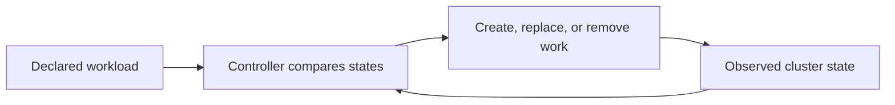
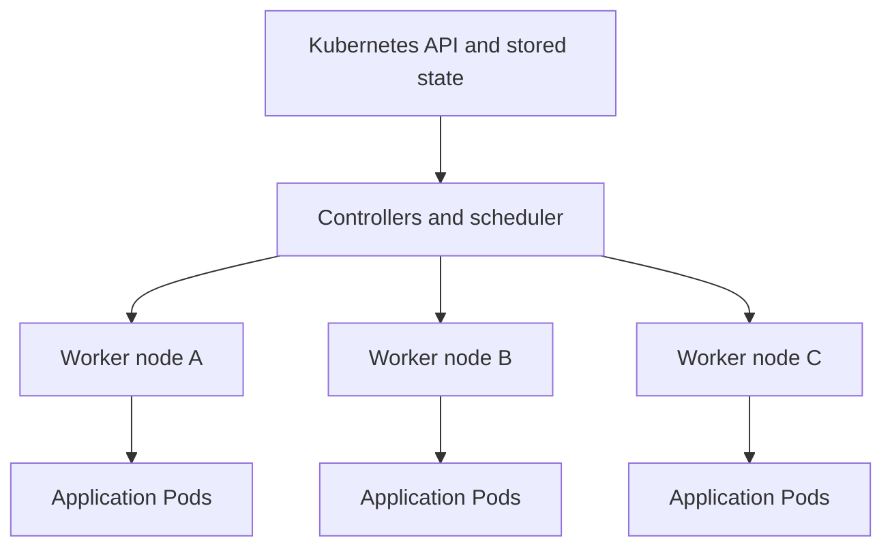
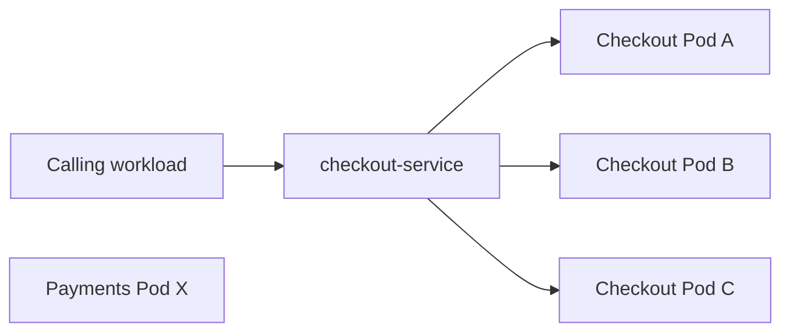
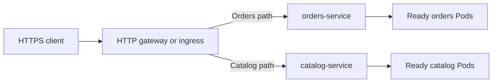
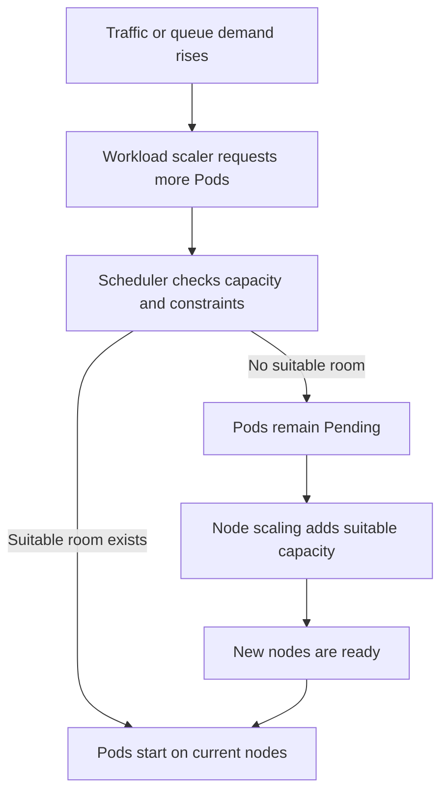
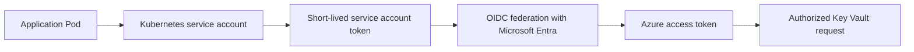
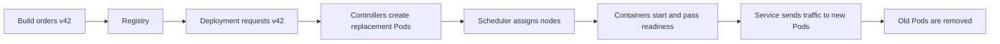

## Table of Contents

1. [What Is AKS and How Is the Cluster Structured?](#what-is-aks-and-how-is-the-cluster-structured)
2. [What Do the Control Plane and Nodes Do?](#what-do-the-control-plane-and-nodes-do)
3. [How Do Pods, Deployments, and Services Run Applications?](#how-do-pods-deployments-and-services-run-applications)
4. [How Does Ingress Reach Workloads?](#how-does-ingress-reach-workloads)
5. [How Do Node Pools and Scaling Work?](#how-do-node-pools-and-scaling-work)
6. [How Do Identity and Networking Protect Connectivity?](#how-do-identity-and-networking-protect-connectivity)
7. [What Must Teams Operate in Production?](#what-must-teams-operate-in-production)
8. [When Is AKS the Right Fit?](#when-is-aks-the-right-fit)
9. [Check Your Answers](#check-your-answers)

Running a container on one machine is straightforward. Running hundreds of applications across many machines raises different questions. Which machine should run each container? How many copies should there be? What should happen if a machine fails? How do requests find the replacement containers, and how does a new application version reach users without stopping everything first?

Kubernetes coordinates that work. You describe the workloads you want, and its controllers keep comparing that description with what is actually running. Azure Kubernetes Service, or **AKS**, provides Kubernetes on Azure with a managed control plane and integrations for Azure compute, networking, storage, identity, and monitoring. Your application still follows the Kubernetes model; AKS changes how much of the supporting platform you have to operate.

To understand that model, we will connect the container process to the machines that run it, then follow requests, scaling decisions, and failures through these questions:

1. **What Is AKS and How Is the Cluster Structured?**
2. **What Do the Control Plane and Nodes Do?**
3. **How Do Pods, Deployments, and Services Run Applications?**
4. **How Does Ingress Reach Workloads?**
5. **How Do Node Pools and Scaling Work?**
6. **How Do Identity and Networking Protect Connectivity?**
7. **What Must Teams Operate in Production?**
8. **When Is AKS the Right Fit?**

## What Is AKS and How Is the Cluster Structured?
<!-- section-summary: AKS runs Kubernetes on Azure, where a managed control plane maintains declared workloads across a set of worker machines. -->

A container image packages an application with its runtime, libraries, and filesystem content. Starting a container from that image starts one or more processes. The image is the packaged artifact; the container is a running instance of it. The process still needs CPU time, memory, storage access, and networking from a real machine.

A virtual machine provides a guest operating system on virtualized hardware. A container normally shares its host's kernel while keeping its process environment isolated. These are different boundaries, not competing descriptions of the same thing: an Azure VM can be the machine on which several container processes run.

Now imagine three machines, called nodes A, B, and C, running ten copies of a web application. Node A runs copies 1–4, B runs 5–7, and C runs 8–10. If node B fails, three copies disappear. Restoring ten copies might mean starting copy 5 on A and copies 6 and 7 on C. Someone must notice the failure, find suitable capacity, start replacements, and update the traffic path.

Manual placement is manageable for a small experiment. It is not a useful operating model for 500 nodes, 10,000 containers, and 100 applications that deploy continuously. Machines fail, demand changes, and applications ask for different amounts of CPU and memory or different network access. The system needs a scheduler and a continuing control process, not just a command that starts containers once.

### Describe the result you need

Kubernetes starts with **desired state**: the application configuration you ask the platform to maintain. For example, you might request five copies of `checkout-api`, using image `checkout:v17`, with each copy requesting `500m` of CPU and `1Gi` of memory. The CPU quantity means half of one CPU unit; the memory quantity expresses the capacity the workload asks the scheduler to reserve for placement.

The observed state might contain five healthy copies now and only four a moment later. A controller compares desired and observed state and starts another copy. This repeated comparison is **reconciliation**. It is not limited to the moment you submit a deployment.


```mermaid
flowchart LR
    D[Declared workload] --> C[Controller compares states]
    A[Observed cluster state] --> C
    C --> X[Create, replace, or remove work]
    X --> A
```

If the desired count is four and the actual count is three, the controller works toward adding one. If five copies remain where four are intended, it works toward removing the extra copy, accounting for the rollout or termination state. The important distinction is between declaring **what should exist** and manually specifying every action needed to get there.

This also explains why a Kubernetes manifest is not proof of success. It records the requested state. Actual capacity, startup errors, permissions, and health can prevent the platform from reaching it. The same desired-state model that automates recovery makes the gap between intention and reality an essential operational signal.

### What Azure supplies

AKS is a managed Kubernetes service, not a replacement for Kubernetes. You still use Kubernetes workloads, scheduling, Services, and policies. Azure operates the managed control plane and connects the cluster to Azure infrastructure. Node-management responsibilities depend on the AKS mode you choose.

A **cluster** contains the control plane and worker nodes. The control plane exposes the Kubernetes API, stores cluster state, runs controllers, and makes scheduling decisions. Worker nodes supply the execution capacity. They run the node agent, called the **kubelet**, a container runtime, and the application Pods assigned to them.


```mermaid
flowchart TB
    API[Kubernetes API and stored state] --> CT[Controllers and scheduler]
    CT --> A[Worker node A]
    CT --> B[Worker node B]
    CT --> C[Worker node C]
    A --> PA[Application Pods]
    B --> PB[Application Pods]
    C --> PC[Application Pods]
```

The cluster presents these machines as a pool that can host declared work. That does not make the machines identical or remove their limits. It gives Kubernetes a common way to reason about available resources, workload requirements, and placement.

### Automatic and Standard

AKS offers **Automatic** and **Standard** modes. Microsoft's August 2026 guidance recommends Automatic as the starting point for most production workloads. It provides a more managed experience with production-oriented defaults for node management, scaling, monitoring, security, and upgrades. The aim is to reduce the number of platform decisions a team must assemble before running applications.

Standard gives the team more explicit control over cluster and node-pool configuration. For example, a team might configure a general-purpose D-series pool that can grow from three to ten nodes, alongside a memory-oriented pool that can grow from two to twenty. It also chooses more of the networking, upgrade, autoscaling, and scheduling behavior itself.

Neither mode removes the application contract. The team still needs to describe the right workload, grant appropriate access, protect its data, and verify user-facing behavior. The mode primarily changes the division of platform work beneath that contract.

## What Do the Control Plane and Nodes Do?
<!-- section-summary: The control plane decides what should run and where; nodes provide the CPU, memory, runtime, and local resources that execute it. -->

The control plane answers questions such as: How many copies should exist? Which are missing? Where can another copy fit? Has a configuration changed? Which workload needs replacement or reconciliation? It coordinates those decisions through the Kubernetes API and the controllers that watch stored state.

The workers do a different job. If a checkout container is running in Pod 42 on node 7, its instructions execute using node 7's CPU and memory. They do not execute on the API server merely because the API accepted the workload. A cluster offering 200 CPUs gets that application capacity from its workers.

This separation helps when diagnosing failures. A responsive control plane can accept a workload that cannot yet run because the workers are full. Conversely, existing containers may still be doing useful work while a control-plane operation has a problem. Management and execution are related, but they are not one process.

### What a worker contains

An AKS node is usually an Azure VM with the software required to participate in the cluster. Its kubelet receives the workload assignments relevant to that node and helps keep their containers running. The container runtime starts those containers. Node networking and local resources support their execution.

An application asking for one CPU and `2Gi` of memory is asking for a place within this worker capacity. The scheduler must find a node that can satisfy the request together with the workload's other constraints. A node with spare memory but insufficient CPU may not be suitable, and a suitable resource shape may still be excluded by placement rules.

Consider a node with eight CPUs and 16 GiB of memory. Three proposed Pods have these requests:

| Pod | CPU request | Memory request |
| --- | --- | --- |
| Pod 1 | 2 CPUs | 4 GiB |
| Pod 2 | 3 CPUs | 6 GiB |
| Pod 3 | 4 CPUs | 8 GiB |

Together they ask for nine CPUs, more than the node provides. Pods 1 and 2 can fit together on node A; Pod 3 needs another suitable node, such as B. The scheduler cannot make the three requests fit simply because the containers are small packages or because the cluster accepts their definitions.

Resource requests are therefore a **scheduling contract**. They make placement possible before the application runs. They should describe the resources the workload actually needs well enough for the platform to make useful decisions. A request that does not represent the application can produce apparently surprising behavior later, even though Kubernetes is following the declaration correctly.

### Requests and limits serve different purposes

A **request** influences scheduling. A **limit** constrains how much of a resource a container may consume. The distinction matters when checkout, payments, and search share a node. The scheduler needs requests to decide whether they fit; runtime limits help bound how much one application can consume at the expense of the others.

For example, a search process with uncontrolled memory growth can harm neighboring workloads. Resource controls reduce that risk, but unsuitable settings can harm the application too. A limit that is too restrictive or requests that badly misrepresent demand are not made safe by being explicit in YAML. The declared values need to match observed execution.

Scheduling also respects non-resource requirements. Some applications need a GPU, a particular operating system, or placement away from another replica. The scheduler chooses among nodes that satisfy the complete set of requirements, rather than looking only for any machine with a low CPU percentage.

### Machines are replaceable capacity

The worker abstraction changes how you think about application placement. With a manually operated VM, you may identify a service by the machine where you installed it. With Kubernetes, you identify the workload and let the platform choose a suitable location. A replacement can run on a different node without changing what the workload is intended to provide.

That flexibility depends on application design. A process that stores its only durable data in a temporary local directory, assumes one fixed Pod address, or cannot tolerate a restart is difficult to move safely. Kubernetes can replace a process, but it cannot infer how to reconstruct data that the application discarded with its old location.

Node failure is therefore not an instruction to recover the exact same process identity. It is an instruction to restore the desired workload using available capacity. We will use that distinction again when looking at Pods, storage, scaling, and failure recovery.

## How Do Pods, Deployments, and Services Run Applications?
<!-- section-summary: Pods group closely related containers, Deployments maintain application replicas, and Services provide stable access to changing Pod addresses. -->

A **Pod** is Kubernetes' smallest scheduling unit. It contains one container or a small set of containers that belong together. Containers inside a Pod share a network context and can share storage. The scheduler places the Pod as a unit, so its containers travel together rather than being independently scattered across the cluster.

A web application with a closely related telemetry sidecar is one example. The sidecar supports that application instance, so placing them together makes sense. This is different from grouping every service in an application into one Pod. Independent services usually need independent deployment and scaling decisions.

### A Pod is not a permanent server

Suppose Pod A uses address `10.2.4.17`. If it disappears, its replacement, Pod B, might use `10.2.7.83`. Pod B fulfills the workload requirement without preserving Pod A's address or identity. Applications should not treat an individual Pod IP as a permanent place to send requests.

The same principle applies to replication. Four Pods are four running copies, not four uniquely named servers that operators should maintain by hand forever. Kubernetes is designed to start replacements and adjust their placement while keeping the declared application available.

A **Deployment** manages this pattern for replicated applications. It specifies the desired Pod template and replica count, and its controllers work toward that state. A conceptual declaration can be as small as:

```yaml
application: checkout
image: checkout:v12
replicas: 4
```

This is a compact description of the intent, not a complete Kubernetes manifest to apply. The important fields are the image and count: run four copies of this application version. If a copy disappears, the controllers create a replacement instead of relying on an operator to notice and start one manually.

When the image changes from `checkout:v12` to `checkout:v13`, the Deployment can carry out a rolling update. New copies start as old copies are removed according to the rollout policy. With four replicas, you can picture replacement proceeding one copy at a time rather than stopping all four before starting the new version. Health and rollout settings determine whether each step is safe.

### Give clients a stable destination

Replacing Pods creates a networking problem: clients need to find the application even though its individual addresses change. A Kubernetes **Service** provides a stable endpoint in front of the selected Pods. Clients use that endpoint instead of tracking every replacement address.

For example, `checkout-service` can identify the current checkout backends. Selection commonly uses labels. Pods A, B, and C labeled `app: checkout` belong to the checkout Service's selection; Pod X labeled `app: payments` does not. The label relationship connects a stable Service definition to a changing set of application instances.


```mermaid
flowchart LR
    Client[Calling workload] --> Service[checkout-service]
    Service --> A[Checkout Pod A]
    Service --> B[Checkout Pod B]
    Service --> C[Checkout Pod C]
    X[Payments Pod X]
```

This is why a Service and a Deployment solve different problems. The Deployment maintains the requested instances. The Service gives callers a stable route to the appropriate instances. A correct replica count does not automatically provide the route, and a Service with no usable backends cannot serve requests merely because its name exists.

An internal Service supports communication within the cluster. A Service of type `LoadBalancer` can integrate with Azure load balancing to expose a network endpoint. That gets traffic to an application at the IP-and-port level. More detailed HTTP routing belongs to the ingress or gateway layer discussed next.

### Keep persistent data separate from a disposable instance

Writing orders to `/data/orders` inside a container's writable layer does not establish durable storage. Replacing the Pod can discard that local state. The workload needs a storage design that survives the compute instance when the data is supposed to survive it.

Kubernetes **persistent volumes** represent storage that is not tied to the short life of one container. With appropriate backing Azure storage, Pod A can be replaced by Pod B while the persistent data remains available according to that storage design. The core separation is between disposable compute and data with its own lifecycle.

This does not make every stateful application easy to run. Databases and other coordinated systems still require attention to replication, ordering, quorum, backup, recovery, and upgrades. StatefulSets, persistent volumes, stable names, and operators help express and automate parts of that work. They do not remove the distributed-system requirements of the application itself.

Before choosing a workload object, ask what must remain stable. An HTTP process may need replaceable replicas behind a Service. A data system may also need persistent storage and a controlled membership model. Kubernetes provides the building blocks, but the application determines which guarantees are necessary.

## How Does Ingress Reach Workloads?
<!-- section-summary: A load balancer handles IP-and-port delivery, while an ingress or gateway layer routes HTTP requests to Services using hosts and paths. -->

An external endpoint for one application is only part of the traffic problem. Suppose a cluster hosts `shop.example.com`, `api.example.com`, `admin.example.com`, `accounts.example.com`, and `docs.example.com`. You may want those applications to share an HTTPS entry point while still reaching different Services behind it.

You may also want one hostname to route `/shop`, `/api`, and `/admin` differently. That decision requires understanding an HTTP request. An IP address and destination port alone do not say which path the caller requested.

### Layer 4 and layer 7

**Layer 4** routing deals with network transport information such as IP addresses, ports, and protocols. A load balancer can deliver a connection to an appropriate backend without understanding the application's URL structure.

**Layer 7** routing understands application information such as HTTP hostnames, paths, and headers, along with the TLS handling needed for HTTPS. For example, `api.example.com/orders` can go to `orders-service`, while `api.example.com/catalog` goes to `catalog-service`. Both requests can arrive at the same public entry point.

Kubernetes ingress and gateway mechanisms describe this HTTP-aware routing. A controller or gateway implementation performs the actual request handling. Defining a rule is not the same thing as supplying the component that receives and forwards traffic, so the resource and its implementation must be understood together.


```mermaid
flowchart LR
    U[HTTPS client] --> G[HTTP gateway or ingress]
    G -->|Orders path| O[orders-service]
    G -->|Catalog path| C[catalog-service]
    O --> OP[Ready orders Pods]
    C --> CP[Ready catalog Pods]
```

The Service remains useful beneath the gateway. It separates HTTP route selection from the changing set of Pods. The gateway chooses an application destination; the Service identifies its available backends; a container in a selected Pod handles the request.

### Understand the ingress implementation's lifecycle

**Gateway API** is the long-term direction for Kubernetes traffic management. One important migration boundary concerns NGINX: upstream Ingress NGINX maintenance ended in March 2026, while the Azure application-routing NGINX add-on has critical-security-patch support through November 2026. Those dates concern implementation support, not the disappearance of the general need for HTTP routing.

For an existing cluster, the practical work is to identify which implementation serves traffic and plan its migration. For a new design, evaluate the supported gateway path rather than copying an old ingress example without checking what operates it. The underlying relationship remains the same: a request reaches an HTTP routing implementation, which selects a Service and ultimately a usable Pod.

### Follow a complete request

Consider `https://shop.example.com/orders/123`. DNS first directs the client toward the Azure entry point. The edge, load-balancing, and gateway components then bring the request to the appropriate HTTP route. That route selects `orders-service`, which connects the request to one of the ready orders Pods.

The container inside that Pod may then call a database, obtain a secret from Key Vault, or send work to a queue. Those downstream actions are part of completing the request, even though they are outside the ingress decision. A reachable website can still fail if the selected application cannot use its dependencies.

This full path is also a troubleshooting map. Check DNS before assuming the Pod is at fault. Check gateway routing before changing application code. Check Service endpoints and Pod readiness before treating an HTTP failure as a node-capacity issue. Each component should be tested for the part of the request that it actually owns.

## How Do Node Pools and Scaling Work?
<!-- section-summary: Node pools provide different kinds of worker capacity; workload autoscalers request Pods, and node autoscalers provide room for them. -->

A **node pool** groups workers with a shared configuration. Different applications can need different kinds of machines, so one cluster can contain several pools instead of forcing every workload onto one VM shape.

General-purpose API workloads might use one pool, memory-intensive analytics another, GPU workloads another, and legacy Windows containers a Windows pool. AKS also distinguishes **system** pools for critical cluster components from **user** pools for application workloads. This makes the capacity needed to operate the cluster visible alongside the capacity used by its applications.

For example, the cluster might contain system nodes S1 and S2, general application nodes A1–A3, memory-oriented nodes M1 and M2, and GPU node G1. This layout expresses different resource requirements; it is not simply a larger collection of interchangeable machines.

### Express placement requirements

A workload needing one GPU and 8 GiB of memory cannot run on any node that happens to have spare CPU. Its placement must match the hardware requirement. Node labels, selectors, affinity, anti-affinity, taints, tolerations, and topology constraints help express where workloads may or should run.

Labels describe nodes or workloads. Selectors and affinity rules use those descriptions to choose suitable placement. Taints and tolerations control which workloads may enter certain capacity groups. Anti-affinity and topology constraints can spread related instances instead of concentrating them in one failure location.

These constraints are part of the scheduling calculation. Adding another node of the wrong kind does not solve a GPU requirement. Adding capacity in a location excluded by the workload does not make that capacity usable. A Pending Pod may therefore indicate a placement mismatch rather than a simple shortage of total CPUs.

### Pod scaling is not node scaling

An application can need more copies without initially needing more machines. Conversely, an application can request additional copies that cannot run until more machines arrive. These are separate control loops.

The **Horizontal Pod Autoscaler**, or HPA, adjusts the number of workload replicas using configured metrics. If checkout demand grows, it might increase the desired count from three Pods to ten. Kubernetes then tries to place the additional seven Pods on available nodes.

The **Vertical Pod Autoscaler**, or VPA, deals with the resource requests of workloads rather than simply adding more copies. **KEDA** adds event-driven scaling based on signals such as queues. Choosing a scaler starts with deciding which demand signal describes the work and whether the response should change replica count or requested resource size.

Now consider a cluster with 16 CPUs of capacity, 15 of which are already allocated to workload requests. Five new Pods each request one CPU. Only one fits immediately; four remain Pending. Declaring five additional replicas has not created the missing four CPUs.

A **cluster autoscaler** can add nodes to an appropriate pool when unscheduled Pods need more capacity. **Node autoprovisioning** can provision suitable node capacity according to workload requirements. Once the new nodes are ready, the scheduler can place the waiting Pods. Automatic and Standard differ in how much of this capacity management is provided or explicitly configured.


```mermaid
flowchart TB
    D[Traffic or queue demand rises] --> W[Workload scaler requests more Pods]
    W --> S[Scheduler checks capacity and constraints]
    S -->|Suitable room exists| P[Pods start on current nodes]
    S -->|No suitable room| N[Pods remain Pending]
    N --> C[Node scaling adds suitable capacity]
    C --> R[New nodes are ready]
    R --> P
```

The two-loop model explains a common surprise: the desired replica count rises before the running count does. That may be normal while node capacity is being prepared, or it may signal a limit or mismatch that prevents scaling. The observed state distinguishes the two.

### Scale queue workers from queued work

CPU is not always a useful description of demand. A worker may have no work because its queue is empty, or a large amount of work may be waiting before enough workers exist to consume CPU. KEDA can use the queue itself as the demand signal.

For example, zero queued messages can correspond to zero workers, while a backlog of 100,000 messages can require 100 workers. Event-driven scaling connects the number of execution instances to the outstanding work instead of relying only on current processor use.

Those 100 workers still require places to run. Event scaling does not bypass resource requests, node capacity, hardware requirements, or networking. It changes the demand side of the same scheduling system. A complete scaling design therefore joins the event or traffic metric, replica policy, resource requests, placement constraints, and capacity policy.

## How Do Identity and Networking Protect Connectivity?
<!-- section-summary: Network design determines reachable paths, network policy limits workload communication, and separate identity flows authorize people, the platform, and Pods. -->

An AKS application communicates across several boundaries. Pods call other Pods and Services, reach Azure resources, accept permitted external requests, and may need outbound internet access. The design includes the Azure VNet, node addresses, Pod addresses, Service destinations, gateways, and outside systems.

There are two independent questions behind every protected call: can the request reach the destination, and is the caller authorized to use it? Fixing a role assignment will not repair a broken network route. Opening a route will not grant the application permission to read a secret.

### Overlay and flat addressing

In an **overlay** design, nodes receive addresses from the Azure network while Pods use a separate logical address range. For example, nodes might use `10.0.1.10` and `10.0.1.11`, while Pods use `192.168.x.x`. This separates the Pod address space from the VNet addresses used by the machines.

Overlay networking is a common, IP-scalable approach. Its abstraction reduces the need to allocate a VNet address for every Pod. The important planning distinction is that a Pod address and a directly assigned VNet address are not necessarily the same kind of network identity.

In a **flat** design, Pods receive addresses that participate more directly in the Azure VNet address plan. A node might use `10.0.1.10`, while Pods use `10.0.2.41`, `10.0.2.42`, and `10.0.2.43`. This supports direct network integration but requires planning enough address space for the Pod population and its growth.

Neither model eliminates network planning. The choice changes where addresses come from, how connected systems reach workloads, and how cluster scale affects address consumption. Make it with the expected traffic paths and growth in mind, not simply because one diagram looks simpler.

### Reachable does not mean allowed

Network policy restricts communication between workloads using criteria such as Pods, namespaces, and ports. It provides application-level segmentation within a network that otherwise offers broad reachability.

For example, the policy may allow frontend-to-payments and payments-to-database traffic while denying frontend-to-database and analytics-to-payments traffic. The frontend can still use payments, but it does not gain every connection that payments itself needs. This makes the intended dependency relationships explicit.

Policy belongs beside routing and identity, rather than replacing either. A Service can supply the name of a destination, a route can lead toward it, a policy can permit or deny the connection, and the destination can still require a valid identity. Each addresses a different part of the call.

### There is more than one caller

AKS identity has at least three distinct relationships. A human administers Kubernetes through its API. The AKS platform interacts with Azure infrastructure. An application Pod accesses a resource such as Key Vault. These callers have different purposes and should not be treated as one all-powerful credential.

For a human example, Alice runs `kubectl get pods`. Microsoft Entra participates in proving who Alice is, while Kubernetes RBAC or Azure RBAC determines what she is allowed to do. **Authentication** identifies the caller; **authorization** decides whether that caller may perform the requested operation.

Application identity is a separate path. A Pod does not need Alice's credentials to read its own secret. **Microsoft Entra Workload ID** connects a Kubernetes service account to an Azure identity through federation. This lets the application obtain temporary access without embedding a long-lived Azure username and password in its configuration.


```mermaid
flowchart LR
    P[Application Pod] --> S[Kubernetes service account]
    S --> T[Short-lived service account token]
    T --> F[OIDC federation with Microsoft Entra]
    F --> A[Azure access token]
    A --> K[Authorized Key Vault request]
```

The service account identifies the workload within Kubernetes. The cluster's OpenID Connect, or OIDC, relationship provides the basis for federation. Microsoft Entra validates the trusted token relationship and issues an Azure access token. The target resource then evaluates the permissions associated with that identity.

This avoids storing credentials such as `AZURE_USERNAME` and `AZURE_PASSWORD` for the application to reuse indefinitely. It does not mean the Pod receives unrestricted Azure access. The identity still needs the appropriate permission at the destination. Automatic enables OIDC and workload identity by default; Standard requires the relevant configuration to be established explicitly.

Finally, the authorized request still needs a working route and DNS result. The complete dependency check follows both paths: the application's service account and federated identity on one side, and its network path to the resource on the other.

## What Must Teams Operate in Production?
<!-- section-summary: Production checks must connect declared state to ready workloads and successful user requests, while protecting data, capacity, upgrades, and failure recovery. -->

A node can be healthy while an application on it is broken. A Pod can be Running while its container cannot answer HTTP requests. A process can accept HTTP while failing every database operation. None of those lower-level states proves that the user can complete the intended task.

Production operation therefore needs several layers of evidence. At the cluster layer, inspect node availability, scheduler and API behavior, and Pending workloads. At the node layer, examine CPU, memory, disk, networking, and kubelet health. At the workload layer, compare desired and available replicas and investigate restarts, memory failures, and scheduling events.

Application evidence adds request rate, latency, errors, queue behavior, and dependency health. User evidence asks whether the actual operation, such as checkout, succeeds. Automatic supplies more monitoring defaults, but the team still has to interpret whether these signals show a working application.

### Startup, readiness, and liveness

Kubernetes probes express different questions. A **startup probe** gives the application a way to indicate whether initialization has completed. A **readiness probe** indicates whether an instance should receive traffic. A **liveness probe** can identify an instance that needs restarting.

These purposes should not be collapsed into one vague healthy flag. An initializing application may need time, not repeated restart attempts. An application temporarily unable to serve requests may need removal from traffic. A stuck process may need replacement. The response should match the condition being tested.

Suppose a Service has five application Pods, A–E. Pod C cannot reach the database. If traffic continues to be distributed across all five, roughly 20% of requests may fail even though every Pod is still running. A meaningful readiness check can remove C from the serving set while the problem is investigated or repaired.

That example also explains why checking only replica count is insufficient. Five running processes do not imply five usable backends. The health contract must describe the application's ability to do its work closely enough to protect traffic.

### Spread replicas across real failure boundaries

Three replicas on node 1 all disappear if node 1 fails. The count provides process replication, but not resilience to that node failure. Spreading the Pods across different nodes, or across availability zones A, B, and C where required, protects against a larger shared failure.

Topology constraints and anti-affinity express that distribution. Disruption controls help manage planned changes. These mechanisms work with resource requests and available capacity: the cluster must have suitable places to honor the intended spread.

Applications must also tolerate the operations this design assumes. Pods are replaced, addresses change, replicas grow and shrink, and rolling updates overlap versions. A local temporary directory is not an appropriate home for the only durable copy of important data. Recovery requires both replaceable execution and a data design that survives replacement.

### Compare the declaration with the observed result

A manifest may request five replicas while the cluster has three Running, one crash-looping, and one Pending. Similarly, the desired image may be version 27 while two Pods run version 27 and three still run version 26. Reading the manifest alone hides both incomplete outcomes.

The useful investigation asks why reality differs. A Pending Pod needs scheduling evidence. A crash-looping container needs startup and runtime evidence. A partial rollout needs an explanation for why replacements are not progressing or becoming ready. Each state points toward a different next check.

For a failing request, work through the full request path: DNS, the gateway or load balancer, HTTP routing, Service endpoints, Pod readiness, container behavior, node health, scheduling, application-local processing, downstream dependencies, and finally the user's result. This avoids treating every failure as an application bug or every error as an infrastructure incident.

### Operate the platform and the application

Azure takes responsibility for physical infrastructure, the managed control plane, and service integrations, with node responsibilities influenced by the selected mode. The team remains responsible for application architecture, images, manifests, security choices, data, requests and limits, scale policies, health definitions, authorization, and application outcomes.

That work spans reliability, security, performance, operations, upgrades, observability, and cost. A cluster can be functioning as designed while being too expensive, granting excessive access, or lacking enough spare capacity for a rollout. Those are still production problems.

Upgrades include Kubernetes versions, node operating systems, container runtimes, AKS components, add-ons, application images, and dependencies. A more managed mode automates more of the platform lifecycle; it does not prove that an application is compatible with every change. Test the workloads and their integrations as part of that lifecycle.

Kubernetes also introduces a substantial operating vocabulary: clusters, node pools, namespaces, RBAC, network policies, gateways, autoscalers, storage classes, Helm, operators, secrets, monitoring, policy enforcement, upgrades, and GitOps workflows. These tools can form a useful shared platform. They are also responsibilities that should be justified by the workloads they support.

## When Is AKS the Right Fit?
<!-- section-summary: Choose AKS when the Kubernetes workload and platform model solves a real need, then verify deployment, traffic, and recovery across intent, orchestration, and Azure capacity. -->

AKS is a strong fit for many independently deployed services with different scaling requirements, specialized scheduling, varied compute needs, or high-density shared capacity. It also fits teams that need Kubernetes tooling and portability, advanced network controls, custom controllers, or a platform shared across application teams.

For example, teams A, B, and C can deploy through one Kubernetes platform while a platform team maintains shared capabilities. The value is not merely that all three teams use container images. It is that they benefit from the same workload API, scheduling model, policy boundaries, and operational tools.

By contrast, one stateless API with one container, moderate traffic, HTTPS, and simple scaling may fit App Service or Container Apps without requiring a Kubernetes cluster. Container packaging alone does not establish a Kubernetes requirement. The smaller hosting abstraction may already provide the execution and traffic behavior the application needs.

A VM is appropriate when the requirement is control of a particular machine environment. Kubernetes instead asks the team to declare workloads and let a scheduler decide where they fit. Across VMs, AKS Standard, AKS Automatic, Container Apps, and App Service there is a rough progression in management abstraction, but it is not an absolute ranking: different services expose different capabilities and ownership boundaries.

### Follow one deployment through the cluster

The deployment example begins with a developer building `orders:v42` and placing that image in a registry. The Deployment is changed from version 41 to version 42. The API records the new desired state, controllers create the replacement workload, and the scheduler selects suitable nodes.

Nodes A, B, and C start the new Pods. Readiness determines which new instances can receive requests. The Service uses the appropriate ready backends while old Pods are removed according to the rollout behavior. A successful image push is therefore only the first step; it is not evidence that requests already reach version 42.


```mermaid
flowchart LR
    B[Build orders v42] --> R[Registry]
    R --> D[Deployment requests v42]
    D --> C[Controllers create replacement Pods]
    C --> S[Scheduler assigns nodes]
    S --> P[Containers start and pass readiness]
    P --> T[Service sends traffic to new Pods]
    T --> O[Old Pods are removed]
```

Now suppose node B fails while the desired count is three. Only two healthy copies remain. Kubernetes creates replacement Pod D on node C if capacity and constraints permit it, or capacity scaling first supplies another suitable place. The goal is to restore three useful replicas, not to preserve the identity of the lost Pod B.

This recovery depends on the earlier decisions: resource requests must fit, placement must allow recovery, the image must start, readiness must be meaningful, and important state must survive. The controller automates the response to failure, while application and platform design determine whether that response restores useful service.

### Review five connected parts of the design

Begin with **workloads**: which Deployments, StatefulSets, or Jobs are required, which images they run, and how many copies should exist. Then examine **compute**: CPU, memory, GPUs, Linux or Windows requirements, node pools, and zone distribution. Those two parts connect application demand to actual execution capacity.

Next examine **traffic**: Services, Gateway or ingress behavior, load balancers, the VNet, network policies, and DNS. Follow that with **state and identity**: persistent volumes, databases, Key Vault, workload identity, and configuration. Finally examine **change and health**: restarts, HPA, KEDA, node scaling, rolling updates, replacement, and the evidence that each operation succeeds.

These five checks form a useful review order because each answer constrains the next. The requested workloads determine required capacity. Their callers determine traffic routes. Their data and dependencies determine storage and permissions. Their failure behavior determines what scaling, health, and update policies can safely do. Treating the checks as independent forms would miss those relationships.

Azure integrations support the resulting design. Azure VNet and load balancers provide network foundations; Microsoft Entra and Workload ID establish identity; Azure Container Registry stores images; Azure Monitor supplies operational visibility; Azure Storage supports data requirements; and Key Vault supports protected secret access. They complement the Kubernetes objects rather than replacing their meaning.

One compact way to remember the architecture is as three layers. **Intent** says, for example, run five checkout replicas, three payment replicas, and up to 1,000 workers if queued work demands them, with HTTPS and defined resources. **Orchestration** observes, schedules, restarts, scales, routes, and reconciles. **Azure infrastructure** supplies VMs, networks, load balancers, storage, identity, and monitoring.

The same separation helps locate an incident. An incorrect requested replica count is an intent problem. A workload that cannot be scheduled exposes an orchestration and capacity problem. A running workload that lacks permission to read its Azure dependency exposes an identity problem. Following the relationships is more useful than assuming that a green cluster status proves every layer is correct.

That is the central AKS model: declare the application state, let Kubernetes coordinate execution, and use Azure's managed platform and infrastructure to support it. The best reason to choose AKS is that this model solves the team's operating needs—not simply that the application has a container image.

### References

- [What is Azure Kubernetes Service?](https://learn.microsoft.com/en-us/azure/aks/what-is-aks)
- [Introduction to AKS Automatic](https://learn.microsoft.com/en-us/azure/aks/intro-aks-automatic)
- [Core AKS concepts](https://learn.microsoft.com/en-us/azure/aks/core-aks-concepts)
- [AKS networking concepts](https://learn.microsoft.com/en-us/azure/aks/concepts-network)
- [AKS ingress concepts](https://learn.microsoft.com/en-us/azure/aks/concepts-network-ingress)
- [AKS scaling concepts](https://learn.microsoft.com/en-us/azure/aks/concepts-scale)
- [KEDA in AKS](https://learn.microsoft.com/en-us/azure/aks/keda-about)
- [Microsoft Entra Workload ID in AKS](https://learn.microsoft.com/en-us/azure/aks/workload-identity-overview)

## Check Your Answers

:::expand[What Is AKS and How Is the Cluster Structured?]{kind="recap"}
AKS supplies Kubernetes on Azure. Its control plane records desired state and coordinates work across worker nodes, repeatedly correcting differences between the requested and observed workload. Automatic provides more managed production defaults, while Standard exposes more explicit platform control. Both retain the Kubernetes application model.
:::

:::expand[What Do the Control Plane and Nodes Do?]{kind="recap"}
The control plane runs the API, controllers, state management, and scheduling decisions. Worker VMs execute the containers using their CPU, memory, runtime, and networking. Resource requests help the scheduler find a suitable node; limits constrain consumption. A declaration does not create unlimited capacity or override placement requirements.
:::

:::expand[How Do Pods, Deployments, and Services Run Applications?]{kind="recap"}
A Pod groups closely related containers into one scheduling unit. A Deployment maintains the desired replicas and manages changes to their template. A Service supplies stable access to the selected, changing Pod population. Persistent storage needs its own lifecycle because replacing a Pod does not preserve its disposable writable layer.
:::

:::expand[How Does Ingress Reach Workloads?]{kind="recap"}
Layer 4 delivery uses IP addresses and ports. An ingress or gateway layer can understand HTTP hosts and paths and route them to Services, which lead to usable Pods. A route definition needs a supported implementation to handle traffic. DNS, entry-point routing, backend readiness, and application dependencies all matter to the complete request.
:::

:::expand[How Do Node Pools and Scaling Work?]{kind="recap"}
Pools provide different worker configurations for system and application needs. HPA changes replica counts, VPA addresses resource sizing, and KEDA uses event demand. The scheduler places requested Pods; node scaling provides more suitable capacity if they cannot fit. Hardware, placement constraints, and resource requests must match the capacity being added.
:::

:::expand[How Do Identity and Networking Protect Connectivity?]{kind="recap"}
Overlay and flat networking differ in how Pod addresses relate to the VNet. Policies limit permitted workload connections. Human API access, platform access to Azure, and application access to resources are separate identity relationships. Workload ID federates a service account into temporary Azure access, which still requires destination permissions and a working network path.
:::

:::expand[What Must Teams Operate in Production?]{kind="recap"}
Observe cluster, node, workload, application, and user outcomes rather than relying on a Running state. Use startup, readiness, and liveness for their distinct purposes, spread replicas across meaningful failure boundaries, protect persistent data, and compare desired with actual versions and counts. Managed infrastructure does not remove application testing, security, scaling, upgrade, and recovery responsibilities.
:::

:::expand[When Is AKS the Right Fit?]{kind="recap"}
AKS fits workloads and teams that need Kubernetes scheduling, shared platform tools, specialized capacity, advanced policy, or independent service operation. Simpler APIs may need only App Service or Container Apps. A complete design connects declared workloads, orchestration behavior, and Azure infrastructure, then verifies deployment, request delivery, and replacement after failure.
:::
