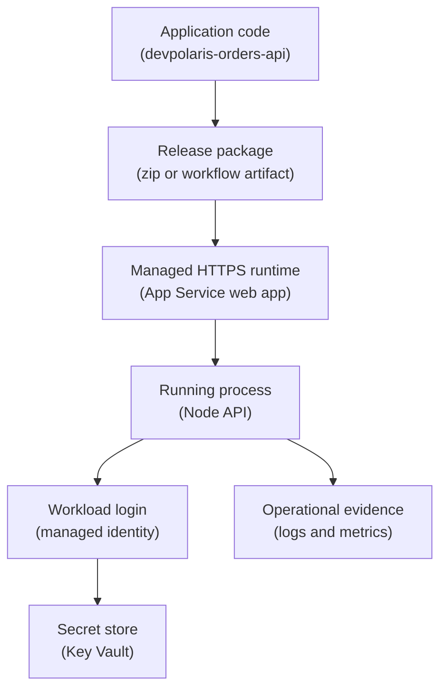

## Table of Contents

1. [The Runtime A Backend Team Wants](#the-runtime-a-backend-team-wants)
2. [The Orders API Shape](#the-orders-api-shape)
3. [App Service Plan Versus Web App](#app-service-plan-versus-web-app)
4. [Deploying A Node Backend](#deploying-a-node-backend)
5. [App Settings And Runtime Configuration](#app-settings-and-runtime-configuration)
6. [Managed Identity And Key Vault Access](#managed-identity-and-key-vault-access)
7. [Logs, Health Checks, And First Diagnosis](#logs-health-checks-and-first-diagnosis)
8. [Deployment Slots And Safer Releases](#deployment-slots-and-safer-releases)
9. [Failure Modes You Will Actually See](#failure-modes-you-will-actually-see)
10. [The Tradeoff You Are Making](#the-tradeoff-you-are-making)

## The Runtime A Backend Team Wants

A backend team often wants one simple promise from the cloud:
give this web app a public HTTPS address, keep the operating system patched, restart the process when it crashes, and give us logs when something goes wrong.
The team does not want to SSH into a VM to install Node.
It does not want to run a Kubernetes cluster just to serve a few API routes.
It wants a managed place where an HTTP backend can live.

Azure App Service is that managed place for web applications, APIs, and mobile backends.
It is a platform as a service, which means Azure owns much of the runtime machinery under your code:
the host operating system, the front-end routing layer, TLS termination, runtime images, deployment hooks, scaling controls, and basic diagnostics.
You still own the application.
You still choose the Node version, app settings, identity, dependencies, health behavior, and release process.

App Service exists because many teams sit between two extremes.
A virtual machine gives deep control, but now someone owns patching, process supervision, disk cleanup, firewall rules, and uptime habits.
A container orchestrator gives scheduling and service discovery, but now the team must understand clusters, nodes, ingress, probes, and rollout controllers.
For many web backends, that is more platform than the app needs.

In the larger Azure map, App Service sits in the compute and application hosting layer.
It is where request-handling code runs.
It usually sits beside a database, a Key Vault, a Log Analytics workspace, and sometimes a storage account or queue.
The app receives traffic through an Azure-managed hostname such as `app-devpolaris-orders-api-prod.azurewebsites.net`, or through your own custom domain after DNS and certificate setup.

This article follows one concrete backend: `devpolaris-orders-api`.
It is a Node service that accepts checkout requests, reads a database connection setting, and exposes a small health endpoint.
We will run it as an App Service web app, configure it through app settings, let it read secrets safely, inspect its logs, and deploy through a staging slot before swapping into production.

> App Service is useful when the app is a web process first, and infrastructure customization is not the lesson you want the application team to learn every week.

### If You Know AWS Hosting Services

If you have learned some AWS before, App Service may remind you of a few different services.
It has a little of Elastic Beanstalk's "bring your app and we manage the host" feeling.
It has a little of App Runner's "run a web service without managing servers" feeling.
It can also feel like a simpler path than putting a small API on ECS or EKS.

That comparison is only an orientation bridge.
Do not turn it into a one-to-one dictionary.
Azure App Service has its own resource model, especially the split between an App Service plan and a web app.
That split matters for cost, scaling, slot behavior, and noisy-neighbor problems between apps that share the same plan.

Here is the useful AWS-to-Azure bridge:

| If you know this AWS idea | Azure App Service idea | What to watch |
|---------------------------|------------------------|---------------|
| A managed web runtime | App Service web app | The app resource owns app settings, hostname, identity, and deployment settings |
| Compute capacity behind the app | App Service plan | The plan owns region, OS, pricing tier, instance size, and scale count |
| IAM role attached to a workload | Managed identity plus Azure RBAC | Identity proves who the app is, while RBAC grants access to target resources |
| CloudWatch logs during debugging | App Service log stream plus Azure Monitor | Log stream is quick for live debugging, Azure Monitor is the longer-term place for queries and alerts |
| Blue-green or staging deployment | Deployment slot | Slots are live apps with hostnames, and they share the same plan resources |

The main habit carries across clouds:
separate code, configuration, identity, and runtime capacity in your head.
If those four ideas blur together, App Service feels magical in the bad way.
If those four ideas stay separate, App Service becomes much easier to operate.

For `devpolaris-orders-api`, the web app is the thing users call.
The plan is the compute pool it runs on.
The app settings are the environment values it reads at startup.
The managed identity is the app's cloud identity when it talks to Key Vault.
Those are related, but they are not the same thing.

## The Orders API Shape

The `devpolaris-orders-api` team starts with a normal Node backend. On a
laptop, a developer runs `npm run dev`, opens
`http://localhost:3000/healthz`, and sees a small JSON response. That
local response is enough for development because one person is testing
one process. A shared production URL needs a managed runtime, stable
configuration, logs, health checks, and a traffic path that does not
depend on one laptop.

Production needs a few more pieces.
The API needs a stable HTTPS hostname.
It needs app settings for environment, feature flags, database location, and logging level.
It needs a way to read secrets without copying passwords into code or pipeline files.
It needs logs that survive the developer closing their terminal.
It needs a health path that tells Azure whether the app is ready to receive traffic.

The first useful shape looks like this:



Read the diagram as a release and runtime story.
The repository produces a deployable package.
App Service runs that package as a managed web app.
The Node process reads configuration from its environment.
When it needs a secret, the managed identity is the app's proof to Azure.
Logs and metrics are the evidence you inspect when the API behaves differently in Azure than it did on your laptop.

The app itself is intentionally ordinary.
It does not know about VM patching.
It does not know which physical host runs it.
It only needs to follow web runtime rules:
listen on the port App Service gives it, fail loudly when required configuration is missing, return a correct health response, and write useful logs to stdout or stderr.

For an Express-style Node app, the port rule is small but important:

```js
const express = require("express");

const app = express();
const port = process.env.PORT || 3000;

app.get("/healthz", async (req, res) => {
  res.status(200).json({ status: "ok", service: "devpolaris-orders-api" });
});

app.listen(port, () => {
  console.log(`devpolaris-orders-api listening on ${port}`);
});
```

The fallback `3000` is for local development.
In App Service, the important value is `process.env.PORT`.
If the process ignores that value and listens on a hardcoded port, Azure can start the app process but still fail to route traffic to it.

## App Service Plan Versus Web App

The most common beginner confusion is the difference between the App Service plan and the web app.
The names sound similar, but they answer different operating questions.

An App Service plan is the compute container for one or more apps.
It decides the operating system, region, pricing tier, VM size, and number of instances.
If you scale the plan out to three instances, the apps in that plan run across those instances.
If multiple apps share the same plan, they share the same underlying compute.

A web app is the application resource.
It owns the hostname, app settings, runtime stack, deployment configuration, managed identity, custom domains, TLS bindings, health check path, and slots.
When you say "deploy the orders API", you usually deploy to the web app.
When you say "give it more CPU or another instance", you usually scale the plan.

For `devpolaris-orders-api`, a production naming shape might be:

| Resource | Example Name | Beginner Meaning |
|----------|--------------|------------------|
| Resource group | `rg-devpolaris-orders-prod` | The folder for related production resources |
| App Service plan | `asp-devpolaris-orders-prod` | The compute pool and pricing choice |
| Web app | `app-devpolaris-orders-api-prod` | The actual web API resource |
| Staging slot | `app-devpolaris-orders-api-prod/staging` | A live pre-production copy under the same app |
| Key Vault | `kv-devpolaris-orders-prod` | The secret store the app can read from |

The plan choice is also a cost and isolation choice.
Putting several small internal tools in one plan can be sensible because the plan cost is shared.
Putting a busy checkout API in the same plan as unrelated experiments is risky because they compete for the same CPU and memory.
The plan is dedicated at the plan level, not at the per-app level.

This is one of those places where managed does not mean thought-free.
App Service removes VM administration.
It does not remove capacity planning.
If the plan is overloaded, every app sharing that plan can feel slow or unstable.

A careful production habit is to ask:
does this app deserve its own plan, or can it safely share?
For `devpolaris-orders-api`, the checkout path is user-facing and revenue-sensitive.
That is a strong reason to put it in its own plan once traffic is real.

## Deploying A Node Backend

Deployment should feel boring when the shape is healthy.
The app is built, packaged, uploaded, started, and checked.
If the deployment path is unclear, every production problem becomes harder because you cannot tell whether the code, the runtime, or the configuration changed.

For a first App Service deployment, the team can use Azure CLI, GitHub Actions, Azure DevOps, Visual Studio Code, or another supported path.
The exact tool matters less than the contract:
the package must contain the files the Node app needs, the web app must use a supported Node runtime, and the start command must launch the server process.

One simple CLI-shaped setup looks like this:

```bash
$ az group create \
  --name rg-devpolaris-orders-prod \
  --location uksouth

$ az appservice plan create \
  --name asp-devpolaris-orders-prod \
  --resource-group rg-devpolaris-orders-prod \
  --is-linux \
  --sku P1v3

$ az webapp create \
  --name app-devpolaris-orders-api-prod \
  --resource-group rg-devpolaris-orders-prod \
  --plan asp-devpolaris-orders-prod \
  --runtime "NODE:24-lts"

$ az webapp deploy \
  --name app-devpolaris-orders-api-prod \
  --resource-group rg-devpolaris-orders-prod \
  --src-path dist/devpolaris-orders-api.zip
```

The runtime value is an example, not a value to memorize forever.
Azure-supported runtimes change as language versions age.
Before you standardize a runtime in a template, check what App Service supports in your subscription and region:

```bash
$ az webapp list-runtimes --os linux | grep NODE
NODE:22-lts
NODE:24-lts
```

The web app then needs evidence that the deployment is alive.
The first check should be boring and external:

```bash
$ curl -i https://app-devpolaris-orders-api-prod.azurewebsites.net/healthz
HTTP/2 200
content-type: application/json; charset=utf-8

{"status":"ok","service":"devpolaris-orders-api","version":"2026.05.03.1"}
```

That response tells you three things.
Azure can route HTTPS traffic to the app.
The Node process is listening on the expected port.
The app code reached the health route and returned a successful response.

The `package.json` should make startup obvious to both humans and App Service:

```json
{
  "name": "devpolaris-orders-api",
  "scripts": {
    "start": "node server.js",
    "build": "npm run lint && npm test"
  },
  "engines": {
    "node": ">=24 <25"
  }
}
```

Do not hide production startup behind a local-only command such as `npm run dev`.
Development commands often watch files, load local `.env` files, or start with debug flags.
Production startup should be direct, repeatable, and easy to find during an incident.

## App Settings And Runtime Configuration

The same code should run in development, staging, and production.
The differences should mostly come from configuration.
For App Service, configuration usually starts with app settings.
An app setting is a name and value stored on the web app resource and injected into the running process as an environment variable.

That means Node reads App Service settings the same way it reads local environment variables:
`process.env.NODE_ENV`, `process.env.ORDERS_DB_URL`, `process.env.LOG_LEVEL`, and so on.
This is a good fit for twelve-factor style applications, where code and config are separate.

A realistic production settings snapshot might look like this:

```text
App settings for app-devpolaris-orders-api-prod

Name                         Value
---------------------------  ------------------------------------------------------------
NODE_ENV                     production
APP_ENV                      production
LOG_LEVEL                    info
ORDERS_REGION                uk
ORDERS_DB_URL                @Microsoft.KeyVault(SecretUri=https://kv-devpolaris-orders-prod.vault.azure.net/secrets/orders-db-url/5c24...)
PAYMENTS_BASE_URL            https://payments.devpolaris.example
WEBSITE_RUN_FROM_PACKAGE     1
```

Notice what is not in that list as a plain value:
the database password.
App settings are encrypted at rest, but that does not make them a full secret-management system.
If a value is sensitive, long-lived, rotated, or audited separately, Key Vault is usually the better home.

There is another operational detail that surprises people:
changing app settings restarts the app.
That restart is reasonable because the process environment is created at startup.
It also means configuration changes are deployments in practice.
Treat them with the same care you use for code changes.

For the orders API, the app should validate required settings at startup and fail clearly if one is missing.
That feels strict, but it prevents a worse failure where the app starts, accepts traffic, and only fails when the first customer places an order.

```text
2026-05-03T08:22:19.114Z INFO  config loaded app=devpolaris-orders-api env=production
2026-05-03T08:22:19.116Z ERROR config missing required setting ORDERS_DB_URL
2026-05-03T08:22:19.117Z ERROR startup aborted reason=ConfigError
```

This log is useful because it names the missing setting.
It does not print the secret value.
That is the balance you want:
enough evidence for diagnosis, not enough data to leak credentials.

Some settings should differ between slots.
For example, a staging slot should usually point at a staging database and staging payment endpoint.
Those settings need to be marked as slot-specific, sometimes called sticky settings, so they stay with the slot during a swap.
We will come back to that when we talk about deployment slots.

## Managed Identity And Key Vault Access

Backend services often need secrets:
database connection strings, API keys for third-party services, signing keys, or private endpoints to other systems.
The risky path is to copy those secrets into source code, GitHub secrets, deployment logs, or plain app settings.
The safer path is to give the running app an Azure identity and let it read the secret from Key Vault.

A managed identity is an Azure-managed workload identity.
Workload identity means an identity used by software, not by a human user.
The web app does not own a password for this identity.
Azure creates the identity in Microsoft Entra ID, and the App Service runtime lets the app request tokens for it.

There are two common ways this appears with App Service:

| Pattern | How The App Gets The Secret | Good Fit |
|---------|-----------------------------|----------|
| Key Vault reference in app settings | App Service resolves the secret and exposes it as an environment variable | Existing app expects `process.env.ORDERS_DB_URL` |
| App code uses Azure SDK | The Node app calls Key Vault directly using `DefaultAzureCredential` | App needs secret versions, dynamic reads, or richer Key Vault behavior |

For a first backend, Key Vault references are a gentle bridge.
The app still reads `process.env.ORDERS_DB_URL`.
The value stored in App Service is not the secret itself.
It is a reference that tells App Service where to read the secret.

The setup has three moving parts:
the app gets a managed identity, Key Vault grants that identity permission to read secrets, and the app setting points at the secret URI.
A CLI-shaped setup can look like this:

```bash
$ az webapp identity assign \
  --name app-devpolaris-orders-api-prod \
  --resource-group rg-devpolaris-orders-prod

$ principal_id=$(az webapp identity show \
  --name app-devpolaris-orders-api-prod \
  --resource-group rg-devpolaris-orders-prod \
  --query principalId \
  --output tsv)

$ vault_id=$(az keyvault show \
  --name kv-devpolaris-orders-prod \
  --resource-group rg-devpolaris-orders-prod \
  --query id \
  --output tsv)

$ az role assignment create \
  --assignee "$principal_id" \
  --role "Key Vault Secrets User" \
  --scope "$vault_id"
```

The role assignment is the permission step that makes the identity
useful. Without it, the identity exists but Key Vault still rejects the
read, which is a common beginner mistake: the app has an identity, but
Key Vault has not been told to trust it.

Then the app setting can use a Key Vault reference:

```bash
$ az webapp config appsettings set \
  --name app-devpolaris-orders-api-prod \
  --resource-group rg-devpolaris-orders-prod \
  --settings ORDERS_DB_URL='@Microsoft.KeyVault(SecretUri=https://kv-devpolaris-orders-prod.vault.azure.net/secrets/orders-db-url/5c24f...)'
```

Some teams prefer a user-assigned managed identity for production.
That identity is its own Azure resource and can survive web app recreation.
If you use a user-assigned identity for Key Vault references, App Service also needs to know which identity should resolve those references.
That is where the `keyVaultReferenceIdentity` property matters.

Use system-assigned identity when one web app owns one identity and the
lifecycle can stay attached to that app. Use user-assigned identity when
identity and permissions need a separate lifecycle. Share one identity
across many apps only when those apps truly need the same access.

## Logs, Health Checks, And First Diagnosis

For production, ask what evidence proves the app is doing the right
thing. For App Service, the beginner evidence usually comes from three
places: the app's own console logs, App Service platform logs, and Azure
Monitor metrics or queries.

During early debugging, log stream is the fastest feedback loop.
It shows output written by your app and some platform events.
For a Node app, that usually means `console.log`, `console.warn`, and `console.error` messages, plus startup and deployment signals.

```bash
$ az webapp log config \
  --name app-devpolaris-orders-api-prod \
  --resource-group rg-devpolaris-orders-prod \
  --docker-container-logging filesystem \
  --level Info

$ az webapp log tail \
  --name app-devpolaris-orders-api-prod \
  --resource-group rg-devpolaris-orders-prod
```

In the stream, you want startup logs that name the version, environment, and listening port:

```text
2026-05-03T08:41:17.394Z INFO  boot service=devpolaris-orders-api version=2026.05.03.1
2026-05-03T08:41:17.421Z INFO  config env=production region=uk logLevel=info
2026-05-03T08:41:17.498Z INFO  server listening port=8080
2026-05-03T08:41:18.203Z INFO  health status=ok db=reachable
```

Those four lines are better than a cheerful `started`.
They tell you which build is running, which environment it believes it is in, which port it chose, and whether the health path can reach the dependency you care about.

Azure [Health check](https://learn.microsoft.com/en-us/azure/app-service/monitor-instances-health-check) is the runtime side of that same evidence habit.
You choose a path such as `/healthz`.
App Service pings that path on app instances.
A healthy response should be a `200`-level response only when the app is actually ready to receive traffic.

For the orders API, `/healthz` should not perform a full checkout.
That would be too expensive and risky.
It should verify the pieces that make the process safe to route to:
the server is initialized, required configuration is present, and the database connection can answer a light check.

```text
GET /healthz

200 OK
{
  "status": "ok",
  "service": "devpolaris-orders-api",
  "version": "2026.05.03.1",
  "checks": {
    "config": "ok",
    "database": "ok"
  }
}
```

If the database is unreachable during startup, a `503` is more honest than a fake `200`.
The load balancer should not send checkout traffic to a process that already knows it cannot complete checkout requests.

Java only changes this discussion when startup and health behavior change.
A Spring Boot app may need Actuator readiness checks, and a JVM service may take longer to warm up than a small Node process.
The App Service lesson stays the same:
choose a health path that means "ready for traffic", not merely "a process exists."

For longer-term operations, log stream is not enough.
You usually connect App Service to Application Insights or route logs and metrics through Azure Monitor so you can query errors over time, create alerts, and compare behavior before and after a deployment.
Live logs help during the moment.
Stored telemetry helps after the moment.

## Deployment Slots And Safer Releases

Deploying directly to production is simple until the first bad release.
The safer App Service pattern is to create a [deployment slot](https://learn.microsoft.com/en-us/azure/app-service/deploy-staging-slots).
A slot is a live app with its own hostname, content, and many of its own settings.
You can deploy the new version to `staging`, warm it up, test it, and then swap it with production.

Slots are available in the Standard, Premium, and Isolated tiers.
They are not separate compute pools.
They run on the same App Service plan, which means they share capacity with the production app.
That is good for fast swaps, but it means a load test against staging can still consume plan resources.

The basic flow looks like this:

```bash
$ az webapp deployment slot create \
  --name app-devpolaris-orders-api-prod \
  --resource-group rg-devpolaris-orders-prod \
  --slot staging

$ az webapp deploy \
  --name app-devpolaris-orders-api-prod \
  --resource-group rg-devpolaris-orders-prod \
  --slot staging \
  --src-path dist/devpolaris-orders-api.zip

$ curl https://app-devpolaris-orders-api-prod-staging.azurewebsites.net/healthz
{"status":"ok","service":"devpolaris-orders-api","version":"2026.05.03.2"}
```

That `curl` check matters.
A slot is not a label on a deployment.
It is a real app endpoint.
You can call it before users see it.

Before swapping, inspect the settings that should stay with each slot.
Production should keep production database settings.
Staging should keep staging database settings.
If `ORDERS_DB_URL` points to a different database per slot, mark it as slot-specific.

```text
Slot setting review

Setting              Production value source        Staging value source          Sticky?
-------------------  -----------------------------  ----------------------------  -------
ORDERS_DB_URL        Key Vault: orders-db-prod       Key Vault: orders-db-staging  yes
PAYMENTS_BASE_URL    https://payments.example        https://sandbox-payments...   yes
LOG_LEVEL            info                            debug                         yes
FEATURE_NEW_TAX      false                           true                          no
```

The `FEATURE_NEW_TAX` example is deliberately different.
If the feature flag is part of the release, you might want it to swap with the code.
If the setting describes the environment, such as database or payment endpoint, it usually should stay with the slot.

After the staging slot is warm and the checks pass, the swap moves the staged version into production:

```bash
$ az webapp deployment slot swap \
  --name app-devpolaris-orders-api-prod \
  --resource-group rg-devpolaris-orders-prod \
  --slot staging \
  --target-slot production
```

Slots encourage a useful operating habit: deploy somewhere real, test
through a real hostname, warm the runtime, inspect logs, then move
traffic. That habit catches a surprising number of mistakes before
customers do.

## Failure Modes You Will Actually See

App Service removes a lot of infrastructure work, but it does not remove failure.
It changes the first places you look.
Instead of checking `systemctl status` on a VM, you inspect app settings, runtime stack, deployment logs, log stream, health check status, and plan metrics.

Here are the beginner failure shapes worth learning early:

| Symptom | Likely Cause | First Check | Fix Direction |
|---------|--------------|-------------|---------------|
| Default App Service page or old version appears | Package did not deploy where the app starts from | Deployment logs and `wwwroot` package shape | Rebuild package with correct root files, then redeploy |
| App shows application error after deploy | Node process crashed at startup | Log stream | Fix missing setting, bad start command, or runtime mismatch |
| Requests time out during startup | App is not listening on `process.env.PORT` | Startup logs and Node server code | Read `process.env.PORT` and log the chosen port |
| Key Vault reference is unresolved | Managed identity lacks secret access or wrong vault URI | App settings reference status and Key Vault role assignment | Grant `Key Vault Secrets User` or fix the secret URI |
| Staging worked, production broke after swap | Environment-specific setting swapped accidentally | Slot setting review | Mark database, payment, and environment settings as slot-specific |
| Health check says unhealthy | Path redirects, returns 500, or app is not fully warm | Health check path, status code, app logs | Return 200 only when ready, avoid redirects on the health path |
| All apps in the plan feel slow | Plan resources are shared or undersized | App Service plan CPU and memory metrics | Scale the plan or isolate the busy app into its own plan |

A port failure often looks more mysterious than it is.
The app may be running, but Azure cannot route traffic to the port the platform expects.
You might see a startup signal like this:

```text
2026-05-03T09:15:42.317Z INFO  server listening port=3000
2026-05-03T09:19:11.026Z ERROR site startup failed
2026-05-03T09:19:11.027Z ERROR app did not respond to HTTP pings on the expected port
```

There is no VM firewall to open because App Service owns the host layer.
Fix the app code instead: listen on `process.env.PORT`, log it during
startup, and make sure the start command runs the server file you
expect.

A Key Vault failure has a different shape.
The app may start, but the secret value is missing or the Key Vault reference status shows an access problem.

```text
2026-05-03T09:31:04.781Z ERROR config missing required setting ORDERS_DB_URL
2026-05-03T09:31:04.782Z ERROR hint Key Vault reference may be unresolved
```

The diagnosis path is identity first, permission second, URI third.
Does the web app have the managed identity you expect?
Does that identity have secret read permission on the vault?
Does the app setting point at the correct secret URI and version?

Slot failures usually come from a different mental mistake.
The team treats staging as a copy of production, but some settings should not copy.
If staging points at a sandbox payment provider and production points at the real provider, those values must stay attached to their slots.
Otherwise, a swap can put a good build into production with the wrong environment wiring.

The pattern is easier to operate when you keep evidence close:
logs for startup, app settings for configuration, identity for secret access, health check for readiness, plan metrics for capacity, and slot settings for release safety.

## The Tradeoff You Are Making

App Service is a trade.
You gain a managed web runtime with HTTPS entry points, built-in deployment paths, app settings, managed identity support, logs, health checks, custom domains, TLS, scale controls, and deployment slots.
You do not need to patch the operating system or build a web hosting platform before your backend can receive traffic.

You give up some low-level control.
You do not treat the host like your personal VM.
You do not rely on writing durable files into the application directory.
You do not install arbitrary system services and expect them to live forever.
You work with the runtime shapes App Service supports.

That is usually a good trade for a web backend like `devpolaris-orders-api`.
The app is an HTTP process.
It needs configuration, identity, logs, health, and careful releases.
It does not need custom kernel modules, privileged containers, sidecar-heavy service mesh behavior, or a scheduler for many different long-running workloads.

If the app later needs event-driven scale-to-zero, complex container composition, many internal services, or Kubernetes-native deployment objects, Azure Container Apps or Azure Kubernetes Service may become a better fit.
If it needs full OS control, a VM may be the honest answer.
But for a team that wants a reliable HTTPS home for a Node API without becoming a platform team first, App Service is a strong early choice.

The practical checklist before a production release is short:
the plan has enough capacity, the app listens on `process.env.PORT`, required app settings exist, secrets come from Key Vault or another controlled secret store, the managed identity has only the access it needs, logs show the correct version, `/healthz` means ready, and staging has been warmed before the swap.

The checklist keeps a managed service understandable when real users
depend on it. Each item gives the next engineer a specific place to
inspect before they change traffic, config, identity, or scale.

---

**References**

- [App Service overview](https://learn.microsoft.com/en-us/azure/app-service/overview) - Microsoft's overview of App Service as a managed host for web apps, APIs, supported stacks, custom containers, and platform features.
- [Azure App Service plans](https://learn.microsoft.com/en-us/azure/app-service/overview-hosting-plans) - The official explanation of plans, shared compute, scaling behavior, tiers, and why apps in the same plan compete for resources.
- [Configure a Node.js app for Azure App Service](https://learn.microsoft.com/en-us/azure/app-service/configure-language-nodejs) - The key Node-specific reference for supported runtimes, startup behavior, `process.env.PORT`, app settings, and logs.
- [Configure an App Service app](https://learn.microsoft.com/en-us/azure/app-service/configure-common) - The official guide to app settings as environment variables, restarts after configuration changes, and common runtime configuration.
- [Managed identities for Azure App Service](https://learn.microsoft.com/en-us/azure/app-service/overview-managed-identity) - The App Service managed identity reference for system-assigned and user-assigned identities and target resource access.
- [Use Key Vault references as app settings](https://learn.microsoft.com/en-us/azure/app-service/app-service-key-vault-references) - The official guide for resolving Key Vault secrets through App Service app settings with managed identity.
