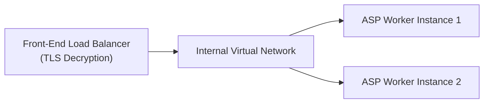
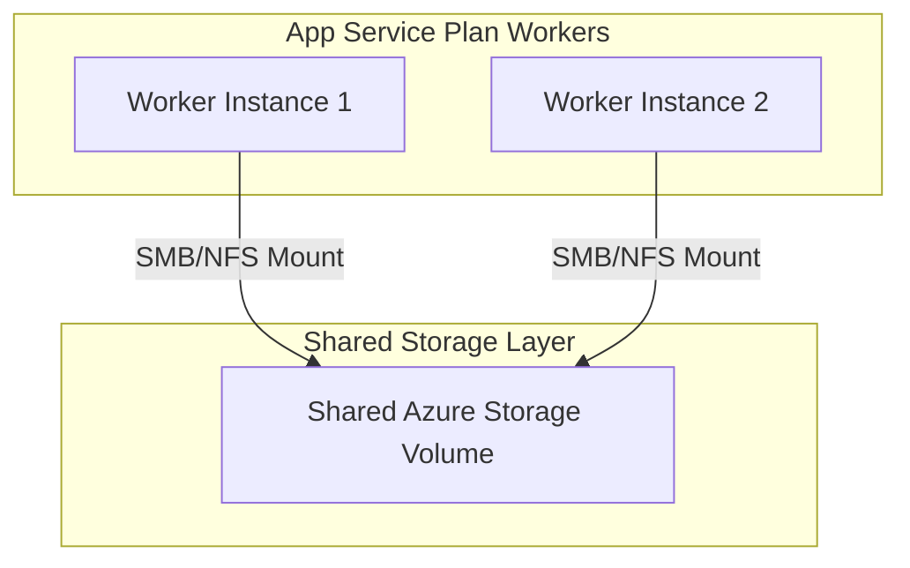

## Table of Contents

1. [What Is App Service](#what-is-app-service)
2. [App Service Plan](#app-service-plan)
3. [Web App](#web-app)
4. [Runtime Settings](#runtime-settings)
5. [Managed Identity](#managed-identity)
6. [Logs And Health](#logs-and-health)
7. [Deployment Slots](#deployment-slots)
8. [Scaling](#scaling)
9. [Putting It All Together](#putting-it-all-together)
10. [What's Next](#whats-next)

## What Is App Service

Azure App Service is a managed Platform as a Service (PaaS) designed to host web applications, REST APIs, and background processes. It removes the operational chores of traditional infrastructure management. You do not need to configure virtual networks, install operating system patches, configure IIS or Nginx servers, set up systemd supervisors, write custom startup scripts, or coordinate manual SSL/TLS certificate renewals. You create the Web App, provide the application code or container image, and let Azure's platform controller wire the runtime environment.

:::expand[Under the Hood: Front-End Pools and Noisy Neighbors]{kind="design"}
The physical architecture of App Service is split into two primary layers: the Front-End pool and the Worker pool. The Front-End layer consists of redundant load-balancing routing nodes at the entry point of Azure's regional data centers. These Front-End gateways receive all inbound public HTTP/HTTPS requests, handle SSL/TLS decryption, and route the traffic over a private internal network to the specific WebWorkers hosting your code.

WebWorkers are virtual machine instances dedicated to running your chosen runtime environment. The scale and density of these WebWorkers are governed entirely by your App Service Plan (ASP). Web App resources are merely logical configuration boundaries, whereas the ASP represents the physical VM compute boundary. If you deploy multiple Web Apps to the same ASP, they are co-located on the same physical VM instances, sharing the same CPU schedulers, physical memory blocks, and network socket threads. Under high traffic, this multi-app co-location can lead to severe noisy neighbor resource contention, where a resource spike in one application starves the other apps of resources, causing latency spikes and socket timeouts.
:::

If you host applications on AWS, App Service solves a similar problem to AWS Elastic Beanstalk (for code-based deployments) or AWS App Runner (for containerized web applications). However, the underlying resource models differ: while AWS Elastic Beanstalk provisions standard EC2 instances directly under your AWS account (which you can SSH into and manage), Azure App Service abstracts the physical servers completely into managed container WebWorkers cabled to your App Service Plan.

Treat App Service as a managed runtime that wraps your application process. Even though the platform is managed, you are responsible for process start commands, environment variables, database connection pools, memory utilization, and active health monitoring.

| Platform Interface | Functional Role inside App Service |
| --- | --- |
| Compute Capacity | App Service Plan instance count, VM SKU size, and regional placement |
| Ingress Edge | Redundant Front-End routing gateways, managed TLS handshakes, and custom domains |
| Runtime Stack | Pre-configured Node.js, Python, or .NET container engines, or custom Docker images |
| Environment Configuration | App Settings injected as environment variables directly into the process |
| Secure Entra ID Access | Managed Identity token exchanges with Key Vault or Azure SQL |
| Safe Releases | Deployment slots utilizing isolated directories and logical routing swaps |
| Performance Evidence | Application Insights telemetry, standard out log pipes, and active health checks |

## App Service Plan

An App Service Plan (ASP) represents the physical compute host for your web applications. When you create an ASP, you are creating a Virtual Machine Scale Set (VMSS) managed by Azure's fabric, hidden behind the PaaS abstraction layer. The tier you choose (Basic, Standard, Premium v3, or Isolated) dictates the availability of advanced features, such as regional virtual network integration, deployment slots, custom domains, and autoscale rules.

Because the ASP provides the physical RAM and CPU allocations, you must monitor it using host-level metrics. If a Web App returns a gateway timeout or becomes unresponsive, inspect the App Service Plan's overall CPU and Memory utilization. Scaling up the ASP changes the size of the worker VMs (e.g., shifting from 2 cores and 8 GB of RAM to 4 cores and 16 GB of RAM), whereas scaling out increases the number of running VM instances.

For production workloads, isolate critical services on dedicated App Service Plans. Placing an internal administrative portal, a slow-running batch utility, and a high-throughput checkout API on the same plan introduces unnecessary operational risk. Dedicated plans ensure that resource consumption remains isolated and predictable.

## Web App

The Web App is the logical configuration unit where your code, deployment artifacts, and runtime settings reside. It defines how the system starts and how traffic interacts with the process. For a standard Linux-based Node.js runtime, the platform executes a Kestrel or Nginx process that reverse-proxies requests directly to your application port. App Service uses a default port contract, typically mapping inbound traffic to port `8080` inside the container. Your code must bind to the environment-injected port variable or target the correct port to receive traffic.

To maintain operational clarity during incidents, document a stable profile of each Web App. This avoids confusion when troubleshooting configuration issues or deployment failures.

| Profile Field | Practical Value |
| --- | --- |
| Web App Name | `devpolaris-orders-api` |
| Parent App Service Plan | `asp-orders-prod-eus` |
| Runtime Stack Version | `Node.js 20 LTS (Linux)` |
| Physical Startup Command | `npm start` |
| Ingress Health Endpoint | `/healthz` |
| Entra ID Principal | `System-Assigned Managed Identity` |

When a deployment completes but the application remains unreachable, the issue is rarely the Azure control plane. The most common failures are process crashes caused by missing database settings, startup script errors, or the application process failing to bind to the port within the platform's startup timeout limit.

## Runtime Settings

App Settings in App Service are environment variables injected directly into your application process. The platform ensures that these settings are encrypted at rest and dynamically loaded when the process boots. They allow you to maintain environment-specific configuration without baking connection strings, API URLs, or environment tags into your deployment package.

A critical systems behavior of App Settings is that saving a configuration change triggers an immediate restart of the Web App process. The platform controller recycles the application pool to inject the new environment variables. If you update three settings sequentially in a deployment script, you can trigger three consecutive process restarts, creating temporary downtime and database connection spikes. To prevent this, apply configuration updates in a single, atomic operation using deployment templates or CLI batch scripts.

Some settings must be marked as slot settings. When you create a deployment slot, you can check a box to stick the setting to the slot. This ensures that database connection strings, logging levels, and third-party webhook endpoints do not move when you perform a release swap.

## Managed Identity

Managed Identity eliminates the need to store long-lived credentials (like passwords, client secrets, or certificate files) inside your application code or App Settings. When you enable a system-assigned managed identity on a Web App, Azure's Fabric Controller registers a distinct cryptographic principal in Microsoft Entra ID and assigns it to your Web App resource.

Under the hood, the Web App accesses this identity through a local link-local endpoint. When your application code utilizes an Azure SDK to authenticate (such as `DefaultAzureCredential`), the SDK makes an HTTP request to the local Instance Metadata Service (IMDS) endpoint (`169.254.169.254`) on a specialized port. The hypervisor interceptor verifies that the socket request originates from the authorized Web App process, calls Entra ID to retrieve a cryptographically signed JSON Web Token (JWT), and returns it to your application code.

The identity does not grant permission by itself. Creating a system-assigned managed identity only gives the app a principal. Someone still has to grant that principal the right access to the target resource. When a secret read fails, check both halves: does the app have an identity, and does the target service allow that identity?

## Logs And Health

App Service captures standard output and standard error streams from your application process, piping them to a managed log stream. In Linux-based App Service containers, console logs are collected by a host docker daemon and can be streamed in real-time or forwarded directly to an Azure Log Analytics workspace. 

An active Health Check is critical to prevent routing traffic to degraded worker instances. When you configure a Health Check path (such as `/healthz`), the platform's load balancers poll the endpoint on every running instance at regular intervals. The endpoint must verify that the process is warm, configurations are parsed, and core socket connections are established.

If an instance fails to return a `200 OK` response multiple times, the load balancer marks the instance degraded and removes it from the active routing pool. If all instances become degraded, the load balancer falls back to returning a `502 Bad Gateway` error to public requests, protecting downstream database and message queues from failing connections.

## Deployment Slots

Deployment slots are fully functional, independent Web App instances that run under the same App Service parent resource. A slot has its own unique hostnames, environment configuration settings, and deployment history, but it shares the underlying worker VM resources of the App Service Plan by default.

When you swap deployment slots (such as swapping `staging` with `production`), you are not moving your application code or files between physical directories. Instead, the swap is a logical routing table change executed at the Front-End load-balancing gateway. The gateway shifts the target routing IP mapping, swapping the public-facing URL path to point to the staging worker processes.

This swap process avoids cold starts through an automated warmup sequence. The platform controller first updates the App Settings in the staging slot that are not slot-specific, using the production settings. It then warms up the staging worker process by sending HTTP requests to the configured health check path. Only after the staging processes respond successfully does the Front-End gateway update its routing table to swap the URL maps. If the staging process crashes during warmup, the swap aborts, protecting the production site from downtime.

## Scaling

App Service scaling operates at the App Service Plan level, providing two modes: vertical scaling (scaling up) and horizontal scaling (scaling out). Scaling up changes the CPU, memory, and performance tier of the VM instances. Scaling out provisions additional VM instances to distribute traffic across a larger resource pool.

Horizontal autoscaling is governed by rules that monitor specific performance indicators, such as average CPU utilization, memory pressure, or TCP queue length. When a scaling threshold is breached, the scale controller tells the Fabric Controller to provision a new worker VM in the App Service Plan. 

Under the hood, provisioning a new instance does not require copying your application files onto the new VM's local drive. Instead, all worker VM instances mount your application files from a shared Azure Storage scale unit via secure internal SMB or NFS connections. The new VM boots, mounts this network volume, starts the runtime engine, executes your startup command, and registers its local IP address with the Front-End load balancer once the health probe validates readiness.

## Putting It All Together

Understanding the physical architecture of App Service prevents common deployment and operational assumptions.

* **Plan vs. Logical Isolation**: The App Service Plan is the physical VM compute boundary; the Web App is a logical configuration workspace.
* **Slot Swapping Physics**: Deployment slot swaps represent logical routing updates at the Front-End gateway after an automated worker process warmup.
* **Network-Mounted Code**: Scaling out VM instances relies on mounting a shared application code volume from an Azure Storage scale unit via internal SMB/NFS connections.
* **Managed Credentials**: Managed Identities use link-local IMDS requests intercepting VM sockets to fetch Entra ID JWT tokens.

By designing your applications around these physical realities, you can construct deployment slot configurations, autoscale thresholds, and resource plans that guarantee high performance and high availability.

## What's Next

In the next chapter, we will transition to Azure Container Apps. We will package our application as a Docker image, configure a serverless Container Apps Environment, inspect Envoy proxy routing edges, manage revisions, and configure KEDA-driven autoscaling.

---

**References**

- [Azure App Service Overview](https://learn.microsoft.com/en-us/azure/app-service/overview) - Official overview of the App Service PaaS features.
- [App Service Plan Details](https://learn.microsoft.com/en-us/azure/app-service/overview-hosting-plans) - Deep dive into physical hosting, sizes, and VM tier limits.
- [Set up staging environments](https://learn.microsoft.com/en-us/azure/app-service/deploy-staging-slots) - Explanation of slot warmup, routing shifts, and slot settings.
- [VNet Integration for App Service](https://learn.microsoft.com/en-us/app-service/web-sites-integrate-with-vnet) - Technical overview of regional subnet routing and port injection.
