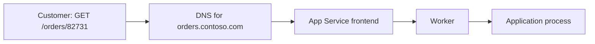
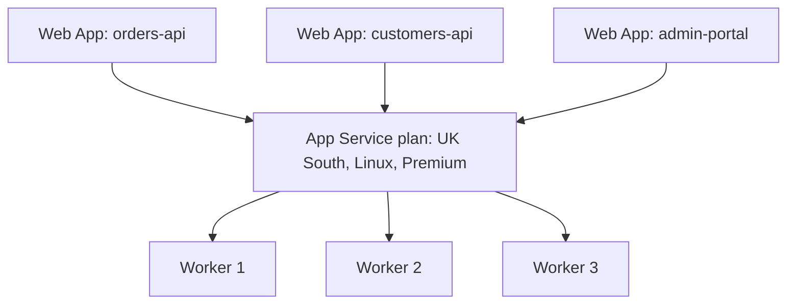
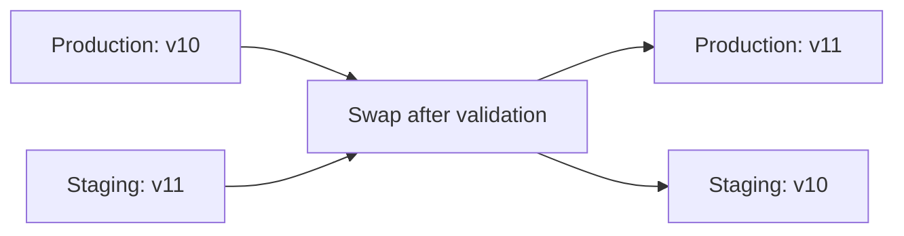
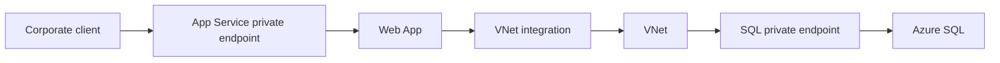
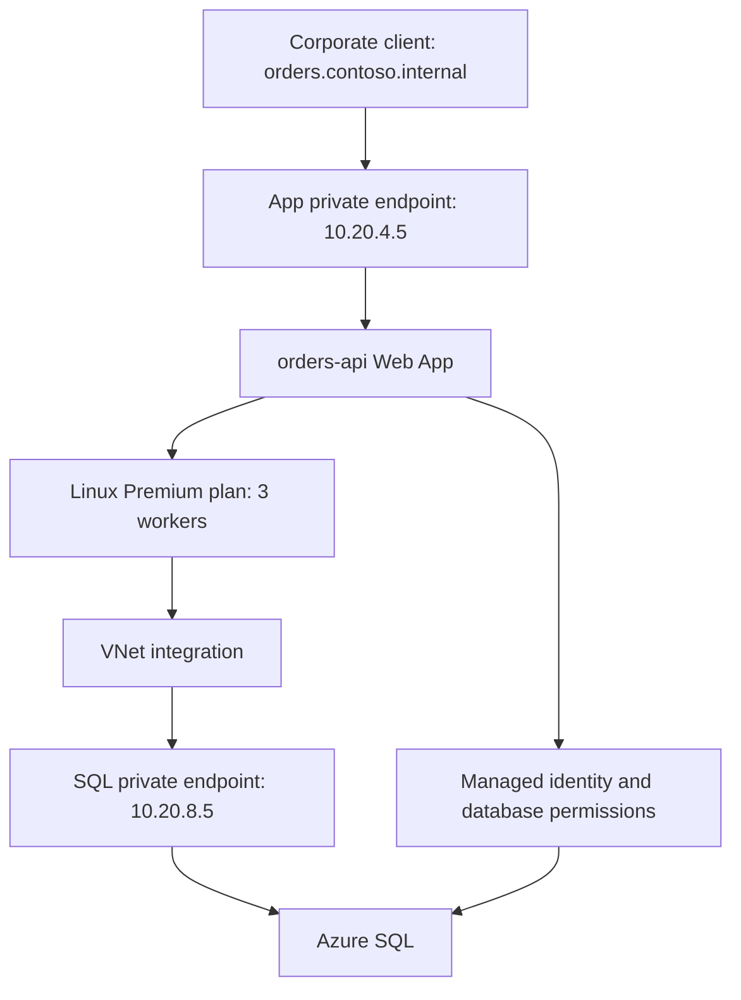

## Table of Contents

1. [What Is App Service and How Is It Structured?](#what-is-app-service-and-how-is-it-structured)
2. [How Do Plans, Apps, and Runtimes Divide Responsibility?](#how-do-plans-apps-and-runtimes-divide-responsibility)
3. [How Should Configuration, Secrets, and Identity Work?](#how-should-configuration-secrets-and-identity-work)
4. [How Do Deployment Slots Make Releases Safer?](#how-do-deployment-slots-make-releases-safer)
5. [How Does App Service Connect to Networks?](#how-does-app-service-connect-to-networks)
6. [How Do Scaling and Availability Work?](#how-do-scaling-and-availability-work)
7. [What Logs and Health Signals Explain Runtime Behavior?](#what-logs-and-health-signals-explain-runtime-behavior)
8. [When Is App Service the Right Fit?](#when-is-app-service-the-right-fit)
9. [Check Your Answers](#check-your-answers)

A web application needs a process that listens for requests, enough CPU and memory to handle them, and a network path customers can use. You can assemble that environment on a VM, then maintain its operating system, runtime, web server, TLS setup, deployment scripts, and scaling machinery.

App Service lets you ask for the web-hosting result more directly. You supply the application and its configuration. Azure operates the managed workers and much of the platform that keeps the application running, routes requests, and adjusts capacity. The machines still exist; you work primarily with an application resource rather than administer each server.

To understand what that arrangement does and what remains your responsibility, follow these questions from the incoming request to the running application:

1. **What Is App Service and How Is It Structured?**
2. **How Do Plans, Apps, and Runtimes Divide Responsibility?**
3. **How Should Configuration, Secrets, and Identity Work?**
4. **How Do Deployment Slots Make Releases Safer?**
5. **How Does App Service Connect to Networks?**
6. **How Do Scaling and Availability Work?**
7. **What Logs and Health Signals Explain Runtime Behavior?**
8. **When Is App Service the Right Fit?**

## What Is App Service and How Is It Structured?
<!-- section-summary: App Service provides managed web-application execution on worker pools; frontends route HTTP traffic and workers execute application code. -->

An HTTP request ultimately reaches a network socket and an application or web-server process. The process relies on a runtime, operating system, CPU, and memory. App Service supplies a managed arrangement for those ordinary pieces of web execution.

A VM-based arrangement might contain Linux or Windows, OS patches, .NET or Java or Node or Python, nginx or IIS and a process manager, the application itself, TLS configuration, health monitoring, deployment scripts, and scaling controls. Someone must maintain each layer. For many web workloads, the goal is simply to expose the application over HTTPS, keep it available, restart it as needed, configure it, and supply enough execution capacity.

**App Service is a managed web-application execution platform built on Azure compute workers.** The [service overview](https://learn.microsoft.com/en-us/azure/app-service/overview) describes it as a platform as a service, or PaaS, for web applications and APIs using common language stacks or custom containers. PaaS means the provider operates a platform on which the customer deploys an application, rather than handing the customer only a machine to administer.

### The machines remain underneath

The physical execution stack still includes a server, VM or worker, operating system, App Service runtime, and your application process. Moving to App Service changes who manages those layers.

With a VM, the customer ordinarily maintains the application, runtime, web server, guest OS, and patches while Azure operates virtualization, physical hardware, and the datacenter. With App Service, Azure additionally manages the web-hosting platform, worker lifecycle, base runtime environment, OS, and platform patching. The customer still owns application code, configuration, dependencies, and behavior.

This is a control and responsibility tradeoff. Letting Azure manage the web platform reduces the need to administer its infrastructure, while providing fewer low-level controls than an ordinary guest machine. That is useful when the application's requirements fit the interface the platform exposes.

### Follow one request through frontend and worker

Suppose the public application address is `https://orders.contoso.com` and a customer requests `GET /orders/82731`. DNS resolves the hostname, and the HTTPS connection reaches the App Service frontend. The frontend recognizes the application associated with that hostname and routes the request toward the worker executing its process.


```mermaid
flowchart LR
    A[Customer: GET /orders/82731] --> B[DNS for orders.contoso.com]
    B --> C[App Service frontend]
    C --> D[Worker]
    D --> E[Application process]
```

The **frontend** is the incoming routing layer. The **worker** is the compute environment hosting customer code. The [networking architecture guide](https://learn.microsoft.com/en-us/azure/app-service/networking-features) describes these separate roles in multitenant App Service. Multitenant here means the managed platform serves multiple customers, while applying its isolation and hosting controls around their workloads.

Keeping frontend and worker separate prevents confusion during diagnosis. A request can fail to reach the appropriate application before its code executes, or it can reach a worker and fail inside the application. A hostname and an executing process are connected through platform routing rather than being the same object.

The next distinction explains how you provision that execution capacity: an App Service plan describes the workers, while a Web App describes the application using them.

## How Do Plans, Apps, and Runtimes Divide Responsibility?
<!-- section-summary: The plan supplies regional worker capacity and features; Web Apps configure applications on that shared pool, using a supported language stack or a custom container. -->

An **App Service plan** answers where the compute exists and how much capacity it provides. A **Web App** answers which application should run on that compute. These are separate Azure resources because an application's configuration and the worker capacity executing it solve different problems.

For example, a plan can specify UK South, Linux, a Premium tier, and three instances. That describes a pool of three workers supplying CPU and RAM in the selected hosting environment. The plan determines region, operating-system family, pricing tier, worker size, instance count, and available features.

The [plan documentation](https://learn.microsoft.com/en-us/azure/app-service/overview-hosting-plans) defines the plan as the compute resources on which web apps run. It is useful to think of the plan as capacity plus capacity characteristics. Counting application resources alone cannot tell you either property.

### The Web App describes the application

Create a Web App named `orders-api` and attach it to the plan. The Web App carries application content, hostnames, runtime choice, environment variables, deployment settings, identity, network configuration, TLS and custom-domain settings, health settings, and monitoring.

The Web App can use the plan's worker instances to execute the application. It is not another name for one VM. If the plan has three workers, the logical application can run across that managed capacity while retaining one application identity and configuration surface.


```mermaid
flowchart TD
    A[App Service plan: UK South, Linux, Premium] --> B[Worker 1]
    A --> C[Worker 2]
    A --> D[Worker 3]
    E[Web App: orders-api] --> A
    F[Web App: customers-api] --> A
    G[Web App: admin-portal] --> A
```

This relationship is the foundation for understanding both scaling and cost. The app defines what runs, while the plan provides the resources required to run it. An application can be configured incorrectly even when the plan has ample capacity; a correctly configured application can also suffer when shared capacity is exhausted.

### Several applications can share one plan

Suppose `orders-api`, `customers-api`, and `admin-portal` all use `production-plan`. They consume capacity from the same worker pool. If `orders-api` uses a large amount of CPU, the other applications may feel the resulting pressure. The [App Service reliability guide](https://learn.microsoft.com/en-us/azure/reliability/reliability-app-service) explains the shared worker relationship.

The plan is therefore an important resource-isolation and cost boundary. Several low-utilization apps can often share capacity rather than require independently provisioned workers for every application. A plan hosting apps A, B, C, and D can make better use of existing capacity than four lightly used pools.

The tradeoff is shared contention. Separate plans allow stronger performance and scaling independence, but they also provision capacity independently. Choose the boundary based on which workloads can reasonably share resources, not just on whether Azure permits attaching more applications to the same plan.

### What runs inside a worker

An ASP.NET Core API runs with the operating system, App Service platform, .NET runtime, and its application process. A Node application might run as `node server.js` on a Linux worker with the platform and Node.js installed. A Python application similarly relies on a worker's operating environment, platform, Python runtime, and application process.

App Service supports managed stacks including .NET, Java, Node.js, Python, and PHP, along with supported custom-container configurations on Windows and Linux. A custom image packages the runtime, libraries, and application, and the worker executes that image through the platform's hosting arrangement.

Whichever package is used, the workload is primarily a web-hosting shape: start a process, listen for HTTP requests, handle a request, return a response, and remain running. Websites, REST APIs, backends for frontends, business applications, and mobile backends commonly fit that pattern.

A message-driven operation that executes briefly and finishes may fit Functions better. A container-first workload with event-based scaling may fit Container Apps. A requirement for Kubernetes itself points toward AKS. The supported runtime is only one part of the decision; the application's execution pattern also needs to match the platform.

After choosing the runtime, separate the application bits from the values they need in each environment. Those settings determine what the process connects to and which behavior it enables.

## How Should Configuration, Secrets, and Identity Work?
<!-- section-summary: App settings supply environment values and restart the app when changed; secrets and workload identity require separate handling, and managed identity is distinct from human sign-in. -->

An application may read `DATABASE_HOST`, `DATABASE_NAME`, `LOG_LEVEL`, and `API_BASE_URL`. Hardcoding `prod-db.database.windows.net` into the source ties that code to one environment. It makes moving the same application through development, testing, staging, and production unnecessarily dependent on rebuilding or editing the application.

For example, this assignment puts the production destination directly into the program:

```python
database_host = "prod-db.database.windows.net"
```

The variable name is not the problem. The fixed production value is: the application cannot select a different environment without changing how that value is supplied.

App Service **app settings** supply environment-specific values to the process as environment variables. The same code can use `DATABASE_HOST=dev-db` in development, `stage-db` in staging, and `prod-db` in production. Application code and environment configuration remain distinct inputs to the running system.

Changing app settings restarts the application so the updated environment takes effect. The [configuration guide](https://learn.microsoft.com/en-us/azure/app-service/configure-common) documents this behavior. A configuration edit is therefore a runtime change, even if no source file or container image changes.

### Ordinary settings and secrets

Some settings are ordinary operational values: `LOG_LEVEL=Information`, `FEATURE_NEW_CHECKOUT=true`, or `REGION=UK`. Others are credentials, such as `DATABASE_PASSWORD`, `THIRD_PARTY_API_KEY`, or `PRIVATE_TOKEN`. They may all appear as runtime values, but their sensitivity is different.

App Service encrypts app settings and connection strings at rest. For secrets, App Service supports Key Vault references so the sensitive value can be managed in a vault rather than embedded in code or an artifact. App Service can use managed identity to access that secret.

Where a target such as Azure SQL, Storage, or Key Vault supports Entra authentication, managed identity can remove the need for a long-lived application password entirely. That is preferable to creating a key and then maintaining its storage, protection, rotation, revocation, and exclusion from Git.

### Give the application an identity

Suppose `orders-api` needs to read Blob Storage. With an account-key approach, the application needs a secret such as `STORAGE_KEY=abc123...`. With **managed identity**, Azure supplies a Microsoft Entra identity for the workload, and Storage can authorize that identity with a role such as `Storage Blob Data Reader`.

The application obtains a short-lived token for its identity and presents it to Storage. The target evaluates that identity and its permissions. The application does not need to keep a static Storage password in its code. This separates the identity of the running workload from the credentials a developer might use locally.

App Service supports two identity lifecycles. A **system-assigned identity** belongs to the app and is deleted with it. A **user-assigned identity** exists independently and can be attached to multiple resources. The [managed identity documentation](https://learn.microsoft.com/en-us/azure/app-service/overview-managed-identity) explains both options, including slot-specific identity configuration.

### Human authentication is a different question

If Alice visits the website, the application may need to establish who Alice is. App Service Authentication, often called Easy Auth, Microsoft Entra ID, and protocols such as OAuth and OpenID Connect can participate in that incoming sign-in arrangement.

When the application then reads Storage, the target also needs to establish who the application is. Managed identity addresses this workload-to-service authentication. Alice's user identity and the application's identity answer different questions at different points in the request path.

The [App Service security overview](https://learn.microsoft.com/en/azure/app-service/overview-security) describes incoming platform authentication separately from outgoing managed-identity access. A successful human login does not by itself establish the application's permissions to a database or vault.

These distinctions also matter when deploying a new version into a staging environment. The code may move between environments while some settings and identities need to stay associated with their own environment.

## How Do Deployment Slots Make Releases Safer?
<!-- section-summary: Deploy to the logical Web App, validate a candidate in a live staging slot, and keep environment-specific settings attached to their slots when production traffic moves. -->

Application delivery starts with source, a build, and a deployment mechanism. A repository contains code, dependencies, and configuration files; a pipeline turns those into a runnable application and deploys it. For example, GitHub Actions can build an application from GitHub and deploy the resulting package to App Service.

The [deployment guidance](https://learn.microsoft.com/en-us/azure/app-service/deploy-best-practices) separates deployment source, build pipeline, and deployment mechanism. The important App Service boundary is that the deployment targets the logical Web App. You do not manually SSH into workers 1, 2, and 3 to copy the same files onto each machine. The platform presents the deployed application to its workers.

### Prepare version 11 while version 10 serves users

If production runs version 10, replacing its content with version 11 and restarting exposes users to the new version before you have checked it in the hosting environment. A **deployment slot** gives the new version a separate live application endpoint with its own hostname and configuration.

For example, production can continue serving v10 while staging runs v11 at `https://orders-staging.azurewebsites.net`. You can inspect v11 there before changing what real customers receive. Deployment slots are available in Standard, Premium, and Isolated App Service plan tiers, as documented in the [slot guide](https://learn.microsoft.com/en-us/azure/app-service/deploy-staging-slots).

After the candidate is tested, a swap changes the arrangement: production serves v11 and staging contains v10. App Service includes warmup in the swap procedure so the production route can move to prepared application execution rather than requiring a traditional cold redeployment over the live version.


```mermaid
flowchart LR
    A[Production: v10] --> C[Swap after validation]
    B[Staging: v11] --> C
    C --> D[Production: v11]
    C --> E[Staging: v10]
```

The deployment and the production cutover are separate events. First place software on the platform, then check it, and then direct production traffic to it. This gives startup, configuration, and critical application behavior a chance to fail in a candidate environment before users rely on that version.

### Keep the correct configuration with the slot

Suppose production uses `DATABASE=prod-db` while staging uses `DATABASE=stage-db`. Moving the new application into production should not accidentally make it use the staging database. A setting marked as a **deployment-slot setting** remains associated with its slot instead of swapping with application content.

That lets the version move while selected environment values stay in place. It is a different property from ordinary configuration: it specifies what happens to a value during a slot operation. The [slot settings documentation](https://learn.microsoft.com/en-us/azure/app-service/deploy-staging-slots) explains which settings can remain attached in this way.

Managed identities are also configured per slot. Staging and production can have different workload identities and corresponding access. This reinforces the distinction between testing the package and proving the production runtime arrangement: settings and authority are part of the application environment as well as the executable.

Slots handle the timing of a version change. The network controls handle which clients can reach each application and which dependencies the application can reach, so those paths need a separate explanation.

## How Does App Service Connect to Networks?
<!-- section-summary: Inbound controls decide who can reach the app; VNet integration supplies outbound connectivity and does not place ordinary multitenant workers inside the customer's subnet. -->

Always split networking into two directions. **Inbound networking** asks who can call the application. **Outbound networking** asks what the application can call. Azure exposes different features for these directions, and enabling one does not automatically supply the other.

A normal multitenant Web App is ordinarily reachable through an internet-facing App Service endpoint such as `orders.azurewebsites.net`. Requests enter through the frontend and are routed to the application. Restrictions and private endpoints can change the permitted incoming paths.

### Access restrictions act before the worker

If only clients in `203.0.113.0/24` should reach an application, access restrictions can define the inbound allow and deny behavior. The frontend evaluates the request against those rules before it reaches the worker. An allowed request continues to execution; a denied request is rejected earlier.

The [networking features guide](https://learn.microsoft.com/en-us/azure/app-service/networking-features) describes this frontend-level filtering. A rejected request may therefore never reach application code. That is useful to remember when application logs show nothing for a connection the client says it attempted.

### Private endpoints provide a private incoming path

Suppose the VNet address space is `10.20.0.0/16` and a private endpoint for the Web App uses `10.20.5.7`. A VM at `10.20.1.4` can reach that endpoint over the private network, and Private Link carries the connection to App Service.

A **private endpoint** is the private network entry point for this incoming connection. It does not control the Web App's outgoing dependency calls. If the goal is a private-only application, combine the private path with appropriate restriction or removal of public exposure; creating a private endpoint alone should not be confused with a complete access policy.

The [private endpoint documentation](https://learn.microsoft.com/en-us/azure/app-service/overview-private-endpoint) explains the App Service inbound model. Its direction is worth stating explicitly: clients use the private endpoint to reach the application.

### VNet integration supplies outbound reach

Now suppose the application needs to connect to a SQL server at `10.20.8.10`. The question has reversed: how does a managed App Service worker send traffic into the VNet? **VNet integration** provides an outbound connection into or through that network using the integration subnet.

The [VNet integration guide](https://learn.microsoft.com/en-us/azure/app-service/overview-vnet-integration) explicitly distinguishes this from inbound private access. A private endpoint lets clients privately reach App Service; VNet integration lets App Service privately reach other resources.

This means a private application often needs both features. Corporate clients use an App Service private endpoint to reach the Web App. The Web App uses VNet integration to reach a SQL private endpoint. DNS must resolve the database's hostname to that private SQL address so the intended path is actually used.


```mermaid
flowchart LR
    A[Corporate client] --> B[App Service private endpoint]
    B --> C[Web App]
    C --> D[VNet integration]
    D --> E[VNet]
    E --> F[SQL private endpoint]
    F --> G[Azure SQL]
```

The left-hand path solves who can call the application. The right-hand path solves what the application can call. Identity still determines authorization at the destination; having a network path does not replace access permissions.

### Integration does not relocate the platform

For ordinary multitenant App Service, enabling VNet integration does not deploy the worker VM itself as a customer-managed machine inside the subnet. The worker remains part of the managed App Service platform. Integration supplies network interfaces or connectivity from that worker into the delegated integration subnet.

If the requirement is to deploy the App Service hosting environment itself as dedicated infrastructure in the VNet, **App Service Environment** is the separate architecture to examine. That is a different hosting arrangement from adding outbound integration to a multitenant Web App.

Keeping placement separate from connectivity prevents a misleading drawing in which VNet integration appears to move the entire App Service platform into a subnet. The worker's hosting location and the network paths it can use are related but distinct properties.

With those paths defined, the next question is how much worker capacity should exist and how safely requests can move among those workers.

## How Do Scaling and Availability Work?
<!-- section-summary: Scale up changes worker capacity or tier, scale out changes instance count, and shared external state lets healthy workers handle requests without depending on one instance. -->

Scaling has two basic dimensions. **Scale up** increases the resources or capabilities of the workers, commonly by changing the App Service plan size or tier. An illustrative change is from two CPUs and 8 GB RAM to four CPUs and 16 GB RAM.

A different pricing tier can also expose additional storage or platform features. The [scale-up guide](https://learn.microsoft.com/en-us/azure/app-service/manage-scale-up) describes those changes. Because the capacity belongs to the plan, apps using the plan receive the changed capacity rather than each independently acquiring its own machine size.

**Scale out**, or horizontal scaling, adds worker instances. Instead of one larger worker, a plan may have workers 1 through 4, and the frontend distributes requests across available application instances. This changes the number of places where code can execute.

### Choose the signal that controls instance count

A manual configuration can specify three instances. Rule-based Azure Autoscale can respond to a condition such as CPU above 70% by adding an instance. A schedule can request eight instances at 08:00 and reduce the count to two at 18:00.

App Service also has **automatic scaling** for supported Premium v2 through v4 plans. It can respond to HTTP traffic without requiring the team to author metric-based scaling rules, with minimum, maximum, and prewarmed-instance concepts. The [automatic scaling guide](https://learn.microsoft.com/en-us/azure/app-service/manage-automatic-scaling) describes this option.

The fundamental decision is which signal should determine how many instances execute. Manual counts, schedules, metric rules, and HTTP-demand scaling express different expectations about the workload. The plan's shared capacity also means the team needs to understand which applications are affected by those choices.

### State must survive changes in worker selection

Suppose request A reaches worker 1 and writes `/tmp/shopping-cart.json`. A later request reaches worker 3, which does not have that instance-local file. The platform may have routed requests correctly while the application fails because its state arrangement assumes the same worker will always be selected.

Memory has the same issue. A shopping cart stored only in worker 1's RAM is not automatically visible to workers 2 and 3. Session affinity can keep a user associated with one worker in some circumstances, but that coupling reduces flexibility when distributing or replacing instances.

Treat individual instances as replaceable. Store durable or shared state in an appropriate external service such as Azure SQL, Cosmos DB, Blob Storage, Redis, or Azure Files. That lets multiple workers operate against the same information instead of requiring correctness to depend on one local disk or process.

This is what **stateless application instances** means in this context: the instance does not contain the only durable copy of information needed for the user's next request. The overall application can still maintain state, but that state lives somewhere the relevant instances can access.

### More instances also support availability

With one worker, an unhealthy instance can remove the application's only serving capacity. With three workers, the platform can send requests to workers 2 and 3 while worker 1 is unhealthy. Additional instances therefore support both performance capacity and resilience.

App Service distributes plan instances across underlying fault domains within a region to reduce exposure to localized infrastructure failures. A **fault domain** groups infrastructure that can share a failure cause; spreading instances helps avoid placing all capacity behind the same local failure. The [reliability guide](https://learn.microsoft.com/en-us/azure/reliability/reliability-app-service) explains the platform's arrangement.

Multiple workers only help if the platform can identify which ones are ready to serve. A machine can be running while the application is unable to reach its database, so application-level health evidence must accompany the capacity design.

## What Logs and Health Signals Explain Runtime Behavior?
<!-- section-summary: Health checks decide whether instances should receive traffic; logs, metrics, traces, and version evidence explain whether the deployed application is actually serving useful requests. -->

Suppose the VM is running and the application process exists, but database access is broken. Machine liveness does not establish that the application can perform its job. App Service **Health Check** calls a configured application path such as `/health` to obtain a more useful signal.

The application can return `200 OK` when it is healthy or a server error such as `500` when it should not receive production traffic. App Service probes the configured path every minute, routes requests away from unhealthy instances according to its health behavior, and can replace instances that remain unhealthy. The [Health Check guide](https://learn.microsoft.com/en-us/azure/app-service/monitor-instances-health-check) describes those operations.

For example, workers 1 and 2 might return 200 while worker 3 returns 500. The platform can use that evidence to avoid the unhealthy instance. This is stronger than checking only whether the host exists, because the application supplies a signal about its own ability to serve.

### Logs explain events at different layers

If a customer reports that `POST /orders` returned 500, investigate more than one layer. HTTP evidence can include method, URL, status, latency, and client information. Application logs may show that processing order 1827 started, the database timed out, and the operation failed. Platform evidence may instead show an application restart, container startup failure, or deployment problem.

App Service supports application and console logs, HTTP logs, deployment logs, and platform-related categories according to OS and hosting configuration. They can be streamed or routed through diagnostic settings to Azure Monitor and Log Analytics. The [diagnostic logging guide](https://learn.microsoft.com/en-us/azure/app-service/troubleshoot-diagnostic-logs) also describes filesystem and Kudu-related access where applicable.

These categories identify different parts of the same path. An HTTP error tells you the response that reached the client. An application exception may explain the failed operation. A platform startup failure may explain why no application handler ran at all.

### Metrics show quantities over time

Metrics include requests per second, CPU, memory, HTTP errors, response times, and instance count. They answer how much work is arriving, how much capacity is being used, and how frequently a behavior occurs.

For example, CPU might rise from 30% at 14:00 to 45% at 14:10 and 92% at 14:20. If HTTP 503 counts also increase rapidly at 14:20, the combined timeline provides evidence of a capacity or application problem. It does not by itself identify every cause, but it narrows the period and behavior that need investigation.

Azure Monitor provides platform metrics, logs, alerts, and integrated App Service monitoring. The [monitoring overview](https://learn.microsoft.com/en-us/azure/app-service/monitor-app-service) describes those signals and how they relate to the application.

### Traces connect request time to dependencies

Application Insights adds request-level evidence across the application and the services it calls. A request passing through an App Service API, Azure SQL, and a payment API can produce a trace that shows where time was spent.

For example, a trace can show approximately 1.4 seconds total request duration, with 40 ms in application code, 120 ms in SQL, and 1.2 seconds in the payment API. Those component timings make the payment dependency visible as the dominant contributor. Saying only that App Service is slow would hide that distinction.

A **distributed trace** links related operations across service boundaries. It helps answer which request failed and where time or failure occurred rather than treating each component's logs as an unrelated stream.

### Prove the executing version and useful work

A successful deployment indicates that the deployment machinery completed its task. Stronger runtime evidence follows the application afterward: it started, its health check passes, an HTTP request reaches it, the correct version responds, downstream services work, and logs or traces confirm the request.

A `GET /version` response can expose a build identifier without exposing secrets:

```json
{
  "version": "2026.08.23.4"
}
```

That response helps identify what is serving traffic. Combine it with health state, application and HTTP logs, metrics, deployment logs, and Application Insights. Each observation connects the declared deployment to actual execution rather than assuming the two are interchangeable.

### Troubleshoot in the order of the request path

Start with DNS: does the hostname resolve to the expected endpoint? Then inspect inbound reachability through the public endpoint, restrictions, or private endpoint. Check whether platform routing associates the hostname with the correct Web App, whether healthy workers exist, and whether the application process started.

After confirming startup, inspect runtime settings. Then follow outbound calls to SQL, Storage, or APIs through VNet integration, DNS, and firewalls. Check whether managed identity can obtain the intended token and whether target authorization permits the request. Finally, inspect whether application code completes the operation correctly.

This sequence avoids investigating SQL permissions before the process has started, or blaming application code while DNS points clients elsewhere. It connects the frontend/worker, configuration, network, identity, and application distinctions from earlier sections into one diagnostic path.

## When Is App Service the Right Fit?
<!-- section-summary: App Service fits conventional web workloads that benefit from managed workers; the internal .NET example joins plan capacity, configuration, identity, private paths, slots, health, and centralized evidence. -->

App Service fits a workload whose main requirement is to keep a web application running and reachable without having the team operate its web servers. The application still needs its own code, settings, dependencies, and sound state design. Azure supplies the managed worker platform and much of the routing, lifecycle, deployment, scaling, and health machinery around it.

An internal order-management application brings those responsibilities together. Its requirements are a .NET web API, corporate-only private access, Azure SQL, no stored SQL password, a staging deployment, three production instances, automatic health detection, and centralized logs. Each requirement maps to one of the distinctions already explained.

### Supply compute and deploy the application

Create a Linux Premium App Service plan with three workers. It provides the compute pool. The `orders-api` Web App describes the application attached to that pool. Configure the .NET runtime and deploy the application through the GitHub CI/CD path into a staging slot.

The runtime values include `LOG_LEVEL=Information` and `SQL_SERVER=orders-prod.database.windows.net`. These arrive as environment variables rather than requiring production values to be hardcoded in the artifact. The package can retain the same application code while the environment supplies its own database name.

Enable a system-assigned managed identity for `orders-api` and grant it the required database access. The application authenticates through Microsoft Entra ID to Azure SQL, so it does not need to store a SQL password. This uses the workload-identity mechanism explained earlier; corporate users' own sign-in remains a separate matter.

### Define both private network paths

For inbound corporate access, create an App Service private endpoint at `10.20.4.5`. Corporate DNS resolves `orders.contoso.internal` to that address. Clients then reach the Web App through the private endpoint, with public exposure disabled or restricted as appropriate for the private-only requirement.

For outbound database access, Azure SQL uses a private endpoint at `10.20.8.5`. Configure VNet integration so the application can reach that private address, and ensure the database hostname resolves to it. The App Service private endpoint and VNet integration have separate jobs even though both are present in the same private application design.


```mermaid
flowchart TD
    A[Corporate client: orders.contoso.internal] --> B[App private endpoint: 10.20.4.5]
    B --> C[orders-api Web App]
    C --> D[Linux Premium plan: 3 workers]
    D --> E[VNet integration]
    E --> F[SQL private endpoint: 10.20.8.5]
    F --> G[Azure SQL]
    C --> H[Managed identity and database permissions]
    H --> G
```

The diagram separates network reach from application authority. The private address supplies a route to the service. Managed identity and database permissions establish whether the application's operation is allowed there. Both are required for a successful private database call.

### Validate the candidate before moving production

Production initially runs v10 and staging runs v11. Test `/health`, `/version`, and the application's critical business flows in staging. Once the candidate is ready, swap so production serves v11 and staging contains v10.

Keep the appropriate settings with each slot. The application version moves while environment-specific database configuration and slot identities remain associated with their intended environment. This prevents the software change from accidentally redirecting production to staging data or relying on the wrong workload authority.

Configure `/health` so workers provide application-level signals. If workers 1 and 2 return 200 while worker 3 returns 500, the platform can route around worker 3 while it is unhealthy. Three instances provide useful alternative capacity only when the application and its health behavior allow those healthy instances to serve the requests.

### Keep the evidence connected

Send HTTP, application, and platform logs, metrics, and Application Insights data into the monitoring arrangement. If request `8b7fa9` fails, the operator should be able to follow it from the client through App Service and `orders-api` to Azure SQL. That evidence connects the logical application to what its worker and dependencies actually did.

The full App Service model is now explicit. The plan supplies compute; the Web App describes the application; settings configure the runtime; managed identity authenticates the workload; slots provide a separately testable version; private endpoints control incoming private access; VNet integration supplies outgoing network reach; scaling changes capacity; and health, logs, metrics, and traces explain execution.

These boundaries make product choices and incidents easier to reason about. If you need a conventional managed web host, App Service can remove substantial server work. If the workload instead requires event invocation, container-oriented scaling, or Kubernetes controls, compare Functions, Container Apps, or AKS according to those requirements. The objective is to choose an interface that matches the application and understand exactly which responsibilities remain above it.

### References

- [Azure App Service overview](https://learn.microsoft.com/en-us/azure/app-service/overview)
- [App Service networking features](https://learn.microsoft.com/en-us/azure/app-service/networking-features)
- [App Service plans](https://learn.microsoft.com/en-us/azure/app-service/overview-hosting-plans)
- [Reliability in App Service](https://learn.microsoft.com/en-us/azure/reliability/reliability-app-service)
- [Configure an App Service app](https://learn.microsoft.com/en-us/azure/app-service/configure-common)
- [Managed identities](https://learn.microsoft.com/en-us/azure/app-service/overview-managed-identity)
- [App Service security](https://learn.microsoft.com/en/azure/app-service/overview-security)
- [Deployment best practices](https://learn.microsoft.com/en-us/azure/app-service/deploy-best-practices)
- [Staging environments and slot settings](https://learn.microsoft.com/en-us/azure/app-service/deploy-staging-slots)
- [Private endpoints](https://learn.microsoft.com/en-us/azure/app-service/overview-private-endpoint)
- [VNet integration](https://learn.microsoft.com/en-us/azure/app-service/overview-vnet-integration)
- [Scale up](https://learn.microsoft.com/en-us/azure/app-service/manage-scale-up)
- [Automatic scaling](https://learn.microsoft.com/en-us/azure/app-service/manage-automatic-scaling)
- [Health Check](https://learn.microsoft.com/en-us/azure/app-service/monitor-instances-health-check)
- [Diagnostic logs](https://learn.microsoft.com/en-us/azure/app-service/troubleshoot-diagnostic-logs)
- [Monitor App Service](https://learn.microsoft.com/en-us/azure/app-service/monitor-app-service)

## Check Your Answers

:::expand[What Is App Service and How Is It Structured?]{kind="recap"}
App Service hosts web application processes on managed compute workers. Frontends accept and route incoming HTTP traffic; workers execute code. Azure manages much of the platform and OS lifecycle, while the customer owns application code, settings, dependencies, and behavior.
:::

:::expand[How Do Plans, Apps, and Runtimes Divide Responsibility?]{kind="recap"}
The App Service plan defines regional worker capacity, OS family, size, tier, instances, and features. The Web App defines application content and runtime configuration on that capacity. Multiple apps can share the pool, improving utilization while also sharing resource pressure.
:::

:::expand[How Should Configuration, Secrets, and Identity Work?]{kind="recap"}
App settings become environment variables, and changing them restarts the application. Keep necessary secrets protected through runtime configuration and Key Vault, and prefer managed identity where supported. System-assigned and user-assigned identities have different lifecycles; workload authentication is separate from human sign-in.
:::

:::expand[How Do Deployment Slots Make Releases Safer?]{kind="recap"}
Deploy to the logical application and validate the new version in a live staging slot before production traffic moves. A swap exchanges the serving versions after preparation. Deployment-slot settings remain with their environment, and managed identities are configured per slot.
:::

:::expand[How Does App Service Connect to Networks?]{kind="recap"}
Inbound restrictions and private endpoints control access to the app. VNet integration provides outbound access into or through a VNet. It does not move ordinary multitenant workers into the customer subnet. A fully private path can need both features plus correct DNS and authorization.
:::

:::expand[How Do Scaling and Availability Work?]{kind="recap"}
Scale up changes worker capacity or tier; scale out changes instance count. Manual settings, rules, schedules, or supported HTTP automatic scaling can drive that count. External shared state lets requests move among replaceable workers, and multiple healthy instances support resilience as well as throughput.
:::

:::expand[What Logs and Health Signals Explain Runtime Behavior?]{kind="recap"}
Health Check probes an application path to identify instances that should receive requests. Logs explain events, metrics show quantities over time, and traces connect request timing to dependencies. Verify the responding version and follow DNS, inbound routing, workers, startup, settings, outbound access, identity, and application behavior in order.
:::

:::expand[When Is App Service the Right Fit?]{kind="recap"}
It fits web applications that can use managed worker hosting without guest-server administration. The internal .NET example combines a three-worker plan, a Web App, environment settings, managed identity, private incoming and outgoing paths, staging slots, health checks, and centralized evidence to meet its requirements.
:::
