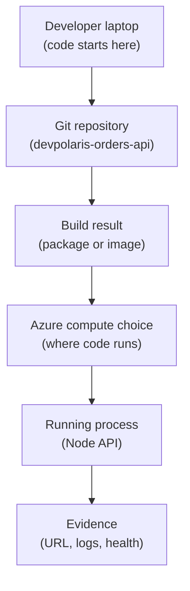

## Table of Contents

1. [Where Code Runs After The Laptop](#where-code-runs-after-the-laptop)
2. [If You Know AWS Compute](#if-you-know-aws-compute)
3. [The Example: One Orders API Needs A Runtime](#the-example-one-orders-api-needs-a-runtime)
4. [The First Split: Bring Code Or Bring A Machine](#the-first-split-bring-code-or-bring-a-machine)
5. [Container Apps: A Container Without A Cluster Lesson](#container-apps-a-container-without-a-cluster-lesson)
6. [App Service: A Managed Web App Home](#app-service-a-managed-web-app-home)
7. [Functions: Code That Starts From Events](#functions-code-that-starts-from-events)
8. [Virtual Machines: Familiar Servers With More Responsibility](#virtual-machines-familiar-servers-with-more-responsibility)
9. [What To Inspect When The App Does Not Start](#what-to-inspect-when-the-app-does-not-start)
10. [The Tradeoff Checklist Before You Choose](#the-tradeoff-checklist-before-you-choose)

## Where Code Runs After The Laptop

When code leaves your laptop, it still needs a real place to run.
Something has to start a process, give it CPU and memory, connect it to a network, restart it when it crashes, and collect logs when a user says the app is broken.
That "somewhere" is the beginner meaning of compute.

Azure compute means the Azure services that run your application code.
The code might be a Node backend, a container image, a small function that reacts to a queue message, or a full Linux server you manage yourself.
The services look different, but the basic job is the same:
turn application files into a running process that can do work.

Compute gives shared software a reliable place to run. A laptop is
useful for development, but it sleeps, sits behind a personal network,
carries old dependencies, and uses environment variables that only one
developer understands. Production checkout traffic needs a runtime that
the team can deploy, inspect, scale, and recover together.

In the larger Azure map, compute sits between your delivery pipeline and the rest of your cloud resources.
The pipeline builds something.
Compute runs that thing.
Networking lets users or other services reach it.
Identity lets it call protected Azure services.
Monitoring shows whether it is healthy.

This article follows a small Node backend called `devpolaris-orders-api`.
It receives order requests, validates a cart, writes an order record, and returns a response to the web frontend.
The example will show one practical question:
where should this API run in Azure first, and what responsibility changes when we choose one compute shape instead of another?

Start with the responsibility split. Each Azure compute choice gives
your team and Azure different jobs, and the right choice depends on
where you want that boundary to sit for this workload.

> Compute is where your code becomes a running process.

## If You Know AWS Compute

If you have learned AWS before, your existing mental model helps.
Do not force a perfect dictionary, though.
Cloud services are shaped by similar problems, but each provider draws the responsibility lines in its own way.

The gentle translation looks like this:

| Beginner Question | Azure Shape | AWS Bridge | Careful Difference |
|-------------------|-------------|------------|--------------------|
| I want a server I control | Virtual Machines | Roughly EC2 | You manage the operating system and runtime chores |
| I want to run a container API without learning Kubernetes first | Container Apps | Roughly solves the ECS/Fargate learner problem | Azure hides the cluster shape and gives revisions, ingress, and scaling rules |
| I want a web app platform for code or a custom container | App Service | No perfect one-service match | It is a managed web-app platform with App Service plans, deployment slots, and built-in web hosting features |
| I want code to run because an event happened | Functions | Roughly Lambda | Azure uses triggers, bindings, and hosting plans that affect scaling and runtime behavior |

The AWS callback is useful because it gives you familiar questions:
is this a server, a container, a web app platform, or event-driven code?
But stop there.
Do not assume names, limits, deployment flows, identity, logs, or networking behave exactly like AWS.

For `devpolaris-orders-api`, the strongest beginner options are usually App Service or Container Apps.
Both can host a Node API without asking you to patch a Linux server.
Functions becomes interesting when the work is naturally event-driven, like processing one queue message per order.
Virtual Machines become interesting when you need control that the managed platforms do not give you.

That last sentence is the pattern you will keep using.
Start with the shape of the work.
Then choose the service that makes the most boring parts somebody else's job.

## The Example: One Orders API Needs A Runtime

In local development, `devpolaris-orders-api` is straightforward. A
developer clones the repository, installs packages, and starts the
server.

```bash
$ npm ci
$ npm run dev

> devpolaris-orders-api@1.0.0 dev
> node src/server.js

orders-api listening on http://localhost:3000
```

That output proves only one thing:
the app can run on this developer's laptop.
It does not prove the app can run in Azure.
Azure does not automatically know which command starts the server, which port the app listens on, which environment variables it needs, or which logs prove it is alive.

A production host needs a clearer contract.
For this API, the contract might look like this:

```text
Service: devpolaris-orders-api
Runtime: Node.js HTTP API
Start command: node src/server.js
Listens on: process.env.PORT or configured target port
Required settings:
  NODE_ENV=production
  DATABASE_URL=<provided by Azure setting or secret reference>
  ORDERS_TOPIC_NAME=orders-created
Health endpoint:
  GET /healthz returns 200 when the API can accept requests
```

This tiny record matters more than the Azure service name at first.
It tells you what any compute service must provide:
a way to start the process, pass configuration, expose traffic, check health, and collect logs.

Here is the main path from laptop to Azure runtime.
Read it from top to bottom.
The diagram is intentionally small because the first lesson is placement, not full architecture.



Every compute service fills the `COMPUTE` box differently.
App Service may take your Node app directly or run a custom container.
Container Apps expects a container app shape.
Functions expects function code connected to triggers.
Virtual Machines expect you to install and operate the server pieces yourself.

The rest of this article is about that one box.
You are choosing how much platform help you want and how much control you need.

## The First Split: Bring Code Or Bring A Machine

A beginner mistake is to start with the Azure product list.
That makes every service sound equally possible.
A better way is to ask what you are bringing to Azure.

Are you bringing application code and asking Azure to host it?
That points toward App Service or Functions.

Are you bringing a container image and asking Azure to run it?
That points toward Container Apps, App Service for Containers, or a container platform such as AKS later in your learning path.

Are you bringing a whole server shape because you need direct operating system control?
That points toward Virtual Machines.

The first four compute shapes can be remembered like this:

| Shape | You Give Azure | Azure Gives Back | Good First Use | Main Responsibility You Keep |
|-------|----------------|------------------|----------------|------------------------------|
| App Service | Web app code or container | Managed web app hosting | HTTP APIs and web apps | App config, runtime choice, app health |
| Container Apps | Container image | Managed container runtime | Containerized APIs and workers | Image quality, ports, probes, scaling rules |
| Functions | Function code | Event-driven execution | Queue, timer, HTTP, and storage events | Event design, idempotency, timeout behavior |
| Virtual Machines | Server image or OS choice | Cloud server infrastructure | Custom server needs | OS patching, process manager, security hardening |

Use this table as a responsibility map. The best service is the one
whose responsibility split matches your problem.

For `devpolaris-orders-api`, imagine the team already builds a Docker image in CI.
The image starts the API with `node src/server.js`.
The team does not want to run Kubernetes yet.
They want HTTP ingress, a public URL for staging, environment variables, logs, and a way to roll out a new image.

That points naturally to Azure Container Apps.
Not because Container Apps is always better.
It fits this specific contract:
containerized Node API, managed runtime, no cluster operations as the first lesson.

If the same team did not use containers and wanted a straightforward managed web app platform, App Service could be a better first home.
If the orders work was "process one message whenever a queue receives it," Functions might be clearer.
If the app required a custom binary, a special OS agent, and direct SSH access, a VM might be justified.

Choose the compute service from the workload backward. Start with what
the app needs to do, then match the Azure service to that shape instead
of choosing from the service name first.

## Container Apps: A Container Without A Cluster Lesson

Azure Container Apps is easiest to understand if you already know what a container image is.
A container image is a packaged filesystem and startup command for your app.
It says, "when this image runs, start this process with these files."

Container Apps exists because many teams want the benefits of containers without making Kubernetes their first cloud hosting lesson.
You still need to build a good image.
You still need to expose the right port.
You still need to pass configuration.
But Azure takes care of much of the hosting surface around the container.

For `devpolaris-orders-api`, the build artifact might be:

```text
Registry: devpolaris.azurecr.io
Image:    devpolaris-orders-api
Tag:      2026-05-03.4
Command:  node src/server.js
Port:     3000
```

Container Apps gives that image a running home.
It can expose HTTP ingress, create revisions when the app changes, stream system and console logs, and scale based on traffic or other signals.
A revision is a versioned snapshot of the container app configuration and image.
That matters because a bad deploy should leave evidence, not just replace history.

A beginner deployment record might look like this:

```text
Container app: ca-devpolaris-orders-api-prod
Resource group: rg-devpolaris-orders-prod
Environment: cae-devpolaris-prod
Active revision: ca-devpolaris-orders-api-prod--x7q9h2m
Image: devpolaris.azurecr.io/devpolaris-orders-api:2026-05-03.4
Ingress: external
Target port: 3000
Replicas: 2 minimum, 8 maximum
Health endpoint: /healthz
```

Read that record like an operator.
The app is not just "deployed."
It has an active revision, a specific image tag, an ingress choice, a target port, and replica settings.
Those are the clues you inspect when something goes wrong.

The tradeoff is also clear.
You gain a managed container host and avoid operating a cluster.
You give up some low-level control over the machines underneath.
For many beginner APIs, that is a good trade.
You want to spend your first energy on the app contract, not on node pools and cluster upgrades.

Container Apps still depends on the contract inside your container
image. A broken image, missing environment variable, or port mismatch
will still fail. What Container Apps gives you is a managed place to run
the container and enough runtime evidence to debug the first failure.

## App Service: A Managed Web App Home

App Service is a managed platform for web applications, REST APIs, and mobile back ends.
For a beginner, think of it as a web app home where Azure manages much of the server platform around your app.
You focus on app code, deployment, settings, custom domains, TLS, logs, and scaling choices.

App Service does not map perfectly to one AWS service because it
combines several web-hosting concerns in one Azure platform. It is a
managed web-app platform with a hosting plan model, runtime settings,
custom domains, TLS, logs, scaling choices, and deployment features
focused on long-running web backends.

An App Service app runs inside an App Service plan.
The plan is the compute pool for one or more apps.
That means scaling the plan affects the apps that share it.
This is an important mental model because beginners often think each app always has separate compute.
In App Service, the plan is the place where CPU and memory are paid for and shared.

For `devpolaris-orders-api`, App Service might be a comfortable fit when the team wants this shape:

```text
App: app-devpolaris-orders-api-prod
Plan: asp-devpolaris-prod-linux
Runtime: Node.js
Deploy: GitHub Actions zip deploy
Settings:
  NODE_ENV=production
  DATABASE_URL=<app setting or Key Vault reference>
Log stream:
  az webapp log tail --name app-devpolaris-orders-api-prod --resource-group rg-devpolaris-orders-prod
```

The command matters less than the platform contract: the app must start
correctly in the App Service runtime, read configuration from app
settings, listen the way the platform expects, and write useful logs to
standard output or the configured logging path.

App Service is often a friendly first host for a non-containerized web API.
You get a managed web platform before you learn container operations.
You can also run custom containers on App Service, but if your whole mental model is "I have containers and want container-native revisions and scaling rules," Container Apps may feel more direct.

The tradeoff is web-app convenience versus shape flexibility.
App Service is very good when your workload looks like a web app.
If your system becomes a set of event-driven workers, background processors, and independently scaled container services, the fit may change.

That variation is the normal cloud pattern. The right compute shape
depends on how the workload behaves.

## Functions: Code That Starts From Events

Functions changes the question.
Instead of asking "where is my web server running all day?", Functions asks "what event should start this small piece of code?"
An event is something that happened, such as an HTTP request, a timer tick, a queue message, or a file change in storage.

This is why Functions roughly resembles AWS Lambda.
Both are useful when code is naturally triggered by events.
You write smaller units of behavior, and the platform handles much of the hosting and scaling work.

For the orders system, the main API might stay in Container Apps or App Service.
But a smaller task could become a function:
when an order is written to a queue, send a receipt email.

```text
Event source: orders-created queue
Function: send-order-receipt
Input: one order message
Output: email request sent to notification service
Retry risk: duplicate receipt if the function is not idempotent
```

Idempotent means safe to run more than once for the same input.
That word matters in event-driven compute.
If a queue message is retried, your function may see the same order twice.
The function should check whether receipt `ORD-10492` was already sent before it sends another one.

Functions are not just "smaller App Service."
They have a different operating shape.
You think about triggers, retries, timeouts, cold starts, hosting plans, and event design.
That is useful when the work fits.
It is awkward when you are really trying to host a normal long-running HTTP API with predictable always-on behavior.

For `devpolaris-orders-api`, a good beginner split might be:
the API receives checkout traffic in Container Apps.
The receipt sender runs as a Function.
The API stays focused on request and response.
The function handles asynchronous background work.

The tradeoff is event simplicity versus whole-app flow.
Functions can make small event work very clean.
But if every step of a user request becomes a separate function too early, beginners can lose the simple path of the system.
Use Functions when the event boundary is real, not just because the word "serverless" sounds modern.

## Virtual Machines: Familiar Servers With More Responsibility

Virtual Machines are the most familiar cloud compute shape if you have ever managed a Linux server.
Azure gives you a virtual server with an operating system, CPU, memory, disk, and network attachments.
You decide what runs on it.

This roughly resembles EC2 in AWS.
The useful bridge is:
you get a cloud server, but the server is still yours to operate.
Azure gives you virtualization and surrounding cloud resources.
You keep many operating system responsibilities.

For `devpolaris-orders-api`, a VM path might look like this:

```text
VM: vm-devpolaris-orders-api-prod-01
OS: Linux
Runtime: Node.js installed on the server
Process manager: systemd
Reverse proxy: Nginx
Firewall: Network Security Group plus host firewall rules
Deploy: SSH or pipeline copying release files
Logs: journalctl and app log files, forwarded to Azure Monitor later
```

Nothing in that list is strange.
It is a normal server shape.
But notice how many chores moved back to the team.
Someone must patch the OS.
Someone must configure the process manager.
Someone must rotate logs.
Someone must harden SSH.
Someone must make sure the reverse proxy starts before traffic is sent to the app.

Virtual Machines are still useful.
They are a good fit when you need operating system control, legacy software, custom agents, special networking, or a migration path that looks like the old server.
They are also useful for learning because they make the hidden platform chores visible.

The tradeoff is control versus maintenance.
You can open the box and change almost anything.
That also means you can break almost anything.
Managed compute services exist partly so application teams do not need to solve the same server chores for every small web API.

So for a first Azure home for `devpolaris-orders-api`, a VM is usually not the best default.
Choose it when you can name the control you need.
Do not choose it just because "server" feels easier to picture.

## What To Inspect When The App Does Not Start

The first deployment failure is often not a deep Azure problem.
It is usually a contract mismatch.
The app expected one environment.
The compute service provided another.
Your job is to find the mismatch before changing random settings.

Imagine the team deploys `devpolaris-orders-api` to Container Apps.
The revision does not become healthy.
The status view says this:

```text
Container app: ca-devpolaris-orders-api-prod
Revision: ca-devpolaris-orders-api-prod--x7q9h2m
Provisioning status: Provisioned
Running status: Degraded
Replica count: 0 ready, 1 failed
Last event: Deployment Progress Deadline Exceeded. 0/1 replicas ready.
```

That status tells you where to look next.
The app was accepted by Azure, but a ready replica did not appear.
Now you need logs, not guesses.

For Container Apps, start with system logs and console logs.
System logs tell you what the platform is doing.
Console logs show what your container wrote to standard output or standard error.

```bash
$ az containerapp logs show \
  --name ca-devpolaris-orders-api-prod \
  --resource-group rg-devpolaris-orders-prod \
  --type system \
  --tail 20

2026-05-03T10:18:11Z Revision x7q9h2m failed readiness checks
2026-05-03T10:18:11Z Container orders-api did not respond on target port 3000
2026-05-03T10:18:12Z Deployment Progress Deadline Exceeded. 0/1 replicas ready
```

The useful line is `did not respond on target port 3000`. That points to
a port mismatch or a server that never started listening.

Now check the app's own console logs:

```bash
$ az containerapp logs show \
  --name ca-devpolaris-orders-api-prod \
  --resource-group rg-devpolaris-orders-prod \
  --type console \
  --tail 20

2026-05-03T10:17:49Z orders-api booting
2026-05-03T10:17:49Z Missing required environment variable: DATABASE_URL
2026-05-03T10:17:49Z process exited with code 1
```

Now the failure shape is clear.
The target port message was a symptom.
The app never reached the point where it could listen on a port because it exited when `DATABASE_URL` was missing.
The fix direction is to add the required setting or secret reference, then deploy a new revision.

That is the basic diagnostic path:
first look at revision or app status,
then look at platform logs,
then look at application logs,
then match the evidence to the app contract.

Common first failures look like this:

| Symptom | Likely Cause | First Check | Fix Direction |
|---------|--------------|-------------|---------------|
| Image pull error | Azure cannot access the image | Image name, tag, registry auth | Correct the reference or registry access |
| Container exits quickly | App crash or missing setting | Console logs before exit | Fix code, command, or configuration |
| Readiness never passes | Port or health path mismatch | Target port and health endpoint | Align app listener and ingress/probe config |
| Requests return 403 | Ingress or access settings | External vs internal ingress | Change exposure only if the service should be public |
| App works locally but not in Azure | Local-only dependency | Build artifact contents and env vars | Package the dependency or move it to a managed setting |

This is why the compute mental model matters.
You are not debugging "Azure" as one giant thing.
You are debugging the contract between your app and the chosen host.

## The Tradeoff Checklist Before You Choose

By now, the Azure compute list should feel less like a menu and more like a set of responsibility trades.
Before choosing a host for a new service, ask a small checklist.

First, what is the shape of the work?
If it is a long-running HTTP API, start with App Service or Container Apps.
If it is a containerized API and the team already has container build practice, Container Apps is a strong first mental model.
If it is event-driven work, Functions may be the cleanest shape.
If it needs server-level control, a VM may be honest.

Second, what artifact do you already produce?
If CI produces a tested container image, a container runtime is natural.
If CI produces a Node package or app folder, App Service may reduce early container decisions.
If CI produces a script that reacts to one event, Functions may fit.
If CI produces server configuration, systemd units, and OS packages, a VM may be the real target.

Third, what do you need to inspect during failure?
For a beginner team, this question matters a lot.
A good first host should make the important evidence easy to find:
current version, health status, logs, configuration, scale, and network exposure.
If the team cannot explain where those signals live, the service is too hard to operate.

Fourth, what responsibility are you trying to avoid?
Avoiding responsibility is not laziness.
It is good engineering when the responsibility is generic infrastructure work that Azure can do consistently.
You usually do not want every small API team patching operating systems, hand-rolling process restart logic, and inventing log streaming.

Fifth, what control do you truly need?
Control is valuable when it serves a named requirement.
It is expensive when it is only a habit.
If the only reason for a VM is "we know Linux," pause and compare the operational chores to the managed options.

For the first version of `devpolaris-orders-api`, the recommendation might be:

```text
Chosen host: Azure Container Apps
Why: The team already builds a container image.
Why not App Service first: The app is treated as a container artifact, and revision-based container rollout is useful.
Why not Functions first: The main workload is a long-running HTTP API, not one event handler.
Why not VM first: No unique OS control requirement has been named.
Main risk to watch: Image, target port, secret, and readiness configuration must match the app contract.
```

That decision can change later. A simple App Service start can move to
containers, a Container Apps API can split background work into
Functions, and a managed platform can be replaced by VMs for a specific
migration. The durable skill is explaining why this compute shape fits
this workload now.

Keep the final mental model short:
App Service is a managed web app home.
Container Apps is a managed container home.
Functions is event-started code.
Virtual Machines are cloud servers you operate.

When you can say where the code runs, what starts it, how traffic reaches it, what logs prove it is healthy, and who owns the remaining chores, Azure compute stops being a product list.
It becomes an operating decision.

---

**References**

- [Choose an Azure compute service](https://learn.microsoft.com/en-us/azure/architecture/guide/technology-choices/compute-decision-tree) - The best official overview for comparing Azure compute services by workload shape, skills, networking, scaling, and operational overhead.
- [Azure Container Apps overview](https://learn.microsoft.com/en-us/azure/container-apps/overview) - Explains the managed container platform used as the main running example in this article.
- [Troubleshoot start failures in Azure Container Apps](https://learn.microsoft.com/en-us/azure/container-apps/troubleshoot-container-start-failures) - Gives the official diagnostic categories for image pull, crashing containers, probes, settings, and startup failures.
- [App Service overview](https://learn.microsoft.com/en-us/azure/app-service/overview) - Describes App Service as Azure's managed platform for web apps, mobile back ends, and REST APIs.
- [Azure Functions overview](https://learn.microsoft.com/en-us/azure/azure-functions/functions-overview) - Introduces Azure Functions as event-driven compute with triggers, bindings, deployment, and monitoring support.
- [Overview of virtual machines in Azure](https://learn.microsoft.com/en-us/azure/virtual-machines/overview) - Describes when Azure Virtual Machines are useful and what maintenance responsibility remains with the team.
