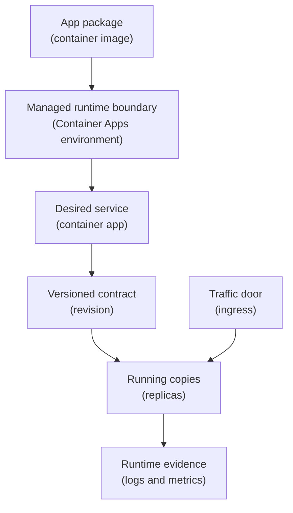

## Table of Contents

1. [The Image Exists, Now It Needs A Runtime](#the-image-exists-now-it-needs-a-runtime)
2. [If You Know ECS And Fargate](#if-you-know-ecs-and-fargate)
3. [The Container Apps Pieces In One Mental Model](#the-container-apps-pieces-in-one-mental-model)
4. [From Image To Container App](#from-image-to-container-app)
5. [Revisions Replace Copies Safely](#revisions-replace-copies-safely)
6. [Ingress Is The Service Door](#ingress-is-the-service-door)
7. [Scaling Decides How Many Replicas Exist](#scaling-decides-how-many-replicas-exist)
8. [Identity And Secrets Keep Credentials Out Of The Image](#identity-and-secrets-keep-credentials-out-of-the-image)
9. [Logs Tell You Which Layer Failed](#logs-tell-you-which-layer-failed)
10. [Failure Modes, Fix Directions, And Tradeoff](#failure-modes-fix-directions-and-tradeoff)

## The Image Exists, Now It Needs A Runtime

A container image is a good delivery package.
It holds the application code, runtime dependencies, startup command, and file layout in one repeatable unit.
That is why teams like containers for backend services.
The image that passed CI can be the same image that runs in staging and production.

But an image is still only a package.
It does not answer the operating questions by itself.
Who pulls the image?
Where does it run?
How many copies should exist?
Which port receives traffic?
Which secret values are injected at startup?
What happens when a new image tag is deployed and the new copy is unhealthy?

Azure Container Apps is Azure's managed runtime for containerized apps and jobs.
Managed runtime means Azure owns much of the container hosting platform for you:
server capacity, container orchestration, basic ingress, scaling decisions, revision management, and log plumbing.
You still own the image, resource sizing, runtime configuration, health behavior, identity, secrets, network exposure, and release decision.

This service exists because many application teams want to run containers without operating a Kubernetes cluster or a fleet of virtual machines first.
You give Azure a container image and a small service contract.
Azure creates running replicas, sends traffic to active revisions, scales replicas according to rules, restarts crashed containers, and gives you status and logs to inspect.

In the larger Azure map, Container Apps sits in the compute layer.
It is not your container registry.
It is not your database.
It is not your DNS zone.
It is the place where the already-built container becomes a running app.

The running example is `devpolaris-orders-api`.
The team has already built and pushed this image to Azure Container Registry:

```text
acrdevpolarisprod.azurecr.io/devpolaris-orders-api:2026-05-03.4
```

The API listens on port `3000`.
Customers should eventually reach it at `https://orders.devpolaris.com`.
The app needs a database connection secret, a Stripe webhook secret, and a managed identity so it can read Key Vault without storing a cloud password.

The first useful beginner question is not "how do I use every Container Apps feature?"
The useful question is:
what does Azure need to know so this container can behave like a real API?

For `devpolaris-orders-api`, Azure needs answers like these:

| Question | Example answer |
|----------|----------------|
| Which image should run? | `acrdevpolarisprod.azurecr.io/devpolaris-orders-api:2026-05-03.4` |
| Where should the app live? | `cae-devpolaris-prod` Container Apps environment |
| What is the app resource called? | `ca-devpolaris-orders-api-prod` |
| Which port does the process listen on? | `3000` |
| Should public traffic be accepted? | Yes, external HTTP ingress |
| How many copies should stay warm? | Minimum `2`, maximum `10` |
| Which identity does the app use? | `mi-devpolaris-orders-api-prod` |
| Which secrets does the app need? | `ORDERS_DB_URL`, `STRIPE_WEBHOOK_SECRET` |
| Where should evidence go? | Environment Log Analytics workspace |

Those answers are the practical shape of the service.
The rest of the article teaches the Azure nouns behind that table and how to debug them when they disagree.

## If You Know ECS And Fargate

If you learned AWS first, Container Apps may remind you of ECS with Fargate.
That instinct is useful.
Both services let a team run containers without patching the underlying container hosts.
Both need an image, runtime config, network exposure, logs, secrets, identity, and scaling rules.

The bridge is helpful, but the nouns are not one-to-one.
Azure Container Apps uses its own resource model.
If you try to force every ECS word into Azure, the first production issue will feel more confusing than it needs to.

Here is the safer translation:

| AWS idea you know | Azure idea to learn | What changes |
|-------------------|---------------------|--------------|
| ECR image | ACR or other registry image | Container Apps can pull from public or private registries |
| ECS cluster | Container Apps environment | The environment is a secure boundary with shared network and log destination |
| ECS service | Container app | The app keeps replicas running and owns ingress, revision mode, secrets, and scale rules |
| Task definition revision | Container app revision | A revision is an immutable snapshot of revision-scoped configuration |
| Fargate task | Replica | A replica is one running copy of a revision |
| ALB target group | Container Apps ingress | Built-in ingress can expose HTTP or TCP without creating a separate load balancer |
| Task role | Managed identity plus Azure RBAC | Identity proves the caller, role assignments grant access |
| CloudWatch Logs | Azure Monitor and Log Analytics | Environment and app logs are centralized through Azure monitoring services |

The biggest Azure-specific noun is the Container Apps environment.
It is not just a folder.
It is the boundary around one or more container apps and jobs.
Apps in the same environment can share network behavior and the same logging destination.
That makes the environment an early design choice, not a detail you can ignore until the end.

The second Azure-specific noun is the revision.
In ECS, you may be used to registering new task definition revisions.
In Container Apps, revision-scoped changes create a new revision of the app.
Changing the image, environment variables, CPU, memory, or scale rules can create a new revision.
The app can then move traffic to that revision when it is healthy.

The third difference is ingress.
For a beginner ECS service, you often picture an Application Load Balancer in front of tasks.
In Container Apps, HTTP ingress is built into the Container Apps environment.
You still must get the port, visibility, domain, and TLS story right, but you are not starting by creating a separate load balancer.

The practical AWS callback is this:
keep the same operating habit, but learn the Azure resource boundaries.
Ask which image, which app, which revision, which replica, which environment, which ingress setting, which identity, and which log stream.

## The Container Apps Pieces In One Mental Model

The easiest way to learn Container Apps is to follow the image from registry to request.
The image starts in a registry.
The Container Apps environment gives the app a managed place to run.
The container app resource describes the desired service.
A revision records one version of the runtime contract.
Replicas are the live copies that actually answer requests.
Ingress is the door where traffic enters.
Logs are the evidence when a copy fails.

Read this top to bottom.
The plain-English label comes first, and the Azure term appears in parentheses.



The image is the package.
It should already contain the application and the startup command.
For a Node API, that may be a `CMD ["node", "dist/server.js"]` style command in the image.
Container Apps does not need to know that the code is Node if the image starts correctly and listens on the configured port.

The environment is the managed boundary.
It is where Azure handles platform work such as runtime management, scale operations, failover procedures, resource balancing, and shared logging.
Multiple container apps can live in the same environment when they are related and allowed to share that boundary.

The container app is the service resource you operate day to day.
For this article, the app is `ca-devpolaris-orders-api-prod`.
It owns the image reference, container name, environment variables, secret references, scale settings, ingress settings, managed identity attachment, and revision mode.

The revision is a snapshot of the app's revision-scoped configuration.
That word "snapshot" matters.
If you deploy a new image tag, Container Apps creates a new revision.
If that revision fails, you can inspect it without guessing which config was active at the time.

The replica is the live running copy.
If the revision has two replicas, there are two copies of the same app version serving traffic.
If one replica crashes, the platform can try to replace it.
If traffic rises and a scale rule allows it, the revision can add more replicas.

Ingress is the entry point.
With external HTTP ingress, the app can receive public requests through a generated fully qualified domain name, and later through a custom domain.
With internal ingress, the app is reachable only inside the environment.
For `devpolaris-orders-api`, public checkout traffic means external HTTP ingress is the expected first shape.

Logs are where you stop guessing.
System logs tell you what the platform is doing:
pulling images, provisioning revisions, scaling replicas, and failing readiness.
Console logs are what your container writes to `stdout` and `stderr`.
A good production container writes useful startup and request logs there because Container Apps can collect them.

## From Image To Container App

The image line is the bridge between CI and Azure runtime.
If CI pushed `acrdevpolarisprod.azurecr.io/devpolaris-orders-api:2026-05-03.4`, the Container App must point at exactly that image or a digest for that image.
Do not use `latest` for production unless you are comfortable making incidents harder to explain.
A unique tag or image digest lets you answer, "what code is this revision running?"

A first deployment might be represented like this:

```bash
$ az containerapp create \
>   --name ca-devpolaris-orders-api-prod \
>   --resource-group rg-devpolaris-orders-prod \
>   --environment cae-devpolaris-prod \
>   --image acrdevpolarisprod.azurecr.io/devpolaris-orders-api:2026-05-03.4 \
>   --target-port 3000 \
>   --ingress external \
>   --min-replicas 2 \
>   --max-replicas 10 \
>   --query "{name:name,latestRevision:properties.latestRevisionName,fqdn:properties.configuration.ingress.fqdn}" \
>   --output json
{
  "name": "ca-devpolaris-orders-api-prod",
  "latestRevision": "ca-devpolaris-orders-api-prod--d9w84pc",
  "fqdn": "ca-devpolaris-orders-api-prod.greenridge-12345678.uksouth.azurecontainerapps.io"
}
```

This is not meant to be a complete production script.
It shows the first contract Azure needs.
The app name tells Azure which service resource to create.
The environment tells Azure where the service belongs.
The image tells Azure what to run.
The target port tells ingress where the container listens.
The replica limits tell Azure the allowed scale range.

After deployment, inspect the app as a resource, not as a hope:

```bash
$ az containerapp show \
>   --name ca-devpolaris-orders-api-prod \
>   --resource-group rg-devpolaris-orders-prod \
>   --query "{image:properties.template.containers[0].image,targetPort:properties.configuration.ingress.targetPort,external:properties.configuration.ingress.external,revision:properties.latestRevisionName}" \
>   --output json
{
  "image": "acrdevpolarisprod.azurecr.io/devpolaris-orders-api:2026-05-03.4",
  "targetPort": 3000,
  "external": true,
  "revision": "ca-devpolaris-orders-api-prod--d9w84pc"
}
```

The important check is alignment.
The image tag should match the release.
The target port should match the port the process actually listens on.
External ingress should be enabled only if this app is meant to receive public traffic.
The latest revision should be the one you expect to investigate if the deploy goes wrong.

For `devpolaris-orders-api`, the app should not rely on files that exist only on a developer laptop.
If the container starts locally because `.env` or `config/local.json` exists outside the image, the cloud runtime will expose that mistake.
The image must contain the app files it needs, and runtime values must arrive through environment variables, secret references, or managed service calls.

The clean separation is:
the image contains code and non-secret defaults.
Container Apps supplies runtime configuration.
Key Vault stores sensitive values.
Managed identity lets the running app read protected Azure resources without an app-owned password.

## Revisions Replace Copies Safely

A backend release is not only "start the new container."
The real job is to replace old working copies with new working copies without sending user traffic to broken ones.
That is why revisions matter.

A revision is an immutable snapshot of a container app version.
Immutable means it does not change after it is created.
When you change revision-scoped settings, such as the image, container resources, environment variables, or scale rules, Container Apps creates a new revision.
The old revision still exists as evidence and, depending on mode, may remain active or inactive.

For a normal production API, single revision mode is usually the calm beginner choice.
In single revision mode, Container Apps activates the new revision and moves traffic after the new replicas are ready.
If the update fails, traffic can remain on the old revision.
That is a protective default because it avoids splitting traffic by accident.

Multiple revision mode is useful when you intentionally want more control.
For example, you may send 5 percent of traffic to a new revision while 95 percent stays on the old revision.
That supports blue-green or canary-style releases.
The trade is that your team must manage traffic weights and deactivation more deliberately.

Here is a healthy revision list after a simple image update:

```bash
$ az containerapp revision list \
>   --name ca-devpolaris-orders-api-prod \
>   --resource-group rg-devpolaris-orders-prod \
>   --query "[].{name:name,active:properties.active,traffic:properties.trafficWeight,provisioning:properties.provisioningState,running:properties.runningState,replicas:properties.replicas}" \
>   --output table
Name                                      Active    Traffic    Provisioning    Running    Replicas
----------------------------------------  --------  ---------  --------------  ---------  --------
ca-devpolaris-orders-api-prod--d9w84pc    False     0          Provisioned     Running    0
ca-devpolaris-orders-api-prod--k7m2hls    True      100        Provisioned     Running    2
```

This table gives you a release story.
The new revision `k7m2hls` is active.
It receives all traffic.
It is provisioned.
It has two replicas.
The old revision is inactive or receiving no traffic.

During a deployment, the table may be less settled:

```text
Name                                      Active    Traffic    Provisioning    Running       Replicas
----------------------------------------  --------  ---------  --------------  ------------  --------
ca-devpolaris-orders-api-prod--k7m2hls    True      100        Provisioned     Running       2
ca-devpolaris-orders-api-prod--q4r8nva    True      0          Provisioning    Activating    1
```

This is not automatically a failure.
It means Azure is trying to provision the new revision.
The next question is whether it becomes `Provisioned` and `Running`, or whether it moves to `Degraded`, `Failed`, or `Activation failed`.

Revision thinking helps beginners avoid random debugging.
You do not ask, "is the app broken?"
You ask:
which revision is active, which revision receives traffic, which revision has replicas, and which revision has the first useful error?

## Ingress Is The Service Door

Your container can be healthy and still unreachable if ingress points at the wrong door.
Ingress is the Container Apps feature that decides how traffic reaches your app.
For HTTP APIs, it can provide a generated hostname, TLS termination, routing to active revisions, and traffic splitting.

External ingress means the app can accept traffic from the public internet and from inside the environment.
Internal ingress means the app is reachable only from inside the Container Apps environment.
For an orders API that customers call through a public hostname, external ingress is the likely first choice.
For a private worker or internal pricing service, internal ingress is usually safer.

The target port is the easy detail that causes many first failures.
It must match the port where the application process listens inside the container.
If the Node process listens on `3000` but ingress targets `8080`, Azure can send traffic to a port where nothing is listening.
The app may look "deployed" while requests fail or readiness checks never pass.

You can inspect the generated endpoint and port like this:

```bash
$ az containerapp show \
>   --name ca-devpolaris-orders-api-prod \
>   --resource-group rg-devpolaris-orders-prod \
>   --query "{fqdn:properties.configuration.ingress.fqdn,external:properties.configuration.ingress.external,targetPort:properties.configuration.ingress.targetPort,transport:properties.configuration.ingress.transport}" \
>   --output json
{
  "fqdn": "ca-devpolaris-orders-api-prod.greenridge-12345678.uksouth.azurecontainerapps.io",
  "external": true,
  "targetPort": 3000,
  "transport": "auto"
}
```

The generated FQDN is useful before the custom domain is attached.
It lets the team test the platform route directly:

```bash
$ curl -i https://ca-devpolaris-orders-api-prod.greenridge-12345678.uksouth.azurecontainerapps.io/health
HTTP/2 200
content-type: application/json; charset=utf-8

{"status":"ok","service":"devpolaris-orders-api","revision":"ca-devpolaris-orders-api-prod--k7m2hls"}
```

That response proves several things at once.
DNS for the generated hostname works.
Ingress is external.
TLS is accepted at the Container Apps entry point.
Traffic reaches a replica.
The application health endpoint responds on the expected path.

It does not prove your custom domain is ready.
`orders.devpolaris.com` still needs DNS, custom domain validation, and TLS binding.
Keep those layers separate.
If the generated hostname works but the custom domain fails, inspect DNS and certificate binding.
If both fail, inspect ingress, revision health, and app logs first.

## Scaling Decides How Many Replicas Exist

Scaling is the answer to a simple operating question:
how many running copies should exist right now?
Container Apps calls those running copies replicas.
A replica is one live copy of a revision.

Scaling has three parts:
limits, rules, and behavior.
Limits set the minimum and maximum number of replicas.
Rules say what signal should add or remove replicas.
Behavior is how Azure applies those decisions over time.

For an HTTP API, a common first scaling shape is:
keep at least two replicas warm for availability, and allow more replicas when concurrent requests rise.
That keeps the checkout API ready for normal traffic while still giving Azure room to scale out during a busy release day.

The deployment contract might look like this:

```bash
$ az containerapp update \
>   --name ca-devpolaris-orders-api-prod \
>   --resource-group rg-devpolaris-orders-prod \
>   --min-replicas 2 \
>   --max-replicas 10 \
>   --scale-rule-name orders-http \
>   --scale-rule-http-concurrency 80
```

The exact number `80` is not magic.
It is a starting guess that should be checked against real latency, CPU, memory, and database connection behavior.
If each request is light and the app stays fast, one replica may handle more.
If each request performs heavy work or waits on a database, fewer concurrent requests per replica may be healthier.

You can inspect the scale settings as evidence:

```bash
$ az containerapp show \
>   --name ca-devpolaris-orders-api-prod \
>   --resource-group rg-devpolaris-orders-prod \
>   --query "{min:properties.template.scale.minReplicas,max:properties.template.scale.maxReplicas,rules:properties.template.scale.rules}" \
>   --output json
{
  "min": 2,
  "max": 10,
  "rules": [
    {
      "name": "orders-http",
      "http": {
        "metadata": {
          "concurrentRequests": "80"
        }
      }
    }
  ]
}
```

A beginner detail matters here:
some scale signals can scale to zero, and some cannot.
For a public API where the first request should not wait for a cold start, a minimum replica count of `1` or more is usually easier to operate.
For a background worker that processes queue messages and can tolerate startup time, scaling to zero may be a good cost trade.

Scaling also has a downstream cost.
If `devpolaris-orders-api` scales from 2 replicas to 10 replicas, the database sees more clients.
The payment provider may see more concurrent calls.
The logs become noisier.
Autoscaling solves compute pressure only when the rest of the system can accept the extra work.

The healthy mental model is:
replicas protect the app from traffic pressure, but they do not remove every bottleneck.
Watch app latency, error rate, memory, CPU, database connection count, and external dependency errors together.

## Identity And Secrets Keep Credentials Out Of The Image

A container image should not contain production secrets.
That includes database URLs with passwords, API keys, webhook secrets, storage keys, and cloud credentials.
If the secret is baked into the image, every place that can pull the image can potentially read the secret.
Rotating the secret also means rebuilding and redeploying the image.

Container Apps gives you two separate tools for this problem:
secrets and managed identity.
Secrets are named sensitive values available to the container app.
Managed identity is an Azure-managed workload identity that lets the running app access Microsoft Entra protected resources without carrying a long-lived cloud password.

The distinction matters.
A secret answers, "what sensitive value does the app need at runtime?"
A managed identity answers, "who is this running app when it calls Azure?"
The app may use both.

For `devpolaris-orders-api`, the cleaner production shape is:

```text
Runtime identity:
  mi-devpolaris-orders-api-prod

Container Apps secrets:
  orders-db-url -> Key Vault reference
  stripe-webhook-secret -> Key Vault reference

Environment variables inside the container:
  ORDERS_DB_URL=secretref:orders-db-url
  STRIPE_WEBHOOK_SECRET=secretref:stripe-webhook-secret
  AZURE_CLIENT_ID=<client id of mi-devpolaris-orders-api-prod>
```

The app sees `ORDERS_DB_URL` as an environment variable.
The secret value is not written into the image.
The secret value is not shown in normal config output.
The Key Vault reference lets the source secret live in Key Vault while Container Apps makes it available to the app.

A CLI shape for a user-assigned identity and Key Vault backed secret can look like this:

```bash
$ az containerapp update \
>   --name ca-devpolaris-orders-api-prod \
>   --resource-group rg-devpolaris-orders-prod \
>   --user-assigned /subscriptions/11111111-2222-3333-4444-555555555555/resourceGroups/rg-devpolaris-orders-prod/providers/Microsoft.ManagedIdentity/userAssignedIdentities/mi-devpolaris-orders-api-prod \
>   --secrets "orders-db-url=keyvaultref:https://kv-devpolaris-orders-prod.vault.azure.net/secrets/orders-db-url,identityref:/subscriptions/11111111-2222-3333-4444-555555555555/resourceGroups/rg-devpolaris-orders-prod/providers/Microsoft.ManagedIdentity/userAssignedIdentities/mi-devpolaris-orders-api-prod" \
>   --env-vars "ORDERS_DB_URL=secretref:orders-db-url"
```

This command is long because the resource identity is explicit.
That is a good thing in production automation.
It makes the runtime identity visible in review, and it avoids hidden credentials.

The managed identity still needs permission.
For Key Vault secrets, the identity needs a role such as `Key Vault Secrets User` at the right scope.
For pulling images from a private Azure Container Registry, the identity or registry configuration needs pull access.
An identity with no role assignment proves who the app is, but it does not open any resource door.

There is one secret lifecycle detail worth remembering:
changing a Container Apps secret does not automatically create a new revision.
Existing revisions may need a restart, or you may deploy a new revision that references the updated secret.
That is useful because secret updates are app-level changes, but it also means you should verify which revision picked up the value.

## Logs Tell You Which Layer Failed

When a container does not start, logs are usually more useful than a dashboard color.
Container Apps gives you two important log views.
System logs come from the platform.
Console logs come from your container's `stdout` and `stderr`.

System logs answer platform questions:
did Azure pull the image, create the revision, start replicas, route ingress, and scale the app?
Console logs answer application questions:
did the process start, read config, connect to dependencies, bind the port, and handle requests?

Start with revision status:

```bash
$ az containerapp revision list \
>   --name ca-devpolaris-orders-api-prod \
>   --resource-group rg-devpolaris-orders-prod \
>   --query "[].{name:name,active:properties.active,provisioning:properties.provisioningState,running:properties.runningState,created:properties.createdTime}" \
>   --output table
Name                                      Active    Provisioning         Running              Created
----------------------------------------  --------  -------------------  -------------------  --------------------------
ca-devpolaris-orders-api-prod--k7m2hls    True      Provisioned          Running              2026-05-03T10:42:18+00:00
ca-devpolaris-orders-api-prod--r2c6xpm    True      Provisioning failed  Activation failed    2026-05-03T11:08:54+00:00
```

That output tells you which revision deserves attention.
The old revision is still running.
The new revision failed activation.
Now read system logs for the failing revision:

```bash
$ az containerapp logs show \
>   --name ca-devpolaris-orders-api-prod \
>   --resource-group rg-devpolaris-orders-prod \
>   --revision ca-devpolaris-orders-api-prod--r2c6xpm \
>   --type system \
>   --tail 30
2026-05-03T11:09:02.114Z Pulling image "acrdevpolarisprod.azurecr.io/devpolaris-orders-api:2026-05-03.5"
2026-05-03T11:09:07.392Z Error provisioning revision ca-devpolaris-orders-api-prod--r2c6xpm. ErrorCode: [ErrImagePull]
2026-05-03T11:09:07.393Z Failed to pull image. Manifest not found for tag "2026-05-03.5"
```

The fix path is now narrow.
Do not change ingress.
Do not rotate secrets.
Do not blame scaling.
The image tag does not exist or the app cannot access it.
Check the registry, tag, and pull permission.

Console logs give a different kind of evidence.
Here the image starts, but the app exits because a required secret-backed environment variable is missing:

```bash
$ az containerapp logs show \
>   --name ca-devpolaris-orders-api-prod \
>   --resource-group rg-devpolaris-orders-prod \
>   --revision ca-devpolaris-orders-api-prod--q4r8nva \
>   --type console \
>   --tail 20
2026-05-03T11:22:41.801Z orders-api starting
2026-05-03T11:22:41.812Z config validation failed
2026-05-03T11:22:41.812Z missing required environment variable ORDERS_DB_URL
2026-05-03T11:22:41.813Z process exiting with code 1
```

This is an application configuration failure.
The image can be pulled.
The revision can start the process.
The process refuses to run because its runtime contract is incomplete.
The fix is to define the secret, reference it with `secretref:orders-db-url`, and create or restart the revision that needs the value.

A healthy app also writes useful console logs.
Not secrets.
Not full request bodies.
Useful signals:
startup version, port, environment name, revision name when available, health check results, request ID, status code, latency, and dependency errors.

Good logs are not decoration.
They are how a junior engineer can join an incident and make one careful observation at a time.

## Failure Modes, Fix Directions, And Tradeoff

Most first Container Apps failures come from a few mismatches.
The platform is telling the truth, but a layer of the contract does not agree with another layer.
The fastest path is to identify which layer disagrees.

The first common failure is a bad image tag.
The deploy command points at a tag that CI never pushed, or the registry blocks the pull.
It looks like a revision that never starts:

```text
Revision: ca-devpolaris-orders-api-prod--r2c6xpm
Provisioning status: Provisioning failed
Running status: Activation failed

System log:
Error provisioning revision ca-devpolaris-orders-api-prod--r2c6xpm. ErrorCode: [ErrImagePull]
Failed to pull image. Manifest not found for tag "2026-05-03.5"
```

The fix direction is to verify the image exists and the runtime can pull it.
Check the ACR repository tags.
Check that the image name is lowercase and exact.
Check that the Container App has the correct registry access.
Redeploy with the correct tag or digest.

The second common failure is a missing secret reference.
The app expects `ORDERS_DB_URL`, but the Container App does not define it, or the environment variable points to a secret name that does not exist.
The revision may start and crash repeatedly:

```text
Console log:
orders-api starting
config validation failed
missing required environment variable ORDERS_DB_URL
process exiting with code 1

System log:
Container "orders-api" terminated with exit code 1.
Error provisioning revision ca-devpolaris-orders-api-prod--q4r8nva. ErrorCode: [ContainerCrashing]
```

The fix direction is to inspect both the secret and the environment variable.
The secret name might be `orders-db-url`.
The environment variable must reference it as `ORDERS_DB_URL=secretref:orders-db-url`.
If the secret is a Key Vault reference, verify the managed identity exists, is assigned to the app, and has permission to read that secret.

The third common failure is an unhealthy revision caused by a port mismatch.
The app listens on `3000`, but ingress or probes target `8080`.
The process may be alive, but the platform cannot reach the expected port:

```text
Revision: ca-devpolaris-orders-api-prod--m5z9tbd
Provisioning status: Provisioned
Running status: Degraded

System log:
Readiness probe failed for container "orders-api": connect tcp 10.0.4.23:8080: connection refused
Replica ca-devpolaris-orders-api-prod--m5z9tbd-7c756c8949-bxv4p is not ready.
```

The fix direction is to make the port contract agree.
Either update the app to listen on the configured target port, or update Container Apps ingress to target the port the app actually uses.
For `devpolaris-orders-api`, the contract is `PORT=3000` and ingress target port `3000`.

The fourth common failure is an ingress visibility mismatch.
The app is configured with internal ingress, but a user tests it from the public internet.
The container may be fine, but the route is not public:

```bash
$ az containerapp show \
>   --name ca-devpolaris-orders-api-prod \
>   --resource-group rg-devpolaris-orders-prod \
>   --query "{external:properties.configuration.ingress.external,fqdn:properties.configuration.ingress.fqdn}" \
>   --output json
{
  "external": false,
  "fqdn": "ca-devpolaris-orders-api-prod.internal.greenridge-12345678.uksouth.azurecontainerapps.io"
}

$ curl -i https://orders.devpolaris.com/health
HTTP/2 404
content-type: text/plain

No route matched this request
```

The fix direction is not to rebuild the image.
Decide whether the API should be public.
If yes, enable external ingress and bind the custom domain correctly.
If no, test from another app inside the same environment and keep the public DNS path away from this service.

Here is the quick diagnostic map:

| Symptom | First place to inspect | Likely layer |
|---------|------------------------|--------------|
| `ErrImagePull` | System logs and registry tags | Image reference or registry access |
| Exit code `1` with config error | Console logs | App config or missing secret |
| `Degraded` with probe failures | Revision state and system logs | Port, health path, startup time, or probe settings |
| Generated FQDN works, custom domain fails | DNS, custom domain, TLS binding | Public entry layer |
| No replicas until traffic arrives | Scale settings | Minimum replicas and scale rule |
| Key Vault secret cannot sync | Secret diagnostics, identity, RBAC | Managed identity or Key Vault permission |

This table is not a replacement for thinking.
It is a way to ask the next question in the right place.
When you find the layer, the fix usually gets smaller.

Container Apps is a strong default when your team already has a containerized HTTP API and wants a managed runtime before it wants a Kubernetes operations practice.
You keep the Docker packaging habit.
You get built-in ingress, revisions, scaling, identity integration, secrets, logs, and managed platform work.
That is a helpful path for `devpolaris-orders-api`.

The gain is less infrastructure care.
You do not patch Kubernetes nodes.
You do not manage an ingress controller.
You do not create a separate load balancer for the first HTTP entry point.
You do not keep a VM fleet warm just to run a small containerized API.

The cost is less low-level control.
You operate through Container Apps concepts, not through direct host access.
If you need custom kernel modules, special node agents, unusual networking control, or deep Kubernetes APIs, Container Apps may feel too managed.
Azure Kubernetes Service, App Service, Functions, or virtual machines may be more honest depending on the workload.

The second cost is that managed does not mean automatic design.
You still need to choose environment boundaries, public or internal ingress, unique image tags, minimum replicas, scale rules, managed identities, Key Vault access, secret rotation behavior, and logging quality.
The platform will run the contract you give it.
If the contract says wrong port, missing secret, or bad tag, the platform will faithfully show that failure.

For the orders API, a careful first production checklist looks like this:

| Check | Healthy answer |
|-------|----------------|
| Image reference | Unique tag or digest from the release pipeline |
| Environment | Production app environment, not a shared experiment boundary |
| Revision mode | Single unless the team intentionally manages traffic splitting |
| Ingress | External HTTP for public API, target port `3000` |
| Scaling | Minimum replicas keep the API warm, maximum protects cost and dependencies |
| Identity | User-assigned identity attached and visible in config |
| Secrets | Key Vault references, injected through `secretref`, no secret in image |
| Logs | System and console logs available, startup logs prove config without leaking values |
| Failure evidence | Revision state, system logs, console logs, and generated FQDN test captured during release |

The mature habit is not to memorize every setting.
The mature habit is to make each layer inspectable.
When the image, app, revision, replica, ingress, identity, secret, and log story all line up, Container Apps becomes a calm way to run a real containerized API on Azure.

---

**References**

- [Azure Container Apps overview](https://learn.microsoft.com/en-us/azure/container-apps/overview) - Microsoft Learn explains where Container Apps fits, common use cases, scaling, ingress, revisions, registry support, secrets, and logs.
- [Azure Container Apps environments](https://learn.microsoft.com/en-us/azure/container-apps/environment) - Microsoft Learn defines environments as the secure boundary for apps and jobs, including shared network and logging behavior.
- [Update and deploy changes in Azure Container Apps](https://learn.microsoft.com/en-us/azure/container-apps/revisions) - Microsoft Learn explains immutable revisions, revision states, single revision mode, multiple revision mode, and traffic behavior.
- [Ingress in Azure Container Apps](https://learn.microsoft.com/en-us/azure/container-apps/ingress-overview) - Microsoft Learn covers external and internal ingress, HTTP and TCP entry points, domain names, authentication, and traffic splitting.
- [Set scaling rules in Azure Container Apps](https://learn.microsoft.com/en-us/azure/container-apps/scale-app) - Microsoft Learn explains replica limits, HTTP scaling, TCP scaling, custom rules, KEDA, and scale-to-zero considerations.
- [Manage secrets in Azure Container Apps](https://learn.microsoft.com/en-us/azure/container-apps/manage-secrets) - Microsoft Learn shows application-scoped secrets, Key Vault references, secret references in environment variables, and troubleshooting for Key Vault access.
