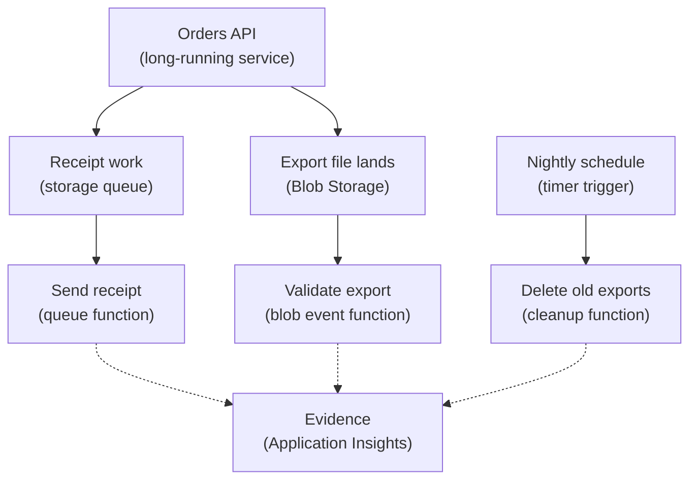

## Table of Contents

1. [A Job That Starts From An Event](#a-job-that-starts-from-an-event)
2. [If You Know AWS Lambda](#if-you-know-aws-lambda)
3. [Events, Triggers, Bindings, And Invocations](#events-triggers-bindings-and-invocations)
4. [Supporting Jobs Around The Orders API](#supporting-jobs-around-the-orders-api)
5. [HTTP, Queue, Timer, And Blob Triggers](#http-queue-timer-and-blob-triggers)
6. [Settings That Shape One Function App](#settings-that-shape-one-function-app)
7. [Evidence, Logs, And Application Insights](#evidence-logs-and-application-insights)
8. [Failure Modes You Will Actually See](#failure-modes-you-will-actually-see)
9. [The Tradeoff: Small Jobs, Many Edges](#the-tradeoff-small-jobs-many-edges)
10. [A First Design Checklist](#a-first-design-checklist)

## A Job That Starts From An Event

Some backend work does not need a server waiting all day.
It needs code to wake up, handle one small piece of work, write a result, and stop.

That is the main idea behind Azure Functions.
Azure Functions is Azure's event-driven compute service.
You write a small function, connect it to a trigger, and Azure runs the function when that trigger fires.
The trigger might be an HTTP request, a queue message, a timer schedule, a blob upload, or an event from another Azure service.

This exists because many production jobs are reactions.
An order was created, so send a receipt.
A customer requested an export, so generate a file.
A temporary export is old, so delete it.
A blob landed in storage, so validate it and start the next step.
None of those jobs need to own a public port or keep a process warm every second of the day.

In the larger compute map, Azure Functions usually sits beside your main application, not always in place of it.
`devpolaris-orders-api` still handles checkout requests as a normal API.
It owns business rules, authentication, request validation, and the synchronous response to users.
Functions handle bounded support work that starts from clear events.

Bounded means you can answer four questions:
what starts the work, what input does the function receive, what output does it produce, and what counts as done?
If you cannot answer those questions, a long-running service may be easier to reason about.

This article follows supporting jobs around `devpolaris-orders-api`.
The API writes orders.
After that, Azure Functions can send receipts, generate exports, clean old files, and react to blob events.
The goal is not to turn every piece of backend code into a function.
The goal is to learn when event-driven compute is the clean shape.

Here is the simplest mental model:

```text
Long-running API
  process starts
  listens on port 3000
  waits for many requests
  keeps running between requests

Event-driven function
  event arrives
  function is invoked
  one small job runs
  invocation ends
```

The important difference is the start point.
The API starts first and waits.
The function starts because something happened.

> Azure Functions is easiest when the job sounds like "when this happens, do this bounded piece of work."

## If You Know AWS Lambda

If you have learned AWS Lambda, Azure Functions will feel familiar.
Both services run code because an event arrived.
Both can respond to HTTP, queues, schedules, storage events, and service events.
Both hide the server you would otherwise operate.
Both make you think carefully about retries, timeouts, permissions, logs, and event shape.

The bridge is useful, but Azure has its own nouns.
A function app is the Azure container for one or more functions.
The hosting plan decides scaling and resource behavior.
Triggers and bindings are central vocabulary in Azure Functions.

| AWS Lambda idea | Azure Functions idea | Careful difference |
|-----------------|----------------------|--------------------|
| Lambda function | Function inside a function app | Azure groups functions under a function app resource |
| Event source mapping | Trigger or trigger binding | Azure names the invocation source a trigger |
| Handler | Handler function | Same idea, but syntax depends on language model |
| Execution role | Managed identity or app settings plus RBAC | Prefer identity-based access where supported |
| CloudWatch Logs | Application Insights and Azure Monitor logs | Query and stream function execution evidence in Azure |
| Lambda timeout and memory | Function app and hosting plan settings | Plan choice affects scale, networking, and resources |
| S3 event | Blob or Event Grid based trigger | Blob change events can flow through Event Grid |
| SQS queue trigger | Azure Queue Storage or Service Bus trigger | Retry and poison behavior depend on the trigger type |

The biggest Azure-specific idea is the function app.
You may deploy several related functions into one function app, such as `receiptSender`, `exportGenerator`, and `exportCleanup`.
They share some host settings, app settings, monitoring configuration, and hosting plan behavior.
That shared container is convenient, but it also means a bad host setting can affect more than one function.

The second Azure-specific idea is bindings.
A trigger is the binding that starts the function.
Other bindings can pass data in or write data out.
Bindings can reduce boilerplate, but they do not remove the need to understand the event contract.
Your code still needs to know what fields matter and what failures should be retried.

The third Azure-specific idea is plan choice.
For new serverless function apps, Microsoft Learn currently points learners toward the Flex Consumption plan.
The plan decides scaling behavior, available resources, networking options, and cost shape.
You do not need to memorize every plan now.
You do need to know that "Azure Functions" is not a single runtime shape.

## Events, Triggers, Bindings, And Invocations

An event is a message that says something happened.
It is usually JSON-shaped data.
For a queue job, the event might say `orderId=ord_1042`.
For a blob job, the event might say a file named `exports/ord_1042.csv` was created.
For a timer job, the event might say the schedule reached midnight.

A trigger is the thing that causes a function to run.
Every function has exactly one trigger.
That rule is helpful.
It forces you to name the one reason this function wakes up.

A binding is a declarative connection between a function and another resource.
The trigger is a special input binding.
Other input bindings can fetch data for the function.
Output bindings can write data after the function runs.
You can also call Azure SDKs directly from code.
The right choice depends on how clear the binding makes the job.

An invocation is one attempt to run a function for one trigger event or one batch of events.
If a queue has many messages, Azure Functions may process messages concurrently depending on the trigger, host settings, and hosting plan.
If the function throws an error, the trigger's retry behavior decides what happens next.

For beginners, the event contract matters more than the cleverness of the code.
Here is the queue message `devpolaris-orders-api` writes after checkout:

```json
{
  "type": "receipt.requested",
  "orderId": "ord_1042",
  "customerEmail": "maya@example.com",
  "total": "49.00",
  "currency": "GBP",
  "requestedAt": "2026-05-03T09:31:18Z"
}
```

This small JSON document is the contract between the API and the receipt function.
The API promises to write these fields.
The function promises to validate them, send the receipt, and log enough evidence to trace the result.

Here is a simple Node.js v4 Azure Functions shape for the receipt queue.
The exact syntax is less important than the operating idea:
one queue message starts one handler.

```js
const { app } = require("@azure/functions");

app.storageQueue("receiptSender", {
  queueName: "orders-receipts",
  connection: "OrdersStorage",
  handler: async (message, context) => {
    if (!message.orderId || !message.customerEmail) {
      throw new Error(`invalid receipt message id=${context.triggerMetadata.id}`);
    }

    context.log("sending receipt", {
      orderId: message.orderId,
      queueMessageId: context.triggerMetadata.id,
      dequeueCount: context.triggerMetadata.dequeueCount
    });

    await sendReceipt(message);
  }
});
```

The handler validates first because event-driven failures can repeat.
If the message is malformed and the handler keeps throwing, the trigger may retry the same bad message several times.
Clear validation makes that failure visible.

Notice the log fields.
The `orderId` connects the function back to the business event.
The queue message ID connects the function back to the trigger.
The dequeue count tells you whether this is the first attempt or a repeated attempt.
Those fields are much more useful than a vague `receipt failed`.

## Supporting Jobs Around The Orders API

The main orders API should stay boring.
It receives a checkout request, validates the cart, creates the order, and returns a response.
Users should not wait for every slow support task before their checkout completes.

Event-driven work helps when the side job can happen after the main response or on a schedule.
That does not mean the side job is unimportant.
Receipt emails, export files, cleanup, and partner support jobs still need ownership and monitoring.
They simply do not need to live inside the request path.

Here is the shape for `devpolaris-orders-api`:



The diagram has one main lesson:
the API is still the center of the product workflow, but it does not carry every support task in its own process.
The jobs wake up when their input appears.

The team chooses four first functions:

| Function | Trigger | What starts it | What done means |
|----------|---------|----------------|-----------------|
| `receiptSender` | Queue | New message in `orders-receipts` | Receipt provider accepted the email request |
| `exportRequest` | HTTP | Internal admin asks for an export | Export request message or manifest is created |
| `exportValidator` | Blob event | New file lands under `exports/incoming/` | File metadata and checksum are recorded |
| `exportCleanup` | Timer | Nightly schedule fires | Expired export files are deleted or reported |

This table is more important than a list of Azure features.
It teaches the team to define the job boundary.
If a function's "done" state is unclear, retries and alerts will also be unclear.

The API can write a receipt message after the order is committed.
If the receipt function is down for a few minutes, the queue stores the work.
Checkout can still succeed because sending the receipt is not required for the customer response.

That is a tradeoff.
The user may not receive the email immediately.
The team must monitor queue age and poison messages.
But the checkout request avoids waiting on an external email provider.

## HTTP, Queue, Timer, And Blob Triggers

The trigger should match the shape of the work.
Do not start with "we should use Functions."
Start with "what event starts the job?"

An HTTP trigger starts from a web request.
It is useful when a caller needs a direct response.
For `devpolaris-orders-api`, an internal admin tool might call an HTTP-triggered function to request an export.
The function checks the request, writes an export manifest, and returns `202 Accepted` because the export will finish later.

```text
POST /api/export-requests
Authorization: Bearer <internal-token>
Content-Type: application/json

{
  "from": "2026-05-01",
  "to": "2026-05-03",
  "format": "csv"
}

HTTP/1.1 202 Accepted
{
  "exportId": "exp_20260503_0934",
  "status": "queued"
}
```

This should not be the public checkout API.
HTTP-triggered functions are good for small endpoints and webhook helpers.
A full user-facing API with long-lived app state, shared middleware, and many routes may fit better in App Service, Container Apps, or a VM.

A queue trigger starts when a message arrives.
This is usually the first event-driven pattern to learn because the queue gives you a buffer.
If the receipt provider is slow, the queue can hold messages while the function retries or scales.
The receipt function should be idempotent, meaning running the same message twice does not send two customer receipts.
It can do that by storing a sent marker for `orderId` before treating the job as complete.

A timer trigger starts on a schedule.
The trigger is useful for cleanup, reminders, reconciliation, and small maintenance jobs.
For exports, a timer function can run each night and remove files older than the team's retention window.
The schedule should be treated like production behavior, not like a local cron script nobody monitors.

A blob trigger starts when a blob is created or changed, depending on the trigger setup.
For a new Azure Functions app, a blob event path often uses Event Grid behind the scenes so the function reacts to storage events instead of relying only on polling.
The job should still be careful with large files.
Do not load a huge export into memory just because the trigger gave you the blob name.
Use streaming or metadata checks when the file may be large.

Here is a trigger choice table:

| Trigger | Use it when | Orders example | First risk to watch |
|---------|-------------|----------------|---------------------|
| HTTP | A caller needs an immediate response | Admin requests an export | Turning a helper into a whole API |
| Queue | Work can wait and retry | Send receipts after checkout | Duplicate processing or poison messages |
| Timer | Work happens on a schedule | Delete expired export files nightly | Silent missed runs or timezone confusion |
| Blob event | A file change starts work | Validate a new export file | Large file memory use or repeated failures |

The common pattern is simple.
If the work is a reaction, find the event.
If the event is not clear, the function is probably not clear either.

## Settings That Shape One Function App

A function is code, but a function app is an operated Azure resource.
Its settings decide how the code runs, scales, connects, and reports evidence.

The hosting plan is the first setting to understand.
For new serverless function apps, Microsoft Learn currently recommends the Flex Consumption plan.
Other plans exist for different needs, such as dedicated resources, container support, or network requirements.
You choose the plan because it changes behavior, not because the word "serverless" makes all details disappear.

Timeout is the next setting.
Every invocation needs a maximum run time.
The value should match the job's shape.
A receipt sender should finish quickly.
A large export generator may need a different design if it risks running too long.
If a job regularly approaches its timeout, the lesson may be "split the work" rather than "raise the timeout again."

App settings are environment values for the function app.
They hold configuration such as queue names, service endpoints, feature flags, and connection prefixes.
They should not become an unreviewed drawer of secrets.
Where identity-based connections are supported, prefer a managed identity and Azure RBAC over copied connection strings.

Concurrency settings decide how much work runs at once.
For queue triggers, concurrency can be useful, but it can also overload a downstream service.
If `receiptSender` scales too quickly and the email provider starts rejecting requests, the queue is not the only system you must watch.

Here is a first settings table:

| Setting | Plain meaning | Beginner question |
|---------|---------------|-------------------|
| Hosting plan | How Azure runs and scales the app | Does this plan support the networking and scale shape we need? |
| Runtime stack | Language and worker model | Does the code match the deployed language model? |
| Trigger connection | How the trigger reads its source | Is it using an app setting or identity-based connection correctly? |
| Timeout | Maximum time per invocation | Should this work finish inside one function run? |
| App settings | Runtime configuration | Are names, endpoints, and feature flags reviewed? |
| Managed identity | Azure identity for the function app | Does it have only the roles this job needs? |
| Application Insights | Execution evidence | Can the team query failures by function and operation ID? |

The runtime stack deserves a short warning.
Azure Functions supports several languages and more than one programming model for some languages.
That changes syntax for triggers and bindings.
When you copy an example, make sure it matches the language model your function app uses.
Do not mix an old `function.json` pattern into a Node.js v4 function app unless you are intentionally using that older model.

For `receiptSender`, the important settings might be recorded like this:

```text
Function app: func-devpolaris-orders-prod
Plan: Flex Consumption
Functions:
  receiptSender:
    trigger: Azure Queue Storage
    queue: orders-receipts
    connection setting: OrdersStorage
    expected duration: under 10 seconds
  exportCleanup:
    trigger: Timer
    schedule owner: platform-orders
    expected duration: under 2 minutes
Identity:
  user-assigned managed identity: id-orders-functions-prod
Monitoring:
  Application Insights: appi-devpolaris-orders-prod
```

This record is not fancy.
It gives reviewers enough context to ask the right questions before the functions become production dependencies.

## Evidence, Logs, And Application Insights

Event-driven systems need careful evidence because there may be no user waiting in a browser.
A receipt function can fail at 09:31 and only become visible when a customer says, "I never received my email."
Good logs make the failure visible before that message arrives.

Azure Functions integrates with Application Insights and Azure Monitor.
That gives you execution counts, failures, traces, dependencies, and queryable logs when monitoring is configured.
Your code should add business identifiers to those logs.
For the orders example, that means `orderId`, `exportId`, queue message ID, and trigger type.

A healthy receipt function log stream might look like this:

```text
2026-05-03T09:31:19.104Z receiptSender InvocationId=7bc2 started queueMessageId=4aeb orderId=ord_1042 dequeueCount=1
2026-05-03T09:31:19.432Z receiptSender providerAccepted orderId=ord_1042 providerMessageId=msg_8812
2026-05-03T09:31:19.449Z receiptSender InvocationId=7bc2 completed durationMs=345
```

This evidence gives you three anchors.
The invocation ID identifies the function run.
The queue message ID identifies the trigger input.
The order ID connects the technical run to the business event.

When the admin team asks whether an export cleanup ran, you want the same kind of evidence:

```text
2026-05-04T00:00:01.010Z exportCleanup InvocationId=42af started schedule=nightly
2026-05-04T00:00:07.301Z exportCleanup deleted count=118 container=orders-exports prefix=temp/
2026-05-04T00:00:07.344Z exportCleanup completed durationMs=6334
```

This is much better than "cleanup function ran."
It says which schedule fired, what resource was touched, and what changed.

For failures, use logs that make the next step obvious:

```text
2026-05-03T09:34:22.880Z receiptSender failed orderId=ord_1043 queueMessageId=8f11 dequeueCount=3 error="customerEmail is required"
```

That line points to a contract problem.
The producer probably wrote a message missing a required field, or the consumer expects a field name the producer no longer sends.
The fix is not only to retry.
The fix is to repair the event contract and decide what to do with the bad message.

The first dashboard for these functions should stay small:

| Signal | Why it matters |
|--------|----------------|
| Function failures by name | Shows which job is breaking |
| Queue length and message age | Shows backlog before customers complain |
| Poison queue count | Shows messages that need human review |
| Duration by function | Shows jobs approaching timeout or downstream slowness |
| Dependency failures | Shows email, storage, or database calls failing |

Do not build a giant dashboard first.
Start with the signals that tell you whether work is moving, failing, or stuck.

## Failure Modes You Will Actually See

The most useful first failure is a queue message that never succeeds.
The API creates an order and writes a receipt message.
The function runs.
The function throws.
Azure retries the queue-triggered function.
After repeated failures, the message lands in a poison queue for manual attention.

Here is the customer symptom:

```text
Order:
  id: ord_1043
  checkout status: paid
  receipt status: missing

Queue:
  orders-receipts: 0 visible messages
  orders-receipts-poison: 1 visible message
```

This can confuse beginners because the main queue is empty.
Empty does not always mean success.
For Azure Queue Storage triggers, messages that keep failing can move to a poison queue named after the original queue with `-poison`.
That is where you look next.

Inspect the poison message:

```json
{
  "type": "receipt.requested",
  "orderId": "ord_1043",
  "total": "29.00",
  "currency": "GBP",
  "requestedAt": "2026-05-03T09:34:18Z"
}
```

The field `customerEmail` is missing.
Now check the function logs:

```text
2026-05-03T09:34:19.116Z receiptSender failed orderId=ord_1043 queueMessageId=8f11 dequeueCount=1 error="customerEmail is required"
2026-05-03T09:34:19.804Z receiptSender failed orderId=ord_1043 queueMessageId=8f11 dequeueCount=2 error="customerEmail is required"
2026-05-03T09:34:20.499Z receiptSender failed orderId=ord_1043 queueMessageId=8f11 dequeueCount=3 error="customerEmail is required"
2026-05-03T09:34:21.223Z receiptSender failed orderId=ord_1043 queueMessageId=8f11 dequeueCount=4 error="customerEmail is required"
2026-05-03T09:34:22.018Z receiptSender failed orderId=ord_1043 queueMessageId=8f11 dequeueCount=5 error="customerEmail is required"
```

The log says this is not a network outage.
The function received the message and rejected it every time.
The fix direction is to repair the producer, not to increase function scale.

The calm diagnostic path is:

| Step | Question | Evidence |
|------|----------|----------|
| 1 | Did the API write the event? | Order API log with queue message ID |
| 2 | Did the trigger run? | Function invocation log |
| 3 | Did the function fail or time out? | Application Insights failure and trace |
| 4 | Did the message retry? | `dequeueCount` in trigger metadata |
| 5 | Did it move to poison? | `orders-receipts-poison` queue count |
| 6 | Is the message bad or the code bad? | Compare poison payload to expected contract |
| 7 | How do we replay safely? | Fix producer or consumer, then requeue after idempotency check |

Replaying matters.
If the function can send duplicate receipts, blindly moving the poison message back to the main queue can create a new customer problem.
Make the receipt function idempotent first.
For example, store a "receipt sent" record keyed by `orderId` and check it before sending.

Timer failures have a different shape.
The function may not have a customer request or queue message to inspect.
You need a schedule log and an alert on missed or failed runs.
If export cleanup fails for three nights, storage cost and customer privacy risk can grow quietly.

Blob failures have their own shape.
A file may be large, malformed, or uploaded in a path the function did not expect.
When possible, log the container, blob name, size, event ID, and validation result.
If the function needs to read the blob, avoid loading huge files into memory when a streaming approach is safer.

## The Tradeoff: Small Jobs, Many Edges

Azure Functions gives you a clean shape for small event-driven jobs.
That is the gain.
You do not operate a server for receipt sending.
You do not keep a timer loop inside the API.
You do not make checkout wait for export generation.
You can scale some jobs around event volume instead of around the main API.

The cost is edges.
Every event boundary creates another contract.
The API and function must agree on message shape.
The trigger and function app must agree on connection settings.
The function and downstream service must agree on permissions and rate limits.
The monitoring system must tell you when work is stuck.

Here is the practical tradeoff table:

| You gain | You give up |
|----------|-------------|
| No server process for each support job | Less direct control over the host and invocation timing |
| Natural fit for queues, timers, HTTP helpers, and blob events | More event contracts to version and monitor |
| Work can run outside the checkout request path | Results may be eventually consistent, not immediate |
| Trigger-based scaling for bursty work | Downstream services can be overwhelmed if concurrency is unchecked |
| Clear separation between API and support jobs | More places to search during incidents |

The phrase "eventually consistent" means the system becomes correct after background work finishes.
Checkout can return success before the receipt is sent.
That can be good engineering, but only if the team accepts and monitors the delay.

For `devpolaris-orders-api`, Azure Functions is a good fit for:
receipt sending, export cleanup, export validation, small webhook helpers, and scheduled reconciliation.
It is not automatically a good fit for the whole checkout API, a long-running settlement agent, or a job whose work cannot be split and may run for a long time.

When the job starts sounding like a server, let it be a server.
When the job starts sounding like a reaction, Azure Functions may be the cleaner shape.

## A First Design Checklist

Before creating a function, write the job in one sentence:
"When this event happens, this function does this bounded work."
If the sentence is hard to write, the design is not ready.

Use this first checklist for the orders support jobs:

| Check | Good evidence |
|-------|---------------|
| Event is named | `receipt.requested`, `export.requested`, or a clear blob event |
| Trigger is appropriate | HTTP, queue, timer, or blob event matches the start condition |
| Done is clear | The function has a measurable success state |
| Message contract is written | Required fields, optional fields, and example payload exist |
| Idempotency is planned | Retried events do not create duplicate customer effects |
| Retry behavior is understood | Queue, blob, timer, and HTTP failures are handled differently |
| Poison or failure path exists | Bad events create alerts and a manual review path |
| Identity is narrow | The function app has only the Azure roles it needs |
| Logs carry business IDs | `orderId`, `exportId`, invocation ID, and trigger ID are visible |
| Scale is safe | Concurrency will not overload email, storage, or database dependencies |
| Ownership is clear | Someone owns the function after the first deployment |

This checklist keeps Functions practical.
It moves the conversation away from "serverless is easy" and toward the real work:
clear events, small jobs, safe retries, narrow permissions, and evidence when something breaks.

That is the operating spine for event-driven compute.
Let the main API stay focused.
Let bounded support work wake up when the right event arrives.

---

**References**

- [Azure Functions documentation](https://learn.microsoft.com/en-us/azure/azure-functions/) - Microsoft Learn's main entry point for Azure Functions concepts, scenarios, and quickstarts.
- [Azure Functions triggers and bindings](https://learn.microsoft.com/en-us/azure/azure-functions/functions-triggers-bindings) - Explains triggers, input bindings, output bindings, and how functions connect to events and resources.
- [Azure Functions hosting options](https://learn.microsoft.com/en-us/azure/azure-functions/functions-scale) - Compares hosting plans and the runtime behaviors that change with plan choice.
- [Azure Queue Storage trigger for Azure Functions](https://learn.microsoft.com/en-us/azure/azure-functions/functions-bindings-storage-queue-trigger) - Covers queue-trigger behavior, metadata such as dequeue count, retry behavior, and poison queues.
- [Azure Blob Storage trigger for Azure Functions](https://learn.microsoft.com/en-us/azure/azure-functions/functions-bindings-storage-blob-trigger) - Describes blob-trigger behavior, Event Grid source options, poison blob handling, and memory considerations.
- [Monitor Azure Functions](https://learn.microsoft.com/en-us/azure/azure-functions/monitor-functions) - Shows how Azure Functions integrates with Application Insights and Azure Monitor for execution evidence.
