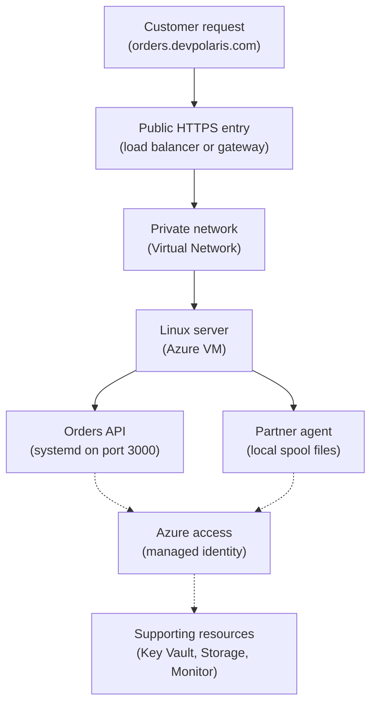

## Table of Contents

1. [The Honest Server Choice](#the-honest-server-choice)
2. [If You Know AWS EC2](#if-you-know-aws-ec2)
3. [The Orders API On One Linux VM](#the-orders-api-on-one-linux-vm)
4. [Launch Choices Become Operations](#launch-choices-become-operations)
5. [First Boot, cloud-init, And systemd](#first-boot-cloud-init-and-systemd)
6. [Access, Identity, And Network Doors](#access-identity-and-network-doors)
7. [Logs, Patches, Disk, And Monitoring Are Yours](#logs-patches-disk-and-monitoring-are-yours)
8. [Failure Modes You Will Actually See](#failure-modes-you-will-actually-see)
9. [The Tradeoff: Control With Chores](#the-tradeoff-control-with-chores)
10. [A VM Readiness Checklist](#a-vm-readiness-checklist)

## The Honest Server Choice

Some applications are honest about what they need.
They need a server.
Not because a virtual machine is old-fashioned, and not because the team missed a newer service.
They need a server because the application depends on the operating system in a direct way.

An Azure Virtual Machine is a virtual server that runs in Azure.
You choose an operating system image, a VM size, a disk, a network placement, and access rules.
Azure provides the hardware, the hypervisor, the control plane, and the managed resources around the machine.
Inside the guest operating system, your team still operates the server.

That means a VM is the most familiar compute shape.
You can SSH into Linux.
You can inspect `/var/log`.
You can run `systemctl status`.
You can install packages, agents, certificates, language runtimes, file watchers, native libraries, cron jobs, and custom networking tools.
You own the process model instead of asking a managed runtime to hide it.

Azure Virtual Machines exist because managed application services cannot cover every runtime shape.
Azure App Service, Azure Container Apps, and Azure Functions remove many server chores, which is usually a gift.
But sometimes the chore is also the requirement.
The app may need a legacy monitoring agent.
It may need direct filesystem paths from an old vendor package.
It may need custom kernel or network settings.
It may need a long-lived background process beside the API.
It may need a migration path from an existing Linux server where the first safe step is "move the server shape into Azure."

In the larger Azure map, a VM is a resource inside a resource group, subscription, region, and virtual network.
It usually has a network interface, managed disks, a network security group, and a managed identity.
Those resources are separate pieces, but together they create the server you operate.

This article follows `devpolaris-orders-api`.
The service is a Node.js backend that listens on port `3000`.
The team has already learned managed hosting options, but this version has one honest requirement:
a payment partner requires a legacy Linux agent that watches a local spool directory and signs outgoing settlement files.
The agent is not available as a managed extension in the team's preferred app platform.
For the first production move, a Linux VM is the clearer choice.

The goal is not to make VMs look better than managed services.
The goal is to know when a VM is the honest answer and to understand what that answer gives back to your team:
operating-system control, legacy agent support, special networking, and direct server ownership.

> A VM is a good choice when the server details are part of the product, not just packaging around it.

## If You Know AWS EC2

If you have learned AWS EC2, Azure Virtual Machines will feel familiar.
Both services give you cloud-hosted virtual servers.
Both ask you to choose an image, size, network placement, storage, identity, and access model.
Both are excellent when you need server control, and both hand you the same quiet bill of responsibility.

The bridge helps, but the words are not identical.
Azure has its own resource model and naming habits.
An Azure VM is not just one object.
It normally works with a network interface, public IP if you choose one, managed disk, network security group, boot diagnostics, and identity settings.

| AWS idea you may know | Azure idea to learn | Careful difference |
|-----------------------|---------------------|--------------------|
| EC2 instance | Azure Virtual Machine | A virtual server you operate inside the cloud |
| AMI | Azure image | The starting operating system and filesystem shape |
| Instance type | VM size | CPU, memory, storage capability, and network baseline |
| VPC subnet | VNet subnet | The private network slice where the VM's NIC lives |
| Security group | Network security group | Packet filtering around a subnet or network interface |
| Instance profile role | Managed identity | The workload identity software can use without stored secrets |
| User data | Custom data with cloud-init | First-boot configuration passed during VM creation |
| EC2 system log or serial console | Boot diagnostics and Azure Serial Console | Early boot evidence when SSH is not enough |

The biggest Azure-specific habit is reading the resource group and resource ID.
An EC2 instance lives in an AWS account and Region.
An Azure VM lives under a subscription and resource group.
When you operate production, always prove you are looking at the right subscription and resource group before restarting or resizing a VM.

The second Azure-specific habit is noticing the network interface.
Traffic does not magically enter the VM because the VM exists.
The VM's network interface sits in a subnet, and network security groups decide what inbound and outbound traffic is allowed.
If `devpolaris-orders-api` is listening correctly but no request reaches it, the VM process may be fine while the NSG path is wrong.

The third Azure-specific habit is managed identity.
On EC2, you learn not to paste AWS access keys into `.env`.
On Azure, keep the same instinct.
Give the VM a managed identity and grant that identity the narrow Azure RBAC role it needs, such as reading one Key Vault secret or writing one blob prefix.

## The Orders API On One Linux VM

Start with the smallest useful production picture.
Users call `https://orders.devpolaris.com`.
The public entry point receives HTTPS.
Traffic reaches a Linux VM in an app subnet.
On that VM, systemd keeps the Node.js API running on port `3000`.
The legacy payment agent watches `/var/spool/devpolaris/payments`.
The app uses a managed identity when it talks to Azure services.



Read the solid path first.
That is the request path.
The user does not need to know about the VM.
The public entry point forwards traffic into the private network and toward the server.
The server runs the API and the local agent.

Now read the dotted path.
That is not public web traffic.
That is workload access.
The API and agent should use a managed identity when they call Azure APIs.
The VM's network security group does not grant Key Vault access.
The managed identity does not open port `3000`.
Those controls answer different questions.

The first inventory for this setup might look like this:

| Piece | Example | What it decides |
|-------|---------|-----------------|
| Resource group | `rg-devpolaris-orders-prod` | Where related Azure resources are managed together |
| Region | `uksouth` | Where the VM, disk, and network resources run |
| VM name | `vm-orders-api-prod-01` | The human label for this server |
| VM image | Team-approved Linux image | Starting OS, package manager, and boot defaults |
| VM size | Small general purpose size | CPU, memory, disk capability, and network baseline |
| Subnet | `snet-orders-app-prod` | The VM's private network placement |
| NSG | `nsg-orders-app-prod` | Which inbound and outbound connections are allowed |
| Managed identity | `id-orders-api-prod` | What Azure permissions the app can request |
| OS disk | Managed disk | The boot disk that holds OS, packages, app files, and logs |

This table is not only planning paperwork.
It is the first diagnostic map.
When the API fails, each row becomes a place to prove state.
Is the VM running?
Is the right image installed?
Is the service listening?
Is the disk full?
Is the NSG allowing only the intended source?
Is the managed identity assigned and granted the right role?

Here is the kind of status evidence you want before debugging the app itself:

```bash
$ az vm get-instance-view \
>   --resource-group rg-devpolaris-orders-prod \
>   --name vm-orders-api-prod-01 \
>   --query "instanceView.statuses[].{code:code,display:displayStatus}" \
>   --output table
Code                          Display
----------------------------  -------------------------
ProvisioningState/succeeded   Provisioning succeeded
PowerState/running            VM running
```

This output proves Azure created the VM and the VM is powered on.
It does not prove the Node process is healthy.
That distinction matters.
Azure can honestly say "VM running" while users still receive `502` because systemd never started the API.

## Launch Choices Become Operations

Creating a VM looks like a form, but each choice creates future operating work.
A careful team treats launch settings like decisions, not like defaults to rush through.

The image decides the operating system.
For a Linux API, the image should be one your team knows how to patch, harden, and support.
Do not choose a random marketplace image because it has a convenient package preinstalled.
The image becomes the base of every future security update and incident.

The VM size decides the shape of compute.
CPU and memory are the obvious parts.
Storage performance and network capability also matter.
A small API may run happily on a modest size, but a partner signing agent that scans thousands of settlement files can create CPU, memory, or disk pressure at awkward times.

The OS disk decides how much room the machine has for the operating system, packages, deployed app, caches, temporary files, and logs.
If the disk fills, the app can fail even when the VM still shows as running.
VM teams learn this the first time `npm install`, log growth, and package updates all meet a tiny root filesystem.

The subnet decides where the network interface sits.
That subnet brings routing behavior and maybe a subnet-level NSG.
If the orders VM must reach a private database endpoint, it needs a network path to that endpoint.
If it must call a payment provider on the internet, outbound routing must allow that path.

The network security group decides packet rules.
For this service, the VM should accept app traffic only from the public entry component or its subnet, not from the whole internet.
SSH should be avoided or tightly limited.
If the team uses Azure Bastion, a private jump path, or just-in-time access through Microsoft Defender for Cloud, the NSG rules should reflect that design.

The managed identity decides how software on the VM proves itself to Azure.
For `devpolaris-orders-api`, the identity may read one Key Vault secret, write receipt export files to one Storage account container, and send custom metrics.
It should not have broad owner rights on the resource group.

Here is the review table the team puts in the deployment pull request:

| Decision | Chosen shape | Risk if skipped |
|----------|--------------|-----------------|
| Image | Team-approved Linux image | Unknown patching and boot behavior |
| Size | General purpose VM size | Memory pressure or throttled work during settlement exports |
| Disk | Managed OS disk with room for logs and packages | Full disk blocks writes, installs, and service restarts |
| Subnet | Private app subnet | Direct internet placement or missing private routes |
| NSG | App port from entry point only | Public scan traffic reaches the server |
| Access | Bastion or controlled SSH path | Operators either cannot connect or expose port `22` too broadly |
| Identity | User-assigned managed identity | Secrets copied into files or overly broad Azure permissions |
| Diagnostics | Boot diagnostics and Azure Monitor | No early evidence when boot or service startup fails |

Notice that the table does not say "VMs are simple."
It says "VMs are explicit."
Explicit is useful when the team needs control, but explicit also means the team must remember to operate each layer.

## First Boot, cloud-init, And systemd

A new Linux VM is only a machine.
It is not an application server until something prepares it.
On Azure Linux VMs, first-boot setup often uses cloud-init.
Azure passes custom data during provisioning, and cloud-init can use that data to install packages, write files, create users, and run setup commands.

This is similar to EC2 user data, but keep the Azure wording straight.
The feature is custom data.
cloud-init is the common Linux agent that processes it.
The Azure CLI can handle encoding details for common workflows, but custom data is still small setup data, not a place for production secrets.

For `devpolaris-orders-api`, the first boot job should be boring and repeatable:
create a service user, install the runtime packages, make app directories, install the partner agent, and hand long-running work to systemd.
systemd is the Linux service manager that starts, stops, restarts, and reports services.

Here is a small `#cloud-config` shape.
It is intentionally short.
Long deployment logic belongs in a package, image build, or deployment pipeline, not hidden forever inside first-boot data.

```yaml
#cloud-config
package_update: true
packages:
  - nodejs
  - npm

users:
  - name: orders
    system: true
    shell: /usr/sbin/nologin

write_files:
  - path: /etc/devpolaris-orders-api/runtime.env
    owner: root:root
    permissions: "0640"
    content: |
      NODE_ENV=production
      PORT=3000

runcmd:
  - mkdir -p /opt/devpolaris-orders-api /var/spool/devpolaris/payments
  - chown -R orders:orders /opt/devpolaris-orders-api /var/spool/devpolaris
  - systemctl daemon-reload
  - systemctl enable --now devpolaris-orders-api
```

The important detail is the handoff.
cloud-init should not become the process supervisor.
It prepares the machine once.
systemd owns the API every day after that.

A simple systemd unit for the API might look like this:

```ini
[Unit]
Description=DevPolaris Orders API
After=network-online.target
Wants=network-online.target

[Service]
User=orders
Group=orders
WorkingDirectory=/opt/devpolaris-orders-api
EnvironmentFile=/etc/devpolaris-orders-api/runtime.env
ExecStart=/usr/bin/node server.js
Restart=on-failure
RestartSec=5

[Install]
WantedBy=multi-user.target
```

This file tells Linux the plain operating contract:
run the API as the `orders` user, read environment values from one file, start `server.js`, and restart after a crash.
It also gives operators one familiar command to inspect state.

```bash
$ systemctl status devpolaris-orders-api --no-pager
● devpolaris-orders-api.service - DevPolaris Orders API
     Loaded: loaded (/etc/systemd/system/devpolaris-orders-api.service; enabled)
     Active: active (running) since Sun 2026-05-03 09:14:22 UTC; 8min ago
   Main PID: 1842 (node)
      Tasks: 12
     Memory: 96.4M
        CPU: 2.842s
```

That output is useful because it answers a narrower question than Azure VM status.
Azure says the server is running.
systemd says the application process is running.
You need both levels when diagnosing a VM-hosted service.

## Access, Identity, And Network Doors

VM access has two separate meanings that beginners often mix together.
Human access means an operator can get a shell on the machine.
Workload access means software on the VM can call other Azure services.
Network access means packets can reach the VM or leave it.
Those are three different doors.

Human access to a Linux VM is usually SSH, Azure Bastion, or Serial Console during trouble.
SSH is the familiar path, but it should not be open to the entire internet.
Azure Bastion gives browser-based SSH or RDP access through Azure without exposing the VM directly with a public IP.
Serial Console is mainly for troubleshooting when normal network access does not work.

Workload access should use managed identity when possible.
A managed identity is an Azure identity assigned to the VM.
The app can request tokens from the Azure Instance Metadata Service inside the VM and use those tokens to call Azure services.
That avoids long-lived credentials in `.env` files.

For the orders VM, a narrow identity plan might look like this:

| Workload action | Azure permission shape | Why it is narrow |
|-----------------|------------------------|------------------|
| Read database password during migration | Key Vault secret read on one vault | The VM cannot manage the vault |
| Write settlement export files | Blob write on one container path | The agent cannot delete unrelated storage |
| Send custom metrics | Monitoring data write where needed | The app cannot change infrastructure |

Network access is checked with NSGs, routes, and the application listener.
If the public entry point forwards to port `3000`, the VM must listen on port `3000`, the NSG must allow that source and port, and host firewall rules inside Linux must not block it.

Here is a healthy listener check from inside the VM:

```bash
$ sudo ss -ltnp | grep ':3000'
LISTEN 0      511          0.0.0.0:3000       0.0.0.0:*    users:(("node",pid=1842,fd=22))
```

This proves a process is listening on TCP port `3000`.
It does not prove the NSG allows traffic.
It does not prove the public entry point targets the right private IP.
Each layer still needs its own evidence.

The safe beginner habit is to ask three separate questions:

| Question | First evidence |
|----------|----------------|
| Can humans reach the server safely? | Bastion, SSH rule, or approved support path |
| Can the app reach Azure services without stored secrets? | Managed identity assignment and role scope |
| Can customer traffic reach only the intended app port? | Listener, NSG rule, and entry point health |

This separation keeps you from applying the wrong fix.
Opening SSH does not fix Key Vault permission.
Granting a managed identity role does not fix an NSG block.
Restarting Node does not fix a missing route.

## Logs, Patches, Disk, And Monitoring Are Yours

A managed service often hides server maintenance.
A VM brings it back into view.
That is fine when you chose a VM for a real reason, but you should name the chores early so they do not surprise the team later.

Logs live in several places.
The app logs may go through journald because systemd started the process.
cloud-init writes first-boot evidence under `/var/log`.
The partner agent may write its own file under `/var/log/devpolaris-payments-agent`.
Azure Monitor can collect guest logs and metrics if the VM has the right monitoring setup.

When users report a `502`, start with the service log rather than the whole cloud account:

```bash
$ journalctl -u devpolaris-orders-api -n 8 --no-pager
May 03 09:21:17 vm-orders-api-prod-01 node[1842]: listening on port 3000
May 03 09:22:44 vm-orders-api-prod-01 node[1842]: GET /health 200 4ms
May 03 09:23:18 vm-orders-api-prod-01 node[1842]: POST /orders 201 orderId=ord_1042
May 03 09:24:02 vm-orders-api-prod-01 node[1842]: payment-agent spool queued file=settlement-20260503-092402.json
```

This tells you the API is alive and the partner agent path is active.
If the public entry point still reports failures, move outward to health checks, NSGs, and routing.

Patches are also your job.
The operating system needs security updates.
Node.js and npm dependencies need their own process.
The partner agent needs a supported version and a rollback plan.
If a managed platform used to patch the host under you, that comfort is gone with a VM.

Disk is a beginner failure that feels unfair because the app code may be correct.
Logs, package caches, crash dumps, temporary exports, and spool directories all compete for the same filesystem unless you design otherwise.

```bash
$ df -h /
Filesystem      Size  Used Avail Use% Mounted on
/dev/root        29G   28G  410M  99% /
```

At `99%`, the next deployment, package update, or export file may fail.
The fix direction is not "restart the app harder."
You need to remove safe temporary files, rotate logs, move large spool data to a separate disk or storage service, and resize or redesign storage if the workload honestly needs more room.

Monitoring should watch both Azure-level and guest-level signals.
Azure can tell you VM power state, CPU, disk, network, and boot diagnostics.
The guest OS tells you service status, application logs, process memory, local disk usage, and agent health.
The public entry point tells you whether real traffic can reach the service.

| Signal | Where it usually comes from | What it proves |
|--------|-----------------------------|----------------|
| VM running | Azure VM instance view | Azure has a powered VM |
| Boot output | Boot diagnostics | The OS reached early boot and wrote console evidence |
| API service active | `systemctl status` | systemd sees the app process running |
| App behavior | `journalctl` or app log pipeline | Requests, errors, and business events |
| Disk pressure | `df`, Azure metrics, alerts | The machine has room to keep operating |
| Entry health | Load balancer or gateway health | Traffic path can reach the app port |

The table is a reminder:
no single green check means the whole service is healthy.
A VM asks you to connect several kinds of evidence.

## Failure Modes You Will Actually See

The first VM failure many teams meet is split-brain evidence.
Azure says the VM was created.
The public entry point says the backend is unhealthy.
The app team says deployment succeeded.
Everyone is partly right, and that is why the failure feels confusing.

Here is the status snapshot from the production move:

```text
Release: devpolaris-orders-api 2026.05.03.1

Azure VM:
  vm-orders-api-prod-01: running

Entry point backend:
  target: 10.42.1.14:3000
  health: unhealthy
  last probe: GET /health
  response: connect timeout

Customer symptom:
  GET /orders/ord_1042 -> 502 Bad Gateway
```

Do not start by changing random network rules.
Follow the path from inside to outside.
First prove the service exists on the VM.

```bash
$ systemctl status devpolaris-orders-api --no-pager
× devpolaris-orders-api.service - DevPolaris Orders API
     Loaded: loaded (/etc/systemd/system/devpolaris-orders-api.service; enabled)
     Active: failed (Result: exit-code) since Sun 2026-05-03 10:03:11 UTC; 2min ago
    Process: 2419 ExecStart=/usr/bin/node server.js (code=exited, status=203/EXEC)
```

The useful part is `status=203/EXEC`.
systemd could not execute the command.
That points toward a missing binary, wrong path, bad permissions, or an invalid executable file.
Now inspect the service logs:

```bash
$ journalctl -u devpolaris-orders-api -n 6 --no-pager
May 03 10:03:11 vm-orders-api-prod-01 systemd[1]: Started DevPolaris Orders API.
May 03 10:03:11 vm-orders-api-prod-01 systemd[2419]: devpolaris-orders-api.service: Failed to locate executable /usr/bin/node: No such file or directory
May 03 10:03:11 vm-orders-api-prod-01 systemd[1]: devpolaris-orders-api.service: Main process exited, code=exited, status=203/EXEC
May 03 10:03:11 vm-orders-api-prod-01 systemd[1]: devpolaris-orders-api.service: Failed with result 'exit-code'.
```

Now the failure is specific.
The VM is running, but the app cannot start because `/usr/bin/node` is missing.
That points to first-boot setup or the image, not to the public entry point.

Cloud-init evidence confirms the setup issue:

```bash
$ sudo grep -n "nodejs" /var/log/cloud-init.log | tail -n 4
812:package 'nodejs' has no installation candidate
819:Failed to install packages: ['nodejs', 'npm']
827:Running module package-update-upgrade-install failed
```

The fix direction is to make package installation deterministic.
Use a team-approved image that already includes the required runtime, or update the cloud-init package source setup so the package exists for that distribution.
Then redeploy or repair the VM in a repeatable way.
Do not manually install Node once and call the incident solved.
The next VM replacement would fail the same way.

Another common failure is an app that listens only on `127.0.0.1`.
Inside the VM, `curl http://localhost:3000/health` works.
From the entry point, the health check times out.
The fix is to bind the app to an address reachable from the VM network interface, often `0.0.0.0`, and to prove the listener with `ss`.

```bash
$ sudo ss -ltnp | grep ':3000'
LISTEN 0      511        127.0.0.1:3000       0.0.0.0:*    users:(("node",pid=1842,fd=22))
```

That line explains the timeout.
The app is listening only on loopback, which means the VM itself can call it, but other machines cannot.
The code or runtime configuration should bind to the correct interface.
Then restart the service and check again.

```bash
$ sudo systemctl restart devpolaris-orders-api
$ sudo ss -ltnp | grep ':3000'
LISTEN 0      511          0.0.0.0:3000       0.0.0.0:*    users:(("node",pid=2551,fd=22))
```

The calm diagnostic path is:

| Step | Question | Evidence |
|------|----------|----------|
| 1 | Is the VM created and running? | Azure VM instance view |
| 2 | Did first boot finish the setup work? | `/var/log/cloud-init.log` and `/var/log/cloud-init-output.log` |
| 3 | Is the app process running? | `systemctl status` |
| 4 | Is the app listening on the expected address and port? | `ss -ltnp` |
| 5 | Does local health work? | `curl http://localhost:3000/health` |
| 6 | Can the entry point reach it? | Backend health status and NSG rules |
| 7 | Can the app call Azure services? | Managed identity role and app logs |

This path prevents guesswork.
You move one layer at a time until the evidence changes.

## The Tradeoff: Control With Chores

The VM tradeoff is not complicated, but it is easy to understate.
You gain control.
You also gain chores.

The control is real.
You can install the legacy payment agent.
You can inspect every process.
You can choose how the app starts.
You can run a custom network diagnostic tool.
You can keep a local spool directory while the partner integration is being modernized.
You can migrate an old server-shaped system into Azure without changing every application assumption at once.

The chores are also real.
You patch the operating system.
You rotate logs.
You watch disk.
You own service supervision.
You decide how operators access the shell.
You recover from bad first-boot scripts.
You design backups or rebuild paths.
You explain why the VM is still the right shape every time the team reviews hosting.

Here is the decision table for `devpolaris-orders-api`:

| Need | VM is honest when | Managed hosting may be better when |
|------|-------------------|------------------------------------|
| OS control | You must install or tune OS-level software | The app only needs a standard runtime |
| Legacy agent | The agent must run beside the app on the same host | The job can move to a managed integration or function |
| Special networking | You need server-level diagnostics, routing, or local tools | Standard ingress and private networking are enough |
| Direct ownership | The team is ready to operate Linux evidence and patches | The team wants fewer server responsibilities |
| Migration speed | Server parity reduces migration risk | Re-platforming now removes future VM chores |

For this first move, the VM is honest because the partner agent requirement is real.
But the team should still write down the exit path.
Maybe the agent goes away later.
Maybe exports move to Azure Functions and Blob Storage.
Maybe the API moves to Container Apps once the local spool dependency is gone.

That is a healthy VM decision.
Use the server while it teaches, protects, or unblocks the system.
Do not let it become permanent only because nobody wrote the next plan.

## A VM Readiness Checklist

Before you call a VM-hosted service production-ready, check the server like an operator, not only like a deployer.
The question is not "did Azure create the VM?"
The question is "can this service run, fail, explain itself, and be repaired?"

Use this first checklist for `devpolaris-orders-api`:

| Check | Good evidence |
|-------|---------------|
| Scope is correct | Subscription, resource group, region, and VM name match production inventory |
| First boot is repeatable | cloud-init or image build can recreate the server without hand edits |
| Process is supervised | systemd service is enabled, running, and restarts on failure |
| App health is honest | `/health` returns quickly without hiding startup errors |
| Network path is intentional | Entry point can reach port `3000`, internet scans cannot |
| Human access is controlled | Bastion, SSH, or support path is documented and limited |
| Workload identity is secret-free | Managed identity is assigned and scoped narrowly |
| Logs are findable | App, cloud-init, agent, and Azure Monitor evidence can be reached |
| Disk pressure is watched | Root disk and spool paths have alerts and cleanup rules |
| Patch path exists | OS and agent updates have an owner and maintenance plan |
| Recovery is practiced | The team can rebuild or replace the VM from known artifacts |

This checklist is not ceremony.
It is kindness to your future self.
When a VM is the honest choice, make it an operated server from day one.

---

**References**

- [Azure Virtual Machines documentation](https://learn.microsoft.com/en-us/azure/virtual-machines/) - Microsoft Learn's main entry point for creating, operating, and troubleshooting Azure VMs.
- [cloud-init support for virtual machines in Azure](https://learn.microsoft.com/en-us/azure/virtual-machines/linux/using-cloud-init) - Explains how Linux VM first-boot configuration works with cloud-init.
- [Custom data and cloud-init on Azure Virtual Machines](https://learn.microsoft.com/en-us/azure/virtual-machines/custom-data) - Covers Azure custom data behavior and why it should not be treated as a secret store.
- [How managed identities work with Azure virtual machines](https://learn.microsoft.com/en-us/azure/active-directory/managed-identities-azure-resources/how-managed-identities-work-vm) - Shows how VM workloads can use managed identity instead of stored credentials.
- [How to use boot diagnostics to troubleshoot virtual machines in Azure](https://learn.microsoft.com/en-us/troubleshoot/azure/virtual-machines/boot-diagnostics) - Describes boot diagnostics evidence for VM startup problems.
- [Connect to a Linux VM in Azure](https://learn.microsoft.com/en-us/azure/virtual-machines/linux-vm-connect) - Reviews SSH and common access requirements for Linux VMs.
