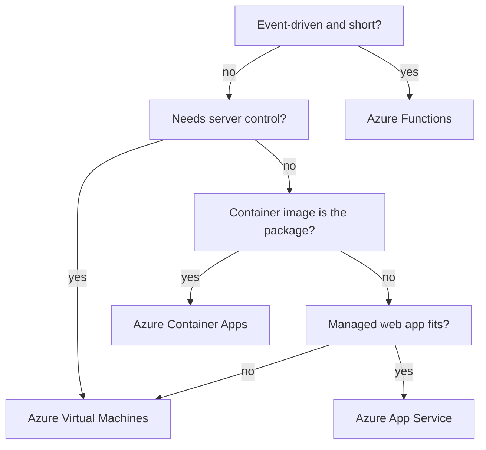

## Table of Contents

1. [The Choice Is Really About What You Want To Own](#the-choice-is-really-about-what-you-want-to-own)
2. [If You Know AWS Compute](#if-you-know-aws-compute)
3. [The Orders API Has More Than One Workload](#the-orders-api-has-more-than-one-workload)
4. [The Compact Decision Path](#the-compact-decision-path)
5. [Workload Symptoms To Azure Choices](#workload-symptoms-to-azure-choices)
6. [Always-On APIs Need A Stable Home](#always-on-apis-need-a-stable-home)
7. [Containers Change The Question](#containers-change-the-question)
8. [Event-Driven Jobs Should Not Pretend To Be APIs](#event-driven-jobs-should-not-pretend-to-be-apis)
9. [VMs Are For Control You Actually Need](#vms-are-for-control-you-actually-need)
10. [Deployment And Debugging Feel Different](#deployment-and-debugging-feel-different)
11. [Failure Modes From Real Teams](#failure-modes-from-real-teams)
12. [A Decision Record You Can Reuse](#a-decision-record-you-can-reuse)

## The Choice Is Really About What You Want To Own

When you move an application into Azure, the first compute question can sound like a product quiz.
Should this run on App Service, Container Apps, Functions, or Virtual Machines?
That question is useful, but it hides the better question:
which parts of running the application does your team want to own every week?

Compute is the place where your code runs.
In Azure, the compute service also decides how deployment works, how scaling works, how logs appear, how much operating system control you have, and how close you are to patching servers yourself.
The application code may be the same, but the daily work feels different.

For this article, the running example is `devpolaris-orders-api`.
It is a small backend that accepts checkout requests, writes orders, and triggers supporting work such as invoice exports and email notifications.
The team has four possible Azure homes in front of them:
Azure App Service, Azure Container Apps, Azure Functions, and Azure Virtual Machines.

Azure App Service is a managed platform for web apps and APIs.
You bring application code, or sometimes a container image, and Azure gives you a web hosting platform with built-in deployment and scaling features.
Azure Container Apps is a managed container platform for HTTP apps, background workers, microservices, and jobs without making the team operate Kubernetes directly.
Azure Functions is an event-driven compute service where small pieces of code run because something happened, such as a queue message, timer, or HTTP request.
Azure Virtual Machines give you servers in Azure, which means you choose and manage the operating system, packages, runtime, agents, and most patching responsibilities.

The beginner trap is to ask which service is "best."
There is no best one in isolation.
There is only the service whose ownership shape matches the workload.

For `devpolaris-orders-api`, the main API needs to be reachable all day.
The invoice export job runs on a schedule and then stops.
The order email job reacts to messages.
A legacy tax calculation process might require a special OS package.
Those are different workload shapes, so they may deserve different compute choices.

> A good compute choice makes the common operation boring and the uncommon failure diagnosable.

This is a judgment article, not a product catalog.
You will not memorize every SKU or feature limit here.
You will learn the operating questions that narrow the choice before you read the service-specific docs.

## If You Know AWS Compute

AWS comparisons can help you find your footing.
If you have used EC2, ECS on Fargate, or Lambda, you already understand the broad spectrum:
servers you manage, containers on a managed runtime, and event-driven functions.
Azure has similar shapes, but the mapping is not exact.

Use this bridge carefully:

| AWS idea you may know | Azure service to compare first | Why the mapping is imperfect |
|-----------------------|--------------------------------|------------------------------|
| EC2 instance | Azure Virtual Machine | Both expose server control, but Azure resource groups, managed identities, disks, and networking have Azure-specific behavior |
| ECS on Fargate | Azure Container Apps | Both reduce server ownership for containers, but scaling, revisions, jobs, and Kubernetes exposure differ |
| Lambda | Azure Functions | Both fit event-driven code, but triggers, hosting plans, timeout behavior, and deployment models differ |
| Elastic Beanstalk or App Runner style web hosting | Azure App Service | The web app experience, deployment slots, plans, and runtime stacks are Azure-specific |

The useful AWS habit is not the name translation.
The useful habit is asking what the workload needs.
Is it a long-running web API?
Is it a container image?
Is it triggered by events?
Does it need root-level control of the server?
Does the team want to patch the operating system?

If you know Lambda, Azure Functions will feel familiar because both reward small event-shaped handlers.
But that does not mean an HTTP API should automatically become a function app.
If you know ECS or Fargate, Container Apps will feel familiar because you deploy containers and let the platform run replicas.
But that does not mean every container platform feature maps one-to-one.
If you know EC2, Azure VMs will feel familiar because you get a server.
But getting a server also means accepting server work.

For `devpolaris-orders-api`, the AWS callback is simple:
the public API is not automatically a Lambda-style workload just because serverless sounds attractive.
The nightly invoice export is not automatically a VM workload just because it runs a command.
The container image is not automatically App Service or Container Apps until the team checks runtime assumptions, scaling, and debugging.

## The Orders API Has More Than One Workload

The orders system is not one blob of code.
It has a few different pieces that behave differently in production.
That matters because Azure compute services are optimized for different shapes of work.

Here is the small system we will use:

```text
devpolaris-orders

Workload: devpolaris-orders-api
  Shape: public HTTP API
  Runtime: Node.js container image
  Traffic: steady during business hours, bursty during sales
  Health: GET /health
  Deployment artifact: ghcr.io/devpolaris/orders-api:<git-sha>

Workload: export-invoices
  Shape: scheduled job
  Runtime: same container image, different command
  Traffic: none
  Schedule: nightly at 01:15 UTC
  Output: invoice CSV files in Blob Storage

Workload: send-order-email
  Shape: event-driven job
  Trigger: queue message after order creation
  Runtime: small handler code
  Output: email provider API call and status record

Workload: tax-rules-importer
  Shape: legacy command with OS package assumptions
  Runtime: custom binary and local certificate bundle
  Frequency: weekly
  Risk: hard to containerize today
```

This list already tells us something important.
One compute service might host the API well and be a poor home for the scheduled export.
Another service might be perfect for the queue-triggered email handler and awkward for the long-running API.
The team should choose per workload, not per repository.

The main API asks for an always-on web shape:
stable HTTP entry, health checks, rollout control, logs, and predictable debugging.
The invoice export asks for a finite job shape:
start, run, write output, stop, and keep execution history.
The email sender asks for an event shape:
receive one message, do one unit of work, retry safely if needed.
The tax importer asks for an OS-control shape:
install this package, trust this certificate path, run this binary, and inspect the machine if it fails.

That split protects the team from a common beginner mistake:
choosing one service for the whole repo because the first workload fits.
Real systems rarely stay that tidy.

## The Compact Decision Path

Start with the workload's shape, not the Azure product page.
This compact path is intentionally simple.
It gives you a first candidate, then the rest of the article teaches when to adjust.



Read the diagram as a first-pass decision, not a law.
For example, Azure Functions can also serve HTTP requests, and App Service can run custom containers.
Azure Container Apps can run event-driven jobs and host functions in some patterns.
VMs can run almost anything.
Those facts are why judgment matters.

The decision path asks which shape is the least surprising home.
If the workload is event-driven and small, Functions is often the first candidate.
If the workload is already a container and the team wants managed scaling without operating Kubernetes, Container Apps is often the first candidate.
If the workload is a traditional web app with a supported runtime and the team wants a managed web host, App Service is often the first candidate.
If the workload needs real server control, VMs are often the honest answer.

The final box says "recheck" because compute choice is never only about code.
You still need to check networking, identity, secrets, logs, deployment, scaling, cost, and the team's operational skill.

## Workload Symptoms To Azure Choices

Decision tables are useful when they stay compact.
Use this table when a teammate describes the workload in ordinary language.
The "sensible choice" is a starting point, not a promise.

| Workload symptom | Sensible Azure choice | Why it usually fits | Watch before committing |
|------------------|-----------------------|---------------------|-------------------------|
| Public web API, supported runtime, no container requirement | App Service | Managed web hosting keeps server work low | Runtime stack, plan size, slots, networking |
| Public web API packaged as a container | Container Apps | Container is the deployment unit and replicas can scale | Ingress, revision behavior, image startup, logs |
| Containerized background worker that listens continuously | Container Apps | The worker stays running without owning VMs | Scale rules, graceful shutdown, queue retry design |
| Scheduled container command that starts and stops | Container Apps job | Job execution history matches finite work | Timeout, retry policy, output evidence |
| Queue message or timer handler with small units of work | Azure Functions | Trigger model matches event-driven work | Hosting plan, cold start, timeout, idempotency |
| Legacy app that assumes a full server | Azure Virtual Machine | You can install and tune the OS | Patching, backups, monitoring, hardening |
| App needs custom kernel module or host agent | Azure Virtual Machine | Managed platforms hide the host OS | Team must own OS operations |
| Spring Boot JAR or Tomcat WAR with no container need | App Service | App Service has Java-oriented runtime stacks | JVM settings, startup time, supported stack |
| Container requires unusual startup contract or multiple long-lived processes | Container Apps or VM | Container platforms are clearer than code-only web hosting | Validate ports, probes, sidecars, shutdown |
| Team says "we just need a server" but nobody will patch it | App Service or Container Apps | Managed compute removes most OS ownership | Check whether the app truly needs VM control |

Notice how the table mentions symptoms, not product adjectives.
"Serverless" does not tell you enough.
"Containerized background worker that listens continuously" tells you much more.
"Legacy app that assumes a full server" tells you why a VM might be appropriate.

For `devpolaris-orders-api`, the first likely choice is Azure Container Apps because the API is already packaged as a container image.
The nightly invoice export also fits Container Apps jobs because it is a finite containerized task.
The email sender might fit Azure Functions if each message can be handled as a small retry-friendly unit.
The tax importer might temporarily fit a VM if the OS assumptions are real and hard to remove.

That combination is not messy.
It is honest.
Production systems often use more than one compute service because the workloads have different shapes.

## Always-On APIs Need A Stable Home

An always-on API is a service that should be ready to answer requests most of the time.
It usually has a public or private HTTP endpoint, health checks, logs, deployment rollouts, and clear ownership.
`devpolaris-orders-api` is this kind of workload.

The API has a few non-negotiable needs:

```text
Runtime needs for devpolaris-orders-api

HTTP endpoint:
  GET /health returns 200 when the app can serve traffic
  POST /orders accepts checkout requests

Operations:
  Deploy one version at a time
  Roll back quickly if the new version is unhealthy
  See startup logs and request failures
  Scale out when traffic rises
  Keep secrets out of the image
```

App Service is comfortable when the API is a normal web app.
That means the runtime stack is supported, the app starts in the expected way, and the team wants the platform to handle the web hosting surface.
It is especially approachable for teams that deploy code, use deployment slots, and do not need to think much about container orchestration.

Container Apps is comfortable when the API is a container.
The container image is the artifact.
The platform runs one or more replicas, exposes ingress, manages revisions, and can scale based on HTTP traffic or other signals.
This is a good match when the team already builds images in CI and wants the runtime to look like "run this image" rather than "deploy this code to this language stack."

Functions can serve HTTP, but an always-on API is usually not the first thing I would put there for a beginner team.
Functions shines when each function is a small unit of event-driven work.
An API with many routes, connection pooling, middleware, startup state, and long-lived operational behavior often feels clearer as an app service or container service.

VMs can run the API, but they move a lot of responsibility back to the team.
You need to install the runtime, configure the service manager, patch the OS, manage certificates or reverse proxies, ship logs, monitor disk, and handle rollout safety.
That can be the right choice when the app truly needs server control.
It is a poor default when the team only wants a place to host HTTP.

For the orders API, the decision might look like this:

```text
Candidate: Azure Container Apps

Reason:
  The API is already built as a container image.
  The team wants managed HTTPS ingress and replica scaling.
  The rollout artifact is an immutable image tag.
  The same image can run the nightly export with a different command.

Rejected for first release:
  Azure Functions, because the main API is long-running HTTP service behavior.
  Azure Virtual Machines, because the team does not need OS control.
  App Service, because the team wants the container runtime contract to be the primary deployment unit.
```

This is not saying App Service is worse.
It is saying this team's evidence points toward Container Apps.
Another team with a simple non-container web API might make the opposite choice and be completely right.

## Containers Change The Question

A container is a packaging format for an application and its user-space dependencies.
Instead of asking Azure to provide a specific language runtime and then placing code into it, you give Azure an image that already contains the app, dependencies, and startup command.
That changes what you debug.

For a containerized `devpolaris-orders-api`, the CI pipeline might publish an image like this:

```text
Image published by CI

Repository: ghcr.io/devpolaris/orders-api
Tag: 9f4c2a8
Digest: sha256:6f1c2b5d0a7e...
Exposed port: 8080
Startup command: node dist/server.js
Health path: /health
```

That artifact fits Container Apps naturally.
The question becomes:
can Azure pull the image, start the container, route traffic to the right port, and keep enough replicas healthy?
If the answer is yes, the team can focus on revisions, logs, scaling rules, identity, and networking.

App Service can also run custom containers.
That can be a good middle ground when the team wants App Service features but still needs a container artifact.
The catch is that App Service still has its own web hosting assumptions.
For example, the app must listen on the expected port and fit the App Service container startup model.
If the image expects a different port, writes important data to local disk, starts several unrelated processes, or needs host-level dependencies, App Service may feel like a tight jacket.

Container Apps also has assumptions.
It is not the same as owning a Kubernetes cluster.
You do not get direct access to the underlying Kubernetes API.
That is often the point: less cluster ownership.
But if your team needs raw Kubernetes control, custom admission controllers, or direct node-level behavior, Container Apps may not be enough.
At that point, the conversation might move to Azure Kubernetes Service, which is outside this article, or to VMs for a temporary lift-and-shift.

Here is a practical container readiness check:

| Check | Healthy answer | What a bad answer suggests |
|-------|----------------|----------------------------|
| How does it start? | One clear command starts the app | The image hides several services in one container |
| Which port receives HTTP? | One known port such as `8080` | The app listens on a random or undocumented port |
| Where is state stored? | Database, Blob Storage, queue, or cache | Important state lives only inside the container filesystem |
| How does it stop? | Handles termination and finishes in-flight work | Loses requests or corrupts files on shutdown |
| How is health exposed? | `GET /health` returns meaningful status | Health endpoint only says the process is alive |
| How are logs written? | Writes structured logs to stdout and stderr | Logs only go to a file inside the container |

This table matters more than the product name.
A well-behaved container can move between container platforms with less pain.
A strange container can make every managed platform feel broken.

## Event-Driven Jobs Should Not Pretend To Be APIs

Some work does not need a public HTTP server.
It waits for a timer, a queue message, a blob upload, or another event.
For that shape, keeping an always-on API process alive can be wasteful and harder to reason about.

The `send-order-email` workload is a good example.
After an order is created, the system places a message on a queue.
One worker should read the message, call the email provider, record the result, and finish.
If the email provider is temporarily unavailable, the message should retry.
That is event-driven work.

Azure Functions is often a strong first candidate here because triggers are the natural programming model.
A trigger is the thing that starts the function.
For example, a queue trigger starts when a queue message is available.
A timer trigger starts on a schedule.
The handler can be small, focused, and retry-friendly.

The key phrase is "small, focused, and retry-friendly."
If a function tries to become a whole web application, the fit gets worse.
If a function does one unit of work and can safely run again after a failure, the fit gets better.

The email sender might have this decision note:

```text
Workload: send-order-email

Shape:
  Event-driven handler
  Triggered by order-email queue messages
  One message equals one email attempt
  Safe to retry if the provider returns a temporary error

Candidate:
  Azure Functions

Reason:
  The trigger model matches the work.
  The code does not need a public always-on server.
  Scaling follows queue demand.
  Logs can be inspected per invocation.
```

The invoice export is different.
It is scheduled, but it may already be a container command that uses the same image as the API.
For that shape, Azure Container Apps jobs are a good candidate.
A job starts, runs for a finite duration, then stops.
That matches a nightly export much better than a permanent worker that sleeps all day.

```text
Workload: export-invoices

Shape:
  Scheduled finite task
  Runs the orders container with command: npm run export:invoices
  Writes CSV files to Blob Storage
  Stops after the export finishes

Candidate:
  Azure Container Apps job

Reason:
  The work is containerized.
  Each execution has a start, end, status, and logs.
  The team can reuse the same image supply chain as the API.
```

This is where beginners often blur the words "serverless" and "event-driven."
Container Apps can be serverless containers.
Functions can be serverless event handlers.
Both reduce server management, but they do not encourage the same code shape.

Choose the shape that makes failure easiest to understand.
For a queue message, you want invocation logs and retry behavior.
For a nightly container job, you want execution history and container logs.
For an API, you want request logs, health status, and rollout evidence.

## VMs Are For Control You Actually Need

Virtual Machines are the most flexible option in this set.
You get a server-shaped resource in Azure.
You choose the OS image, install packages, run services, attach disks, place agents, and configure the network path.
That control is useful when the workload really needs it.

The cost of that control is ownership.
With a VM, Microsoft manages the physical infrastructure, but your team manages the guest operating system and the software inside it.
That includes patching, hardening, package updates, service configuration, log forwarding, backups, disk pressure, and runtime upgrades.

For `tax-rules-importer`, a VM might be justified for a while:

```text
Workload: tax-rules-importer

Current constraints:
  Requires vendor binary installed under /opt/tax-tools
  Reads certificates from /etc/pki/tax-vendor
  Uses a licensed host agent
  Has not been containerized yet

Candidate:
  Azure Virtual Machine

Reason:
  The app has real OS-level assumptions.
  The team needs to inspect and change the host directly.
  Containerizing it safely is a separate migration project.
```

That is an honest VM reason.
"We are used to servers" is not as strong.
"We do not want to learn App Service" is not as strong.
"The app needs this host agent and this package path today" is a real constraint.

The review question for VMs is blunt:
who will own the server after the exciting deployment day?

| VM ownership area | What the team must be ready to do |
|-------------------|-----------------------------------|
| OS patching | Apply updates and reboot safely |
| Runtime updates | Patch Node, Java, Python, OpenSSL, or other installed dependencies |
| Service management | Keep the app process running with systemd or another supervisor |
| Ingress | Configure reverse proxy, TLS, firewall rules, and health checks |
| Logs | Ship application and system logs somewhere searchable |
| Disk and backup | Monitor disk usage and restore important data |
| Security | Harden SSH, limit access, rotate credentials, and audit changes |

If nobody wants that list, choose a managed service when you can.
That is not laziness.
That is good engineering.
Owning a VM should be a conscious tradeoff, not the default shape for every app.

## Deployment And Debugging Feel Different

The compute choice decides what a normal release looks like.
It also decides what evidence you inspect when the release fails.
This is one of the most practical reasons to choose carefully.

Here is the same `devpolaris-orders-api` release viewed through different compute services:

| Service | Deployment artifact | Rollout style to picture | Debugging shape |
|---------|---------------------|--------------------------|-----------------|
| App Service | Code package or container image | Deploy to app or slot, swap when ready | App logs, deployment logs, platform diagnostics, health endpoint |
| Container Apps | Container image revision | New revision starts, traffic can move between revisions | Revision status, replica logs, ingress, scaling events |
| Azure Functions | Function app package or container depending on hosting | New function app version handles triggers | Invocation logs, trigger binding errors, host logs |
| Virtual Machines | Package, script, image, or manual install | Update service on one or more servers | SSH, systemd, app logs, OS logs, reverse proxy logs |

None of these are automatically easy.
They are different kinds of easy.

App Service debugging often starts with the app log stream, deployment status, runtime configuration, and the health endpoint.
Container Apps debugging often starts with the revision, replica status, container logs, ingress configuration, and scaling rules.
Functions debugging often starts with invocation logs, trigger configuration, retries, and host startup.
VM debugging often starts with SSH, `systemctl status`, journal logs, Nginx or application logs, disk, memory, and firewall rules.

A simple release evidence record might look like this for Container Apps:

```text
Release evidence

Workload: devpolaris-orders-api
Target: Azure Container Apps
Image: ghcr.io/devpolaris/orders-api:9f4c2a8
Revision: orders-api--9f4c2a8
Health: /health returned 200 for 3 replicas
Traffic: 10 percent canary for 15 minutes, then 100 percent
Rollback: previous revision orders-api--71b0f19 kept available
```

For Functions, the same idea is more invocation-shaped:

```text
Invocation evidence

Function: send-order-email
Trigger: queue message
Message id: 8f78fb0f-95b5-44af-84b7-112233445566
Result: succeeded
Duration: 842 ms
Retry count: 0
Email provider status: 202 accepted
```

For a VM, the evidence feels much closer to Linux operations:

```bash
$ systemctl status devpolaris-orders-api --no-pager
* devpolaris-orders-api.service - DevPolaris Orders API
     Loaded: loaded (/etc/systemd/system/devpolaris-orders-api.service; enabled)
     Active: active (running) since Sun 2026-05-03 10:14:22 UTC; 4min ago
   Main PID: 1832 (node)
      Tasks: 18
     Memory: 164.8M
```

The VM output is not bad.
It is useful if your team is ready to operate Linux services.
It is a warning if your team expected the platform to hide Linux service management.

The safest compute choice is the one whose debugging path your team can actually follow during a failed release.

## Failure Modes From Real Teams

The best way to test a compute choice is to imagine the failure it creates.
Bad choices usually fail in recognizable ways.

The first failure is choosing Functions for a long-running API because the team heard "serverless" and thought it meant "no operations."
The first version looks fine because `GET /health` works.
Then checkout traffic grows, routes accumulate, startup gets heavier, and one endpoint holds HTTP requests open while waiting on slow downstream work.

```text
HTTP API symptom

Service: devpolaris-orders-api-functions
Endpoint: POST /orders/recalculate-prices
Observed: client receives 504 after waiting
Function log:
  Executing 'Functions.recalculatePrices'
  Request still running after downstream pricing call
  Host is shutting down invocation after configured timeout

Better direction:
  Keep the public API in App Service or Container Apps.
  Move the slow recalculation into a queue-triggered function or container job.
  Return a request id to the client instead of holding the HTTP request open.
```

The diagnosis is not "Functions is bad."
The diagnosis is "this part of the workload is not a small event handler."
Use Functions for the event-shaped part.
Give the long-running API a web-app or container-app home.

The second failure is choosing a VM when the team does not want patch ownership.
The app deploys successfully, then the real work arrives two months later.

```text
VM symptom

Host: vm-orders-api-prod-01
Security review:
  19 OS updates available
  OpenSSL package behind approved baseline
  SSH access still allows old break-glass user
  Disk /var/log is 91 percent full

Team response:
  "We thought Azure handled that."

Better direction:
  Move the API to App Service or Container Apps if OS control is not required.
  Keep VMs only for workloads with a real host-level need.
  If a VM remains, assign explicit owners for patching, logs, backups, and access review.
```

This is one of the kindest reasons to push back on VMs.
You are not blocking the team.
You are protecting them from a responsibility they did not agree to own.

The third failure is choosing App Service when the container or runtime assumptions do not fit.
App Service can be a good managed web host and can run containers, but it still expects the application to behave like a web app on its platform.

```text
App Service container symptom

App: app-devpolaris-orders-api-prod
Deployment: ghcr.io/devpolaris/orders-api:9f4c2a8
Startup log:
  Pulling image ghcr.io/devpolaris/orders-api:9f4c2a8
  Starting container
  Waiting for response on configured HTTP port
  Container did not respond to HTTP pings
  Site start failed

What the team finds:
  The container listens on port 8080.
  The platform was configured for a different port.
  The image also starts a scheduler process that should not run inside the web app.

Better direction:
  Fix the port and split the scheduler from the API.
  Use App Service only if the web hosting contract is now clear.
  Consider Container Apps when the container image and revision model are the center of deployment.
```

Again, the diagnosis is not "App Service is bad."
The diagnosis is that the workload did not match the assumptions the team thought it matched.
The fix might be a small configuration correction.
It might also be choosing Container Apps because the container contract is the main operating model.

The fourth failure is choosing Container Apps for something that secretly needs host control.
The team tries to install a host-level agent, change kernel settings, or rely on a mounted path that only exists on one server.
Managed container platforms intentionally hide that layer.
If that layer is part of the requirement, be honest and choose a VM while you plan a cleaner migration.

These failures all point to the same practice:
write down the workload shape before writing down the Azure service.

## A Decision Record You Can Reuse

A decision record is a short note that explains what you chose and why.
It is not ceremony.
It saves future teammates from guessing whether the choice was thoughtful or accidental.

Here is a reusable record for the orders system:

```text
Decision record: devpolaris-orders compute choices

Main API:
  Workload: devpolaris-orders-api
  Choice: Azure Container Apps
  Why: Already packaged as a container, needs always-on HTTP ingress,
       revision rollout, scale-out, logs, and no OS patch ownership.
  Not choosing Functions because: the API is long-running web service behavior.
  Not choosing VM because: no host-level control requirement.

Nightly invoice export:
  Workload: export-invoices
  Choice: Azure Container Apps job
  Why: Same image, finite scheduled task, execution history matters.

Order email sender:
  Workload: send-order-email
  Choice: Azure Functions
  Why: Queue-triggered, small unit of work, retry-friendly handler.

Tax rules importer:
  Workload: tax-rules-importer
  Choice: Azure Virtual Machine for now
  Why: Vendor binary and host agent create real OS assumptions.
  Follow-up: remove host assumptions and re-evaluate container job.

Shared checks:
  Logs must go to a searchable place.
  Health checks must prove dependencies are reachable.
  Managed identity must be used instead of copied secrets.
  Rollback path must be tested before production traffic moves.
```

That record gives reviewers something concrete to challenge.
If someone says "why not App Service?", the answer is not personal preference.
The answer is that the team chose the container revision model and shared image path.
If someone says "why is there still a VM?", the answer is that one workload has host-level constraints and a follow-up migration plan.

The same record also prevents over-correction.
After one VM causes pain, a team may say "never VMs."
That is too broad.
After one function times out, a team may say "never Functions."
That is also too broad.
The mature habit is quieter:
use each compute service where its operating model fits.

Before you choose, ask these seven questions:

| Question | Why it matters |
|----------|----------------|
| Is this an always-on API? | Points toward App Service or Container Apps |
| Is the deployment artifact a container image? | Makes Container Apps or App Service custom containers more likely |
| Is the work triggered by an event or schedule? | Makes Functions or Container Apps jobs more likely |
| Does the workload need OS control? | Makes VMs more honest |
| How should it scale? | HTTP replicas, queue events, scheduled executions, or VM scale-out are different |
| How will we deploy and roll back? | Slots, revisions, invocation packages, and server updates feel different |
| What will we inspect at 10 minutes into a failed release? | Logs and status shape must match team skills |

For the first production version of `devpolaris-orders-api`, the likely answer is:
Container Apps for the API, Container Apps jobs for the scheduled container task, Functions for small event handlers, and VMs only for the legacy host-shaped piece.
That is a practical Azure compute decision.
It is not about chasing the newest service.
It is about making ownership match reality.

---

**References**

- [Choose an Azure compute service](https://learn.microsoft.com/en-us/azure/architecture/guide/technology-choices/compute-decision-tree) - Use this official decision guide after you have described the workload shape in plain English.
- [Getting started with Azure App Service](https://learn.microsoft.com/en-us/azure/app-service/getting-started) - Read this for the managed web app and API hosting model, including supported runtime paths.
- [Azure Container Apps overview](https://learn.microsoft.com/en-us/azure/container-apps/overview) - Read this for the managed container app model, ingress, revisions, jobs, and scale signals.
- [Jobs in Azure Container Apps](https://learn.microsoft.com/en-us/azure/container-apps/jobs) - Read this when a containerized task should start, run to completion, and stop.
- [Azure Functions hosting options](https://learn.microsoft.com/en-us/azure/azure-functions/functions-scale) - Read this before choosing a Functions plan because scaling, networking, containers, and timeouts depend on the hosting option.
- [Virtual machines in Azure](https://learn.microsoft.com/en-us/azure/virtual-machines/) - Read this when a workload truly needs server-level control and the team is ready for VM operations.
