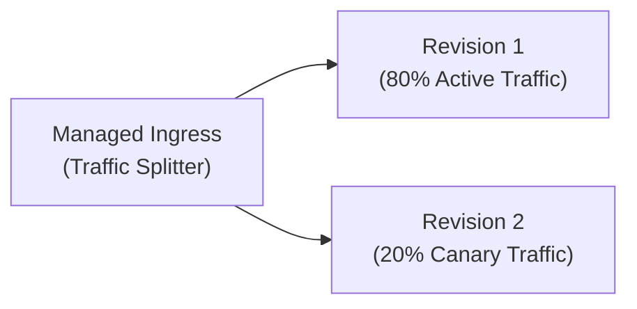
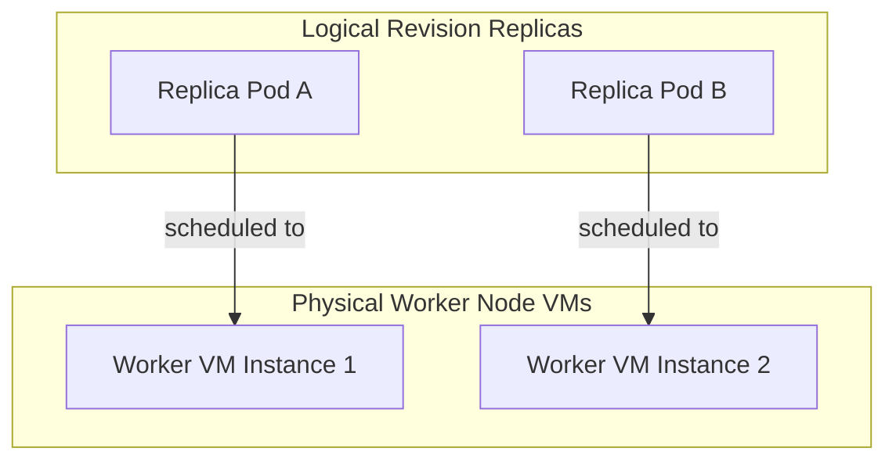

## Table of Contents

1. [What Is Container Apps](#what-is-container-apps)
2. [Declarative Container App Bicep Configuration](#declarative-container-app-bicep-configuration)
3. [Environment: The Private Network Boundary](#environment-the-private-network-boundary)
4. [Container App: The Service Definition](#container-app-the-service-definition)
5. [Image and Registry: Immutable Artifacts](#image-and-registry-immutable-artifacts)
6. [Revisions: Immutable Version Snapshots](#revisions-immutable-version-snapshots)
7. [Ingress: Network Entry Ports](#ingress-network-entry-ports)
8. [Serverless Scaling with KEDA](#serverless-scaling-with-keda)
9. [Dapr Sidecars: Microservice Communication Mesh](#dapr-sidecars-microservice-communication-mesh)
10. [Secrets and Identity: Hardened Credentials](#secrets-and-identity-hardened-credentials)
11. [Logs and Diagnostics](#logs-and-diagnostics)
12. [Putting It All Together](#putting-it-all-together)
13. [What's Next](#whats-next)

## What Is Container Apps

Azure Container Apps is a serverless container hosting platform that runs containerized microservices without requiring team cluster management. It bridges the gap between simple managed web hosts and complex container orchestration platforms. Instead of writing complex Kubernetes deployment manifests, configuring ingress controllers, managing TLS certificates, and upgrading VM node pools, you deploy a standard container image and let the platform manage the orchestration.

:::expand[Under the Hood: Managed Ingress and Scale Rules]{kind="design"}
Container Apps hides cluster operations behind a managed environment. Microsoft documents that the service is built on Kubernetes and open-source cloud-native components, but you should treat the cluster and ingress implementation as Azure-managed infrastructure rather than as an AKS cluster you can administer.

The practical runtime objects you control are the Container Apps environment, the container app, its revisions, its ingress setting, and its scale rules. When ingress is enabled, Azure gives the app an internal or external endpoint and forwards traffic to the target port on healthy replicas. Your main responsibility is to make sure the container listens on that target port, starts reliably, and exposes useful health behavior.

Autoscaling is configured through scale rules. Rules can react to HTTP concurrency, CPU, memory, queues, or supported event sources. If the minimum replica count is `0`, the platform can scale the app to zero when idle. If the app serves customer-facing requests, keep at least one replica warm when cold-start latency would harm the user experience.
:::

If you run containerized architectures on AWS, Container Apps solves a very similar problem to AWS ECS on Fargate or AWS App Runner. Both allow you to run standard containers without operating raw virtual machines. The important difference for a learner is the resource contract: Container Apps gives you managed environments, revisions, ingress, secrets, identities, and scale rules instead of asking you to manage cluster nodes directly.

The platform runs the exact Docker image you build. If the container process crashes on boot because of missing environment variables, listens on the wrong port, or fails local health checks, Container Apps will cycle through failing replicas, making application logs your primary troubleshooting tool.

| Platform Primitive | Architectural Role inside Container Apps |
| --- | --- |
| Environment | The shared network, security, and logging boundary that wraps a subnet and namespace |
| Container App | The logical service definition specifying the image, ports, ingress, and scaling bounds |
| Container Image | The immutable packaged application artifact built from your Dockerfile |
| Revision | A read-only snapshot of the application template, enabling versioned rollouts |
| Ingress | Public or private HTTP/TCP entry to the target port on the app |
| Scale Rule | Scaling thresholds defining minimum and maximum replica limits |
| Secrets | Environment-specific encrypted values mounted dynamically into the container |

## Declarative Container App Bicep Configuration

You can deploy and configure a serverless Container App declaratively using Bicep. The following sample Bicep template defines a Container App linked to a managed environment, declaring a resource template with dynamic CPU limits, environment variable injection, and an event-driven Queue autoscale rule:

```bicep
resource containerApp 'Microsoft.App/containerApps@2023-05-01' = {
  name: 'ca-orders-worker'
  location: 'eastus'
  properties: {
    managedEnvironmentId: resourceId('Microsoft.App/managedEnvironments', 'cae-commerce-prod')
    configuration: {
      activeRevisionsMode: 'Single'
      secrets: [
        {
          name: 'queue-connection'
          value: 'DefaultEndpointsProtocol=https;AccountName=mystorage...'
        }
      ]
    }
    template: {
      containers: [
        {
          name: 'orders-worker'
          image: 'acrorders.azurecr.io/orders-worker:v1.0'
          resources: {
            cpu: json('0.5')
            memory: '1.0Gi'
          }
        }
      ]
      scale: {
        minReplicas: 0
        maxReplicas: 10
        rules: [
          {
            name: 'queue-scale-rule'
            azureQueue: {
              queueName: 'orders-queue'
              queueLength: 5
              auth: [
                {
                  secretRef: 'queue-connection'
                  triggerParameter: 'connection'
                }
              ]
            }
          }
        ]
      }
    }
  }
}
```

This declarative template establishes an elastic worker that scales down to zero when idle and provisions up to ten instances during transaction bursts.

## Environment: The Private Network Boundary

A Container Apps Environment is the shared operating boundary around a group of related container apps. It defines where those apps sit on the network, how they resolve names, where logs go, and whether traffic enters through public or private endpoints.

Example: `cae-orders-prod-eus` can contain `orders-api`, `inventory-api`, and `orders-worker`. Those apps can use internal environment networking to call each other while sharing the same Log Analytics workspace and VNet placement.

The environment isolates your microservices from other workloads inside Azure's multi-tenant clusters. In a typical production architecture, you deploy a group of cooperating services (such as a front-end API gateway, an inventory service, and a data worker) to the same Container Apps Environment.

This co-location allows all services in the environment to utilize internal DNS name resolution and communicate securely over a shared private network. Because the environment maps directly to a virtual network, you can configure regional virtual network integration to secure database connections and private endpoint tunnels without exposing public IP addresses.

To maintain strict security separation, provision separate Container Apps Environments for separate lifecycle stages (such as development, staging, and production). Sharing a single environment across stages introduces structural risks, as a compromised staging service could exploit internal network routing to access production databases or shared secrets.

### Internal vs. External Environment Ingress

Environment ingress is the public-or-private reachability setting for apps in the environment. When provisioning a Container Apps Environment, you must make a critical architectural decision regarding its public network posture:

*   **External Environment**: The environment controller deploys a public IP address and maps it to a shared public load balancer. This is suitable for public API gateways or storefront web applications that must be directly reachable from the internet.
*   **Internal Environment**: The environment controller provisions the environment strictly with an internal load balancer (ILB) mapped to a private IP address within your Virtual Network subnet. Internet traffic cannot reach any container app in this environment. All inter-service calls remain protected within the VNet, and public access is restricted unless you route inbound packets through an upstream Application Gateway or Azure Firewall.

For microservices that handle sensitive databases or payment queues, always deploy them to an Internal Environment to ensure they are completely invisible to the public internet.

## Container App: The Service Definition

A Container App is the service record for one running microservice. It names the image to run, the CPU and memory limits, the target port, the secrets, and the scaling rules.

Example: `ca-orders-api-prod` can run `acrorders.azurecr.io/orders-api:2026-05-16.7`, listen on port `3000`, keep at least one replica warm, and scale to ten replicas when HTTP concurrency rises.

Rather than managing complex pod templates, you configure the Container App through a simplified REST API or Azure CLI command.

To ensure operational clarity during incidents, maintain a clear, documented record of each Container App profile. This avoids configuration mismatches when rolling out updates.

| Profile Field | Current Value |
| --- | --- |
| Parent Environment | `cae-orders-prod-eus` |
| Container App Name | `ca-orders-api-prod` |
| Registry Image Reference | `acrorders.azurecr.io/orders-api:2026-05-16.7` |
| Target Container Port | `3000` |
| Ingress Configuration | `External HTTPS` |
| Scale Limits | `Min Replicas: 1 / Max Replicas: 10` |
| System Managed Identity | `Enabled` |

If a deployment fails, reference this profile to verify that the target container port matches the port your application code actually binds to. If the image exposes port `3000` but ingress is configured to target port `8080`, the platform cannot reach the container process correctly, and inbound HTTP requests can return `502`, `503`, or `504` symptoms depending on the failure path.

## Image and Registry: Immutable Artifacts

The container image is the immutable package that contains your application binary, runtime libraries, and start commands. Container Apps does not compile source code; it pulls this compiled image from a container registry (such as Azure Container Registry or Docker Hub) when launching replica instances.

To guarantee that your image runs reliably, design your Dockerfile to conform to cloud-native standards. The process must write all logs to standard output or standard error streams rather than local files inside the container. It must handle termination signals (`SIGTERM`) gracefully, allowing active requests to finish before shutting down. It must also avoid assuming write access to persistent local directories, as container storage is ephemeral and reset whenever a replica recycles.

Avoid deploying images using mutable tags like `latest` or `staging`. If a scale-out event occurs, the platform will pull the image from the registry again. If a build pipeline overwrote the `latest` tag with new, untested code in the registry, the scale-out event will spin up mismatching container versions, causing hard-to-debug runtime differences. Instead, tag every image with a unique commit SHA or build ID to guarantee version consistency across all replicas.

:::expand[Mutable Image Tags and Mixed-Version Replicas]{kind="pitfall"}
A major system reliability risk in Container Apps is deploying containers using mutable image tags (such as `myapp:latest` or `myapp:staging`). A revision records the template you deploy, including the image reference. If your release process keeps reusing a mutable tag, humans and automation can lose the ability to prove which build is running, and later redeployments or rollbacks can pull a different image than the one the tag represented during the first release.

This leads to a version-control hazard: two revisions, environments, or redeployments can appear to reference the same tag while actually representing different builds over time. The symptom appears as intermittent or hard-to-reproduce behavior because the deployment record no longer names the immutable image artifact clearly.

This matches the behavior of **AWS ECS Fargate**, where scaling out tasks that target a mutable tag like `:latest` pulls whatever image currently exists in ECR at task boot time, creating the exact same silent version divergence.

Consider this deployment tag transformation:

*   **Before (Mutable Tag Trap):** Re-using the same tag on every pipeline push:
    ```bash
    # Overwrites the registry's tag; forces mixed-version scale-outs
    docker build -t acrorders.azurecr.io/orders-api:latest .
    docker push acrorders.azurecr.io/orders-api:latest
    ```
*   **After (Immutable SHA Tag Pattern):** Generate a unique, immutable tag based on the Git commit SHA for every build:
    ```bash
    # Each build is unique; scale-out is fully locked to this SHA digest
    GIT_SHA=$(git rev-parse --short HEAD)
    docker build -t acrorders.azurecr.io/orders-api:$GIT_SHA .
    docker push acrorders.azurecr.io/orders-api:$GIT_SHA
    ```

**Rule of thumb:** Never deploy mutable tags like `latest` or `prod` to a production Container App. Treat every deployment image tag as an immutable, versioned release record, uniquely named by Git commit SHA or build ID to guarantee version consistency across all scaling replicas.
:::

## Revisions: Immutable Version Snapshots

A revision is the read-only deployment record for one Container App template. It captures the exact image reference, resource limits, environment variables, and scale rules used by that version.


*A Container Apps revision is an immutable runtime snapshot; traffic, scale, secrets, and identity determine how safely it runs.*


Example: revision `ca-orders-api-prod--0000123` can run image tag `2026-05-16.7` with `0.5` CPU, while revision `ca-orders-api-prod--0000124` runs image tag `2026-05-17.1` with `1.0` CPU during a canary rollout.

Any change to a revision-scope property (such as deploying a new image tag, updating CPU/Memory limits, or altering App Settings) automatically triggers the creation of a new revision.

Container Apps supports two revision modes: Single and Multiple. In Single mode, the platform automatically deactivates the old Revision as soon as the new Revision passes its health and readiness probes. In Multiple mode, you can run multiple Revisions concurrently, allowing you to split traffic between different versions of your service.





This multiple-revision architecture enables safe, progressive rollouts (such as canary releases or blue-green deployments). Container Apps manages the traffic split at the ingress boundary, allowing you to route a small percentage of public traffic (for example, 10%) to the new revision while monitoring exception rates before completing the shift.

## Ingress: Network Entry Ports

Ingress is the traffic entry setting for a Container App. It decides whether the app has no inbound endpoint, a private endpoint inside the environment or VNet, or a public HTTPS endpoint on the internet.


*Ingress works only when the platform target port matches the port your container actually listens on.*


Example: `orders-worker` should usually have ingress disabled because it only reads from a queue, while `orders-api` might use external ingress on target port `3000` so browsers and API clients can reach it.

Container Apps supports three ingress states: disabled (fully private background workers), internal (only reachable by other services inside the same environment or virtual network), and external (exposed to the public internet).

When ingress is enabled, the platform allocates an external endpoint or internal reachability for the app and routes traffic to the configured target port of your running container replicas. Container Apps can handle TLS at the managed endpoint, but your container still has to listen on the correct target port and become ready before traffic can succeed.

If your service needs to execute background jobs or process messages from a queue, disable ingress entirely. Running a worker service with an exposed HTTP port creates unnecessary security vectors and forces you to manage public access routes for a process that only needs to connect outbound to a queue.

## Serverless Scaling with KEDA

KEDA is the scale controller that watches external demand signals and changes replica count for you. Instead of waiting for CPU to rise inside an already-running container, KEDA can watch a queue, HTTP concurrency, or another event source.


*Scale-to-zero is a loop: no traffic means no replicas, new demand wakes replicas, and idle time shuts them down again.*


Example: if `orders-queue` grows past five messages per worker, KEDA can increase `orders-worker` from zero replicas to several replicas even before those containers have CPU usage.

Standard container scaling monitors host-level metrics like CPU spikes or memory exhaustion. While this works for steady-state web servers, it is an ineffective trigger for event-driven background workers. If a message queue has ten thousand pending messages, a worker container that has not started yet has zero CPU usage, preventing standard autoscalers from reacting.

Container Apps addresses this limitation by utilizing **Kubernetes Event-driven Autoscaling (KEDA)**. KEDA is a lightweight scale controller that runs continuously within the managed Environment's control plane.

KEDA operates as a detached polling loop:

1.  **External Polling**: The KEDA scale controller actively polls the configured event source (such as Azure Storage Queues, Service Bus, Kafka topics, or HTTP request pools) directly at scheduled intervals.
2.  **Zero-Instance Idle**: If the orders queue is empty, the scale controller deallocates all worker container instances, scaling the replica count to zero to stop all resource consumption and charges.
3.  **Dynamic Wakeup**: The moment a message lands in the queue, KEDA detects the backlog, allocates a VM slot in the environment, starts the container replica, and mounts the runtime configuration.
4.  **Queue-Length Scaling**: If the message backlog exceeds your configured threshold (for example, if you set a `queueLength` of `5` and the queue has `50` messages), KEDA automatically scales out the replica count (up to your configured maximum) to process the backlog concurrently.

By using KEDA, your background workers scale dynamically to match the volume of pending events, ensuring that your compute footprints align perfectly with active workloads.

A key capability of Container Apps is the ability to scale to zero replicas when no traffic or events are present. This can dramatically lower costs for development workloads or background processors that only run sporadically. However, scaling to zero introduces the physical constraint of cold starts.

When a container scales to zero, there are no active replicas to serve the first new request or event. The platform must allocate capacity, pull or prepare the image if needed, start the container process, and wait for the application to become ready. This sequence creates cold-start latency that must be factored into your API design. To prevent this cold-start delay for customer-facing services, set the minimum replica limit to `1`.

## Dapr Sidecars: Microservice Communication Mesh

Dapr is an optional sidecar runtime that moves service invocation, discovery, mTLS, state access, and pub/sub plumbing out of your application code. In a distributed microservice system, having services communicate directly using hardcoded IP addresses or local hostname configurations introduces brittle dependencies. If the payments container's IP changes, the checkout container's network calls will fail.

Azure Container Apps solves this service-discovery and security challenge through native **Distributed Application Runtime (Dapr)** integration. When Dapr is enabled, the Container Apps runtime automatically injects a helper Dapr sidecar container alongside your application container within the same execution pod.

The two containers share the same network namespace and link-local loopback adapter (`127.0.0.1`), enabling high-performance local inter-process communication:

```plain
Checkout App Container (Port 3000) ──> Local Dapr Sidecar (Port 3500)
                                                 │
                                     [Secure Mutual TLS (mTLS)]
                                                 ▼
Payments App Container (Port 8080) <── Local Dapr Sidecar (Port 3500)
```

When the checkout service needs to invoke the payments service, it does not send a direct request to the payments URL. Instead, it sends a simple HTTP/gRPC call to its local Dapr sidecar:

1.  **Local Invoke Call**: The checkout app sends an HTTP GET request to `http://localhost:3500/v1.0/invoke/payments/method/charge`.
2.  **Service Discovery**: The checkout Dapr sidecar queries the environment's managed DNS registry to locate the active IP address of the payments Dapr sidecar.
3.  **Mutual TLS Encryption**: The two Dapr sidecars establish a cryptographically secure, mutually authenticated TLS (mTLS) socket connection.
4.  **Decrypted Delivery**: The payments Dapr sidecar receives the encrypted packet, decrypts it, and forwards it to the local payments application container on port `8080` via loopback.

This sidecar design guarantees that all inter-service communication remains private, encrypted, and isolated on the private backbone without requiring a single line of TLS encryption or service-discovery boilerplate code inside your application.

## Secrets and Identity: Hardened Credentials

Container Apps secrets are named encrypted values stored with the app configuration and referenced by the container template. Container Apps separates sensitive credentials from standard environment variables by utilizing a dedicated Secrets store. You define secrets (such as database passwords, third-party API keys, or private registry tokens) at the Container App level. These values are encrypted at rest and can be referenced by name in your container template, which injects them as standard environment variables when the replicas boot.

For secure access to Azure resources (like Azure SQL or Key Vault), avoid using static passwords or access keys. Enable a system-assigned managed identity on the Container App to grant the service a secure, passwordless identity in Entra ID.

The container process accesses Entra ID tokens through a secure local endpoint exposed inside the running app. When the application code initiates a token request, the Azure SDK calls the Container Apps managed identity endpoint using platform-provided environment details and headers. The endpoint returns an access token for the Container App identity, and the app passes that token to downstream services, eliminating the risk of hardcoded credentials leaking through version control or container logs.

## Logs and Diagnostics

All console log outputs (standard out and standard error) written by your container processes are intercepted by the cluster's host container runtime daemon (`containerd`). The platform streams these logs directly to a managed Log Analytics workspace configured at the Environment level.

When troubleshooting a failed revision rollout, do not rely on high-level resource states. If a revision fails its readiness probes, inspect the platform events and application logs simultaneously.

A resource state of `Degraded` or `Revision Failed` indicates that the platform could not complete the deployment. If the application logs are completely empty, the container process likely crashed before initializing the log pipes, which points to a startup command error or a missing container entrypoint script. If the logs show application exceptions, the process booted but failed its internal database connection or health check logic, preventing the readiness probe from returning success.

## Putting It All Together

Container Apps wraps containerized applications in a managed, serverless orchestration layer.

* **Managed Environment Abstraction**: Container Apps gives you container hosting, ingress, revisions, and scale rules without exposing cluster administration.
* **Revision Mappings**: Revision-scope changes create read-only revisions that can receive traffic independently in multiple-revision mode.
* **Cold-Start Physics**: Scaling to zero removes all active replicas. The next request or event waits while the platform starts a replica and the application initializes.
* **KEDA Event Autoscale**: Employs KEDA to poll queue backlogs, allowing dynamic scaling up and down to zero based on event load.
* **Dapr Sidecar Mesh**: Automatically injects Dapr sidecars to manage secure mTLS service discovery and private networking between microservices.

By designing your container images and scaling rules around these architectural mechanisms, you can build reliable, elastic microservice environments that scale dynamically without the overhead of raw cluster management.

## What's Next

In the next chapter, we will continue up the container scaling ladder to explore Azure Kubernetes Service (AKS). We will partition the cluster control plane from worker VM node pools, compare overlay Kubenet with routable Azure CNI networking, and configure Entra Workload ID federations.

---

* [Azure Container Apps Overview](https://learn.microsoft.com/en-us/azure/container-apps/overview) - Official overview of the serverless container platform.
* [Revisions in Azure Container Apps](https://learn.microsoft.com/en-us/azure/container-apps/revisions) - Technical details of versioned snapshots and traffic split rules.
* [Azure Container Apps scaling](https://learn.microsoft.com/en-us/azure/container-apps/scale-app) - Official guide to scale rules, concurrency metrics, and scaling to zero.
* [Managed Secrets in Container Apps](https://learn.microsoft.com/en-us/azure/container-apps/manage-secrets) - Documentation on encrypting and injecting environment variables.
