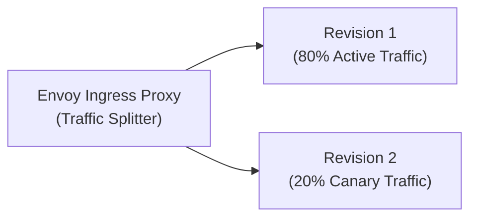
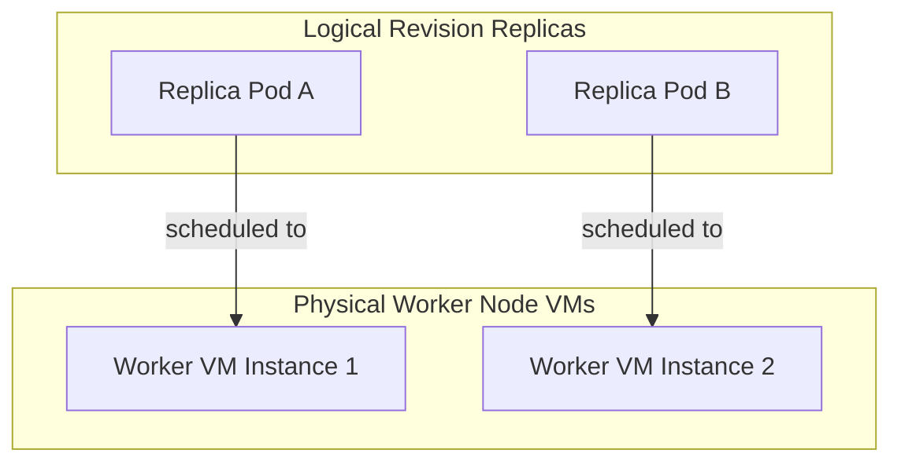

## Table of Contents

1. [What Is Container Apps](#what-is-container-apps)
2. [Environment](#environment)
3. [Container App](#container-app)
4. [Image And Registry](#image-and-registry)
5. [Revisions](#revisions)
6. [Ingress](#ingress)
7. [Scaling](#scaling)
8. [Secrets And Identity](#secrets-and-identity)
9. [Logs](#logs)
10. [Putting It All Together](#putting-it-all-together)
11. [What's Next](#whats-next)

## What Is Container Apps

Azure Container Apps is a serverless container hosting platform that runs containerized microservices without requiring team cluster management. It bridges the gap between simple managed web hosts and complex container orchestration platforms. Instead of writing complex Kubernetes deployment manifests, configuring ingress controllers, managing TLS certificates, and upgrading VM node pools, you deploy a standard container image and let the platform manage the orchestration.

:::expand[Under the Hood: Managed Envoy and the KEDA Polling Engine]{kind="design"}
While Container Apps hides cluster operations, its runtime fabric is built directly on top of an Azure Kubernetes Service (AKS) cluster managed entirely by Azure's control plane. When you create an Environment, Azure provisions a dedicated, multi-tenant cluster and isolates your workloads using secure virtual network subnets and namespaces.

The ingress routing and traffic management engine inside this fabric is powered by managed Envoy proxies. Redundant Envoy proxy instances at the boundary of your environment terminate TLS, inspect incoming headers, and load-balance traffic across active container replicas. 

Autoscaling is managed by KEDA (Kubernetes Event-driven Autoscaling). KEDA runs as a controller in the background cluster. Every few seconds, the KEDA controller queries external metrics providers (such as Azure Queue Storage message counts, Service Bus queue lengths, or HTTP request concurrency rates) and tells the Horizontal Pod Autoscaler (HPA) to scale your replicas. Because KEDA is integrated directly into the scheduler, it can scale your workloads to zero when no traffic or events are active.
:::

If you run containerized architectures on AWS, Container Apps solves a very similar problem to AWS ECS on Fargate or AWS App Runner. Both allow you to run standard containers without operating raw virtual machines. However, while AWS ECS relies on Amazon's proprietary Fargate task execution fabric, Container Apps builds on standard cloud-native open-source tools—managed Kubernetes, KEDA for event scaling, and Envoy for routing.

The platform runs the exact Docker image you build. If the container process crashes on boot because of missing environment variables, listens on the wrong port, or fails local health checks, Container Apps will cycle through failing replicas, making application logs your primary troubleshooting tool.

| Platform Primitive | Architectural Role inside Container Apps |
| --- | --- |
| Environment | The shared network, security, and logging boundary that wraps a subnet and namespace |
| Container App | The logical service definition specifying the image, ports, ingress, and scaling bounds |
| Container Image | The immutable packaged application artifact built from your Dockerfile |
| Revision | A read-only snapshot of the application template, enabling versioned rollouts |
| Ingress Proxy | Managed Envoy instances routing public (external) or private (internal) HTTP and TCP traffic |
| Scale Rule | KEDA-driven scaling thresholds defining minimum and maximum replica limits |
| Secrets | Environment-specific encrypted values mounted dynamically into the container |

## Environment

The Container Apps Environment serves as the physical network and telemetry boundary for a group of related services. It isolates your microservices from other workloads inside Azure's multi-tenant clusters. In a typical production architecture, you deploy a group of cooperating services (such as a front-end API gateway, an inventory service, and a data worker) to the same Container Apps Environment.

This co-location allows all services in the environment to utilize internal DNS name resolution and communicate securely over a shared private subnet. Because the environment maps directly to a virtual network, you can configure regional virtual network integration to secure database connections and private endpoint tunnels without exposing public IP addresses.

To maintain strict security separation, provision separate Container Apps Environments for separate lifecycle stages (such as development, staging, and production). Sharing a single environment across stages introduces structural risks, as a compromised staging service could exploit internal network routing to access production databases or shared secrets.

## Container App

The Container App is the deployable resource that represents your running microservice. It manages the configuration template, defines the container registry access, maps inbound network ports, and links secrets to environment variables. Rather than managing complex pod templates, you configure the Container App through a simplified REST API or Azure CLI command.

To ensure operational clarity during incidents, maintain a clear, documented record of each Container App profile. This avoids configuration mismatches when rolling out updates.

| Profile Field | Current Value |
| --- | --- |
| Parent Environment | `cae-orders-prod-eus` |
| Container App Name | `ca-orders-api-prod` |
| Registry Image Reference | `acrorders.azurecr.io/orders-api:2026-05-16.7` |
| Target Container Port | `3000` |
| Ingress Configuration | `External HTTPS (Envoy routed)` |
| Scale Limits | `Min Replicas: 1 / Max Replicas: 10` |
| System Managed Identity | `Enabled` |

If a deployment fails, reference this profile to verify that the target container port matches the port your application code actually binds to. If the image exposes port `3000` but the Ingress is configured to look for port `8080`, the Envoy proxy will fail to establish a TCP socket, and inbound HTTP requests will return a `503 Service Unavailable` error.

## Image And Registry

The container image is the immutable package that contains your application binary, runtime libraries, and start commands. Container Apps does not compile source code; it pulls this compiled image from a container registry (such as Azure Container Registry or Docker Hub) when launching replica instances.

To guarantee that your image runs reliably, design your Dockerfile to conform to cloud-native standards. The process must write all logs to standard output or standard error streams rather than local files inside the container. It must handle termination signals (`SIGTERM`) gracefully, allowing active requests to finish before shutting down. It must also avoid assuming write access to persistent local directories, as container storage is ephemeral and reset whenever a replica recycles.

Avoid deploying images using mutable tags like `latest` or `staging`. If a scale-out event occurs, the platform will pull the image from the registry again. If a build pipeline overwrote the `latest` tag with new, untested code in the registry, the scale-out event will spin up mismatching container versions, causing hard-to-debug runtime differences. Instead, tag every image with a unique commit SHA or build ID to guarantee version consistency across all replicas.

## Revisions

A Revision is a version-locked snapshot of a Container App's configuration template. Any change to a revision-scope property (such as deploying a new image tag, updating CPU/Memory limits, or altering App Settings) automatically triggers the creation of a new Revision.

Container Apps supports two revision modes: Single and Multiple. In Single mode, the platform automatically deactivates the old Revision as soon as the new Revision passes its health and readiness probes. In Multiple mode, you can run multiple Revisions concurrently, allowing you to split traffic between different versions of your service.

This multiple-revision architecture enables safe, progressive rollouts (such as Canary releases or Blue-Green deployments). The Envoy proxy manages the traffic split dynamically at the ingress boundary, allowing you to route a small percentage of public traffic (e.g., 10%) to the new Revision while monitoring exception rates before completing the shift.

## Ingress

Ingress is the network configuration layer that determines how outside traffic reaches your container. Container Apps supports three ingress states: disabled (fully private background workers), internal (only reachable by other services inside the same environment or virtual network), and external (exposed to the public internet).

When ingress is enabled, the platform allocates a public IP address or an internal DNS name to the environment and configures the Envoy proxies to listen on port `80` (HTTP) and port `443` (HTTPS). The Envoy proxy terminates incoming TLS connections using managed certificates and reverse-proxies the traffic to the private IP and target port of your running container replicas.

If your service needs to execute background jobs or process messages from a queue, disable ingress entirely. Running a worker service with an exposed HTTP port creates unnecessary security vectors and forces you to manage public access routes for a process that only needs to connect outbound to a queue.

## Scaling

Container Apps scaling is designed to adapt compute resources dynamically to match request volumes, utilizing KEDA to evaluate scaling metrics. You can write scale rules that trigger scaling based on HTTP request concurrency, CPU load, memory pressure, or external event sources.

A key capability of Container Apps is the ability to scale to zero replicas when no traffic or events are present. This can dramatically lower costs for development workloads or background processors that only run sporadically. However, scaling to zero introduces the physical constraint of cold starts.

When a container scales to zero, the scheduler terminates all active replicas. When a new HTTP request arrives, the Envoy proxy holds the request in a buffer. The KEDA scaling engine detects the incoming HTTP connection and tells the cluster fabric to provision a new replica container. This requires allocating a virtual node slot, pulling the container image from the registry, starting the guest runtime, and executing your application startup process. This sequence creates a physical latency delay (often several seconds) for the initial request, which must be factored into your API design. To prevent this cold-start delay for customer-facing services, set the minimum replica limit to `1`.

## Secrets And Identity

Container Apps separates sensitive credentials from standard environment variables by utilizing a dedicated Secrets store. You define secrets (such as database passwords, third-party API keys, or private registry tokens) at the Container App level. These values are encrypted at rest and can be referenced by name in your container template, which injects them as standard environment variables when the replicas boot.

For secure access to Azure resources (like Azure SQL or Key Vault), avoid using static passwords or access keys. Enable a system-assigned managed identity on the Container App to grant the service a secure, passwordless identity in Entra ID.

The container process accesses Entra ID tokens through a secure local metadata service endpoint. When the application code initiates a token request, the Azure SDK routes the request to a local hypervisor interface, which retrieves a signed token from Entra ID on behalf of the Container App. This token can then be passed to downstream services, eliminating the risk of hardcoded credentials leaking through version control or container logs.

## Logs

All console log outputs (standard out and standard error) written by your container processes are intercepted by the cluster's host container runtime daemon (`containerd`). The platform streams these logs directly to a managed Log Analytics workspace configured at the Environment level.

When troubleshooting a failed revision rollout, do not rely on high-level resource states. If a revision fails its readiness probes, inspect the platform events and application logs simultaneously. 

A resource state of `Degraded` or `Revision Failed` indicates that the platform could not complete the deployment. If the application logs are completely empty, the container process likely crashed before initializing the log pipes, which points to a startup command error or a missing container entrypoint script. If the logs show application exceptions, the process booted but failed its internal database connection or health check logic, preventing the readiness probe from returning success.

## Putting It All Together

Container Apps wraps containerized applications in a managed, serverless orchestration layer.

* **Kubernetes and Envoy Abstraction**: Container Apps runs on top of a managed AKS cluster, utilizing Envoy proxies for ingress routing and KEDA for dynamic event-driven autoscaling.
* **Revision Mappings**: Every configuration change creates a read-only Revision, which maps to an isolated Kubernetes Deployment.
* **Cold-Start Physics**: Scaling to zero terminates all replicas. Subsequent requests are held in buffer by Envoy, triggering a physical latency delay while the cluster fabric pulls the image and initializes the container process.

By designing your container images and scaling rules around these architectural mechanisms, you can build reliable, elastic microservice environments that scale dynamically without the overhead of raw cluster management.

## What's Next

In the next chapter, we will look at Azure Functions. We will explore event-driven execution models, detail how the Scale Controller daemon polls event backlogs without booting application code, compare Consumption and Flex plans, and analyze cold starts.

---

**References**

- [Azure Container Apps Overview](https://learn.microsoft.com/en-us/azure/container-apps/overview) - Official overview of the serverless container platform.
- [Revisions in Azure Container Apps](https://learn.microsoft.com/en-us/azure/container-apps/revisions) - Technical details of versioned snapshots and traffic split rules.
- [KEDA Integration and Scaling](https://learn.microsoft.com/en-us/azure/container-apps/scale-app) - Explanation of KEDA controllers, concurrency metrics, and scaling to zero.
- [Managed Secrets in Container Apps](https://learn.microsoft.com/en-us/azure/container-apps/manage-secrets) - Documentation on encrypting and injecting environment variables.
