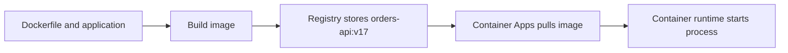
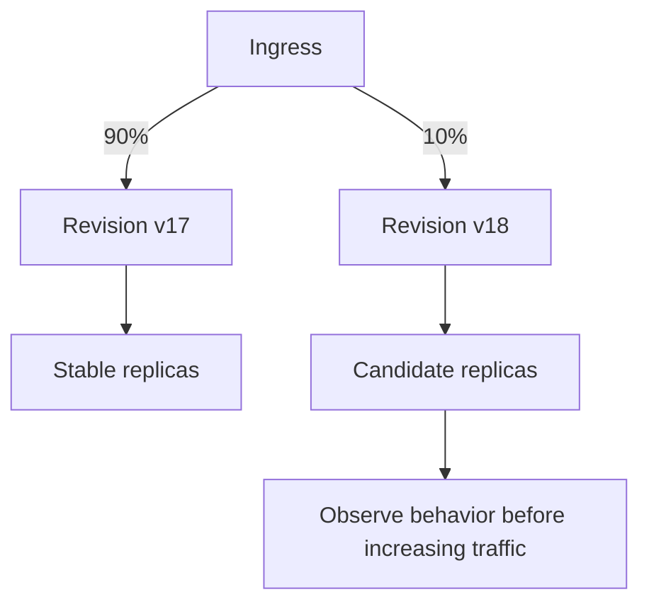
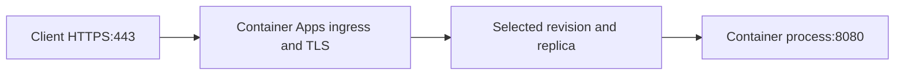
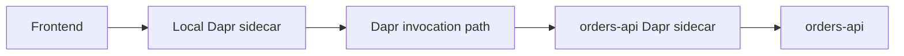
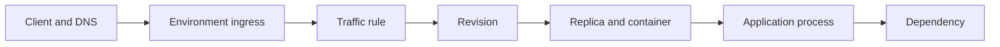
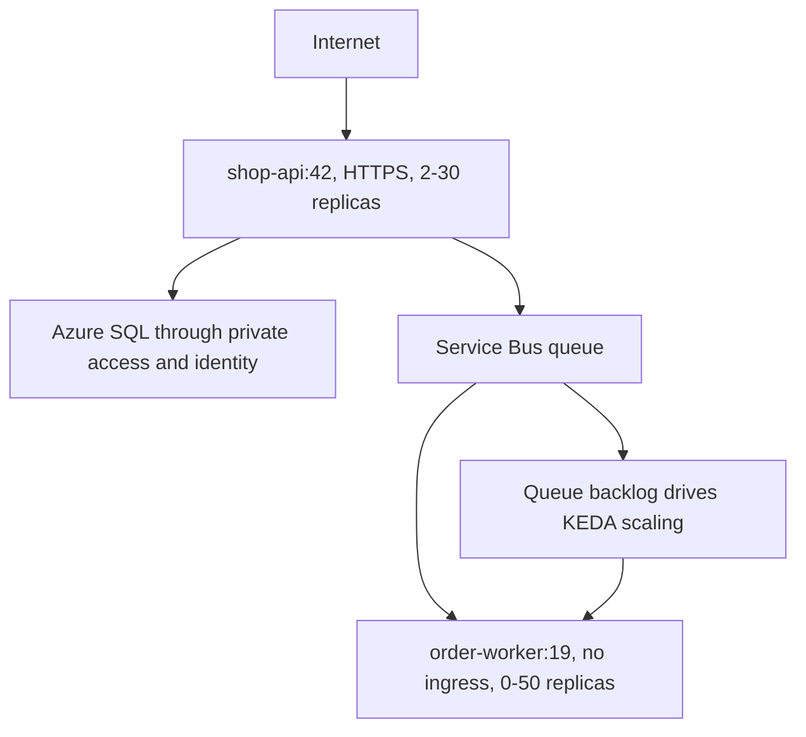

## Table of Contents

1. [What Is Azure Container Apps?](#what-is-azure-container-apps)
2. [How Do Environments, Apps, and Replicas Fit Together?](#how-do-environments-apps-and-replicas-fit-together)
3. [How Do Images and Revisions Make Releases Traceable?](#how-do-images-and-revisions-make-releases-traceable)
4. [How Does Ingress Route Traffic?](#how-does-ingress-route-traffic)
5. [How Do Scale Rules Change Replica Count?](#how-do-scale-rules-change-replica-count)
6. [How Do Secrets, Identity, Dapr, and Sidecars Support the App?](#how-do-secrets-identity-dapr-and-sidecars-support-the-app)
7. [What Logs Explain Runtime Behavior?](#what-logs-explain-runtime-behavior)
8. [When Is Container Apps the Right Fit?](#when-is-container-apps-the-right-fit)
9. [Check Your Answers](#check-your-answers)

An image in a container registry is a package waiting to be run. To turn it into an application, something must start its process, send requests or events to it, supply settings and identity, restart failed instances, and add capacity when work increases.

Azure Container Apps provides that hosting arrangement at the application level. You describe the image, resources, networking, and scaling behavior. Azure operates much of the underlying machinery needed to place and run its containers. You can use container packaging without making Kubernetes clusters or VM administration your main operating interface.

The service is easier to understand once the application, its version, and its running copies have separate names. These questions build that model and follow it into deployment and operations:

1. **What Is Azure Container Apps?**
2. **How Do Environments, Apps, and Replicas Fit Together?**
3. **How Do Images and Revisions Make Releases Traceable?**
4. **How Does Ingress Route Traffic?**
5. **How Do Scale Rules Change Replica Count?**
6. **How Do Secrets, Identity, Dapr, and Sidecars Support the App?**
7. **What Logs Explain Runtime Behavior?**
8. **When Is Container Apps the Right Fit?**

## What Is Azure Container Apps?
<!-- section-summary: Container Apps executes packaged application processes and manages much of their placement, routing, scaling, and lifecycle without exposing Kubernetes as the normal operating interface. -->

Container Apps takes a container image and supplies a managed application runtime around it. The image's processes can receive requests or consume events, scale as demand changes, restart after failure, receive runtime configuration and identity, emit logs, and participate in controlled version changes.

Physical servers still provide virtualized compute, operating systems, container runtimes, containers, and application processes. CPUs execute the instructions at the bottom of that arrangement. Container Apps changes the division of responsibility rather than removing those layers.

The [service overview](https://learn.microsoft.com/en-gb/azure/container-apps/overview) describes a serverless platform for APIs, background processing, event-driven applications, and microservices. Its scaling can use HTTP demand, events, CPU and memory, and KEDA-supported sources. **Serverless** here means that individual servers are largely below the interface through which you provision and operate the application.

### Start with the package

Suppose `orders-api` requires Linux, .NET 10, a native library called `xyz`, and its application binaries. A container image such as `orders-api:v17` packages the filesystem, runtime, dependencies, and application together. Azure does not need a separate list of guest installation steps for every new instance of that package.

The image is an artifact. A Dockerfile describes how to build it; the build produces the image; a registry stores it. Later, the hosting platform retrieves the image and starts a container from it. A **container** is a running process environment created from the packaged image.

This distinction is essential during release checks. An image can exist without any application process executing it. Storing `orders-api:v15`, `v16`, and `v17` in Azure Container Registry does not make all three live applications.

### Storage and execution have different services

Azure Container Registry, or ACR, stores and distributes images. Container Apps pulls an image from a registry and executes it. Public and private registries are supported, and managed identity can authenticate image pulls from ACR without storing registry administrator credentials.

```mermaid
flowchart LR
    A[Dockerfile and application] --> B[Build image]
    B --> C[Registry stores orders-api:v17]
    C --> D[Container Apps pulls image]
    D --> E[Container runtime starts process]
```

The registry's role is package storage. The hosting platform's role is package execution. Both must work for a successful deployment, but they require different evidence: an available image and an actual healthy runtime using that image.

### Describe application behavior instead of cluster machinery

On raw VMs, a team might assemble the container runtime, load balancing, discovery, scheduling, autoscaling, health checks, deployment strategy, and logs. AKS supplies Kubernetes orchestration, but the team works through Deployments, Services, Pods, Ingress, HPA, KEDA, namespaces, nodes, and clusters.

Container Apps hides much of that cluster-level interface. Its desired application description can name `orders-api:v17`, one CPU, 2 GiB memory, external ingress to port 8080, and a replica range from two to twenty. Those are application requirements the platform translates into managed runtime behavior.

The team still decides whether the image starts correctly, which resource amount it needs, where requests enter, and how it should respond to load. Azure carries much of the infrastructure operation around those decisions. To reason about what the platform creates, distinguish its main objects next.

## How Do Environments, Apps, and Replicas Fit Together?
<!-- section-summary: The environment provides a shared runtime and network boundary; a Container App is a logical service, revisions identify versions, and replicas are their running instances. -->

The hierarchy runs from an **environment** to a **Container App**, then a **revision**, a **replica**, the container or containers inside that replica, and the executing process. Each level identifies a different concern.

| Object | Meaning |
|---|---|
| Environment | Shared security, networking, and platform boundary |
| Container App | Logical application or service over time |
| Revision | Immutable snapshot of revision-scoped application configuration |
| Replica | One running instance of a revision |
| Container | Isolated process environment within that replica |
| Process | The program actually executing instructions |

A revision answers which version or configuration is running. Replicas answer how many running copies of that version exist. One revision might currently have five replicas. Changing the count does not imply a new application version, and creating a new version does not define how many replicas will run it.

### The environment is a runtime boundary

An environment can contain a frontend, `orders-api`, `payments-api`, and a queue worker. It provides a secure boundary around related apps and jobs, with a shared virtual-networking context and typically a common logging destination. Azure manages infrastructure work such as OS upgrades, resource balancing, scaling operations, and failover around that environment.

The [environment guide](https://learn.microsoft.com/en-us/azure/container-apps/environment) describes this role. It is more than a folder used to organize resource names. A resource group is primarily a management and organizational boundary; the Container Apps environment is a runtime and network boundary. The two should not be treated as equivalent objects.

### Choose the networking context deliberately

Azure can supply managed environment networking, or the environment can use a VNet you control. For example, a VNet with address space `10.20.0.0/16` can include a subnet dedicated to Container Apps, with the environment using private connectivity to Azure SQL.

Bringing a controlled VNet is useful for requirements involving network security groups, managed egress, Azure Firewall, Application Gateway, or access through private endpoints. The [custom VNet documentation](https://learn.microsoft.com/en-us/azure/container-apps/custom-virtual-networks) identifies the dedicated subnet requirement and supported arrangements.

A private dependency call then follows the app's environment networking into the VNet, uses private DNS to resolve the service to a private address, and reaches the target's private endpoint. The app may be managed, but the network route and name resolution still need to match the intended dependency path.

### Workload profiles supply capacity

The environment boundary still needs real CPU and memory. The current environment model uses **workload profiles**, with Consumption compute, Dedicated profiles, or combinations according to configuration.

Consumption capacity fits highly elastic workloads and possible scale-to-zero behavior. Dedicated profiles can meet requirements for more predictable or specialized compute characteristics. The [environment documentation](https://learn.microsoft.com/en-us/azure/container-apps/environment) describes these profile choices.

The application still requests CPU and memory per replica. It does not normally ask to place a particular process on a manually selected VM called server 17. Workload profiles change the capacity arrangement beneath the application abstraction rather than replacing that abstraction with ordinary server administration.

### Logical apps can change replica count

The Container App `orders-api` describes its image, CPU, memory, environment variables, scale rules, ingress, identity, secrets, and health probes. It can have two replicas today and fifty tomorrow while remaining one logical service.

The scheduler places replicas on underlying compute. With modest demand, replicas A and B may run the service. More demand can add C, D, and E. Clients continue calling the logical app; they do not need to know which temporary replica will serve them. The [reliability guide](https://learn.microsoft.com/en-us/azure/reliability/reliability-container-apps) describes this replica-based execution model.

### A replica can contain related containers

A replica often contains one application container. It can also contain a tightly coupled helper, or **sidecar**, that should share the application's lifecycle and networking context. A telemetry helper that communicates with the main process locally is one example.

Independent `orders-api`, `payments-api`, and `inventory-api` services usually belong in separate Container Apps rather than being packed into one replica. Their deployment and scale needs are independent, unlike a helper that exists specifically alongside its main process. The [container guidance](https://learn.microsoft.com/en-us/azure/container-apps/containers) explains this distinction.

With the hierarchy clear, we can follow a new image into a revision and see how versioning stays separate from replica count and customer exposure.

## How Do Images and Revisions Make Releases Traceable?
<!-- section-summary: Revisions identify immutable application configurations, while image digests identify package content; readiness and traffic policies control how users move between versions. -->

Suppose `orders-api` currently runs image v17 and a deployment changes it to v18. Container Apps creates a new **revision**, an immutable snapshot of the revision-scoped application configuration. Image configuration and scale-rule changes are examples of changes that can create a new revision.

The Container App persists as the service identity over time. Revision 17 and revision 18 identify particular runtime definitions beneath it. This is comparable in purpose to separating an App Service application's identity from a deployed slot or version, although slots and revisions are different mechanisms.

The [revision documentation](https://learn.microsoft.com/en-us/azure/container-apps/revisions) describes which changes produce snapshots and how they operate. Revisions form the versioning dimension; replicas form the scaling dimension. Revision v18 can have one, five, or more running replicas without changing the fact that they execute v18's definition.

### Single-revision mode waits for readiness

In default single-revision mode, the existing revision continues serving while the new one is provisioned. The platform checks the new revision's provisioning, replica readiness, and health before transitioning traffic.

For example, revision A running v17 receives 100% of traffic while revision B running v18 starts with 0%. Once B is ready, traffic moves to it and the old revision can be deactivated. This separates starting the candidate from stopping the version users currently depend on.

The readiness step is important because an accepted image reference does not prove a usable application. The container may fail to start or fail its health checks. Keeping the earlier revision serving gives the platform a place to route requests while the candidate is prepared.

### Multiple revisions allow controlled exposure

Multiple revision mode lets more than one version remain active. Traffic can be split 90% to v17 and 10% to v18. If the new version behaves well, its share can rise from 10% to 25%, then 50%, and finally 100%. If it fails, its traffic share can return to 0%.

```mermaid
flowchart TD
    A[Ingress] -->|90%| B[Revision v17]
    A -->|10%| C[Revision v18]
    B --> D[Stable replicas]
    C --> E[Candidate replicas]
    E --> F[Observe behavior before increasing traffic]
```

The same ability supports canary releases, blue/green arrangements, and A/B testing. A revision is therefore more than a history record. An active revision can be a routable runtime version whose exposure is controlled independently from its existence.

### Pin the executable content

Using `orders-api:latest` for every deployment weakens traceability. Today that tag might resolve to digest ABC and tomorrow to digest XYZ, while the human-readable configuration remains unchanged. The tag names a registry label; it does not guarantee that the label will always identify the same content.

Container Apps pulls an image when a container starts. A mutable tag can therefore undermine reproducibility across starts, even though the revision still contains the same image-reference string. The [image-pull documentation](https://learn.microsoft.com/en-us/azure/container-apps/managed-identity-image-pull) describes the retrieval behavior.

A versioned image such as `orders-api:2026.08.23.4` is easier to track. A digest reference such as `orders-api@sha256:...` supplies a content identity for the strongest immutability. A **digest** is derived from image content, letting the release record connect revision, exact image, and application bits.

That chain also makes recovery easier to explain. An operator should be able to say which revision handled a request and which executable content that revision's replicas used. The next part of the chain is ingress, which determines how the request reaches the selected runtime.

## How Does Ingress Route Traffic?
<!-- section-summary: Ingress maps client traffic to the container's target port, external and internal exposure have different boundaries, and service discovery hides individual replica addresses. -->

A container might listen on port 8080, while clients expect an HTTPS endpoint on port 443. Without a managed ingress layer, the team would need to arrange public addressing, load balancing, TLS, routing rules, and health-aware request delivery itself.

Container Apps **ingress** supplies that incoming routing layer. Enable it and configure the target port so it can deliver traffic to the application. For HTTP ingress, the platform provides HTTPS and terminates TLS before routing to the target port inside the replica.

```mermaid
flowchart LR
    A[Client HTTPS:443] --> B[Container Apps ingress and TLS]
    B --> C[Selected revision and replica]
    C --> D[Container process:8080]
```

The [ingress overview](https://learn.microsoft.com/en-us/azure/container-apps/ingress-overview) describes this managed path. The process can concentrate on listening at its configured port while the platform handles the client's HTTPS entry point. Both ends must agree on the application's target port for the connection to work.

### Expose each app according to who calls it

Consider a frontend, an order API, and a payment worker. The frontend needs customer access, so it uses external ingress. The order API may only need calls from other applications in the environment, so it uses internal ingress. The worker consumes work without an HTTP endpoint, so it can disable ingress entirely.

**External ingress** exposes the application outside its environment through the environment's available access arrangement. **Internal ingress** restricts the application's endpoint to the Container Apps environment. These are application exposure settings; they should be understood alongside the environment networking already chosen.

The example allows internet clients to reach the frontend, and the frontend to call the order API, without directly exposing the order API to those internet clients. A queue worker does not need an incoming HTTP path merely because it is a running container.

### Call the service name instead of replica addresses

Replicas can be created and removed during scaling or releases. If the frontend tracked the IP addresses of order replicas A, B, and C, it would have to keep updating those addresses as the platform changed placement.

Container Apps provides built-in DNS and service routing for apps in the same environment. The frontend can call the logical service, conceptually `http://orders-api`, and the platform routes to an available replica. The [app communication guide](https://learn.microsoft.com/en-us/azure/container-apps/connect-apps) explains this discovery model.

Service identity and replica identity are therefore distinct. The application name remains the useful destination while the set of running instances changes. This is what makes horizontal scaling practical without forcing every caller to understand the platform's current placement decisions.

Ingress gets work to the application. Scaling determines how many replicas are available to handle that work, and those decisions can respond to HTTP requests or to events outside the HTTP path.

## How Do Scale Rules Change Replica Count?
<!-- section-summary: Scaling compares demand with a target and adjusts replicas within limits; external demand signals support waking from zero, while warm minimum capacity trades idle cost for response latency. -->

Autoscaling is a control loop. Suppose two replicas are running and each can comfortably handle approximately 100 concurrent requests. If demand reaches 450 concurrent requests, a simplified capacity estimate is 450 divided by 100, rounded up to about five replicas.

The controller compares the two actual replicas with the estimated five required replicas and asks the platform to start replicas 3, 4, and 5. It then measures again. This example explains the relationship between demand and capacity rather than claim a universal sizing formula for every application.

Container Apps uses declarative autoscaling and KEDA for many triggers. A **scale rule** identifies the signal and target used to adjust the count. **KEDA** supplies event-driven scaling mechanisms so sources outside the running process can influence its execution capacity. The [scaling guide](https://learn.microsoft.com/en-us/azure/container-apps/scale-app) documents the supported rules.

### HTTP scaling responds to concurrent work

For an HTTP service, request concurrency provides one useful signal. Two replicas may be enough at low traffic; higher concurrency may require four; a larger spike may require fifteen. Minimum and maximum replica limits bound how far the revision's count can change.

Concurrency describes requests in progress at the same time. It is different from a cumulative daily request total. A burst of overlapping work can require more concurrent execution even when the application is quiet for much of the day.

The limits also express an operating decision. A minimum keeps capacity available, while a maximum bounds replica growth. The actual application still needs to function correctly at the concurrency assigned to each replica.

### Queue backlog can scale workers

A Service Bus queue worker has no need to run twenty replicas while its queue is empty. With a suitable rule, zero messages can correspond to zero workers. A burst of 5,000 messages gives the scaler an external signal to start workers and process the backlog.

As queued work falls from 5,000 to 2,000, then 400, then zero, the worker replica count can fall too. Container Apps supports KEDA-backed sources including Service Bus, Event Hubs, Kafka, Redis, and other supported triggers.

This makes the service useful for containerized background consumers. The container owns its normal processing loop, while the platform adjusts the number of copies according to queued or incoming work. The application remains a container process rather than being rewritten into the Functions handler model.

### Zero replicas does not delete the application

When an app scales to zero, its logical application resource, configuration, and revision still exist. There simply is no currently running replica consuming active execution capacity for that workload. A later event can cause the scaler to request a replica, pull and start the image, and resume processing.

The signal must exist while replicas are absent. CPU-only or memory-only scaling cannot initiate from zero because there is no running replica whose resource use can be measured. Suitable HTTP or event demand can provide the external signal instead. The [Container Apps overview](https://learn.microsoft.com/en-gb/azure/container-apps/overview) describes scale-to-zero support and its workload-dependent limits.

### Cold starts take real work

Starting from zero may require allocating runtime capacity, pulling an image, starting the container and application process, and passing readiness checks before serving traffic. That delay is **cold-start latency**.

If the application must respond immediately at all times, a minimum replica count of at least one keeps some capacity warm. Continuous capacity brings ongoing resource usage and cost. A lower idle-cost choice can tolerate more startup delay; a low-latency choice can retain ready instances.

This tradeoff follows from physical execution. A configuration object cannot answer a request until an actual process is ready. The platform manages the startup sequence, but its time still belongs in the application's latency expectations.

### Disposable replicas need graceful shutdown and external state

Replicas can disappear during scale-in, deployments, maintenance, revision deactivation, and failure recovery. Container shutdown begins with a termination signal so a well-behaved process can stop gracefully before forced termination if necessary. The [lifecycle guidance](https://learn.microsoft.com/en-us/azure/container-apps/application-lifecycle-management) warns against assuming durable state inside an individual container.

A replica that stores the only copy of customer orders in `/data/orders.db` ties data survival to that instance. Prefer a design in which replicas use external Azure SQL, Blob Storage, Cosmos DB, Redis, or Service Bus for the state appropriate to those services.

Then a disappearing replica does not have to erase important information. A replacement can start and reconnect to the same external state. This makes scaling, release changes, and recovery compatible with the application's correctness rather than merely increasing the process count.

Configuration and credentials also need an arrangement that survives replica changes. The next section separates sensitive values and workload identity from image content and explains when a sidecar adds useful behavior.

## How Do Secrets, Identity, Dapr, and Sidecars Support the App?
<!-- section-summary: Secrets and identity supply runtime access independently from image versions; sidecars share a replica lifecycle, and optional Dapr APIs can handle distributed-service integration. -->

An image should not contain production values such as `SQL_PASSWORD`, `STRIPE_KEY`, or `SERVICEBUS_CONNECTION_STRING`. Embedding them makes a sensitive environment-specific value part of the executable artifact. A cleaner arrangement combines the image with a protected secret at runtime.

Container Apps supports application-level secrets referenced by revisions through environment variables or mounted values, including Key Vault references. The [security guidance](https://learn.microsoft.com/en-us/azure/container-apps/security) recommends Key Vault-backed handling rather than directly embedding production secrets.

The application can use managed identity to access Key Vault, then receive the necessary secret as runtime configuration. The code continues to use the value it requires without carrying that value inside the image distributed through the registry.

### Secret changes and revision changes are different lifecycles

Revision v17 and revision v18 can both reference a secret named `db-password`. The secret value lives at application scope rather than being copied permanently into each immutable revision. Updating the secret therefore does not automatically create a new revision.

For a directly stored Container Apps secret, active revisions need restart or redeployment to pick up the changed value. Key Vault references without a pinned version can track newer vault versions, and a refresh can restart relevant active revisions. The [revision guidance](https://learn.microsoft.com/en-us/azure/container-apps/revisions) describes the relationship between application-scoped changes and existing revisions.

This separation lets secret rotation proceed on its own lifecycle. It also means operators must check which running processes have received an updated value. An unchanged revision name does not guarantee unchanged effective secrets, and a new vault value does not automatically mean every already-running process has consumed it.

### Managed identity can remove a password

If a container needs Blob Storage, a stored `STORAGE_KEY` is one possible credential arrangement. Managed identity instead gives the Container App a Microsoft Entra identity so it can obtain a token for an Entra-aware service such as Storage, Key Vault, or Azure SQL.

Container Apps supports system-assigned and user-assigned identities. The target still needs to authorize the identity through the appropriate role or permission. Where supported, identity plus authorization avoids embedding a long-lived username and password in application settings.

The same mechanism can support ACR pulls, but image retrieval and application access are distinct authentication events. Before the process starts, the platform needs permission to obtain `myregistry.azurecr.io/orders:v18`. After startup, the process may need permission to query Azure SQL.

The [managed-identity image-pull guide](https://learn.microsoft.com/en-us/azure/container-apps/managed-identity-image-pull) explains registry access. A successful image pull proves that the executable was obtainable; it does not prove that the running workload has SQL permissions. Both events can use managed identities while still requiring their own correct access configuration.

### Sidecars belong with the process they support

A helper such as a telemetry agent can run alongside `orders-api` in the same replica and communicate locally. A **sidecar** is appropriate when the helper exists to support that process and should share its lifecycle and network context.

This differs from combining unrelated independently scalable services into one Container App. A payment API and an inventory API ordinarily deserve their own service definitions. A local helper and its main process can reasonably start, stop, and scale together.

### Dapr supplies optional distributed-application APIs

**Dapr** extends the sidecar idea into a distributed-application runtime. For example, code that publishes an order event might otherwise use a Service Bus SDK, authentication handling, retry logic, and broker configuration directly. With Dapr, the application calls its local Dapr sidecar and asks it to publish to an `orders` topic using the configured messaging component.

Container Apps provides managed Dapr sidecars with building blocks for service invocation, state management, pub/sub, bindings, actors, secrets, and configuration. The [Dapr overview](https://learn.microsoft.com/en-us/azure/container-apps/dapr-overview) describes those APIs. The design separates a generic application request from the specific infrastructure integration performed by the component.

For service invocation, the frontend can call its local Dapr sidecar, which uses Dapr's service-invocation path to reach the order API's sidecar and then its application. Dapr can add service discovery, mutual TLS, retries, and distributed tracing around that call. **Mutual TLS** means both sides authenticate through TLS rather than only the client verifying a server.

```mermaid
flowchart LR
    A[Frontend] --> B[Local Dapr sidecar]
    B --> C[Dapr invocation path]
    C --> D[orders-api Dapr sidecar]
    D --> E[orders-api]
```

Dapr is optional. The frontend can already call `orders-api` through built-in Container Apps discovery and HTTP routing. Container Apps is the hosting platform; Dapr is an additional runtime for distributed-service interactions. Use it because its APIs help the application, not because every hosted container needs another sidecar.

Whether the app uses bindings, Dapr, or direct client calls, the platform and process must leave evidence of what happened. Those evidence streams identify where a failed startup or request stopped.

## What Logs Explain Runtime Behavior?
<!-- section-summary: Separate container output from platform events, then connect image identity, revision readiness, replica state, traffic, and request evidence before declaring a release successful. -->

If a container fails to start, ask two separate questions: what did the application's process report, and what did the hosting platform do? They have different sources of evidence.

**Console logs** collect the container's standard output and standard error. Messages such as “Application starting,” “Database connection failed,” and “Unhandled exception” describe what the process observed. **System logs** describe platform actions such as creating a revision, pulling an image, mounting a volume, scaling replicas, or failing provisioning.

Container Apps also provides optional ingress HTTP logs. Logs can be streamed and integrated with Azure Monitor and Log Analytics. The [logging guide](https://learn.microsoft.com/en-us/azure/container-apps/logging) explains these categories.

A process cannot report its own startup exception if the platform never obtained the image. Conversely, a successful image pull does not explain why the application rejected its configuration. The console/system distinction helps choose the correct evidence rather than search only one log stream for every failure.

### Follow the version into actual requests

“Version 18 deployed successfully” should lead to a more specific chain of checks. The image exists, a revision was created and provisioned, replicas started, readiness passed, traffic was routed to that revision, the application received a request, and the correct version responded.

Inspect revision name, image tag or digest, replica count, container startup logs, system logs, ingress HTTP logs, application logs, metrics, and application traces. These observations connect the release declaration to the executing application and its user-visible behavior.

The [observability guide](https://learn.microsoft.com/en-us/azure/container-apps/observability) describes near-real-time log streaming, console access, Azure Monitor metrics, Log Analytics, alerts, and application logging. They provide different views of the same runtime rather than a single status that proves everything at once.

### Troubleshoot from the client's path inward

For an HTTP service, follow the client through DNS, environment ingress, the traffic rule, revision, replica, container, process, and dependency. Suppose `api.contoso.com` returns 503. Possible causes include incorrect DNS, ingress configuration, no active revision receiving traffic, zero or failed replicas, a container that cannot start, a failed readiness probe, or unavailable SQL access.

Each cause belongs to a different layer. Starting with application code before establishing the selected revision and its replica readiness may be premature. A failed dependency call and an image-pull failure both prevent useful responses, but they require different investigations.

```mermaid
flowchart LR
    A[Client and DNS] --> B[Environment ingress]
    B --> C[Traffic rule]
    C --> D[Revision]
    D --> E[Replica and container]
    E --> F[Application process]
    F --> G[Dependency]
```

The same hierarchy helps during scale-to-zero and shutdown. The logical app may exist with no replicas; a replica may be terminating; a new revision may be provisioned but not yet ready. Those states are understandable once version, count, process, and traffic are kept separate.

The remaining decision is whether this operating interface matches the workload better than App Service, Functions, or AKS. The comparison should follow these mechanisms rather than treat all container services as interchangeable.

## When Is Container Apps the Right Fit?
<!-- section-summary: Container Apps fits containerized applications and workers that need managed application-level operations; compare its process model with web hosting, function invocation, and direct Kubernetes control. -->

Container Apps fits HTTP APIs, microservices, queue consumers, event processors, internal services, scheduled or on-demand container jobs, and workloads that benefit from fast horizontal scaling or scale-to-zero. Its strongest fit is an application already packaged as an image whose operator wants to manage services rather than a cluster.

Direct Kubernetes APIs, custom operators, deep Pod or node scheduling, and cluster-wide extensions point toward AKS instead. Container Apps hides much of that machinery deliberately. The lack of a direct Kubernetes control surface is part of the abstraction, not a missing step in ordinary application deployment.

### Compare with App Service

Both services can host web applications and both can run supported container configurations. Their emphasis differs:

| Question | App Service | Container Apps |
|---|---|---|
| Main abstraction | Web application | Containerized application |
| Source and managed runtime hosting | Natural fit | Usually image-centric |
| Custom container packaging | Supported | Central model |
| Event-driven replica scaling | More limited model | Core KEDA-based capability |
| Scale to zero | Depends on hosting capabilities and plan | Available for many suitable workloads |
| Version and traffic controls | Deployment slots are common | Native revisions and traffic weights |
| Background workers | Possible hosting patterns | Natural fit |
| Containerized microservices | Possible | Strong fit |
| Direct Kubernetes API | No | No |

A conventional .NET website without special container requirements may be simpler on App Service. A set of packaged APIs and workers with event-based scaling can fit Container Apps naturally. The decision concerns packaging, lifecycle, scale signals, and operating interface rather than whether either platform is technically capable of receiving HTTP.

### Compare with Functions and AKS

Functions starts from the handler that should execute after an event. Container Apps starts from the containerized process and how its replicas should behave. With Service Bus, Functions can turn a message into a function invocation, while Container Apps can use queue backlog to scale a long-running worker process that consumes messages.

Container Apps therefore gives more control over the full packaged process. Functions provides a more function-centric programming and runtime interface. Both can respond to events, but they ask the application author to express the work differently.

AKS exposes the Kubernetes API and objects such as Deployments, Services, Ingress, Pods, HPA, KEDA, node pools, policies, and operators. Container Apps exposes apps, revisions, replicas, ingress, and scale rules. Since both run containers, the deciding question is whether Kubernetes itself is required.

### Connect the shop API and worker example

Consider an online shop with an internet-facing `shop-api` that uses Azure SQL and publishes messages to Service Bus. A separate `order-worker` consumes those messages. Their images are `shop-api:42` and `order-worker:19`, both hosted in the `production` Container Apps environment.

The API uses revision `shop-api--rev42`, external HTTPS ingress, a managed identity, a minimum of two replicas, and a maximum of thirty. Normal traffic uses two replicas, while a spike can increase the count to six and then fifteen. The app reaches SQL through managed identity and private networking instead of a stored database password.

The worker uses revision `worker--rev19`, no ingress, and a replica range from zero to fifty. Its scale source is the Service Bus queue. When there are no messages, there can be no running worker replicas. A burst of 10,000 orders supplies a KEDA scaling signal that creates workers to process the backlog.

```mermaid
flowchart TD
    A[Internet] --> B[shop-api:42, HTTPS, 2-30 replicas]
    B --> C[Azure SQL through private access and identity]
    B --> D[Service Bus queue]
    D --> E[order-worker:19, no ingress, 0-50 replicas]
    D --> F[Queue backlog drives KEDA scaling]
    F --> E
```

As work drains, the worker count can fall from twenty to eight, then two, and finally zero. The API and worker share an environment but have different ingress and scale needs. The environment is shared runtime context; each app still declares how its own work should execute.

This example connects all the main distinctions. Images are packages stored in a registry. The environment supplies networking and shared platform context. Container Apps identify logical services. Revisions identify versions and configuration, replicas provide running copies, and containers provide the process environments. Ingress gets traffic to the intended service, scale rules respond to work, managed identities authorize access, secrets supply necessary sensitive configuration, optional Dapr sidecars provide extra integration, and logs show what actually happened.

Keeping service, version, running instance, and process environment separate makes the platform easier to operate. Azure manages much of placement and lifecycle underneath them, while the application design remains responsible for correct startup, resource requirements, dependency access, external state, and safe behavior as replicas arrive and leave.

### References

- [Container Apps overview](https://learn.microsoft.com/en-gb/azure/container-apps/overview)
- [Container Apps environments](https://learn.microsoft.com/en-us/azure/container-apps/environment)
- [Custom virtual networks](https://learn.microsoft.com/en-us/azure/container-apps/custom-virtual-networks)
- [Container Apps reliability](https://learn.microsoft.com/en-us/azure/reliability/reliability-container-apps)
- [Containers and sidecars](https://learn.microsoft.com/en-us/azure/container-apps/containers)
- [Revisions and deployment](https://learn.microsoft.com/en-us/azure/container-apps/revisions)
- [Managed identity for image pulls](https://learn.microsoft.com/en-us/azure/container-apps/managed-identity-image-pull)
- [Ingress overview](https://learn.microsoft.com/en-us/azure/container-apps/ingress-overview)
- [Communication between apps](https://learn.microsoft.com/en-us/azure/container-apps/connect-apps)
- [Scaling rules](https://learn.microsoft.com/en-us/azure/container-apps/scale-app)
- [Security overview](https://learn.microsoft.com/en-us/azure/container-apps/security)
- [Dapr APIs](https://learn.microsoft.com/en-us/azure/container-apps/dapr-overview)
- [Application logging](https://learn.microsoft.com/en-us/azure/container-apps/logging)
- [Observability](https://learn.microsoft.com/en-us/azure/container-apps/observability)
- [Application lifecycle](https://learn.microsoft.com/en-us/azure/container-apps/application-lifecycle-management)

## Check Your Answers

:::expand[What Is Azure Container Apps?]{kind="recap"}
Container Apps turns an image into managed application execution, with routing, scaling, configuration, identity, logging, and version controls. The registry stores packages; the hosting service pulls and runs them. Physical compute and container runtimes still exist beneath the application interface.
:::

:::expand[How Do Environments, Apps, and Replicas Fit Together?]{kind="recap"}
The environment provides shared runtime and network context, supported by workload-profile capacity. A Container App is a logical service, a revision is a versioned configuration, and a replica is one running copy. Closely coupled containers can share a replica; independent microservices generally need separate apps.
:::

:::expand[How Do Images and Revisions Make Releases Traceable?]{kind="recap"}
Revisions preserve immutable revision-scoped configuration, while image digests identify executable content. Single-revision mode keeps the previous version serving until the candidate is ready. Multiple revisions support controlled traffic exposure. Mutable image tags weaken the link between a recorded revision and exact binaries.
:::

:::expand[How Does Ingress Route Traffic?]{kind="recap"}
Ingress terminates HTTP TLS and routes requests to the application's target port. External, internal, and disabled ingress match different caller needs. Built-in discovery lets apps call logical service names instead of tracking temporary replica addresses.
:::

:::expand[How Do Scale Rules Change Replica Count?]{kind="recap"}
Rules compare HTTP or event demand with a target and adjust replicas within bounds. External signals can wake zero-replica apps; CPU and memory alone cannot. Warm minimum capacity reduces startup delay at ongoing cost. Disposable replicas need graceful shutdown and durable state outside the instance.
:::

:::expand[How Do Secrets, Identity, Dapr, and Sidecars Support the App?]{kind="recap"}
Secrets supply protected runtime values independently from revision content, and updates require the appropriate refresh or restart behavior. Managed identity can authorize both image retrieval and later service calls, which remain distinct events. Sidecars support tightly coupled helpers; Dapr optionally supplies distributed-application APIs.
:::

:::expand[What Logs Explain Runtime Behavior?]{kind="recap"}
Console logs report process output, system logs report platform actions, and optional HTTP logs show ingress activity. Connect image, revision, readiness, replicas, traffic, and responding version. Troubleshoot from client and DNS inward rather than assuming every failure originates in application code.
:::

:::expand[When Is Container Apps the Right Fit?]{kind="recap"}
It fits containerized APIs, workers, and jobs that need managed application operations without direct Kubernetes control. App Service emphasizes web hosting, Functions emphasizes handler invocation, and AKS exposes Kubernetes. The shop example uses separate API and worker apps with distinct ingress and scaling rules in one environment.
:::
