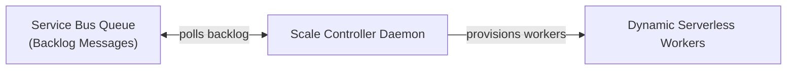
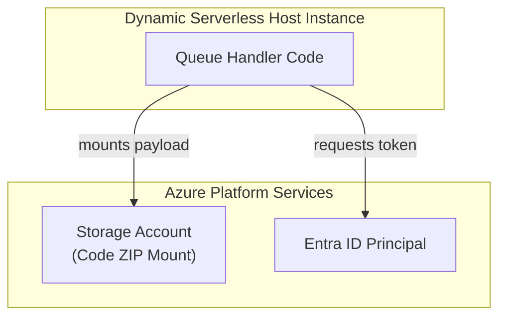

## Table of Contents

1. [What Is Functions](#what-is-functions)
2. [Serverless Event Handler Code Example](#serverless-event-handler-code-example)
3. [Events: Asynchronous Triggers](#events-asynchronous-triggers)
4. [Triggers: Declarative Routing](#triggers-declarative-routing)
5. [Invocations: Ephemeral Execution](#invocations-ephemeral-execution)
6. [Bindings: Eliminating Boilerplate](#bindings-eliminating-boilerplate)
7. [Timeout, Retries, and Poison Queues](#timeout-retries-and-poison-queues)
8. [Hosting Plans and Billable Compute](#hosting-plans-and-billable-compute)
9. [Function App: Configuration Boundaries](#function-app-configuration-boundaries)
10. [When A Service Is Simpler](#when-a-service-is-simpler)
11. [Putting It All Together](#putting-it-all-together)
12. [What's Next](#whats-next)

## What Is Functions

Azure Functions is Azure's event-handler runtime: you deploy a small code handler and configure what event should start it. It is an event-driven serverless compute service that executes isolated code handlers in response to platform events. Instead of keeping an HTTP listener active indefinitely, a function app remains idle until a configured trigger (such as a queue message, a database change, a blob upload, or a timer tick) invokes your code.

To implement a serverless function, you define its trigger, connection strings, and execution script. The following JavaScript code declares a function that is invoked when a new media asset is uploaded to a storage account, extracting metadata and writing the output:

```javascript
const { app } = require('@azure/functions');

app.storageBlob('process-video', {
  path: 'uploads/{name}',
  connection: 'AzureWebJobsStorage',
  handler: async (blob, context) => {
    context.log(`Processing blob: ${context.triggerMetadata.name}`);
    const metadata = await extractVideoMetadata(blob);
    return metadata;
  }
});
```

This compact, comment-free function registers directly with the Azure platform's background scale engines.

:::expand[Under the Hood: Scale Controller Polling and Cold-Starts]{kind="design"}
An event-driven function runtime runs on an elastic serverless fabric managed by a dedicated platform daemon called the Scale Controller. The Scale Controller runs independently of your application code, operating as a background observer of your event sources.

The Scale Controller operates via a monitoring loop, querying metric endpoints across your Azure resources. When a queue trigger is configured, it queries the queue depth and backlog. If the queue is empty, active compute workers stay at zero. When new messages arrive, the controller allocates VM worker instances, mounts your application payload, and starts the WebJobs SDK runtime.

When scaling from zero, the platform experiences cold-start latency. The exact steps depend on the hosting plan and deployment model, but the pattern is consistent: the platform allocates a worker, prepares the app package or container image, starts the Functions host, starts the language worker process such as Node.js, Python, or .NET, and then routes the event payload to your handler.
:::

If you run serverless functions on AWS, Azure Functions is the direct equivalent of AWS Lambda. Both execute isolated code blocks in response to platform triggers and support dynamic micro-billing scaling. However, they approach trigger-driven configurations differently. In AWS, triggers are attached externally through services such as API Gateway, EventBridge, or SQS, whereas Azure Functions utilizes the WebJobs SDK, compiling triggers and input/output data bindings directly into your handler's execution signature.

Every invocation is treated as an independent execution unit. The platform allocates resources, monitors execution duration, logs exceptions, and manages retries at the individual invocation level.

| Primitive Name | Functional Role inside Azure Functions |
| --- | --- |
| Event | A state change inside Azure or an external system (such as a new blob upload or database change) |
| Trigger | The configured rule that binds your code handler directly to a specific event source |
| Invocation | A single, isolated execution of your code handler triggered by a single event payload |
| Input Binding | A declarative data connection that fetches external data and injects it into your handler |
| Output Binding | A declarative data connection that automatically writes execution results to a downstream service |
| Function App | The logical hosting unit grouping related functions, environment settings, and managed identities |
| Hosting Plan | The infrastructure model (Flex Consumption, Consumption, Premium) defining limits and network integration |

## Events: Asynchronous Triggers

An event is a durable work notification that tells a handler something changed and work should run. In an asynchronous architecture, events are typically captured as payloads (like JSON messages) inside messaging systems, changes in database documents, or new files written to storage accounts.

Designing event-shaped workloads requires separating the physical transport of the event from your application's state management. An event should be designed as an immutable, self-contained record that contains all the metadata required to process the request. For example, a queue event indicating a new order checkout should contain the immutable order ID, customer identifier, and timestamp.

A critical systems constraint of event processing is that you must guarantee your application logic is idempotent. In distributed cloud systems, messaging platforms operate on an "at-least-once" delivery contract, meaning that network disruptions, worker recycles, or duplicate retries can cause the same event payload to be delivered to your function multiple times. If your receipt-sending function processes the same order message twice and does not check database state before sending, it will send duplicate emails to the customer. To prevent this, check an idempotency key (such as the order ID) against a fast storage cache or database index before executing any side effects.

## Triggers: Declarative Routing

A trigger is the runtime binding between one event source and one function handler. Each function must have exactly one trigger defined in its configuration. The trigger configuration dictates the format of the incoming event payload and specifies how the runtime intercepts the work.

| Target Workload | Correct Trigger | Systems Rationale |
| --- | --- | --- |
| Public Webhook Endpoint | HTTP Trigger | Receives a synchronous HTTP POST request, terminating TLS at the platform edge gateway. |
| Message Queue Worker | Queue Trigger | Pulls messages from an Azure Queue; utilizes exponential polling backoffs under empty state. |
| Service Bus Message | Service Bus Trigger | Integrates with Service Bus queues or topics; supports AMQP protocol streaming and peek-lock modes. |
| Nightly Data Purge | Timer Trigger | Uses a CRON schedule managed by the platform's background timer controller. |
| Blob File Processor | Blob Trigger | Monitors storage containers; Event Grid-based blob triggers are often preferred for high-scale or event-driven blob processing. |

The choice of trigger alters the failure path of your invocation. When an HTTP trigger fails, the runtime returns a failure response (such as `500 Internal Server Error`) to the client. When a queue trigger fails, the runtime releases the message lock, placing the message back on the queue to be retried by the WebJobs SDK. If the message fails repeatedly, the SDK automatically routes the payload to a designated poison or dead-letter queue (DLQ) after a configured number of retries, preventing a bad payload from blocking your active processing loop.

## Invocations: Ephemeral Execution

An invocation is one execution attempt of a function handler for one event payload. Invocations are designed to be ephemeral, isolated, and stateless. When the runtime executes your code, it injects the event payload and a context object containing a unique invocation ID, correlation tracing tokens, and logging hooks.

Because invocations are stateless, you must never store application state in local virtual machine memory. Worker instances can scale out dynamically, allocate your process to different physical host blades, or terminate active workers when idle. Storing a customer's shopping cart in a local in-memory array will result in data loss when subsequent requests route to different instances. All persistent state must reside in external, highly available databases or storage queues.

Furthermore, invocation monitoring is key to debugging. When an application exception occurs, the platform correlates all log entries, execution durations, memory spikes, and dependencies to that specific invocation ID. You can query these logs in Application Insights to reconstruct the exact execution trace of a failing transaction.

## Bindings: Eliminating Boilerplate

Bindings are declarative data connections that handle the boilerplate plumbing of reading from and writing to external resources. Instead of writing custom code to establish database connections, initialize clients, authenticate, and manage connection pools, you configure input and output bindings in your function's metadata.


*Triggers start the function, while bindings connect the handler to inputs and outputs without writing every plumbing call by hand.*

Input bindings automatically fetch data based on the incoming event payload and inject it directly as an argument into your code handler. For example, a queue trigger containing a customer ID can be paired with a Cosmos DB input binding that automatically queries the database and passes the customer document to your function. Output bindings work in reverse, automatically writing whatever object your function returns back to the configured storage, queue, or database.

While bindings simplify code, they do not bypass network or security boundaries. Under the hood, bindings compile into standard SDK clients that must still resolve DNS, complete TCP handshakes, negotiate TLS, authenticate using managed identities, and respect firewall rules. If a private virtual network blocks outbound ports to your database, the input binding will throw connection timeouts before your function's business logic ever executes.

## Timeout, Retries, and Poison Queues

Every serverless execution environment imposes runtime timeouts to protect the platform from runaway infinite loops or resource starvation. On the classic Consumption plan, Azure Functions uses a 5-minute default execution timeout and allows a maximum of 10 minutes. Other hosting plans, including Flex Consumption, Premium, and Dedicated, have different timeout behavior and scaling tradeoffs. If your function exceeds its configured or plan-supported limit, the host runtime stops the execution and releases the worker.


*Retries are useful only when the handler can safely receive the same event more than once.*

To prevent timeout failures, split long-running tasks into small, independent units of work that can execute concurrently. For example, instead of running a single function that processes a batch of 10,000 files, write a generator function that reads the batch and writes 10,000 individual messages to a queue. You can then write a queue-triggered function that processes one file per invocation, allowing the platform to scale out across dozens of workers to process the files concurrently.

Retry policies must be configured with equal care. You can define retry rules (such as fixed intervals or exponential backoff) at the function or queue trigger level. However, retrying a payment capture API or a stateful transaction without verifying transaction state can result in duplicate database entries. Ensure that retries are only applied to safe, idempotent operations, and route persistently failing messages to a dead-letter queue for manual audit.

:::expand[Retry-Triggered Duplicate Execution]{kind="pitfall"}
A severe serverless hazard is assuming that a Function runs exactly once. Under the hood, distributed messaging platforms operate on an **at-least-once delivery** contract. If your Function times out, crashes due to memory pressure, or experiences a network drop *after* executing an external API side-effect but *before* writing a success checkpoint to the queue, the message can become visible again and be processed a second time.

This matches the exact behavior of **AWS Lambda** when integrated with **Amazon SQS**. If a Lambda handler times out while calling an external API, SQS moves the message back to the active queue after the visibility timeout expires, triggering duplicate executions and downstream double-billing unless the handler enforces idempotency.

For critical side-effects like credit card charges or database increments, you must enforce this idempotency workflow sequence:

```plain
Event Received ──> Check state store for ID (Order_123)
                    ├── Found ──> Return success (Skip duplicate)
                    └── Not Found ──> Execute Charge ──> Write ID to state store (Atomic)
```

Analyze your trigger's retry characteristics to assess risk:

| Trigger Type | Default Retry / Delivery Behavior | Idempotency Requirement |
| :--- | :--- | :--- |
| **HTTP Trigger** | **None** (Client must retry on timeout/5xx) | **High** (Clients frequently retry when gateway times out) |
| **Service Bus Queue** | **At-Least-Once** (Retries based on Max Delivery Count) | **Critical** (Failure to checkpoint automatically triggers re-delivery) |
| **Event Hubs** | **At-Least-Once** (Retries based on checkpoint pointer) | **Critical** (Batch failures retry the entire partition block) |

**Rule of thumb:** Any Function that writes data, invokes external APIs, or triggers financial transactions must be built as an idempotent operation. Never rely on the cloud infrastructure to guarantee exactly-once delivery; always design your code to expect and handle duplicate events safely.
:::

## Hosting Plans and Billable Compute

A Functions hosting plan is the pricing and worker-capacity model for your handlers. It decides whether Azure starts workers only when events arrive, keeps workers warm, attaches them to a VNet, or runs them on a fixed App Service Plan.

Example: a receipt email handler that runs a few times per hour can use Consumption billing, while a payment webhook that must reach a private SQL endpoint with low cold-start latency may fit Flex Consumption or Premium.

To operate Azure Functions successfully in production, you must match your application's network and latency requirements to the correct hosting plan. Azure provides four main plans, each distributing compute allocation and network integration differently:

### 1. Classic Consumption Plan (Dynamic Serverless)

The Classic Consumption plan is the pay-per-execution option. Azure starts worker capacity when events arrive and scales it down when no work is waiting.

Example: a nightly CSV import function can wake up on a blob upload, process the file, and stop billing after the invocation finishes.

*   **Elastic Scaling**: The Scale Controller adds worker instances dynamically based on incoming event loads, scaling all the way down to zero when idle.
*   **Micro-Billing**: You pay strictly for execution duration (measured in Gigabyte-seconds) and the total number of invocations. If the function does not run, you pay absolutely zero.
*   **Limitations**: Exposes strict cold-start latency steps, caps execution durations at 10 minutes, and lacks native Virtual Network integration, meaning your functions cannot call databases protected by private endpoints.

### 2. Flex Consumption Plan (Modern Enterprise Standard)

The Flex Consumption plan is the newer serverless option for production workloads that still need private networking and tighter concurrency control. It keeps scale-to-zero economics while giving more control over how workers are placed and how many requests each worker handles.

Example: an order processor can scale from a Service Bus backlog while still reaching Azure SQL through a private subnet.

*   **Fast Scale Out**: Combines the elastic, scale-to-zero micro-billing model of the Consumption plan with faster container-based worker allocations.
*   **Virtual Network Subnet Injection**: Provides native, high-speed regional Virtual Network integration. Your function workers are injected directly into a private subnet, allowing secure database access without paying dedicated host premiums.
*   **Concurrency Controls**: Exposes manual settings to configure maximum concurrency per instance, letting you limit the number of parallel activations a single worker handles to prevent downstream database connection exhaustion.

### 3. Premium Plan (Elastic Warm Host)

The Premium plan keeps at least some worker capacity warm before events arrive. It is for handlers where waiting for a new worker to boot would hurt users or downstream systems.

Example: a fraud-check webhook can stay on a pre-warmed worker so payment authorization does not wait for a cold start.

*   **Pre-Warmed Instances**: The platform maintains at least one active, pre-warmed host VM running continuously, bypassing the packaging and worker boot latencies.
*   **Long-Running Tasks**: Increases the maximum execution timeout limit to 30 minutes, with support for unlimited durations on specific configurations.
*   **Continuous Charge**: Unlike Consumption plans, you pay a continuous hourly rate for the pre-warmed instances, regardless of whether any functions are actively running.

### 4. Dedicated Plan (App Service Isolation)

The Dedicated plan runs functions on an App Service Plan you already pay for by the hour. It is useful when predictable capacity matters more than automatic serverless scaling.

Example: an internal reporting function can share `asp-backoffice-prod` with a back-office Web App when both workloads have steady, known traffic.

*   **Resource Sharing**: Your functions share the physical VM worker instances of your ASP with other web applications, ensuring predictable costs.
*   **Predictable Billing**: You pay a flat, continuous rate for the App Service Plan capacity.
*   **No Serverless Scale**: The platform cannot scale out worker VM count dynamically beyond the ASP limits, trading serverless elasticity for total cost predictability.

## Function App: Configuration Boundaries

The Function App is the logical deployment and management container for your individual functions. All functions hosted within the same Function App share the same App Settings, connection strings, deployment zip package, runtime stack version, and system-assigned managed identity.





### Declaring Function Infrastructure with Bicep

Function infrastructure has three core Azure resources: a Function App, a hosting plan, and a storage account used by the runtime. To deploy a serverless Function App using Infrastructure as Code, you declare the hosting plan, storage account, and function container resources in Bicep. The storage account is a physical dependency required by the function runtime to manage state checkpoints, lease allocations, and keys.

```bicep
resource storageAccount 'Microsoft.Storage/storageAccounts@2022-09-01' = {
  name: 'stordersappprocessor'
  location: resourceGroup().location
  sku: {
    name: 'Standard_LRS'
  }
  kind: 'StorageV2'
  properties: {
    supportsHttpsTrafficOnly: true
    defaultToOAuthAuthentication: true
  }
}

resource hostingPlan 'Microsoft.Web/serverfarms@2022-03-01' = {
  name: 'plan-orders-serverless'
  location: resourceGroup().location
  sku: {
    name: 'Y1'
    tier: 'Dynamic'
  }
  properties: {}
}

resource functionApp 'Microsoft.Web/sites@2022-03-01' = {
  name: 'func-orders-processor'
  location: resourceGroup().location
  kind: 'functionapp'
  properties: {
    serverFarmId: hostingPlan.id
    siteConfig: {
      appSettings: [
        {
          name: 'AzureWebJobsStorage'
          value: 'DefaultEndpointsProtocol=https;AccountName=${storageAccount.name};AccountKey=${storageAccount.listKeys().keys[0].value};EndpointSuffix=${environment().suffixes.storage}'
        }
        {
          name: 'FUNCTIONS_EXTENSION_VERSION'
          value: '~4'
        }
        {
          name: 'FUNCTIONS_WORKER_RUNTIME'
          value: 'node'
        }
        {
          name: 'WEBSITE_NODE_DEFAULT_VERSION'
          value: '~18'
        }
      ]
    }
  }
}
```

This Bicep configuration provides a production-ready, comment-free setup demonstrating how these resources connect in the control plane.

Flex Consumption represents the modern production standard. It operates on a container-based serverless host that supports fast, elastic horizontal scaling based on event concurrency metrics. Crucially, Flex Consumption provides native virtual network integration, allowing your functions to access private backend databases securely without paying the premium costs of dedicated host environments.

Classic Consumption plans scale dynamically and can be cost-effective for simple event workloads, but they have stricter timeout and networking constraints than newer or dedicated options. Premium plans provide pre-warmed instances and virtual network integration, but they incur steady baseline costs. Dedicated plans run your function apps on standard App Service Plan virtual machines, which trades dynamic serverless scaling for predictable resource isolation.

## When A Service Is Simpler

Azure Functions is not a universal host for all backend code. Sometimes, a traditional web application hosted on App Service or Container Apps is structurally simpler and more performant.

If your service consists of a large, synchronous REST API with dozens of endpoints, shared routing middleware, global database connection pools, and steady traffic patterns, do not split it into dozens of separate HTTP-triggered functions. The overhead of cold starts, connection pooling management across serverless workers, and distributed trace logging will complicate operations. A continuous container or web app process keeps connection pools warm and provides predictable latency.

The warning signs of serverless architectural abuse include:
* Creating complex networks of functions that call other functions via synchronous HTTP requests, which creates cascading latency chains and increases call failure rates.
* Splitting a single cohesive domain service into tiny, scattered handlers that are difficult to debug, deploy, and version control.
* Running long-lived background loops that poll for work, which runs counter to the event-driven trigger contract.

Utilize Functions when you have a clear, isolated event trigger, a defined unit of work, and an execution pattern that benefits from elastic scaling to zero.

## Putting It All Together

Azure Functions shifts the compute paradigm to an event-triggered, FaaS model.

* **Scale Controller Daemon**: Background platform daemons continuously poll event metrics (like queue depths or message age) to coordinate compute allocations without running application code.
* **Flex Consumption Standard**: The Flex Consumption plan provides fast serverless scaling and native virtual network subnet injection, representing the standard for secure cloud-native serverless backends.
* **State and Cold Starts**: All functions must be stateless, and developers must design around at-least-once delivery duplicates (using idempotency keys) and cold-start physical latency steps.
* **Declarative Data Bindings**: Uses input and output bindings to secure database and storage connections without writing SDK boilerplate or connection string pool configurations.
* **Four Hosting Tiers**: Comprises Consumption, Flex Consumption, Premium, and Dedicated Plans, matching serverless elastic requirements to cost and network designs.

By structuring your applications as decoupled event handlers, you can build systems that scale instantly under load and cost zero when idle.

---

* [Azure Functions Documentation](https://learn.microsoft.com/en-us/azure/azure-functions/functions-overview) - Official guide to Azure serverless compute.
* [Flex Consumption Hosting Plan](https://learn.microsoft.com/en-us/azure/azure-functions/flex-consumption-how-it-works) - Systems details on the Flex Consumption runtime and scaling.
* [Triggers and Bindings Concepts](https://learn.microsoft.com/en-us/azure/azure-functions/functions-triggers-bindings) - Technical review of WebJobs SDK data bindings.
* [Idempotent Event Processing](https://learn.microsoft.com/en-us/azure/azure-functions/functions-idempotent) - Architecture guide on handling duplicate event deliveries safely.
