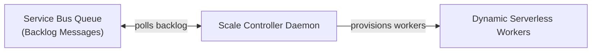
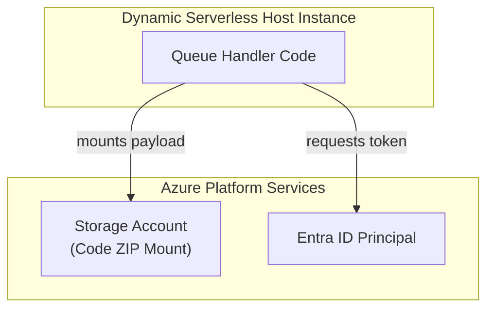

## Table of Contents

1. [What Is Functions](#what-is-functions)
2. [Events](#events)
3. [Triggers](#triggers)
4. [Invocations](#invocations)
5. [Bindings](#bindings)
6. [Timeout And Retries](#timeout-and-retries)
7. [Function App](#function-app)
8. [When A Service Is Simpler](#when-a-service-is-simpler)
9. [Putting It All Together](#putting-it-all-together)
10. [What's Next](#whats-next)

## What Is Functions

Azure Functions is an event-driven serverless compute service that executes isolated code handlers in response to platform events. Instead of keeping an HTTP listener active indefinitely, a function app remains idle until a configured trigger (such as a queue message, a database change, a blob upload, or a timer tick) invokes your code.

:::expand[Under the Hood: Scale Controller Polling and Cold-Starts]{kind="design"}
An event-driven function runtime runs on an elastic serverless fabric managed by a dedicated platform daemon called the Scale Controller. The Scale Controller runs independently of your application code, operating as a background observer of your event sources.

The Scale Controller operates via a monitoring loop, querying metric endpoints across your Azure resources. When a queue trigger is configured, it queries the queue depth and backlog. If the queue is empty, active compute workers stay at zero. When new messages arrive, the controller allocates VM worker instances, mounts your application payload, and starts the WebJobs SDK runtime.

When scaling from zero, the platform experiences a physical cold-start latency:
1. **Host Allocation**: The fabric provisions a dynamic VM container worker.
2. **ZIP Mount**: The function's compiled code package is fetched from Azure Storage and dynamically mounted as a read-only filesystem volume.
3. **Runtime & Language Worker Initialization**: The WebJobs host boots and spins up the language worker process (such as Node.js, Python, or .NET) to execute global configuration handlers before routing the event payload.
:::

If you run serverless functions on AWS, Azure Functions is the direct equivalent of AWS Lambda. Both execute isolated code blocks in response to platform triggers and support dynamic micro-billing scaling. However, they approach trigger-driven configurations differently. In AWS, triggers are cabled externally (using API Gateways, EventBridge rules, or SQS triggers cabled outside your code), whereas Azure Functions utilizes the WebJobs SDK, compiling triggers and input/output data bindings directly into your handler's execution signature.

Every invocation is treated as an independent execution unit. The platform allocates resources, monitors execution duration, logs exceptions, and manages retries at the individual invocation level.

| Primitive Name | Functional Role inside Azure Functions |
| --- | --- |
| Event | A state change inside Azure or an external system (such as a new blob upload or database change) |
| Trigger | The configured rule that binds your code handler directly to a specific event source |
| Invocation | A single, isolated execution of your code handler triggered by a single event payload |
| Input Binding | A declarative data connection that fetches external data and injects it into your handler |
| Output Binding | A declarative data connection that automatically writes execution results to a downstream service |
| Function App | The logical hosting unit grouping related functions, environment settings, and managed identities |
| Hosting Plan | The infrastructure model (Flex Consumption, Consumption, Premium) defining limits and network integration |

## Events

An event represents a physical state change in your system that indicates work needs to be performed. In an asynchronous architecture, events are typically captured as durable payloads (like JSON messages) inside messaging systems, changes in database documents, or new files written to storage accounts.

Designing event-shaped workloads requires separating the physical transport of the event from your application's state management. An event should be designed as an immutable, self-contained record that contains all the metadata required to process the request. For example, a queue event indicating a new order checkout should contain the immutable order ID, customer identifier, and timestamp.

A critical systems constraint of event processing is that you must guarantee your application logic is idempotent. In distributed cloud systems, messaging platforms operate on an "at-least-once" delivery contract, meaning that network disruptions, worker recycles, or duplicate retries can cause the same event payload to be delivered to your function multiple times. If your receipt-sending function processes the same order message twice and does not check database state before sending, it will send duplicate emails to the customer. To prevent this, check an idempotency key (such as the order ID) against a fast storage cache or database index before executing any side effects.

## Triggers

A trigger is the declarative gateway that connects your function code to the event source. Each function must have exactly one trigger defined in its configuration. The trigger configuration dictates the format of the incoming event payload and specifies how the runtime intercepts the work.

| Target Workload | Correct Trigger | Systems Rationale |
| --- | --- | --- |
| Public Webhook Endpoint | HTTP Trigger | Receives a synchronous HTTP POST request, terminating TLS at the platform edge gateway. |
| Message Queue Worker | Queue Trigger | Pulls messages from an Azure Queue; utilizes exponential polling backoffs under empty state. |
| Service Bus Message | Service Bus Trigger | Integrates with Service Bus queues or topics; supports AMQP protocol streaming and peek-lock modes. |
| Nightly Data Purge | Timer Trigger | Uses a CRON schedule managed by the platform's background timer controller. |
| Blob File Processor | Blob Trigger | Monitors storage containers; uses Event Grid routing under high-volume workloads to prevent missed files. |

The choice of trigger alters the failure path of your invocation. When an HTTP trigger fails, the runtime returns a failure response (such as `500 Internal Server Error`) to the client. When a queue trigger fails, the runtime releases the message lock, placing the message back on the queue to be retried by the WebJobs SDK. If the message fails repeatedly, the SDK automatically routes the payload to a designated poison or dead-letter queue (DLQ) after a configured number of retries, preventing a bad payload from blocking your active processing loop.

## Invocations

An invocation represents a single execution run of your function handler. Invocations are designed to be ephemeral, isolated, and stateless. When the runtime executes your code, it injects the event payload and a context object containing a unique invocation ID, correlation tracing tokens, and logging hooks.

Because invocations are stateless, you must never store application state in local virtual machine memory. Worker instances can scale out dynamically, allocate your process to different physical host blades, or terminate active workers when idle. Storing a customer's shopping cart in a local in-memory array will result in data loss when subsequent requests route to different instances. All persistent state must reside in external, highly available databases or storage queues.

Furthermore, invocation monitoring is key to debugging. When an application exception occurs, the platform correlates all log entries, execution durations, memory spikes, and dependencies to that specific invocation ID. You can query these logs in Application Insights to reconstruct the exact execution trace of a failing transaction.

## Bindings

Bindings are declarative data connections that handle the boilerplate plumbing of reading from and writing to external resources. Instead of writing custom code to establish database connections, initialize clients, authenticate, and manage connection pools, you configure input and output bindings in your function's metadata.

Input bindings automatically fetch data based on the incoming event payload and inject it directly as an argument into your code handler. For example, a queue trigger containing a customer ID can be paired with a Cosmos DB input binding that automatically queries the database and passes the customer document to your function. Output bindings work in reverse, automatically writing whatever object your function returns back to the configured storage, queue, or database.

While bindings simplify code, they do not bypass network or security boundaries. Under the hood, bindings compile into standard SDK clients that must still resolve DNS, complete TCP handshakes, negotiate TLS, authenticate using managed identities, and respect firewall rules. If a private virtual network blocks outbound ports to your database, the input binding will throw connection timeouts before your function's business logic ever executes.

## Timeout And Retries

Every serverless execution environment imposes strict runtime timeouts to protect the platform from runaway infinite loops or resource starvation. When you deploy a function to a Consumption plan, the platform sets a default execution timeout of 5 minutes, with a maximum limit of 10 minutes. If your function exceeds this limit, the host runtime kills the execution process, throwing a timeout exception and releasing the worker.

To prevent timeout failures, split long-running tasks into small, independent units of work that can execute concurrently. For example, instead of running a single function that processes a batch of 10,000 files, write a generator function that reads the batch and writes 10,000 individual messages to a queue. You can then write a queue-triggered function that processes one file per invocation, allowing the platform to scale out across dozens of workers to process the files concurrently.

Retry policies must be configured with equal care. You can define retry rules (such as fixed intervals or exponential backoff) at the function or queue trigger level. However, retrying a payment capture API or a stateful transaction without verifying transaction state can result in duplicate database entries. Ensure that retries are only applied to safe, idempotent operations, and route persistently failing messages to a dead-letter queue for manual audit.

## Function App

The Function App is the logical deployment and management container for your individual functions. All functions hosted within the same Function App share the same App Settings, connection strings, deployment zip package, runtime stack version, and system-assigned managed identity.

The choice of hosting plan determines the scale, network integration, and cost structure of your Function App.

Flex Consumption represents the modern production standard. It operates on a container-based serverless host that supports fast, elastic horizontal scaling based on event concurrency metrics. Crucially, Flex Consumption provides native virtual network integration, allowing your functions to access private backend databases securely without paying the premium costs of dedicated host environments.

Standard Consumption plans scale dynamically but suffer from cold starts and lack virtual network integration. Premium plans provide pre-warmed instances to eliminate cold starts and support VNet injection, but they incur steady baseline costs. Dedicated plans run your function apps on standard App Service Plan virtual machines, which disables dynamic serverless scaling but provides predictable resource isolation.

## When A Service Is Simpler

Azure Functions is not a universal host for all backend code. Sometimes, a traditional web application hosted on App Service or Container Apps is structurally simpler and more performant.

If your service consists of a large, synchronous REST API with dozens of endpoints, shared routing middleware, global database connection pools, and steady traffic patterns, do not split it into dozens of separate HTTP-triggered functions. The overhead of cold starts, connection pooling management across serverless workers, and distributed trace logging will complicate operations. A continuous container or web app process keeps connection pools warm and provides predictable latency.

The warning signs of serverless architectural abuse include:
* Creating complex networks of functions that call other functions via synchronous HTTP requests, which creates cascading latency chains and increases call failure rates.
* Splitting a single cohesive domain service into tiny, scattered handlers that are difficult to debug, deploy, and version control.
* Running long-lived background loops that poll for work, which runs counter to the event-driven trigger contract.

Utilize Functions when you have a clear, isolated event trigger, a defined unit of work, and an execution pattern that benefits from elastic scaling to zero.

## Putting It All Together

Azure Functions shifts the compute paradigm to an event-triggered, FaaS model.

* **Scale Controller Daemon**: Background platform daemons continuously poll event metrics (like queue depths or message age) to coordinate compute allocations without running application code.
* **Flex Consumption Standard**: The Flex Consumption plan provides fast serverless scaling and native virtual network subnet injection, representing the standard for secure cloud-native serverless backends.
* **State and Cold Starts**: All functions must be stateless, and developers must design around at-least-once delivery duplicates (using idempotency keys) and cold-start physical latency steps.

By structuring your applications as decoupled event handlers, you can build systems that scale instantly under load and cost zero when idle.

## What's Next

In the next chapter, we will look at Azure Virtual Machines. We will go down the compute abstraction ladder to analyze type 1 hypervisor scheduling, CPU core pinning, guest memory EPT page tables, managed disk network packet conversions, and local SSD ephemeral storage.

---

**References**

- [Azure Functions Documentation](https://learn.microsoft.com/en-us/azure/azure-functions/functions-overview) - Official guide to Azure serverless compute.
- [Flex Consumption Hosting Plan](https://learn.microsoft.com/en-us/azure/azure-functions/flex-consumption-how-it-works) - Systems details on the Flex Consumption runtime and scaling.
- [Triggers and Bindings Concepts](https://learn.microsoft.com/en-us/azure/azure-functions/functions-triggers-bindings) - Technical review of WebJobs SDK data bindings.
- [Idempotent Event Processing](https://learn.microsoft.com/en-us/azure/azure-functions/functions-idempotent) - Architecture guide on handling duplicate event deliveries safely.
