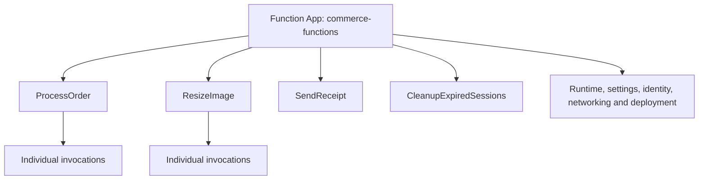
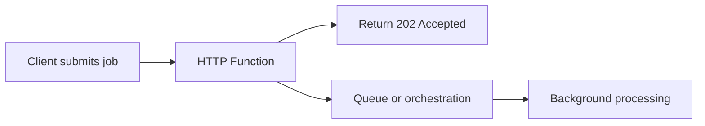
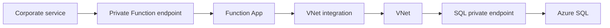
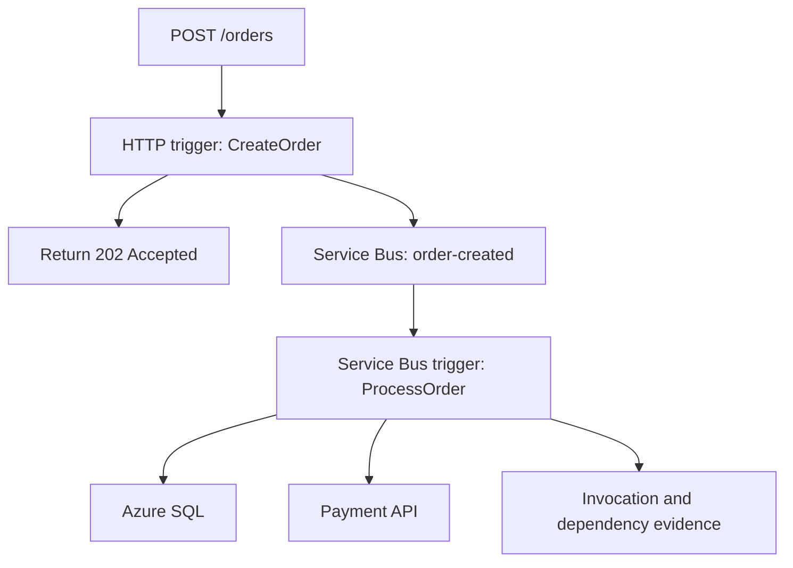

## Table of Contents

1. [What Work Fits Azure Functions?](#what-work-fits-azure-functions)
2. [How Do Events, Triggers, and Invocations Work?](#how-do-events-triggers-and-invocations-work)
3. [What Is a Function App?](#what-is-a-function-app)
4. [How Do Bindings Connect Services?](#how-do-bindings-connect-services)
5. [How Do Timeouts, Retries, and Idempotency Shape Behavior?](#how-do-timeouts-retries-and-idempotency-shape-behavior)
6. [How Do Hosting Plans Affect Execution?](#how-do-hosting-plans-affect-execution)
7. [How Should Identity, Secrets, and Storage Work?](#how-should-identity-secrets-and-storage-work)
8. [How Do You Operate Functions and Decide When Another Service Is Simpler?](#how-do-you-operate-functions-and-decide-when-another-service-is-simpler)
9. [Check Your Answers](#check-your-answers)

A customer uploads an image, and the application needs to save a thumbnail. You could keep a worker process running all day to watch for uploads. But if images arrive only occasionally, the requirement is easier to describe as a reaction: when an image arrives, resize it and save the result.

Azure Functions provides that event-oriented way to run code. You identify the event and write the handler that should execute. Azure supplies the execution environment and connects the event to an invocation of the handler. Servers still perform the work underneath, but events and executions are the main objects you work with.

The image-processing example gives us a starting point. The following questions explain the platform around it and what happens when execution takes time, fails, or needs more capacity:

1. **What Work Fits Azure Functions?**
2. **How Do Events, Triggers, and Invocations Work?**
3. **What Is a Function App?**
4. **How Do Bindings Connect Services?**
5. **How Do Timeouts, Retries, and Idempotency Shape Behavior?**
6. **How Do Hosting Plans Affect Execution?**
7. **How Should Identity, Secrets, and Storage Work?**
8. **How Do You Operate Functions and Decide When Another Service Is Simpler?**

## What Work Fits Azure Functions?
<!-- section-summary: Functions expresses work as a response to an event, while Azure supplies the host and execution capacity needed to run the handler. -->

A conventional service starts a process, keeps it running, waits for work, handles a request, and waits again. Functions starts from a different question: what should happen after a particular event? The resulting model follows an event through a trigger into one invocation of your handler, which produces a result or side effect.


```mermaid
flowchart LR
    A[Image uploaded to Blob Storage] --> B[Blob trigger]
    B --> C[ResizeImage invocation]
    C --> D[Handler resizes image]
    D --> E[Thumbnail saved]
```

This is still compute. A definition such as `resize_image` cannot do work while it is just source code in a repository:

```python
def resize_image(image):
    ...
```

Eventually a physical CPU executes instructions through an operating system, the Functions host, and a language worker or runtime. The **language worker** is the part of the execution arrangement that runs code in the function's language. Azure's service manages the connection between the incoming event and that execution machinery.

The [Functions overview](https://learn.microsoft.com/en-us/azure/azure-functions/functions-overview) describes the service as event-driven serverless compute. In Microsoft's hosting guidance, Flex Consumption is the recommended serverless starting point for new Function Apps. Hosting plans will receive their own comparison later, because the programming model alone does not determine startup latency, networking, or how capacity is supplied.

### Describe the work before choosing the platform

Functions is a natural option when the requirement names a clear event and a piece of work caused by it. Validate an order when it arrives. Scan a file after upload. Generate a report at 02:00. Perform a small API operation after an HTTP request. Transform incoming telemetry. Propagate an update after a customer account changes.

Each example identifies why computation should start. The useful question is how closely that execution pattern matches the application. An event and a reasonably bounded operation give Functions a clear job to manage. “Bounded” means the handler has an identifiable piece of work and completion condition; it does not mean every valid function must finish within a few milliseconds.

An image upload illustrates the benefit clearly. A continuously running service could observe storage and produce thumbnails, but the business requirement does not inherently require the team to operate a permanent polling process. Functions lets the code and configuration express the upload-to-thumbnail reaction more directly.

### HTTP requests are events too

Functions can build HTTP APIs. A request such as `GET /customer/123` can reach an HTTP trigger, start a `GetCustomer` invocation, and produce an HTTP response. Event-driven therefore does not mean background-only.

App Service and Functions can both handle HTTP. Their difference lies in the application interface: App Service hosts a web application as a continuing service, while Functions invokes handlers in response to individual events and requests. Choose according to the application's shape, not merely according to whether it uses HTTP.

A large ASP.NET application with hundreds of routes, substantial startup state, complex middleware, a long-lived application lifecycle, and continuous background work may fit App Service more directly. Splitting it into functions solely because the platform exists can introduce additional work without simplifying its actual requirements.

This comparison places Functions among Azure's other compute abstractions. A VM gives you a machine environment. App Service runs a web application. Container Apps runs and scales a containerized application. Functions executes a handler after an event. AKS supplies Kubernetes orchestration. They all execute code, but each asks you to describe that code's operating needs differently.

## How Do Events, Triggers, and Invocations Work?
<!-- section-summary: An event is an occurrence, one trigger connects it to a function, an invocation is one execution, and the handler contains the application work performed during that execution. -->

An **event** is an occurrence that should cause computation. It might be an HTTP request arriving, a queue message becoming available, a blob being created, the clock reaching 02:00, Event Hubs receiving telemetry, or Cosmos DB data changing. The event exists outside your handler; the Functions platform connects that occurrence to your code.

A **trigger** defines how a function is invoked. Every function has exactly one trigger. The trigger can also supply input data, so it describes both the reason execution starts and some of the information available to that execution. The [trigger and binding documentation](https://learn.microsoft.com/en-us/azure/azure-functions/functions-triggers-bindings) establishes this model.

| Occurrence | Trigger's role | Work that follows |
|---|---|---|
| HTTP request arrives | Connect the request to the function | Execute the request handler |
| Queue message is available | Connect queued work to the function | Process the message |
| The scheduled time reaches 02:00 | Start scheduled execution | Generate the report |
| Event Hubs receives a message | Connect event-stream data to the function | Process telemetry |
| A blob is created | Connect the storage occurrence to the function | Resize the uploaded image |

The trigger is an adapter between the event source and the handler. It does not contain the application's business decision merely because it starts that decision. Image resizing, order validation, or payment processing still belongs in the code called by the runtime.

### One definition can have many executions

Suppose `ProcessOrder` receives ten order messages. There is one logical function definition and multiple executions of that definition. Invocation A might process order 1001, invocation B order 1002, and invocation C order 1003.

An **invocation** is one specific execution of the handler. This is similar to distinguishing a Container App from a replica: the logical object and a particular running occurrence are different things. The distinction matters when an operator asks which execution failed or whether the same input was attempted again.

The **handler** is the business code the runtime calls. A simplified order handler might look like this:

```python
def process_order(message):
    order = parse(message)
    charge_customer(order)
    save_order(order)
```

This sketch names the work rather than provide a complete application. The Functions platform detects the event, constructs the invocation, supplies data, calls the handler, and observes success or failure. Your code decides how to parse the message, what business operation to perform, and which result to save.

That boundary removes much of the manual work of continuously polling infrastructure and coordinating worker processes. It does not remove the need to reason about the handler's effects. If the process fails after `charge_customer` but before `save_order`, the platform may know only that the attempt did not finish successfully. We will examine that failure boundary when discussing retries.

### Keep the terms connected

The event explains what happened. The trigger explains why this function starts. The invocation identifies one execution. The handler contains what the application does during that execution. Separating those meanings helps during both design and diagnosis: an event might exist without being observed by a trigger, or an invocation might start and fail inside its handler.

These executions also need a shared home for deployment and runtime configuration. Azure groups function definitions into a Function App rather than requiring each handler to exist as a completely unrelated hosting resource.

## What Is a Function App?
<!-- section-summary: A Function App groups handlers into a deployment and configuration boundary; its Functions host coordinates runtime behavior, while host.json configures that host rather than only business settings. -->

A **Function App** contains one or more functions and provides their management, deployment, and hosting boundary. For example, `commerce-functions` could contain `ProcessOrder`, `ResizeImage`, `SendReceipt`, and `CleanupExpiredSessions`.


```mermaid
flowchart TD
    A[Function App: commerce-functions] --> B[ProcessOrder]
    A --> C[ResizeImage]
    A --> D[SendReceipt]
    A --> E[CleanupExpiredSessions]
    A --> F[Runtime, settings, identity, networking and deployment]
    B --> G[Individual invocations]
    C --> H[Individual invocations]
```

The [Function App creation guide](https://learn.microsoft.com/en-us/azure/azure-functions/functions-create-function-app-portal) describes the app as a logical unit for managing, deploying, scaling, and sharing resources among functions. The Function App carries runtime version, application settings, identity, networking, deployment, monitoring configuration, and host-level configuration.

One function is therefore a handler definition, while a Function App is the surrounding application resource. The distinction is useful when a setting affects several functions at once. Editing the shared hosting arrangement is a broader operation than changing the code of one handler.

The hierarchy runs from the Azure Functions platform to Function Apps, then function definitions, then individual invocations. Later, Flex Consumption will add an important qualification: the shared management boundary does not force every function to scale with exactly the same demand pattern.

### The Functions host coordinates execution

Between the trigger extension and your language worker sits the **Functions host**. It coordinates triggers, bindings, logging, concurrency, and invocation management. Concurrency describes how much work can execute at the same time. The host organizes that runtime behavior rather than supplying the order-processing or image-resizing logic itself.

This explains the purpose of `host.json`. It configures host behavior across the Function App, including logging and various trigger and binding settings. It should be understood separately from business configuration such as a payment API URL. Both are configuration, but they influence different parts of the running application.

The [host.json reference](https://learn.microsoft.com/en-us/azure/azure-functions/functions-host-json) documents the available host settings. At this stage, the key relationship is enough: trigger extensions connect events and services to the host; the host coordinates execution; the language runtime executes the handler.

The same host also supports bindings, which can reduce the client-connection plumbing your handler needs to contain. Understanding that arrangement makes bindings easier to evaluate without assuming they bypass ordinary service behavior.

## How Do Bindings Connect Services?
<!-- section-summary: Bindings declare data connections around a handler; extensions perform the service plumbing, and direct SDK calls remain appropriate when the handler needs more control. -->

Suppose an HTTP-triggered function receives an order and needs to write a queue message. Without an output binding, application code may construct a queue client, authenticate, connect to Storage, serialize a message, and send it. Those steps are necessary service integration work, even though they are separate from validating the order.

A **binding** declares a connection between a function and another resource. An input binding supplies additional data to the handler; an output binding writes data to a destination. Bindings are optional. The trigger can also be understood as a special input binding because it both starts execution and supplies event data.

| Connection | Question it answers |
|---|---|
| Trigger | Why does execution begin? |
| Input binding | What additional data should execution receive? |
| Output binding | Where should execution write its output? |

For the HTTP-to-queue example, the HTTP trigger starts the function and an output binding sends data to Storage Queue. The handler can focus on the application decision while the runtime and extension supply some of the client plumbing. The [bindings guide](https://learn.microsoft.com/en-us/azure/azure-functions/functions-triggers-bindings) defines these declarative connections.

### The service interaction still happens

A Service Bus output binding still needs software to authenticate, connect, serialize the message, send it, and handle the service protocol. The binding extension performs those steps on the application's behalf. It is a managed adapter, not a removal of the underlying operation.

This distinction prevents a common misunderstanding: shorter handler code does not imply that there is no dependency call or failure boundary. The binding's destination remains another service. Its behavior still matters to whether the function achieves its intended result.

Using a service's normal SDK directly from the handler is also valid. An SDK is a client library that exposes the service API to application code. When a function needs complex control over a downstream API, explicit client calls may express that work more clearly than a binding.

The choice is therefore about how much integration behavior should be declared to the runtime and how much should remain explicit in the handler. A simple output operation can be concise with a binding. A more involved interaction may benefit from direct SDK control. Both approaches sit inside the same event, trigger, invocation, and handler model.

Once the handler performs external operations, duration and failure become part of correctness. A successful call followed by a failed invocation can cause the same work to be attempted again, so the next section connects time limits to retries and safe repeated execution.

## How Do Timeouts, Retries, and Idempotency Shape Behavior?
<!-- section-summary: Execution timeouts and HTTP response limits are separate; retry behavior depends on the trigger, and repeated attempts need safe side effects plus a destination for permanently failing work. -->

An event-oriented handler often performs work and then completes, but “short” is not a universal definition of a function. The hosting plan determines available execution duration. Flex Consumption and Premium default to a 30-minute function timeout and permit an effectively unbounded configured duration. The legacy Consumption plan defaults to five minutes and has a ten-minute maximum.

“Unbounded” in configuration does not promise that a single process will execute forever. Scale-in and platform updates still have lifecycle and grace-period behavior. A duration setting therefore needs to be interpreted alongside the hosting platform's lifecycle, rather than as a guarantee for arbitrary multi-hour synchronous work. The [Azure service limits reference](https://learn.microsoft.com/en-us/azure/azure-resource-manager/management/azure-subscription-service-limits) and [Functions hosting comparison](https://learn.microsoft.com/en-us/azure/azure-functions/functions-scale) provide the related plan details.

### HTTP waiting time is a different limit

An HTTP-triggered execution can have a longer allowed runtime than the HTTP caller's response window. The standard Azure load-balancing path has an approximately 230-second maximum response window for an HTTP-triggered function. Increasing a function's timeout does not make a normal HTTP connection wait indefinitely.

For work expected to take 45 minutes, asking a client to keep one synchronous request open is a poor fit. An asynchronous design can accept the request, return `202 Accepted`, and continue the work through a queue or orchestration. Durable Functions is another option for organizing longer-running work.


```mermaid
flowchart LR
    A[Client submits job] --> B[HTTP Function]
    B --> C[Return 202 Accepted]
    B --> D[Queue or orchestration]
    D --> E[Background processing]
```

The HTTP response acknowledges acceptance rather than claiming that all downstream work has already finished. This separates the caller's connection lifetime from the job's processing lifetime and avoids making a long-running job depend on one open request.

### A failed attempt can follow a successful side effect

Return to the handler that charges a customer and then writes a database record. If the process crashes after the charge but before the work is acknowledged as successfully handled, the event system may deliver the work again. Another invocation may therefore run code whose first attempt already produced an external effect.

This is a fundamental distributed-systems boundary. One execution attempt is not an end-to-end guarantee of exactly one business effect. A retry may be necessary to recover from incomplete work, but repeating the handler blindly can repeat an operation that already succeeded elsewhere.

There are two broad sources of retries in Functions: behavior built into trigger or binding extensions, and Functions-runtime retry policies for supported triggers. Their configuration and ownership depend on the trigger. The [error and retry guidance](https://learn.microsoft.com/en-us/azure/azure-functions/functions-bindings-error-pages) explains those different paths.

Do not apply a universal rule such as “Functions retries five times.” Ask which trigger and extension are involved, which component owns retry behavior, and what happens after retry attempts are exhausted. A failed invocation followed by a delay and another invocation is the general shape; the exact policy is service-specific.

### Make repeated execution safe

Suppose `ProcessOrder(orderId=82731)` runs twice. If each invocation charges £50 without checking the existing business result, the customer is charged £100 for work intended to charge £50. Retry behavior has now changed the business outcome.

**Idempotency** means repeating an operation preserves its intended final effect. Conceptually, if order 82731 has already been processed, the handler returns the existing result or performs no additional charge; otherwise it carries out the work. The crucial requirement is safe repetition of the business operation, not merely a check that a function resource exists.

```text
Order: 82731
Intended charge: £50
First attempt: process the order
Repeated attempt: preserve the existing intended result
```

This is a behavioral model, not a complete implementation of a payment transaction. It identifies the property that the end-to-end design must provide. Assume duplicate execution is possible unless the whole system explicitly guarantees otherwise. An individual handler being invoked once on one attempt does not prove that the event cannot return later.

### Isolate work that cannot succeed through retry

A malformed message, such as a malformed message numbered 123, may fail on every attempt. Infinite retrying would consume capacity without correcting the input. Messaging systems commonly provide a poison or dead-letter destination where repeatedly failing work can be isolated for inspection.

A transient dependency failure may succeed on a later attempt. Permanently invalid work needs a different response. Retry policies and the failed-work destination help keep those cases distinct. Storage Queues and Service Bus have different mechanisms, so the operator needs the behavior of the actual trigger and service in use.

This failure model connects directly to capacity. More execution instances can process more events, including retries. The hosting plan determines how those instances appear, warm up, and scale, which makes it the next part of the Functions model.

## How Do Hosting Plans Affect Execution?
<!-- section-summary: The plan supplies and bills execution capacity; Flex Consumption adds per-function scaling with grouped trigger categories, while warm-capacity, dedicated, and container-hosted options address different requirements. -->

A **hosting plan** determines how compute instances are provisioned, kept ready, scaled, and billed. The handler's programming model can stay the same while the capacity model changes. That is why saying “this uses Functions” does not by itself explain cost, startup delay, or networking capabilities.

### Event demand drives capacity

Imagine a queue with zero messages, followed by a burst of 10,000 messages. A scaling system can observe backlog, estimate required processing capacity, add execution instances, run more invocations concurrently, and remove capacity as the backlog falls.

The operational question is how quickly events can be processed. Underneath that question, instances still exist. Each execution environment contains a Functions host, language runtime, and function code. Depending on workload and configuration, one instance may execute several invocations concurrently. More capacity can mean adding instances B and C alongside instance A.

Serverless means that the team generally does not manually provision and name each of those servers. It does not remove CPU, memory, or execution instances from the system. Azure manages more of the instance allocation in response to the workload and the selected plan.

### Understand cold starts

If an app has been idle with no active on-demand capacity, the next event may have to wait while Azure allocates or wakes an execution environment, starts the host, starts the language worker, loads application code, and initializes dependencies. That startup delay is a **cold start**.

The tradeoff is between avoiding idle capacity and keeping capacity ready before work arrives. Flex Consumption's always-ready instances keep some provisioned capacity available to reduce cold-start latency. They change the capacity and cost choice while preserving the event-driven programming model.

### Flex Consumption and scaling groups

**Flex Consumption** is the modern serverless starting point. It is Linux-based and includes pay-as-you-go execution, fast horizontal scaling, configurable instance memory, VNet integration, per-function scaling, and always-ready instances. The [Flex Consumption guide](https://learn.microsoft.com/en-us/azure/azure-functions/flex-consumption-plan) describes those capabilities.

Per-function scaling matters when one Function App contains handlers with very different demand. An HTTP function may need roughly ten instances' worth of capacity while a queue worker needs fifty and a timer has little work. The management and deployment boundary can remain shared while execution capacity responds more specifically to the busy work.

That scaling is not completely independent for every trigger. Flex Consumption uses defined grouping for categories including HTTP, Blob, and Durable Functions. Most functions can have per-function scaling decisions, but functions within those groups follow their group behavior. The distinction prevents the misleading assumption that every handler in the app always scales on its own.

### Compare the hosting choices

The principal hosting choices in August 2026 are:

| Hosting option | Capacity model | Reason to consider it |
|---|---|---|
| Flex Consumption | Event-driven serverless capacity with configurable and always-ready options | Starting point for most new serverless Function Apps |
| Premium | Elastic execution with warm capacity | Strong startup-latency sensitivity or sustained capacity needs |
| Dedicated App Service plan | Explicitly provisioned App Service workers | Existing spare capacity or dedicated hosting characteristics |
| Container Apps | Functions runtime packaged in a container environment | Custom image requirements or proximity to containerized microservices |
| Consumption | Older dynamic serverless model | Existing applications or particular Windows requirements |

The [Functions overview](https://learn.microsoft.com/en-us/azure/azure-functions/functions-overview) distinguishes the recommended Flex Consumption choice from the older Consumption model. The table is a capacity map; the actual workload still needs its runtime and feature requirements checked against the selected option.

**Premium** moves further toward continuously available compute. Ready or prewarmed capacity reduces startup delay, with elastic expansion as work increases. This can fit continuous workloads, predictable low startup latency, larger execution or resource requirements, and VNet connectivity while retaining Functions handlers and triggers.

A **Dedicated App Service plan** runs the Function App on provisioned App Service workers. It can use existing underused capacity or satisfy a requirement for that hosting and cost arrangement. Execution remains trigger, invocation, and handler; the infrastructure is no longer described solely as capacity that appears when events arrive.

**Functions on Container Apps** combines the Functions programming model, a custom container, and a Container Apps environment. This is useful when greater control over the image and runtime is required, or when functions should coexist closely with containerized services. Functions therefore describes an execution model that can use more than one underlying hosting topology.

The plan provides capacity, but the running app also needs access to services, secrets, and host state. Those dependencies remain important even when the infrastructure is managed.

## How Should Identity, Secrets, and Storage Work?
<!-- section-summary: A Function App needs its own workload identity and permissions, protected runtime secrets when necessary, separate awareness of host storage, and distinct inbound and outbound network paths. -->

If a function needs Azure SQL, it needs a way to authenticate. A supported managed-identity arrangement lets the Function App use its own identity through Microsoft Entra ID instead of carrying a static connection credential in application code.

A **managed identity** answers who the workload is when it contacts another Azure service. It is different from the identity of the human developer or operator. The workload's request is evaluated using its own authority, so a human having access does not by itself grant the same access to the running function.

The [Functions architecture guidance](https://learn.microsoft.com/en-us/azure/well-architected/service-guides/azure-functions) recommends managed identities to avoid storing and rotating credentials where supported. Permissions still have to allow the application's required operation. Identity supplies a principal; access rules determine what that principal may do.

### Use runtime secrets only where needed

Some dependencies do not support Entra authentication. A third-party service may still require `THIRD_PARTY_API_KEY`. In that case, keep the value in runtime configuration through an appropriate secret reference rather than hardcoding it in source or packaging it into a deployment artifact.

Key Vault provides a place to manage required production secrets when managed identity cannot eliminate them. Use managed identity where possible, a Key Vault-managed secret when necessary, and avoid embedded credentials. The application code should express the operation it needs, while the runtime supplies the appropriate credential arrangement.

### Host storage and business storage serve different purposes

`AzureWebJobsStorage` can appear even when the handler's business work has nothing to do with Blob Storage. The Functions runtime uses an Azure Storage account for host operations such as trigger coordination and runtime metadata. This is infrastructure state needed by the execution platform.

For example, an invoice-processing function may use host storage through `AzureWebJobsStorage` and separately use `invoice-storage` for the business documents it processes. Those are logically different concerns. The Functions host needs coordination state; the application needs durable invoice content.

Keeping the distinction explicit makes permissions, performance, diagnostics, and lifecycle decisions clearer. A function that never calls a blob API in its own code can still depend on storage through the host. The [Functions best-practices guidance](https://learn.microsoft.com/en-us/azure/azure-functions/functions-best-practices) explains this platform dependency.

### Networking has two directions

For an HTTP Function App, **inbound access** asks who can invoke it. **Outbound access** asks which dependencies the app can reach. These directions require separate reasoning even when both involve private networking.

Modern options such as Flex Consumption support VNet integration for outbound access to private resources. Private endpoints can provide private inbound access where supported. The older Consumption model has substantially more limited private-networking capabilities. The [networking options guide](https://learn.microsoft.com/en-us/azure/azure-functions/functions-networking-options) compares the supported arrangements.


```mermaid
flowchart LR
    A[Corporate service] --> B[Private Function endpoint]
    B --> C[Function App]
    C --> D[VNet integration]
    D --> E[VNet]
    E --> F[SQL private endpoint]
    F --> G[Azure SQL]
```

The example separates the private path into the function from the path the function uses to reach SQL. DNS must resolve the intended name, routing must provide a path, firewalls must allow the connection, and identity must authorize the operation. A serverless label does not remove any of those requirements.

Once the app has execution capacity and its dependencies are reachable, monitoring must show what happened to the actual events. Resource existence alone cannot establish that an order or upload was processed successfully.

## How Do You Operate Functions and Decide When Another Service Is Simpler?
<!-- section-summary: Follow each event into an invocation and its dependencies, distinguish waiting time from execution time, and keep a normal service when long-lived behavior fits the workload more naturally. -->

For a VM, a first check might ask whether the server is alive. In Functions, the more useful question is often what happened to a particular invocation. Trace the sequence from event production to trigger observation, invocation creation, handler startup, dependency calls, handler success or failure, and the resulting retry or checkpoint behavior.

**Application Insights** integrates with Functions to collect execution monitoring, performance, exceptions, dependencies, traces, and application logs. The [monitoring guide](https://learn.microsoft.com/en-us/azure/azure-functions/functions-monitoring?tabs=vs-code) describes this evidence. It helps connect an execution problem to a dependency problem rather than treating every failed invocation as a failure of the Functions platform itself.

### Read logs, metrics, and traces together

Logs describe events: “Processing order 82731” followed by “Payment authorization failed” says what occurred during the business operation. Metrics describe quantities, such as 50,000 invocations, 87 failures, or p95 duration of 410 ms. P95 duration means that 95% of the measured executions completed within that time.

Traces show where time or failure occurred across connected operations. An invocation might spend 15 ms in one local step, 40 ms in a SQL-related step, and 900 ms in a payment API interaction. The linked timings explain why the overall execution was slow much more directly than an invocation total alone.

These evidence types complement one another. A metric may reveal an increase in failures, logs may describe the rejected payment operation, and a trace may identify the dependency interaction involved. A background function can fail after the originating HTTP request has already returned, so following the invocation is necessary to see the whole result.

### Separate waiting from execution

Rising latency may come from time before the handler starts. If the event backlog grows faster than execution capacity, events wait in the queue. Optimizing 20 ms of handler work will not solve a two-minute queue wait.

Distinguish event waiting time, execution time, dependency time, instance and scaling behavior, and failure or retry counts. That separation tells you whether to investigate the handler, a downstream service, the volume of pending work, or the capacity response. Functions offers Azure Monitor metrics, Application Insights, streaming logs, diagnostic logs, and scale-controller logging options for observing these different parts.

### Do not distribute every small step

One business operation might validate an order, calculate tax, apply a discount, and write the order. It does not automatically require separate `ValidateFunction`, `TaxFunction`, `DiscountFunction`, and `WriteFunction` handlers connected over the network.

Each new distributed boundary adds networking, serialization, retries, monitoring, latency, partial failure, and versioning concerns. One `ProcessOrderFunction` that performs the cohesive operation may be easier to understand and operate. The right boundary follows the meaning and execution needs of the work, rather than a goal to maximize the number of functions.

Similarly, an application that starts once, maintains persistent connections, holds large in-memory state, coordinates many tasks continuously, exposes hundreds of tightly coupled HTTP endpoints, or runs long-lived processing loops may fit a continuously running service better. App Service or Container Apps can express that lifetime directly. AKS may fit an existing Kubernetes platform that needs deep Kubernetes behavior.

The point is to reduce operating complexity by matching the execution model. Functions should not require awkward application decomposition merely to preserve a serverless label.

### Follow the complete order-processing example

In an online store, a customer sends `POST /orders`. An HTTP trigger starts a `CreateOrder` invocation. The handler validates the request and places an `order-created` message on Service Bus through an output connection. It returns `202 Accepted` without making the caller wait for every downstream step.

A Service Bus trigger then starts a `ProcessOrder` invocation. That handler works with Azure SQL and the payment API. A small arrival of twenty orders needs modest compute; a burst of 50,000 orders creates a larger backlog, which prompts the scaling system to add execution capacity and run more invocations concurrently.


```mermaid
flowchart TD
    A[POST /orders] --> B[HTTP trigger: CreateOrder]
    B --> C[Return 202 Accepted]
    B --> D[Service Bus: order-created]
    D --> E[Service Bus trigger: ProcessOrder]
    E --> F[Azure SQL]
    E --> G[Payment API]
    E --> H[Invocation and dependency evidence]
```

The Function App uses managed identity to authenticate to Azure SQL and Key Vault, and it uses `AzureWebJobsStorage` for host requirements. Application Insights records invocations, duration, failures, dependencies, exceptions, and traces. Each dependency has a specific role: business data, credential access, host coordination, or evidence of execution.

A transient payment failure can produce an exception and retry or redelivery. The handler must therefore preserve the intended result if order 82731 is attempted again, instead of charging the customer twice. The quick HTTP acceptance and asynchronous processing let the application absorb spikes without requiring the client to wait on the complete downstream operation.

This brings the platform model together. The event says something happened; the trigger connects it to a handler; the invocation is one attempt to perform the work. Bindings or SDK calls connect that work to services. The Function App carries deployment and configuration, the plan supplies execution capacity, identity and networking provide access, host storage supports the runtime, retries require safe repeated behavior, and monitoring shows the actual result.

### References

- [Azure Functions overview](https://learn.microsoft.com/en-us/azure/azure-functions/functions-overview)
- [Triggers and bindings](https://learn.microsoft.com/en-us/azure/azure-functions/functions-triggers-bindings)
- [Create a Function App](https://learn.microsoft.com/en-us/azure/azure-functions/functions-create-function-app-portal)
- [host.json reference](https://learn.microsoft.com/en-us/azure/azure-functions/functions-host-json)
- [Flex Consumption hosting](https://learn.microsoft.com/en-us/azure/azure-functions/flex-consumption-plan)
- [Azure subscription and service limits](https://learn.microsoft.com/en-us/azure/azure-resource-manager/management/azure-subscription-service-limits)
- [Functions scaling and hosting](https://learn.microsoft.com/en-us/azure/azure-functions/functions-scale)
- [Error handling and retry guidance](https://learn.microsoft.com/en-us/azure/azure-functions/functions-bindings-error-pages)
- [Functions architecture best practices](https://learn.microsoft.com/en-us/azure/well-architected/service-guides/azure-functions)
- [Functions best practices](https://learn.microsoft.com/en-us/azure/azure-functions/functions-best-practices)
- [Functions networking options](https://learn.microsoft.com/en-us/azure/azure-functions/functions-networking-options)
- [Monitor Functions executions](https://learn.microsoft.com/en-us/azure/azure-functions/functions-monitoring?tabs=vs-code)

## Check Your Answers

:::expand[What Work Fits Azure Functions?]{kind="recap"}
Functions fits work expressed as an event followed by a handler operation, such as an image upload producing a thumbnail or a timer starting a report. HTTP requests are events too. The platform still uses hosts, runtimes, CPU, and memory; it exposes event-driven execution rather than a manually managed server.
:::

:::expand[How Do Events, Triggers, and Invocations Work?]{kind="recap"}
An event is something that happened. Each function has exactly one trigger connecting an event source to execution. An invocation is one execution of the function definition, and the handler contains the business code called during that execution.
:::

:::expand[What Is a Function App?]{kind="recap"}
A Function App groups handlers into a shared management, deployment, configuration, and hosting boundary. The Functions host coordinates triggers, bindings, logging, concurrency, and invocations. host.json configures that runtime behavior rather than only application business settings.
:::

:::expand[How Do Bindings Connect Services?]{kind="recap"}
Bindings declare connections that supply input or write output around the handler. Extensions still authenticate, connect, serialize, and call the destination service. Direct SDK calls remain a valid choice when the application needs more explicit control over that interaction.
:::

:::expand[How Do Timeouts, Retries, and Idempotency Shape Behavior?]{kind="recap"}
Plan execution timeouts differ from the HTTP response window. Use asynchronous processing for long work rather than hold a request open indefinitely. Retry behavior depends on the trigger and extension; duplicate attempts require idempotent business effects, while persistently bad messages need an isolation path.
:::

:::expand[How Do Hosting Plans Affect Execution?]{kind="recap"}
The plan determines capacity allocation, startup readiness, scaling, networking options, and billing. Flex Consumption offers per-function scaling with defined HTTP, Blob, and Durable groups, configurable memory, VNet integration, and always-ready capacity. Premium, Dedicated, Container Apps, and legacy Consumption provide other hosting arrangements around the same Functions programming model.
:::

:::expand[How Should Identity, Secrets, and Storage Work?]{kind="recap"}
Use the workload's managed identity where supported, and protect necessary secrets through runtime references and Key Vault. Distinguish AzureWebJobsStorage host coordination from business storage. Evaluate inbound and outbound networking separately, including DNS, routes, firewalls, and authorization.
:::

:::expand[How Do You Operate Functions and Decide When Another Service Is Simpler?]{kind="recap"}
Follow events into invocations, dependency calls, and retry outcomes. Separate queue waiting from handler and dependency duration. Keep cohesive work together, and choose a continuing service for long-lived connections, large persistent memory state, or tightly coupled web applications when that execution model is simpler.
:::
