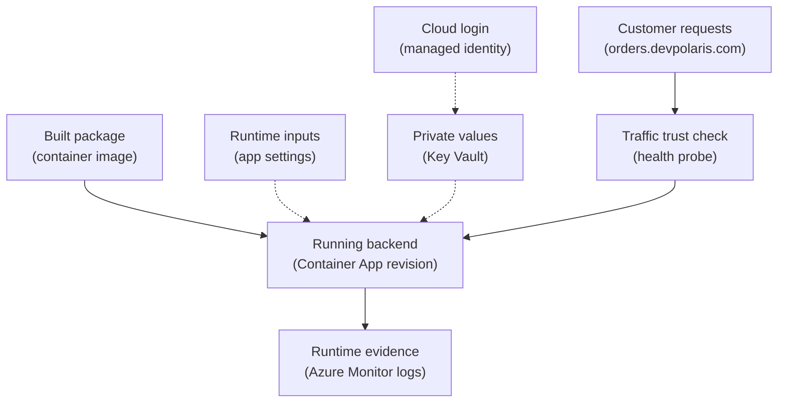

## Table of Contents

1. [Deployed Is Not The Same As Ready](#deployed-is-not-the-same-as-ready)
2. [If You Know AWS Runtime Checks](#if-you-know-aws-runtime-checks)
3. [The Runtime Shape For devpolaris-orders-api](#the-runtime-shape-for-devpolaris-orders-api)
4. [App Settings Are Runtime Inputs](#app-settings-are-runtime-inputs)
5. [Secrets Need Identity, Not Copy-Paste](#secrets-need-identity-not-copy-paste)
6. [Logs Are The First Runtime Evidence](#logs-are-the-first-runtime-evidence)
7. [Health Checks Protect Traffic](#health-checks-protect-traffic)
8. [Scaling Follows A Signal](#scaling-follows-a-signal)
9. [Failure Modes And What To Check First](#failure-modes-and-what-to-check-first)
10. [A Release Checklist For Runtime Trust](#a-release-checklist-for-runtime-trust)

## Deployed Is Not The Same As Ready

A cloud resource can exist and still be useless to users.

An Azure Container App can have a new revision.
An App Service web app can show as running.
A Function App can deploy successfully.
A virtual machine can be powered on.
Those are good signs, but they do not prove the application is ready for real traffic.

Runtime configuration is everything the app receives when it starts or runs:
environment values, secret references, identity, ports, logging, health probes, and scaling rules.
The code package is only one part of the service.
The runtime around the code decides whether the app knows where its database is, whether it can read a secret, whether logs are visible, and whether Azure should send traffic to it.

This matters because many production failures are not "the code is missing."
They are "the code started in the wrong room."
The app starts without `DATABASE_URL`.
The app has the right Key Vault URL but no managed identity permission.
The app listens on port `3000` but the platform expects `8080`.
The health endpoint says healthy before the database connection is ready.
The scale rule creates too many workers for a database that can only handle a few connections.

The running example is `devpolaris-orders-api`.
It is a Node.js backend for checkout.
In this module, the main production path is Azure Container Apps, but the same runtime habits also apply to App Service, Functions, and VMs.
The exact Azure nouns change.
The operating questions stay familiar:

| Runtime Question | Why It Matters |
|------------------|----------------|
| What values does the app need at startup? | Missing config can break the app before it serves traffic |
| Which secrets must the app read? | Secrets should not be copied into code or images |
| Which identity is the app using? | Azure checks the caller before allowing service access |
| Where do logs go? | Operators need evidence when startup or requests fail |
| What proves the app is healthy? | Traffic should avoid broken copies |
| What signal controls scaling? | More copies help only when the bottleneck can handle them |

The goal of this article is simple:

> A runtime is ready when the app has the right inputs, can prove who it is, emits useful evidence, passes honest health checks, and scales for the right reason.

## If You Know AWS Runtime Checks

If you have learned AWS first, you already know the shape of this problem.
On AWS, an ECS task definition provides environment variables and secret references.
The task execution role helps pull images and read some startup secrets.
The task role lets the app call AWS APIs.
CloudWatch Logs stores runtime evidence.
An Application Load Balancer checks target health before sending traffic.

Azure has the same operating concerns, but the nouns are different.
Do not translate every term one-to-one.
Use the comparison as a bridge.

| Runtime Job | AWS Idea You May Know | Azure Idea To Look For |
|-------------|-----------------------|------------------------|
| Non-secret runtime values | ECS environment variables | App settings or environment variables |
| Secret access | Secrets Manager or Parameter Store | Key Vault, often through managed identity |
| Workload identity | Task role, instance role, Lambda execution role | Managed identity plus Azure RBAC |
| Runtime logs | CloudWatch Logs | Azure Monitor and Log Analytics |
| Traffic health | ALB target health | App Service health check, Container Apps probes, gateway backend health |
| Scale signal | ECS desired count, Lambda concurrency, target tracking | App Service scale out, Container Apps scale rules, Functions scale behavior |

The important habit is the same:
do not trust the deployment event alone.
Ask what runtime evidence proves the app is actually usable.

For `devpolaris-orders-api`, the release record should not stop at "revision created."
It should say which revision is live, which settings are attached, whether Key Vault access works, whether `GET /health` is passing, and whether logs are flowing.

## The Runtime Shape For devpolaris-orders-api

Here is the runtime picture without trying to draw every Azure detail.
The main path is the app receiving traffic.
The side inputs are grouped so the diagram stays readable.



Read the dotted lines as support around the app, not as customer traffic.
The container image gives Azure something to run.
App settings tell the app how this environment behaves.
Managed identity lets the app prove who it is.
Key Vault stores private values.
Logs show what happened.
The health probe decides whether traffic should trust this running copy.

This is the minimum runtime story a teammate should be able to explain during a release.
If they can only say "the app deployed," the release is still missing important evidence.

For a first production release, the record might look like this:

```text
service: devpolaris-orders-api
platform: Azure Container Apps
revision: ca-devpolaris-orders-api--20260503-0918
image: acrdevpolaris.azurecr.io/devpolaris-orders-api:2026-05-03-1
public host: orders.devpolaris.com
health path: /health
identity: mi-devpolaris-orders-api-prod
key vault: kv-devpolaris-orders-prod
logs workspace: law-devpolaris-prod
scale signal: HTTP concurrency
```

This is not busywork.
It gives the team a shared map for debugging.
When a customer reports a failed checkout, you know which revision, identity, vault, health path, and log workspace to inspect first.

## App Settings Are Runtime Inputs

An app setting is a value attached to the running app by the platform.
In App Service and Azure Functions, app settings become environment variables.
In Azure Container Apps, environment variables can be set on the container template for a revision.
The exact UI and command names differ, but the mental model is the same:
the value is chosen by the environment, not baked into the app code.

That separation is useful.
The same `devpolaris-orders-api` image can run in staging and production.
Staging can point at a staging API URL.
Production can point at the real public hostname.
The code reads the same variable names, but Azure supplies different values.

For a Node backend, common non-secret settings might be:

| Setting | Example | Why It Exists |
|---------|---------|---------------|
| `NODE_ENV` | `production` | Lets the app use production behavior |
| `PORT` | `3000` | Tells the HTTP server where to listen |
| `PUBLIC_BASE_URL` | `https://orders.devpolaris.com` | Builds public links correctly |
| `ORDER_TIMEOUT_MS` | `2500` | Keeps slow downstream calls from hanging forever |
| `LOG_LEVEL` | `info` | Controls how noisy runtime logs should be |

These values are not secrets.
They still matter.
If `PORT` is wrong, the platform might send traffic to a port where nothing is listening.
If `PUBLIC_BASE_URL` points at staging, emails and redirects can send users to the wrong place.
If `ORDER_TIMEOUT_MS` is too high, request workers can pile up during a downstream outage.

A good startup log proves the app saw the safe settings without leaking private values:

```text
2026-05-03T09:18:14.221Z INFO boot service=devpolaris-orders-api revision=20260503-0918
2026-05-03T09:18:14.223Z INFO config NODE_ENV=production PORT=3000 ORDER_TIMEOUT_MS=2500
2026-05-03T09:18:14.224Z INFO config PUBLIC_BASE_URL=https://orders.devpolaris.com
2026-05-03T09:18:14.602Z INFO http listening address=0.0.0.0 port=3000
```

Notice the discipline.
The log says enough to debug runtime shape.
It does not print database passwords, signing keys, or connection strings.

If you use App Service, the same habit applies.
The app settings page can become a quiet source of production outages when values are copied by hand.
If you use Azure Container Apps, a changed environment variable usually creates a new revision.
That is useful because you can point to exactly which runtime shape was deployed.

## Secrets Need Identity, Not Copy-Paste

Secret values are different from ordinary app settings.
A secret is any value that grants access or proves trust:
a database connection string, webhook signing key, API token, storage key, or private certificate password.

The beginner mistake is to treat secrets as just "important environment variables."
That leads to copied values in pipeline variables, local `.env` files, app settings, screenshots, and chat messages.
The app works, but the team loses track of where the secret lives.

Azure's safer path is:
store the private value in Key Vault, then let the app use managed identity to read it.
Managed identity is the app's Azure-managed login.
Azure RBAC or Key Vault access rules decide what that identity can read.

For `devpolaris-orders-api`, the production shape might be:

| Private Value | Stored In | Runtime Reads It With |
|---------------|-----------|-----------------------|
| `OrdersDbConnection` | Key Vault secret | Managed identity |
| `PaymentWebhookSecret` | Key Vault secret | Managed identity |
| `StorageExportToken` | Prefer identity-based storage access instead | Managed identity and storage RBAC |

The last row is intentional.
Not every access problem should become a secret.
If Azure Storage can accept a managed identity token, prefer that over copying a storage account key.
The best secret is the one you do not need to store in your app at all.

Here is what a good release note says:

```text
identity: mi-devpolaris-orders-api-prod
key vault role: Key Vault Secrets User on kv-devpolaris-orders-prod
storage role: Storage Blob Data Contributor on stdevpolarisordersprod/invoices
secret names expected: OrdersDbConnection, PaymentWebhookSecret
```

That note separates identity from permission.
The managed identity proves who the app is.
The role assignments decide what it can do.
Both must be true.

If secret access fails, the app may start and fail later, or it may fail during startup.
That depends on when your code reads the secret.
For a database connection string, failing early is usually better.
It keeps Azure from routing traffic to an app copy that cannot create orders.

## Logs Are The First Runtime Evidence

When a runtime fails, logs are usually the first honest witness.

A portal status might say the app is running.
A deployment job might say the revision was created.
The browser might only show a generic `502`.
Logs tell you what the process actually did.

For Azure-hosted apps, logs often flow into Azure Monitor and Log Analytics.
The service-specific path varies:
App Service has application logs and diagnostic settings.
Container Apps can send logs to a Log Analytics workspace.
Functions has integration with Application Insights and logs.
VMs often need an agent or service-level log collection.

The exact route is less important than the release habit:
before trusting traffic, prove logs are flowing from the new runtime.

For `devpolaris-orders-api`, a useful log line includes stable fields:

```text
2026-05-03T09:22:41.831Z INFO request_id=req_7M8f9r method=GET path=/health status=200 duration_ms=18 revision=20260503-0918
2026-05-03T09:22:44.104Z INFO request_id=req_U3k2pQ method=POST path=/orders status=201 duration_ms=142 revision=20260503-0918
2026-05-03T09:22:45.510Z WARN request_id=req_D91aVc dependency=payments status=timeout duration_ms=2500 revision=20260503-0918
```

The fields matter.
`request_id` lets you follow one request.
`path` and `status` show behavior.
`duration_ms` shows slowness.
`revision` tells you whether the problem belongs to the new deployment or an older one.

A beginner-friendly query should answer one clear question.
For example: "Did the new revision log startup and health requests?"

```text
ContainerAppConsoleLogs_CL
| where ContainerAppName_s == "ca-devpolaris-orders-api-prod"
| where Log_s has "revision=20260503-0918"
| where Log_s has_any ("boot", "/health", "/orders")
| project TimeGenerated, Log_s
```

You do not need to memorize the exact table name on day one.
The important habit is to know where the runtime logs land and what fields make them useful.
If the app is deployed but no logs appear, that is a failure signal by itself.

## Health Checks Protect Traffic

A health check is a small test that decides whether a running app copy should receive traffic.
For HTTP backends, it is often a request like `GET /health`.

The easy mistake is to make `/health` too shallow.
If it always returns `200` because the process is alive, Azure might send traffic to a copy that cannot reach the database, cannot read required config, or is still warming up.
The other mistake is to make `/health` too deep.
If it calls every dependency on every probe, one slow dependency can cause unnecessary restarts or traffic removal.

A useful health endpoint answers a specific question:
can this app copy safely receive normal traffic right now?

For `devpolaris-orders-api`, a health response might look like this:

```text
GET /health
200 OK

{
  "service": "devpolaris-orders-api",
  "revision": "20260503-0918",
  "status": "ready",
  "database": "ok",
  "config": "ok"
}
```

That response is meant for the platform and operators, not for marketing.
It should be small, fast, and honest.
It should not expose secrets.
It should not include stack traces.

Different Azure hosting choices use health checks differently:

| Hosting Shape | Health Idea |
|---------------|-------------|
| App Service | Health check path can help remove unhealthy instances from rotation |
| Container Apps | Startup, readiness, and liveness probes can decide when a revision receives traffic or restarts |
| Functions | Health is often about trigger status, host health, and dependency checks rather than one always-on HTTP server |
| Virtual Machines | The load balancer or gateway probes the VM or app endpoint |

If you know Kubernetes probes, Container Apps may feel familiar because Container Apps is built on Kubernetes-style ideas, though you do not manage the cluster directly.
If you do not know Kubernetes, keep it simple:
startup means "did the app start?"
readiness means "should traffic come here now?"
liveness means "is this process stuck badly enough to restart?"

When a health check fails, do not start by changing the probe interval.
First ask what the app is telling you.
Is the port wrong?
Is the path wrong?
Does the app return `500` because config is missing?
Does it return `200` too early, before the database is ready?

## Scaling Follows A Signal

Scaling means changing how many app copies are available to do work.
It is not magic performance.
More copies help only when the bottleneck can be shared.

For a public HTTP API, a common scale signal is request load.
For a background worker, a common scale signal is queue length.
For a VM-based service, scaling might mean adding VM instances to a scale set or increasing the size of the machine.
For Functions, the platform can create more function instances based on triggers, limits, and plan behavior.

In Azure Container Apps, scale rules are one of the clearest places to see the idea.
The service can keep a minimum number of replicas and scale up when HTTP concurrency or another trigger crosses a threshold.

For `devpolaris-orders-api`, a first HTTP scale policy might be described like this:

```text
container app: ca-devpolaris-orders-api-prod
min replicas: 2
max replicas: 10
scale signal: HTTP concurrency
target: 50 concurrent requests per replica
```

The numbers are not universal.
They should come from testing and production behavior.
The important part is the causal link:
when each replica is handling too many simultaneous requests, Azure can add more replicas, up to the maximum.

Scaling a worker should follow a different signal.
If a receipt-export worker reads from a queue, scaling by HTTP concurrency makes no sense.
The useful signal is waiting work:

```text
worker: devpolaris-receipt-exporter
min replicas: 0
max replicas: 5
scale signal: queue length
target: 20 messages per replica
```

Scaling also creates new risks.
More API replicas can create more database connections.
More workers can process the same broken input faster.
More function instances can hit a downstream provider's rate limit.
The scale rule should match the bottleneck you are trying to relieve.

Here is a practical table:

| Workload Shape | Good First Scale Signal | Risk To Watch |
|----------------|-------------------------|---------------|
| Public checkout API | HTTP concurrency or request rate | Database connection pressure |
| Receipt export worker | Queue length | Duplicate work or storage throttling |
| Timer cleanup job | Schedule plus max parallelism | Multiple copies deleting the same data |
| VM-hosted legacy app | CPU, memory, or manual capacity | Patch and image drift across machines |

Scaling is a runtime decision.
It belongs in the release conversation because a bad scale rule can make a correct deployment fail under real traffic.

## Failure Modes And What To Check First

Runtime failures often look vague from the outside.
The browser says `502`.
The deploy job says success.
The app resource exists.
That is why the first useful move is to classify the failure by runtime area.

| Symptom | Likely Runtime Area | First Check |
|---------|---------------------|-------------|
| App starts, then exits | App settings or startup code | Startup logs for missing config |
| App cannot read secret | Managed identity or RBAC | Identity assignment and Key Vault role |
| Public URL returns `502` | Health check or backend routing | Probe result and app logs for `/health` |
| No logs from new revision | Diagnostics or app startup | Log workspace and revision startup events |
| Works at low traffic, fails under load | Scaling or downstream capacity | Replica count, database connections, dependency latency |
| Worker processes too much at once | Scale rule too aggressive | Queue scale target and max replicas |

Here is a realistic missing-secret startup failure:

```text
2026-05-03T10:04:18.441Z INFO boot service=devpolaris-orders-api revision=20260503-1010
2026-05-03T10:04:18.447Z ERROR startup missing required setting OrdersDbConnection
2026-05-03T10:04:18.448Z ERROR startup refusing to listen because database config is missing
```

The fix is not to weaken the health check.
The fix is to restore the runtime input.
Check the app setting or Key Vault reference.
Check whether the managed identity can read the secret.
Then restart or redeploy so the app starts with the corrected value.

Here is a permission failure:

```text
2026-05-03T10:11:02.118Z ERROR keyvault secret=OrdersDbConnection status=403
message="Caller is not authorized to perform action on this resource"
identity=mi-devpolaris-orders-api-prod
```

This tells you the secret name is probably reachable, but authorization failed.
Check the managed identity attached to the app.
Then check the role assignment or Key Vault access model.
Do not paste the secret into an app setting as a shortcut.
That fixes the symptom by weakening the runtime design.

Here is a health mismatch:

```text
probe path: /health
probe result: 404
app log: GET /api/health 200
```

The app may be healthy, but Azure is asking the wrong path.
The correction is a probe configuration change, not an app rewrite.
This is why release records should include the actual health path.

## A Release Checklist For Runtime Trust

Before a production release, a team does not need a giant ceremony.
It needs a small shared set of runtime checks.
Each check should prove one thing that matters to users.

For `devpolaris-orders-api`, a useful checklist looks like this:

| Check | Evidence |
|-------|----------|
| New runtime exists | Revision, deployment slot, function version, or VM image is named |
| Required settings are present | Startup log confirms safe config names |
| Secrets are not printed | Logs show presence checks, not secret values |
| Managed identity works | App can read Key Vault or storage without copied keys |
| Logs are flowing | New revision emits startup and request logs |
| Health is honest | `GET /health` returns `200` only when the app is ready |
| Scale rule matches workload | API scales by traffic, worker scales by queue |
| Rollback target is known | Previous revision, slot, function version, or VM image is named |

The hosting choice changes the exact evidence.
App Service might use deployment slots and app settings.
Container Apps might use revisions and scale rules.
Functions might use trigger health and Application Insights.
VMs might use a load balancer probe, systemd status, and Azure Monitor Agent logs.

The habit is the same across all of them:
after deployment, ask whether the runtime can safely serve users.

If you know AWS, this should feel familiar.
You are doing the Azure version of checking task definition values, IAM permissions, CloudWatch logs, ALB health, and scaling policy.
The names changed.
The engineering discipline did not.

---

**References**

- [Azure App Service configuration](https://learn.microsoft.com/azure/app-service/configure-common) - Explains app settings and runtime configuration for App Service apps.
- [Azure Container Apps environment variables](https://learn.microsoft.com/azure/container-apps/environment-variables) - Shows how Container Apps passes runtime values to containers.
- [Azure Container Apps health probes](https://learn.microsoft.com/azure/container-apps/health-probes) - Documents startup, readiness, and liveness probes for containerized apps.
- [Azure Container Apps scale rules](https://learn.microsoft.com/azure/container-apps/scale-app) - Explains replica scaling and scale rule behavior.
- [Azure managed identities overview](https://learn.microsoft.com/entra/identity/managed-identities-azure-resources/overview) - Defines managed identity and how Azure workloads use it without stored credentials.
- [Azure Monitor Logs overview](https://learn.microsoft.com/azure/azure-monitor/logs/data-platform-logs) - Explains how Azure stores and queries logs for operational evidence.
