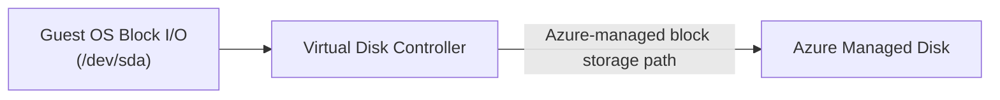
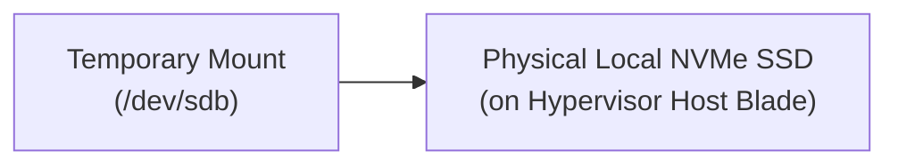

## Table of Contents

1. [What Is A Virtual Machine](#what-is-a-virtual-machine)
2. [Image](#image)
3. [VM Size](#vm-size)
4. [Disks](#disks)
5. [Network Interface](#network-interface)
6. [Virtual Machine Scale Sets: Scaling the Fleet](#virtual-machine-scale-sets-scaling-the-fleet)
7. [Virtual Machine Extensions: Automated Management](#virtual-machine-extensions-automated-management)
8. [Startup](#startup)
9. [Process Management](#process-management)
10. [Patching And Logs](#patching-and-logs)
11. [Putting It All Together](#putting-it-all-together)
12. [What's Next](#whats-next)

## What Is A Virtual Machine

An Azure Virtual Machine (VM) is Azure's server-shaped compute option: you get a full guest operating system, persistent disks, a network interface, and administrative control inside the OS. Under that familiar server contract, the guest operating system instance is executed by a physical hypervisor using software-defined virtualized hardware allocations. Azure manages the physical datacenter facilities, server blade hardware, hypervisor scheduling, and cooling infrastructure. Your team, however, retains full administrative control and operational ownership over everything inside the guest operating system boundary.


*A VM gives the team the most host control, but it also leaves operating system, patching, process, disk, and network responsibility with the team.*


To deploy a Virtual Machine, you declare its size, OS image, network placement, and credential parameters. The following command launches a standard database node inside a dedicated network subnet:

```plain
az vm create \
  --resource-group rg-database-prod \
  --name vm-db-prod \
  --image Ubuntu2204 \
  --size Standard_D2s_v5 \
  --vnet-name vnet-prod \
  --subnet snet-db \
  --admin-username dbadmin \
  --ssh-key-values @id_rsa.pub
```

Executing this command tells the Azure ARM controller to register a virtual machine identity, allocate physical resources on a hypervisor blade, create a persistent managed disk, bind a virtual network interface card (NIC), and mount the OS partition.

:::expand[Under the Hood: VM Sizing and Host Isolation]{kind="design"}
Azure VMs run as guest operating systems on Azure-managed physical hosts. The VM size you choose defines the virtual CPU count, memory amount, disk throughput limits, network throughput limits, and sometimes the local temporary storage available to the guest.

The important operational constraint is that the VM size is a hard ceiling. Attaching a faster managed disk does not help if the VM size has a lower disk throughput cap. Moving a memory-hungry process onto a VM with too little RAM causes paging or crashes no matter how healthy the Azure host is. Choosing a VM is therefore a capacity-planning decision, not only an operating system preference.

Azure isolates guests from each other at the virtualization layer and manages the physical host, but your team owns everything inside the guest OS. That includes users, packages, kernel settings, service supervisors, firewall rules, data mounts, and application recovery behavior.
:::

If you operate servers on AWS, Azure VMs are the direct equivalent of AWS EC2 instances. Both provide raw virtual guest servers in the cloud. However, they integrate differently with adjacent cloud resources. In AWS, persistent block storage commonly uses Elastic Block Store (EBS), whereas in Azure, persistent volumes use Managed Disks. Azure VMs also commonly run a guest VM Agent and can use the Instance Metadata Service (IMDS) for instance metadata and managed identity token requests.

Choosing a Virtual Machine is a deliberate engineering tradeoff. You accept the operational overhead of server patching, security compliance audits, backup policies, and process monitoring in exchange for the absolute runtime freedom required by specialized systems.

| Resource Provider | Operational Owner | Systems Detail |
| --- | --- | --- |
| Physical Hardware | Azure Fabric | Core hypervisor updates, server blade hardware, and power units |
| Operating System OS | Your Team | Guest OS updates, security hardening, package updates, and kernels |
| Storage Volumes | Your Team | Partition tables, file systems, disk mounts, and directory trees |
| Process Supervision | Your Team | Keeping systemd daemons active and monitoring process restarts |
| Logging Pipelines | Your Team | Installing log agents to forward files to centralized log workspaces |
| Network Routing NIC | Your Team | Configuring firewalls, network interfaces, and guest routing tables |

## Image

A VM image is the boot template for the server. It contains the operating system, default libraries, kernel version, and any preinstalled software Azure should place on the OS disk.

Example: a custom image named `img-inventory-ubuntu-2026-05` can include Ubuntu 22.04, the inventory daemon binary, the Azure Monitor agent, and baseline security settings before any VM starts.

When you provision a VM, Azure uses that image to create the VM's OS disk.

Relying on raw marketplace images can introduce configuration drift over time. If a developer boots a generic Ubuntu image and manually installs packages, updates libraries, and edits system files, the machine cannot be easily reproduced. If the VM's host hardware fails and the platform migrates the workload to a new node, recreating the configuration by hand creates serious recovery latency.

To ensure consistency, automate the image creation path using golden-image pipelines (such as HashiCorp Packer). These pipelines compile your application binaries, install required security daemons, and configure system libraries into a custom, versioned image. You register this image in an Azure Compute Gallery, ensuring that every VM launched in your scaling group boots from the exact same pre-tested template.

## VM Size

A VM size is the capacity profile for the server you are renting: CPU count, memory, temporary storage, disk throughput, and network throughput. The VM Size (also referred to as the VM SKU) defines the compute, memory, local ephemeral disk space, and network bandwidth characteristics of the virtualized environment. Selecting a size is a critical step that must match the physical resource needs of your guest processes.

Azure categorizes VM sizes into specialized families designed for distinct workloads:
* **D-Family (General Purpose)**: Balanced CPU-to-memory ratios; designed for standard web backends, small databases, and testing environments.
* **E-Family (Memory Optimized)**: High RAM-to-core ratios; designed for in-memory databases, large cache layers, and high-volume data engines.
* **F-Family (Compute Optimized)**: High core-to-RAM ratios; designed for CPU-bound batch processing, compilation engines, and video encoding.

The VM Size also imposes strict, non-adjustable hardware limits on network interface card (NIC) throughput and disk input/output operations per second (IOPS). If you select a small VM size (such as `Standard_B2s`), the hypervisor limits your network bandwidth to a low rate and caps your disk IOPS. Even if you attach a high-performance SSD capable of 20,000 IOPS, the VM's virtual disk controller will throttle I/O operations to match the VM size limits, creating disk queue bottlenecks.

## Disks

VM disks are the storage devices the guest operating system mounts and reads through its normal filesystem path. An Azure Virtual Machine normally utilizes two distinct categories of storage: managed disks (durable, network-attached storage) and temporary local disks (ephemeral, physically attached SSDs).





Managed disks represent Azure-managed block storage attached to your VM. The guest operating system sees a disk device, while Azure handles the storage account placement, redundancy option, durability, and disk resource lifecycle behind the scenes.

To fit different performance and cost requirements, Azure provides five distinct Managed Disk types:

*   **Standard HDD**: Backed by traditional magnetic hard drives, providing the lowest cost. Best for backups, archiving, or running development hosts with highly infrequent disk access.
*   **Standard SSD**: Low-cost solid-state drives, providing balanced, consistent latency. Designed for standard web application hosts and small dev environments.
*   **Premium SSD**: High-performance network-attached solid-state volumes, delivering low-latency block I/O. Ideal for production databases and transaction-heavy workloads.
*   **Premium SSD v2**: Next-generation block volumes, allowing you to configure size, IOPS, and throughput independently to optimize disk costs without scaling volume sizes.
*   **Ultra Disk**: The highest performance block tier, supporting sub-millisecond latencies and delivering up to 160,000 IOPS, designed for transaction-heavy enterprise database clusters.

The exact performance and durability guarantees depend on the disk type, volume size, and SKU you configure.

Temporary disks, conversely, are local temporary storage exposed by many VM sizes. On Linux VMs, this drive is typically mounted at `/mnt` or `/mnt/resource`. This storage is ephemeral. Data on the temporary disk can be lost during stop/deallocate, resize, redeploy, maintenance, or host recovery events. Never store database logs, source code, application state, or critical files on the temporary disk; restrict its use to system swap space and volatile caches.

:::expand[Writing to the Temporary Disk]{kind="pitfall"}
Many Azure VM sizes include a temporary local disk (`/dev/sdb` or `/dev/disk/cloud/azure_resource` on Linux, `D:` on Windows). This disk is designed for temporary data. If the VM is stopped (deallocated), resized, redeployed, or moved during maintenance, data written to the temporary drive can be lost.

This matches the behavior of AWS **EC2 Instance Store** volumes, which provide high-speed, local ephemeral block storage that is wiped clean the moment the EC2 instance is stopped, terminated, or undergoes hardware retirement.

Common victims of this behavior include application log directories, local session caches, SQLite databases, and cron configuration templates that developers accidentally write to `/mnt` or `D:\`. The files are perfectly readable for days, creating a false sense of security, until the next host maintenance event triggers a reboot and wipes the drive clean.

Consider this before-and-after storage architecture:

*   **Before (The Volatile Trap):** Storing active log files on the local temp disk:
    ```bash
    # App config targets the volatile ephemeral mount
    LOG_DIR="/mnt/app-logs/"
    ```
*   **After (The Durable Pattern):** Write persistent logs to a network-attached Azure Managed Disk, or stream them off-box to a central workspace:
    ```bash
    # Mount durable Managed Disk partition
    mount /dev/sdc1 /data/app-logs
    LOG_DIR="/data/app-logs/"
    ```

**Rule of thumb:** Treat the temporary local disk exactly like system RAM - it is completely volatile by design. Use it strictly for transient swap files, sorting buffers, or short-lived build artifact caches where data loss is fully expected and has zero impact on application durability.
:::

## Network Interface

A Network Interface Card (NIC) is the VM's network attachment. It gives the guest operating system a private IP address inside a subnet and connects that VM to routing and security rules.


*VM behavior is shaped by attached resources: disks hold state and the network interface controls where traffic can flow.*


Example: `nic-inventory-prod` can place `vm-inventory-prod` in `snet-inventory` with private IP `10.30.8.12`, attach no public IP, and use an NSG rule set that only allows traffic from the application subnet.

Under the hood, when packets reach the host blade's physical network adapter, the hypervisor's software-defined virtual switch inspects the VLAN headers. It routes the packets to the virtual NIC assigned to your VM, where the guest OS kernel parses the Ethernet frames. To bypass this virtual switch overhead and achieve near-line-rate network performance under high traffic, enable Accelerated Networking.

### Accelerated Networking and SR-IOV Physics

Under standard virtualization, when a physical network interface receives a packet, the host OS hypervisor intercepts it. The hypervisor evaluates virtual network switch rules, copies the packet buffer to the virtual machine's software network stack, and finally passes it to the guest OS. This software interception path consumes host CPU cycles and introduces network latency and jitter.

Accelerated Networking eliminates this host processor overhead by implementing Single Root I/O Virtualization (SR-IOV). When enabled on a supported VM size, the physical host adapter dynamically partitions a physical PCIe network card into multiple virtual functions.

Azure binds one of these physical PCIe virtual functions directly to your guest VM's virtual NIC interface. Packets bypass the hypervisor entirely. The hardware virtual function copies network packets directly from the physical cable into the guest VM's RAM memory buffers using Direct Memory Access (DMA). This cuts virtual network latency to sub-milliseconds, eliminates CPU virtualization overhead, and supports up to 30 Gbps of network throughput on large VM SKUs.

## Virtual Machine Scale Sets: Scaling the Fleet

A single Virtual Machine represents a single point of physical failure. If the underlying server blade hosting your VM experiences a hardware crash, your application goes offline until the Azure control plane detects the failure and redeploys the instance to a healthy node.

To build a highly available and resilient service, you must run multiple identical instances of your VM behind a load balancer. Azure provides this capability through Virtual Machine Scale Sets (VMSS).

A VMSS is a managed resource group that automates the deployment, lifecycle, and scaling of a group of identical VMs. Under the hood, VMSS integrates directly with Azure Load Balancer and Application Gateway. You define a scaling policy (such as increasing instance counts when the average CPU exceeds 70 percent, or decreasing instance counts during off-peak hours), and the VMSS controller automatically provisions or deprovisions VMs to match the load.

When configuring a scale set, you can choose between two orchestration modes:

*   **Uniform Orchestration**: Designed for large-scale, stateless workloads. The scale set uses a single VM template, allowing you to scale up to one thousand VM instances in a single group.
*   **Flexible Orchestration**: Designed for stateful or mixed workloads. It allows you to group VMs of different sizes, OS images, and billing models (such as combining Spot and Standard instances) into a single high-availability group.

By utilizing VMSS, our commerce portal's inventory service can scale dynamically across multiple Availability Zones, ensuring that a physical datacenter outage does not disrupt inventory tracking.

### Scale Set Upgrade Policies

When deploying updates to a Virtual Machine Scale Set (such as updating the VM image or installing custom configuration packages), you must configure how Azure rolls out these changes across your active instances to prevent service interruptions:

*   **Manual Upgrade Policy**: Azure does not touch existing VMs. When you apply a new image template, active instances continue running the old version until you explicitly execute the `az vmss update-instances` command to upgrade them.
*   **Automatic Upgrade Policy**: The scale set controller immediately updates all instances concurrently. This can cause severe service downtime because the controller shuts down and reprovisions every VM in the group at the same time.
*   **Rolling Upgrade Policy**: The recommended pattern for high availability. Azure divides the scale set instances into virtual batches using Availability Sets or Upgrade Domains. The controller updates one batch at a time, monitors its health probe state, and only proceeds to the next batch when the upgraded instances are verified healthy.

Choosing a rolling upgrade policy ensures that your storefront or catalog APIs remain active and reachable to users during platform security rollouts.

## Virtual Machine Extensions: Automated Management

Virtual Machine Extensions are Azure-run setup tasks inside the guest operating system. They exist so you can install agents, run bootstrap scripts, or fetch certificates without logging into every VM by hand.

Example: a Custom Script Extension can run `mount-data-disk.sh` on `vm-inventory-prod` after the VM boots, while the Azure Monitor Agent extension forwards syslog and performance counters to Log Analytics.

Virtual Machine Extensions are lightweight software utilities that run inside the guest OS. When you assign an extension to a VM, the Azure VM Agent downloads the extension's binary packages and executes them within the host.

Common extensions include:

*   **Custom Script Extension**: Downloads and runs a shell script from Azure Storage or a public URI inside the guest OS on boot. This is ideal for performing late-stage software installation and environment bootstrapping.
*   **Azure Monitor Agent Extension**: Automatically installs the monitoring daemon and wires it to a Log Analytics workspace to capture system logs and performance metrics.
*   **Key Vault Extension**: Periodically polls Azure Key Vault to download and update SSL certificates inside the VM's file system, avoiding manual rotation steps.

### Custom Script Extension Bicep Example

The following Bicep code block shows how to apply a Custom Script Extension to a Linux Virtual Machine, executing a boot script that mounts a secondary data drive and initializes a custom daemon:

```bicep
resource vmCustomScript 'Microsoft.Compute/virtualMachines/extensions@2023-09-01' = {
  name: 'vm-inventory-prod/bootstrapScript'
  location: 'eastus'
  properties: {
    publisher: 'Microsoft.Azure.Extensions'
    type: 'CustomScript'
    typeHandlerVersion: '2.1'
    autoUpgradeMinorVersion: true
    settings: {
      fileUris: [
        'https://raw.githubusercontent.com/devpolaris/scripts/main/bootstrap.sh'
      ]
      commandToExecute: 'bash bootstrap.sh'
    }
  }
}
```

By chaining Custom Script Extensions, you can transition a generic marketplace OS image into a fully configured, production-ready node without manual SSH intervention.

## Startup

The VM startup path represents the bridge between virtual machine creation and application process readiness. When the guest OS boots, the system must parse configuration metadata to set hostnames, wire network routing, retrieve secrets, and install runtimes.


*A VM has a startup chain, and any broken step before the app process can make the service appear down.*


To automate this provisioning flow without manual SSH commands, rely on the guest VM Agent (`waagent`) and cloud-init. During the boot sequence, the guest OS starts the VM Agent daemon. The agent can use the Instance Metadata Service (IMDS) at the private IP `169.254.169.254` to retrieve metadata such as the VM's resource group, subscription, private IP, and user-provided custom data scripts.

The VM Agent parses this metadata, configures the local network interfaces, writes host files, and executes your cloud-init shell scripts. A production-ready VM should utilize these scripts to pull configuration files from private repositories, register the machine with configuration engines (like Ansible or Chef), mount persistent data disks, retrieve database secrets via managed identity tokens, and start your application processes automatically.

## Process Management

Once the operating system boots and the VM Agent finishes executing configuration scripts, you must ensure that your application processes are supervised and restarted automatically on failure. Because there is no managed platform to monitor process states, you must configure a local process supervisor inside the guest OS.

On modern Linux distributions, the standard tool is `systemd`. You write a systemd service unit file (typically located in `/etc/systemd/system/`) that defines the process environment, specifies the working directory, maps the user privileges, and sets restart rules.

```ini
[Unit]
Description=DevPolaris Checkout API Service
After=network.target

[Service]
Type=simple
User=node
WorkingDirectory=/var/www/checkout-api
ExecStart=/usr/bin/node dist/index.js
Restart=always
RestartSec=5
Environment=NODE_ENV=production
LimitNOFILE=65536

[Install]
WantedBy=multi-user.target
```

Using a systemd service ensures that if your Node.js or Python application crashes due to an unhandled exception or memory exhaustion, the guest OS kernel detects the process termination and restarts the service automatically. It also integrates application logs directly with `journald`, providing a local logging system that can be queried using `journalctl`.

## Patching And Logs

Virtual Machines do not become safe just because Azure manages the host. As operating system kernels, SSL/TLS libraries, runtime engines, and system daemons age, they accumulate security vulnerabilities. Your team must implement an automated patching policy, using tools such as Azure Update Manager or automatic VM guest patching where appropriate, and schedule guest OS reboots in a controlled way.

Logging requires the same active ownership. Application logs written only to local files inside the VM are highly volatile. If a disk controller fails or a developer deallocates the machine, those logs are lost. Furthermore, logging into active production servers via SSH to run `tail -f` or `grep` commands is slow and creates operational security risks.

To secure your telemetry, install a centralized log collector agent (such as the Azure Monitor Agent or Fluent Bit) inside the guest OS. Configure the agent to tail your application log files and stream them in real-time to a central Log Analytics workspace. Set up host alerts to monitor CPU spikes, disk space exhaustion on persistent volumes, and memory utilization, ensuring you receive warnings before a filled OS disk crashes your databases.

### Azure Update Manager and Guest Patching

Operating a Virtual Machine requires maintaining strict operating system security hygiene. Azure provides **Azure Update Manager** as a native SaaS compliance engine to oversee guest operating system updates at scale across both Linux and Windows fleets.

Azure Update Manager allows you to configure automated guest patching policies without deploying local patching servers or agent virtual machines:

*   **Assessment Scan Loops**: The Azure guest agent runs daily background assessment checks to evaluate missing security definitions, kernel updates, and software hotfixes.
*   **Maintenance Configurations**: You declare declarative maintenance windows, schedules, and reboot behaviors. You can link multiple VMs to a single maintenance schedule, ensuring patching executes during designated low-traffic hours.
*   **Automatic Guest Patching**: For supported platform OS images, you can enable automatic VM guest patching. The platform automatically applies high-priority security updates on a rolling basis, schedule-free, while respecting host availability perimeters to prevent co-located VM crashes.

Implementing automated update schedules ensures your servers remain hardened against zero-day vulnerabilities while preserving workload availability.

## Putting It All Together

Virtual Machines provide low-level guest OS access at the cost of high operational overhead.

* **VM Size Limits**: Virtual machines run inside Azure-managed virtualization boundaries, and the VM size defines hard CPU, memory, disk, and network ceilings.
* **Guest OS Ownership**: Azure manages the host, while your team manages users, packages, patches, services, and local security inside the guest.
* **Managed Disks**: Managed disks provide Azure-managed durable block storage, with performance and redundancy determined by disk type, size, and SKU.
* **Temporary Disk Volatility**: Temporary local disks are designed for disposable data, and their contents can be lost during deallocation, resize, redeploy, maintenance, or host recovery.
* **VM Agent Provisioning**: The guest `waagent` fetches custom data scripts from link-local IMDS requests (`169.254.169.254`), orchestrating automated package installations via cloud-init.

By managing guest operating systems, process supervisors, and storage mounts systematically, you can run highly customized workloads that require absolute runtime control.

## What's Next

In the next chapter, we will go up the compute abstraction ladder to explore Azure App Service (PaaS). We will separate App Service Plans from Web Apps, deploy code slots, configure scaling rules, and run secure private backend proxy connections.

---

* [Virtual Machines in Azure](https://learn.microsoft.com/en-us/azure/virtual-machines/overview) - Introduction to Azure's IaaS compute platform.
* [Sizes for Virtual Machines](https://learn.microsoft.com/en-us/azure/virtual-machines/sizes/overview) - Technical reference for compute, memory, and storage VM SKU families.
* [Managed Disks Overview](https://learn.microsoft.com/en-us/azure/virtual-machines/managed-disks-overview) - Architecture details of remote network-attached durable storage LUNs.
* [Accelerated Networking SR-IOV](https://learn.microsoft.com/en-us/virtual-network/create-vm-accelerated-networking-cli) - Performance guide on Single Root I/O Virtualization.
