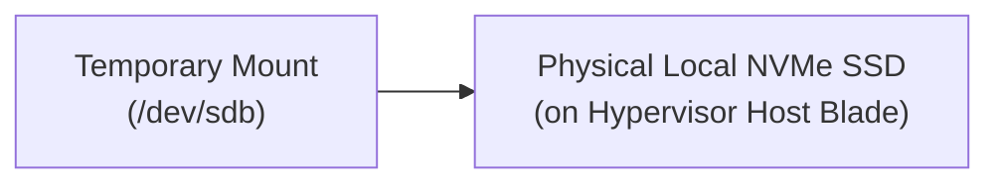

## Table of Contents

1. [What Is A Virtual Machine](#what-is-a-virtual-machine)
2. [Image](#image)
3. [VM Size](#vm-size)
4. [Disks](#disks)
5. [Network Interface](#network-interface)
6. [Startup](#startup)
7. [Process Management](#process-management)
8. [Patching And Logs](#patching-and-logs)
9. [Putting It All Together](#putting-it-all-together)
10. [What's Next](#whats-next)

## What Is A Virtual Machine

An Azure Virtual Machine (VM) is a cloud-based guest operating system instance executed by a physical hypervisor using software-defined virtualized hardware allocations. Azure manages the physical datacenter facilities, server blade hardware, hypervisor scheduling, and cooling infrastructure. Your team, however, retains full administrative control and operational ownership over everything inside the guest operating system boundary.

:::expand[Under the Hood: Hypervisor CPU Scheduling and NUMA Latency]{kind="design"}
The customized Hyper-V hypervisor controls physical processor cores and coordinates execution schedules. The hypervisor partitions the physical CPU into virtual processor units (vCPUs) and assigns them to guest operating systems. To guarantee high performance, the hypervisor coordinates CPU scheduling by pinning virtual threads directly to physical hardware threads (Hyper-Threading).

A critical performance constraint in this virtualized scheduling is the boundary of physical NUMA (Non-Uniform Memory Access) nodes. A physical server blade contains multiple CPU sockets, each directly cabled to its own local blocks of RAM. The combination of a CPU socket and its local memory is a NUMA node. When the hypervisor allocates a guest VM's vCPUs and RAM, it attempts to fit the entire allocation within a single physical NUMA node. If a guest VM's RAM allocation is split across multiple NUMA nodes, or if the hypervisor schedules a vCPU thread on CPU Socket 1 that must fetch data from RAM wired to CPU Socket 2, the data must travel across the slow inter-socket bus (such as Intel UPI or AMD Infinity Fabric). This cross-NUMA socket traversal increases memory retrieval latency, causing L3 cache misses and degrading application throughput under high performance loads.

Memory isolation between the guest virtual machine and the physical host is enforced directly at the silicon processor tier. The physical host CPU utilizes hardware Second Level Address Translation (SLAT), specifically Extended Page Tables (EPT) on Intel processors or Nested Page Tables (NPT) on AMD chips. The guest operating system manages its own virtual-to-physical memory page tables, assuming it has direct access to hardware. However, the EPT hardware interceptor translates the guest's physical memory references into the actual host physical RAM addresses. This hardware-assisted translation guarantees that a virtual machine can never read or overwrite memory blocks belonging to the host OS or other guest virtual machines, ensuring raw hardware-enforced isolation.
:::

If you operate servers on AWS, Azure VMs are the direct equivalent of AWS EC2 instances. Both provide raw, unmanaged virtual guest servers in the cloud. However, they integrate differently with adjacent cloud resources. In AWS, persistent storage block attachments utilize Elastic Block Store (EBS) cabled directly to your instances, whereas in Azure, persistent volumes use Managed Disks cabled over Microsoft's high-speed distributed storage networks. Furthermore, while AWS EC2 relies on IMDS metadata queries wired directly to local hypervisor sockets, Azure integrates the VM Agent (`waagent`) dynamically cabled to the Azure Resource Manager to manage guest setups.

Choosing a Virtual Machine is a deliberate engineering tradeoff. You accept the operational overhead of server patching, security compliance audits, backup policies, and process monitoring in exchange for the absolute runtime freedom required by specialized systems.

| Resource Provider | Operational Owner | Systems Detail |
| --- | --- | --- |
| Physical Hardware | Azure Fabric | Core hypervisor updates, server blade hardware, and power units |
| Operating System OS | Your Team | Guest OS updates, security hardening, package updates, and kernels |
| Storage Volumes | Your Team | Partition tables, file systems, disk mounts, and directory trees |
| Process Supervision | Your Team | Keeping systemd daemons active and monitoring process restarts |
| Logging Pipelines | Your Team | Installing log agents to forward files to centralized log workspaces |
| Network Routing NIC | Your Team | Configuring firewalls, network interfaces, and guest routing tables |

## Image

The image is the template file that contains the pre-configured operating system, kernel version, default libraries, and system configurations used to boot the virtual machine. When you provision a VM, the Azure Fabric Controller copies this image payload from the regional marketplace repository to your VM's OS disk.

Relying on raw marketplace images can introduce configuration drift over time. If a developer boots a generic Ubuntu image and manually installs packages, updates libraries, and edits system files, the machine cannot be easily reproduced. If the VM's host hardware fails and the platform migrates the workload to a new node, recreating the configuration by hand creates serious recovery latency.

To ensure consistency, automate the image creation path using golden-image pipelines (such as HashiCorp Packer). These pipelines compile your application binaries, install required security daemons, and configure system libraries into a custom, versioned image. You register this image in an Azure Compute Gallery, ensuring that every VM launched in your scaling group boots from the exact same pre-tested template.

## VM Size

The VM Size (also referred to as the VM SKU) defines the compute, memory, local ephemeral disk space, and network bandwidth characteristics of the virtualized environment. Selecting a size is a critical step that must match the physical resource needs of your guest processes.

Azure categorizes VM sizes into specialized families designed for distinct workloads:
* **D-Family (General Purpose)**: Balanced CPU-to-memory ratios; designed for standard web backends, small databases, and testing environments.
* **E-Family (Memory Optimized)**: High RAM-to-core ratios; designed for in-memory databases, large cache layers, and high-volume data engines.
* **F-Family (Compute Optimized)**: High core-to-RAM ratios; designed for CPU-bound batch processing, compilation engines, and video encoding.

The VM Size also imposes strict, non-adjustable hardware limits on network interface card (NIC) throughput and disk input/output operations per second (IOPS). If you select a small VM size (such as `Standard_B2s`), the hypervisor limits your network bandwidth to a low rate and caps your disk IOPS. Even if you attach a high-performance SSD capable of 20,000 IOPS, the VM's virtual disk controller will throttle I/O operations to match the VM size limits, creating disk queue bottlenecks.

## Disks

An Azure Virtual Machine normally utilizes two distinct categories of storage: managed disks (durable, network-attached storage) and temporary local disks (ephemeral, physically attached SSDs).




Managed disks represent software-defined virtual disk drives hosted on Azure's distributed storage cluster. Under the hood, when your guest operating system performs a file write, the virtual SCSI or NVMe controller in the hypervisor intercepts the block I/O requests. It converts the block requests into TCP packets and streams them over a dedicated high-speed storage network to the physical storage scale units. The storage fabric writes the data across three separate physical disk arrays in the datacenter to guarantee durability before returning a success signal to the hypervisor.

Temporary disks, conversely, are physically attached to the server blade hosting the hypervisor. On Linux VMs, this drive is typically mounted at `/mnt` or `/mnt/resource`. Because this disk is physically cabled to the local server blade, I/O latency is extremely low. However, this storage is fully ephemeral. If the underlying server blade hardware fails, or if you stop (deallocate) the VM, the Fabric Controller migrates your VM to a healthy blade in a different rack. Because the local SSD stays with the physical host blade, all data stored on the temporary disk is permanently lost. Never store database logs, source code, application state, or critical files on the temporary disk; restrict its use to system swap space and volatile caches.

## Network Interface

The Network Interface Card (NIC) is the virtualized resource that connects your VM to a virtual network subnet. It owns the private IP address mapping, links to public IP resources, and ties directly to Network Security Group (NSG) packet filtering rules.

Under the hood, when packets reach the host blade's physical network adapter, the hypervisor's software-defined virtual switch inspects the VLAN headers. It routes the packets to the virtual NIC assigned to your VM, where the guest OS kernel parses the Ethernet frames. To bypass this virtual switch overhead and achieve near-line-rate network performance under high traffic, enable Accelerated Networking.

Accelerated Networking utilizes Single Root I/O Virtualization (SR-IOV) technology. When enabled, the hypervisor bypasses the virtual switch entirely, presenting the physical NIC's virtual functions directly to the guest VM's PCIe bus. Packets are copied directly from the physical network adapter to the guest VM's memory buffers, reducing CPU utilization, cutting network jitter, and minimizing round-trip latency.

## Startup

The VM startup path represents the bridge between virtual machine creation and application process readiness. When the Fabric Controller boots the guest OS, the system must parse configuration metadata to set hostnames, wire network routing, retrieve secrets, and install runtimes.

To automate this provisioning flow without manual SSH commands, rely on the guest VM Agent (`waagent`) and cloud-init. During the boot sequence, the guest OS system systemd services start the VM Agent daemon. The agent makes a link-local HTTP request to the Instance Metadata Service (IMDS) at the private IP `169.254.169.254`. The hypervisor intercepts this packet, validates the VM's hardware identity, and returns a JSON payload containing the VM's resource group, subscription, private IP, and user-provided custom data scripts.

The VM Agent parses this metadata, configures the local network interfaces, writes host files, and executes your cloud-init shell scripts. A production-ready VM should utilize these scripts to pull configuration files from private repositories, register the machine with configuration engines (like Ansible or Chef), mount persistent data disks, retrieve database secrets via managed identity tokens, and start your application processes automatically.

## Process Management

Once the operating system boots and the VM Agent finishes executing configuration scripts, you must ensure that your application processes are supervised and restarted automatically on failure. Because there is no managed platform to monitor process states, you must configure a local process supervisor inside the guest OS.

On modern Linux distributions, the standard tool is `systemd`. You write a systemd service unit file (typically located in `/etc/systemd/system/`) that defines the process environment, specifies the working directory, maps the user privileges, and sets restart rules.

```ini
[Unit]
Description=DevPolaris Checkout API Service
After=network.target

[Service]
Type=simple
User=node
WorkingDirectory=/var/www/checkout-api
ExecStart=/usr/bin/node dist/index.js
Restart=always
RestartSec=5
Environment=NODE_ENV=production
LimitNOFILE=65536

[Install]
WantedBy=multi-user.target
```

Using a systemd service ensures that if your Node.js or Python application crashes due to an unhandled exception or memory exhaustion, the guest OS kernel detects the process termination and restarts the service automatically. It also integrates application logs directly with `journald`, providing a local logging system that can be queried using `journalctl`.

## Patching And Logs

Virtual Machines do not patch themselves. As operating system kernels, SSL/TLS libraries, runtime engines, and system daemons age, they accumulate security vulnerabilities. Your team must implement an automated patching policy using tools like Azure Update Manager to orchestrate monthly package updates and schedule guest OS reboots.

Logging requires the same active ownership. Application logs written only to local files inside the VM are highly volatile. If a disk controller fails or a developer deallocates the machine, those logs are lost. Furthermore, logging into active production servers via SSH to run `tail -f` or `grep` commands is slow and creates operational security risks.

To secure your telemetry, install a centralized log collector agent (such as the Azure Monitor Agent or Fluent Bit) inside the guest OS. Configure the agent to tail your application log files and stream them in real-time to a central Log Analytics workspace. Set up host alerts to monitor CPU spikes, disk space exhaustion on persistent volumes, and memory utilization, ensuring you receive warnings before a filled OS disk crashes your databases.

## Putting It All Together

Virtual Machines provide low-level guest OS access at the cost of high operational overhead.

* **Hypervisor CPU and NUMA scheduling**: Virtual machines run on guest processors isolated by the Hyper-V hypervisor.
* **Extended Page Tables (EPT)**: Hardware-nested page tables translate guest physical addresses directly to host RAM blocks, ensuring secure memory isolation.
* **Network-Attached Managed Disks**: Managed disks translate block I/O requests into network packets, streaming them over dedicated networks to triple-replicated distributed storage fabrics.
* **Temporary Disk Volatility**: Ephemeral local SSDs are physically attached to host server blades. Their data is lost permanently when a VM deallocates or migrates due to host hardware failure.
* **VM Agent Provisioning**: The guest `waagent` fetches custom data scripts from link-local IMDS requests (`169.254.169.254`), orchestrating automated package installations via cloud-init.

By managing guest operating systems, process supervisors, and storage mounts systematically, you can run highly customized workloads that require absolute runtime control.

## What's Next

In the next chapter, we will go up the compute abstraction ladder to explore Azure Kubernetes Service (AKS). We will analyze managed control plane architectures, contrast Kubenet with Azure CNI overlay networks, and inspect Entra ID Workload Identity cryptographic token exchanges.

---

**References**

- [Virtual Machines in Azure](https://learn.microsoft.com/en-us/azure/virtual-machines/overview) - Introduction to Azure's IaaS compute platform.
- [Sizes for Virtual Machines](https://learn.microsoft.com/en-us/azure/virtual-machines/sizes/overview) - Technical reference for compute, memory, and storage VM SKU families.
- [Managed Disks Overview](https://learn.microsoft.com/en-us/azure/virtual-machines/managed-disks-overview) - Architecture details of remote network-attached durable storage LUNs.
- [Accelerated Networking SR-IOV](https://learn.microsoft.com/en-us/virtual-network/create-vm-accelerated-networking-cli) - Performance guide on Single Root I/O Virtualization.
