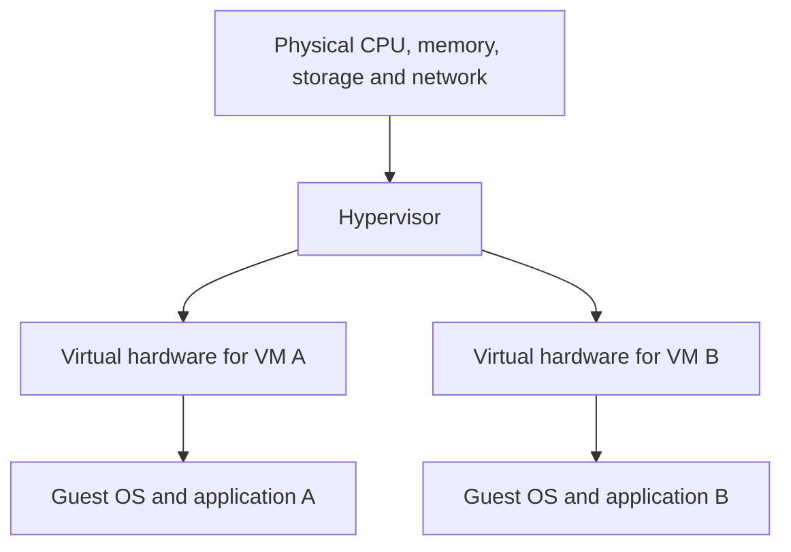
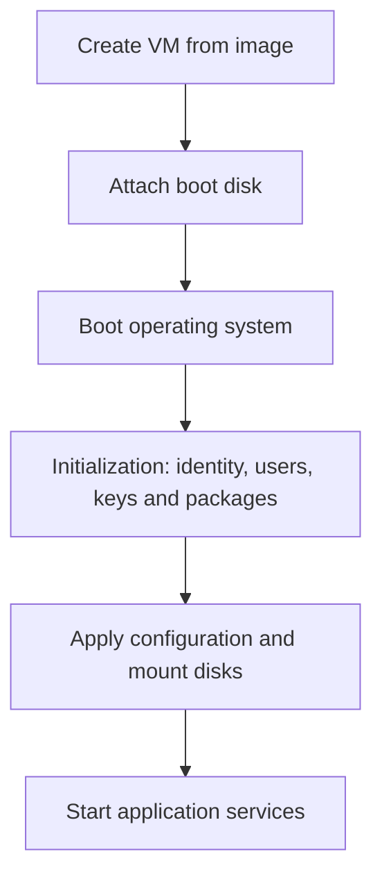
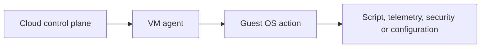
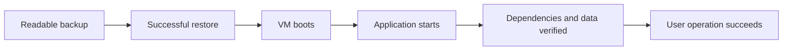
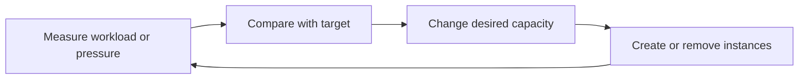
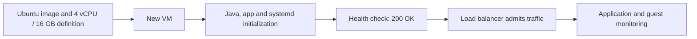

## Table of Contents

1. [When Is a Virtual Machine the Honest Choice?](#when-is-a-virtual-machine-the-honest-choice)
2. [What Does Azure Manage and What Do You Manage?](#what-does-azure-manage-and-what-do-you-manage)
3. [How Do Images and First Boot Create a VM?](#how-do-images-and-first-boot-create-a-vm)
4. [How Do Size, Disks, and Networks Shape a VM?](#how-do-size-disks-and-networks-shape-a-vm)
5. [How Do Extensions, Processes, and Health Keep It Running?](#how-do-extensions-processes-and-health-keep-it-running)
6. [How Do Patching, Backups, and Recovery Protect It?](#how-do-patching-backups-and-recovery-protect-it)
7. [When Do Scale Sets Help?](#when-do-scale-sets-help)
8. [What Evidence Do You Need to Operate VMs?](#what-evidence-do-you-need-to-operate-vms)
9. [Check Your Answers](#check-your-answers)

Some applications come with an installation guide that asks for an operating system, registry entries, a background service, a database driver, and particular disk paths. They expect a computer they can configure. A virtual machine supplies that computer-shaped environment without requiring a dedicated physical server for every application.

The VM still needs an operating system and a process that actually runs the application. It also needs CPU, memory, disks, networking, and a way to recover when any part fails. Azure provides the virtual computer through cloud resources; you operate much of the software inside it.

The questions below follow that responsibility from choosing a VM to proving that the application works and can be replaced:

1. **When Is a Virtual Machine the Honest Choice?**
2. **What Does Azure Manage and What Do You Manage?**
3. **How Do Images and First Boot Create a VM?**
4. **How Do Size, Disks, and Networks Shape a VM?**
5. **How Do Extensions, Processes, and Health Keep It Running?**
6. **How Do Patching, Backups, and Recovery Protect It?**
7. **When Do Scale Sets Help?**
8. **What Evidence Do You Need to Operate VMs?**

## When Is a Virtual Machine the Honest Choice?
<!-- section-summary: A VM supplies an isolated software-defined computer, making it a direct fit for applications that need a guest operating system and machine-level configuration. -->

A physical server has CPU cores, RAM, disks, a network interface, and an operating system. The operating system allocates CPU time, assigns memory pages to processes, coordinates disk writes and network packets, and enforces user permissions. Applications rely on those facilities to perform useful work.

You could install ten unrelated applications on one operating system, but they would share a machine environment. Application A might consume all available memory. Application B might require a different kernel configuration. Application C might need an older OS. One bad operating-system update could affect all three, and a compromised application could threaten other software on the same machine.

Virtualization addresses the question of whether one physical computer can provide several independent computer environments. It introduces a control layer called a **hypervisor** between physical hardware and the guest operating systems. A guest OS is the operating system running inside a VM.

### Virtual hardware supports separate guests

The hypervisor presents virtual hardware to each guest. VM A could see four virtual CPUs, 16 GB RAM, one network adapter, and two disks. VM B could see eight virtual CPUs, 32 GB RAM, two network adapters, and one disk. Both can use the same underlying physical host while operating as separate guest computers.


```mermaid
flowchart TD
    A[Physical CPU, memory, storage and network] --> B[Hypervisor]
    B --> C[Virtual hardware for VM A]
    B --> D[Virtual hardware for VM B]
    C --> E[Guest OS and application A]
    D --> F[Guest OS and application B]
```

A **virtual machine** is an isolated software-defined computer with virtual CPU, memory, storage, networking, and an operating system. From the guest's perspective, those resources behave substantially like a computer's hardware. The fact that the hardware is virtual does not mean application execution is simulated away: physical processors still perform the work.

Cloud platforms add an API around this virtual computer so you can create, start, stop, resize, connect disks and networking, replace, and delete it. This makes a computer available through infrastructure resources rather than through purchasing and installing a physical server.

### Match machine requirements to a machine interface

VMs fit traditional enterprise software, OS-installed commercial packages, Windows workloads, applications depending on system services, unusual runtimes, legacy applications, lift-and-shift migrations, appliances, custom networking software, and workloads needing substantial host control. The common thread is a requirement for the machine environment itself.

For example, an installation procedure may ask for Windows Server, registry keys, .NET, a Windows service, a database driver, ports 7000 and 7001, a mounted `D:\data` path, and a machine restart. Those instructions describe a machine installation. A VM represents that requirement directly.

The control can extend to packages, users, permissions, runtime versions, filesystem layout, background services, networking configuration, security software, scheduled jobs, system settings, and application processes. Choosing a VM makes sense when those capabilities are needed, not merely because logging into a server feels familiar.

Physical servers, VMs, containers, managed application platforms, and serverless functions are different interfaces rather than a simple progression from bad to good. A VM offers a computer on which you operate much of the software. A managed platform accepts an application and operates more of that computer on your behalf.

### How containers differ

A VM virtualizes a machine and includes its own guest operating system. A container normally packages an application's process environment while sharing more of the host operating-system kernel. That difference explains why VM hosting naturally accommodates several daemons, system services, arbitrary guest packages, and machine-level configuration.

A container platform encourages thinking in application processes; a managed application platform additionally takes over much of machine management, OS maintenance, process lifecycle, and scaling machinery. Each layer changes the division of work. The next section makes the VM division explicit, because it explains why a healthy Azure resource can still contain a broken application.

## What Does Azure Manage and What Do You Manage?
<!-- section-summary: Azure manages the infrastructure below the guest boundary, while the customer maintains much of the guest software; cloud resource state and guest application state are separate evidence. -->

For an ordinary VM, the provider manages the hypervisor, physical servers and networking, datacenter, power, and cooling. The customer manages the guest OS, its configuration, packages, runtime, and application. Particular services can alter the details, but this boundary leaves more operating work with the customer than a higher-level application host.

Suppose the guest contains Ubuntu 24.x, Node.js, nginx, application code, and OpenSSL libraries. Azure maintaining the physical host does not prove that the guest's Node version is patched, nginx is configured correctly, the TLS certificate is valid, the application process is alive, or the disk has free space. Those are software and configuration conditions inside the guest.

The hosting layers run from the application through process or service, runtime, guest OS, virtual resources, hypervisor, physical server, and datacenter. Management also enters from the cloud control plane through VM, disk, and network APIs. The **control plane** is the management system that creates and configures those resources; it does not execute every application request inside the guest.

### Two views of the same VM

The cloud resource has a VM ID, name, region, size, network interface, attached disks, and tags. The guest has a hostname, OS, users, processes, files, services, packages, and local configuration. These are different views of one hosting arrangement.

For example, Azure may identify the resource as `production-web-03`, while the guest hostname is `web-03`, nginx has process ID 4122, and the application has process ID 4381. A process ID identifies a running guest process; the cloud resource ID identifies the managed VM object.

The cloud can operate the VM without knowing whether every application operation succeeds. A state report can therefore look like this:

```text
Cloud status: RUNNING
OS status: RUNNING
Process: RUNNING
Application: BROKEN
```

Each line makes a different claim. A running VM means approximately that the virtual computer is powered on and executing. It does not establish that Linux completed boot correctly, nginx started, a Java process is alive, the database is reachable, authentication works, or users receive successful responses.

### Resource management also has layers

The hypervisor allocates a VM's resources, and the guest OS divides those resources among its processes. If a physical host has 512 GB RAM, it might allocate 16 GB to VM A, 32 GB to VM B, and 64 GB to VM C. Inside VM A, applications, agents, and a database compete for that VM's 16 GB.

A **vCPU** is a virtual processor exposed by the hypervisor. It is not automatically a permanently reserved physical core. The hypervisor schedules VM execution onto physical processors. A drawing of VMs with four, two, and eight vCPUs describes their exposed processor capacity, not necessarily a one-to-one ownership map of physical cores.

Storage and networking are virtualized too. The guest may see a disk as `/dev/sda` or `C:\`, although Azure implements the backing device through distributed block storage, SSD infrastructure, a storage network, replication, and snapshots. A guest interface named `eth0`, `ens5`, or `Ethernet Adapter` connects through a virtual NIC into a subnet and virtual network.

These abstractions let the guest use familiar operating-system interfaces. They also create separate limits and failure boundaries. A guest can see a disk without knowing its physical implementation, so performance and durability need to be understood through the cloud resource's contract as well as the guest's filesystem.

Before tuning those resources, establish how the guest's software is created. A reproducible starting point makes later troubleshooting and replacement much easier.

## How Do Images and First Boot Create a VM?
<!-- section-summary: An image supplies stable starting disk state, while first-boot automation applies instance-specific configuration; keeping that work reproducible limits drift and supports replacement. -->

Building every VM from an empty virtual disk would require booting an installer, installing an OS, configuring the bootloader, adding drivers, creating users, and preparing the machine. A **machine image** supplies a starting template for that disk state instead.

The image can contain operating-system files, kernel, boot configuration, standard utilities, and cloud initialization components. Ubuntu, Windows Server, Red Hat, a company image, and a vendor appliance image are examples of different starting templates. The image combines with VM configuration, storage, and networking to produce a running VM.

An image is a template, not a running server. Three VMs created from the same image begin similarly, but they can diverge after boot. After three months, VM A may have patch 37 and configuration A; VM B may have patch 42 and configuration B; VM C may have an extra manually installed package and configuration C. Even if nginx remains in the same major version family, the machines no longer share identical state.

This divergence is **configuration drift**. It makes a long-lived machine harder to reproduce because the original image no longer describes everything installed or changed inside it. Recovery then depends on knowing those later changes as well.

### First boot personalizes the template

A generic image needs instance-specific details. First boot may set the hostname, create a user, install an SSH key, configure networking, mount disks, retrieve settings, install the application, and start services. Common mechanisms include cloud-init, startup scripts, user data, custom data, VM extensions, and configuration-management agents.


```mermaid
flowchart TD
    A[Create VM from image] --> B[Attach boot disk]
    B --> C[Boot operating system]
    C --> D[Initialization: identity, users, keys and packages]
    D --> E[Apply configuration and mount disks]
    E --> F[Start application services]
```

**Cloud-init** is an initialization mechanism used by many Linux cloud images. More generally, first-boot automation turns a reusable machine template into the particular instance required by the environment. The mechanism matters less than making the steps known and repeatable.

Keep relatively stable machine state in the image and supply dynamic environment-specific values separately. Otherwise, changing a small setting can require a different image for production, staging, development, customer A, and customer B. That multiplication of images makes it harder to identify the software baseline shared by those environments.

For example, an image can contain Ubuntu, Java, and application binaries. Configuration can supply `DB_HOST=db-prod.internal` and `LOG_LEVEL=info`. Secrets can supply a necessary database password or API key. The image describes the machine's software; runtime configuration describes where and how this instance should operate.

### Record the desired infrastructure

If machines are created by repeated console clicks, part of the configuration exists only in someone's memory. **Infrastructure as code** records the desired resources so that they can be reviewed, versioned, recreated, tested, and automated.

A conceptual machine definition names an image, size, subnet, data disk, and security group:

```yaml
vm:
  image: web-v7
  size: medium
  subnet: application
  data_disk: 200 GB
  security_group: web
```

This is a conceptual infrastructure record, not an Azure resource template. Its purpose is to show which decisions need a reproducible definition. Combining that definition with an image and startup automation makes replacement less dependent on a unique server's accumulated history.

The starting software is only part of the machine. Its size, disk contracts, and network paths determine whether the configured application has enough resources and can communicate correctly.

## How Do Size, Disks, and Networks Shape a VM?
<!-- section-summary: VM sizing combines CPU, memory, storage and network limits; disk durability differs from speed, and connectivity must pass both cloud and guest boundaries. -->

A **VM size** is a bundle of resource characteristics. An example profile may offer four vCPUs, 16 GiB RAM, 8 Gbps networking, and 5,000 disk IOPS. The size can also constrain disk throughput and attachment count. CPU and memory alone do not describe the entire performance boundary.

A workload may hit one of those limits while CPU utilization remains low. That makes resource selection a measurement problem. Identify whether the application is computing, waiting for storage, consuming memory, or moving data over a limited network path before assuming that a larger CPU count solves it.

### CPU count and useful work

Suppose a computation requires 100 CPU-seconds. With ideal parallelism, one CPU would take about 100 seconds, two about 50 seconds, and four about 25 seconds. Real applications rarely achieve that perfect division.

Some work is serial. Locks can prevent threads from making progress together, database waits can pause useful execution, and processors share other resources. Doubling vCPUs therefore does not guarantee double application throughput. Measure the actual workload rather than treating the ideal arithmetic as a performance promise.

Some VM families use burstable CPU capacity. A mostly idle workload can accumulate credits and spend them during busy periods. Small development servers, low-traffic web apps, and administration servers may fit that pattern. A continuously CPU-bound workload may exhaust its available burst behavior and perform poorly.

If performance collapses while a dashboard does not show CPU at 100%, the missing variable may be CPU entitlement or the credit model. Capacity is defined by the size's rules, not solely by the processor count displayed inside the guest.

### Account for memory beyond the application

Memory often provides a harder boundary. Consider this eight-GB VM budget:

| Consumer | Memory |
|---|---:|
| Operating system | 1.5 GB |
| Agent | 0.5 GB |
| Web server | 0.5 GB |
| Application | 4.5 GB |
| Total used | 7.0 GB |
| Remaining headroom | About 1.0 GB |

The application's normal usage leaves only limited room for peaks. If demand exceeds available memory, the OS may reclaim caches, swap, slow severely, or invoke an out-of-memory killer that terminates processes. Sizing therefore includes the application, runtime, OS, agents, filesystem cache, peak traffic, and a safety margin.

Headroom is unused capacity kept available for variation. It is not wasted simply because it is free at one quiet moment. A size that exactly fits normal usage can fail when startup, traffic, or background work briefly requires more.

### Distinguish the disk roles

A VM can have an OS disk, persistent data disks, and temporary local storage. These roles have different lifecycles. A persistent cloud disk is logically independent of the physical server hosting the VM and is backed by the cloud block-storage service.

If VM A fails while its persistent disk survives, the disk may be detached and attached to VM B. That independent lifecycle is one reason cloud designs separate compute from storage. The replacement machine can use surviving durable state rather than require every byte to have lived inside one host's local device.

Temporary storage may be a fast local SSD on the physical host. It can disappear after host replacement, redeployment, some resize operations, or hardware failure. Appropriate uses include caches, scratch space, temporary compilation output, reconstructable intermediate files, and data with another recoverable or replicated copy.

It is unsuitable for the only copy of a customer database. Disk performance and durability answer different questions: a fast device can intentionally provide no durable guarantee across placement changes. Choose the location of data from the consequence of losing it as well as the speed required to use it.

### IOPS and throughput measure different demands

**IOPS** means input/output operations per second. It matters when a workload performs many small reads or writes, such as repeated eight-KB operations. **Throughput** measures the amount of data transferred per second, such as 500 MB/s, and matters for large sequential transfers.

Compare these examples:

| Workload | Approximate data rate | Main pressure |
|---|---:|---|
| 100 operations/s at 10 MB each | 1,000 MB/s | High throughput |
| 100,000 operations/s at 4 KB each | 400 MB/s | High operation count |

The numbers describe different workloads even though both involve disk I/O. A database doing small operations may need a different capacity profile from a program streaming large files.

There can be several ceilings on the same path. If the disk supports 20,000 IOPS but the VM supports 10,000, observing 10,000 does not imply the disk needs replacement. Buying a 40,000-IOPS disk leaves the VM's lower limit unchanged. Filesystem and application limits can constrain the path too.

Effective performance is bounded by the lowest relevant disk, VM, filesystem, or application ceiling. This is why a capacity investigation should follow the whole path rather than improve the most visible component without checking the bottleneck.

### A NIC connects the guest to the cloud network

A **network interface**, or NIC, gives the VM its virtual network attachment. It usually has a private IP, security policy, routing behavior, and possibly a public-IP association. The guest's familiar adapter connects through this software-defined network arrangement.

A public IP does not necessarily belong directly to the physical host. Cloud networking maps traffic through its resources to the VM. Similarly, a private address such as `10.20.3.17` can work within a VNet without making the application reachable from the internet.

Public access can involve a public IP or load balancer, firewall rules, the VNet, and the VM. Databases, internal services, and backend machines often do not need direct public exposure. Private reachability and public reachability are separate design decisions, not automatic consequences of creating a NIC.

### Check every packet boundary

A connection to TCP port 443 can be rejected by a cloud firewall or security group, subnet policy, interface-level controls, the guest firewall, or the application's own listener. Allowing traffic in one layer does not configure the others.

For example, a process bound only to `127.0.0.1:443` listens on the guest's loopback interface. Remote clients cannot reach it merely because a cloud rule allows 443. A listener bound to `0.0.0.0:443` accepts IPv4 connections on the machine's interfaces, subject to the remaining network and firewall controls.

The connection path should therefore be traced from external routing through cloud policy into guest policy and the process. A VM can have correct infrastructure and still expose no usable application port. Once the packet reaches the guest, the application also needs a supervisor and meaningful health checks to remain useful.

## How Do Extensions, Processes, and Health Keep It Running?
<!-- section-summary: Agents bridge cloud management into the guest, supervisors maintain process lifecycle, and layered health checks distinguish machine execution from successful user operations. -->

The cloud control plane lives outside the guest operating system. To run a script, install monitoring, reset credentials, configure security software, join a domain, collect logs, or apply other in-guest configuration, it needs a bridge into that OS. VM agents and extensions provide such a bridge.

An **agent** is software running inside the guest that participates in management operations. An **extension** supplies a particular configuration or operational capability through that arrangement. The distinction matters because an accepted cloud action and a successful guest action are separate events.


```mermaid
flowchart LR
    A[Cloud control plane] --> B[VM agent]
    B --> C[Guest OS action]
    C --> D[Script, telemetry, security or configuration]
```

Agents do not replace the guest's ordinary process management. After installation and startup configuration finish, something must still keep the application running and record failures during its ongoing life.

### Supervise the application process

Starting a server manually can be as simple as:

```bash
./server
```

If it crashes at 03:00 without supervision, it can still be down at 03:01 and remain unnoticed until an engineer looks at 08:30. A supervisor can instead observe the exit at 03:00:01 and restart the process at 03:00:02. These illustrative times show the difference between a manually started process and a maintained service lifecycle.

Linux commonly uses `systemd`; Windows provides the Windows Service Control Manager; other dedicated supervisors can also manage the application. **Process supervision** means something controls and observes startup, exit, and restart behavior inside the guest.

VM lifecycle management and process lifecycle management are separate layers. Azure can keep the virtual computer available while no supervisor starts the application after an exit. Conversely, a process supervisor cannot repair every infrastructure failure below the guest.

### A running process can still fail its job

Suppose process ID 7421 is running, but every HTTP request receives `500 Internal Server Error`. Process existence alone is insufficient. Useful checks make progressively stronger claims:

1. The VM is alive.
2. The operating system responds.
3. The application process is running.
4. The expected port accepts connections.
5. The health endpoint returns success.
6. Critical dependencies are reachable and usable.
7. Users can complete important transactions.

A healthy physical host and hypervisor support these checks, but do not imply their outcomes. An OS can respond while an application fails; a port can accept connections while database authentication fails. Each boundary needs evidence appropriate to its role.

The health endpoint is an application-defined signal, often at `/health`, that helps decide whether a particular instance should receive traffic. Its value comes from what it checks. A response that only says a process exists makes a weaker claim than one tied to the application's ability to serve.

Health and supervision keep current execution visible. Maintaining it over weeks and recovering it after loss require additional work because the customer still owns the guest software and its state.

## How Do Patching, Backups, and Recovery Protect It?
<!-- section-summary: Guest ownership includes software updates and a recovery plan; preserved backups need restore evidence, and replacement depends on keeping essential state outside a unique machine. -->

Patching follows directly from owning the guest OS. On day 0 its packages may be current. On day 20 a vulnerability may be discovered, and on day 21 a fixed package may be released. If the guest still runs the old package on day 100, Azure's patched hypervisor and physical network do not remove the guest's vulnerability.

The customer needs a way to update the operating system, runtime, packages, and application while preserving the workload's required behavior. This is ongoing computer administration, even though the computer is supplied through cloud APIs.

### Update the machine or replace it

**Mutable infrastructure** updates the existing VM. Running a package update such as `apt upgrade` changes installed versions while the machine remains the same. This resembles traditional server administration and is straightforward to understand, but repeated changes can accumulate drift.

**Immutable infrastructure** builds a new image, creates a new VM from it, tests that VM, and replaces the old instance. For example, an image v18 produces VM v18 while the previous VM v17 is retired after the transition. The goal is to make the software state reproducible from a known image rather than depend on a long chain of manual changes.

The two models express different update lifecycles. Whichever is selected, the team needs to know what software should be present and how the resulting application will be checked. Replacing a VM is safer only when its configuration and state can also be supplied correctly.

### Backups preserve data; recovery proves a working system

A daily disk snapshot can preserve data without proving that the application can be restored. Recovery requires the backup to exist and be readable, the restore to succeed, the VM to boot, the application to start, dependencies to connect, data to be consistent, and users to operate successfully.


```mermaid
flowchart LR
    A[Readable backup] --> B[Successful restore]
    B --> C[VM boots]
    C --> D[Application starts]
    D --> E[Dependencies and data verified]
    E --> F[User operation succeeds]
```

A backup that has never been restored leaves that chain unproven. The restore test is where missing startup steps, incompatible application state, or unavailable dependencies can be discovered before an actual failure requires recovery.

### Expect individual machines to fail

A VM may be lost through hardware or storage failure, maintenance, operator error, software faults, network problems, a zone outage, OS corruption, or accidental deletion. Treating one machine as permanently available creates an obvious failure boundary for any service that depends on it alone.

The same issue appears with unique handcrafted servers. Traditional “pet” machines might have names such as Zeus, Apollo, and Athena, with knowledge such as “do not reboot Apollo because an obscure service starts manually.” That undocumented uniqueness makes recovery dependent on the person who remembers it.

Reproducible machines such as `web-001`, `web-002`, and `web-003` can be replaced when unhealthy. This requires externalized data, automated configuration and provisioning, reproducible images, and health checking. The objective is to remove uniqueness, not simply to delete machines more aggressively.

### Separate essential state from replaceable compute

If the only copy of customer data is on a VM's local disk, losing that placement can also lose the business state. A different arrangement lets multiple VMs use an external database, object storage for uploaded files, a secrets store for credentials, and a logging system for logs.

The VM then mainly holds its OS, runtime, application, and temporary cache. Losing one instance does not have to erase the system's essential information. Persistent disks can also have independent lifecycles, but the recovery plan must identify which data survives and how a replacement will use it.

This separation supports both recovery and fleets. Once machines can be recreated consistently and reconnect to shared state, several instances can serve the workload instead of one machine being irreplaceable.

## When Do Scale Sets Help?
<!-- section-summary: Fleet definitions and autoscaling automate repeatable VM capacity, but startup time, health, external state, and governed lifecycle remain essential. -->

Two VMs behind a load balancer can continue serving when one fails, provided the remaining instance is healthy and has the required state. That redundancy introduces new questions: how are equivalent machines created, how do they receive configuration, how does traffic find them, how are failed instances replaced, and how are software versions coordinated?

Automation answers those questions more reliably than managing each machine by hand. Operating two VMs manually may be possible; operating five hundred as individually maintained machines is not a practical fleet model.

A **scale set** or similar machine-group abstraction records the desired fleet. Other cloud platforms use terms such as instance group or autoscaling group. The general idea is a common machine definition and a desired number of instances.

For example, the fleet definition may request image `web-v42`, four vCPUs and 16 GB per machine, and a count of twenty. The system works toward twenty equivalent machines using that definition. The automation manages repetition; it does not eliminate the image, boot, patching, process, and health responsibilities that every instance inherits.

### Autoscaling is a feedback loop

Suppose the desired CPU target is 60%. Five VMs currently average 88%, so the controller compares the measured state with the target and increases desired capacity. After additional instances start, eight VMs might average 56%. If demand later falls and average CPU reaches 18%, the controller can reduce capacity.


```mermaid
flowchart LR
    A[Measure workload or pressure] --> B[Compare with target]
    B --> C[Change desired capacity]
    C --> D[Create or remove instances]
    D --> A
```

A meaningful workload signal matters. CPU load, requests per second, queue depth, latency, or work backlog can indicate demand. A statement that the fleet has fewer than twenty VMs expresses a count goal but does not by itself explain whether demand requires another instance.

The controller changes infrastructure in response to measurements. It cannot make new machines ready instantly, and its signal must reflect the work those machines are expected to perform.

### Account for VM startup time

Creating a usable instance may involve allocating infrastructure, attaching a disk, booting the kernel, initializing the OS, running startup configuration, starting services and the application, warming caches, and passing health checks. This can take several minutes.

If scaling begins only after a sudden traffic spike, the additional capacity may arrive too late for the initial surge. For example, a fleet can keep thirteen VMs running for demand expected to require ten. The difference is headroom available while additional machines start or workload changes.

This is another reason to measure the complete path to readiness. The time at which Azure creates a VM object is earlier than the time at which that instance can safely handle a request. Autoscaling needs the latter to satisfy workload demand.

### Prevent fleet growth from turning into sprawl

VMs are easy to create, so an environment that begins with `production-web` and `production-db` can accumulate `web-test`, `web-new`, `web-old`, `alex-test`, `migration-temp`, `db-copy`, `backup-test`, `test2`, `test2-final`, `old-prod`, and `legacy-prod-dont-delete`.

That is **VM sprawl** when ownership, purpose, data, patching permission, deletion safety, or public exposure are unclear. The problem is more than excess count. Nobody can confidently explain whether a machine is still required or how to change it safely.

Treat creation as the start of a governed lifecycle: identify owner and purpose, record configuration, monitor, patch, back up, define expiry or replacement, and retire the machine when appropriate. Desired state belongs in reviewable infrastructure definitions rather than console history and memory.

Fleet operation and sprawl control both depend on evidence. You need to know what actually exists and runs before deciding whether to add, replace, repair, or retire it.

## What Evidence Do You Need to Operate VMs?
<!-- section-summary: Compare declared state with infrastructure, OS, application, and user evidence, then use the same checks to validate a reproducible VM lifecycle and recovery path. -->

Configuration describes what should exist. Runtime evidence shows what actually exists. An infrastructure definition may say port 443 should be open while a connection is refused. A deployment may declare application v12 while the responding process reports v11. The observed result must guide the investigation.

Collect evidence in four layers rather than treating the VM as one indivisible object:

| Layer | Evidence |
|---|---|
| Infrastructure | VM state and size, disk state, NIC state, public/private IPs, routing and security policies |
| Operating system | CPU, memory, disk usage, filesystem, system and kernel logs, services and open ports |
| Application | Process status, application logs, metrics, health endpoints, request rate, errors and latency |
| User | HTTP response, successful transaction or login, loaded page, completed job |

Each layer narrows a different kind of failure. A healthy NIC does not establish an application listener. A listening process does not establish a successful database operation. A successful health endpoint should be interpreted according to what it actually checks.

### Follow a failed website request

For “the website is down,” start by asking whether DNS resolves. Check whether the load balancer is reachable, whether network policy permits the traffic, whether the VM can be reached, and whether the OS is responsive. Then check whether port 443 is listening, whether the web process is alive, and whether the health endpoint works.

Continue to database reachability and finally the actual user request. This ten-step path moves from the client's entry point through infrastructure and application dependencies to the useful result. At each step, replace an assumption with an observation rather than jump directly to a familiar component.

The same chain helps distinguish failures during provisioning. A VM object can exist before first boot finishes; the OS can start before configuration succeeds; the process can start before the load balancer admits it. The lifecycle needs evidence at each handoff.

### Apply the model to a Java web application

Consider an application that requires Linux, Java 21, four CPU cores, at least 8 GB RAM, 50 GB of application storage, outbound database access, and HTTPS. A VM arrangement can meet those requirements while keeping the machine reproducible.

Start with an Ubuntu image and select a size with four vCPUs and 16 GB RAM. That memory choice leaves room for the JVM and OS rather than sizing only for the application's minimum. Use a 100-GB persistent OS disk, which accommodates the example's storage requirement, and reserve temporary storage for cache only.

Place the VM's private IP in an application subnet and expose the web service through a load balancer rather than directly exposing the machine. First-boot automation installs Java, retrieves the application and configuration, configures systemd, and starts the service.

Before sending traffic, require `GET /health` to return `200 OK`. Collect CPU, memory, disk usage, HTTP latency and errors, JVM memory, and application logs. These signals cover both the machine resources and the Java application's useful work.

If the VM dies, create a replacement, apply the configuration, wait for health checks, and restore traffic. This is safer than relying on a unique server whose Java installation, service startup, or configuration cannot be reconstructed.


```mermaid
flowchart LR
    A[Ubuntu image and 4 vCPU / 16 GB definition] --> B[New VM]
    B --> C[Java, app and systemd initialization]
    C --> D[Health check: 200 OK]
    D --> E[Load balancer admits traffic]
    E --> F[Application and guest monitoring]
```

### Review the full lifecycle

A VM's lifecycle begins before it is powered on. Choose the image and capacity, configure networking, attach persistent storage, create the machine, complete first-boot initialization, configure the OS and application, start supervised processes, register with the load balancer, and observe health.

The lifecycle continues through patching, backups, scaling or replacement, recovery after failure, and retirement. The operating cost of VM hosting comes from owning this sequence, not just from writing a command that creates a VM resource.

Five questions organize a review. What compute does the VM have, including vCPUs, memory, specialized processors, and performance limits? What state does it own across OS disks, persistent disks, temporary disks, and external databases? How can traffic reach it through NIC, IP, subnet, routing, firewall, and load balancer? How does software arrive and remain correct through image, first boot, configuration, secrets, supervision, and patching? Finally, what happens when the machine disappears, including backup, replacement, autoscaling, load balancing, possible data loss, and recovery?

The answers should connect the machine to its supporting load balancer, secrets, monitoring, persistent disk, and database. Those services are part of the operational arrangement even though they sit outside the VM boundary.

The objective is a reproducible, observable, recoverable, secure, and replaceable application host. Images explain how machines begin; sizes define resources; managed disks hold durable block state; temporary disks hold disposable work; NICs and policies control communication; agents bridge management into the guest; supervisors keep processes running; health checks distinguish running from working; backups preserve state; recovery demonstrates usefulness; scale sets repeat machines; and automation reduces uniqueness.

A VM remains a software-defined computer throughout this lifecycle. Its flexibility comes from exposing a machine environment. Its operating responsibility comes from leaving much of that environment and the application's lifecycle in your hands.

## Check Your Answers

:::expand[When Is a Virtual Machine the Honest Choice?]{kind="recap"}
A VM fits applications that need a guest operating system, machine installation, services, packages, or host-level configuration. A hypervisor presents virtual hardware to isolated guest systems sharing physical infrastructure. The abstraction supplies a computer rather than only an application runtime.
:::

:::expand[What Does Azure Manage and What Do You Manage?]{kind="recap"}
Azure operates the infrastructure below the guest boundary; the customer maintains much of the OS, packages, runtime, configuration, and application. The cloud resource and guest have different state and identities. A running VM does not prove that the application or its dependencies work.
:::

:::expand[How Do Images and First Boot Create a VM?]{kind="recap"}
An image supplies stable starting disk state. First-boot automation adds machine identity, users, networking, disks, settings, and application startup. Keep dynamic configuration separate, record desired infrastructure, and avoid unexplained manual changes that make long-lived machines drift.
:::

:::expand[How Do Size, Disks, and Networks Shape a VM?]{kind="recap"}
A size constrains more than CPU and memory: storage and networking limits also matter. Persistent and temporary disks have different durability contracts, and IOPS differs from throughput. Public reachability is separate from private addressing, and traffic must pass cloud policy, guest firewall, and the actual listener.
:::

:::expand[How Do Extensions, Processes, and Health Keep It Running?]{kind="recap"}
Agents and extensions connect cloud management to guest actions. A supervisor manages the application's local process lifecycle. Health evidence progresses from a live VM and responsive OS to a listening process, successful health endpoint, working dependencies, and completed user transactions.
:::

:::expand[How Do Patching, Backups, and Recovery Protect It?]{kind="recap"}
Guest software needs updates even when Azure's hosts are patched. Mutable updates modify existing VMs; immutable updates replace them from new images. Backups preserve state, while restore tests prove recovery. External data and reproducible setup keep a single VM from being irreplaceable.
:::

:::expand[When Do Scale Sets Help?]{kind="recap"}
Scale sets repeat a common machine definition and manage desired fleet size. Autoscaling responds to workload measurements, but new machines need boot, configuration, startup, and health time. Maintain appropriate headroom and govern ownership, patching, recovery, and retirement to prevent sprawl.
:::

:::expand[What Evidence Do You Need to Operate VMs?]{kind="recap"}
Compare intended configuration with infrastructure, OS, application, and user observations. Trace failures from DNS and routing through the guest, process, dependencies, and useful result. Validate that the complete VM lifecycle, including replacement and recovery, is reproducible rather than merely proving the resource exists.
:::
