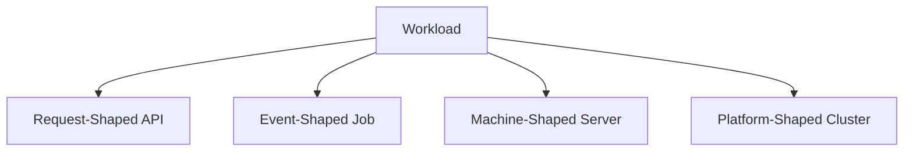
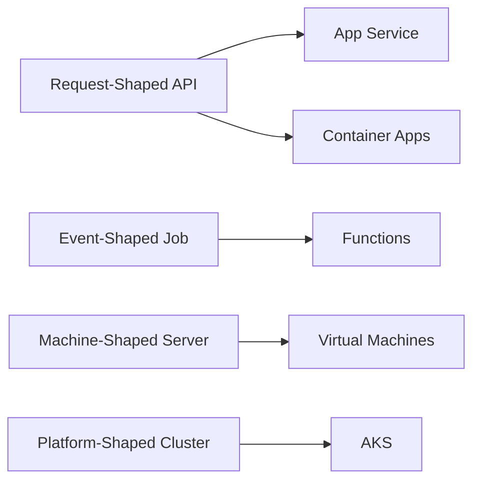
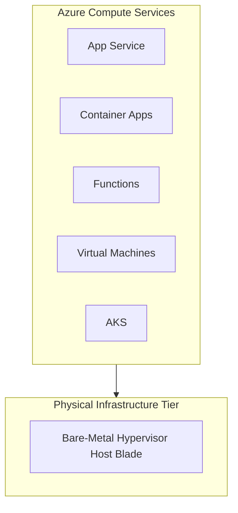

## Table of Contents

1. [What Is Compute](#what-is-compute)
2. [Workload Shape](#workload-shape)
3. [App Service](#app-service)
4. [Container Apps](#container-apps)
5. [Functions](#functions)
6. [Virtual Machines](#virtual-machines)
7. [AKS](#aks)
8. [Sample Compute Map](#sample-compute-map)
9. [Putting It All Together](#putting-it-all-together)
10. [What's Next](#whats-next)

## What Is Compute

Azure compute is the virtualized platform layer that executes application logic by allocating dynamic processor and memory resources to running guest processes. Rather than choosing a compute service based on product brand names, you should evaluate the runtime contract your workload requires. Every hosting platform in Azure solves a core set of operational needs, but they distribute the ownership boundary differently between your team and Azure. Choosing a compute service means deciding what you deploy, what starts the process, how long it lives, and who manages the runtime environment.

:::expand[Under the Hood: Virtualization and Managed Runtime Boundaries]{kind="design"}
At the base of every cloud deployment sits a physical datacenter filled with server blades. Azure uses a hypervisor layer to run isolated virtual machines on those hosts, and managed compute services build higher-level hosting platforms on top of that capacity.

The useful beginner model is not a specific CPU scheduling algorithm. It is the ownership boundary. A Virtual Machine exposes the guest operating system to you. App Service hides the host and gives you a managed web runtime. Container Apps hides the orchestrator and gives you a container app contract. Functions hides most of the host shape and gives you an event handler contract.
:::

If you are transitioning from AWS, orienting your mental model is straightforward. Azure Virtual Machines map closely to Amazon EC2, Azure Functions maps directly to AWS Lambda, and Azure Kubernetes Service (AKS) matches the role of Amazon EKS. Azure Container Apps (ACA) provides serverless container execution similar to Amazon ECS on AWS Fargate.

Do not assume that network defaults, IAM permissions, or scaling pipelines translate directly between providers. Treat each service as an independent platform with its own API limits, storage dependencies, and networking rules.

| Operational Question | Why It Matters |
| --- | --- |
| What do you deploy? | Source code files, ZIP archives, container images, or VM images dictate your deployment tooling and local pipeline steps. |
| What starts the process? | An incoming HTTP request, a message arriving on a queue, a timer tick, or the Kubernetes control plane scheduler determines the correct trigger model. |
| How long does the process live? | Steady-state web APIs, short-lived batch jobs, and ephemeral event handlers scale and fail differently under load. |
| What does Azure manage? | The more platform details Azure owns (like OS patches and runtime upgrades), the less administrative overhead your team inherits. |
| What must the team still own? | Application configuration, secrets, identities, logging, error handling, and release verification always remain the team's responsibility. |

## Workload Shape

The design of a compute platform begins by matching your application architecture to the workload's operational shape. A single large system often contains multiple distinct components, and each component may deserve a different compute host.

*Start with how the code receives work, then pick the smallest compute service that fits that shape.*

A request-shaped component, like a public HTTP API, must listen continuously for web traffic. It needs to maintain warm instances to prevent startup latency, register with load balancers, expose a public network entry point, and scale up dynamically when concurrent requests spike. A managed web platform such as App Service is highly effective when you want to deploy raw application code and let the platform manage the operating system, language runtime, web front ends, and host patching. If you package your application as a container image and want container-native scaling without managing Kubernetes YAML, Container Apps provides a container-first request-driven runtime.

An event-shaped component, such as a background process that generates PDF receipts, does not need a public port or a warm server running 24 hours a day. It needs to wake up when a message lands in a queue, process that single unit of work, write to a database, and shut down. If the queue is empty, the compute should scale to zero to prevent idle billing. Azure Functions fits this event-driven pattern because the runtime triggers are natively integrated into the platform's scaling engine.

A machine-shaped component, like a legacy daemon or a database system that requires direct access to custom kernel modules, local disks, and custom OS agents, requires deep administrative access. For these workloads, a Virtual Machine is the correct tool. It gives you a familiar operating system boundary with full root or administrator privileges, allowing you to control local processes, custom scripts, and systemd daemons.

A platform-shaped component, where many containerized microservices share ingress paths, network policies, deployment charts, and common observability tools, represents orchestration-shaped work. When your organization chooses Kubernetes as its unified platform layer, Azure Kubernetes Service (AKS) provides a managed Kubernetes control plane while your team retains full control over pods, namespaces, deployments, and cluster nodes.

This classification separates workloads by their runtime trigger and deployment artifact. Start by identifying the primary way your code receives work, and choose the smallest managed platform that supports that trigger.

## App Service

App Service is Azure's fully managed platform for hosting web applications, REST APIs, and mobile backends. You deploy your raw application code (such as Node.js, Python, Java, or .NET) or a custom container image, and Azure manages the underlying web server, routing, security updates, and operating system updates.

The core of the App Service mental model is the division between two resources: the App Service Plan and the Web App. The App Service Plan represents the physical virtual machine capacity, pricing tier, regional location, and scale limits of your host. The Web App represents the logical application workspace, including environmental settings, connection strings, custom domains, deployment history, and system-assigned managed identities.

If you host five distinct Web Apps on a single App Service Plan, all five applications share the memory, CPU cycles, and network bandwidth of that plan's virtual machines. During a performance incident, you must separate application-specific issues (like memory leaks in one app's code) from plan-level constraints (like CPU exhaustion caused by another app sharing the same plan). Sharing a plan is highly cost-effective for development and testing environments, but production workloads should run on dedicated plans to ensure resource isolation.

## Container Apps

Container Apps is a fully managed serverless platform for deploying and running containerized applications. You package your application code, dependencies, and runtime environment into a standard container image, and Azure manages the underlying Kubernetes infrastructure, container runtime scheduling, and networking details.

The Container Apps architecture introduces three primary concepts: the Environment, the Container App, and the Revision. The Environment serves as a secure network and logging boundary, mapping to a dedicated virtual network subnet. Multiple related container apps (such as a front-end gateway, a processing API, and a background queue worker) run inside the same Environment, allowing them to communicate securely over a shared private network. The Container App represents the individual deployable service, defining the container image tag, exposed ports, ingress rules, and scaling bounds. A Revision is a read-only snapshot of a container app's template; when you update configuration settings or deploy a new image tag, Container Apps creates a new Revision and shifts traffic weight to it according to your release rules.

Container Apps is designed for teams that want the benefits of container packaging, dynamic scaling, and microservice structures without the operational complexity of managing Kubernetes manifests, ingress controllers, or node pool updates. It supports advanced features like scaling to zero when idle and event-driven scaling rules.

## Functions

Azure Functions is an event-driven serverless compute service that executes specialized handlers in response to platform events. Instead of keeping an HTTP listener active indefinitely, a function app remains idle until a configured trigger (such as a queue message, a database change, a blob upload, or a timer tick) invokes your code.

Every function app runs within the context of a hosting plan, which dictates the scaling behavior, virtual network integration, timeout limits, and billing structure of the runtime. Flex Consumption is a strong default for many new event-driven workloads because it supports elastic scaling and virtual network integration, while Consumption, Premium, and Dedicated plans still fit different latency, cost, and hosting requirements. If your workload consists of rapid, independent tasks that can tolerate cold starts, a consumption-style plan can scale out worker instances dynamically to process the backlog and avoid steady idle host charges.

Functions are highly effective for background processing, file transformations, scheduled tasks, and webhook handlers. However, they are a poor default for traditional, steady-state web applications. Forcing a monolithic API into dozens of small event-triggered functions can complicate local debugging, lead to database connection exhaustion, increase cold-start latency, and make log tracking difficult. Use Functions when the event trigger is the natural entryway for the workload.

## Virtual Machines

Virtual Machines represent the traditional Infrastructure as a Service (IaaS) model, where Azure provides virtualized hardware and your team manages the entire guest operating system, runtime installation, process supervision, security patches, and application deployments.

Choosing a Virtual Machine means taking complete ownership of the server's lifecycle. You select the base operating system image, the virtual machine size (which determines the vCPU cores, RAM capacity, and disk throughput), the storage attachments (managed OS and data disks), and the network subnet placement. Inside the guest OS, you must install the runtime, configure process managers like systemd or Windows services to keep the app active on boot, write cron jobs for scheduled tasks, and configure log agents to forward files to a central workspace.

Virtual Machines are the correct hosting choice when your workload requires strict control over the operating system, custom kernel extensions, third-party monitoring agents, direct disk volume mapping, or legacy applications that assume a traditional physical server environment. If your app is a standard web service, managed platforms like App Service or Container Apps remove the administrative burden of patching guest operating systems and managing disk volume lifecycles.

## AKS

Azure Kubernetes Service (AKS) is a managed container orchestration platform that hosts Kubernetes clusters in Azure. Azure manages and maintains the Kubernetes control plane (including the API server, database store, scheduler, and controller managers) at no cost, while your team operates and manages the worker node virtual machine pools where your containers run.

AKS introduces standard Kubernetes primitives to your hosting model. You define workloads using pods (the smallest deployable container units), deployments (which manage pod replicas and update rollouts), services (which provide stable internal network addresses for pods), and ingress resources (which route external HTTP traffic to services). Because nodes are standard Azure VMs grouped in Virtual Machine Scale Sets, your team must configure node sizing, autoscale thresholds, network policy layers, and workload identity tokens to secure pod-to-Azure API communications.

AKS is an enterprise-scale platform designed for organizations that deploy dozens of microservices, require highly complex routing rules, or standardized their pipelines on Kubernetes tools across multiple cloud providers. If you only need to run a few APIs, Container Apps or App Service provides the benefits of container hosting, scaling, and private networking without requiring you to manage node pools, namespace isolations, network plugins, and cluster upgrade cycles.

## Sample Compute Map

To organize these compute services during design reviews, construct a workload map. This map evaluates each application component against its primary runtime trigger, its deployment artifact, and the team's operational responsibility.

*The more control a compute service exposes, the more operating system, scaling, and platform work the team owns.*

| Workload Component | Runtime Shape | Azure Hosting Option | Operational Reason |
| --- | --- | --- | --- |
| Public API Gateway | Request-Shaped | App Service or Container Apps | Needs continuous HTTP ingress, custom domains, and managed TLS certificates without cluster overhead. |
| PDF Receipt Generator | Event-Shaped | Azure Functions (Flex Consumption) | Executes only when a message lands in a queue; scales to zero when empty to eliminate idle host costs. |
| Daily Data Exporter | Scheduled Job | Container Apps Job or Functions | Runs once a day on a timer; requires high CPU for a short duration, then terminates completely. |
| Legacy Inventory Engine | Machine-Shaped | Azure Virtual Machine | Requires custom Linux kernel modules and a local database engine that assumes local disk block controllers. |
| Multi-Service System | Orchestration-Shaped | Azure Kubernetes Service (AKS) | Uses Helm charts, shared ingress proxies, and common network policies managed by a dedicated platform team. |

Use this map to select hosting services from the workload's requirements backward. Avoid standardizing on a single compute service for the entire architecture; choose the smallest managed option that matches each individual component's shape.

:::expand[Standardizing One Compute Tier Across Mixed Workloads]{kind="pitfall"}
A common operational mistake is standardizing on a single compute service (e.g. "everything runs on Azure Functions") to simplify deployment pipelines and local tooling. While standardization looks clean on paper, misfit workloads pay heavy penalties in runtime constraints, timeout failures, and idle server costs.

This directly mirrors the AWS anti-pattern of standardizing entirely on AWS Lambda. Teams frequently run long-running ETL processes or ML training scripts on Lambda, only to hit the hard 15-minute execution timeout and pay exorbitant duration fees, when the task should have been run as a serverless container on ECS Fargate.

Consider this mismatch analysis for a typical application suite:

*   **Before (Single-Tier Misfit):** A background ETL pipeline that parses 50 GB log files is hosted on an Azure Function. On the classic Consumption plan, it repeatedly crashes as it hits the plan's execution timeout or runs out of execution memory, requiring complex split-workarounds.
*   **After (Multi-Tier Alignment):** The small event handlers remain on Azure Functions to benefit from event-driven scaling. The background ETL pipeline is moved to an **Azure Container Apps Job**, which is designed for finite containerized tasks with configurable CPU, memory, replica count, and timeout behavior.

| Workload Type | Ideal Azure Tier | Misfit Penalty if standardizing on Azure Functions |
| :--- | :--- | :--- |
| **Short HTTP API handler** | Azure Functions | **None** (Perfect fit for elastic, serverless scaling) |
| **Long-running background ETL** | Container Apps Job | **Outages** (plan-specific timeout failures, high cold starts, and awkward checkpointing) |
| **Stateful WebSocket server** | App Service or AKS | **High cost** (Functions charge per-millisecond execution, socket holds are expensive) |
| **Legacy systemd background daemon** | Virtual Machine | **Incompatible** (Functions require event-driven code packages) |

**Rule of thumb:** Map each application component to the compute host that matches its physical execution shape. Never compromise a component's architectural integrity just to reuse an existing deployment template or local development CLI workflow.
:::

## Putting It All Together

Evaluating Azure compute requires matching the workload's runtime behavior to the correct level of platform abstraction.

* **Abstracted Infrastructure**: Azure turns physical host capacity into virtual machines and managed platforms with different ownership boundaries.
* **Managed Web Runtimes**: App Service isolates web processes inside an App Service Plan, which acts as a physical VM worker pool. Multiple applications on the same plan share these resources.
* **Serverless Containers**: Container Apps runs containerized applications in a managed environment with built-in ingress, revisions, and event-driven scale rules.
* **Event-Driven Execution**: Azure Functions scales out worker runtimes in response to queue sizes or storage changes managed by a dedicated platform Scale Controller.
* **Virtualized Infrastructure**: Virtual Machines provide full guest OS access and direct hypervisor hardware allocations at the cost of manual operating system updates, process supervision, and patching.
* **Orchestrator Clusters**: AKS hosts complex, multi-container microservice platforms, managing the Kubernetes control plane while exposing node VMSS scale units, pods, and network plugins.

By designing from the trigger backward, you can select compute hosts that minimize operational chores while providing the performance, scale, and isolation your workloads demand.

## What's Next

In the next chapter, we will explore Azure App Service. We will separate the App Service Plan from the Web App, configure environment settings, establish system-assigned managed identities to securely retrieve Key Vault secrets, set up deployment slot swaps, and define scale-out rules.

*Use this as the compute choice map: match the workload shape to the hosting model, then compare operations burden, scaling model, and control level before picking a service.*

---

**References**

- [Azure App Service Overview](https://learn.microsoft.com/en-us/azure/app-service/overview) - Official guide to Azure's managed web hosting platform.
- [Azure Container Apps Overview](https://learn.microsoft.com/en-us/azure/container-apps/overview) - Documentation covering serverless container environments, revisions, and scaling rules.
- [Azure Functions Introduction](https://learn.microsoft.com/en-us/azure/azure-functions/functions-overview) - Guide to event-driven serverless runtimes and Flex Consumption plans.
- [Virtual Machines in Azure](https://learn.microsoft.com/en-us/azure/virtual-machines/overview) - Introduction to Azure's Infrastructure as a Service hosting.
- [Azure Kubernetes Service Documentation](https://learn.microsoft.com/en-us/azure/aks/intro-kubernetes) - Overview of managed cluster operations and control plane architecture.
