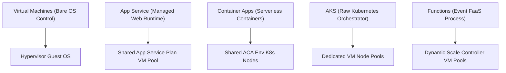

## Table of Contents

1. [The Compute Abstraction Spectrum](#the-compute-abstraction-spectrum)
2. [Comparing Abstraction Models](#comparing-abstraction-models)
3. [Virtual Machines: The IaaS Foundation](#virtual-machines-the-iaas-foundation)
4. [App Service: The Managed Web Platform](#app-service-the-managed-web-platform)
5. [Container Apps: Serverless Container Meshes](#container-apps-serverless-container-meshes)
6. [Azure Kubernetes Service: Enterprise Orchestration](#azure-kubernetes-service-enterprise-orchestration)
7. [Azure Functions: Event-Driven FaaS](#azure-functions-event-driven-faas)
8. [The Commerce Portal Case Study](#the-commerce-portal-case-study)
9. [Putting It All Together](#putting-it-all-together)
10. [What's Next](#whats-next)

## The Compute Abstraction Spectrum

Azure compute is the part of Azure that runs your code. More precisely, it is the virtualized platform layer that executes application logic by allocating processor cycles and memory segments to running guest processes. Rather than choosing a compute service based on product brand names, you must evaluate the runtime contract your workload requires. Every hosting platform in Azure solves a core set of operational needs, but they distribute the ownership boundary differently between your team and Azure.

When you design a cloud architecture, you face a direct trade-off between control and convenience. If you select a service that gives you total control, you inherit the chore of patching operating systems, configuring network ports, and maintaining runtime runtimes. If you select a fully managed service, you delegate these tasks to Azure, but you must conform your application code to the platform's specific execution boundaries.

To illustrate these trade-offs, we follow a team building a multi-tier commerce portal. The portal consists of a public-facing Node.js web storefront, a legacy inventory daemon requiring custom kernel parameters, a serverless checkout microservice, and an event-driven image processing engine.

Before diving into each service, compare the primary commands used to deploy these different compute SKUs:

```plain
az vm create --resource-group rg-commerce-prod --name vm-inventory --image Ubuntu2204 --size Standard_D2s_v5 --subnet snet-inventory
az webapp create --resource-group rg-commerce-prod --plan plan-storefront --name app-storefront --runtime "NODE:20-lts"
az containerapp create --resource-group rg-commerce-prod --environment env-microservices --name app-checkout --image checkout:v1
```

Each of these commands initiates a fundamentally different virtualization model on Azure's hypervisor host blades.



## Comparing Abstraction Models

A compute abstraction model is the amount of infrastructure Azure hides from you. Lower models give you more control over the operating system and network details, while higher models let you focus on code, containers, or event handlers.

Example: a legacy inventory daemon that needs custom kernel settings fits a VM, while a receipt thumbnail processor that only runs after a blob upload fits Azure Functions.

Choosing the correct compute model requires analyzing multiple design parameters. The following comparison matrix evaluates key decision vectors across each abstraction layer:

| Compute Service | Deployment Unit | OS Control | Scaling Time | Scaling Trigger | VNet Integration |
| --- | --- | --- | --- | --- | --- |
| **Virtual Machines** | OS Image | Complete | Minutes | CPU / Memory metrics | Native Subnet |
| **App Service** | Code / Container | None | Seconds | CPU / Memory / HTTP | VNet Integration |
| **Container Apps** | Container Image | None | Sub-second | HTTP / Event Queue / KEDA | VNet Subnet injection |
| **AKS** | Container Image | Pod-level | Seconds | CPU / Pod scheduling | Azure CNI / Kubenet |
| **Functions** | Single Code Handler | None | Milliseconds | Platform Event / Timer | Flex Consumption VNet |

Evaluating these vectors ensures that your team selects the smallest managed platform that can fulfill the workload's performance and control requirements.

## Virtual Machines: The IaaS Foundation

Azure Virtual Machines are the server-shaped compute tier where your team owns the guest operating system. The highest control tier in Azure compute is Infrastructure as a Service (IaaS), delivered through Azure Virtual Machines. When you deploy a Virtual Machine, Azure allocates CPU cores, RAM segments, and storage attachments on a physical hypervisor host, then hands you the root or administrator credentials.

This model is excellent for legacy software because it replicates a traditional physical server environment. In our commerce portal, the legacy inventory daemon cannot run on a managed web platform. It requires direct access to custom Linux kernel extensions, mounts specific local SSD block storage volumes, and expects a permanent background daemon to manage local sockets.

### Sizing and Physical Managed Disks

A VM size is the hardware profile for the guest server: CPU cores, memory, local temporary storage, disk throughput, and network throughput. Picking the size is like picking the server class before installing the operating system.

Example: `Standard_D2s_v5` can fit a small web backend, while a memory-heavy cache or database may need an `E` series size with more RAM per CPU core.

Azure groups VMs into SKU series:

*   **D-Series**: General-purpose compute, providing a balanced ratio of CPU to memory for web servers and small databases.
*   **E-Series**: Memory-optimized configurations, designed for high-throughput relational databases and in-memory caches.
*   **F-Series**: Compute-optimized units, built for high-performance batch processing or media encoding.

Once sized, you must attach an Azure Managed Disk to act as the persistent OS and data volumes. Unlike physical drives, managed disks are virtualized block devices backed by Azure Storage, providing built-in durability and replication.

While Virtual Machines offer total control, they introduce massive operational overhead. Your team must configure automated patching pipelines, monitor operating system logs, write custom systemd unit files to restart the daemon on boot, and manage host scaling limits.

### Declarative VM Configuration Example

You can deploy and configure an Azure Virtual Machine and its required network interface using Bicep. The following sample Bicep template defines a virtual network subnet integration, a dynamic network interface, and a Standard D2s v5 Ubuntu Linux Virtual Machine:

```bicep
resource nic 'Microsoft.Network/networkInterfaces@2023-09-01' = {
  name: 'nic-inventory-prod'
  location: 'eastus'
  properties: {
    ipConfigurations: [
      {
        name: 'ipconfig1'
        properties: {
          privateIPAllocationMethod: 'Dynamic'
          subnet: {
            id: resourceId('Microsoft.Network/virtualNetworks/subnets', 'vnet-prod', 'snet-inventory')
          }
        }
      }
    ]
  }
}

resource vm 'Microsoft.Compute/virtualMachines@2023-09-01' = {
  name: 'vm-inventory-prod'
  location: 'eastus'
  properties: {
    hardwareProfile: {
      vmSize: 'Standard_D2s_v5'
    }
    osProfile: {
      computerName: 'vminventory'
      adminUsername: 'azureuser'
      linuxConfiguration: {
        disablePasswordAuthentication: true
        ssh: {
          publicKeys: [
            {
              path: '/home/azureuser/.ssh/authorized_keys'
              keyData: 'ssh-rsa AAAAB3NzaC1yc2EAAAADAQABAAACAQ...'
            }
          ]
        }
      }
    }
    storageProfile: {
      imageReference: {
        publisher: 'Canonical'
        offer: '0001-com-ubuntu-server-jammy'
        sku: '22_04-lts'
        version: 'latest'
      }
      osDisk: {
        name: 'disk-inventory-os'
        createOption: 'FromImage'
        managedDisk: {
          storageAccountType: 'Premium_LRS'
        }
      }
    }
    networkProfile: {
      networkInterfaces: [
        {
          id: nic.id
        }
      ]
    }
  }
}
```

This administrative burden leads to the next architectural question: what if we want to run our public storefront application without managing a single operating system patch? This question bridges the design from Virtual Machines to App Service.

## App Service: The Managed Web Platform

Azure App Service is a Platform as a Service (PaaS) hosting engine specifically optimized for running steady-state web applications, REST APIs, and mobile backends. Instead of deploying a full operating system image, you deploy your raw application code files or custom container images, and Azure operates the web server and the underlying host.

### Decoupling Plans from Web Apps

In App Service, the plan and the app are different resources. The plan provides worker capacity, while the Web App stores the runtime profile for one application.

Example: `asp-storefront-prod` can provide CPU and memory for both `web-storefront` and `api-storefront`, but each Web App has its own settings, hostname, and managed identity.

To operate App Service successfully, keep that separation clear:

*   **App Service Plan**: Represents the physical VM worker pool. It dictates the CPU capacity, memory allocation, regional placement, and instance scale limits of your host.
*   **Web App**: Represents the logical execution context. It holds environment variables, connection strings, custom DNS bindings, SSL certificates, and managed identity configurations.

If you host multiple Web Apps on a single App Service Plan, they share the physical RAM and CPU cycles of that plan's instances. During a performance incident, you must separate application-specific code bottlenecks from plan-level resource exhaustion.

```plain
App Service Plan (Standard S1: 1 VM Instance, 1.75 GB RAM)
  ├── Web App A (Storefront Frontend) ──> Consumes 800 MB RAM
  ├── Web App B (Admin Portal)      ──> Consumes 500 MB RAM
  └── Web App C (Reporting Tool)    ──> Consumes 400 MB RAM (Exhausts Instance Memory)
```

App Service handles OS security patches, web server performance tuning, and SSL bindings. However, the storefront application operates as a steady-state process. The plan always maintains at least one active VM instance, running continuously to handle incoming user traffic.

This steady-state model is a poor fit for microservices that experience volatile traffic spikes, or components that should scale to zero to prevent idle billing when no users are active. This operational limitation bridges the design from App Service to Container Apps.

## Container Apps: Serverless Container Meshes

Azure Container Apps is the managed container runtime for teams that want to run Docker images without operating a Kubernetes cluster. It is a serverless hosting platform built on Kubernetes, optimized for deploying microservice architectures packaged as standard Docker images. It removes the operational complexity of managing raw Kubernetes clusters while providing container-native scaling, traffic routing, and private network meshes.

### Environments, Revisions, and KEDA

Container Apps has three main resource concepts to anchor first: the shared environment, the deployable app, and the immutable revision. The Container Apps architecture uses these primitives to structure your microservices:

1.  **Environment**: A secure network and logging boundary. Multiple container apps within the same environment share the same private Virtual Network subnet, allowing secure, high-speed, local inter-container communication.
2.  **Container App**: The individual service unit. It declares the container image tag, CPU/memory allocations, scale limits, and active ingress rules.
3.  **Revision**: An immutable, read-only snapshot of a container app configuration. When you deploy a new container tag, the platform generates a new Revision, allowing you to split traffic between revisions to perform canary testing.

Under the hood, Container Apps uses Kubernetes Event-driven Autoscaling (KEDA) to monitor event sources like message queues, HTTP request concurrency rates, or CPU metrics. If our commerce checkout microservice experiences no traffic, KEDA dynamically scales the container instances down to zero, stopping all billing. The moment an HTTP request or a checkout queue message arrives, the KEDA scale controller spins up a container to process the request.

Furthermore, Container Apps includes native Distributed Application Runtime (Dapr) integration. Dapr runs as a helper sidecar container alongside your application, managing mutual TLS (mTLS) encryption, service discovery, and state tracking without requiring your code to manage security handshakes or hardcode network IP addresses.

While Container Apps is excellent for microservice meshes, it operates within structured platform boundaries. When your microservice fleet expands to hundreds of container replicas requiring advanced custom scheduling rules, custom ingress controllers, and native Kubernetes APIs, Container Apps becomes too restrictive. This scaling challenge bridges the design to Azure Kubernetes Service.

## Azure Kubernetes Service: Enterprise Orchestration

Azure Kubernetes Service is the managed Kubernetes option for teams that need direct Kubernetes APIs and cluster-level control. It is a managed container orchestration engine that hosts Kubernetes clusters in Azure. While Container Apps hides the underlying orchestrator, AKS exposes the raw Kubernetes API, giving your platform engineering team complete control over pod scheduling, network namespace isolation, and cluster node groups.

### Control Planes, Node Pools, and Network Plugins

An AKS cluster has a management side and a worker side. Azure operates the control plane, which is the API and coordination layer, while your worker node pools run the actual containers in your subscription.

Example: when you apply a Deployment for `orders-api`, the control plane records the desired replica count, and the scheduler places pods onto VM nodes in a node pool such as `np-user-prod`.

Operating an AKS cluster requires understanding the physical split between the control plane and the worker nodes:

*   **Managed Control Plane**: Azure operates the Kubernetes API server, the etcd state database, the controller manager, and the scheduler. This control plane is managed, patched, and secured by Azure at no charge.
*   **Worker Node Pools**: Your team deploys and manages node pools, which are Virtual Machine Scale Sets (VMSS) running inside your private subnets. You pay for the virtual machines and retain control over their sizing, OS images, and scaling limits.

AKS offers two primary network plugins to govern how pods communicate:

*   **Kubenet**: A basic routing model where pods receive private IP addresses from a separate, isolated overlay network. The host node acts as a NAT gateway to route packets into the VNet. This saves VNet IP address allocations but introduces small network address translation overhead.
*   **Azure CNI**: A high-performance networking model where every pod receives a real, routable IP address directly from your Virtual Network subnets. This eliminates NAT latencies but requires careful subnet allocation to prevent IP address exhaustion during scaling events.

To secure access to other Azure resources, AKS implements Microsoft Entra Workload ID. Under this design, you map a Kubernetes Service Account to an Entra Managed Identity using a federated token credential handshake. The containerized application requests a token from the local Kubernetes API, which authenticates against Entra ID to retrieve a security token, avoiding hardcoded passwords.

AKS gives the most container hosting control in this module, but it requires a dedicated operations team to manage namespace limits, helm chart updates, CNI address allocations, and node OS upgrades.

In our commerce portal, we have one remaining component: the image processing engine. It needs to wake up, resize an uploaded product image, and terminate immediately. Running an entire AKS pod or a steady container app just to wait for image uploads introduces unnecessary cost and boilerplate. This event-triggered pattern bridges the design to Azure Functions.

## Azure Functions: Event-Driven FaaS

Azure Functions is the event-handler option for code that should wake up only when a trigger fires. It is a serverless, event-driven Function as a Service (FaaS) platform designed to execute single blocks of application code in response to specific system triggers. Instead of running a persistent HTTP socket listener, the Function runtime remains completely idle until a platform event invokes your handler.

### Triggers and Output Bindings

A trigger is the event source that starts a function, and a binding is the connection that reads or writes supporting data. Keeping those two ideas separate makes the function easier to reason about.

Example: a blob upload trigger can start `GenerateThumbnail`, while an output binding writes the resized image to a different storage container.

Operating Azure Functions cleanly requires separating the invocation trigger from the data bindings:

*   **Triggers**: Declare what starts the function execution. Common triggers include HTTP requests, timer schedules, Azure Blob Storage uploads, Cosmos DB document updates, or Service Bus queue messages.
*   **Bindings**: Define the input and output data connections, eliminating heavy SDK initialization boilerplate.

For example, when a user uploads a product image, the function runs. Using an input binding, the platform automatically downloads the uploaded blob file and passes it as a byte array parameter directly to your function code. Using an output binding, the function simply returns the resized image bytes, and the platform writes it directly to the target storage account:

```plain
Upload Event ──> Blob Trigger ──> [Function Code] ──> Output Binding ──> Thumbnail Storage
```

No connection strings, credentials, or SDK clients are initialized inside your source code, maintaining complete separation between application logic and physical network endpoints.

### Serverless Event Handler Code Example

You can implement an event-driven thumbnail processor using Azure Functions Node.js programming model. The following JavaScript function binds directly to an incoming blob upload trigger, processes the buffer, and outputs the result:

```javascript
const { app } = require('@azure/functions');

app.storageBlob('resize-image', {
  path: 'products/{name}',
  connection: 'AzureWebJobsStorage',
  handler: async (blob, context) => {
    context.log(`Processing blob: ${context.triggerMetadata.name}`);
    const resizedBlob = await resizeImage(blob);
    return resizedBlob;
  }
});
```

Azure Functions offers a Flex Consumption plan, which provides elastic, serverless scaling, cold-start latency mitigations, and private Virtual Network integration. However, you must avoid standardizing your entire architecture on Functions. Standardizing on FaaS for long-running batch jobs, ETL processes, or stateful WebSocket servers leads to frequent execution timeout failures, high cold-start latency spikes, and severe database connection pool exhaustion.

## The Commerce Portal Case Study

To guide your compute design reviews, construct a workload map. This map matches each commerce portal component to its primary runtime trigger, its deployment artifact, and the team's operational responsibility:

| Component | Workload Shape | Azure Hosting Service | Architectural Rationale |
| --- | --- | --- | --- |
| Legacy Inventory Daemon | Machine-Shaped | Azure Virtual Machine | Requires custom Linux kernel parameters and persistent block disk attachments. |
| Storefront Frontend | Request-Shaped | Azure App Service | Steady-state Node.js web app requiring simple HTTP routing and managed patching. |
| Checkout Microservice | Request-Shaped | Azure Container App | Containerized microservice requiring scale-to-zero capability and Dapr service discovery. |
| Enterprise Core Services | Platform-Shaped | Azure Kubernetes Service | Massive fleet requiring custom ingress controllers, Helm packaging, and deep namespace controls. |
| Image Resizer Engine | Event-Shaped | Azure Functions | Purely event-triggered task executing in milliseconds; scales to zero when idle. |

Use this case study to select compute services from the application's physical execution shape backward.

## Putting It All Together

Designing a resilient cloud architecture requires selecting the correct level of compute abstraction for each individual workload:

*   **Select Control by Requirement**: Use Virtual Machines for legacy stateful workloads needing root OS access, and managed platforms to delegate operating system patching to Azure.
*   **Decouple App Service Plans**: Run development Web Apps on shared App Service Plans to optimize costs, separating production Web Apps onto dedicated plans to prevent resource contention.
*   **Leverage KEDA for Container scaling**: Deploy serverless containers on Container Apps to benefit from scale-to-zero dynamics, using KEDA queue triggers to handle volatile traffic spikes.
*   **Separate AKS Control Planes**: Maintain cluster architecture hygiene by delegating control plane maintenance to Azure, sizing node pools dynamically to handle pod placement.
*   **Eliminate Boilerplate with Bindings**: Implement Azure Functions for short, event-triggered tasks, using input and output bindings to separate database credentials from application logic.

## What's Next

Now that we have mapped the Azure compute landscape, we will explore Azure Virtual Machines in depth. In the next chapter, we will select VM sizing series, manage OS and data disks, configure virtual machine scale sets, and write custom script extensions to automate database VM boot sequences.

---

* [Azure App Service Overview](https://learn.microsoft.com/en-us/azure/app-service/overview) - Official guide to Azure's managed web hosting platform.
* [Azure Container Apps Overview](https://learn.microsoft.com/en-us/azure/container-apps/overview) - Documentation covering serverless container environments, revisions, and scaling rules.
* [Azure Functions Introduction](https://learn.microsoft.com/en-us/azure/azure-functions/functions-overview) - Guide to event-driven serverless runtimes and Flex Consumption plans.
* [Virtual Machines in Azure](https://learn.microsoft.com/en-us/azure/virtual-machines/overview) - Introduction to Azure's Infrastructure as a Service hosting.
* [Azure Kubernetes Service Documentation](https://learn.microsoft.com/en-us/azure/aks/intro-kubernetes) - Overview of managed cluster operations and control plane architecture.
