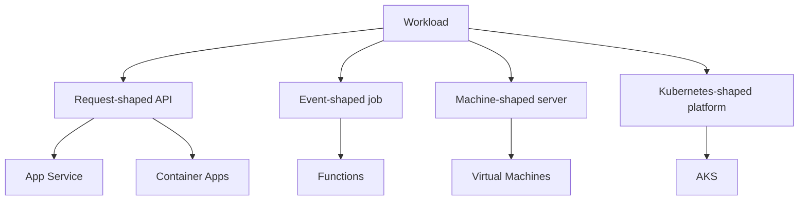

## Table of Contents

1. [The Problem](#the-problem)
2. [What Is Compute](#what-is-compute)
3. [Workload Shape](#workload-shape)
4. [App Service](#app-service)
5. [Container Apps](#container-apps)
6. [Functions](#functions)
7. [Virtual Machines](#virtual-machines)
8. [AKS](#aks)
9. [Sample Compute Map](#sample-compute-map)
10. [Putting It All Together](#putting-it-all-together)
11. [What's Next](#whats-next)

## The Problem

A team has a checkout backend running on a laptop. It starts with `npm run dev`, talks to a database, sends receipts, and exposes one HTTP API to the frontend. The code works. The harder question is where it should run after it leaves the laptop.

The first Azure compute choice looks simple until the workload splits:

- The public API receives requests all day and needs predictable logs, health checks, secrets, and scaling.
- The receipt sender should run only when a queue message arrives.
- A monthly export job needs more CPU for a short window, then should stop costing money.
- One legacy worker needs a custom Linux package and a process manager the team already understands.
- A platform team asks whether the service should join a Kubernetes cluster with shared ingress, policies, and deployment tooling.

All of these are "compute" problems, but they do not want the same hosting shape. Compute is the operating contract around your code: who starts it, where configuration lives, how traffic reaches it, what wakes it up, how it scales, how it logs, and who owns the runtime when it misbehaves.

This article builds the first mental model for Azure compute. The goal is to look at a workload and say, "this is a web app, this is a containerized service, this is event work, this is a server, and this is Kubernetes-shaped platform work."

## What Is Compute

Compute is the Azure layer that turns code or an image into a running process. A deployment pipeline can build an artifact, and a database can store state, but neither one runs the application loop. Compute is the place where the process starts, receives work, uses memory and CPU, emits logs, and either stays alive or exits.

That sounds obvious, but it prevents a common beginner mistake. Many teams choose compute by product name. They ask whether App Service, Container Apps, Functions, Virtual Machines, or AKS is "best." A better question is what the workload needs Azure to do.

Every compute service answers the same small set of runtime questions:

| Question | Why it matters |
| --- | --- |
| What do you deploy? | Source code, a zip, a container image, a VM image, or Kubernetes manifests each imply a different operating model. |
| What starts the work? | HTTP traffic, a queue message, a timer, a system service, or the Kubernetes scheduler changes the right host. |
| How long does it live? | Always-on APIs, short jobs, and event handlers scale and fail differently. |
| What does Azure manage? | The less server surface you own, the less patching and orchestration work you inherit. |
| What must the team still own? | App settings, secrets, identity, health, logs, retries, and release safety never disappear. They move to different places. |

If you know AWS, the first orientation is useful but imperfect. Azure Virtual Machines feel closest to EC2. Functions are closest to Lambda. AKS is Azure's managed Kubernetes service, so it belongs in the same mental bucket as EKS. Container Apps often solves the learner problem that ECS on Fargate solves: run containers without making a team operate raw servers first. App Service has no single perfect AWS twin. Treat it as Azure's managed web application platform rather than forcing a one-to-one translation.

The careful part is that the responsibility lines are provider-specific. Do not assume the AWS deployment flow, identity model, networking defaults, or scaling rules carry over. Use the comparison to recognize the workload shape, then read the Azure service on its own terms.

## Workload Shape

Start with the shape of the work. A checkout system might contain several pieces, and each piece can deserve a different host.

The public API is request-shaped. It listens for HTTP traffic, returns responses, and should usually have a small number of warm instances ready. A managed web runtime such as App Service can be a good fit when the team wants to bring code and let Azure own much of the web host. Container Apps can be a good fit when the team already ships a container image and wants container-native scaling and revisions without running a Kubernetes cluster.

The receipt sender is event-shaped. It does not need to listen on a public port all day. It needs to wake up when a queue message arrives, process one unit of work, and leave a clear retry trail when something fails. Azure Functions fits this kind of work because the trigger is part of the runtime contract.

The legacy worker is machine-shaped. If the team needs SSH, a specific operating system layout, custom agents, long-lived local processes, or direct package installation, a virtual machine may be honest. It gives the team a familiar server boundary with more runtime ownership than the managed application platforms.

The platform cluster is orchestration-shaped. If many services already use Kubernetes concepts such as pods, deployments, services, ingress controllers, Helm charts, admission policies, and node pools, AKS can give Azure-managed Kubernetes control plane support while the team keeps Kubernetes as the operating layer.

This split is deliberately plain. You can add nuance later, but the first decision should not require a service catalog. Ask what wakes the code, what artifact you deploy, and what your team wants to operate.

## App Service

App Service is Azure's managed home for web apps, REST APIs, and mobile backends. You bring application code or a custom container. Azure gives you a web hosting platform that handles much of the underlying server work.

The useful beginner model has two nouns. The App Service plan is the pool of compute capacity and pricing tier. The web app is the application resource that runs on that plan. If three web apps share one plan, they share that plan's capacity. Scaling the plan changes the capacity available to the apps that use it.

This distinction matters during incidents. A slow web app may have bad code, missing settings, or a failing dependency. It may also be sharing a plan with another app that consumes the workers. "The app is slow" and "the plan is saturated" lead to different fixes.

App Service is often a good first Azure host when the workload is a normal HTTP application and the team does not need a container-first or Kubernetes-first operating model. It gives the team app settings, managed identity support, deployment slots, custom domains, TLS, logs, health checks, and scale controls in a web-platform shape.

## Container Apps

Container Apps is for running containerized applications while Azure hides much of the server and orchestration surface. You bring a container image. Azure runs it inside a Container Apps environment, gives the app ingress if you need a network entry point, manages revisions when you deploy new versions, and can scale based on HTTP traffic, events, CPU, memory, or KEDA-supported signals.

The key word is container. Container Apps does not remove the need to build a good image. The image still needs the right startup command, target port, dependencies, and graceful shutdown behavior. If the image crashes locally, it will not become healthy just because Azure hosts it.

Container Apps is a strong fit for a team that already builds images but does not want Kubernetes to be the first production lesson. It works well for APIs, background workers, microservices, and event-driven container jobs. The cost shape can also be attractive for workloads that scale down when idle, but there is a gotcha: not every scaling signal can go to zero. For example, CPU or memory based scaling needs a running instance to measure.

If AWS is in your head, think "container service without managing the cluster first." Then stop and learn Azure's own nouns: environment, container app, revision, ingress, secret, identity, and scale rule.

## Functions

Azure Functions is for code that starts because something happened. A request arrived. A queue message appeared. A blob changed. A timer fired. The trigger is not an afterthought; it is the front door of the runtime.

That makes Functions a bad default for every backend and a very good fit for small event-shaped jobs. A receipt sender can be a function because each message is a unit of work. A nightly cleanup can be a timer-triggered function. A file processor can react when storage receives a new object.

The non-obvious part is that Functions still has a host. A function app groups functions together, carries settings, connects to Application Insights, and runs on a hosting plan. That plan affects cold starts, scaling, network integration, maximum duration, and cost. Serverless does not mean "no runtime details." It means Azure manages more of the runtime and asks you to design around triggers, retries, idempotency, timeouts, and dependencies.

Functions are closest to AWS Lambda in the broad mental model, but Azure's triggers and bindings are more visible in the programming model. Use that strength for event work. Avoid turning a steady web service into a pile of functions just because the word "serverless" sounds smaller.

## Virtual Machines

Virtual Machines are the most familiar Azure compute shape: a cloud server with an operating system, disks, network interfaces, and processes you manage. You do not buy the physical hardware, but you still own much of the server's life.

That ownership is the point. A VM is useful when the workload needs control that managed app platforms do not expose. You might need a custom kernel module, a commercial agent, a specific daemon, a migration bridge, or a legacy process that assumes a traditional host. A VM can also be useful for learning because it makes the server boundary visible.

The cost of that control is chores. Someone must patch the OS, configure the firewall and network security group, manage disks, rotate access, supervise the process, collect logs, back up state, and decide how the machine recovers when it fails. Azure gives you the virtualized server and supporting resources. It does not turn the operating system into a managed application platform by itself.

This is where "use a VM because it is simple" can mislead. A VM is simple to understand, but not always simple to operate. It is the right choice when direct server control is a requirement, not when the team has not yet described the workload.

## AKS

Azure Kubernetes Service, or AKS, is Azure's managed Kubernetes service. Azure manages much of the Kubernetes control plane for you. Your team still operates Kubernetes as the application platform: node pools, pods, deployments, services, ingress, upgrades, policies, identities, logs, and the application manifests that describe desired state.

AKS is a different operating layer from Container Apps. Container Apps lets a team run containers through Azure-native container app resources. AKS gives a team Kubernetes primitives and expects the team to understand them. That can be exactly right when the organization already standardizes on Kubernetes or needs portable Kubernetes tooling across many services.

The first Kubernetes nouns matter:

| AKS piece | Beginner meaning |
| --- | --- |
| Cluster | The Kubernetes environment where workloads are scheduled and managed. |
| Control plane | The managed Kubernetes brain that stores desired state and coordinates the cluster. |
| Node pool | A group of worker VMs where pods run. |
| Pod | The smallest deployable unit, usually one app container plus its close companions. |
| Deployment | The desired number and version of pods for a service. |
| Service | A stable internal network name and address for changing pods. |
| Ingress | The HTTP entry pattern that routes outside traffic into services. |

AKS fits when Kubernetes is part of the architecture, not when a single API merely needs somewhere to run. The control plane may be managed, but the platform choices around nodes, upgrades, workload identity, network policy, ingress, and observability still belong to the team.

## Sample Compute Map

Return to the checkout system from the opener. A reasonable first Azure map might look like this:

| Workload | Runtime shape | Azure starting point | Why |
| --- | --- | --- | --- |
| Checkout HTTP API | Request-shaped web service | App Service or Container Apps | Needs steady HTTP entry, app settings, logs, identity, and health checks. |
| Receipt sender | Event-shaped job | Functions | Runs per queue message and should retry per message. |
| Monthly export | Batch or scheduled work | Container Apps job or Functions | Needs short bursts of compute rather than an always-on server. |
| Legacy worker | Machine-shaped process | Virtual Machine | Needs OS-level customization that managed runtimes may not expose. |
| Shared platform services | Kubernetes-shaped platform | AKS | Makes sense only if the team is intentionally operating Kubernetes. |

This map is not a universal answer. It is a way to talk about responsibility. For each row, name what the team deploys, what starts the work, what must stay warm, what can scale to zero, where secrets live, how identity is assigned, and which logs prove the runtime is alive.

The first safe choice is usually the smallest managed runtime that honestly fits the workload. Use App Service for a normal web app when you do not need container orchestration. Use Container Apps when the image and scale model are central. Use Functions when the trigger is the shape of the work. Use VMs when server control is a real requirement. Use AKS when Kubernetes is the platform, not because Kubernetes sounds more advanced.

## Putting It All Together

The opener had five pieces of work, and now each one has a clearer home.

The public API is a request-shaped runtime with traffic, health, settings, identity, logs, and scale. That points first to App Service or Container Apps, depending on whether the team is bringing app code or a container image.

The receipt sender is not a smaller API. It is event-shaped work. Functions makes the trigger part of the runtime and keeps the unit of retry close to the unit of work.

The monthly export is not a reason to keep a server warm all month. It can use compute that starts for the job and scales back down when the job is done.

The legacy worker is allowed to be a VM if the server requirements are real. The tradeoff is that the team must own the operating system and process lifecycle.

The Kubernetes question is separate. AKS is a good answer when the organization wants Kubernetes as the operating platform. It is extra burden when the team only needs one containerized service to run.

That is the Azure compute mental model: choose from the workload backward, and make the ownership boundary visible before deployment.

## What's Next

The next article starts with the most common managed web-app choice: App Service. We will separate the App Service plan from the web app, then look at runtime settings, managed identity, slots, logs, health, and scaling.

---

**References**

- [Overview of Azure App Service](https://learn.microsoft.com/en-us/azure/app-service/overview)
- [Azure Container Apps overview](https://learn.microsoft.com/en-us/azure/container-apps/overview)
- [What is Azure Functions?](https://learn.microsoft.com/en-us/azure/azure-functions/functions-overview)
- [Virtual machines in Azure](https://learn.microsoft.com/en-us/azure/virtual-machines/overview)
- [What is Azure Kubernetes Service (AKS)?](https://learn.microsoft.com/en-us/azure/aks/what-is-aks)
