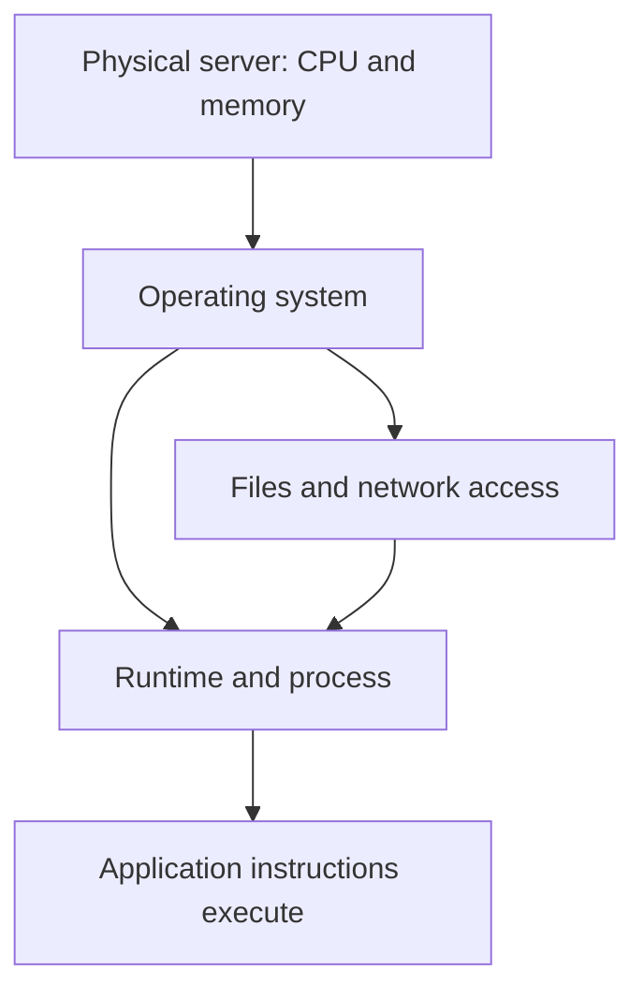
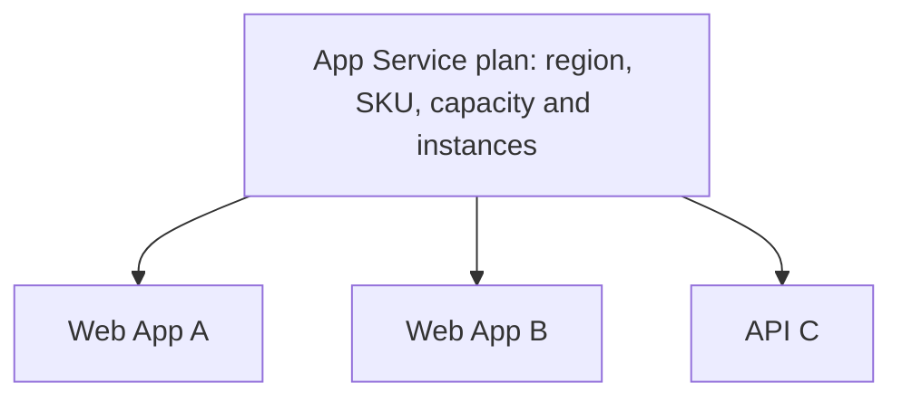
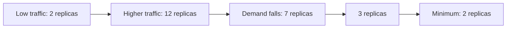
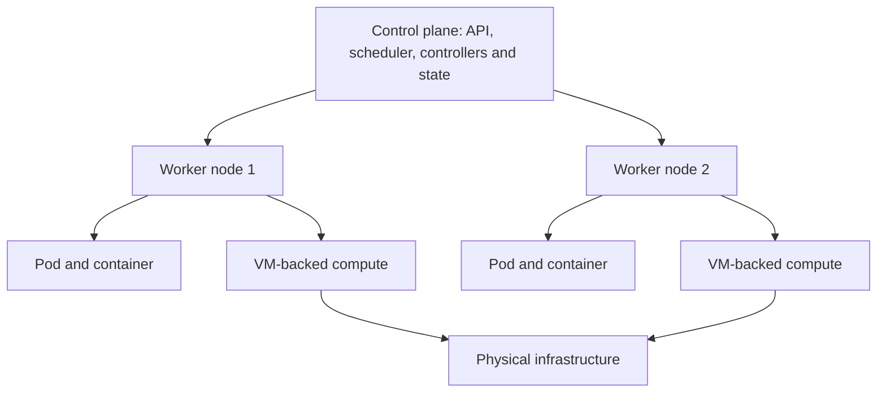

## Table of Contents

1. [What Does Compute Provide to Code?](#what-does-compute-provide-to-code)
2. [When Do Virtual Machines Fit?](#when-do-virtual-machines-fit)
3. [When Does App Service Fit?](#when-does-app-service-fit)
4. [When Do Container Apps and Functions Fit?](#when-do-container-apps-and-functions-fit)
5. [When Does AKS Fit?](#when-does-aks-fit)
6. [How Do You Map Workloads to Compute?](#how-do-you-map-workloads-to-compute)
7. [What Runtime Evidence Confirms the Choice?](#what-runtime-evidence-confirms-the-choice)
8. [Check Your Answers](#check-your-answers)

Running `python app.py` on a laptop starts a process. That process uses the laptop's processor and memory, reads files, and communicates over the network. Running the same application in Azure still requires those resources. A cloud service changes how you ask for them and how much of the surrounding machinery you have to maintain.

That is why Azure offers several ways to run code. A program that requires its own Windows Server installation needs a different environment from a function that resizes an image after an upload. Both ultimately execute instructions on physical processors. The useful differences are **which layers Azure manages, what you deploy, and what the platform adds when the workload grows**.

Keep the running program in mind as you compare the services. The questions below connect each product to the work it actually performs:

1. **What Does Compute Provide to Code?**
2. **When Do Virtual Machines Fit?**
3. **When Does App Service Fit?**
4. **When Do Container Apps and Functions Fit?**
5. **When Does AKS Fit?**
6. **How Do You Map Workloads to Compute?**
7. **What Runtime Evidence Confirms the Choice?**

## What Does Compute Provide to Code?
<!-- section-summary: Compute gives a running process CPU, memory, an operating environment, and access to networking and storage; code and deployment artifacts need that environment before they can do work. -->

Consider a simple calculation in application code:

```python
price = quantity * unit_price
```

The text expresses an operation, but the text itself cannot perform the multiplication. The running program must eventually cause a processor to load values, multiply them, and store the result. A simplified instruction sequence makes that physical work visible:

```text
load quantity
load unit_price
multiply
store result
```

Every Azure compute service ultimately supplies a way for that execution to happen. The service may expose a complete virtual machine, a web application, a container, a function invocation, or a Kubernetes workload. Underneath those different interfaces, an operating system and runtime still organize the work that consumes CPU and memory.


```mermaid
flowchart TD
    A[Physical server: CPU and memory] --> B[Operating system]
    B --> C[Runtime and process]
    C --> D[Application instructions execute]
    B --> E[Files and network access]
    E --> C
```

### Start with a process

A physical computer contains a CPU, RAM, storage, and a network adapter. Its operating system coordinates those resources. When you run the following command, the operating system creates a process for the Python application:

```bash
python app.py
```

A **process** is a running instance of a program. It receives CPU time and memory, and it can use facilities such as files, network connections, environment variables, and system calls. A system call is a request from the program to the operating system, such as asking it to read a file. These are the basic services that allow application code to interact with its environment.

This gives us a practical definition of compute: **an execution environment where a process can use CPU and memory and interact with the operating system, networking, and storage**. The definition applies to your laptop and to the infrastructure underneath Azure's managed services. The cloud changes who prepares and operates that environment.

### Separate an artifact from a running instance

An `app.py` file stored in GitHub contains code, but no application process is running merely because that file exists. Packaging it as the container image `myapp:v14` also does not start it. Uploading that image to Azure Container Registry gives you a place to store and retrieve the package; it still does not execute the application.

Execution begins when a compute environment uses the package to start a process. That sequence explains several distinctions that matter during troubleshooting:

| Stored or declared object | Running work associated with it |
|---|---|
| Source code | An application instance executing that code |
| Container image | A running container created from the image |
| VM image | A virtual machine created using the image |
| Function code | A particular function invocation |
| Kubernetes Deployment | Pods created and maintained to carry out the desired workload |

A **container image** packages an application's environment. A **container** is an instance of that package in execution. Similarly, a deployment declaration describes what should run; the declaration is not proof that the corresponding process is already doing useful work. The distinction tells you where to look next when a resource exists but an application does not respond.

### The resources every application needs

The CPU executes the application's instructions. An incoming request might cause the program to validate input, calculate a result, and prepare a response. All of that requires processor time, regardless of whether the application is hosted on a VM or a managed platform.

Memory holds the working information needed during execution: variables, objects, runtime state, caches, buffers, and loaded libraries. A process can fail or be killed if it exceeds the memory available to it. A successful deployment therefore does not establish that the application has enough memory for its real workload.

The **runtime** is the software environment that executes the program. C# commonly relies on .NET, Java on the JVM, Python on its interpreter, and JavaScript on Node.js. Some hosting services provide a supported runtime. With a container, you can package a runtime together with the application. For example, an image can contain a Linux filesystem, Python 3.13, libraries, and your application code.

Networking allows the process to call databases, storage services, APIs, Service Bus, or internet services. For applications that receive requests, it also provides an incoming path. An HTTPS client may connect through port 443 before the hosting platform passes the request to the application. The ability to start a process and the ability to reach it over the network are related requirements, but they need separate checks.

Storage can take several forms: temporary disk, persistent disk, shared files, object storage, or database storage. The right form depends on the information being kept. Temporary working files have different survival requirements from customer records. The process needs access to storage, but durable information does not have to live on the same machine as the process.

For example, a VM with its only copy of customer data in `/data/customer.db` ties the survival of that information to the machine's local arrangement. An application that keeps durable state in Azure SQL, Cosmos DB, Blob Storage, or Azure Files can replace its compute more easily. The application reconnects to the data service rather than requiring every new instance to inherit the old instance's local files.

### Why Azure has several compute services

Between a physical CPU and a business application sit many layers. Someone operates the datacenter's power and cooling, maintains physical servers and virtualization, configures networks, maintains an operating system, applies OS patches, installs runtimes, manages processes, and arranges the web server or container runtime the application needs.

Azure's compute products divide that work in different places. A VM exposes an environment close to an ordinary computer, so you manage much of the software inside it. App Service exposes a managed web-hosting environment. Container Apps exposes a managed container application. Functions organizes execution around events. AKS exposes Kubernetes so you can describe and operate Kubernetes workloads directly.

You can picture a rough abstraction ladder with VMs and AKS toward the more infrastructure-oriented end, and Container Apps, App Service, and Functions toward more managed application interfaces. It is an approximate view of responsibility, not a quality ranking. AKS also sits somewhat separately because its purpose is to expose Kubernetes orchestration, rather than simply sit one step above or below a web-hosting product.

The important question is where you want your operating responsibility to begin. To answer it, first identify what the application needs to do. A program that continuously listens for HTTP requests, a worker consuming messages, and a task that runs once at 02:00 all use compute, but they ask for different execution patterns.

## When Do Virtual Machines Fit?
<!-- section-summary: Virtual Machines fit software that needs control of its guest operating system, installed software, machine configuration, or specialized capacity, while leaving that guest environment for the customer to operate. -->

A virtual machine is a useful starting point because it resembles a computer you already know. You request a capacity and an operating system, then run software inside that environment. For example, a VM requirement might specify four virtual CPUs, 16 GB of RAM, Ubuntu Linux, a 128 GB disk, and a network interface.

A **virtual CPU**, or vCPU, is processor capacity exposed to a virtual machine. Virtualization allows Azure to supply a guest machine on its physical infrastructure. From the application's perspective, the guest has an operating system in which processes can start and use memory, disks, and networking.

Within that guest you could install nginx, .NET, Python, and the application itself. Azure operates the physical servers, datacenter facilities, and virtualization platform, including the underlying hardware environment. You retain responsibility for much of the guest: its configuration, installed packages, OS patching, runtimes, web server, application, and many security settings. The [VM overview](https://learn.microsoft.com/en-us/azure/virtual-machines/overview) describes this high-control computing model and its accompanying maintenance work.

The simplest way to understand the offer is: **Azure supplies a computer-like environment, and you decide what software runs inside it**. That gives you useful freedom, but it also makes the guest's maintenance part of your application operations.

### Applications that expect to own a machine

Suppose a legacy application expects Windows Server, installs Windows Services, writes to particular disk paths, and needs registry entries. Those assumptions are about an operating system and a machine configuration. A managed event handler or conventional web-hosting interface may not expose what the application expects.

A VM lets you retain that machine-oriented arrangement. This can be a sensible choice when moving software whose installation process and runtime behavior are already closely tied to a host. Forcing it into a higher-level service without addressing those assumptions can introduce additional problems rather than simplify the work.

Other reasons to need a VM include unusual installed software, special OS configuration, custom agents, a legacy runtime, full administrative access, or a specialized hardware and VM-size requirement. These needs should be explicit. They explain which control the team needs and why a more managed service is insufficient for this workload.

This is the tradeoff to evaluate: additional guest-level control brings additional guest-level responsibility. The team that chooses the packages also needs a way to maintain those packages. The team that installs the process supervisor also needs to understand its state when the application stops.

### Scaling and the machine model

With VMs, the most visible scaling unit is a machine. Scaling out could take a deployment from two VMs to six. Each additional VM adds another guest environment in which the application must run correctly. Scaling up instead gives an existing instance more capacity, such as moving from two CPUs and 8 GB RAM to eight CPUs and 32 GB RAM.

These approaches solve different capacity problems. A larger machine provides more resources to one instance. More machines distribute work across instances. Neither choice changes the application's need for a sound state arrangement. If the only copy of important information remains on one machine, simply creating more VMs does not make that information available everywhere.

The machine view also affects how you describe placement: one server runs application A, and another runs application B. Later, Kubernetes will introduce a different model in which you describe workloads and let a scheduler choose appropriate machines. For now, remember that a VM keeps the guest machine prominent in both deployment and troubleshooting.

If the real requirement is simply to host a conventional web application, much of that machine-level freedom may go unused. The next service offers a way to hand more of the web-hosting work to Azure while keeping the application itself under your control.

## When Does App Service Fit?
<!-- section-summary: App Service hosts conventional web applications and APIs from code or containers; its plan provides capacity while each Web App represents an application using that capacity. -->

Many applications do not require the team to choose every operating-system package or maintain a web server installation. Their main requirement is to start a web process, accept requests, and remain available. App Service provides a managed hosting environment for that kind of application.

Without a managed web platform, a team might create a VM, install and patch Linux, install nginx and .NET, configure process management and TLS, and then deploy the application. App Service moves much of that surrounding setup into the hosting service. You provide application code or a custom container, and Azure provides the web-hosting environment around it.

The service includes web hosting, process management, supported runtime integration, HTTPS integration, scaling integration, and deployment features. The [App Service overview](https://learn.microsoft.com/en-us/azure/app-service/overview) identifies web apps, REST APIs, and mobile back ends as its main workload categories, with supported language stacks and custom-container options.

The physical servers still exist. They are simply below the interface through which you operate the application. Your daily work centers on the application and the capacity it uses, rather than the underlying guest's package manager and web-server installation.

### Follow the web process

A conventional web API starts a process, listens on a port such as 8080, and waits for requests. When a request arrives, the process handles it, returns a response, and waits again. That process may run for days or months. Its continuing availability is part of the workload's shape.

App Service is a natural option for this pattern, though Container Apps, AKS, and VMs can also run long-lived services. The deciding factor is the degree of control needed around the web application. A familiar HTTP workload with a supported runtime is a good reason to examine managed web hosting before introducing a more elaborate platform.

### Separate the plan from the application

An **App Service plan** represents the compute capacity and hosting environment available to applications. A **Web App** represents an application using that capacity. Several Web Apps can share a plan, so the number of application resources is not the same thing as the amount of compute capacity.


```mermaid
flowchart TD
    P[App Service plan: region, SKU, capacity and instances] --> A[Web App A]
    P --> B[Web App B]
    P --> C[API C]
```

The plan determines properties such as region, SKU, capacity, instance count, and certain scaling characteristics. A SKU is the selected service offering or capacity tier. The application is a separate object even though it depends on the plan for execution.

This repeats the distinction between an application and the environment executing it. If several applications use one plan, listing those applications alone will not tell you how much capacity has been provisioned. You need the plan's settings as well. App Service scaling is expressed through hosting instances supplied by that platform rather than through individually maintained application VMs.

### Distinguish compute from application hosting

Compute supplies a place for instructions to execute. **Application hosting** adds the facilities needed to put an application into service: deployment, process lifecycle, request routing or ingress, TLS, configuration, secrets integration, scaling, health checks, logging, and monitoring.

A VM exposes relatively raw compute on which you can assemble those facilities. App Service supplies a web-application hosting abstraction with many of them integrated. Container Apps provides a container-application hosting abstraction, Functions provides event-oriented execution, and AKS provides a Kubernetes orchestration platform. Each includes compute, but the surrounding interface serves a different kind of work.

That distinction helps explain why a product comparison based only on CPU count misses much of the decision. A team also needs to decide how the application is deployed, kept running, exposed to users, and observed. If packaging the application's runtime and libraries is the next important requirement, containers offer another useful layer to examine.

## When Do Container Apps and Functions Fit?
<!-- section-summary: Container Apps runs and scales packaged application containers, while Functions starts handlers from events; both expose higher-level execution controls without removing the underlying servers. -->

Imagine an application that requires Python 3.13, FastAPI, a native library called `libxyz.so`, particular package versions, and its own source code. Copying just the source to another machine leaves several parts of that environment unspecified. That is a common explanation for an application that works on one machine and fails on another.

A container image packages the base filesystem, runtime, libraries, dependencies, and application. The image describes the environment you want to execute. The next decision is which service should run instances of that package. Container Apps and AKS both accept containers, but they expose different operating interfaces.

### Container Apps and application replicas

Suppose the package is `orders-api:v25`, and the requirements are HTTPS ingress, automatic scaling, multiple replicas, revisions, and event-driven scaling. Container Apps offers these application-oriented capabilities while abstracting much of the underlying orchestration infrastructure.

A **replica** is a running copy of the container application. The service manages replica lifecycle while you describe how the application should run and scale. Its underlying platform uses Kubernetes-related infrastructure, but the normal interface does not give you direct access to the Kubernetes API. That is an important distinction from AKS, as explained in the [Azure compute comparison](https://learn.microsoft.com/en-us/azure/architecture/guide/technology-choices/compute-decision-tree).

Container Apps supports APIs, background processing, event-driven workloads, microservices, and jobs. Its scaling can respond to HTTP traffic, events, CPU and memory, and KEDA-supported triggers. KEDA provides event-driven scaling mechanisms; the important point at this stage is that a source of work, such as queued events, can influence how many replicas should execute. Many configurations can scale to zero, as described in the [Container Apps overview](https://learn.microsoft.com/en-gb/azure/container-apps/overview).

Take a replica range with a minimum of two and a maximum of twenty. At low traffic, two replicas may handle requests behind the platform's routing. When demand grows, twelve replicas might be running. As it falls, the count could move from twelve to seven, then three, and finally return to the minimum of two.


```mermaid
flowchart LR
    A[Low traffic: 2 replicas] --> B[Higher traffic: 12 replicas]
    B --> C[Demand falls: 7 replicas]
    C --> D[3 replicas]
    D --> E[Minimum: 2 replicas]
```

Here the scaling unit is an application replica. You operate the application's image, resource requirements, and scaling behavior without manually treating each replica as a separate VM. This changes the amount of infrastructure that needs attention even though physical machines still provide the capacity underneath.

### Workers and scheduled jobs

Some containerized applications never accept HTTP requests. A background worker can consume messages from a Service Bus queue, process orders, and write to a database. It may run continuously or check for work periodically. Container Apps, Functions, AKS, or a VM can host that pattern depending on the execution and control requirements.

A scheduled job has a different lifetime. For example, at 02:00 every night it may process the previous day's invoices, generate a report, and terminate. It does not need to spend the rest of the day behaving like a web server. Functions or Container Apps Jobs can fit that scheduled execution pattern.

These examples explain why “containerized” describes packaging without fully describing the workload. A container can hold a long-running API, a background worker, or a program that runs to completion. The hosting choice should account for both the package and the way work arrives.

### Functions and event-triggered execution

For an image-resizing task, the requirement may be simply to run code whenever a file is uploaded. The upload starts an execution, the code resizes the image, and the execution completes. There may be no further work for twenty minutes. Functions organizes the application around that relationship between an event and a handler.

A **trigger** tells the Functions platform what causes a handler to run. Examples include HTTP requests, queue messages, timer events, and other service events. **Bindings** connect the function to input or output data. A particular execution of a function is an **invocation**.

For a handler such as the following, the main design question is which event should call it and what work that invocation should perform:

```python
def process_order(order):
    ...
```

Functions has several hosting models because execution requirements differ. Scaling, networking, latency, and cost all influence the plan choice. The supplied [Functions overview](https://learn.microsoft.com/en-us/azure/azure-functions/functions-overview) identifies Flex Consumption as a recommended option for many new serverless applications. That is a starting point for the plan decision, not a claim that all function workloads have identical requirements.

### What serverless changes

The term **serverless** describes the resource you primarily provision and operate. It does not imply that code can execute without servers. A function still relies on a runtime, an operating system, a host or VM, and a physical CPU.

The difference is that the function's operator usually thinks about events, executions, memory, duration, and scaling rather than an individual server's patch level or machine number. Container Apps similarly provides an application-oriented interface over its underlying infrastructure. The machinery remains necessary; the service takes responsibility for more of its operation.

This is why the scaling language differs across the services. Container Apps exposes application replicas. Functions exposes event-driven execution and instances through the selected hosting plan. If you need to operate Kubernetes objects and the orchestration mechanisms themselves, the next service exposes that additional layer.

## When Does AKS Fit?
<!-- section-summary: AKS exposes Kubernetes desired-state orchestration and its API, including Pods and node capacity; Automatic and Standard provide different levels of infrastructure management and control. -->

Kubernetes is useful when the requirement extends beyond running a container to operating a container platform. A system might include a frontend, order API, payment API, inventory API, recommendation API, background workers, scheduled jobs, and model inference. The team may need custom networking, sidecars, a service mesh, advanced scheduling, custom operators, Pod placement, Helm, and cluster-level policy.

Those are reasons to examine **Azure Kubernetes Service**, or AKS. Its defining interface is Kubernetes. You describe workloads using resources such as Deployments, Services, Pods, ConfigMaps, Secrets, Ingresses, StatefulSets, DaemonSets, Jobs, and CronJobs. This gives you access to Kubernetes mechanisms and its ecosystem rather than hiding them behind a simpler application resource.

### Desired state and orchestration

A Kubernetes Deployment can request five replicas of `orders-api:v25`. If only three are currently running, Kubernetes works toward the desired count by creating two more. **Orchestration** means coordinating this placement and lifecycle work so the actual system moves toward the state you declared.

This changes how you express the application. Instead of assigning application A permanently to server 1, you describe the workload and its requirements, then let Kubernetes find appropriate capacity. A **Pod** is the Kubernetes unit in which the application's container or closely related containers run. The scheduler places Pods on worker nodes that provide execution capacity.

### Control plane and worker nodes

A cluster has a control plane and worker nodes. The **control plane** contains the API server, scheduler, controllers, and cluster state. It accepts desired-state changes and coordinates the work needed to satisfy them. The **worker nodes** host the Pods that execute application containers.


```mermaid
flowchart TD
    A[Control plane: API, scheduler, controllers and state] --> B[Worker node 1]
    A --> C[Worker node 2]
    B --> D[Pod and container]
    C --> E[Pod and container]
    B --> F[VM-backed compute]
    C --> G[VM-backed compute]
    F --> H[Physical infrastructure]
    G --> H
```

A Pod's container ultimately runs on a node, which in this model uses VM capacity on physical servers. Kubernetes coordinates execution; it does not remove the machines or their capacity limits. Understanding both layers is essential when a requested Pod has no suitable place to run.

Azure manages the Kubernetes control-plane service. The rest of the operating split depends substantially on the AKS experience selected. **AKS Automatic** handles more node management, scaling, security defaults, monitoring, and upgrades. **AKS Standard** exposes deeper infrastructure configuration. The supplied [AKS overview](https://learn.microsoft.com/en-us/azure/aks/what-is-aks) recommends Automatic for many new workloads while explaining Standard's greater control.

Both modes still require attention to the application. More platform automation reduces some infrastructure work, but it does not determine whether the code returns correct results or uses its dependencies correctly.

### Compare AKS with Container Apps

Both services execute container images. The useful question is whether the team wants to operate a container application or Kubernetes workloads directly.

| Dimension | Container Apps | AKS |
|---|---|---|
| Application package | Container image | Container image |
| Main operating interface | Container application | Kubernetes API and resources |
| Direct Kubernetes API access | No | Yes |
| Kubernetes expertise required | Much less | Yes |
| Cluster-level controls | Limited or abstracted | Substantial |
| Scaling model | Application replicas and events | Pods, nodes, and Kubernetes mechanisms |
| Operational complexity | Lower | Higher, particularly with Standard |
| Custom platform requirements | Less flexible | More flexible |

In Container Apps, Azure handles much of orchestration through the application abstraction. In AKS, the team can work with Deployments, Services, Pods, Helm, operators, and policies. The flexibility is valuable when those mechanisms are requirements. If the only requirement is to run an image, the existence of containers alone does not justify Kubernetes.

### Pod recovery and two levels of scaling

Imagine three nodes. Node 1 runs Pods A and B; node 2 runs Pods A and C; node 3 runs Pod A. If node 2 fails, the actual count for Pod C falls below its desired count. Kubernetes can attempt to create replacement work on another suitable node, such as node 3. This illustrates the shift from fixed server assignments to declared application state.

Capacity still matters. If traffic causes an API to grow from three Pods to twenty, the existing nodes might not have room for all of them. The platform then needs more node capacity as well as more Pods. AKS therefore has at least two scaling levels: the workload replicas and the machines that host them.

Automatic abstracts more of node provisioning, while Standard exposes more of those infrastructure decisions. In either case, adding a Pod declaration and supplying capacity for that Pod are distinct operations. This is also why Kubernetes offers more diagnostic detail: a problem can concern the container, Pod, scheduler, node, or surrounding platform.

## How Do You Map Workloads to Compute?
<!-- section-summary: Choose a compute abstraction from the workload's execution pattern and required control, compare the deployment and scaling units, and keep durable state separate enough that application instances can be replaced. -->

Start with the workload's behavior before choosing a product. A web API waits for requests; an image resizer runs after an upload; a worker consumes messages; a scheduled report runs at a particular time and then exits. A complex platform may additionally require Kubernetes-specific mechanisms. Naming those needs makes the product comparison concrete.

One useful summary is the thing each service asks you to deploy and the unit it usually scales:

| Service | What you provide or configure | Main scaling unit |
|---|---|---|
| Virtual Machines | A machine environment and the software inside it | Machines |
| App Service | A web application or API | App Service instances |
| Container Apps | A containerized application | Application replicas |
| Functions | Event-driven functions | Executions and instances under the hosting plan |
| AKS | Kubernetes workloads and their container images | Pods and nodes |

The rows are shorthand for an operating model, not mutually exclusive capabilities. A VM can host a web API, and a container can hold a scheduled job. The question is which surrounding responsibilities the application actually requires you to keep.

### Compare responsibilities explicitly

Azure manages physical hardware and virtualization across these choices. Above that foundation, responsibility shifts according to the service and hosting mode. The following map is approximate because particular features can change the boundary:

| Layer | VM | App Service | Container Apps | Functions | AKS |
|---|---|---|---|---|---|
| Physical hardware and hypervisor | Azure | Azure | Azure | Azure | Azure |
| Base platform | Mostly customer | Azure | Azure | Azure | Shared and managed |
| Guest OS management | Customer | Azure | Azure | Azure | Abstracted to varying degrees |
| Application runtime | Customer | Azure or customer | Usually packaged in the image | Platform plus application | Packaged in the image |
| Container orchestration | Customer if needed | Platform | Azure | Azure | Kubernetes and AKS |
| Application and its correctness | Customer | Customer | Customer | Customer | Customer |

A higher-level interface generally reduces infrastructure maintenance while exposing fewer low-level controls. Application correctness remains the team's responsibility throughout the table. Managed hosting can start and scale a process; the team still needs to ensure that the process does the intended work.

### Prefer the highest abstraction that meets the requirements

Consider a simple .NET HTTPS API that needs two to five instances, uses Azure SQL, and has no unusual operating-system requirement. You could run it on VMs behind a load balancer and maintain .NET on each VM. You could also introduce AKS and run API Pods there. Both approaches can provide execution, but they add operating layers that the stated requirements do not demand.

App Service may satisfy the same requirements through a web-hosting interface. This suggests a practical rule:

> Choose the highest-level compute abstraction that supplies the runtime, networking, scaling, control, and operational capabilities the application needs.

Move toward infrastructure when a specific required capability is missing from the higher-level service. This is more useful than deciding that one compute product should be the default for every workload.

For the same reason, “it scales” is a weak reason to choose AKS. App Service, Functions, Container Apps, VM Scale Sets, and AKS all offer forms of scaling. Stronger Kubernetes reasons include a standard Kubernetes API, custom operators, advanced scheduling, specialized networking, an existing Kubernetes ecosystem investment, portable Kubernetes workloads, or a platform-engineering requirement.

### Separate an application from its instances

Ten API replicas normally implement one logical application. Clients use an address such as `api.company.com`; they do not need to choose `instance-7`. Routing distributes requests across the instances, allowing capacity and placement to change without changing the application's identity from the client's perspective.

**Vertical scaling**, or scaling up, increases the resources assigned to one instance. The earlier example changed two CPUs and 8 GB RAM to eight CPUs and 32 GB RAM. **Horizontal scaling**, or scaling out, adds instances, such as growing from one application instance to four. Applications designed for horizontal scaling can take advantage of the cloud's ability to add and replace execution capacity.

The state arrangement is central to that ability. If instance 17 fails, a replacement should be able to reconnect to the same durable information. Azure SQL, Blob Storage, Redis, and Service Bus illustrate external services an application might use rather than keeping all important state on an individual compute instance.

This does not mean every workload can be made stateless immediately. It means that treating compute as replaceable and assigning durable state to an appropriate data service makes scaling and recovery easier. The design goal is to avoid making one running instance the only place where essential information survives.

### Apply the map to an online shop

An online shop can contain several workload shapes at once. For example, a shop can include a public website, an order API, an image resizer, legacy accounting software, nightly processing, and a larger microservices platform. One reasonable mapping is:

| Workload | Possible service | Reason for considering it |
|---|---|---|
| Public website | App Service | Conventional managed web hosting |
| Containerized order API | Container Apps | Container packaging with managed application execution |
| Image upload handler | Functions | An upload event starts image-processing work |
| Legacy accounting software | VM | Existing software expects a machine environment |
| Nightly containerized processing | Container Apps Job | Run a packaged task and finish |
| Large Kubernetes platform | AKS | Kubernetes APIs and platform controls are required |

The company does not need one universal compute answer. Each row identifies a different execution need. The point is not that every online shop should use all these services, but that different parts of one organization can reasonably choose different abstractions.

### Use a short sequence of decision questions

First ask whether the software requires OS-level control. If it does, examine a VM. If it does not, ask whether the work is naturally an event-triggered function or a conventional web application. Functions and App Service respectively provide interfaces shaped around those patterns.

If the application is already packaged as a container, compare Container Apps with AKS. Ask specifically whether the team needs the Kubernetes API and ecosystem. A yes points toward AKS; a container application without that requirement may fit Container Apps. These questions are a first mental model, not an absolute decision tree, because runtime, networking, scaling, and operational requirements can overlap.

The photograph-upload example shows why those follow-up questions matter. A customer uploads a photograph through a web API into Blob Storage; an upload event starts image processing, which writes a result to a database. The API could fit App Service or Container Apps. The event handler could fit Functions. If image processing needs unusual native libraries packaged in an image, Container Apps may be useful instead.

A legacy vendor processor requiring Windows Server and an installed service may need a VM. A much larger platform standardized on Helm, operators, custom admission policy, service mesh, and advanced scheduling may justify AKS. All of these still execute instructions on physical CPUs. They differ in the interface and control needed to carry out the work.

## What Runtime Evidence Confirms the Choice?
<!-- section-summary: Verify actual execution through service-specific instance and version evidence, then use metrics, logs, and traces to understand resource use, events, and request timing. -->

A resource visible in the Azure portal proves that a resource exists. It does not by itself prove that the intended version is running, processing requests, or producing correct results. The earlier distinction between an artifact and a running process therefore returns during operations.

Useful questions include which executable process is running, which version it uses, where it runs, how many instances exist, what resources it consumes, whether it is healthy, and what happened to a particular request. Each service exposes those answers through objects that match its operating model.

### Evidence close to the machine

On a VM, check the VM's state and the guest's CPU, memory, disk, process list, services, and application logs. Linux tools can take you directly to that running environment:

```bash
ps
systemctl
top
journalctl
```

These tools expose processes, service management, resource use, and journal logs. They are appropriate because the VM model leaves the guest machine visible and operable. A running VM and a healthy application inside it are separate facts that need to be connected by guest-level evidence.

### Evidence from managed application services

For App Service, inspect the deployment and application version, instance count, application and HTTP logs, CPU and memory metrics, health information, and Application Insights traces. If request `abc123` failed, the goal is to follow that request through the application rather than stop at a resource status.

Container Apps makes revisions, replicas, containers, and images important evidence. You might follow application revision v14 to replica 7, then inspect the container and process executing there. Logs, CPU, memory, and scaling events help explain what happened to that replica and why its count changed.

For Functions, start with the trigger and the **invocation ID**. That ID identifies a particular function execution, which you can connect to its logs, traces, and success or failure. The execution is the useful unit because a Function App can exist while an individual event fails to produce the expected result.

### Evidence from Kubernetes

In AKS, follow the hierarchy from cluster and namespace through Deployment, ReplicaSet, Pod, container, and process. Each level explains a different part of the requested and actual execution. The Deployment describes the intended workload, while the Pod and container show the running instance that must carry it out.

Ask which Pod handled the request, which node hosted it, which image digest was running, and whether the Pod restarted. A digest identifies image content more precisely than a general version label. Also ask whether scheduling changed placement, whether CPU throttling constrained execution, or whether the process was OOM-killed. An out-of-memory kill indicates that the process exceeded an applicable memory boundary.

This detailed operating surface is part of the AKS tradeoff. It gives the team more control and more ways to inspect the workload, while requiring familiarity with more objects. The diagnostics should match the service chosen rather than treat all failures as an undifferentiated cloud-compute problem.

### Metrics, logs, and traces answer different questions

**Metrics** describe quantities over time. CPU at 82%, memory at 71%, 2,400 requests per second, and twelve replicas are examples. They help establish how much work the system is doing and how much capacity it is consuming.

**Logs** record events. An entry such as `18:31:17 Order 82731 failed validation` identifies something that happened at a particular point in the application's work. Logs help explain failures and decisions that a numerical metric alone cannot describe.

**Traces** connect timing across a request's path. A request may spend 12 ms before or within an order API step, 48 ms at an inventory API step, and 230 ms in the database interaction. The linked view helps explain where the request spent its time instead of presenting every service as a separate timing report.

You normally want these evidence types together. Metrics can reveal rising latency or resource pressure; a trace can identify the slow part of a request; logs can explain what happened within that operation. Their usefulness comes from answering complementary questions about the same running system.

The complete compute model now joins physical execution to everyday operations. CPU and memory support a process; a hosting service supplies an interface for deploying and managing it; scaling changes the number or size of instances; external state lets those instances be replaced; and runtime evidence shows whether they are doing useful work. Choose the service at the layer where its controls meet the application's needs, then learn the evidence that accompanies that layer.

### References

- [Azure Functions overview](https://learn.microsoft.com/en-us/azure/azure-functions/functions-overview)
- [Azure Container Apps overview](https://learn.microsoft.com/en-gb/azure/container-apps/overview)
- [Overview of virtual machines in Azure](https://learn.microsoft.com/en-us/azure/virtual-machines/overview)
- [Overview of Azure App Service](https://learn.microsoft.com/en-us/azure/app-service/overview)
- [Choose an Azure compute service](https://learn.microsoft.com/en-us/azure/architecture/guide/technology-choices/compute-decision-tree)
- [What is Azure Kubernetes Service?](https://learn.microsoft.com/en-us/azure/aks/what-is-aks)

## Check Your Answers

:::expand[What Does Compute Provide to Code?]{kind="recap"}
Compute supplies the execution environment in which a process uses CPU, memory, the operating system, networking, and storage. Source code and images need a running instance before they can perform work. Azure's services differ mainly in their managed layers, deployment interface, and scaling unit.
:::

:::expand[When Do Virtual Machines Fit?]{kind="recap"}
VMs fit software that needs a machine's operating-system control, installation assumptions, custom agents, legacy runtimes, or specialized capacity. Azure operates the physical and virtualization infrastructure; the team maintains much of the guest environment and its software.
:::

:::expand[When Does App Service Fit?]{kind="recap"}
App Service fits conventional web apps, REST APIs, and mobile back ends that can use managed web hosting. The Web App represents the application, while its App Service plan supplies the region, tier, capacity, and instances that execute it.
:::

:::expand[When Do Container Apps and Functions Fit?]{kind="recap"}
Container Apps fits containerized APIs, workers, and jobs that need managed execution and replica scaling without a direct Kubernetes operating interface. Functions fits event-triggered handlers. Both rely on servers underneath; their abstractions reduce how much of that server environment the team directly operates.
:::

:::expand[When Does AKS Fit?]{kind="recap"}
AKS fits requirements for Kubernetes APIs, scheduling, operators, policies, and related platform mechanisms. Kubernetes reconciles declared workloads with actual Pods, while nodes supply capacity. Automatic manages more infrastructure work; Standard exposes more control. Containers or autoscaling alone do not establish a Kubernetes requirement.
:::

:::expand[How Do You Map Workloads to Compute?]{kind="recap"}
Identify how work arrives, how long it runs, what package it uses, and what control it requires. Compare deployment and scaling units, then choose the highest-level abstraction that meets those requirements. Keep durable state separate where possible so one logical application can use replaceable, horizontally scaled instances.
:::

:::expand[What Runtime Evidence Confirms the Choice?]{kind="recap"}
Verify the executing version, instance, resource use, and health through the service's own objects: guest processes, web instances, container revisions and replicas, function invocations, or Kubernetes Pods and nodes. Combine metrics for quantities, logs for events, and traces for request timing.
:::
