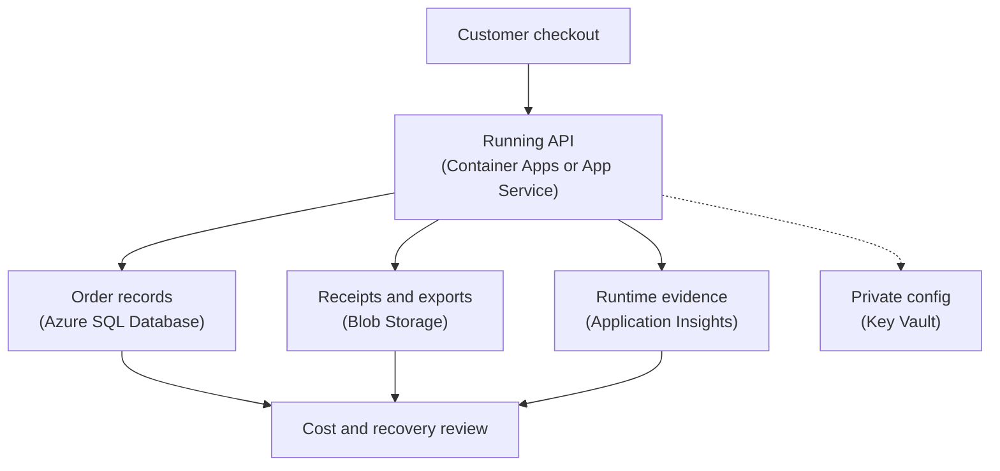

## Table of Contents

1. [Cost And Resilience Belong Together](#cost-and-resilience-belong-together)
2. [If You Know AWS Cost And Resilience](#if-you-know-aws-cost-and-resilience)
3. [The Orders Service We Will Use](#the-orders-service-we-will-use)
4. [Five Cost Shapes To Recognize](#five-cost-shapes-to-recognize)
5. [Resilience Means Serving Or Recovering](#resilience-means-serving-or-recovering)
6. [The System Map](#the-system-map)
7. [The Temptation To Overprotect Everything](#the-temptation-to-overprotect-everything)
8. [Signals Before Changes](#signals-before-changes)
9. [A Paired Decision Table](#a-paired-decision-table)
10. [A Practical Review Habit](#a-practical-review-habit)

## Cost And Resilience Belong Together

After a service is deployed, connected, observed, and released safely, the next production question is not only "is it running?"

The next question is: can the team afford the way it is running, and can the service recover from the failures the team honestly expects?

Cost is the money and operating attention spent to keep a system useful. In Azure, cost usually follows resources: compute capacity, databases, storage, networking, logs, backups, data transfer, and the time people spend understanding all of it.

Resilience is the ability of a system to keep serving users or recover to a useful state after something goes wrong. It does not mean nothing ever fails. Production systems fail in small ways all the time. A container restarts. A database becomes slow. A storage call times out. A log workspace grows because the app writes too much detail. A bad deploy writes data in the wrong shape.

Cost and resilience belong together because most resilience choices have a cost shape, and most cost-saving choices have a failure shape.

Running more app instances can protect traffic when one copy fails, but those instances cost money while they run. Choosing a larger Azure SQL Database tier can protect busy checkout periods, but idle database capacity still appears on the bill. Retaining logs and backups for longer can protect debugging and recovery, but retained data grows over time.

Cutting all of those things aggressively can make the bill look better right up to the moment checkout cannot handle traffic or the team cannot restore useful data.

This module sits after Azure deployment and runtime operations. Earlier, we asked whether the right version was running, whether traffic moved safely, and whether health signals were useful. Now we ask whether the running shape is proportionate to the risk.

Proportionate means "large enough for the failure you care about, but not larger than the evidence supports."

> A good Azure decision should answer both questions: what do we pay for, and what failure does that payment protect against?

## If You Know AWS Cost And Resilience

If you have learned AWS, the thinking pattern is familiar. Azure uses different names and different billing scopes, but the operating questions are close.

| AWS idea you may know | Azure idea to compare first | Shared question |
|---|---|---|
| AWS account or linked account bill | Azure subscription or billing scope | Where does this spend belong? |
| Cost Explorer | Cost Management cost analysis | Which service or workload changed cost? |
| AWS Budgets | Azure budgets | Who gets warned before spend surprises the team? |
| Cost allocation tags | Azure resource tags | Can the bill point back to an owner or app? |
| CloudWatch Logs retention | Log Analytics or Application Insights retention | How long should evidence stay available? |
| RDS backups and Multi-AZ thinking | Azure SQL backups, redundancy, and zones | How do we recover data or survive infrastructure trouble? |

The mapping is only a bridge. Azure cost work often starts from subscriptions, resource groups, and tags. AWS cost work often starts from accounts, linked accounts, and cost allocation tags. Both clouds reward the same habit: name the owner and the workload before you try to change the resource.

The resilience bridge is similar. AWS has Availability Zones and Regions. Azure also has regions and availability zones, but each Azure service has its own support details. You should not assume that one checkbox protects every layer of the service. The application, database, storage, monitoring, secrets, and traffic path each need their own recovery story.

## The Orders Service We Will Use

This module keeps using `devpolaris-orders-api` as the running example.

The service is intentionally ordinary. It is a Node.js backend that accepts checkout requests. It stores order records in Azure SQL Database, writes receipt files to Blob Storage, keeps secrets in Key Vault, emits telemetry to Application Insights, and runs on Azure Container Apps or App Service depending on the deployment path.

That ordinary shape is useful because cost and resilience questions do not only belong to huge systems. Small production services also need owners, budgets, backups, restore plans, and a clear reason for the amount of capacity they keep running.

Here is a compact service card:

```text
service: devpolaris-orders-api
environment: production

runtime:
  Azure Container Apps
  minimum app capacity reviewed monthly

data:
  Azure SQL Database for order records
  Blob Storage for receipts and exports
  Key Vault for secrets

signals:
  Application Insights requests and dependency calls
  Azure Monitor alerts
  Cost Management monthly review

open questions:
  log retention not reviewed after recent debug release
  Azure SQL tier sized for peak week, not normal week
  restore drill not tested since receipt retry feature shipped
```

This note is not trying to be perfect. It gives the team a starting point.

There are running resources, stored objects, retained logs, stored recovery points, and a few unanswered questions. A good cost and resilience review starts from that kind of real state, not from a generic list of best practices.

## Five Cost Shapes To Recognize

Beginners often hear "Azure cost" and think only of a monthly invoice. That invoice matters, but it arrives too late to guide daily engineering decisions.

A better habit is to recognize cost shapes while you design and operate the service.

Direct cost is the visible cost of a resource you intentionally run or store. For `devpolaris-orders-api`, direct cost includes Container Apps compute, Azure SQL Database capacity, Blob Storage, Application Insights and Log Analytics data, Key Vault operations, and outbound traffic. You asked Azure to provide those things, and the bill shows the result.

Hidden cost is the spending that appears because of behavior around the main resource. A debug log line can turn normal traffic into heavy telemetry ingestion. A retry loop can multiply database calls. A large export response can increase data transfer. Hidden cost is not secret. It is hidden because engineers often do not connect it to the code path or setting that created it.

Idle cost is the cost of capacity that waits around. Idle does not always mean bad. A minimum app instance may be idle at night, but it may protect cold starts or keep the service ready. A larger database tier may have spare CPU most of the day, but that spare room may protect checkout during a real traffic spike. The question is not "is any capacity idle?" The better question is "does this idle capacity protect a failure or performance risk we still care about?"

Growth cost is the cost that rises with usage, data, or time. If order volume doubles, the service may need more compute, more database work, more logs, more Blob Storage objects, and more backups. If logs never expire, every day adds more retained data. If receipt exports are kept forever, storage can become a slow surprise.

Recovery cost is what you spend so the team can recover later. Backups, retained logs, redundant storage, extra app capacity, restore drills, documented rollback targets, and cross-zone choices all fit here. Recovery cost can feel like waste on quiet days because it protects against events that have not happened yet. That is why it needs an explicit reason.

Here is the mental model in one table:

| Cost Shape | Beginner Meaning | Orders Example | Question To Ask |
|---|---|---|---|
| Direct cost | The resource you knowingly run or store | Container Apps and Azure SQL capacity | Do we understand what is running? |
| Hidden cost | Cost caused by behavior around the resource | Debug telemetry left on after release | Which code path or setting created this? |
| Idle cost | Capacity that waits for work | Minimum app replicas during quiet hours | What failure does the buffer protect against? |
| Growth cost | Cost that rises with traffic or time | More orders, receipts, logs, and backups | What will this look like next month? |
| Recovery cost | Cost paid to restore or diagnose later | Backups and retained telemetry | Can we recover within the promise? |

This table is not a pricing calculator. It is a thinking tool.

Before you ask whether something is expensive, ask which cost shape you are looking at. That one step makes the conversation calmer.

## Resilience Means Serving Or Recovering

Resilience is not perfection. It is the ability to keep serving users when small failures happen, or recover fast enough when serving is interrupted.

For `devpolaris-orders-api`, serving might mean checkout requests still receive valid responses while one app replica is replaced. Recovering might mean the team restores order data to a known good point after a bad write.

Both are resilience. They protect different promises.

Downtime is the time when users cannot use the service in the way they reasonably expect. If checkout returns errors for ten minutes, that is downtime for checkout. If receipt emails are delayed but orders still complete, that may be degraded service rather than full downtime.

Data loss is the amount of data that cannot be recovered after a failure. If an order was accepted but disappears from the database, that is data loss. If a receipt export file is deleted but can be regenerated from Azure SQL Database, that may be an operational problem but not permanent data loss.

RTO means recovery time objective. In plain English, it is the target for how long recovery is allowed to take. If the orders API has an RTO of one hour for database recovery, the team is saying, "after this kind of incident, we aim to bring the useful service path back within one hour."

RPO means recovery point objective. In plain English, it is the target for how much recent data the team can afford to lose or re-create. If the orders database has an RPO of a few minutes, the backup and recovery design must support recovering close to the failure time.

RTO is about time to recover. RPO is about data freshness after recovery. They are different.

A team can restore very fast to yesterday's data, which is a good RTO and a bad RPO for checkout. A team can restore very fresh data after many hours of manual work, which is a good RPO and a bad RTO for customer impact.

That is why resilience belongs with cost. Lower RTO and lower RPO usually require more preparation. That preparation may include better backups, more automation, more retained evidence, more capacity, or more frequent restore tests. Those choices are not free. They may still be the right choices.

## The System Map

Cost and resilience are easier to discuss when the team can see the service path.



Read the diagram as an operating map.

The runtime costs money while it runs and protects the ability to serve requests. Azure SQL Database costs money while it stores and processes order data, and protects the source of truth. Blob Storage costs money while it stores receipts and exports, and protects files that may be needed later. Application Insights costs money as telemetry is ingested and retained, and protects the team's ability to understand production behavior. Key Vault is a security dependency, but it is also part of recovery because the restored app still needs access to secrets.

The review node is not an Azure service. It is the team's habit of asking whether the running shape still matches the promise.

This matters because a change in one layer can change both cost and resilience. Turning up telemetry helps debugging, but may increase ingestion cost. Reducing database capacity may reduce spend, but can hurt checkout latency. Increasing storage redundancy can improve recovery options, but costs more than simpler redundancy.

The goal is not to make every resource as large and protected as possible. The goal is to make each layer's cost match the value and risk of that layer.

## The Temptation To Overprotect Everything

Once a team learns about backups, redundancy, and zones, it is tempting to protect every resource at the highest level.

That instinct is understandable. Nobody wants to be the person who saved a small amount of money and caused an outage. But "protect everything the most expensive way" is not a mature plan. It can create a bill nobody understands, and it can distract the team from the places where recovery actually matters.

Some data is the source of truth. Order records in Azure SQL Database deserve careful backup and restore planning.

Some data is useful evidence. Application logs and traces deserve enough retention to debug releases and incidents, but they may not need the same retention as financial records.

Some data can be regenerated. A temporary export file may be rebuilt from the database. That does not mean deletion is fine, but it changes the recovery promise.

Some resources are runtime shape, not unique data. A Container App revision or App Service deployment can often be redeployed from a known artifact if the pipeline, image, config, and secrets are intact.

The practical question is:

> If this disappears or becomes unreachable, what user promise breaks?

That question keeps the review grounded.

For `devpolaris-orders-api`, losing final order records is severe. Losing one generated receipt file may be recoverable if the data still exists. Losing one app replica should be invisible if another healthy replica can serve traffic. Losing telemetry during an incident may not stop checkout, but it can slow diagnosis.

Different failure shapes deserve different spending choices.

## Signals Before Changes

Cost work becomes risky when teams change resources before reading signals.

If Azure SQL Database looks expensive, the first move should not be "make it smaller." The first move is to ask what work it is doing. Look at database CPU, storage, connection pressure, query performance, and recent traffic. A database can be expensive because it is oversized, but it can also be expensive because it is carrying important peak load.

If Application Insights cost jumps, the first move should not be "turn off telemetry." The first move is to ask what changed. Did a release add noisy logs? Did dependency calls start failing and retrying? Did sampling change? Did the team increase retention for a real audit need?

If Blob Storage grows, the first move should not be "delete old files." The first move is to classify the objects. Are they customer receipts, temporary exports, old versions, test files, or duplicate uploads from a retry bug?

This is where observability and cost meet. Cost Management tells you where money moved. Azure Monitor and Application Insights help explain why the service behaved that way.

A small review note might look like this:

```text
service: devpolaris-orders-api
month: 2026-05

cost movement:
  Application Insights ingestion up sharply
  Azure SQL cost stable
  Blob Storage growth normal

operating signal:
  receipt retry release shipped May 3
  dependency failures increased on receipt upload path
  debug logging still enabled for successful retry attempts

decision:
  reduce noisy success logs
  keep failure telemetry
  review ingestion again next week
```

Notice what the team did not do. They did not blindly remove monitoring. They kept the signal that protects debugging and removed the noise that does not help.

That is the tone cost work should have.

## A Paired Decision Table

Every cost decision should be paired with the resilience effect it changes.

| Decision | Cost Effect | Resilience Effect | Safer Question |
|---|---|---|---|
| Lower minimum app capacity | Reduces compute cost | May increase cold starts or reduce spare capacity | What traffic or startup signal proves this is safe? |
| Shorten telemetry retention | Reduces stored evidence cost | May make older incidents harder to investigate | How far back do we need to debug releases? |
| Reduce Azure SQL tier | Reduces database cost | May hurt latency during busy periods | Which database metric shows spare capacity? |
| Use stronger storage redundancy | Increases storage cost | Improves protection against storage failures | Which files truly need that recovery promise? |
| Keep more backups | Increases storage and management cost | Improves recovery options | Have we tested restore, or only stored copies? |

This table is not telling you which choice is correct. It is teaching the shape of the conversation.

Cost-only language says, "This is expensive."

Resilience-only language says, "We need this just in case."

The mature version says, "This resource costs this much, protects this failure, and the evidence says we should keep, reduce, or change it."

That is the skill.

## A Practical Review Habit

A good cost and resilience review should be small enough that a team actually does it.

For `devpolaris-orders-api`, the monthly review can use this shape:

```text
service: devpolaris-orders-api
environment: production
owner: orders-api team

cost checks:
  Cost Management view by resource group and tag
  highest moving service this month
  resources without owner or environment tag
  budget alerts triggered or forecasted

resilience checks:
  Azure SQL restore target reviewed
  Blob Storage retention and redundancy reviewed
  log retention still matches incident needs
  recovery drill date recorded

decisions:
  keep Azure SQL tier for next traffic peak
  reduce debug telemetry after receipt retry release
  add owner tag to storage account
  schedule restore drill before next schema migration
```

This is not a finance ceremony. It is an engineering habit.

The team is not trying to make the bill tiny. It is trying to make the bill explainable.

The team is not trying to make failure impossible. It is trying to make failure recoverable within a promise it can actually keep.

That is the heart of Azure cost and resilience.

---

**References**

- [Microsoft Cost Management and Billing overview](https://learn.microsoft.com/en-us/azure/cost-management-billing/cost-management-billing-overview) - Microsoft explains where Cost Management appears and how budgets and scheduled alerts help teams see spend.
- [Use tags to organize Azure resources](https://learn.microsoft.com/en-us/azure/azure-resource-manager/management/tag-resources) - Microsoft explains Azure resource tags and how tags can support cost grouping.
- [Azure reliability documentation](https://learn.microsoft.com/en-us/azure/reliability/overview) - Microsoft explains Azure reliability capabilities, including zones, multi-region support, replication, backup, and restore.
- [Azure Storage redundancy](https://learn.microsoft.com/en-us/azure/storage/common/storage-redundancy) - Microsoft explains redundancy choices for Azure Storage and the durability and availability tradeoffs.
- [Restore a database from a backup in Azure SQL Database](https://learn.microsoft.com/azure/azure-sql/database/recovery-using-backups?tabs=azure-portal&view=azuresql) - Microsoft explains point-in-time restore, deleted database restore, long-term backup restore, and geo-restore.
