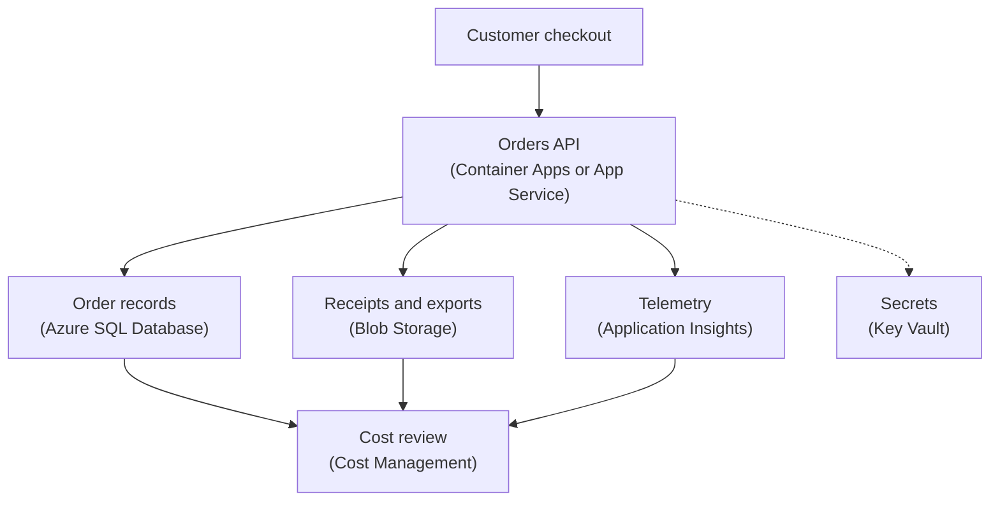

## Table of Contents

1. [Visibility Before Tuning](#visibility-before-tuning)
2. [If You Know AWS Cost Tools](#if-you-know-aws-cost-tools)
3. [The Orders Cost Map](#the-orders-cost-map)
4. [Resource Groups And Tags Turn Spend Into Ownership](#resource-groups-and-tags-turn-spend-into-ownership)
5. [Cost Analysis Shows Movement](#cost-analysis-shows-movement)
6. [Budgets Catch Drift Early](#budgets-catch-drift-early)
7. [Advisor Recommendations Need Context](#advisor-recommendations-need-context)
8. [Common Azure Cost Leaks](#common-azure-cost-leaks)
9. [Right-Sizing Without Breaking The Service](#right-sizing-without-breaking-the-service)
10. [A Practical Monthly Cost Review](#a-practical-monthly-cost-review)

## Visibility Before Tuning

A cloud bill is not only an invoice. It is a delayed report of how your architecture behaved.

Every running app instance, database tier, stored blob, log event, backup, and network path leaves a cost trail. Cost visibility means you can read that trail by service, environment, team, and workload instead of staring at one large subscription total.

Right-sizing means changing resource size, count, or retention so the workload has enough capacity without carrying unnecessary waste. The important word is "enough."

A tiny service can be cheap and broken. A huge service can be stable and wasteful. The useful target is the smallest shape that still protects latency, recovery, observability, and future traffic patterns you actually expect.

Right-sizing depends on visibility because you need to know what you are tuning.

If the bill only says "Azure," you cannot tell whether money went to the API runtime, Azure SQL Database, Blob Storage, Application Insights, Key Vault, or staging resources. If the bill can show `Service=devpolaris-orders-api`, `Environment=prod`, and `Owner=orders-api`, the conversation becomes much calmer.

Now the team can ask: which layer changed, and is that layer sized for the work it is doing?

This article uses `devpolaris-orders-api`, the same Node.js backend from the earlier Azure modules. It runs on Azure compute, stores order data in Azure SQL Database, writes receipts to Blob Storage, keeps secrets in Key Vault, and sends telemetry to Application Insights.

That is a realistic cost surface. The API itself is only one part of the bill. The supporting services can grow quietly if nobody watches them.

> Cost visibility is not blame. It is the map you need before you make a safe change.

## If You Know AWS Cost Tools

If you have learned AWS, Azure's cost tools will feel familiar in purpose, but different in shape.

| AWS idea you may know | Azure idea to compare first | Shared question |
|---|---|---|
| Cost Explorer | Cost Management cost analysis | Which service, tag, or scope changed spend? |
| AWS Budgets | Azure budgets | Who gets warned before spend becomes surprising? |
| Cost allocation tags | Azure resource tags | Can costs point back to a service and owner? |
| AWS account or organization unit | Azure subscription or management group | Which billing and access boundary owns the cost? |
| Resource Groups as tagging equivalent does not exist in AWS | Azure resource groups | Which resources belong to one app or environment? |
| Trusted Advisor cost checks | Azure Advisor cost recommendations | Which idle or underused resources should we inspect? |

The bridge is useful, but do not force a one-to-one dictionary.

Azure resource groups matter more than many AWS beginners expect. A resource group is a logical container for Azure resources. It is not a network boundary, and it is not automatically a billing account, but it is a very useful way to group resources that belong to the same application or environment.

Tags matter too. A tag is a key-value label attached to a resource, resource group, or subscription. Tags help answer human questions like "who owns this?" and "is this production or staging?"

In practice, Azure cost visibility usually comes from scopes, resource groups, and tags working together.

## The Orders Cost Map

Before tuning anything, draw the cost map.

For `devpolaris-orders-api`, the cost path looks like this:



Read the diagram as a spending map, not only as a request map.

The runtime costs money while it runs. Azure SQL Database costs money according to the database configuration and storage. Blob Storage grows with receipt and export files. Application Insights can grow with telemetry volume and retention. Key Vault is usually not the largest cost in this story, but it is still part of the service surface.

The first lesson is that there is no single "orders API cost." There is a group of costs that support the orders service.

Some are user-facing, like the app runtime handling checkout. Some are supporting work, like receipt files. Some are evidence, like logs and traces. Some are safety, like backups and retained data.

A beginner mistake is to look only at compute. That misses quiet spend that often surprises teams: telemetry ingestion, retained logs, database capacity, staging resources, old exports, and resources that no longer serve traffic.

The practical review starts by listing the workload pieces:

| Layer | Example Resource | Cost Question |
|---|---|---|
| API runtime | `devpolaris-orders-api` Container App | Is capacity matched to real traffic? |
| Database | `devpolaris-orders-prod` Azure SQL Database | Is the tier justified by database pressure? |
| Object storage | `devpolarisordersprod` storage account | Are old exports and receipt versions aging out safely? |
| Telemetry | Application Insights workspace | Is ingestion and retention intentional? |
| Secrets | `kv-devpolaris-orders-prod` Key Vault | Are secret operations normal and owned? |
| Staging | `rg-devpolaris-orders-staging` | Are non-production resources still needed? |

This map does not tell you what to cut. It tells you where to look.

That distinction matters. Cost work goes wrong when people jump from "this service is expensive" to "make it smaller" without checking what the service is protecting.

## Resource Groups And Tags Turn Spend Into Ownership

Azure resource groups help group resources that belong together. For a beginner, think of a resource group as a named folder for Azure resources that share a lifecycle or owner.

For `devpolaris-orders-api`, the team might use:

```text
rg-devpolaris-orders-prod
rg-devpolaris-orders-staging
rg-devpolaris-orders-shared
```

That shape is useful because production and staging can be reviewed separately. If staging spend rises, the team can inspect staging resources without mixing them with production checkout traffic.

Tags add a second layer of clarity. A resource group can say "these resources are together." Tags can say "this resource belongs to this service, environment, owner, and cost center."

A simple tag set might be:

```text
Service=devpolaris-orders-api
Environment=prod
Owner=orders-api
Component=database
CostCenter=learning-platform
```

The exact tags should match how the company works. The important part is that tags answer real questions.

| Tag | Question It Answers |
|---|---|
| `Service` | Which application does this support? |
| `Environment` | Is this production, staging, development, or test? |
| `Owner` | Which team should explain and review it? |
| `Component` | Is this runtime, database, storage, telemetry, or network? |
| `CostCenter` | Which budget or accounting bucket pays for it? |

Tags are not magic. Some resources may not emit tags into cost data in the way you expect, and tagging rules need governance. Microsoft documents tag support details because not every resource behaves exactly the same.

The beginner habit is still valuable: create resources with ownership metadata from the start. Missing ownership creates unowned spend. Unowned spend is dangerous because nobody feels safe changing it. People either ignore it, or they cut it blindly. Both outcomes are bad.

## Cost Analysis Shows Movement

Azure Cost Management cost analysis helps you inspect cost and usage trends.

Think of it like a dashboard for cost movement. It can help answer questions like:

- Which service cost changed this month?
- Which resource group is growing?
- Which tag value owns the spend?
- Did production grow, or did staging get left running?
- Did the cost rise because traffic grew, or because a setting changed?

For `devpolaris-orders-api`, a useful first view is:

```text
Cost Management review

scope:
  subscription or resource group for devpolaris production

date range:
  previous full month

group by:
  service name
  resource group
  tag: Service
  tag: Component

filter:
  Service = devpolaris-orders-api
  Environment = prod
```

That view tells you whether the cost movement came from Azure SQL Database, Container Apps, Blob Storage, Application Insights, networking, or something else.

If Application Insights jumps while compute stays flat, shrinking app capacity will not fix the issue. If Azure SQL Database dominates every month, the next question is database sizing and utilization. If Blob Storage rises after a release, inspect receipt writes, export files, object versions, and retention rules.

Cost analysis also needs interpretation.

A higher cost can be healthy when traffic rose, a paid feature launched, or retention was intentionally extended for an audit need. A lower cost can be unhealthy when you cut capacity below what the service needs.

That is why cost movement should be compared with operating signals:

| Cost Movement | Operating Signal To Compare |
|---|---|
| Container Apps cost increased | Request volume, replica count, CPU, memory, and scale rules |
| Azure SQL Database cost increased | CPU, storage, DTU or vCore pressure, query performance, and connection count |
| Application Insights cost increased | Telemetry volume, new log lines, sampling settings, and error rate |
| Blob Storage cost increased | Object count, object size, lifecycle policy, and old versions |
| Network cost increased | Response size, export downloads, region paths, and public data transfer |

The goal is not to explain every cent during every review. The goal is to notice meaningful movement early enough to understand it.

## Budgets Catch Drift Early

A budget is an early warning system for cost.

In Azure Cost Management, budgets can notify people when actual or forecasted cost crosses thresholds. A budget does not automatically make the service cheaper. It tells the right humans that cost is moving before the invoice becomes a surprise.

That distinction matters.

Budgets should not feel like punishment. They should feel like smoke alarms. The alarm is annoying if it is noisy, but it is useful when it points to a real issue.

For `devpolaris-orders-api`, a budget might be scoped to the production resource group or to a tag filter:

```text
budget: devpolaris-orders-prod-monthly
scope: rg-devpolaris-orders-prod
thresholds:
  70% forecast: notify service owner
  90% actual: notify service owner and platform lead
  110% actual: create release review item
```

The thresholds are examples, not universal rules.

The useful part is the response. If a budget crosses 70 percent forecast, the team should ask what changed. If it crosses 90 percent actual, the team should know whether this is expected growth, an incident, a release side effect, or an abandoned resource.

A budget without an owner becomes noise. A budget with a clear owner becomes a conversation.

Good budget messages answer:

- Which scope crossed the threshold?
- Which service or resource group moved?
- Is the movement actual or forecasted?
- Who should inspect it?
- What is the first view to open in Cost Management?

Budgets do not replace engineering judgment. They start the right review at the right time.

## Advisor Recommendations Need Context

Azure Advisor can provide recommendations, including cost recommendations that identify idle or underutilized resources. That can be useful, especially for teams learning how many resources they have.

But recommendations still need context.

An app plan, database, or VM can look underused during normal hours and still be important during a weekly batch job or traffic peak. A staging resource can look idle and still be needed for a scheduled release. A larger database tier can look wasteful until you compare it with peak checkout latency.

Use Advisor as a signal, not as an automatic instruction.

For example:

```text
Advisor recommendation:
  right-size underutilized resource

resource:
  devpolaris-orders-prod-sql

first review:
  check last 30 days of CPU and storage
  check peak checkout window
  check planned marketing event
  check whether restore drill needs this tier

decision:
  no size change before next traffic peak
  review again after peak week
```

That is a reasonable answer. The team did not ignore Advisor. It read the recommendation against service reality.

Sometimes Advisor will find a clear cleanup item, such as an unused resource. Sometimes it will point to a tuning opportunity. Sometimes the team will decide the recommendation is not safe right now.

The mature habit is to record the reason. "Ignored" teaches nothing. "Not changed because peak checkout week starts tomorrow" helps the next reviewer.

## Common Azure Cost Leaks

Many cost leaks are not mysterious. They are normal engineering leftovers that never got reviewed.

| Cost Leak | What It Looks Like | First Check |
|---|---|---|
| Staging left running | Staging resource group costs nearly as much as production | Is staging needed outside release windows? |
| Telemetry too noisy | Application Insights or Log Analytics grows after a release | Which log line or dependency event increased volume? |
| Oversized database | Azure SQL Database tier stays high after a temporary peak | Do metrics justify the current tier? |
| Old exports retained forever | Blob Storage grows even when traffic is stable | Are lifecycle policies and object prefixes clear? |
| Forgotten public resources | Old IPs, test resources, or unused services remain billed | Does every resource have owner and environment tags? |
| Retry loops | Database, storage, or telemetry usage jumps together | Did errors cause repeated work? |

These leaks are fixable, but they should be fixed with care.

Deleting old exports is safe only if you know they are temporary or regenerable. Reducing telemetry is safe only if you keep the evidence needed for incidents. Lowering database capacity is safe only if the metrics and traffic pattern support it.

Cost cleanup is still production work. Treat it like a change with a reason, a check, and a rollback idea.

## Right-Sizing Without Breaking The Service

Right-sizing is not the same as shrinking.

Right-sizing means matching the resource to the job it actually needs to do. Sometimes that means reducing capacity. Sometimes it means increasing capacity before a known traffic event. Sometimes it means changing retention, lifecycle policy, or scale rules instead of compute size.

For `devpolaris-orders-api`, the team should inspect the running layers separately.

For the runtime, check request volume, replica count, CPU, memory, startup time, and scale behavior. If the app has spare capacity every night, that may be fine. If it has spare capacity every hour of every day, there may be a tuning opportunity.

For Azure SQL Database, check database pressure, storage growth, query performance, connection count, and known traffic peaks. A database tier should not be reduced only because average CPU is low. Peak behavior matters.

For Blob Storage, check object count, size, access patterns, lifecycle policy, and whether files are source-of-truth or regenerable.

For Application Insights and logs, check telemetry volume, sampling, retention, and whether noisy success events are hiding useful failure signals.

Here is a review table:

| Layer | Evidence Before Change | Safe Change Example |
|---|---|---|
| Runtime | Replica and CPU history | Adjust minimum replicas after startup and traffic review |
| Database | Peak load and query behavior | Change tier after validating busy-hour performance |
| Blob Storage | Object age and purpose | Add lifecycle policy for temporary exports |
| Telemetry | Ingestion by event type | Reduce noisy success logs while keeping failures |
| Staging | Release schedule and owner | Stop or reduce resources outside release windows |

The phrase "safe change" matters. Every cost change should have a way to prove the service still works.

For runtime changes, watch latency and errors. For database changes, watch query time and checkout duration. For storage lifecycle changes, test that receipts and exports still behave correctly. For telemetry changes, confirm that failures still show up.

Cost tuning should make the system clearer, not more mysterious.

## A Practical Monthly Cost Review

A monthly cost review should be small enough that engineers actually do it.

For `devpolaris-orders-api`, use this shape:

```text
service: devpolaris-orders-api
month: 2026-05
owner: orders-api

scope:
  subscription: devpolaris-prod
  resource group: rg-devpolaris-orders-prod
  tag filter: Service=devpolaris-orders-api

top movement:
  Application Insights ingestion increased
  Blob Storage growth normal
  Azure SQL Database stable

first explanation:
  receipt retry release added success logs
  no matching checkout traffic increase

decision:
  reduce noisy success logs
  keep failure and dependency telemetry
  verify next week

tag cleanup:
  add Owner tag to storage account
  add Component tag to Application Insights workspace

budget:
  70% forecast warning sent to owner
  no escalation needed
```

The format is plain because the work should be repeatable.

The review names the scope, explains the movement, records the decision, and keeps ownership clean.

That is enough for a healthy first cost habit.

The team does not need to become finance experts. It needs to read the bill as engineering evidence, then make careful changes that protect the user path.

---

**References**

- [Microsoft Cost Management and Billing overview](https://learn.microsoft.com/en-us/azure/cost-management-billing/cost-management-billing-overview) - Microsoft explains Cost Management availability, budget alerts, and scheduled alerts.
- [Create a budget in Cost Management](https://learn.microsoft.com/en-us/azure/cost-management-billing/costs/quick-create-budget-template) - Microsoft explains how budgets help teams plan, track, and notify on spending.
- [Use tags to organize Azure resources](https://learn.microsoft.com/en-us/azure/azure-resource-manager/management/tag-resources) - Microsoft explains Azure tags, tag usage, and cost grouping.
- [Tag support for Azure resources](https://learn.microsoft.com/en-us/azure/azure-resource-manager/management/tag-support) - Microsoft documents tag support and how tags appear in cost reports.
- [Cost recommendations in Azure Advisor](https://learn.microsoft.com/en-us/azure/advisor/advisor-reference-cost-recommendations) - Microsoft explains how Azure Advisor identifies idle and underutilized resources for cost optimization.
