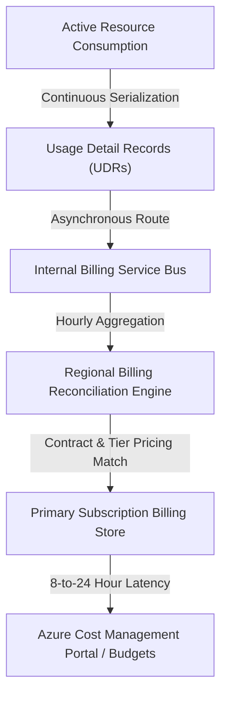

## Table of Contents

1. [What Is Cost Visibility](#what-is-cost-visibility)
2. [Slicing Spend with Cost Analysis](#slicing-spend-with-cost-analysis)
3. [Resource Group Boundaries and Tagging Schemas](#resource-group-boundaries-and-tagging-schemas)
4. [Budget Alarms and Notification Constraints](#budget-alarms-and-notification-constraints)
5. [Azure Advisor and Safe Right-Sizing](#azure-advisor-and-safe-right-sizing)
6. [Mitigating Common Azure Cost Leaks](#mitigating-common-azure-cost-leaks)
7. [Putting It All Together](#putting-it-all-together)
8. [What's Next](#whats-next)

## What Is Cost Visibility

Cost visibility is the operational discipline of tracking, decomposing, and allocating cloud infrastructure expenditures to specific business services, environments, and engineering teams. In cloud environments, where resources can be scaled up or down instantly via APIs, spending is dynamic and distributed. The classic mistake when a cloud bill exceeds expectations is to immediately resize random resources or run arbitrary deletion scripts. Safe cost optimization requires deep operational visibility: you must trace the exact time, resource group, billing meter, and metadata tags associated with the spend increase before making any architectural alterations.

If you manage expenditures on AWS, Azure's cost visibility tools map directly to your existing practices:

* **AWS Cost Explorer vs. Azure Cost Analysis**: While AWS Cost Explorer utilizes specialized, pre-configured dashboard charts to isolate spending trends, Azure Cost Analysis operates as a multi-dimensional cost explorer. It lets you slice and group available billing data by granular dimensions (such as resource ID, location, subscription, meter, or tag), while remembering that the underlying cost records arrive after a delay.
* **AWS Budgets vs. Azure Budgets**: Both services act as early-warning alerting systems, tracking actual and forecasted spending at designated scopes and routing email or webhook notifications when thresholds are crossed.

:::expand[Under the Hood: The Azure Billing Aggregation Pipeline and Meter Serialization]{kind="design"}
Azure's billing data is processed through a complex, asynchronous data pipeline isolated from active infrastructure operations:

* **Resource Meter Serialization**: As your virtual machines, SQL databases, and storage accounts run, the underlying physical hypervisor hosts and PaaS controllers serialize active consumption events (e.g., fractional CPU hours, disk sectors written, network egress bytes) into raw Usage Detail Records (UDRs).
* **Aggregation and Pricing Reconciliation**: These UDRs are pushed asynchronously over internal service buses to regional billing gateways. The billing engine aggregates the raw consumption metrics hourly, matching the serialized resource IDs against your active enterprise pricing contracts, regional rate tables, and reserved instance savings plans.
* **Latency Boundary**: Reconciled billing records are written to your subscription's primary billing store. This pipeline introduces a data latency boundary. For Enterprise Agreement and Microsoft Customer Agreement subscriptions, cost and usage data is typically available in Cost Management within 8 to 24 hours. For pay-as-you-go subscriptions, it can take up to 72 hours. Real-time scaling surges will not appear on your financial graphs instantly, and current-month charges should be treated as estimates until the billing period closes.


:::

This billing latency boundary requires teams to establish proactive budget alarms and right-sizing guardrails, rather than relying on standard real-time dashboards to catch runaway resource loops. A cost graph is a delayed financial record, not a live CPU chart. That delay is why cost controls need ownership tags, budget alerts, and review habits before an incident happens.

## Slicing Spend with Cost Analysis

Azure Cost Analysis is the query and visualization surface for delayed Azure billing records. It is the primary analytical portal used to slice and investigate subscription spending. To isolate the root cause of an unexpected billing increase, structure your investigation as a logical query pipeline:

1. **Define the Scope**: Select the target Billing Account, Enrollment, Subscription, or specific Resource Group to focus your analysis.
2. **Set the Time Frame**: Compare the active billing period (e.g., the last 30 days) directly against the previous historical period to isolate the exact date of the spend deviation.
3. **Group by Service Name**: Aggregate the spend by Azure service categories (e.g., Virtual Machines, Azure SQL Database, Log Analytics) to identify which resource family drove the cost increase.
4. **Filter and Group by Resource**: Narrow the view to the target service family and group by individual resource names to locate the exact resource ID responsible for the cost shift.

By running this multi-dimensional analysis, you can transform a generic "our cloud bill is too high" statement into an actionable operational fact:

```plain
The staging resource group's Log Analytics workspace (law-orders-staging)
grew by 42% on May 16th due to a verbose log ingestion spike from release v2.4.
```

This structural analysis ensures that your engineering team targets the correct resource group, avoiding blind alterations that could impact production stability.

## Resource Group Boundaries and Tagging Schemas

Cost allocation needs two stable coordinates: the lifecycle boundary where resources are grouped, and the tag fields that identify owner, service, environment, and budget. Allocating costs accurately across diverse engineering teams requires establishing clear resource group perimeters and metadata tagging policies:


*Tags turn raw spend into accountable cost records by connecting resources to owners and teams.*


* **Resource Group Boundaries**: Organize resources into dedicated resource groups based on their common lifecycles and environments (e.g., separating `rg-orders-prod` from `rg-orders-staging`). This allows you to track and filter the total cost of an entire service tier instantly.
* **Standardized Metadata Tagging**: Apply a strict key-value metadata tagging policy to every provisioned resource. A standard cloud tagging schema includes the following essential dimensions:

| Metadata Tag Key | Example Value | Systems Operational Rationale |
| --- | --- | --- |
| `service` | `orders-api` | Isolates the specific business application or microservice utilizing the resource. |
| `env` | `prod` | Differentiates production, staging, development, and test environments. |
| `owner` | `platform-team` | Identifies the specific engineering squad responsible for managing and tuning the resource. |
| `cost-center` | `fintech-04` | Maps the resource cost directly to a specific corporate budget or business unit. |
| `criticality` | `tier-1` | Defines the workflow criticality, guiding safe right-sizing rollback priorities. |

Enforce these tagging schemas programmatically by deploying Azure Policy rules. You can configure policies to automatically audit resources, append tags based on resource group metadata, or actively block the creation of any resource that lacks the required tag keys.

:::expand[Pitfall: Tagging Policies Without Enforcement]{kind="pitfall"}
A common governance mistake is publishing a comprehensive corporate tagging dictionary in a PDF without setting up programmatic platform enforcement. If you rely entirely on human discipline, developers under pressure during hotfixes or manual portal deployments will inevitably make typos, abbreviate key terms, or skip tagging altogether. You will end up with resources tagged `env: prod`, `Env: Production`, `environment: pord`, or with no tag at all.

This lack of control creates a "garbage-in, garbage-out" data problem in Azure Cost Management. When your finance team runs monthly billing reports, a significant portion of your cloud spend will be classified as "unallocated" or "orphaned" because the billing engine cannot map the mutated tag strings to your corporate cost centers.

To prevent this cost leakage, you must transition from passive guidelines to **programmatic enforcement**:

*   **Azure Policy `deny` Effect**: Deploy a policy that actively blocks the deployment of any resource that lacks mandatory tag keys (such as `env` or `cost-center`). The CLI command or pipeline execution will fail immediately, forcing the developer to supply the missing tag before resource creation.
*   **Azure Policy `modify` Effect**: Automatically inherit tags. For example, configure a policy that automatically copies the `cost-center` and `owner` tags from the parent Resource Group down to all nested resources at deployment time, reducing Bicep parameter boilerplate.
*   **CI/CD Linting**: Integrate tools like Bicep Linter, Checkov, or TFLint into your pull request pipelines to scan code and fail builds if tagging blocks are missing.

This governance pipeline is identical to AWS. In AWS, publishing a tagging guide is insufficient; you must configure **AWS Organizations Tag Policies** or write Service Control Policies (SCPs) that enforce the presence of specific keys on S3 buckets or EC2 instances, blocking non-compliant API calls at the root level.

The top-down diagram below compares manual, unenforced tagging with programmatic policy gating:

```mermaid
flowchart TD
    subgraph Unenforced["Manual Tagging (Unenforced - High Drift)"]
        DeveloperA["Developer makes hotfix"] -->|"1. Provisions storage account"| Portal["Azure Portal / CLI Gate"]
        Portal -->|"2. Typo: env=pord or skips tags"| ResourceA["Storage Account Deployed"]
        ResourceA -->|"3. Billing Ingest"| CostMgmtA["Azure Cost Management"]
        CostMgmtA -->|"Result"| OutageA["Unallocated Spend (Finance Audit Fails)"]
    end

    subgraph Enforced["Programmatic Policy Gating (Enforced - Zero Drift)"]
        DeveloperB["Developer deploys template"] -->|"1. Submits template"| PolicyGate{"Azure Policy Engine"}
        PolicyGate -->|"2. Checks required keys"| Check{"Keys present?"}
        Check -->|"No (Missing env)"| Reject["Deployment Blocked (Error: RequestDenied)"]
        Check -->|"Yes (env: prod)"| Accept["Resource Deployed"]
        Accept -->|"3. Auto-Allocated"| CostMgmtB["Azure Cost Management: 🟢 Allocated"]
    end
```



**Rule of thumb:** Never expect a written document to guarantee cloud governance. Always enforce your tagging schema programmatically at the control plane using Azure Policy `deny` rules to block non-compliant resources on creation, and use `modify` rules to automate inheritance.
:::

## Budget Alarms and Notification Constraints

Azure Budgets are delayed financial threshold alerts, not real-time resource circuit breakers. They provide a financial alarm system designed to drive operational accountability across your subscriptions:


*Budget alerts are guardrails for reaction, not hard stops that prevent spend in real time.*


* **Budget Scopes**: You can provision budgets at diverse levels, including the entire subscription scope, a target resource group boundary, or filtered by specific resource tags (e.g., monitoring all resources tagged `service=orders-api`).
* **Actual vs. Forecasted Thresholds**: Configure alerts based on both actual spending and forecasted spending:
    * **Actual Alerts**: Trigger notifications when your cumulative spend crosses a static percentage threshold (e.g., reaching 80% of your monthly budget).
    * **Forecasted Alerts**: Evaluate billing trends dynamically to notify owners when the system predicts that your monthly spend will exceed the budget limit by the end of the billing period, providing early warnings before charges accumulate.
* **Critical Operational Constraint**: Azure Budgets are alerting controls by default, not automatic circuit breakers. When a budget threshold is exceeded, Cost Management can send email notifications and use action groups to trigger channels such as webhooks or automation. Azure does not automatically stop, downsize, or deallocate running resources unless you explicitly build and test that automation. Your virtual machines and databases continue to consume capacity, protecting application uptime while requiring an engineered response to resolve the cost leak.

## Azure Advisor and Safe Right-Sizing

Azure Advisor is the platform recommendation engine that flags underused, risky, or improvable resources from telemetry and configuration signals. It continuously evaluates your running infrastructure against the Well-Architected Framework:

* **Advisor Cost Scans**: The engine scans your active resources for underutilization patterns using metrics such as CPU, memory, and outbound network utilization, depending on the recommendation type. It can recommend shutting down unused virtual machines, resizing virtual machines or scale sets to cheaper SKUs, deallocating idle resources, pruning unattached disks, or buying reservation plans.
* **Context-Aware Evaluation**: Do not apply Advisor cost recommendations automatically. An automated scan cannot detect the operational context of a resource. A database or virtual machine that appears completely idle may be a dedicated disaster recovery standby, a rare but critical end-of-month batch processor, or an active scale target for a high-priority product launch.
* **Safe Right-Sizing Workflow**: Before downsizing any compute or database resource, verify the workload's performance envelope:

```plain
1. Identify low-utilization target in Azure Advisor.
2. Review active metrics (p95 CPU, peak memory, IOPS, latency) over a 30-day window.
3. Verify the service promise and rollback plan (know how to scale the tier back instantly).
4. Execute the downsize during a scheduled low-traffic maintenance window.
5. Monitor application error rates and request latencies for 7 days to confirm stability.
```

## Mitigating Common Azure Cost Leaks

A cost leak is an active billing source that no longer supports the intended workload. In complex cloud environments, unmanaged resources can quietly accumulate unnecessary fees. Build operational practices to detect and resolve the most common Azure cost leaks:

### 1. Unattached Managed Disks
When you delete a Virtual Machine, Azure can either delete or detach related disks and network resources depending on the delete options configured on the VM and the tool used to create it. Detached managed disks remain persistent in your resource group and continue billing for their full storage capacity.
* **Fix**: Set intentional delete options for non-reusable disks, then run a monthly KQL resource query or check Azure Advisor to locate and delete all unattached managed disks.

### 2. Lingering Database Backups
When you delete an Azure SQL database, the automated point-in-time backups are not immediately purged. The platform preserves the differential and transaction log backups in geo-redundant storage until your configured retention period (up to 35 days) expires, generating billing charges.
* **Fix**: Establish clear guidelines regarding retention windows, and adjust backup storage redundancy before destroying test databases.

### 3. Orphaned Storage Container Versions
Configuring Blob Storage versioning protects files from accidental deletion, but every overwrite write operation generates a new historical blob version that bills at standard rates.
* **Fix**: Configure storage lifecycle management rules to automatically transition older blob versions to cool tiers or permanently delete them after 30 days.

### 4. Overprovisioned Compute and Database Tiers
Provisioning a General Purpose Azure SQL database with 8 vCores for a service that never exceeds 5% CPU usage reserves dedicated capacity that goes unused.
* **Fix**: Evaluate CPU and memory metrics over a 30-day window, and transition balanced development workloads to serverless database compute tiers that automatically pause during idle periods.

## Putting It All Together

Cost visibility transforms cloud spending from an unmanaged operational expense into a granular, allocated data asset.

* **Decoupled Billing Pipelines**: Understand the 8-to-24 hour latency boundary of Azure's billing aggregation pipeline to set realistic budget expectations.
* **Granular Cost Analysis**: Investigate billing spikes systematically by defining scopes, setting time frames, and grouping by service names and resource IDs.
* **Standardized Metadata**: Enforce resource group perimeters and metadata tagging policies through Azure Policy rules to automate cost allocation.
* **Uptime Budgets**: Rely on Azure Budgets as early-warning alarms, recognizing that they only change running workloads when connected to explicit, tested automation.
* **Safe Optimization**: Audit Azure Advisor recommendations against real-world systems context, executing right-sizing changes during maintenance windows with verified rollback plans.
* **Eliminate Waste**: Establish automated checks to clean up unattached managed disks, prune orphaned database backups, and manage storage version lifecycles.

## What's Next

Now that we have established cost visibility and mitigated active spending leaks, we will explore Recovery Planning. We will define Recovery Time Objectives (RTO) and Recovery Point Objectives (RPO), analyze database and storage replication levels, and construct tested disaster recovery strategies.


*Use this as the cost visibility loop: every spend line should have tags, an owner, a budget signal, a review habit, and a right-sizing action when usage changes.*

---

**References**

* [Azure Cost Management overview](https://learn.microsoft.com/en-us/azure/cost-management-billing/costs/overview-cost-mgt)
* [Group and filter options in Cost Analysis](https://learn.microsoft.com/en-us/azure/cost-management-billing/costs/group-filter)
* [Use tags to organize your Azure resources](https://learn.microsoft.com/en-us/azure/azure-resource-manager/management/tag-resources)
* [Azure Advisor cost recommendations](https://learn.microsoft.com/en-us/azure/advisor/advisor-cost-recommendations)
* [Understand Cost Management data](https://learn.microsoft.com/en-us/azure/cost-management-billing/costs/understand-cost-mgt-data)
* [Tutorial: Create and manage Azure budgets](https://learn.microsoft.com/en-us/azure/cost-management-billing/costs/tutorial-acm-create-budgets)
* [Delete a VM and attached resources](https://learn.microsoft.com/en-us/azure/virtual-machines/delete)
