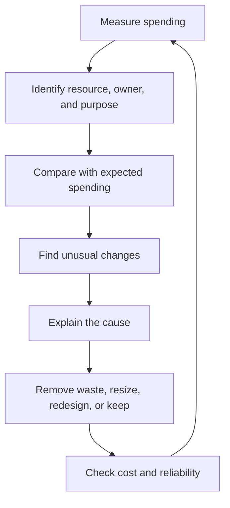
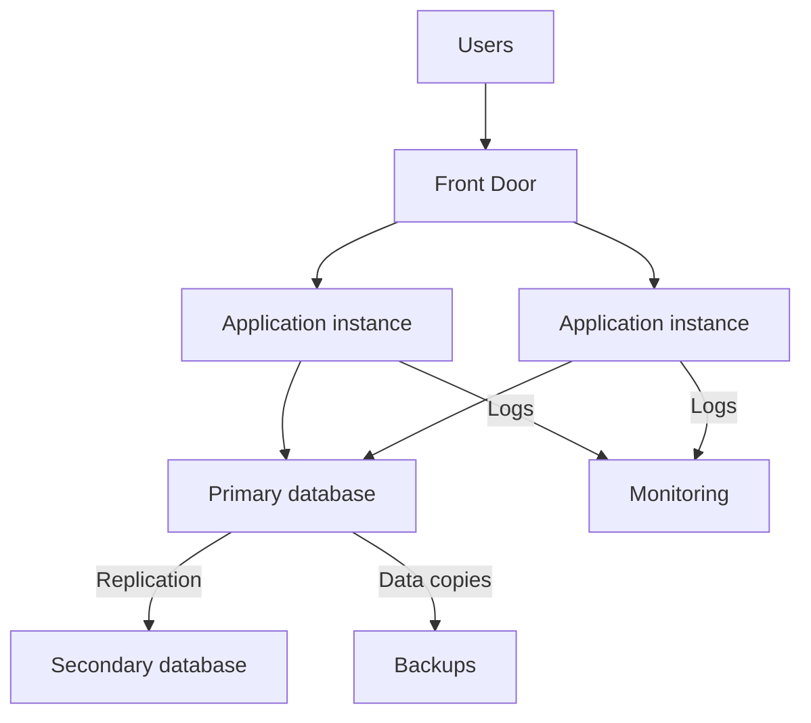

## Table of Contents

1. [Why Did the Bill Jump?](#why-did-the-bill-jump)
2. [What Does Cost Visibility Mean?](#what-does-cost-visibility-mean)
3. [How Does Cost Analysis Find the Cause?](#how-does-cost-analysis-find-the-cause)
4. [How Do Tags Assign Ownership?](#how-do-tags-assign-ownership)
5. [How Do Budgets Warn Before Overspend?](#how-do-budgets-warn-before-overspend)
6. [How Does Right-Sizing Remove Waste?](#how-does-right-sizing-remove-waste)
7. [Which Azure Cost Leaks Recur?](#which-azure-cost-leaks-recur)
8. [How Does a Cost Review Fit Together?](#how-does-a-cost-review-fit-together)
9. [Check Your Answers](#check-your-answers)
10. [References](#references)

A monthly Azure bill of £42,000 does not tell you whether the system is expensive to run. Customer traffic might have doubled. A second region might now protect the application from a regional outage. Or development machines might be running all night while a recent release fills the logging service with unnecessary messages.

Before changing resources, you need to explain the spending. That means connecting each cost to a resource, an owner, and a reason for keeping it. The same investigation should distinguish an idle machine that nobody needs from a quiet standby database that the recovery plan depends on.

The questions below follow that investigation from the total bill to a justified decision:

1. **Why Did the Bill Jump?**
2. **What Does Cost Visibility Mean?**
3. **How Does Cost Analysis Find the Cause?**
4. **How Do Tags Assign Ownership?**
5. **How Do Budgets Warn Before Overspend?**
6. **How Does Right-Sizing Remove Waste?**
7. **Which Azure Cost Leaks Recur?**
8. **How Does a Cost Review Fit Together?**

## Why Did the Bill Jump?
<!-- section-summary: Cloud spending follows resource consumption over time, so an increase needs an explanation of usage, rates, ownership, and purpose. -->

In a traditional data center, many costs are visible before an application goes live. Buying 20 servers involves paying for machines, storage, networking equipment, software licenses, and support contracts. Those purchases make a large part of the commitment apparent at the start.

Cloud resources change that timing. A team can create infrastructure in seconds, enable automatic scaling, keep another copy in a different region, or begin collecting terabytes of logs. Each choice can increase consumption after the initial deployment. Resources can also continue running long after their original purpose has ended.

At the billing level, the calculation combines the amount consumed with the price of each unit:

$$
\text{Cloud cost} = \sum (\text{Quantity consumed} \times \text{Price per unit})
$$

For an engineering investigation, expand that calculation into four things to inspect: **the resource, its usage, the applicable rate, and how long the usage continued**. This is a reasoning aid rather than one universal Azure billing meter. It helps you ask whether a charge changed because the system used more capacity, ran for longer, or paid a different rate.

The resource's purpose adds the context that arithmetic cannot provide. Who owns it? Why was it created? Which business requirement, availability target, or recovery requirement does it support? Without those answers, reducing the total can mean removing useful capacity.

Return to the £42,000 bill. Suppose the preceding month cost £20,000. That increase could come from more customers, the deliberate addition of another region, verbose application logging, or 40 development VMs left running overnight. The same total can contain several of these causes at once.

A useful investigation separates the questions:

| Question | What it helps identify |
| --- | --- |
| Which service generated the charge? | Compute, SQL, Storage, networking, or logs |
| Which resource within that service? | The particular VM, database, cluster, or storage account |
| Which application uses it? | Checkout, identity, analytics, or another workload |
| Which environment is it in? | Production, staging, or development |
| Which team owns the decision? | Payments, platform, or data |
| Where does it run? | A region such as UK South or West Europe |
| When did spending change? | The point at which the cost trend moved |
| What changed at that time? | Usage, scaling, price, or architecture |
| Why is the resource present? | Its business or technical purpose |
| Does it protect the system? | Replication, backups, disaster recovery, or spare capacity |

These dimensions explain why a total alone cannot guide an optimization. You first need to attribute the money to the work and the requirement behind it.

## What Does Cost Visibility Mean?
<!-- section-summary: Cost visibility connects spending to purpose and ownership, then uses measurement and verification to guide changes. -->

**Cost visibility** is the ability to explain where money goes, why it is spent, who is responsible, and what useful service or protection it provides. Microsoft Cost Management supplies tools for analyzing, monitoring, allocating, and optimizing Azure spending. Those tools provide the financial information; the people responsible for the workload supply the operational context.

This work follows a feedback loop. First, measure the spending. Next, attribute it to a resource, workload, environment, team, or customer. Compare it with the expected amount, detect unusual changes, and investigate their causes. Only then choose an action. Possible actions include removing unused resources, changing capacity, changing architecture, or accepting a justified cost.

Verification closes the loop. A smaller bill is one result to check, but the application must also continue meeting its reliability requirements. If a change removes the spare capacity required during a failure, it has exchanged one problem for another.

```mermaid
flowchart TD
    measure["Measure spending"] --> attribute["Identify resource, owner, and purpose"]
    attribute --> compare["Compare with expected spending"]
    compare --> detect["Find unusual changes"]
    detect --> investigate["Explain the cause"]
    investigate --> act["Remove waste, resize, redesign, or keep"]
    act --> verify["Check cost and reliability"]
    verify --> measure
```

Consider what happens if the team skips attribution. A high bill leads directly to smaller resources, and the immediate saving looks successful. The next demand spike or instance failure may then exceed the remaining capacity. By understanding the purpose first, the team can isolate unnecessary spending while keeping the resources that satisfy a real requirement.

The sequence also gives ownership a practical role. Someone must be able to explain why a resource exists and approve the tradeoff involved in changing it. Cost allocation is therefore part of the technical investigation, not just a finance report produced after the work is over.

## How Does Cost Analysis Find the Cause?
<!-- section-summary: Cost Analysis separates a total into services, resources, scopes, and dates so changes can be linked to their causes. -->

Azure **Cost Analysis** presents spending along different dimensions. You can examine built-in views of resources, resource groups, subscriptions, services, and cost trends. A resource group collects related Azure resources; a subscription provides another management and billing scope. Choosing a scope determines which part of the environment you are examining.

The investigation can move from a broad question to a specific one. How much did Azure SQL cost? Which SQL database contributed the increase? Which application owns that database? Why did its cost change on August 12? Each answer narrows the next question without assuming in advance that the database is wasteful.

The following monthly comparison illustrates the process:

| Component | Last month | This month |
| --- | ---: | ---: |
| Compute | £4,000 | £6,500 |
| Database | £3,000 | £3,100 |
| Logging | £900 | £2,400 |
| Storage | £600 | £650 |
| Networking | £400 | £1,000 |
| Disaster-recovery replica | £2,000 | £2,000 |
| **Total** | **£10,900** | **£15,650** |

The overall increase is £4,750. Looking at the components shows that compute, logging, and networking deserve particular attention. The database and storage changed only slightly, while the disaster-recovery replica cost stayed constant.

Suppose the subsequent investigation finds that autoscaling's minimum instance count increased from four to eight. That explains the compute rise: the system now maintains more capacity even before demand requires extra instances. A production release also enabled debug logging, explaining the increase in log volume. An architectural change sends more traffic between regions, explaining the network charge.

The £2,000 replica serves a different purpose. It remains in place to meet disaster-recovery requirements. Its unchanged cost is an intentional part of the design rather than evidence of the newly introduced waste.

These findings identify three areas to review, with a separate explanation for the recovery expense. They do not automatically justify deleting everything that increased. The minimum instance count may have a reason, and the cross-region traffic may support a required design. Cost Analysis tells the team where to look; understanding the change tells the team what can safely be adjusted.

## How Do Tags Assign Ownership?
<!-- section-summary: Tags attach workload and business context to technical resources so costs can be attributed consistently. -->

Azure can identify a resource technically, for example as `Microsoft.Compute/virtualMachines/my-vm-243`. That name alone does not explain that the VM belongs to the production checkout application operated by the Payments team.

**Tags** supply this missing context as key-value metadata. A key names the category, such as `Environment`, and its value identifies the resource's place in that category, such as `Production`. Microsoft supports tags as a way to categorize resources and group costs.

A resource associated with checkout might carry the following labels:

| Tag | Value |
| --- | --- |
| `Application` | `Checkout` |
| `Environment` | `Production` |
| `Owner` | `Payments-Team` |
| `CostCenter` | `CC-2401` |
| `Criticality` | `Tier-1` |
| `ResilienceRole` | `DisasterRecovery` |

Together, these labels connect the technical resource to an application, environment, accountable team, financial grouping, importance level, and recovery purpose. They let a finance question about the Payments team's £70,000 spend lead to identifiable infrastructure. They also let an engineering question about disaster-recovery expenditure lead to a financial breakdown.

The connection works in both directions. Resources explain the bill, while the business labels explain why those resources are funded. Without a consistent mapping, allocating shared cloud spending relies on guesswork.

Do not assume that labeling a parent scope automatically labels every resource beneath it. Resource tags are not universally inherited from resource groups or subscriptions. Azure provides policy capabilities and Cost Management features such as tag inheritance to help with consistent assignment and allocation. The important check is whether the cost view actually contains the ownership and purpose information you expect.

Once the team can attribute ordinary spending, it can set a meaningful expectation for future spending. That is the role of budgets.

## How Do Budgets Warn Before Overspend?
<!-- section-summary: Budgets compare actual or forecast spending with expectations and raise warnings without automatically stopping resources. -->

Suppose the Payments platform normally costs £25,000 per month. A budget around that amount defines an expected financial boundary. It helps the team notice when actual spending, or the forecast for the period, moves beyond the planned level.

A budget comparison and an efficiency assessment answer different questions. Being £10,000 below budget could mean half of production is broken. Being £5,000 above budget could reflect a 40% increase in customer traffic. Both situations require an explanation of the service being delivered, not just a comparison with a number.

Azure Cost Management budgets can alert on actual or forecast expenditure. Exceeding a budget does not, by itself, shut down Azure resources. The warning gives the responsible people a chance to investigate and decide what to do.

That behavior matters during unexpected demand. Imagine autoscaling needs another 20 instances to keep serving customers. A rigid rule that prevented all spending above £1,000 per day could stop that expansion. The spending limit would be respected while the service lacked enough capacity.

> Use a budget to bring attention to an unexpected cost before deciding whether any resource should be stopped or reduced.

A financial boundary should be considered alongside the application's resilience requirements. Microsoft's Well-Architected guidance warns that hard spending constraints and overly aggressive reductions can leave insufficient capacity for demand spikes or failures. The budget is useful because it prompts a decision; it cannot make the workload tradeoff on its own.

## How Does Right-Sizing Remove Waste?
<!-- section-summary: Right-sizing accounts for normal demand, peaks, and failure headroom rather than matching capacity only to average utilization. -->

**Right-sizing** means choosing enough capacity for legitimate workload requirements, including the capacity needed during failures. The aim is to remove unnecessary provisioned resources while retaining the ability to do the required work.

Suppose an application usually needs four CPU cores but runs on a resource with 32 cores. The difference is worth investigating. However, the application's normal load is only one part of its requirement. Peak demand might need 12 cores, and a node failure might temporarily leave the surviving instances needing 18 cores.

A useful capacity model is:

$$
\text{Required capacity} =
\text{Normal demand} + \text{Peak allowance} + \text{Failure headroom}
$$

The allowances represent capacity above normal operation; the numbers in the example describe demand under different conditions, rather than values to add mechanically. The question is how much capacity must remain available when the relevant condition occurs.

A VM averaging 10% CPU utilization therefore deserves examination, but that average alone does not justify cutting its size by 90%. Memory, input/output activity, latency, demand peaks, autoscaling behavior, failover requirements, and the effects of losing an instance all contribute to the decision.

To make those decisions consistently, classify spending by its purpose:

| Resource or capacity | Reason to examine |
| --- | --- |
| Capacity currently serving customers | Productive service delivery |
| Spare capacity for demand spikes | Performance and resilience |
| Replicas across Availability Zones | Protection against a zone failure |
| Infrastructure in another region | Disaster recovery |
| Backups | Recovery of data |
| Monitoring and logs | Detection, diagnosis, and recovery support |
| An idle forgotten VM | Potentially avoidable compute spending |
| An unattached disk | Possible storage waste requiring an ownership check |
| Unneeded debug logs | Avoidable ingestion and retention |
| An oversized development database | Capacity that may exceed the environment's needs |

An Availability Zone is a separate failure location within a region; a secondary region protects against a broader failure. These resources may intentionally be quiet during normal operation.

A standby database might be almost idle for 99.9% of the year because its job is to be available during the remaining 0.1%, when the primary region fails. Low utilization is consistent with that purpose. The right review asks which outcome the resource provides and whether the business still needs that outcome.

## Which Azure Cost Leaks Recur?
<!-- section-summary: Recurring waste includes forgotten capacity, excessive retention, unnecessary traffic, and poor attribution, but recovery resources need their purpose checked first. -->

Once resources have owners and stated purposes, common sources of unnecessary spending are easier to recognize:

| Pattern | How it adds cost |
| --- | --- |
| Idle VMs | Compute continues to accrue charges with little useful processing |
| Oversized VMs or databases | Provisioned capacity is much greater than the workload needs |
| Development and test resources running continuously | Nights and weekends incur charges without corresponding use |
| Orphaned disks and snapshots | Storage survives after the associated compute has been removed |
| Excessive logging | Unnecessary events add ingestion and retention charges |
| Overlong log retention | Old telemetry continues occupying storage |
| Unnecessary cross-region traffic | Data movement adds charges through the chosen architecture |
| Misconfigured autoscaling | A high minimum or failure to scale down retains extra instances |
| Excessive backup or snapshot retention | Recovery copies accumulate without a justified retention limit |
| An unsuitable storage tier | The workload pays for storage characteristics it does not need |
| Predictable demand billed only at pay-as-you-go rates | The rate may offer an optimization opportunity |
| Forgotten test environments | Temporary resources continue as ongoing expenses |
| Duplicate services | Separate teams fund repeated solutions to the same need |
| Untagged resources | Spending lacks clear responsibility and is easier to overlook |

Each pattern points to a question, not an automatic deletion instruction. Two databases in different regions might be unnecessary duplication, or they might be essential to the recovery objectives, availability target, or regulatory requirements.

Two recovery terms help explain the distinction. The **recovery time objective**, or RTO, is the acceptable time to restore service. The **recovery point objective**, or RPO, describes how much recent data the system can afford to lose. A second regional database may be the mechanism that makes those objectives achievable.

This is why a useful cost discussion separates the components of a charge. A production database costing £8,000 might include £5,500 for ordinary workload demand, £1,500 for peak capacity, and £1,000 for the geographic replica required by the recovery target. The review can then ask whether the first £7,000 can be reduced while preserving the necessary recovery characteristics. Even within that £7,000, peak capacity still needs justification before it is removed.

## How Does a Cost Review Fit Together?
<!-- section-summary: A complete review compares spending with business output and failure protection, then targets waste while preserving required outcomes. -->

The final decision combines three views: how much the system costs, how much useful work it produces, and what protection the spending buys.

### Compare resilience spending with failure impact

Suppose a one-region application costs £20,000 per month. Adding secondary-region infrastructure for disaster recovery increases the total to £27,000. The extra £7,000 has a defined purpose: reducing the impact of an outage.

Assessing that purpose means comparing the cost of protection with the expected cost of failure. An outage can cause lost transactions, contractual penalties, recovery work, customer churn, damage to reputation, and lost employee productivity. Microsoft's Well-Architected Framework recommends considering this financial tradeoff when choosing prevention and recovery measures.

A higher infrastructure bill can therefore be justified. The goal is to obtain the required business outcome for a reasonable cost, including the ability to survive and recover from the failures that matter.

### Measure cost per useful outcome

Total spending is also easier to interpret when divided by the work delivered. The appropriate denominator depends on the application:

$$
\text{Cost per order} =
\frac{\text{Monthly cloud cost}}{\text{Orders processed}}
$$

$$
\text{Cost per million requests} =
\frac{\text{Infrastructure cost}}{\text{Requests}/1{,}000{,}000}
$$

$$
\text{Infrastructure cost per customer} =
\frac{\text{Cloud cost}}{\text{Active customers}}
$$

For example, spending rises from £100,000 to £130,000 while transactions increase from one million to two million. The first period costs £0.10 per transaction. The second costs £0.065:

$$
100{,}000 / 1{,}000{,}000 = 0.10
\qquad
130{,}000 / 2{,}000{,}000 = 0.065
$$

The bill grew by 30%, but the cost of each transaction fell by 35%. More useful work was delivered at a lower unit cost. Looking only at the total would conceal that improvement.

### Connect the architecture to its costs

Consider an application behind Front Door, with two application instances, a primary database, a replicated secondary database, monitoring, and backups:

```mermaid
flowchart TD
    users["Users"] --> entry["Front Door"]
    entry --> app1["Application instance"]
    entry --> app2["Application instance"]
    app1 --> primary["Primary database"]
    app2 --> primary
    primary -->|Replication| secondary["Secondary database"]
    app1 -->|Logs| monitoring["Monitoring"]
    app2 -->|Logs| monitoring
    primary -->|Data copies| backups["Backups"]
```

Application instances serve normal demand, while additional application capacity handles peaks and failures. The primary database stores operational records, and the secondary database supports database or regional recovery. Backups recover data after corruption or deletion. Monitoring helps identify and diagnose failures. Networking carries requests and replicated data between these components.

This lets the team explain a £40,000 bill by purpose: £24,000 serves ordinary customer demand, £7,000 provides redundancy, £3,000 provides backup and recovery, £2,000 provides observability, and approximately £4,000 appears unnecessary. The first optimization target is the £4,000 identified as waste. Removing the £12,000 allocated to redundancy, recovery, and observability would require a separate decision about the protection being surrendered.

The review now has a complete sequence. Start with resource usage and prices, inspect the resulting bill by resource, service, subscription, region, and time, and connect the costs to application, environment, team, cost center, and resilience role. Establish normal spending, use budgets and anomaly detection to find deviations, investigate their causes, and choose between right-sizing, removing waste, changing rates, or changing architecture. Finally, verify that reliability requirements still hold.

Visibility supports understanding; understanding supports accountability; and accountability makes informed optimization possible. Cost optimization seeks the required business value and resilience at the lowest justified cost. Minimizing expenditure without considering those requirements answers a different question.

## Check Your Answers

:::expand[Why Did the Bill Jump?]{kind="recap"}
A total does not identify the cause. Examine the resource, consumption, rate, duration, and purpose. More customer activity, additional regional protection, verbose logs, and forgotten development VMs can all increase the same bill.
:::

:::expand[What Does Cost Visibility Mean?]{kind="recap"}
It means explaining where spending goes, why it is necessary, and who owns it. Measure, attribute, compare, detect, investigate, act, and verify. The last step checks both the saving and continued reliability.
:::

:::expand[How Does Cost Analysis Find the Cause?]{kind="recap"}
Cost Analysis divides spending by dimensions such as service, resource, scope, and time. In the worked example, those views separate higher compute, logging, and network costs from an unchanged disaster-recovery expense.
:::

:::expand[How Do Tags Assign Ownership?]{kind="recap"}
Tags connect a technical resource to its application, environment, owner, cost center, criticality, and resilience purpose. Check that those labels appear where needed rather than assuming parent-scope tags automatically reach every resource.
:::

:::expand[How Do Budgets Warn Before Overspend?]{kind="recap"}
Budgets compare actual or forecast spending with an expected boundary and can raise alerts. Crossing that boundary does not automatically shut down resources, and being under budget does not prove that the service is healthy or efficient.
:::

:::expand[How Does Right-Sizing Remove Waste?]{kind="recap"}
It matches capacity to normal demand, peaks, and failure requirements. Average CPU usage alone cannot establish the safe size; memory, I/O, latency, autoscaling, and failover needs also matter.
:::

:::expand[Which Azure Cost Leaks Recur?]{kind="recap"}
Look for forgotten compute, oversized resources, excessive logs and retention, unnecessary traffic, unsuitable tiers or rates, duplicate services, and unowned spending. Check recovery purpose before treating a quiet resource as waste.
:::

:::expand[How Does a Cost Review Fit Together?]{kind="recap"}
Compare spending with useful output and the protection bought against failures. Attribute architectural costs by purpose, prioritize identified waste, and verify that changes preserve required availability and recovery.
:::

## References

- [Microsoft Cost Management](https://learn.microsoft.com/en-us/azure/cost-management-billing/costs/)
- [Cost Analysis](https://learn.microsoft.com/en-us/azure/cost-management-billing/costs/quick-acm-cost-analysis)
- [Azure resource tags](https://learn.microsoft.com/en-us/azure/azure-resource-manager/management/tag-resources)
- [Azure budgets](https://learn.microsoft.com/en-us/azure/cost-management-billing/costs/tutorial-acm-create-budgets)
- [Cost Optimization tradeoffs](https://learn.microsoft.com/en-us/azure/well-architected/cost-optimization/tradeoffs)
