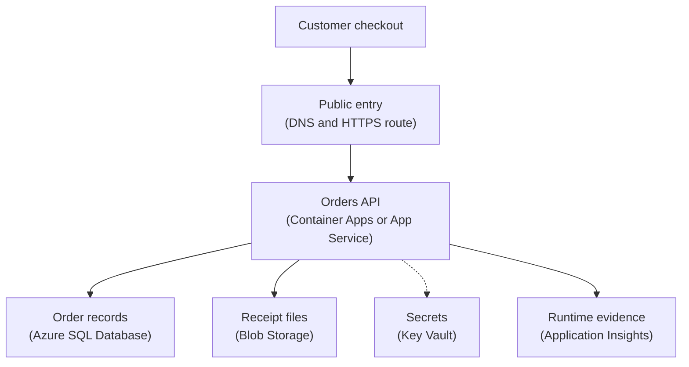

## Table of Contents

1. [A Backup Is Not A Recovery Plan](#a-backup-is-not-a-recovery-plan)
2. [If You Know AWS Recovery Planning](#if-you-know-aws-recovery-planning)
3. [The Orders Service We Need To Bring Back](#the-orders-service-we-need-to-bring-back)
4. [RTO And RPO In Plain English](#rto-and-rpo-in-plain-english)
5. [What Must Be Recoverable](#what-must-be-recoverable)
6. [Azure SQL Restore Is A New Usable Target](#azure-sql-restore-is-a-new-usable-target)
7. [Blob Storage Redundancy Protects Files Differently](#blob-storage-redundancy-protects-files-differently)
8. [Availability Zones Reduce Some Infrastructure Risk](#availability-zones-reduce-some-infrastructure-risk)
9. [Restore Drills Make The Plan Real](#restore-drills-make-the-plan-real)
10. [A Practical Recovery Card](#a-practical-recovery-card)

## A Backup Is Not A Recovery Plan

A backup by itself does not bring a service back. It is
only a possible starting point. The useful question is
bigger: if important data disappears, becomes wrong, or
becomes unreachable, can the team put the service back
into a working shape without guessing? Recovery
planning is the habit of answering that question before
the incident. It defines what must be recoverable, how
far back the team may need to go, how long the restore
may take, which Azure resources are involved, and how
the application will safely use the restored target.
This work sits between normal runtime operations and
disaster recovery. Runtime operations keeps the current
service healthy. Recovery planning asks what happens
when the current service is not enough anymore.

Maybe a bad release writes incorrect order statuses.
Maybe a developer deletes the wrong storage prefix.
Maybe the database must be restored to a point before a
bad migration. Maybe one availability zone has trouble
and the service needs enough shape to keep serving. The
running example is `devpolaris-orders-api`, a Node.js
backend that handles checkout. It runs on Azure
compute, stores final orders in Azure SQL Database,
stores receipt and export files in Blob Storage, reads
secrets from Key Vault, and emits telemetry to
Application Insights. That ordinary shape is enough to
teach the real lesson. The team does not need one
backup setting. It needs a recovery plan for the whole
service path.

> A backup answers "what copy exists?" A recovery plan answers "how do customers use the service again?"

## If You Know AWS Recovery Planning

If you have learned AWS recovery planning, the mental
model carries over well. The services and names change,
but the same questions show up.

| AWS idea you may know | Azure idea to compare first | Shared question |
|---|---|---|
| RDS point-in-time restore | Azure SQL point-in-time restore | Can we restore the database to a useful time? |
| S3 Versioning and storage classes | Blob Storage redundancy, versions, and lifecycle choices | Can we recover or retain the files we care about? |
| Availability Zones | Azure availability zones | Can the workload handle a datacenter-level failure in a region? |
| CloudWatch Logs retained for incidents | Application Insights and Log Analytics retention | Do we still have evidence after a problem? |
| Secrets Manager references | Key Vault references | Can the restored app still access secrets? |

The Azure-specific detail is that each service has its own reliability
behavior. A region may support availability zones, but a particular
Azure service or tier may still have specific requirements. A storage
account can use different redundancy options, and Azure SQL Database
restore creates a new database target rather than rewinding the running
app in place. For beginners, the practical rule is to check the recovery
behavior of each service, not just the region name.

> Do not ask "are backups enabled?" Ask "can the app use the restored thing safely?"

## The Orders Service We Need To Bring Back

Before choosing Azure settings, name the service and the promises it
makes. For `devpolaris-orders-api`, the business promise is concrete:
customers can place orders, see order status, download receipts, and
retry checkout safely if the network or payment provider stutters. The
application shape looks like this:



Read the diagram from top to bottom. Traffic reaches
the public entry, the entry sends requests to the
running app, and the app depends on data stores,
secrets, and logs. If any one of those pieces is
restored in isolation, the service may still be broken.
An Azure SQL restore might create a good database. That
database still needs a network path, credentials, app
configuration, and a safe decision about whether
production should read from it. A Blob Storage copy or
older object version might contain the missing receipt.
The application still needs to point to the correct
object key or a safe replacement.

Application Insights data may not restore the service,
but it helps the team understand what happened before
and after the incident. Here is a compact recovery card
for the service:

```text
service: devpolaris-orders-api
environment: production
runtime: Azure Container Apps app devpolaris-orders-api
traffic: orders.devpolaris.com
database: Azure SQL Database devpolaris-orders-prod
objects: storage account devpolarisordersprod
secrets: Key Vault kv-devpolaris-orders-prod
logs: Application Insights workspace devpolaris-orders-prod
release evidence: image tag, revision name, deploy time
```

The card keeps the team from saying "restore orders" and meaning five
different things. During an incident, vague words waste time, while
concrete resource names give the next engineer a place to look.

## RTO And RPO In Plain English

RTO means recovery time objective. It is the target for
how long the service can be unavailable or degraded
before the business pain becomes unacceptable. If the
orders API has an RTO of one hour for a database
recovery incident, the team is saying, "after this kind
of incident, we aim to have a useful orders service
again within one hour." RPO means recovery point
objective. It is the target for how much data the
business can afford to lose or re-create, measured as
time. If the orders database has an RPO of a few
minutes, the team is saying, "after recovery, we should
not lose more than a few minutes of accepted order
writes."

These objectives become useful only when the system and team can meet
them. Writing `RTO: 1 hour` in a document does not make recovery finish
in one hour. The backup settings, restore process, validation checks,
app config, traffic switch, and human practice must make that target
realistic. Here is a simple example. At 10:20 UTC, the team discovers
that a bad release started writing incorrect receipt status values at
10:12 UTC. The service is still online, but it is writing dangerous
data. The team stops the bad release and now has separate questions:

| Question | Plain Meaning | Example Answer |
|---|---|---|
| RTO | How quickly must checkout be safe again? | Safe order writes should return within one hour |
| RPO | How far back can recovered data be? | A few minutes can be reconciled, not an hour |
| Restore point | Which time is the last known good data state? | Restore to just before the bad write started |
| Recovery mode | How will users get a safe service again? | Repair production from a side restore, or cut over if repair is unsafe |

RTO and RPO do not choose the fix by themselves. They
shape the fix. If the RTO is short, the team may first
stop traffic to the bad version or route to a safe
revision. If the RPO is strict, the team must be
careful not to restore so far back that it loses valid
orders placed after the chosen time. This is why a
beginner should not think of recovery as "click
restore." The harder work is choosing the target and
proving the restored path is safe.

## What Must Be Recoverable

When people say "the orders service must be
recoverable," they usually mean the database first.
That is understandable, because final order rows matter
most. But a real Azure service depends on more than one
recoverable thing. For `devpolaris-orders-api`, the
recovery surface looks like this:

| Recoverable Piece | Azure Place | Why It Matters |
|---|---|---|
| Final order data | Azure SQL Database | Source of truth for order status, payments, and line items |
| Receipt and export files | Blob Storage | Customer receipts and finance files may need earlier copies |
| Runtime recipe | Container App revision or App Service deployment | The service must run a known version with the right settings |
| Configuration | App settings and environment variables | The app must point at the restored database, storage, and vault |
| Secret references | Key Vault secret names and access | The restored app needs access without copying secrets into notes |
| Public route | DNS, Front Door, Application Gateway, or app URL | Users must reach the healthy runtime after recovery |
| Evidence | Application Insights and Azure Monitor | The team needs to know what happened and prove recovery |

Each row has a different recovery style. Azure SQL
Database restore can create a database recovered to a
point in time within the available retention window.
Blob Storage redundancy protects stored data
differently depending on the redundancy option. App
runtime can often be redeployed from a known artifact
if the build and config are available. Key Vault is not
restored by a database backup, but the recovered app
still needs secret access. The secret row deserves
special care. A recovery plan should not paste secret
values into markdown. It should name the secret
reference the service expects and the identity that can
read it.

A runtime config snapshot might look like this:

```text
service: devpolaris-orders-api
runtime: Azure Container Apps

ORDERS_DB_SERVER=devpolaris-orders-sql.database.windows.net
ORDERS_DB_NAME=orders
RECEIPTS_STORAGE_ACCOUNT=devpolarisordersprod
PAYMENT_PROVIDER_API_KEY=Key Vault reference
APPLICATIONINSIGHTS_CONNECTION_STRING=from app setting
```

During a restore, one of these names may change
temporarily. A side restore might create a database
named `orders_restore_20260503_1011`. The app might
need a temporary setting change to inspect or repair
data. That is where many teams get surprised. The
backup can be healthy while the app still reads the
original broken target. Recovery planning makes the
configuration switch explicit.

## Azure SQL Restore Is A New Usable Target

Azure SQL Database automated backups can support
recovery scenarios such as point-in-time restore,
deleted database restore, long-term backup restore, and
geo-restore. The exact option depends on the database,
retention settings, and incident shape. For a beginner,
the most important idea is that restore creates a
usable database target. It does not automatically make
the application correct. If `devpolaris-orders-api`
needs a point-in-time restore, the team must decide:

- Which time should the database restore to?
- Should the restored database be used for inspection, repair, or production cutover?
- Which app setting points at the restored database?
- How will the team validate that the restored data is safe?
- What happens to orders accepted after the restore point?

Here is a realistic recovery note:

```text
incident: bad receipt status write
detected: 2026-05-03T10:20Z
bad release started: 2026-05-03T10:12Z

database action:
  restore Azure SQL Database to 2026-05-03T10:11Z
  target database: orders_restore_20260503_1011

first use:
  compare affected rows
  extract clean status values
  repair production if safe

do not:
  point production app at restored database until data reconciliation is approved
```

The "do not" line matters. A restored database can be
useful without becoming production. It may be used to
inspect old data, recover deleted rows, compare values,
or build a repair script. Cutting production over to
the restored database is a larger decision because it
can lose newer valid writes unless the team reconciles
them. Recovery is not only a database action. It is an
application and data decision.

## Blob Storage Redundancy Protects Files Differently

Blob Storage holds receipt PDFs, exports, images, or
other file-like data. Azure Storage redundancy controls
how Azure copies storage account data to protect
against hardware, zone, or regional failures, depending
on the option. For beginners, use plain names first:

| Plain Meaning | Azure Term | What To Think About |
|---|---|---|
| Copies in one datacenter | Locally redundant storage (LRS) | Lower protection, simpler cost shape |
| Copies across zones in a region | Zone-redundant storage (ZRS) | Helps with zone-level trouble where supported |
| Copies to another region | Geo-redundant storage (GRS) | Helps with regional disaster recovery planning |
| Read access in the secondary region | Read-access geo-redundant options | Useful only if the app can use the secondary path |

The exact redundancy option is not only a checkbox. It
is a tradeoff between cost, recovery promise, service
support, and application design. For
`devpolaris-orders-api`, final receipt files may
deserve stronger protection than temporary exports. A
temporary export can often be regenerated from Azure
SQL Database. A customer receipt may be more important
to retain, especially if it is the file the customer
sees or downloads later.

Redundancy is not the same as version history.
Redundancy protects against infrastructure failure by
keeping copies according to the storage account option.
It does not automatically mean the team can undo an
application that overwrote a blob with wrong content.
For overwrite and deletion mistakes, the team needs the
right data protection features and lifecycle decisions
for that storage account. A storage recovery review
might say:

```text
storage account: devpolarisordersprod
important prefixes:
  receipts/
  finance-exports/
  smoke-tests/

receipt policy:
  protect customer receipts
  review redundancy and retention

export policy:
  keep only approved period
  regenerate from database when possible

smoke test policy:
  short retention
  safe cleanup expected
```

This is the shape of a useful file recovery plan. It
separates file types by business meaning instead of
treating every blob the same way.

## Availability Zones Reduce Some Infrastructure Risk

Availability zones are physically separate groups of
datacenters within an Azure region. They have
independent power, cooling, and networking. In regions
and services that support them, zones can help the
workload keep serving when one zone has trouble. Zones
are useful, but they are not a full recovery plan by
themselves. They do not fix a bad deploy. They do not
undo a wrong database write. They do not replace
backups. They do not guarantee every Azure service in
your design is protected the same way.

For `devpolaris-orders-api`, zone thinking should be
practical:

| Layer | Zone Question |
|---|---|
| Runtime | Can app instances run across zones or use a service that handles zone resilience? |
| Database | Does the chosen Azure SQL configuration support the needed availability behavior? |
| Storage | Does the storage redundancy option protect against the failure we care about? |
| Monitoring | Will enough telemetry remain available during the incident? |
| Secrets | Can the runtime still access Key Vault during the failure shape? |

The key phrase is "failure shape." A zone failure is
different from a bad schema migration. A regional
outage is different from a deleted blob. A broken Key
Vault permission is different from an unhealthy app
replica. Availability zones help with some
infrastructure failures. Backups and restore help with
data recovery. Rollback helps with bad releases.
Monitoring helps with diagnosis. A good recovery plan
names which tool protects which failure.

## Restore Drills Make The Plan Real

A restore drill is a practice run for recovery. It does
not need to be dramatic. It should be controlled,
documented, and safe. The point is to prove that the
team can turn recovery settings into a usable service
path. For `devpolaris-orders-api`, a useful drill could
be:

```text
drill: Azure SQL point-in-time restore inspection
source database: devpolaris-orders-prod
restore target: orders_restore_drill_20260503
restore point: previous day 12:00 UTC

validation:
  restored database exists
  orders table can be queried
  app can connect in staging using temporary setting
  fake checkout remains pointed at staging resources
  production is unchanged

cleanup:
  delete restore target after approval
  record duration and issues
```

The drill teaches things no document can fully prove.
It shows whether people have permission. It shows
whether names are clear. It shows how long restore
takes in practice. It shows whether the app can connect
to a restored target. It shows whether cleanup is safe.
Most importantly, it turns RTO and RPO from guesses
into evidence. If the team says recovery should take
one hour, but the drill takes three hours because
permissions were missing, the plan is not bad because
the team learned something. The plan is bad only if
nobody updates it.

After a drill, record:

- How long restore took.
- Which permissions were missing.
- Which app settings had to change.
- Which validation checks proved the data was usable.
- Which cleanup steps were required.
- Whether the stated RTO and RPO still look honest.

That is boring in the best way. Boring recovery is what
you want.

## A Practical Recovery Card

A practical recovery card should be small enough to use
during a stressful moment. For `devpolaris-orders-api`,
start with this:

```text
service: devpolaris-orders-api
owner: orders-api team

user promise:
  checkout should recover within 1 hour for database restore incidents
  accepted order data should recover as close as backup settings allow

critical data:
  Azure SQL Database: devpolaris-orders-prod
  Blob Storage receipts: devpolarisordersprod/receipts/

restore targets:
  SQL point-in-time restore creates a new database target
  receipt recovery depends on storage protection and object policy

runtime checks after restore:
  app setting points at intended database
  managed identity can read Key Vault
  fake checkout passes
  Application Insights shows no new dependency failures

do not forget:
  reconcile orders written after restore point
  clean up temporary restore targets
  record recovery duration
```

This card does not contain every step. It contains the
facts the team must not invent during an incident. The
most important line may be "reconcile orders written
after restore point." Beginners often imagine restore
as returning to safety. Sometimes it does. Sometimes it
creates a second problem: what happens to valid writes
after the chosen restore time? That is why recovery
planning is an engineering topic, not only an Azure
setting. Backups, redundancy, zones, and restore
targets are tools. The service promise is the real
goal. The team should be able to say: here is what we
protect, here is how fast we aim to recover, here is
how much data risk we accept, and here is the last
drill that proved the plan.

---

**References**

- [Restore a database from a backup in Azure SQL Database](https://learn.microsoft.com/azure/azure-sql/database/recovery-using-backups?tabs=azure-portal&view=azuresql) - Microsoft explains point-in-time restore, deleted database restore, long-term backup restore, and geo-restore.
- [Change automated backup settings in Azure SQL Database](https://learn.microsoft.com/en-us/azure/azure-sql/database/automated-backups-change-settings?tabs=powershell&view=azuresql) - Microsoft explains automated backup retention and backup storage redundancy settings.
- [Azure Storage redundancy](https://learn.microsoft.com/en-us/azure/storage/common/storage-redundancy) - Microsoft explains locally redundant, zone-redundant, geo-redundant, and read-access redundancy options.
- [What are Azure availability zones?](https://learn.microsoft.com/en-us/azure/reliability/availability-zones-overview) - Microsoft explains availability zones and how they support reliability within a region.
- [Azure reliability documentation](https://learn.microsoft.com/en-us/azure/reliability/overview) - Microsoft explains Azure reliability concepts and service-specific reliability guides.
