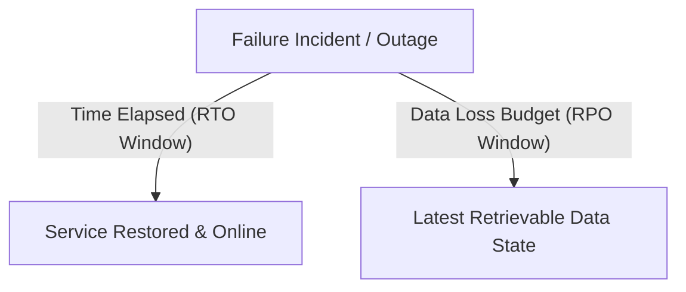
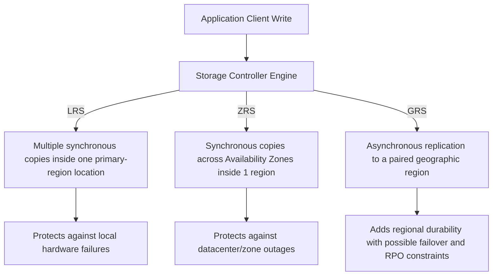
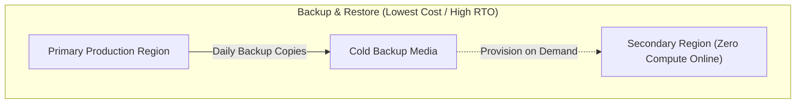
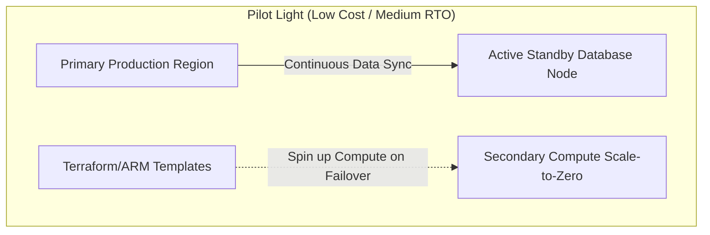
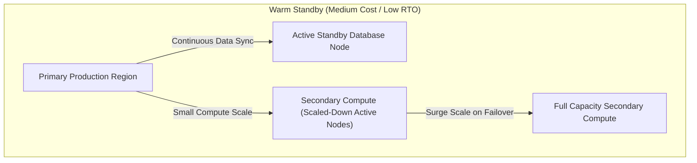
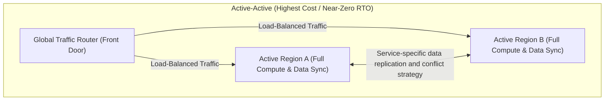
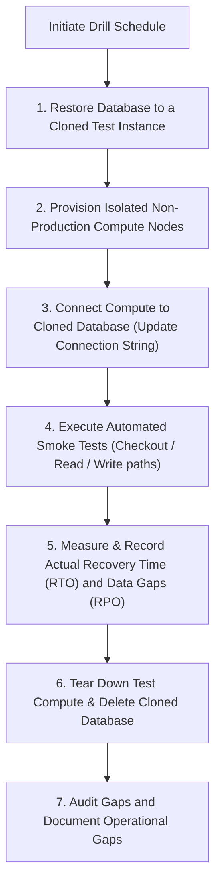
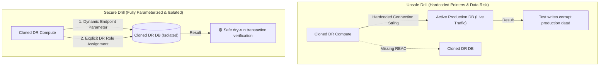

## Table of Contents

1. [What Is Recovery Planning](#what-is-recovery-planning)
2. [Quantifying Recovery Metrics (RTO and RPO)](#quantifying-recovery-metrics-rto-and-rpo)
3. [Database and Object Protection Architectures](#database-and-object-protection-architectures)
4. [Physical Redundancy Levels (LRS vs. ZRS vs. GRS)](#physical-redundancy-levels-lrs-vs-zrs-vs-grs)
5. [Disaster Recovery Strategies](#disaster-recovery-strategies)
6. [Executing Verifiable Restore Drills](#executing-verifiable-restore-drills)
7. [Putting It All Together](#putting-it-all-together)

## What Is Recovery Planning

A cloud disaster recovery plan is the tested restore workflow for bringing compute, networking, data, and access controls back to a working state after a failure. It is the documented engineering workflow that orchestrates the restoration of application compute, networking, data stores, and access security to a functioning operational state following an infrastructure failure. The primary operational trap is confusing a static backup copy with a functional recovery pipeline. Having automated transaction logs or daily file snapshots does not mean your service is resilient. A backup is merely a passive data asset; a recovery plan defines what physical resources must be provisioned, how much data can be lost, how long the cutover takes, and how the application dynamically re-establishes network connections and access permissions.

If you design disaster recovery strategies on AWS, these technical boundaries correspond directly to your existing systems:

* **Disaster Recovery Speeds**: The classic spectrum of disaster recovery methods - moving from low-cost, high-latency Backup and Restore to pilot lights, warm standbys, and high-cost active-active multi-region failovers - is identical across both cloud providers.
* **DNS Failover Controllers**: While AWS routes global traffic using Route 53 latency and failover routing policies, Azure can steer clients with Azure Traffic Manager, which is a DNS-based traffic distribution service, or with Azure Front Door, which is a global layer 7 entry point for HTTP and HTTPS applications.

:::expand[Under the Hood: Crash-Consistent vs. Application-Consistent Snapshots and Replication Physics]{kind="design"}
Creating durable snapshots and executing geo-replication loops requires managing the physics of memory buffers, lock states, and network latency constraints:

* **Crash-Consistent Snapshots**: For VM-level backup, the platform can capture only the data that already exists on disk at the time of the backup. Data still sitting in memory or write cache is not captured. When the VM starts after restore, the operating system and database engine recover the way they would after a sudden power loss, using filesystem checks and transaction logs to roll back incomplete work.
* **Application-Consistent Snapshots**: For VM workloads, Azure Backup can coordinate with VSS on Windows or pre/post scripts on Linux so applications flush pending writes before the snapshot is taken. This is different from Azure SQL Database, where the database service manages its own automated backups and point-in-time restore chain. Do not assume every Azure backup mechanism has the same consistency model.
* **Geo-Replication Sync Loops**: Azure regional disaster recovery is service-specific. Azure Storage GRS and GZRS copy data asynchronously from the primary region to a paired secondary region, so a primary-region failure can leave the secondary behind the latest writes. Azure SQL active geo-replication and failover groups also use secondary databases in another region, but their failover behavior, listener endpoints, and data-loss expectations are governed by Azure SQL business-continuity rules rather than Blob Storage redundancy settings.
:::

Rather than viewing disaster recovery as an all-or-nothing requirement, treat recovery as a design conversation. You define strict reliability targets per workflow, select the correct redundancy boundaries, and run routine tests to prove your recovery plan works under active failure conditions.

## Quantifying Recovery Metrics (RTO and RPO)

RTO and RPO are the two recovery targets that tell the team how long the service may be down and how much recent data may be lost. Every resilient cloud design is sized, budgeted, and measured against these metrics:

* **Recovery Time Objective (RTO)**: The maximum acceptable duration of service downtime before the system must be restored to a functioning state, measured in time (e.g., 30 minutes).
* **Recovery Point Objective (RPO)**: The maximum acceptable age of data that can be lost following a restore, defining your data loss budget measured in time (e.g., 5 minutes of transactional records).

Different system components and business workflows require different RTO and RPO allocations:

| System Workflow | Primary RTO Target | Primary RPO Target | Physical Azure Target Configuration |
| --- | --- | --- | --- |
| **Transaction Checkout API** | 15 Minutes | 5 Minutes | Zone-redundant Azure SQL for local high availability, plus active geo-replication or a failover group for regional disaster recovery, with Front Door routing application traffic to the healthy region. |
| **Customer File Downloads** | 4 Hours | 1 Hour | Blob Storage with Zone-Redundant Storage (ZRS) and enabled Soft Delete / versioning. |
| **Telemetry logs & Search Index** | 24 Hours | 24 Hours | Standard Analytics tier workspaces, with the ability to rebuild indices from databases. |
| **Nightly Finance Exports** | 24 Hours | Rerun on demand | Cheap, Locally Redundant Storage (LRS) paired with scheduled execution runbooks. |

Designing for short RTOs and RPOs requires warm pre-provisioned compute, database replication that matches the failure boundary, automated traffic health probes, and active human on-call rosters, generating high continuous infrastructure costs. Local high availability and regional disaster recovery are different promises. Zone-redundant Azure SQL can keep a database available during many local or zonal failures, but a regional outage plan needs a secondary region, failover routing, connection-string strategy, secrets, identity assignments, and a tested application cutover.

## Database and Object Protection Architectures

Database and object protection are different recovery layers: databases need restore points for structured state, while object stores need deletion and overwrite protection for files. To protect your core source-of-truth data, you must combine database point-in-time recovery tools with object-level storage protections:

* **Azure SQL Point-in-Time Restore (PITR)**: Azure SQL Database automatically generates full, differential, and transaction log backups so you can restore a database to a selected point in time within the configured retention window, commonly up to 35 days for short-term retention. When you trigger a point-in-time restore, the platform provisions a new database beside the original. The restored database has its own name (e.g., `db-orders-restored-1020`), requiring you to update your application connection strings or surgically copy recovered rows to complete the recovery.
* **Blob Storage Data Protection**: Protecting unstructured files requires enabling two primary data-plane features:
    * **Blob Soft Delete**: Keeps deleted blobs, versions, or snapshots intact in a hidden platform pool for a designated retention window (e.g., 14 days), protecting files from accidental script deletions.
    * **Object Versioning**: Automatically preserves historical copies of a blob when it is overwritten, allowing you to roll back to previous versions if a script writes corrupt data.

Separate your data assets into distinct storage containers based on their recovery needs, enabling versioning and soft delete on critical transactional assets while using cheap, standard policies for short-lived temporary files.

## Physical Redundancy Levels (LRS vs. ZRS vs. GRS)

Redundancy is the replica placement policy for storage data. It controls how many physical copies of your data the Azure storage fabric maintains, and where those copies are distributed.

*Redundancy levels widen the failure scope the data can survive, and the wider scope usually costs more.*

Select the redundancy level that matches your durability budget:

Differentiate between backup capabilities and physical redundancy. If a user deletes a file and no object versioning or soft delete is enabled, the storage controllers will delete the file across all redundant nodes, copying the deletion. Use redundancy to survive physical hardware outages, and use backups and soft delete to recover from data corruptions.

## Disaster Recovery Strategies

A disaster recovery strategy is the readiness level of your secondary environment: no compute until restore, a small always-ready core, a scaled-down working stack, or full multi-region operation. The four primary strategies represent a spectrum of cost-to-recovery tradeoffs:

* **Backup and Restore**: Low steady-state cost (paying only for storage backups). If the primary region collapses, you must provision compute, attach restored databases, configure routes, and update DNS. RTO is measured in hours or days.
* **Pilot Light**: The primary database replicates continuously to a secondary region through a service feature such as Azure SQL active geo-replication, a failover group, or an equivalent data replication design for the workload. Compute resources are provisioned but scaled to zero or kept offline. On failover, you run deployment scripts to spin up compute and route the application to the secondary environment. RTO is measured in minutes when the automation is already tested.
* **Warm Standby**: A small, functional duplicate of your compute stack runs continuously in the secondary region. If the primary region fails, you route traffic to the standby and trigger auto-scaling rules to surge compute capacity. RTO can be low, but the exact target depends on database failover time, DNS or Front Door behavior, application warm-up, and operational approval steps.
* **Active-Active**: Fully active compute and database stacks operate concurrently in multiple regions. Global traffic routers balance requests between regions. If a region fails, the router shifts all traffic to the healthy region. RTO can approach zero for stateless HTTP routing, but the data layer still needs a conflict, consistency, and failover design. Continuous infrastructure and replication costs are often close to doubled.

Choose the strategy that aligns with your workflow's financial value and downtime impact, avoiding the cost leak of deploying active-active architectures for low-priority services.

## Executing Verifiable Restore Drills

A restore drill is a controlled proof that the recovery workflow works inside the target RTO and RPO. A disaster recovery plan is merely a theory until a successful restore drill demonstrates that your team can recover the system within your target RTO.

*Restore drills close the loop between written recovery targets and evidence that the system can actually recover.*

To run a safe, isolated recovery drill without disrupting production traffic, establish a structured sequence:

Executing this drill regularly ensures that your operations team identifies hardcoded database names, missing firewall rules, stale connection string secrets, and undocumented setup steps before an actual production incident occurs.

:::expand[Pitfall: Drill Blocked by Hardcoded Secrets and Identity Gaps]{kind="pitfall"}
A disastrous failure mode in disaster recovery is discovering that your cloned recovery environment cannot run because of hardcoded configuration strings or missing identity role assignments. During a restore drill, you might successfully restore your production SQL database to a cloned instance named `db-orders-restored` and spin up duplicate container instances. However, upon boot, the restored application either crashes instantly or, worst of all, silently connects back to your *active, primary production database*.

This happens because the application's environment configuration, Bicep templates, or Key Vault Secret References contain hardcoded hostnames pointing directly to the primary environment (e.g., `db-orders-prod.database.windows.net`). If the application successfully logs in, your drill will execute test database writes directly on live production tables, corrupting real customer records. Alternatively, if you successfully parameterized the database endpoint, the boot will still fail with a `403 Forbidden` if your cloned compute's managed identity lacks the necessary data-plane role assignments on the newly provisioned `db-orders-restored` database.

This identical hazard occurs in AWS recovery planning. If you spin up an isolated EC2 or ECS recovery environment in a secondary region, the restored containers will fail to operate if their database endpoints are hardcoded to the primary RDS writer endpoint, or if their ECS Task Role lacks the IAM permissions to decrypt the secondary region's KMS key or read the newly provisioned DynamoDB table.

The top-down diagram below compares a failed, unsafe recovery drill with a secure, parameterized recovery drill:

**Rule of thumb:** Never hardcode resource hostnames, connection strings, or Vault URLs. Always parameterize endpoints, and ensure your disaster recovery orchestration templates automate both the provisioning of the cloned databases AND the creation of corresponding managed identity role assignments for the restored compute.
:::

## Putting It All Together

A resilient Azure architecture is built on verified recovery pipelines, aligned RTO/RPO targets, and continuous restore drills.

* **Differentiate Operations**: Separate the creation of static backup sources from the design of active recovery execution pipelines.
* **Quantify Windows**: Define strict Recovery Time Objectives (RTO) and Recovery Point Objectives (RPO) per workflow to balance reliability budgets.
* **Object Protection**: Pair Azure SQL Point-in-Time Restores with Blob soft delete and versioning to protect data from logical deletion or corruption.
* **Redundancy Limits**: Use storage redundancy (LRS, ZRS, GRS) to survive physical hardware and zonal outages, rather than relying on it to fix logical data deletions.
* **Match Strategies**: Size your disaster recovery strategy (Backup and Restore, Pilot Light, Warm Standby, Active-Active) to the business value of your service workflows.
* **Verify Drills**: Run regular, isolated restore drills to measure active RTOs and RPOs, validate traffic and identity cutover, and discover configuration gaps under safe, non-production perimeters.

*Use this as the recovery planning ladder: redundancy changes which failures you can survive, but RPO, RTO, and restore drills decide whether the business can actually recover.*

---

**References**

* [Automated backups in Azure SQL Database](https://learn.microsoft.com/en-us/azure/azure-sql/database/automated-backups-overview)
* [Data protection overview for Azure Storage](https://learn.microsoft.com/en-us/azure/storage/blobs/data-protection-overview)
* [Azure Disaster Recovery strategies Well-Architected guide](https://learn.microsoft.com/en-us/azure/well-architected/reliability/disaster-recovery)
* [Run a disaster recovery drill in Azure](https://learn.microsoft.com/en-us/azure/site-recovery/site-recovery-test-failover-to-azure)
* [Restore a database from a backup in Azure SQL Database](https://learn.microsoft.com/en-us/azure/azure-sql/database/recovery-using-backups)
* [Azure SQL Database availability through local and zone redundancy](https://learn.microsoft.com/en-us/azure/azure-sql/database/high-availability-sla)
* [Failover groups overview and best practices for Azure SQL Database](https://learn.microsoft.com/en-us/azure/azure-sql/database/auto-failover-group-sql-db)
* [Azure Traffic Manager overview](https://learn.microsoft.com/en-us/azure/traffic-manager/traffic-manager-overview)
* [Azure Front Door overview](https://learn.microsoft.com/en-us/azure/frontdoor/front-door-overview)
* [About Azure VM backup](https://learn.microsoft.com/en-us/azure/backup/backup-azure-vms-introduction)
