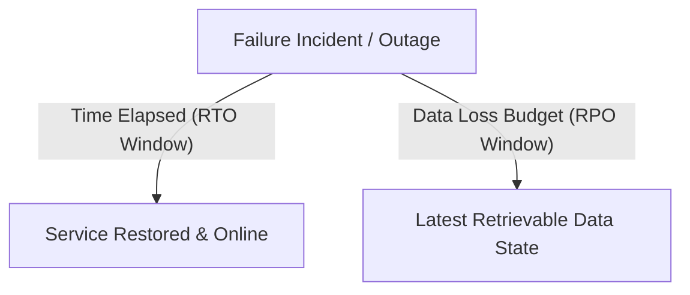
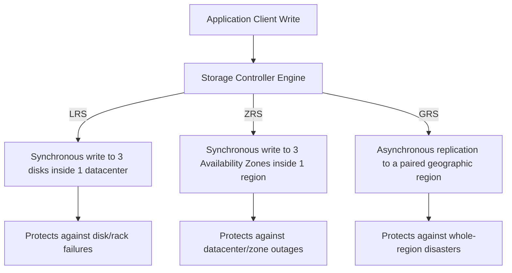
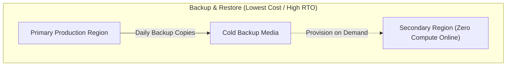
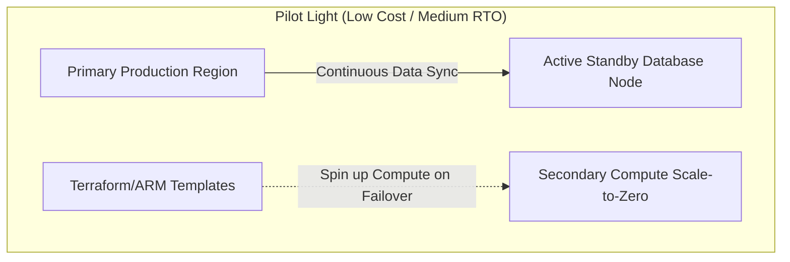
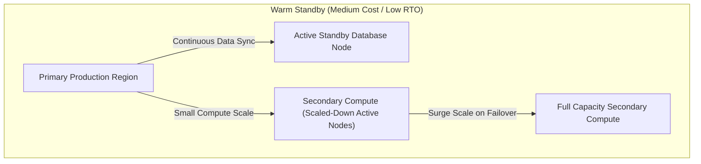
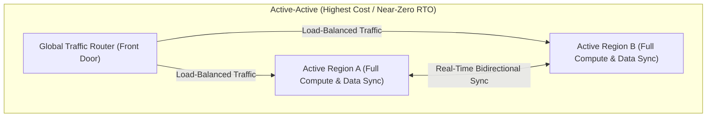
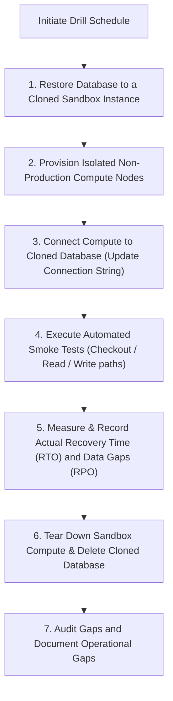

## Table of Contents

1. [What Is Recovery Planning](#what-is-recovery-planning)
2. [Quantifying Recovery Metrics (RTO and RPO)](#quantifying-recovery-metrics-rto-and-rpo)
3. [Database and Object Protection Architectures](#database-and-object-protection-architectures)
4. [Physical Redundancy Levels (LRS vs. ZRS vs. GRS)](#physical-redundancy-levels-lrs-vs-zrs-vs-grs)
5. [Disaster Recovery Strategies](#disaster-recovery-strategies)
6. [Executing Verifiable Restore Drills](#executing-verifiable-restore-drills)
7. [Putting It All Together](#putting-it-all-together)

## What Is Recovery Planning

A cloud disaster recovery plan is the documented, tested engineering workflow that orchestrates the restoration of application compute, networking, data stores, and access security to a functioning operational state following an infrastructure failure. The primary operational trap is confusing a static backup copy with a functional recovery pipeline. Having automated transaction logs or daily file snapshots does not mean your service is resilient. A backup is merely a passive data asset; a recovery plan defines what physical resources must be provisioned, how much data can be lost, how long the cutover takes, and how the application dynamically re-establishes network connections and access permissions.

If you design disaster recovery strategies on AWS, these technical boundaries correspond directly to your existing systems:

* **Disaster Recovery Speeds**: The classic spectrum of disaster recovery methods—moving from low-cost, high-latency Backup and Restore to pilot lights, warm standbys, and high-cost active-active multi-region failovers—is identical across both cloud providers.
* **DNS Failover Controllers**: While AWS routes global traffic using Route 53 latency and failover routing policies, Azure orchestrates geo-routing and regional failover switches using Azure Traffic Manager (layer 4 DNS routing) and Azure Front Door (layer 7 global load balancing and HTTP routing).

:::expand[Under the Hood: Crash-Consistent vs. Application-Consistent Snapshots and Replication Physics]{kind="design"}
Creating durable snapshots and executing geo-replication loops requires managing the physics of memory buffers, lock states, and network latency constraints:

* **Crash-Consistent Snapshots**: The platform captures disk sectors exactly as they reside on persistent SSD SSD grids at a specific millisecond. If a snapshot occurs while a high-write database is running, the snapshot captures the on-disk state but misses the dirty pages still held in host memory buffers. It also captures incomplete, torn transactions. Upon restore, the database engine must run its recovery log to roll back these uncommitted transactions, operating identically to a system recovering from a sudden power outage.
* **Application-Consistent Snapshots**: For critical transactional databases, you must coordinate snapshots at the application level. The backup coordinator pauses database writes, flushes all in-memory dirty pages and active transaction logs to physical disk, locks the tables briefly, and then triggers the storage snapshot. This ensures that the restored disk contains a clean, immediately mountable database state without uncommitted transactions.
* **Geo-Replication Sync Loops**: When you configure Geo-Redundant Storage (GRS) or Azure SQL Active Geo-Replication, the primary region executes writes synchronously. The primary storage controller then streams the transaction blocks asynchronously over Microsoft's private global fiber network to a paired secondary region located hundreds of miles away. Because the replication is asynchronous, a catastrophic primary region collapse exposes a data loss window (typically under 15 minutes) represented by the blocks transit queue at the moment of the outage.
:::

Rather than viewing disaster recovery as an all-or-nothing requirement, treat recovery as a design conversation. You define strict reliability targets per workflow, select the correct redundancy boundaries, and run routine tests to prove your recovery plan works under active failure conditions.

## Quantifying Recovery Metrics (RTO and RPO)

Every resilient cloud design is sized, budgeted, and measured against two primary metrics that define your recovery window:

* **Recovery Time Objective (RTO)**: The maximum acceptable duration of service downtime before the system must be restored to a functioning state, measured in time (e.g., 30 minutes).
* **Recovery Point Objective (RPO)**: The maximum acceptable age of data that can be lost following a restore, defining your data loss budget measured in time (e.g., 5 minutes of transactional records).

Different system components and business workflows require different RTO and RPO allocations:

| System Workflow | Primary RTO Target | Primary RPO Target | Physical Azure Target Configuration |
| --- | --- | --- | --- |
| **Transaction Checkout API** | 15 Minutes | 5 Minutes | Azure SQL Business Critical with synchronous replicas, and Front Door active-passive failover routes. |
| **Customer File Downloads** | 4 Hours | 1 Hour | Blob Storage with Zone-Redundant Storage (ZRS) and enabled Soft Delete / versioning. |
| **Telemetry logs & Search Index** | 24 Hours | 24 Hours | Standard Analytics tier workspaces, with the ability to rebuild indices from databases. |
| **Nightly Finance Exports** | 24 Hours | Rerun on demand | Cheap, Locally Redundant Storage (LRS) paired with scheduled execution runbooks. |

Designing for short RTOs and RPOs requires warm pre-provisioned compute, real-time database replication, automated DNS health probes, and active human on-call rosters, generating high continuous infrastructure costs.

## Database and Object Protection Architectures

To protect your core source-of-truth data, you must combine database point-in-time recovery tools with object-level storage protections:

* **Azure SQL Point-in-Time Restore (PITR)**: Azure SQL Database automatically generates a continuous streams of transaction log backups. This allows you to restore your database to any exact millisecond within your retention window (up to 35 days). When you trigger a point-in-time restore, the platform provisions a brand-new database instance beside the original. The restored database inherits a new name (e.g., `db-orders-restored-1020`), requiring you to update your application connection strings or surgically copy recovered rows to complete the recovery.
* **Blob Storage Data Protection**: Protecting unstructured files requires enabling two primary data-plane features:
    * **Blob Soft Delete**: Keeps deleted blobs, versions, or snapshots intact in a hidden platform pool for a designated retention window (e.g., 14 days), protecting files from accidental script deletions.
    * **Object Versioning**: Automatically preserves historical copies of a blob when it is overwritten, allowing you to roll back to previous versions if a script writes corrupt data.

Separate your data assets into distinct storage containers based on their recovery needs, enabling versioning and soft delete on critical transactional assets while using cheap, standard policies for short-lived temporary files.

## Physical Redundancy Levels (LRS vs. ZRS vs. GRS)

Redundancy controls how many physical copies of your data the Azure storage fabric maintains, and where those copies are distributed.

Select the redundancy level that matches your durability budget:

Differentiate between backup capabilities and physical redundancy. If a user deletes a file and no object versioning or soft delete is enabled, the storage controllers will delete the file across all redundant nodes, copying the deletion. Use redundancy to survive physical hardware outages, and use backups and soft delete to recover from data corruptions.

## Disaster Recovery Strategies

Your overall disaster recovery strategy defines the deployment architecture and readiness state of your secondary environments. The four primary strategies represent a spectrum of cost-to-recovery tradeoffs:

* **Backup and Restore**: Low steady-state cost (paying only for storage backups). If the primary region collapses, you must provision compute, attach restored databases, configure routes, and update DNS. RTO is measured in hours or days.
* **Pilot Light**: The primary database replicates continuously to a secondary standby node. Compute resources are provisioned but scaled to zero or kept offline. On failover, you run deployment scripts to spin up compute and scale the application instantly. RTO is measured in minutes.
* **Warm Standby**: A small, functional duplicate of your compute stack runs continuously in the secondary region. If the primary region fails, you route traffic to the standby and trigger auto-scaling rules to surge compute capacity. RTO is under 15 minutes.
* **Active-Active**: Fully active compute and database stacks operate concurrently in multiple regions. Global traffic routers balance requests between regions. If a region fails, the router shifts all traffic to the healthy region instantly. RTO is near-zero, but continuous infrastructure and replication costs are doubled.

Choose the strategy that aligns with your workflow's financial value and downtime impact, avoiding the cost leak of deploying active-active architectures for low-priority services.

## Executing Verifiable Restore Drills

A disaster recovery plan is merely a theory until a successful restore drill demonstrates that your team can recover the system within your target RTO.

To run a safe, isolated recovery drill without disrupting production traffic, establish a structured sequence:

Executing this drill regularly ensures that your operations team identifies hardcoded database names, missing firewall rules, stale connection string secrets, and undocumented setup steps before an actual production incident occurs.

## Putting It All Together

A resilient Azure architecture is built on verified recovery pipelines, aligned RTO/RPO targets, and continuous restore drills.

* **Differentiate Operations**: Separate the creation of static backup sources from the design of active recovery execution pipelines.
* **Quantify Windows**: Define strict Recovery Time Objectives (RTO) and Recovery Point Objectives (RPO) per workflow to balance reliability budgets.
* **Object Protection**: Pair Azure SQL Point-in-Time Restores with Blob soft delete and versioning to protect data from logical deletion or corruption.
* **Redundancy Limits**: Use storage redundancy (LRS, ZRS, GRS) to survive physical hardware and zonal outages, rather than relying on it to fix logical data deletions.
* **Match Strategies**: Size your disaster recovery strategy (Backup and Restore, Pilot Light, Warm Standby, Active-Active) to the business value of your service workflows.
* **Verify Drills**: Run regular, isolated restore drills to measure active RTOs and discover configuration gaps under safe, non-production perimeters.

---

**References**

* [Automated backups in Azure SQL Database](https://learn.microsoft.com/en-us/azure/azure-sql/database/automated-backups-overview)
* [Data protection overview for Azure Storage](https://learn.microsoft.com/en-us/azure/storage/blobs/data-protection-overview)
* [Azure Disaster Recovery strategies Well-Architected guide](https://learn.microsoft.com/en-us/azure/well-architected/reliability/disaster-recovery)
* [Run a disaster recovery drill in Azure](https://learn.microsoft.com/en-us/azure/site-recovery/site-recovery-test-failover-to-azure)
