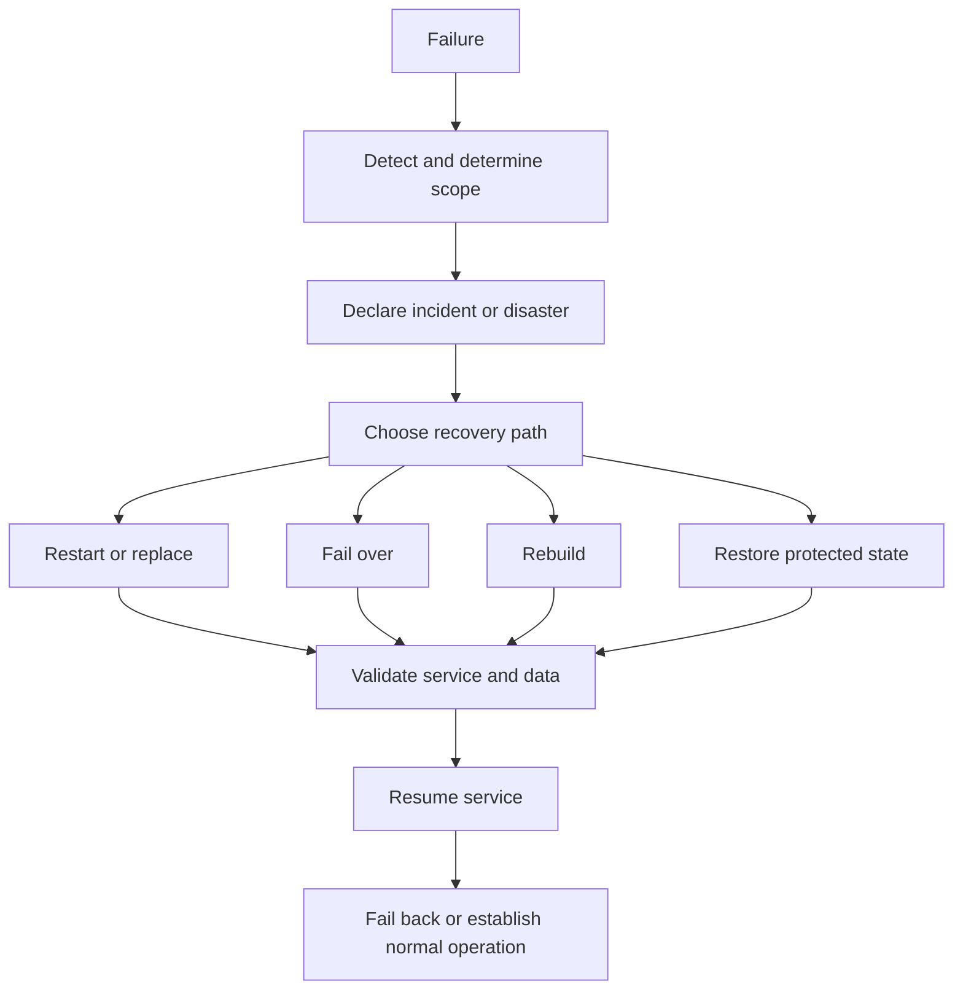
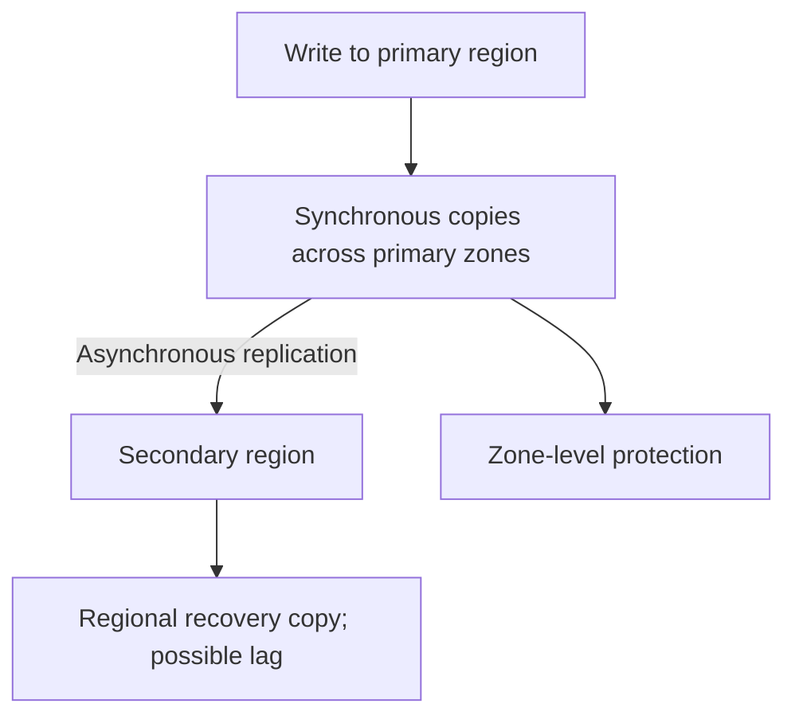
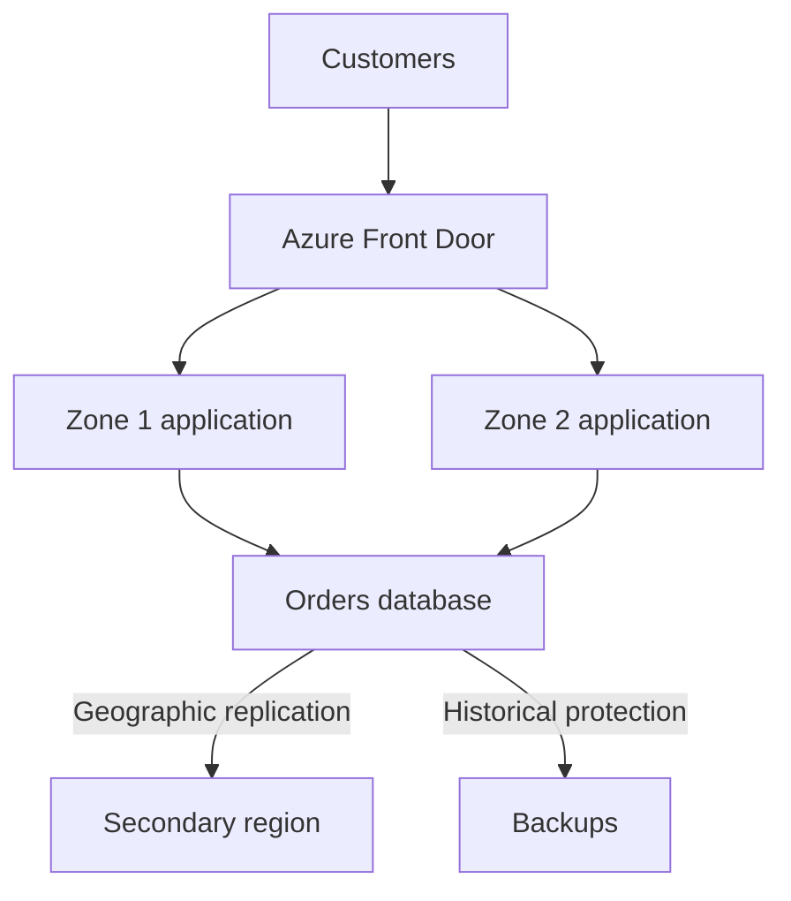

## Table of Contents

1. [Why Must Every System Expect Failure?](#why-must-every-system-expect-failure)
2. [How Do Backup and Recovery Differ?](#how-do-backup-and-recovery-differ)
3. [What Do RTO, RPO, and Recovery Points Measure?](#what-do-rto-rpo-and-recovery-points-measure)
4. [How Does Azure Storage Redundancy Limit Failure?](#how-does-azure-storage-redundancy-limit-failure)
5. [What Recovery Strategies Can Teams Choose?](#what-recovery-strategies-can-teams-choose)
6. [How Do Restore Drills Prove Recovery?](#how-do-restore-drills-prove-recovery)
7. [How Does the Recovery Plan Fit Together?](#how-does-the-recovery-plan-fit-together)
8. [Check Your Answers](#check-your-answers)
9. [References](#references)

A database backup can preserve yesterday's records, but users cannot send requests to a backup file. The data must be restored somewhere, the application must connect to it, and the people managing the incident must confirm that the service is safe to reopen.

Recovery planning covers that whole process. It starts with two business limits: how long the service can be unavailable and how much recent data can be lost. Those limits determine which resources need to be ready, which data needs protection, and what a recovery exercise must prove.

1. **Why Must Every System Expect Failure?**
2. **How Do Backup and Recovery Differ?**
3. **What Do RTO, RPO, and Recovery Points Measure?**
4. **How Does Azure Storage Redundancy Limit Failure?**
5. **What Recovery Strategies Can Teams Choose?**
6. **How Do Restore Drills Prove Recovery?**
7. **How Does the Recovery Plan Fit Together?**

## Why Must Every System Expect Failure?
<!-- section-summary: Recovery planning starts with acceptable downtime and data loss because redundancy cannot absorb every failure. -->

A VM can stop, a disk can become corrupted, or someone can delete needed data. Credentials can be compromised. A disruption can affect an Availability Zone or make an entire Azure region unavailable. No architecture removes every one of these possibilities.

The practical question is how much disruption and data loss the business can accept when a failure occurs, and what it is reasonable to spend to remain within those limits. Azure's Well-Architected guidance calls for structured, documented, tested recovery plans because some failures require recovery even when the architecture includes redundancy.

Two targets express the basic requirement. The **recovery time objective**, or RTO, limits how long recovery may take. The **recovery point objective**, or RPO, limits how much recent data may be lost, measured as a time window. They describe separate dimensions of recovery: the return of the service and the freshness of the data it can use.

Those targets should come from business impact. Suppose checkout being unavailable costs £50,000 per hour. An additional £4,000 per month for a design that greatly shortens recovery may be justified. An internal HR reporting application might cause little harm during a six-hour interruption. Giving both applications the same active/active multi-region architecture would ignore that difference.

Start with the business process and the effects of its failure. Establish acceptable downtime and data loss, translate them into RTO and RPO, and choose the architecture and cost accordingly. The existence of a geo-replication feature is useful only after the workload has a reason to use it.

This also explains why recovery objectives need a named failure. Restarting a failed process and recovering from compromised credentials are different jobs. A plan that only says “recover quickly” does not tell the team which condition it was designed to handle.

## How Do Backup and Recovery Differ?
<!-- section-summary: A backup preserves a historical asset; recovery turns protected state, infrastructure, configuration, and operational decisions into a usable service. -->

A **backup** provides a copy of data from an earlier point in time. If backups are taken at 10:00, 11:00, 12:00, and 13:00, and corruption begins at 12:45, the 12:00 copy may provide a usable starting point.

**Recovery** is the capability to turn that protected data back into a working business service. It can require restoring a database, deploying the application, restoring configuration and secrets, reconnecting networks, updating DNS, validating transactions, and admitting customer traffic.

The distinction is visible when a production database disappears. Having its backup still leaves many decisions unresolved. Where will it be restored? How long will restoring 20 TB take? Are the encryption keys available, and who has permission to restore? Can the application reach the target database, and how will its servers be rebuilt?

The plan must also address DNS, messages waiting in queues, and which backup is known to be clean. It needs criteria for declaring a disaster, a person authorized to make that decision, checks for the restored system, and a plan for returning users to normal operation afterward.

A complete recovery path therefore looks like this:

```mermaid
flowchart TD
    failure["Failure"] --> detect["Detect and determine scope"]
    detect --> declare["Declare incident or disaster"]
    declare --> choose["Choose recovery path"]
    choose --> restart["Restart or replace"]
    choose --> failover["Fail over"]
    choose --> rebuild["Rebuild"]
    choose --> restore["Restore protected state"]
    restart --> validate["Validate service and data"]
    failover --> validate
    rebuild --> validate
    restore --> validate
    validate --> resume["Resume service"]
    resume --> normalize["Fail back or establish normal operation"]
```

The recovery path depends on the incident. A process may only need restarting, while a damaged database may need historical data restored into another environment. The plan supplies the decisions that connect those actions to a usable service.

A backup job marked **Succeeded** confirms that the backup operation produced protected data. It does not establish that the organization can restore the complete service within its target time. That requires a recovery test involving the surrounding dependencies and procedures.

### Keep historical protection separate from redundancy

Three synchronized copies can all contain the same mistake. Suppose Copies A, B, and C hold a customer record. A destructive operation such as `DELETE customer;` removes it, and replication carries the deletion to the other copies. The infrastructure has redundancy, but the logical record is still gone.

Azure Storage documentation explains that replicas reflect the current state, including propagated deletions and overwrites. Such redundancy protects against infrastructure failures. Earlier recovery points provide a different capability: returning to a trustworthy historical state.

Many workloads need both. A replica can help continue service when hardware fails; a backup can help recover data from before an accidental or malicious change. Treating those protections as interchangeable leaves a gap precisely when the damage is copied successfully.

## What Do RTO, RPO, and Recovery Points Measure?
<!-- section-summary: RTO measures the complete restoration window; RPO and recovery-point policy describe how much recent data can be recovered and how far back recovery can go. -->

A usable plan needs measurable targets. A statement that backups run regularly or that a second region exists cannot establish whether the resulting service meets the business requirement.

### Include the whole incident in RTO

RTO describes the maximum acceptable time to detect, respond to, and recover from the relevant incident. A payment platform with a 30-minute RTO needs the complete process to fit that window. Starting a restore after 30 minutes would already consume the target.

The time budget can disappear before the restore itself has finished:

| Recovery activity | Time |
| --- | ---: |
| Detect the failure | 3 minutes |
| Investigate | 5 minutes |
| Decide to fail over | 3 minutes |
| Start the secondary environment | 5 minutes |
| Recover the database | 6 minutes |
| Change DNS or routing | 3 minutes |
| Validate the service | 4 minutes |
| **Total** | **29 minutes** |

Only one minute remains against the 30-minute objective. Improving a database restore without considering detection, decisions, routing, and validation would overlook much of the actual recovery path.

RTO influences how much is prepared before a disaster. Rebuilding everything might take 12 hours while maintaining little standby infrastructure. Cold standby might protect data elsewhere and retain templates or scripts, allowing recovery in roughly four hours. Warm standby might keep a smaller environment running and scale it after failure, aiming for about 30 minutes.

An active/active arrangement already serves customers from both environments. A regional failure may require traffic redirection or operation at reduced capacity, with recovery measured in minutes or seconds. These are illustrative targets, not automatic guarantees of those designs.

Lower RTO generally requires more resources ready beforehand and therefore higher steady-state cost. Automation and managed services can improve the tradeoff, but the preparation still has to provide the necessary capability.

### Measure freshness separately with RPO

An application can return in five minutes while using a database from yesterday. That result satisfies a short restoration time but loses up to 24 hours of transactions. RPO exists to evaluate this separate outcome.

An RPO of 15 minutes means that after a disaster, the recovered state should be no more than approximately 15 minutes behind the failure. If the incident occurs at 14:37, a suitable recovery point needs to reflect roughly 14:22 or later.

A daily backup taken at 00:00 cannot support a 15-minute RPO throughout the day. A failure at 23:59 could leave almost 24 hours of changes unprotected. A tighter objective may require more frequent backups, transaction-log backups, replication, change-data capture, or point-in-time recovery.

Transaction-log backups and change-data capture preserve records of changes rather than relying solely on occasional complete copies. Point-in-time recovery uses the available protected history to reconstruct a supported point. These mechanisms are relevant because the workload needs a smaller gap between the recovered state and the failure.

More frequent or continuous protection usually raises cost and complexity. The requirement should justify that investment.

### Set targets by workload and component

Different business processes should not automatically receive the same recovery design:

| System | RTO | RPO |
| --- | ---: | ---: |
| Marketing website | 8 hours | 24 hours |
| Internal reporting | 4 hours | 1 hour |
| E-commerce | 30 minutes | 5 minutes |
| Payment ledger | 5 minutes | Near zero |

A common design could under-protect the payment ledger or over-spend on the marketing site. Business impact determines the acceptable targets.

The same principle applies within a workload. A service may have a one-hour overall RTO while its components have different needs:

| Component | RTO | RPO |
| --- | ---: | ---: |
| Checkout API | 10 minutes | Not applicable to its stateless runtime |
| Orders database | 15 minutes | 1 minute |
| Product images | 1 hour | 24 hours |
| Analytics | 8 hours | 4 hours |
| Logs | 24 hours | 1 hour |

These component targets must still fit the service's dependency chain. A component can have a short individual restoration target while the full business operation waits on other required components.

### Distinguish backup frequency from retention

A **recovery point** is a protected state that can be used for restoration. Suppose the database has points from 09:00, 10:00, 11:00, 12:00, and 13:00. If records are deleted at 12:35, restoring the 12:00 point leaves about 35 minutes of subsequent changes to reconcile through another mechanism or accept as lost.

Now suppose corruption began at 09:45 and was only discovered at 13:00. The 10:00, 11:00, 12:00, and 13:00 points may all contain the bad state. The 09:00 point may be the most recent clean choice.

**Frequency** controls the distance between recovery points. **Retention** controls how far back the available history reaches. Frequent backups alone cannot help if every retained point is newer than the beginning of the damage.

A policy might need backups every 15 minutes, daily points for 30 days, and monthly points for one year. Each part answers a different requirement: recent data-loss tolerance, recovery from problems discovered later, or longer-lived business and regulatory needs.

## How Does Azure Storage Redundancy Limit Failure?
<!-- section-summary: Azure Storage redundancy options protect different physical boundaries, while asynchronous replication and historical data protection remain separate considerations. -->

Azure Storage illustrates why copy placement matters. The first question is the largest failure location the workload needs its data copies to survive.

### Local and zone redundancy

**Locally Redundant Storage**, or LRS, maintains three copies within a single data center. This provides protection against failures such as a disk, server, or rack problem. The copies still share the larger data-center failure boundary. LRS is the lowest-cost Azure Storage redundancy option.

**Zone-Redundant Storage**, or ZRS, synchronously replicates data across three or more Availability Zones in the primary region. Moving the copies across zones protects against a larger local failure than keeping them in one data center.

Synchronous replication means the copies participate in the coordinated write process rather than simply catching up later through an asynchronous transfer. The important architectural result is zone-level protection inside the primary region. All those zones remain within that region, so ZRS alone does not supply a separate regional recovery location.

### Geographic replication

**Geo-Redundant Storage**, or GRS, combines local copies in the primary region with asynchronous copying to a geographically separate secondary region. The secondary also holds local copies. The larger separation helps with a regional failure, but the word *asynchronous* introduces a data-loss consideration.

Suppose the primary records Orders 100 through 104. The secondary has received Orders 100 and 101, Order 102 is still being copied, and Orders 103 and 104 have not arrived. If the primary is lost at that moment, the secondary cannot supply changes it never received.

Geographic replication can therefore improve regional resilience while leaving a nonzero recovery-point gap. Azure explicitly documents possible data loss when a geo-redundant secondary lags during failover.

Distance reduces shared physical exposure, but synchronous agreement over a greater distance adds latency and complexity. Asynchronous replication makes a different tradeoff: the primary can progress while the distant copy catches up. The recovery plan must account for the resulting lag.

### Combine zone and regional protection

**Geo-Zone-Redundant Storage**, or GZRS, uses synchronous zone redundancy in the primary region and asynchronous geographic replication to a secondary region. It addresses both a zonal failure in the primary region and the need for a geographically separate copy.

```mermaid
flowchart TD
    write["Write to primary region"] --> zones["Synchronous copies across primary zones"]
    zones -->|Asynchronous replication| secondary["Secondary region"]
    zones --> local["Zone-level protection"]
    secondary --> regional["Regional recovery copy; possible lag"]
```

Microsoft's Storage guidance recommends GZRS for scenarios needing strong protection against zonal and regional failures. That recommendation does not remove the asynchronous replication gap or replace historical recovery points.

### Decide whether secondary reads are useful

Standard GRS and GZRS do not normally expose the secondary copy for ordinary application reads before failover. **RA-GRS** and **RA-GZRS** add read access; the `RA` prefix names that capability.

The application can continue writing to the primary while using the secondary for supported reads. If the primary is unavailable, a read-only mode may preserve part of the user experience. Customers might still browse products while placing an order is temporarily unavailable.

This can be a valid service promise and may be simpler and cheaper than maintaining full write capability everywhere. It is a deliberate reduction in functionality, so the application and the recovery plan need to agree about which operations remain available.

### Match protection to the actual boundary

Physical failures can expand from a drive to a server, rack, data center, zone, and region. Administrative or security compromise introduces another kind of boundary: the authority that can alter production and its protected copies.

| Protection | Failure or damage it helps address |
| --- | --- |
| Multiple application instances | Loss of an instance or server |
| Availability Zones | Data-center or zone disruption |
| Geographic replication | Regional disruption |
| Historical backups | Deletion, corruption, and recovery of earlier state |
| Immutable backups | Destruction or alteration of protected recovery points |
| A separate security boundary | Compromise of production administration |

**Immutable** protection restricts changes to the recovery data under its configured controls. Separating backup authority reduces dependence on the same administrative access used for production. These protections address risks that geographic distance alone cannot solve.

## What Recovery Strategies Can Teams Choose?
<!-- section-summary: Choose restart, replacement, failover, historical restore, or clean-environment recovery according to the failure and prepare dependencies in advance. -->

The correct action depends on what failed. An application process crash may be handled by a health check and restart or replacement within seconds. A failed VM may be replaced, particularly when it holds no unique application state.

A zone failure may require routing work to surviving zones, without restoring a backup. A regional failure may require failover to another region. Accidental deletion of a customer table instead calls for a suitable point-in-time restoration, because a synchronized replica may already contain the deletion.

Ransomware creates a different concern again. Production and replicated data may both be untrustworthy. Recovery can require a clean point from before compromise, protected against alteration, and a clean environment in which to restore it. Azure's backup guidance emphasizes isolated and immutable recovery points for this kind of incident.

The plan should identify these paths individually. Choosing regional failover for every incident can be unnecessary for a process failure and ineffective for replicated corruption.

### Choose how much of the destination is ready

The hot, warm, and cold terminology describes preparation:

| Preparation | State before the incident | Main tradeoff |
| --- | --- | --- |
| Hot | Secondary infrastructure is fully operational | High continuing cost for a very low target recovery time |
| Warm | A reduced-capacity environment is running | Intermediate cost, with scaling required during recovery |
| Cold | Backups, configuration, and deployment automation are available, but most compute is absent | Lower standing cost with deployment and restoration work during the incident |

A warm secondary may start with three units of capacity while the primary uses ten. During recovery it must grow to the capacity the service requires. A cold destination may need infrastructure deployment, data restoration, configuration, and service startup in sequence.

These labels describe intended readiness, not proven timings. An actual drill establishes how long the remaining work takes.

### Rebuild definitions and recover state

A regional loss can remove more than a database. The replacement environment may need VNets, subnets, network security groups, load balancers, App Service or Kubernetes configuration, identities, DNS, monitoring, and firewall rules.

If those settings exist only as undocumented manual changes made years ago, the recovery process has to reconstruct decisions during the incident. **Infrastructure as Code**, or IaC, records infrastructure definitions in a reproducible form so deployment tools can recreate them.

Separate the things that hold unique business state from the things that can be rebuilt. Customer records, orders, documents, and messages need appropriate backups, replication, logs, or snapshots. VM definitions, networks, application configuration, infrastructure, and container images need reproducible definitions and available deployment inputs.

Deployment pipelines, configuration repositories, and secure secret-management procedures complement IaC. Together, they support the recovery relationship:

$$
\text{Recovered system} =
\text{Redeployed infrastructure} + \text{Recovered state}
$$

A saved machine is therefore not the only way to retain recoverability. Reproducible infrastructure lets the team focus historical protection on the state that cannot simply be regenerated.

### Restore dependencies in a usable order

A web application may call an API that depends on a database, queue, and identity system. Starting the web application first does not restore the business operation if those dependencies are missing.

A plausible sequence is identity and secrets, networking, database, messaging, APIs, front end, and finally DNS or traffic. The actual workload needs its own **dependency graph**, which records what must be ready before another part can function.

A critical sequence also constrains the RTO. If networking takes 10 minutes, the database then takes 45 minutes, the API needs another 10 minutes, and validation takes 15 minutes, the sequence totals 80 minutes:

$$
10 + 45 + 10 + 15 = 80\text{ minutes}
$$

A 30-minute RTO cannot be supported by that sequential plan. The target must be reconciled with the preparation and dependencies rather than stated independently of them.

## How Do Restore Drills Prove Recovery?
<!-- section-summary: Recovery exercises measure customer restoration time and usable data freshness while exposing missing access, procedures, dependencies, and decision authority. -->

A backup dashboard can report success for 730 consecutive days without proving that the service can recover. The first restore attempt may reveal that nobody knows the procedure, permissions are missing, encryption keys are unavailable, DNS changes are undocumented, or the backup takes eight hours to restore.

Even a successful database restoration may leave the application unable to connect. In that situation, a claimed 30-minute RTO was unsupported by the actual process.

A **restore drill** exercises the recovery path before an incident forces the team to depend on it. Microsoft recommends regular restoration tests and recovery drills that validate the actual RTO and RPO. The useful outcome is evidence about the whole service, including gaps that need correction.

### Record the complete timeline

Consider this exercise:

| Time | Event |
| --- | --- |
| 09:00 | Incident begins |
| 09:03 | Monitoring detects it |
| 09:08 | The team declares a disaster |
| 09:12 | Recovery actions begin |
| 09:24 | Data restoration finishes |
| 09:30 | Application deployment finishes |
| 09:37 | DNS is changed |
| 09:41 | Validation succeeds |
| 09:43 | Customers can use the service |

The observed recovery time is 43 minutes. Against a 30-minute RTO, the exercise failed the objective even though the system eventually returned. The result is useful because it exposes the gap while the team can still improve preparation, procedures, and dependencies.

Stopping the clock at 09:24 would record only data restoration. Stopping it at 09:30 would still omit routing and validation. The business objective concerns when the required service is available to customers.

### Check the usable recovery point

Measure the data-loss exposure separately. If an incident starts at 09:00 and the newest usable point is 08:47, the gap is 13 minutes.

That meets a 15-minute RPO but fails a five-minute RPO. The same restore can therefore pass one data objective and fail another, depending on the requirement.

The exercise should establish both comparisons:

$$
\text{Observed recovery time} \leq \text{RTO}
$$

$$
\text{Observed data-loss window} \leq \text{RPO}
$$

The word *usable* matters. A newer point containing corruption does not provide a valid recovery simply because its timestamp looks favorable.

### Assign decisions before the emergency

Recovery includes human judgment. Someone must decide whether the incident justifies failover. Acting too early can create unnecessary disruption or inconsistency; waiting too long consumes the recovery window.

A documented plan names the incident commander, recovery owner, database owner, cloud or platform owner, security representative, communications owner, and business decision maker. It also defines escalation routes and the criteria for declaring a disaster.

These roles connect technical actions with authority and communication. Knowing the command to restore data is insufficient if the person responding cannot obtain permission or establish which recovery path is safe. Exercises should reveal those organizational gaps as well as technical ones.

## How Does the Recovery Plan Fit Together?
<!-- section-summary: An end-to-end plan maps each failure to a recovery path, measures the result, protects writes during failback, and justifies preparation against business impact. -->

An online store brings the decisions together. Customers reach Azure Front Door, which sends requests to application instances in Zone 1 and Zone 2. The application uses an Orders database with geographic replication to a secondary region, alongside historical backups.

The business sets a 30-minute RTO for checkout because prolonged downtime loses revenue. It sets a five-minute RPO for orders because losing hours of confirmed purchases is unacceptable.

```mermaid
flowchart TD
    customers["Customers"] --> front["Azure Front Door"]
    front --> app1["Zone 1 application"]
    front --> app2["Zone 2 application"]
    app1 --> orders["Orders database"]
    app2 --> orders
    orders -->|Geographic replication| secondary["Secondary region"]
    orders -->|Historical protection| backups["Backups"]
```

The architecture supports several responses rather than one universal disaster action.

### Use the smallest suitable recovery path

If one application instance fails, the other instances continue and automatic recovery handles the small failure. A disaster declaration is unnecessary.

If Zone 1 fails, traffic can continue through Zone 2, assuming the surviving system provides the required service. There is still no reason to restore database history merely because an application location stopped responding.

A primary-region failure requires the broader plan: detect the outage, declare the disaster, promote or fail over the data, bring secondary compute to the required capacity, change the traffic path, validate checkout, and resume customer access. The complete process must fit the 30-minute RTO, while the available data must satisfy the five-minute RPO.

If yesterday's orders are accidentally deleted, regional failover may leave the deletion unchanged because it has replicated. The appropriate path is to find a clean historical point, restore the data, validate it, and reconcile newer transactions. This is recovery of logical data rather than simply moving traffic away from failed infrastructure.

If ransomware compromises production, both the live system and replicated state may be suspect. The plan may need to identify the last clean point, create a trusted environment, restore protected data, validate integrity and security, reconnect the application, and then resume service. Immutable points and separation of production and backup authority support this path.

These different responses share business targets, but they require different evidence and mechanisms.

### Plan what happens after failover

The plan should continue after traffic starts working in Region B. Eventually the team must decide whether to establish that as the new normal or return to the original region.

**Failback** is the operation of returning service after the original destination has been repaired and prepared. If Region A was broken while Region B accepted new work, Region A cannot simply resume serving with its old database state.

The team must establish which database is authoritative, synchronize the repaired region, confirm that it has caught up, and protect writes accepted in Region B. It then decides when and how to move traffic and what checks prove success. Moving everything at once is a decision to evaluate, not an assumption.

Failback can introduce risks comparable to failover. Azure's disaster-recovery terminology treats them as separate operations, and the plan should document both.

### Relate preparation to justified cost

Shorter RTO usually requires more preparation and ready resources. Smaller RPO usually requires more frequent or continuous data protection. Both can increase expense and operating complexity.

An unlimited requirement for zero interruption and zero data loss under every conceivable disaster can be technically impossible or economically unreasonable. The useful question is which protection the business impact justifies.

A low-criticality service may reasonably use inexpensive backups and a six-hour RTO. A revenue-critical service may need warm or active secondary infrastructure, frequent recovery points, cross-region protection, and extensive drills. The plan should explain the difference instead of maximizing redundancy everywhere.

Six distinctions keep the decision clear:

| Concept | Role in the plan |
| --- | --- |
| Availability | Continuing to provide the required service despite failure |
| Redundancy | Multiple instances or copies that tolerate component loss |
| Backup | Protected historical state |
| Recovery | Restoring the usable business service |
| RTO | The acceptable time window for restoration |
| RPO | The acceptable data-loss window |

The operating cycle then follows naturally. Identify failures and affected business capabilities, establish downtime and data-loss limits, select redundancy, replication, backups, point-in-time recovery, zone or regional protection, and reproducible infrastructure as needed. Record the recovery runbook, test restore and failover, measure actual results, fix the gaps, and repeat.

The result should be a demonstrated recovery capability for the particular workload at a justified cost. Stored copies, infrastructure features, and written targets are the ingredients; the exercise shows whether they work together.

## Check Your Answers

:::expand[Why Must Every System Expect Failure?]{kind="recap"}
Hardware, data, credentials, human actions, zones, and regions can all fail or be compromised. Establish acceptable downtime and data loss from business impact, then choose protection for those named failures.
:::

:::expand[How Do Backup and Recovery Differ?]{kind="recap"}
A backup preserves a historical data asset. Recovery restores the complete service using that asset, infrastructure, configuration, access, routing, and validation. Replicas can copy a deletion, so redundancy does not replace clean historical points.
:::

:::expand[What Do RTO, RPO, and Recovery Points Measure?]{kind="recap"}
RTO covers the full restoration window; RPO limits how far recovered data can lag the failure. Backup frequency sets the spacing between points, while retention determines how far into the past the team can recover.
:::

:::expand[How Does Azure Storage Redundancy Limit Failure?]{kind="recap"}
LRS keeps local copies, ZRS distributes them across primary-region zones, GRS adds asynchronous geographic replication, and GZRS combines zone and geographic protection. RA variants allow secondary reads. Asynchronous lag and historical corruption still require separate planning.
:::

:::expand[What Recovery Strategies Can Teams Choose?]{kind="recap"}
Match restart, replacement, failover, historical restore, or clean-environment recovery to the damage. Choose hot, warm, or cold preparation, retain reproducible infrastructure, and restore required dependencies in the right order.
:::

:::expand[How Do Restore Drills Prove Recovery?]{kind="recap"}
Time the complete path to customer access and inspect the newest usable data point. Compare both results with the targets. Include permissions, keys, routing, validation, declaration authority, and communication in the exercise.
:::

:::expand[How Does the Recovery Plan Fit Together?]{kind="recap"}
Map each failure to the appropriate response, verify the service and data, and plan failback without losing writes made in the recovery region. Repeated drills connect the chosen protection and cost to demonstrated business recovery.
:::

## References

- [Azure reliability principles](https://learn.microsoft.com/sr-latn-rs/azure/well-architected/reliability/principles)
- [Ransomware-resilient backup architecture](https://learn.microsoft.com/en-us/azure/architecture/security/ransomware-resilient-backup-architecture/)
- [Monitoring workload reliability](https://learn.microsoft.com/en-us/azure/well-architected/reliability/monitoring)
- [Azure Storage redundancy](https://learn.microsoft.com/en-us/azure/storage/common/storage-redundancy)
- [Azure Storage disaster recovery](https://learn.microsoft.com/en-us/azure/storage/common/storage-disaster-recovery-guidance)
- [Disaster recovery planning for multi-region deployments](https://learn.microsoft.com/th-th/azure/well-architected/design-guides/disaster-recovery)
- [Azure disaster recovery strategies](https://learn.microsoft.com/nb-no/azure/well-architected/reliability/disaster-recovery)
