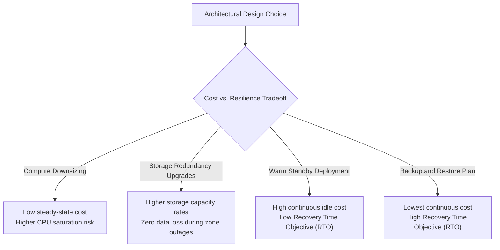

## Table of Contents

1. [What Is Cost and Resilience](#what-is-cost-and-resilience)
2. [Cloud Cost Shapes](#cloud-cost-shapes)
3. [Physical Failure Shapes](#physical-failure-shapes)
4. [Designing Workflow-Specific Service Promises](#designing-workflow-specific-service-promises)
5. [Putting It All Together](#putting-it-all-together)
6. [What's Next](#whats-next)

## What Is Cost and Resilience

Cloud architecture requires pairing financial budgets with technical reliability targets. In virtualized cloud environments, every provisioned resource is simultaneously a recurring line-item on a monthly invoice and an active operational uptime promise. Cost and resilience are structurally linked; you cannot safely reduce cloud spending without explicitly identifying which reliability promises are being weakened, and you cannot increase system durability without dedicating resources for hardware redundancy, duplicate data storage, traffic routing controllers, and ongoing recovery testing.

If you design systems on AWS, these financial and reliability trade-offs share the same architecture guidelines. Both platforms rely on the Well-Architected Framework—specifically the Cost Optimization and Reliability pillars—to help teams make deliberate resource choices.

The core systems relationship is identical:

* **Compute Downsizing**: Reducing AWS EC2 instances or Azure virtual machine scales maps directly to lower steady-state compute costs, but increases the risk of resource saturation and performance degradation during unexpected traffic surges.
* **Storage Duplication**: Upgrading from AWS Locally Redundant S3 / Azure Locally Redundant Storage (LRS) to Multi-AZ S3 / Zone-Redundant Storage (ZRS) or cross-region replication increases your storage capacity rates, but guarantees data survivability during zone or regional datacenter outages.

:::expand[Under the Hood: The Cloud Value Equation and Hypervisor Overcommit Physics]{kind="design"}
Cloud provider billing rates and capacity pools are governed by the physics of physical resource density and hardware multi-tenancy:

* **Hypervisor Resource Overcommittal**: Inside physical datacenters, enterprise server blades run Type 1 hypervisors that partition hardware CPU and RAM into virtual guest environments. To maximize hardware efficiency, hypervisors utilize overcommit scheduling algorithms. These algorithms assume that not all guest virtual machines will consume their allocated CPU cores concurrently. If guest machines spike simultaneously, the hypervisor schedules CPU cycles dynamically, introducing slight steal-time latencies (noisy neighbor effects).
* **Pre-Provisioned Capacity Economics**: Cloud providers build massive excess hardware headroom to handle instant scaling demands. To monetize this idle hardware, providers offer Spot Virtual Machines (AWS Spot Instances) at deep discounts (up to 90%). However, these Spot VMs come with a strict physical constraint: the Azure Fabric Controller can reclaim the compute hardware with a brief 30-second deallocation notification when premium, pay-as-you-go customers require the capacity, directly trading steady-state cost savings for VM eviction risks.
* **Storage Replication Loops**: Storage redundancy levels are built on low-level storage fabric networks. Locally Redundant Storage (LRS) writes block ranges synchronously across three separate disk cabinets inside the same building. Zone-Redundant Storage (ZRS) replicates those writes synchronously across three distinct datacenters separated by physical fiber latency rings (under 2ms round-trip time). This synchronous zonal replication requires high-throughput network backplanes, explaining the cost premium over LRS.
:::

Rather than attempting to eliminate all cloud spending or build a completely zero-downtime architecture, the engineering goal is to construct a balanced model. You must evaluate the cost shape of your resources against the physical failure shapes they protect against, ensuring that every dollar spent supports a verified service promise.

## Cloud Cost Shapes

Understanding your cloud bill requires analyzing how different resources measure and bill for resource usage. Azure expenditures organize into five primary cost shapes:

* **Always-On Capacity**: Fixed, pre-provisioned resource allocations that generate a steady hourly charge regardless of actual query volume. Examples include Azure App Service Plans, provisioned Azure SQL vCore tiers, and Azure Firewall instances.
* **Usage-Based Work**: Dynamic, consumption-based charges that scale directly with execution events. Examples include Azure Functions (Consumption plan), Azure Container Apps serverless scaling, and transactional storage operation counts.
* **Stored Data**: The persistent volume of bytes preserved on disk, billed per Gigabyte (GB) per month. This includes Blob Storage capacity, active database data files, backups, and retained Log Analytics tables.
* **Data Movement (Egress)**: Bandwidth utilization fees generated when data leaves an Azure region or traverses virtual network perimeters (e.g., cross-region database replication, CDN egress to public internet, or traffic between availability zones).
* **Safety Copies**: Dedicated recovery resources, including incremental managed disk snapshots, continuous database transaction log backups, and geo-redundant database replicas.

The most common cost surprises do not come from always-on compute; they come from unmanaged stored data and safety copies. Versions, snapshots, and log files accumulate quietly over time, generating compounding storage fees long after the primary compute resources have been shut down or downsized.

## Physical Failure Shapes

A resilient architecture is designed to survive specific physical failures at different layers of the cloud infrastructure. Each failure layer requires a targeted mitigation strategy that directly impacts your resource budget:

| Failure Layer | Physical Cause | Azure Platform Mitigation | Cost Impact |
| --- | --- | --- | --- |
| **Instance Failure** | Physical server blade hardware degradation, power supply failure, or guest kernel panic. | Multiple compute replicas, load balancer health checks, and VM Auto-Scaling. | Incremental always-on compute and network routing fees. |
| **Zone Failure** | Datacenter-level power grid failure, cooling system outage, or fiber backplane disconnection. | Zone-Redundant App Service Plans, ZRS storage accounts, and Multi-Zone SQL databases. | Premium storage rates and cross-zone network traffic fees. |
| **Data Deletion** | Accidental automated script execution, rogue administrator credential access, or application bug. | Blob Soft Delete, Object Versioning, and Recovery Services Vault immutability rules. | Compounding storage costs for historical object versions and deleted files. |
| **Bad Database Write** | Buggy database migration, corrupted application state writes, or untrusted execution logic. | Continuous database transaction logs and millisecond Point-in-Time Restore (PITR). | Ingestion and storage fees for continuous log backups. |
| **Regional Outage** | Natural disaster, catastrophic regional fiber cut, or global DNS routing failures. | Geo-Redundant Storage (GRS), secondary active-passive compute scale, and Traffic Manager failover. | Duplicate compute capacity, geo-replication egress fees, and traffic routing costs. |

The same architectural choice can mitigate one failure layer while leaving another completely exposed. For example, configuring LRS storage keeps three copies of your data safe from disk failures, but does not protect your files if a zone-level power outage takes the entire datacenter offline.

## Designing Workflow-Specific Service Promises

To avoid overprotecting low-priority resources—which rapidly inflates cloud budgets—you must establish tiered service promises based on the business value of each individual workflow. A critical payment processing transaction engine justifies high availability and synchronous replication, while a internal nightly report or development playground can safely tolerate cold backups, long restore times, and localized outages.

Map your primary system workflows to clear, honest tradeoff profiles:

| Design Choice | Cost Footprint | Uptime Promise | Architectural Tradeoff Evaluation |
| --- | --- | --- | --- |
| **Reduce Compute Replicas** | Lowers always-on compute fees. | Vulnerable to single-node failures and scaling delays. | Recommended for non-production sandboxes and staging environments. |
| **Shorten Log Retention** | Lowers Log Analytics storage fees. | Limits historical search windows during security audits. | Recommended for high-volume, verbose debug traces that have no regulatory compliance value. |
| **Enable Object Versioning & Soft Delete** | Increases persistent storage fees as versions accumulate. | Guarantees recovery of deleted or overwritten files. | Recommended for critical customer-facing assets, contract documents, and financial receipt PDFs. |
| **Upgrade to Zone-Redundant Storage (ZRS)** | Slightly higher storage rate than Locally Redundant (LRS). | Protects data access during datacenter outages in a region. | Recommended for production database volumes and primary transaction logs. |
| **Provision Warm Standby Compute** | Generates steady idle compute fees for standbys. | Delivers low RTO recovery times by maintaining pre-warmed nodes. | Recommended for core APIs that must recover within minutes during major outages. |
| **Active-Active Geo-Redundant Design** | Doubles compute and database costs, adding replication egress fees. | Survives entire regional outages with near-zero downtime. | Restricted to highly critical systems where downtime financial losses exceed duplicate infrastructure costs. |

Adopting this tradeoff analysis ensures that your organization spends its cloud budget where reliability is critical, while accepting deliberate, managed tradeoffs on non-essential workloads.

## Putting It All Together

Cost and resilience are not separate design considerations; they are the two opposing sides of a single cloud architecture balance.

* **Unified Billing & Uptime**: Every Azure resource operates concurrently as an active billing meter and an operational reliability promise.
* **Physics of Scale**: Cloud capacity pricing is dictated by physical server density, hypervisor overcommit scheduling, and high-speed network fiber latency rings.
* **Spend Dimensions**: Categorize cloud spending into Always-on capacity, Usage-based work, Stored data, Data movement, and Safety copies to identify billing growth vectors.
* **Layered Mitigations**: Analyze infrastructure reliability against physical failure shapes (Instance, Zone, Deletion, Write, Region), matching each layer to a targeted recovery solution.
* **Tiered Promises**: Align your expenditures with workflow value, allocating expensive high-availability resources to core checkout paths while leveraging cheap, cold backups for secondary tasks.

## What's Next

Now that we have paired cost and resilience tradeoffs conceptually, we will explore Cost Visibility. We will use Microsoft Cost Management, budgets, tags, and right-sizing models to analyze our active spending, track accountability, and eliminate common cloud cost leaks.

---

**References**

* [Optimize your cloud investment with Cost Management](https://learn.microsoft.com/en-us/azure/cost-management-billing/costs/cost-mgt-best-practices)
* [Azure Well-Architected Framework: Cost Optimization](https://learn.microsoft.com/en-us/azure/well-architected/cost-optimization/principles)
* [Azure Well-Architected Framework: Reliability](https://learn.microsoft.com/en-us/azure/well-architected/reliability/principles)
* [Azure Availability Zones and Regions reliability strategies](https://learn.microsoft.com/en-us/azure/reliability/concept-regions-availability-zones)
