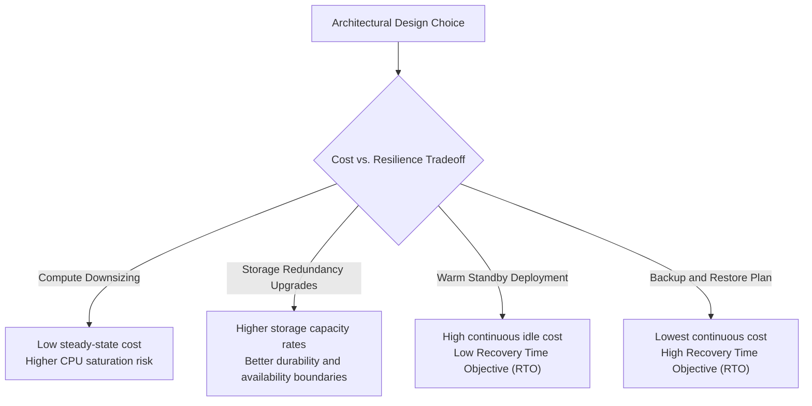
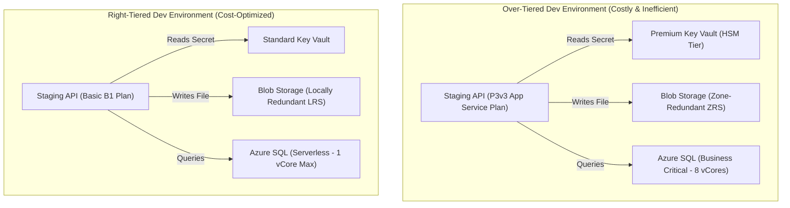

## Table of Contents

1. [What Is Cost and Resilience](#what-is-cost-and-resilience)
2. [Cloud Cost Shapes](#cloud-cost-shapes)
3. [Physical Failure Shapes](#physical-failure-shapes)
4. [Designing Workflow-Specific Service Promises](#designing-workflow-specific-service-promises)
5. [Putting It All Together](#putting-it-all-together)
6. [What's Next](#whats-next)

## What Is Cost and Resilience

Cost and resilience are the paired budget and reliability contract behind every Azure resource. Cloud architecture requires pairing financial budgets with technical reliability targets. In virtualized cloud environments, every provisioned resource is simultaneously a recurring line-item on a monthly invoice and an active operational uptime promise. Cost and resilience are structurally linked; you cannot safely reduce cloud spending without explicitly identifying which reliability promises are being weakened, and you cannot increase system durability without dedicating resources for hardware redundancy, duplicate data storage, traffic routing controllers, and ongoing recovery testing.

If you design systems on AWS, these financial and reliability trade-offs share the same architecture guidelines. Both platforms rely on the Well-Architected Framework - specifically the Cost Optimization and Reliability pillars - to help teams make deliberate resource choices.

The core systems relationship is identical:

* **Compute Downsizing**: Reducing AWS EC2 instances or Azure virtual machine scales maps directly to lower steady-state compute costs, but increases the risk of resource saturation and performance degradation during unexpected traffic surges.
* **Storage Duplication**: Upgrading from single-location storage to Azure Zone-Redundant Storage (ZRS), Geo-Redundant Storage (GRS), or Geo-Zone-Redundant Storage (GZRS) increases your storage capacity rates, but it changes which physical failures your data can survive. ZRS keeps data available across availability zones inside one region. GRS and GZRS add an asynchronous copy in a paired secondary region, with failover and read-access behavior depending on the exact redundancy option.

:::expand[Under the Hood: The Cloud Value Equation]{kind="design"}
Cloud provider billing rates and capacity pools are shaped by shared infrastructure, managed service boundaries, and capacity planning:

* **Shared Capacity Economics**: VM size, App Service plan size, database tier, and provisioned throughput choices reserve or expose different amounts of capacity. Larger guarantees cost more because Azure must hold more resources ready for your workload.
* **Spot Capacity Tradeoff**: Azure Spot Virtual Machines can be much cheaper than pay-as-you-go VMs, but Azure can evict them when it needs the capacity back. That makes them useful for interruptible batch work, not for stateful production paths that cannot tolerate eviction.
* **Storage Redundancy Tradeoff**: LRS, ZRS, GRS, and GZRS change how many copies Azure keeps and where those copies live. Geo-redundant options add asynchronous regional copies, improving disaster durability while still requiring you to plan for a replication lag window.
:::

Rather than attempting to eliminate all cloud spending or build a completely zero-downtime architecture, the engineering goal is to construct a balanced model. You must evaluate the cost shape of your resources against the physical failure shapes they protect against, ensuring that every dollar spent supports a verified service promise.

## Cloud Cost Shapes

A cost shape is the billing pattern a resource follows: always-on capacity, usage-based work, stored data, data movement, or safety copies. Understanding your cloud bill requires analyzing how different resources measure and bill for resource usage. Azure expenditures organize into five primary cost shapes:

*Reliable systems need spare capacity, but unused headroom still has a bill attached to it.*

* **Always-On Capacity**: Fixed, pre-provisioned resource allocations that generate a steady hourly charge regardless of actual query volume. Examples include Azure App Service Plans, provisioned Azure SQL vCore tiers, and Azure Firewall instances.
* **Usage-Based Work**: Dynamic, consumption-based charges that scale directly with execution events. Examples include Azure Functions (Consumption plan), Azure Container Apps serverless scaling, and transactional storage operation counts.
* **Stored Data**: The persistent volume of bytes preserved on disk, billed per Gigabyte (GB) per month. This includes Blob Storage capacity, active database data files, backups, and retained Log Analytics tables.
* **Data Movement (Egress)**: Bandwidth utilization fees generated when data leaves an Azure region or traverses virtual network perimeters (e.g., cross-region database replication, CDN egress to public internet, or traffic between availability zones).
* **Safety Copies**: Dedicated recovery resources, including incremental managed disk snapshots, continuous database transaction log backups, and geo-redundant database replicas.

The most common cost surprises do not come from always-on compute; they come from unmanaged stored data and safety copies. Versions, snapshots, and log files accumulate quietly over time, generating compounding storage fees long after the primary compute resources have been shut down or downsized.

## Physical Failure Shapes

A failure shape is the infrastructure layer where something can break: instance, zone, data state, database write, or region. A resilient architecture is designed to survive specific physical failures at different layers of the cloud infrastructure. Each failure layer requires a targeted mitigation strategy that directly impacts your resource budget:

*Resilience choices change both the failure blast radius and the monthly cost envelope.*

| Failure Layer | Physical Cause | Azure Platform Mitigation | Cost Impact |
| --- | --- | --- | --- |
| **Instance Failure** | Physical server blade hardware degradation, power supply failure, or guest kernel panic. | Multiple compute replicas, load balancer health checks, and VM Auto-Scaling. | Incremental always-on compute and network routing fees. |
| **Zone Failure** | Datacenter-level power grid failure, cooling system outage, or fiber backplane disconnection. | Zone-redundant compute where supported, ZRS storage accounts, and zone-redundant Azure SQL databases. | Premium storage rates and possible cross-zone network traffic fees. |
| **Data Deletion** | Accidental automated script execution, rogue administrator credential access, or application bug. | Blob Soft Delete, Object Versioning, and Recovery Services Vault immutability rules. | Compounding storage costs for historical object versions and deleted files. |
| **Bad Database Write** | Buggy database migration, corrupted application state writes, or untrusted execution logic. | Automated database backups and Point-in-Time Restore (PITR) to a selected point within the retention window. | Ingestion and storage fees for continuous log backups. |
| **Regional Outage** | Natural disaster, catastrophic regional fiber cut, or global DNS routing failures. | Geo-redundant or geo-zone-redundant storage, secondary active-passive compute scale, and tested traffic failover. | Duplicate compute capacity, geo-replication egress fees, and traffic routing costs. |

The same architectural choice can mitigate one failure layer while leaving another completely exposed. For example, configuring LRS storage keeps multiple copies of your data inside one datacenter and protects against drive, server, and rack failures, but it does not protect your files if a datacenter-level disaster makes every local replica unavailable. ZRS raises the boundary to availability zones inside one region. GRS and GZRS add a secondary region, but their regional copy is asynchronous and may require failover before applications can write there.

Redundancy is also different from recovery after a human or application mistake. If a script deletes a blob or overwrites a file, Azure Storage applies that change to the redundant copies because those copies are meant to represent the current state. Soft delete, container soft delete, blob versioning, point-in-time restore, and backups are the controls that preserve older states for logical recovery.

## Designing Workflow-Specific Service Promises

A service promise is the reliability target attached to one workflow, not a blanket promise for the whole subscription. To avoid overprotecting low-priority resources - which rapidly inflates cloud budgets - you must establish tiered service promises based on the business value of each individual workflow. A critical payment processing transaction engine justifies high availability and synchronous replication, while an internal nightly report or development playground can safely tolerate cold backups, long restore times, and localized outages.

Map your primary system workflows to clear, honest tradeoff profiles:

| Design Choice | Cost Footprint | Uptime Promise | Architectural Tradeoff Evaluation |
| --- | --- | --- | --- |
| **Reduce Compute Replicas** | Lowers always-on compute fees. | Vulnerable to single-node failures and scaling delays. | Recommended for non-production test environments and staging environments. |
| **Shorten Log Retention** | Lowers Log Analytics storage fees. | Limits historical search windows during security audits. | Recommended for high-volume, verbose debug traces that have no regulatory compliance value. |
| **Enable Object Versioning & Soft Delete** | Increases persistent storage fees as versions accumulate. | Guarantees recovery of deleted or overwritten files. | Recommended for critical customer-facing assets, contract documents, and financial receipt PDFs. |
| **Upgrade to Zone-Redundant Storage (ZRS)** | Slightly higher storage rate than Locally Redundant (LRS). | Keeps storage available when an availability zone in the primary region becomes unavailable. | Recommended for production storage accounts that need zonal high availability and can stay inside one region. |
| **Provision Warm Standby Compute** | Generates steady idle compute fees for standbys. | Delivers low RTO recovery times by maintaining pre-warmed nodes. | Recommended for core APIs that must recover within minutes during major outages. |
| **Active-Active Geo-Redundant Design** | Doubles compute and database costs, adding replication egress fees. | Survives entire regional outages with near-zero downtime. | Restricted to highly critical systems where downtime financial losses exceed duplicate infrastructure costs. |

Adopting this tradeoff analysis ensures that your organization spends its cloud budget where reliability is critical, while accepting deliberate, managed tradeoffs on non-essential workloads.

:::expand[Pitfall: The Over-Tiering Trap]{kind="pitfall"}
A common and expensive cloud architectural mistake is "over-tiering" - applying premium performance and redundancy tiers uniformly across all resources and environments. Driven by a desire to avoid outages or simplify deployment scripts, teams often deploy the highest-tier offerings (such as Premium SSDs, multi-region SQL databases, and P3v3 App Service plans) for low-priority, internal, or development workloads that could easily run on basic, serverless, or dev-centric tiers.

This uniform application of premium settings doubles your baseline cloud budget without delivering any improvements to your production system's customer SLA. A development test environment or an internal, non-critical background worker (like a weekly report compiler) does not benefit from zone-redundant storage (ZRS) or high-vCore database pools. If the background worker fails, it can safely wait several hours for a cold restore, making synchronous multi-datacenter replication a waste of financial resources.

This identical cost trap occurs on AWS. It is equivalent to uniformly provisioning Multi-AZ RDS database instances, high-provisioned IOPS EBS volumes (such as `io2`), and enterprise-level support plans across all development, testing, and staging environments. In both clouds, you must enforce a tiered environment policy: reserve high-availability, zone-redundant, and premium performance SKUs strictly for critical production paths, while utilizing basic, single-zone, or serverless SKUs for non-production environments.

The top-down diagram below compares a costly, over-tiered development environment with a cost-optimized, right-tiered design:

**Rule of thumb:** Never copy production Bicep or Terraform variables directly to non-production environments. Establish clear, environment-specific SKU matrices that relegate dev, test, and staging environments to standard, single-zone, or serverless tiers, keeping premium budgets locked strictly to your production workloads.
:::

## Putting It All Together

Cost and resilience are not separate design considerations; they are the two opposing sides of a single cloud architecture balance.

* **Unified Billing & Uptime**: Every Azure resource operates concurrently as an active billing meter and an operational reliability promise.
* **Capacity Economics**: Cloud pricing reflects how much compute, storage, data movement, redundancy, and managed service capacity your design asks Azure to keep available.
* **Spend Dimensions**: Categorize cloud spending into Always-on capacity, Usage-based work, Stored data, Data movement, and Safety copies to identify billing growth vectors.
* **Layered Mitigations**: Analyze infrastructure reliability against physical failure shapes (Instance, Zone, Deletion, Write, Region), matching each layer to a targeted recovery solution.
* **Tiered Promises**: Align your expenditures with workflow value, allocating expensive high-availability resources to core checkout paths while leveraging cheap, cold backups for secondary tasks.

## What's Next

Now that we have paired cost and resilience tradeoffs conceptually, we will explore Cost Visibility. We will use Microsoft Cost Management, budgets, tags, and right-sizing models to analyze our active spending, track accountability, and eliminate common cloud cost leaks.

*Use this as the cost-resilience tradeoff map: buy enough headroom and redundancy to meet the service promise, then trim idle waste and prove the recovery path with drills.*

---

**References**

* [Optimize your cloud investment with Cost Management](https://learn.microsoft.com/en-us/azure/cost-management-billing/costs/cost-mgt-best-practices)
* [Azure Well-Architected Framework: Cost Optimization](https://learn.microsoft.com/en-us/azure/well-architected/cost-optimization/principles)
* [Azure Well-Architected Framework: Reliability](https://learn.microsoft.com/en-us/azure/well-architected/reliability/principles)
* [Azure Availability Zones and Regions reliability strategies](https://learn.microsoft.com/en-us/azure/reliability/concept-regions-availability-zones)
* [Azure Storage redundancy](https://learn.microsoft.com/en-us/azure/storage/common/storage-redundancy)
* [Data protection overview for Azure Storage](https://learn.microsoft.com/en-us/azure/storage/blobs/data-protection-overview)
* [Automated backups in Azure SQL Database](https://learn.microsoft.com/en-us/azure/azure-sql/database/automated-backups-overview)
