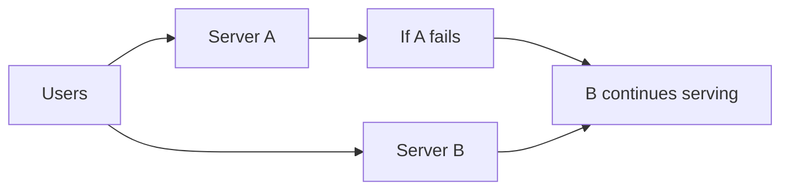
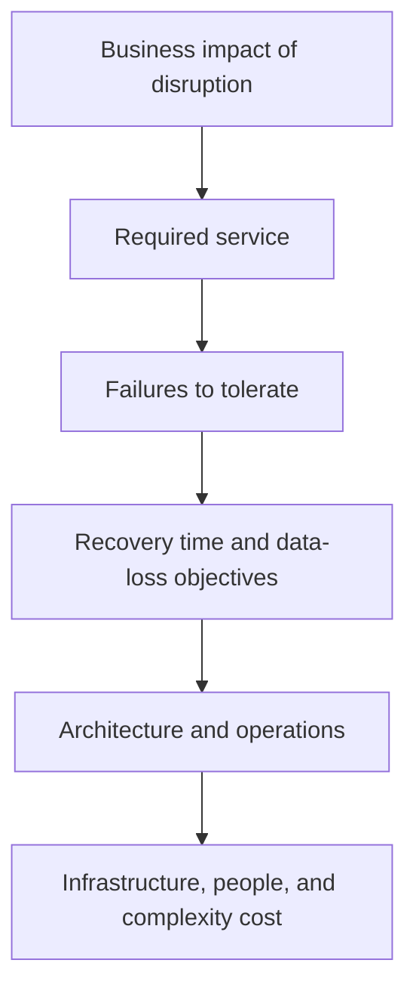

## Table of Contents

1. [Why Must Cost and Resilience Be Reviewed Together?](#why-must-cost-and-resilience-be-reviewed-together)
2. [What Service Promise Defines the Tradeoff?](#what-service-promise-defines-the-tradeoff)
3. [What Shapes Cloud Cost?](#what-shapes-cloud-cost)
4. [Which Failures Must the Design Survive?](#which-failures-must-the-design-survive)
5. [How Do Availability, RTO, and RPO Define the Requirements?](#how-do-availability-rto-and-rpo-define-the-requirements)
6. [How Do Redundancy and Recovery Differ?](#how-do-redundancy-and-recovery-differ)
7. [How Do You Compare the Tradeoffs?](#how-do-you-compare-the-tradeoffs)
8. [What Evidence Should You Review Before Changing Spend?](#what-evidence-should-you-review-before-changing-spend)
9. [Check Your Answers](#check-your-answers)
10. [References](#references)

A web service running on one server might cost £100 per month. If that server fails, the service stops. Adding a second server raises the bill to roughly £200, but it also changes the result of a failure: one server can stop while the other continues serving users.

That extra spending buys protection. The same relationship applies to database replicas, backup history, spare capacity, monitoring, and the people who respond to incidents. Reducing any of those costs can change how long an outage lasts or how much data the service can recover.

Cost and resilience therefore belong in the same design discussion. Start with what the service must provide, decide which failures it must handle, and then examine what the necessary protection consumes.

1. **Why Must Cost and Resilience Be Reviewed Together?**
2. **What Service Promise Defines the Tradeoff?**
3. **What Shapes Cloud Cost?**
4. **Which Failures Must the Design Survive?**
5. **How Do Availability, RTO, and RPO Define the Requirements?**
6. **How Do Redundancy and Recovery Differ?**
7. **How Do You Compare the Tradeoffs?**
8. **What Evidence Should You Review Before Changing Spend?**

## Why Must Cost and Resilience Be Reviewed Together?
<!-- section-summary: Resilience spending changes failure behavior, and a cost reduction can remove part of that protection. -->

The single-server example makes the relationship visible. While healthy, the £100 server may perform every required application function. Its weakness appears when it fails: every user depends on the same machine. The low infrastructure bill includes very little protection against that event.

A second server changes the arrangement. If the application can continue on Server B after Server A fails, the additional £100 pays for instance-failure tolerance. It does not need to add a user-facing feature to provide value. Its value is the service that remains available during a failure.

```mermaid
flowchart LR
    users["Users"] --> a["Server A"]
    users --> b["Server B"]
    a --> failure["If A fails"]
    failure --> remains["B continues serving"]
    b --> remains
```

The design still needs the surviving server to do the required work. Counting replicas is only a starting point; later sections examine whether their locations and remaining capacity support the intended protection.

**Reliability** concerns whether the system supplies the required service. **Resilience** focuses on its behavior when something goes wrong: can it absorb the disruption, limit its effects, continue useful operation, or recover within an acceptable time?

Failures remain possible in a resilient system. The design anticipates them and provides a controlled response. A stopped process may be replaced, a surviving replica may take over, or a backup may supply the data needed for restoration. Each mechanism changes the outcome of a particular failure.

The connection to cost works in both directions. Adding protection consumes infrastructure, engineering effort, or operational resources. Removing spending can remove capacity, redundancy, retention, recovery options, or response effort. Microsoft's Azure Well-Architected guidance treats replication, spare capacity, disaster recovery, observability, testing, and on-call capability as reliability investments with financial and operational costs.

That is why a lower bill needs an accompanying explanation of the new failure behavior. A change may be entirely appropriate, but the team should understand what it has stopped buying.

## What Service Promise Defines the Tradeoff?
<!-- section-summary: Business impact determines which workflows need protection and how much disruption each can tolerate. -->

An internal lunch-menu application and a hospital emergency system serve very different needs. A two-hour outage of the first may cause mild inconvenience; the same interruption to the second can have severe consequences. Giving them identical infrastructure would ignore the reason each service exists.

A **service promise** states what users must be able to do and how much disruption is acceptable. It provides the starting point for choosing resilience. Azure's Well-Architected guidance recommends matching reliability to workload requirements and business purpose. There is no requirement to purchase the greatest technically possible protection for every application.

The reasoning should proceed from business impact to the service promise, then to assumed failures and recovery objectives. Those requirements guide architecture, and the architecture determines cost.

```mermaid
flowchart TD
    impact["Business impact of disruption"] --> promise["Required service"]
    promise --> failures["Failures to tolerate"]
    failures --> recovery["Recovery time and data-loss objectives"]
    recovery --> design["Architecture and operations"]
    design --> cost["Infrastructure, people, and complexity cost"]
```

For example, suppose a checkout outage costs approximately £100,000 per hour. That business impact can justify a promise of very limited downtime. The failure model may require surviving an instance failure and a zone failure, with quick recovery after a regional disaster. Zone redundancy, tested backups, a regional recovery strategy, observability, and on-call response then have explicit reasons to exist. Their cost is evaluated against the business loss they help avoid.

This sequence prevents architecture from being chosen simply because a set of cloud services looks attractive. The workload requirement should explain the investment before the bill arrives.

### Protect components according to their role

The same application can contain workflows with different consequences of failure. An e-commerce website might use search, checkout, and recommendations. Losing search harms the experience. Losing checkout stops revenue. Losing recommendations may still allow customers to purchase.

That difference supports **selective resilience**: stronger protection for checkout, moderate protection for search, and a simpler approach for recommendations if the site can operate without them. Multi-region active/active operation is not automatically justified for all three components.

Application design can help preserve this distinction. If checkout requires a successful response from the recommendation service, a recommendation failure can interrupt purchases. Allowing checkout to continue without recommendations is **graceful degradation**: the application temporarily provides fewer features while preserving the important operation. It may achieve the required resilience without duplicating every supporting service.

### Use waiting where the work allows it

A queue can change another dependency. In a synchronous API-to-worker arrangement, a worker failure may immediately fail the API request. With durable messaging between them, work can wait while the worker is unavailable. Messages accumulate, the worker recovers, and the backlog is processed.

This is **temporal decoupling**: producing work and processing it do not have to succeed at exactly the same moment. The queue adds infrastructure, storage, and operational complexity, but it can let the user-facing service tolerate a temporary worker outage. The workload must allow that delayed completion for the mechanism to satisfy its promise.

Both graceful degradation and queues illustrate the same principle. Resilience can come from changing how the application depends on other components, as well as from purchasing additional copies of those components.

## What Shapes Cloud Cost?
<!-- section-summary: Total cost includes infrastructure, data, operations, engineering, support, failure impact, and the way each grows over time. -->

The Azure invoice is only part of an architecture's economic cost. A useful accounting model separates six categories:

| Category | Examples |
| --- | --- |
| Infrastructure | VMs, databases, and load balancers |
| Data | Storage, backups, logs, and network transfer |
| Operations | Monitoring, incident tooling, and on-call work |
| Engineering | Building and maintaining the architecture |
| Support | Vendor assistance and support plans |
| Failure | Lost sales, SLA penalties, recovery effort, reputational damage, and employee downtime |

An SLA is a service-level agreement; penalties associated with it are one example of the consequences a disruption can create. A design with a smaller infrastructure charge can cost more overall if it repeatedly causes expensive outages.

The comparison therefore includes both the price of preventing or recovering from disruption and the price of the disruption itself. This broader view is also why the people required to operate a design belong in the cost discussion, even when their work does not appear as an Azure resource charge.

### Identify what increases over time

Cloud resources have different **cost shapes**: the quantities and rates that cause their expense to grow. Compute spending depends approximately on the number of instances, the price per instance, and the time they remain running:

$$
\text{Compute cost} \approx
\text{Instance count} \times \text{Instance rate} \times \text{Running time}
$$

For storage, examine how much data is retained, for how long, and the associated operations and data movement. Telemetry adds the volume of generated events that is collected, the cost of ingestion, and the retention period. Backups add the amount protected, the number of copies, their retention, and the cost of restoration or testing.

These are practical investigation models, not a replacement for each service's actual billing units. They help identify the multiplying quantity: did more instances run, did they run longer, did the system collect more events, or did it keep more recovery copies?

A rise in cost can therefore be understood by tracing the quantity, rate, or duration that changed. The explanation should name the actual source of consumption rather than treating the bill as one undifferentiated expense.

### Separate baseline, demand, protection, and temporary overlap

Some cost remains even when almost nobody uses the service. Two application instances, a database, networking, monitoring, and backups form a **baseline**. At 03:00, with little traffic, those components may still need to exist and continue incurring charges.

Other spending grows with load. More traffic can require more instances, requests, database work, data transfer, and logs. Automatic scaling changes one part of that consumption, while the rest of the request path may also grow.

Resilience adds another layer: a secondary region, replication, backups, and spare capacity. Some of that expenditure is deliberately independent of current traffic because it prepares the system for a failure.

Finally, a change can create temporary overlap. During a blue/green release, the old and new environments run at the same time. Maintaining both enables a safer transition, but temporarily duplicates infrastructure. Microsoft explicitly includes this release-related cost in its reliability tradeoffs.

These categories help distinguish steady service cost from a spike that will end after a deployment or an intentional investment in recovery. Each has a different reason and a different sensible review.

## Which Failures Must the Design Survive?
<!-- section-summary: Protection must match a named failure scope, from processes and instances to zones, regions, dependencies, and corrupted data. -->

Consider a request that passes from users to an application and then to a database. An application instance can fail, but so can a database node, a data center, a network path, or an Azure region. A dependency may stop responding. A bad deployment or configuration can break otherwise healthy infrastructure. Traffic can exceed capacity, credentials can expire, data can be corrupted, and an operator can delete something needed.

These events differ in scope. A process fault may affect one running program. A machine fault may remove several processes together. A zone or regional failure can affect many replicas that share that location. Some incidents, such as bad replicated data, can extend beyond a single region.

A resilience claim must therefore specify what it covers. One architecture may tolerate a failed application instance but still depend entirely on one zone. Another may tolerate a zone outage but rely on one region. A multi-region design may survive a regional outage while still replicating accidental corruption into both copies.

The design needs an explicit relationship between **the assumed failure, the protection provided, and the expected behavior**. A large replica count does not establish that relationship by itself.

### Place replicas across the required failure boundary

Suppose App A, App B, and the database replicas all sit in Zone 1. App B can help when App A alone fails. A larger disruption affecting their shared location may remove both applications and the database copies together.

Distributing supported resources across Zone 1, Zone 2, and Zone 3 moves protection to a larger failure boundary. Availability Zones provide separate locations within a region. Azure's guidance distinguishes local redundancy, resources placed in a zone, zone-redundant arrangements, and regional approaches because they protect against different scopes of failure.

The service's support and configuration matter: placing resources in Azure does not automatically establish zone redundancy for every part of a workload. The architecture must deliberately distribute the components that need to remain available.

### Decide whether a region also needs protection

A service operating entirely in UK South may tolerate a zone failure yet still be exposed to a regional outage. If the requirement says that losing the region must not stop the business, another region—such as UK West or another suitable region—may be necessary.

This can duplicate compute, databases, networking, configuration, monitoring, and deployment infrastructure. It also introduces replication, traffic management, cross-region exercises, and failover procedures. A regional recovery design is therefore broader than placing one extra application instance elsewhere.

Multi-region operation can substantially improve tolerance of a regional failure. It also adds financial and operational demands. Azure's mission-critical guidance explicitly describes these tradeoffs, especially for active/active systems where both regions serve traffic.

Protection should follow the failure requirement rather than the appeal of a larger architecture. If the business only requires recovery after a regional disaster, a continuously active duplicate may exceed that requirement.

## How Do Availability, RTO, and RPO Define the Requirements?
<!-- section-summary: Availability describes the service objective, RTO limits restoration time, and RPO limits the age of recoverable data. -->

Once the failure scope is explicit, the service needs measurable expectations. Availability, recovery time, and recoverable data describe different aspects of the promise.

### Availability sets the tolerance for unavailability

An availability objective such as 99.9% expresses a limited tolerance for the service being unavailable. Moving through objectives such as 99%, 99.9%, 99.99%, and 99.999% generally demands progressively more engineering.

As tolerance narrows, failures that previously seemed rare may consume too much of the allowed disruption. Zone and regional outages, failed deployments, control-plane dependencies, correlated faults, operator mistakes, automatic failover, data consistency, and capacity after failover all deserve attention.

The cost of an additional nine is therefore not necessarily proportional to the previous improvement. The remaining sources of failure may be much harder to remove or contain.

### RTO limits how long restoration may take

The **recovery time objective**, or RTO, states the target maximum time to restore service following the relevant failure. If the business can accept four hours of outage, a backup-based restoration might satisfy the requirement. If the target is 30 seconds, the design probably needs capacity much closer to ready and available throughout the incident.

The difference changes what the team must maintain before the failure. A backup can preserve data without keeping a full duplicate application continuously running. A short restoration target leaves less time to create infrastructure, restore data, configure dependencies, and make the service usable.

### RPO limits the data-loss window

The **recovery point objective**, or RPO, describes how far back the recovered data may be relative to the failure. Suppose a database fails at 12:00 and its latest usable recovery point is from 11:00. Restoring that point leaves a one-hour window of changes missing.

If the permitted RPO is 24 hours, daily backups may be sufficient, provided they actually provide a usable point within that window. An RPO close to zero requires stronger replication or data-protection mechanisms. A service can restore quickly and still lose too much data, so RTO and RPO must be evaluated separately.

### Translate disaster recovery into an actual requirement

A request to “add disaster recovery” needs three answers: which disaster, how much downtime is acceptable, and how much data loss is acceptable. Those answers determine the mechanism.

An RTO of 24 hours and an RPO of 12 hours may support a relatively inexpensive recovery-oriented design. An RTO of one minute, an RPO near zero, and a requirement to survive regional failure can justify much more duplication and preparation.

Azure's reliability guidance notes that exceeding required RTO and RPO by a large margin can introduce unnecessary cost. The objective is to meet the agreed requirement with a credible, tested mechanism. Stricter targets should reflect a real workload need.

## How Do Redundancy and Recovery Differ?
<!-- section-summary: Redundancy keeps useful capacity available during failure; recovery restores service afterward, with capacity, backups, telemetry, and people supporting both. -->

Two broad strategies recur throughout reliable architecture. **Redundancy** provides another usable component so the service can continue despite a failure. **Recovery** provides a way to restore service after it has been interrupted.

For a database, redundancy might mean a replica ready to take over when the primary fails. Recovery might mean restoring a backup after the database is lost. The replica can shorten interruption because another copy is already available. Backup restoration often needs more time but may cost less than maintaining a fully capable running duplicate.

These choices form a useful spectrum:

| Approach | What is prepared | General economic effect |
| --- | --- | --- |
| One copy | Little alternative capacity or recovery protection | Low immediate cost, substantial outage exposure |
| Backups | Recoverable data copies | Additional storage with a restoration path |
| Warm standby | Some recovery environment already prepared | More cost for less preparation during an incident |
| Active/passive | A duplicate available for takeover | Greater duplication for faster failover |
| Active/active | Both sides already serving work | High infrastructure and operational demands |

The boundaries and results depend on the workload. Moving toward more continuously prepared capacity generally aims to reduce downtime, while adding replication, infrastructure, engineering, and operating complexity. No single point is correct for every service.

### Retain capacity for failures and sudden demand

If ordinary traffic requires eight servers and the team runs exactly eight, losing one leaves only seven. The service may remain technically online while the remaining capacity is overloaded. Running ten can provide room for failure, even though two servers appear spare during normal operation.

This is **failure headroom**: capacity maintained so a disruption does not immediately exceed the surviving system's limits. Azure's reliability guidance also describes spare capacity as protection against unexpected demand and scaling delays.

Autoscaling helps manage changing demand, but capacity takes time to become ready. Traffic might rise from 1,000 requests per second at 18:00 to 10,000 at 18:01. If new instances need several minutes to start, the workload can exceed available capacity before scaling catches up.

Combining autoscaling with a minimum reserve addresses both concerns. Scaling reduces long-lived excess, while existing headroom handles some of the uncertainty before additional capacity arrives.

### Preserve enough backup history

A single latest backup provides only one recovery choice. If it was taken after corruption began, that copy may reproduce the damaged data. Keeping points from today, yesterday, seven days ago, and 30 days ago creates more opportunities to recover clean data.

Additional recovery points increase storage expenditure. Reducing retention saves money but narrows the history available when a problem is discovered. Azure's cost and reliability guidance specifically describes this tradeoff between backup expense and recoverable history.

Replication and backup history also address different problems. A replica can preserve availability while copying a bad change. Historical backups may be needed to return to a point before that change.

### Pay for detection and response

Two systems with the same restore capability can experience very different outages if one detects the incident in two minutes and the other takes three hours. Recovery preparation therefore includes metrics, logs, traces, alerts, dashboards, on-call response, and runbooks.

A runbook records the operational steps needed during a known type of incident. Telemetry and alerts help people identify when those steps are needed and investigate what happened. Collecting more logs increases ingestion and storage costs, but cutting collection too far can delay detection, diagnosis, and recovery.

The human work has a cost too. Providing 24×7 response may require a rotation, incident-management procedures, training, runbooks, regular exercises, and post-incident reviews. Testing and drills consume time even when nothing is broken. These are part of providing the service, although they do not appear as VM charges.

### Account for the new mechanisms you introduce

More redundancy can add failure modes. Moving from one region to two active regions introduces global routing, replication, conflict handling, cross-region configuration, deployment coordination, and failover logic. Each added mechanism needs to work and be operated safely.

A regional failure may now be better contained, while configuration or coordination failures demand new attention. Resilience investments should be evaluated as complete systems, including the complexity they add.

## How Do You Compare the Tradeoffs?
<!-- section-summary: Compare the required protection with its operating and complexity costs, recognizing diminishing returns and opportunities to simplify. -->

Reliability improvements often have diminishing returns. Consider an illustrative progression: £1,000 per month provides a single-instance service. Spending £1,500 might fund multiple instances, automatic replacement, basic backups, and monitoring. Increasing to £3,000 might add zone redundancy and stronger database protection.

The next step, from £3,000 to £12,000, could fund active/active regions, more spare capacity, and more sophisticated failover. Moving from £12,000 to £50,000 may then address increasingly rare failure combinations. These figures illustrate the tradeoff; they are not Azure service quotations.

Early changes can remove large, obvious weaknesses. Later improvements may require much more investment to reduce the remaining exposure. The precise curve varies by service, but the business justification matters at every stage.

### Compare the capability changed by each decision

| Decision | Cost direction | Change in failure behavior |
| --- | --- | --- |
| Remove an application replica | Lower | Less capacity or tolerance when an instance fails |
| Add zone redundancy | Higher | Better protection against a zonal fault |
| Add another region | Substantially higher | Better regional-failure tolerance |
| Increase spare capacity | Higher | More room for bursts and failover |
| Shorten backup retention | Lower | Fewer historical recovery points |
| Shorten telemetry retention | Lower | Less information for historical diagnosis |
| Add a ready standby | Higher | Less preparation before takeover |
| Use active/active operation | Substantially higher | Potentially faster failover with more coordination |
| Reduce disaster-recovery testing | Lower | Less evidence that recovery will work |
| Scale capacity down aggressively | Often lower | Less immediate room for sudden load |
| Add on-call coverage | Higher | Faster operational attention and response |
| Remove unnecessary redundancy | Lower | Potentially simpler, safer operation |

The last row is important. Removing unjustified complexity can improve both cost and reliability. Additional spending is valuable only when the resulting mechanism contributes enough to the required outcome.

A lunch-menu application could theoretically be designed to withstand multiple regional failures, simultaneous database corruption, a network partition, and a complete control-plane outage. That would provide little economic value if users can comfortably tolerate a brief interruption. The sensible resilience target comes from the service promise.

The opposite extreme is a blanket request to cut Azure spending by 40%. Removing second replicas, backup history, log collection, spare capacity, and a secondary region could achieve the target while changing zone-failure tolerance from available to absent. Recovery might lengthen from five minutes to four hours, data-loss exposure from five minutes to 24 hours, and incident diagnosis from straightforward to difficult. The financial proposal has changed the service level.

### Evaluate the total business effect

A conceptual model keeps the broader outcome visible:

$$
\text{Business value} =
\text{Service value}
- \text{Operating cost}
- \text{Expected failure cost}
- \text{Complexity cost}
$$

$$
\text{Expected failure cost} \approx
\text{Failure probability} \times \text{Failure impact}
$$

Resilience mechanisms aim to reduce the probability or impact of damaging failure. They also increase operating cost and often complexity. Architecture seeks a justified balance between those effects.

This distinguishes optimization from simply spending less. Removing 20 unused development VMs could fund zone redundancy for checkout. The total bill may remain similar while the protection for the revenue-critical workflow improves.

## What Evidence Should You Review Before Changing Spend?
<!-- section-summary: Every proposed saving should identify the resource's purpose, the remaining recovery mechanism, and any change to the service promise. -->

Start by asking why the resource exists. A machine at 5% utilization may be unnecessary, or it may provide the capacity needed when another instance fails. A nearly idle second region may support an RTO below 15 minutes after a regional outage. A month of backups may matter when corruption is discovered to have begun 12 days earlier.

Utilization describes present activity. It does not, on its own, describe the value of preparation for an incident.

Suppose users reach Front Door, which distributes traffic to application instances in Zone A and Zone B. The applications use a resilient database with backups. Removing Zone B could save £700 per month. Before accepting that saving, establish why the zone was included, which failure it covers, and whether that protection is still required.

The review also needs to consider maintenance, the capacity remaining to serve all traffic, the resulting availability objective, and whether a cheaper arrangement could meet the same requirement. The amount saved is one input to that review, not its conclusion.

For each expensive component, record its workload function, the failure it protects against, the objective that justifies it, and the expected result of removing it. Identify the recovery path that remains and any less costly alternative that provides the same required outcome.

For each proposed saving, trace the chain from the current cost through the architectural change to the changed failure behavior and service promise. The responsible people can then decide whether the new risk is acceptable.

### Translate a £3,000 saving into service effects

Consider a checkout system costing £10,000 per month. It has three application replicas across zones, a zone-redundant database, 35-day backups, 30% capacity headroom, detailed telemetry, and 24×7 critical alerts.

A proposal targets £7,000 per month through five changes:

| Proposed change | Monthly saving | Consequence to review |
| --- | ---: | --- |
| Reduce application replicas | £500 | Less surviving capacity after a replica failure |
| Remove zone redundancy | £1,000 | A larger shared failure boundary |
| Shorten backup retention | £500 | Fewer recovery points |
| Reduce logging | £500 | Weaker diagnostic information |
| Reduce spare capacity | £500 | More exposure during spikes or failover |
| **Total** | **£3,000** | **A different service-risk profile** |

The arithmetic achieves the financial target. The engineering review establishes what the saving buys and what it gives up. The actual decision is whether £3,000 per month justifies the changed response to failures, not simply whether the spreadsheet total decreased.

### Recognize justified reductions

Reducing resilience can also be the right decision. An internal development portal might cost £3,000 per month because its design was copied from production: multiple zones, a secondary region, large standby capacity, 35-day backups, and 24×7 alerts.

Suppose it is used only Monday through Friday, a four-hour outage is acceptable, its data can be reconstructed, and it has no customer impact. That workload may not justify the copied protection. A simpler design can meet its actual requirements at lower cost.

This is consistent with Azure's guidance to avoid reliability investment beyond the workload's needs. The review should permit both outcomes: retain protection when it is justified and remove it when it is unnecessary.

### Keep the requirement and the cost connected

The completed design connects the business promise to the failures it must survive, the time and data objectives for recovery, and the redundancy, capacity, backups, observability, and operational work that achieve them. Cost describes what those capabilities consume.

A budget-driven change travels back through the same relationships. Altering the architecture can change failure behavior and therefore the service promise. Keeping that connection explicit allows finance and engineering to make the decision together.

Redundancy pays for continued operation. Recovery preparation pays for a route back after disruption. Spare capacity handles uncertainty, backups provide recovery points, observability supports detection and diagnosis, and on-call staff and runbooks support response. Buy enough of each to meet the service's needs, then remove spending that does not contribute to those needs.

## Check Your Answers

:::expand[Why Must Cost and Resilience Be Reviewed Together?]{kind="recap"}
Protective resources change what happens when something fails. Adding a server can allow continued service after one instance stops; removing replicas, backup history, or response capability can reverse part of that protection.
:::

:::expand[What Service Promise Defines the Tradeoff?]{kind="recap"}
Start with what users must be able to do and the business impact of disruption. Protect critical workflows accordingly. Graceful degradation and durable queues can reduce dependence on less critical components without duplicating everything.
:::

:::expand[What Shapes Cloud Cost?]{kind="recap"}
Include infrastructure, data, operations, engineering, support, and failure impact. Examine consumption and rates over time, separating baseline cost, demand-driven growth, resilience preparation, and temporary release overlap.
:::

:::expand[Which Failures Must the Design Survive?]{kind="recap"}
Name the failure and its scope. Instance replicas, zone distribution, and regional recovery protect different boundaries, while corruption or bad configuration can affect multiple copies together.
:::

:::expand[How Do Availability, RTO, and RPO Define the Requirements?]{kind="recap"}
Availability states the service objective. RTO limits how long restoration may take, and RPO limits how old the restored data may be. The failure scope and both recovery objectives determine what disaster recovery must provide.
:::

:::expand[How Do Redundancy and Recovery Differ?]{kind="recap"}
Redundancy supplies another usable component during a failure; recovery restores service afterward. Headroom, backup history, telemetry, testing, and prepared people support these strategies and add their own costs.
:::

:::expand[How Do You Compare the Tradeoffs?]{kind="recap"}
Identify the protection gained or lost and compare it with operating, failure, and complexity costs. Reliability gains often become more expensive at stricter targets. Simplifying unnecessary redundancy can improve both cost and operation.
:::

:::expand[What Evidence Should You Review Before Changing Spend?]{kind="recap"}
Establish purpose, covered failures, required objectives, remaining capacity, and the recovery path after the proposed change. Translate the saving into service effects and decide whether the changed risk still meets the workload's needs.
:::

## References

- [Azure reliability tradeoffs](https://learn.microsoft.com/en-us/azure/well-architected/reliability/tradeoffs)
- [Azure Cost Optimization tradeoffs](https://learn.microsoft.com/en-us/azure/well-architected/cost-optimization/tradeoffs)
- [Availability Zones and regions](https://learn.microsoft.com/en-us/azure/well-architected/resiliency/regions-availability-zones)
- [Mission-critical design principles](https://learn.microsoft.com/en-us/azure/well-architected/mission-critical/mission-critical-design-principles)
- [Well-Architected workloads](https://learn.microsoft.com/en-us/azure/well-architected/workloads)
- [Mission-critical workloads](https://learn.microsoft.com/en-us/azure/well-architected/mission-critical/mission-critical-overview)
