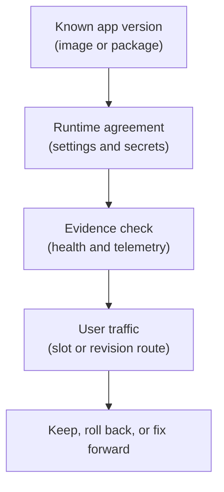

## Table of Contents

1. [A Release Changes More Than Code](#a-release-changes-more-than-code)
2. [If You Know AWS Deployments](#if-you-know-aws-deployments)
3. [The Four Things A Release Moves](#the-four-things-a-release-moves)
4. [The Orders API Release Has A Shape](#the-orders-api-release-has-a-shape)
5. [The Runtime Must Agree With The Artifact](#the-runtime-must-agree-with-the-artifact)
6. [Traffic Is The Last Thing To Move](#traffic-is-the-last-thing-to-move)
7. [Health Is Evidence Not Hope](#health-is-evidence-not-hope)
8. [Rollback Means Returning Users To A Known Working Path](#rollback-means-returning-users-to-a-known-working-path)
9. [Failure Modes During Azure Releases](#failure-modes-during-azure-releases)
10. [A Practical Release Record](#a-practical-release-record)

## A Release Changes More Than Code

The build passed, the container image exists, and the
pull request is merged. That is good news, but it still
does not mean production is safe. A deployment is the
act of moving a specific version of an application into
a runtime where users can reach it. Runtime means the
place where the code actually runs, such as Azure App
Service or Azure Container Apps. A release is the
larger operating event around that deployment. It
includes the version, configuration, secret access,
traffic movement, health checks, monitoring, and
rollback decision. That difference matters because many
production problems are not caused by bad application
code alone.

The artifact may be correct, but the environment
variable may be missing. The image may start, but the
health endpoint may fail. The app may run in staging,
but the production managed identity may not read Key
Vault. The new revision may work for direct testing,
then fail once real traffic reaches it. Azure gives you
tools to control those changes. App Service has
deployment slots. Container Apps has revisions and
traffic splitting. App settings, secrets, managed
identity, Application Insights, Azure Monitor, and
health checks all play supporting roles. This module
uses `devpolaris-orders-api` as the running example. It
is a Node.js backend that handles checkout, writes
order records to Azure SQL Database, uploads receipt
files to Blob Storage, and emits telemetry to
Application Insights.

The goal is not to memorize every deployment feature in
Azure. The goal is to understand the release as a set
of promises that must stay true while production
changes.

## If You Know AWS Deployments

If you have learned AWS, the Azure ideas will feel
familiar in shape. The names are different, but the
operating questions are similar.

| AWS idea you may know | Azure idea to compare first | Shared release question |
|---|---|---|
| ECS service deployment | Container Apps revision rollout | Is the new container version ready before traffic moves? |
| Lambda version or alias | Container Apps revision label or traffic split | Which version receives traffic? |
| Elastic Beanstalk environment swap or App Runner deployment | App Service slot swap or App Service deployment | Can we test before production traffic moves? |
| Parameter Store or Secrets Manager | App settings, Container Apps secrets, and Key Vault | Does the runtime have the values and permissions it needs? |
| CloudWatch alarms and logs | Azure Monitor and Application Insights | What evidence proves the release is healthy? |

The useful habit is not name translation. The useful
habit is asking what changed:

- Did the artifact change?
- Did the config change?
- Did the identity permission change?
- Did traffic move?
- Did the health signal change?

Those questions work in any cloud provider. Azure gives
you its own tools for answering them.

## The Four Things A Release Moves

A safe Azure release usually moves four things:

- The application version.
- The runtime configuration.
- The production traffic.
- The team's confidence from "we think this works" to "we have evidence this works."

Those are different steps. When teams blur them
together, releases become hard to debug. Here is the
simple mental model.



The order matters. Traffic should be the last thing to
move. If the version is unknown, you cannot explain
what users are running. If config is wrong, the app may
fail even when the code is fine. If health is not
checked, you are guessing. If traffic moved too early,
users become the test. Azure's rollout tools exist to
help separate these steps. Deployment slots let an App
Service app run a candidate version before swapping
production traffic. Container Apps revisions let a
container app keep older and newer versions visible in
the platform, then route traffic according to revision
mode and rules.

Neither tool removes the need for judgment. They give
you safer handles for that judgment.

## The Orders API Release Has A Shape

The `devpolaris-orders-api` release is not abstract. It
has a real shape. The team builds a container image or
deployable app package. The app expects runtime
settings, database access, Blob Storage access,
telemetry, a health endpoint, and a way to move traffic
safely. A release note might look like this:

```text
service: devpolaris-orders-api
version: 2026.05.03.1842
git_sha: 4c91b7f
artifact: devpolaris.azurecr.io/orders-api:4c91b7f
change: add receipt retry when Blob Storage upload times out
runtime: Azure Container Apps
config changed: false
database migration: none
health endpoint: GET /health
primary risk: receipt upload path
```

This record is not paperwork for its own sake. It
answers the first questions people ask when a release
goes bad:

- What version is running?
- What changed?
- Was configuration changed too?
- Where should we look first?

The record also separates code change from runtime
change. If the code did not change but config changed,
rollback may mean reverting config rather than
redeploying the previous image. If the image changed
but config stayed stable, rollback may mean returning
traffic to the previous slot or revision. That
distinction is the heart of runtime operations.

## The Runtime Must Agree With The Artifact

An artifact is the thing you deploy. For a container
workflow, it is usually a container image. For a direct
App Service workflow, it may be a package or app
content. The runtime is the Azure environment that
starts the artifact. The runtime and artifact must
agree. The app may expect `PORT`, `DATABASE_URL` or
separate database settings, an Application Insights
connection string, a managed identity that can read Key
Vault, and a health endpoint that is reachable on the
configured port.

When these do not line up, the artifact can be
perfectly valid and still fail in Azure. Here is a
realistic failure:

```text
revision: devpolaris-orders-api--4c91b7f
status: degraded
container: orders-api
reason: startup probe failed
last log:
  Error: Missing required environment variable ORDERS_DB_NAME
```

That is not a bad container registry problem, and it is
not a traffic splitting problem. The app started in a
runtime that did not provide a required value. The next
check is configuration:

- Which setting is missing?
- Should it be an App Service app setting, a Container Apps environment variable, or a secret reference?
- Was it different between staging and production?
- Was it marked as a slot setting if slots are used?

Deployment is where code and runtime meet. Most useful
debugging starts by asking which side of that meeting
broke.

## Traffic Is The Last Thing To Move

Traffic means real user requests. Moving traffic is the
moment a release becomes user-visible, so Azure rollout
tools try to give you a place to test before traffic
fully moves. In App Service, a staging slot can run the
new version with its own hostname. The team can warm it
up and validate it before swapping it into production.
In Container Apps, a new revision can exist beside an
old revision. Depending on revision mode, traffic may
move automatically when ready, or the team may split
traffic across revisions.

The important idea is the same:

> Do not make the first proof of life be real customer checkout.

A release flow might be:

```text
1. Deploy candidate version.
2. Confirm it starts.
3. Confirm runtime settings resolve.
4. Run health check.
5. Run smoke test.
6. Watch Application Insights for dependency failures.
7. Move traffic.
8. Continue watching.
```

That list looks procedural, but the reason is causal.
Each step prevents a different failure from reaching
users. Startup checks catch missing settings. Health
checks catch a process that starts but cannot serve.
Smoke tests catch a route that starts but cannot
complete its main job. Telemetry catches slower or less
obvious dependency failures. Traffic moves after those
checks because users deserve the version that already
proved it can run.

## Health Is Evidence Not Hope

Health is not a feeling. It is evidence. For a backend
API, the first health evidence is usually a health
endpoint. A health endpoint is an HTTP path that
returns success only when the app is ready to serve.
For `devpolaris-orders-api`, that might be:

```text
GET /health
200 OK

checks:
  app: ok
  azure_sql: ok
  blob_storage: ok
  config: ok
```

The exact response format is your team's choice. The
important part is what the endpoint means. If it
returns success while the database connection is
broken, it is not a useful release gate for checkout.
If it performs heavy writes or risky side effects, it
may be too dangerous for frequent checks. The endpoint
should prove the app is ready without causing harm.
Azure uses health signals differently depending on the
runtime. App Service Health check pings a path you
choose and can route away from unhealthy instances.
Container Apps health probes can check startup,
liveness, and readiness. Application Insights and Azure
Monitor show request failures, dependency failures,
response times, and alerts.

Those are different forms of evidence. Together, they
answer:

- Did the new version start?
- Is it ready for requests?
- Can it reach critical dependencies?
- Is real traffic healthy after release?

## Rollback Means Returning Users To A Known Working Path

Rollback is not a punishment for a bad deploy. Rollback
is returning users to a known working path. In Azure,
the rollback action depends on what changed and which
runtime you use. For App Service with slots, rollback
may mean swapping back to the previous slot state. For
Container Apps, rollback may mean routing traffic back
to an older revision. For a config-only problem,
rollback may mean restoring the previous app setting or
secret reference. For a database migration issue,
rollback may be more careful because the data may have
changed. Before anyone says "roll back," ask two
questions:

- What is the known working path?
- Can we return traffic there safely?

A useful rollback note looks like this:

```text
rollback target: container app revision devpolaris-orders-api--b71a22c
known good evidence: checkout success rate normal at 18:20 UTC
traffic action: route 100% traffic to previous revision
config action: keep current config, no config change in release
data action: none, no migration
post-rollback check: failed checkout rate below 1% for 15 minutes
```

That note is short, but it keeps the team from making a
vague rollback decision. Rollback is safest when you
know what you are returning to.

## Failure Modes During Azure Releases

Release failures usually have a shape. Naming the shape
helps the team inspect the right part of the system
first.

| Symptom | First check |
|---|---|
| The new version does not start | Runtime logs, container command, port, required environment variables, and startup probe |
| The version starts but is not ready | Readiness health, database connectivity, Key Vault resolution, managed identity permissions, and dependency paths |
| The version passes health but checkout fails | Application Insights failed requests, dependency failures, and recent config changes |
| Traffic split works for some users but not others | Revision traffic weights, labels, app assumptions, and whether both revisions can read the same config and schema |
| Rollback fails to fix the problem | Secret rotation, database migration, identity change, or an Azure resource issue outside the artifact |

The practical lesson is simple:

> Do not assume every release failure is a bad image.

Azure releases can fail because of version, config,
identity, network, data, traffic, or health checks.
Good runtime operations keep those causes visible.

## A Practical Release Record

A release record should be small enough that teams
actually write it and specific enough to help during an
incident. Use this shape:

```text
service:
runtime:
version:
artifact:
change:
config changed:
data changed:
identity or permission changed:
rollout method:
health check:
smoke test:
monitoring:
rollback target:
release owner:
```

For `devpolaris-orders-api`, that becomes:

```text
service: devpolaris-orders-api
runtime: Azure Container Apps
version: 2026.05.03.1842
artifact: devpolaris.azurecr.io/orders-api:4c91b7f
change: retry receipt upload timeout
config changed: false
data changed: false
identity or permission changed: false
rollout method: 10% traffic to new revision, then 100% after checks
health check: GET /health
smoke test: test checkout with fake payment and receipt upload
monitoring: Application Insights failures and dependency calls
rollback target: revision devpolaris-orders-api--b71a22c
release owner: orders-api on-call
```

This record is not a ceremony. It is a debugging
shortcut. When something goes wrong, the team starts
from facts instead of memory. That is what Azure
deployment and runtime operations are really about:
make change visible, move traffic carefully, and keep
enough evidence to decide what to do next.

---

**References**

- [Set up staging environments in Azure App Service](https://learn.microsoft.com/en-us/azure/app-service/deploy-staging-slots) - Microsoft explains deployment slots, warmup, validation, and slot swaps for App Service apps.
- [Update and deploy changes in Azure Container Apps](https://learn.microsoft.com/en-us/azure/container-apps/revisions) - Microsoft explains revisions, revision modes, readiness, and rollback-oriented release behavior in Container Apps.
- [Traffic splitting in Azure Container Apps](https://learn.microsoft.com/en-us/azure/container-apps/traffic-splitting) - Microsoft explains routing percentages between active Container Apps revisions.
- [Monitor App Service instances by using Health check](https://learn.microsoft.com/en-us/azure/app-service/monitor-instances-health-check) - Microsoft explains App Service Health check behavior and how unhealthy instances are handled.
- [Health probes in Azure Container Apps](https://learn.microsoft.com/en-us/azure/container-apps/health-probes) - Microsoft explains startup, liveness, and readiness probes for Container Apps.
