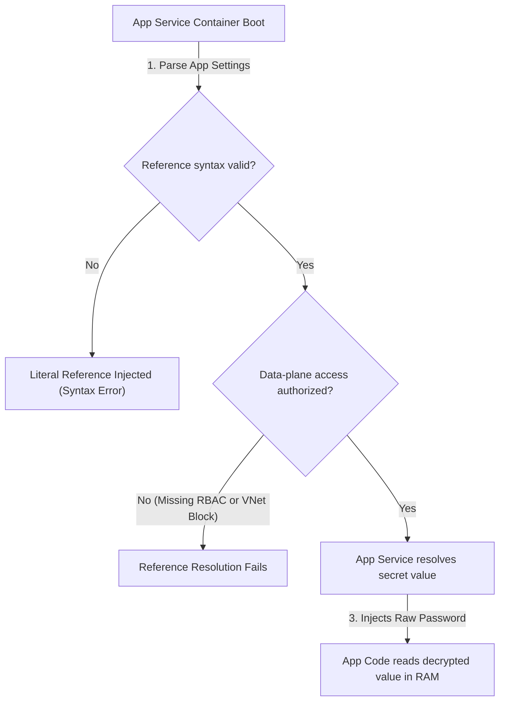
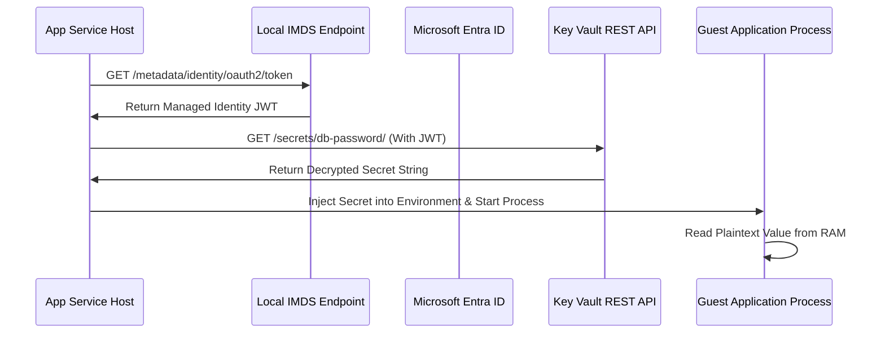
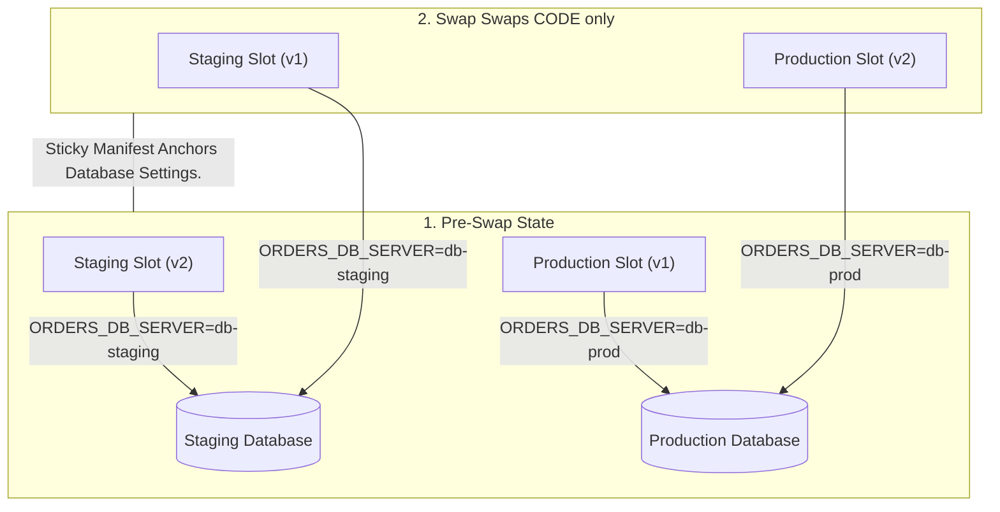

## Table of Contents

1. [The Problem](#the-problem)
2. [Runtime Configuration](#runtime-configuration)
3. [App Settings](#app-settings)
4. [Container Apps Secrets](#container-apps-secrets)
5. [Key Vault References](#key-vault-references)
6. [App Configuration Integration](#app-configuration-integration)
7. [Systems Depth: Secrets Resolution Loops](#systems-depth-secrets-resolution-loops)
8. [Managed Identity Scopes](#managed-identity-scopes)
9. [Slot Sticky Settings](#slot-sticky-settings)
10. [Config Rollback](#config-rollback)
11. [Putting It All Together](#putting-it-all-together)
12. [What's Next](#whats-next)

## The Problem

Runtime configuration is the external state a deployed artifact reads from the platform when it starts or serves traffic.
A compiled software artifact that builds successfully can still fail when its runtime environment variables change.
When a deployment candidate is rolled out, a sudden database connection failure in production can occur even though the staging tests passed.
This issue happens because the software relies on external values that point to different services across environments.

Common configuration failures during rollouts include:
- A database endpoint pointing to the staging server instead of the production server.
- An application identity lacking data-plane permission to read the required secrets vault.
- A feature flag that was tested in the staging slot but stayed with the staging slot instead of migrating during a slot swap.
- An updated container secret that is saved in the platform but has not been mapped into the active runtime processes.

Configuration and secrets are runtime state.
Identity assignments are runtime state.
A safe release pipeline must treat configuration updates as first-class changes that can be tracked, validated, and rolled back alongside the software artifact.

## Runtime Configuration

Runtime configuration is the set of environment-specific values injected into the application from the hosting platform.
These parameters decouple environment-specific details from the application code.
This decoupling allows the exact same application package or container image to run in development, staging, and production environments.


*Runtime configuration is part of the deployed system, so settings, identity, secret references, slots, and rollback must be designed together.*


For a production deployment of the orders API, the runtime configuration typically includes:

```plain
NODE_ENV=production
ORDERS_DB_SERVER=sql-devpolaris-prod.database.windows.net
ORDERS_DB_NAME=orders
RECEIPTS_STORAGE_ACCOUNT=stordersprod
CHECKOUT_PAYMENTS_ENABLED=true
```

Decoupling parameters is a robust architectural practice but introduces risks during releases.
If an incorrect database server name is saved to the production configuration, the application will write data to the wrong database.
A release pipeline should record configuration changes as part of the release log.
If a code deployment must be rolled back, the team must evaluate whether the associated configuration settings also need to be reverted.

## App Settings

App Settings are platform-stored key-value pairs that become environment variables inside an App Service or Function runtime. They exist so one code package can receive different runtime values in production, staging, and development.

Example: production can set `ORDERS_DB_SERVER=sql-devpolaris-prod.database.windows.net`, while staging sets `ORDERS_DB_SERVER=sql-devpolaris-staging.database.windows.net`.

In Azure App Service, application settings are stored by the platform and exposed to the guest container as environment variables.
This exposure means the guest application code reads these parameters using standard operating system environment calls.
This process requires no platform-specific software development kits inside the application code.

App settings are highly flexible but carry operational considerations:
- Modifying any application setting triggers an immediate cold restart of the underlying Web App containers.
- Settings can be configured to remain slot-specific or to migrate with the candidate version during a swap.
- Plaintext secrets must never be written directly into these settings because they are visible in logs and console sessions.

The table below outlines common application settings for the orders API and their release risks:

| Setting | Expected Production Value | Release Risk |
| --- | --- | --- |
| `ORDERS_DB_SERVER` | Production database fully qualified domain name | An incorrect value routes transactions to the wrong environment database. |
| `RECEIPTS_STORAGE_ACCOUNT` | Production storage account resource name | An incorrect value blocks file uploads or reads from the wrong bucket. |
| `APPINSIGHTS_CONNECTION_STRING` | Production telemetry endpoint | A missing value silences performance tracking and telemetry reporting. |
| `CHECKOUT_PAYMENTS_ENABLED` | Production feature flag value | An incorrect state toggles user capabilities without testing. |

A successful configuration save in the Azure resource manager control plane does not mean the application is operating correctly.
The guest container must restart, successfully read the value from its environment, and establish network connectivity using the new parameter.

## Container Apps Secrets

Container Apps secrets are encrypted app-level values that container revisions reference by name. They keep sensitive values out of the plain environment variable list until a container template explicitly maps them.

Example: a secret named `queue-connection` can be stored on the Container App, then referenced by the `orders-worker` container as an environment variable only for the revision that needs it.

Azure Container Apps isolates sensitive values by storing them at the application level.
These secrets are referenced in the container template.
They are injected into the guest container either as environment variables or as mounted files.

When deploying container updates, you must track how secrets are mapped to the active revisions:
- A secret value can be updated in the Container App, but existing revisions will continue using the old value.
- Mapping a new secret version to a container requires creating a new revision.
- Rolling back the container image does not automatically revert a secret value if the secret was overwritten in place.

Updating secrets in place during an incident can lead to inconsistent application state.
If the new container version fails because of a mismatched credential, changing the secret value directly affects both the new and old revisions.
The preferred approach is to version secrets in the vault and update the configuration reference so that the previous revision retains its original connection credentials.

## Key Vault References

Key Vault references are platform-resolved pointers from App Service or Azure Functions settings to secrets stored in a separate vault.
The platform resolves these references automatically at runtime.
This process keeps sensitive values out of application settings, deployment scripts, and deployment logs.


*A secret reference still needs identity, network reachability, vault permission, and runtime refresh behavior before the app can use it.*


```plain
@Microsoft.KeyVault(SecretUri=https://kv-prod.vault.azure.net/secrets/database-password/)
```

Resolving a secret reference requires two independent configuration steps:
1. The app setting value must contain the correct Key Vault secret URI syntax.
2. The application's managed identity must have data-plane permissions to read that specific secret from the vault.

If either step is configured incorrectly, the application will fail to boot or receive the raw reference string instead of the decrypted secret.

The table below describes the metadata needed to audit a Key Vault reference release:

| Element | Production Requirement | Validation |
| --- | --- | --- |
| Vault URI | Points to the production Key Vault resource | Confirm the URI matches the production DNS namespace. |
| Managed Identity | System-assigned or user-assigned identity enabled | Verify the principal exists in Microsoft Entra ID. |
| RBAC Assignment | Key Vault Secrets User role bound to the identity | Check the role assignment at the vault scope. |
| Platform Resolution | The App Service console shows a resolved checkmark | Audit the app settings panel for resolution status. |

:::expand[Pitfall: The Two-Requirement Key Vault Reference Failure]{kind="pitfall"}
A frustrating release error occurs when an App Service setting shows a valid Key Vault reference structure, but the application code fails to receive the resolved secret at runtime.
When you inspect the Azure Portal, you might see a valid-looking setting such as `@Microsoft.KeyVault(SecretUri=https://kv-prod.vault.azure.net/secrets/db-pass/)`, suggesting the pointer is shaped correctly.
Yet the booted application throws database connection errors because the platform could not resolve the value successfully for that app instance.

This is a two-requirement configuration hazard.
The reference pointer syntax proves only that the path is well-formed.
The second requirement is actual data-plane authorization and network connectivity.
If the App Service's managed identity lacks the required Key Vault data-plane role, or if the Key Vault's private network firewall blocks requests from the App Service path, App Service cannot resolve the reference.
The result is a runtime configuration failure even though the deployment itself succeeded.

This identical trap exists in AWS ECS and Lambda.
If you reference a secret from AWS Secrets Manager or a parameter from SSM Parameter Store in your task definition, the ECS agent must have both the `secretsmanager:GetSecretValue` permission and the corresponding KMS key decryption permission in its Task Execution Role.
If either permission is missing, or if VPC security groups block the path, the container will either fail to boot or receive blank environment variables.

The flowchart below maps the two requirements for a successful Key Vault reference:



Never assume a configuration checkmark in the Azure Portal guarantees that your application can read the secret.
Always verify that your compute's active managed identity has a verified Key Vault Secrets User role assignment, and test that your app can open database sockets successfully during your rollout's watch window.
:::

## App Configuration Integration

Azure App Configuration is a centralized configuration store for non-secret settings, feature flags, and environment-specific values.
Integrating Azure App Configuration with Key Vault allows the platform to manage non-secret settings in one store while resolving secrets from the vault.

The Bicep template below provisions an App Configuration store, a Key Vault with a secret, and an App Service Web App that references both systems securely:

```bicep
param webAppName string = 'app-devpolaris-orders-prod'
param appConfigName string = 'appcs-devpolaris-prod'
param keyVaultName string = 'kv-devpolaris-prod'
param location string = resourceGroup().location

resource keyVault 'Microsoft.KeyVault/vaults@2023-07-01' = {
  name: keyVaultName
  location: location
  properties: {
    sku: {
      family: 'A'
      name: 'standard'
    }
    tenantId: subscription().tenantId
    enableRbacAuthorization: true
    enabledForDeployment: true
    enabledForTemplateDeployment: true
    enabledForDiskEncryption: true
    enableSoftDelete: true
    softDeleteRetentionInDays: 90
    enablePurgeProtection: true
  }
}

resource dbPasswordSecret 'Microsoft.KeyVault/vaults/secrets@2023-07-01' = {
  parent: keyVault
  name: 'database-password'
  properties: {
    value: 'P@ssw0rd12345!'
  }
}

resource appConfig 'Microsoft.AppConfiguration/configurationStores@2023-03-01' = {
  name: appConfigName
  location: location
  sku: {
    name: 'standard'
  }
}

resource appConfigKeyValue 'Microsoft.AppConfiguration/configurationStores/keyValues@2023-03-01' = {
  parent: appConfig
  name: 'orders:db:server'
  properties: {
    value: 'sql-devpolaris-prod.database.windows.net'
  }
}

resource webApp 'Microsoft.Web/sites@2022-09-01' = {
  name: webAppName
  location: location
  kind: 'app'
  identity: {
    type: 'SystemAssigned'
  }
  properties: {
    serverFarmId: '/subscriptions/${subscription().subscriptionId}/resourceGroups/${resourceGroup().name}/providers/Microsoft.Web/serverfarms/asp-devpolaris-prod'
    siteConfig: {
      appSettings: [
        {
          name: 'ORDERS_DB_SERVER'
          value: '@Microsoft.AppConfiguration(Endpoint=${appConfig.properties.endpoint};Key=orders:db:server)'
        }
        {
          name: 'ORDERS_DB_PASSWORD'
          value: '@Microsoft.KeyVault(SecretUri=${keyVault.properties.vaultUri}secrets/database-password/)'
        }
      ]
    }
  }
}
```

This infrastructure code guarantees that the Web App references externalized settings rather than hardcoded environment variables.
The credentials are resolved securely at runtime without storing secrets in the repository.

## Systems Depth: Secrets Resolution Loops

A secrets resolution loop is the platform sequence that turns a stored reference string into an environment value available to the guest process.
Example: an App Service setting can contain `@Microsoft.KeyVault(SecretUri=https://kv-prod.vault.azure.net/secrets/database-password/)`, and the platform replaces that reference with the secret value before the app process starts.

Understanding the systems mechanics of how Azure resolves Key Vault references at runtime is critical to managing configuration health.
When an application boots inside App Service, the host platform worker intercepts the environment variables map before starting the guest container process.

The platform executes a highly structured resolution loop:
- The platform worker reads the application settings and parses any value matching the `@Microsoft.KeyVault` signature.
- It extracts the target vault name, secret name, and optional version GUID.
- If the version GUID is omitted, the resolution loop enters unversioned mode.
- The platform contacts the local Instance Metadata Service to acquire an Entra ID token for the app's managed identity.
- It issues a secure HTTPS GET request to the Key Vault data-plane REST API endpoint using the acquired token.
- If the identity is authorized and the network pathway is open, Key Vault returns the plaintext secret.
- The platform worker replaces the reference string with the plaintext value in the guest container's memory space.
- The guest process starts and reads the decrypted value from its local RAM.



The system behaves differently when using unversioned references.
To detect updates without restarts, the App Service platform runs a background polling daemon.
This daemon queries the Key Vault REST API every 24 hours to check if a new version of the secret has been created.
If a new version is detected, the daemon retrieves the value and updates the environment variable map on the host.

However, a major systems gap exists between the host platform and the guest application code.
Although the platform updates the environment variables on the host container, the running application process does not automatically re-read these variables.
Standard runtimes load environment variables into memory only once during startup.
To consume the updated secret, the guest application must either trigger a process restart or include internal application code that actively polls the local environment or queries the platform API dynamically.

## Managed Identity Scopes

A managed identity isolates database and vault access by binding permissions directly to the Azure resource principal.
This design eliminates the need to distribute access keys or connection string passwords.

Example: the staging Web App identity should read from `kv-orders-staging`, while the production Web App identity should read from `kv-orders-prod`. The two identities should not share broad subscription-level access.

Managing identities during a release requires setting precise scopes:
- Confirm that staging identities cannot read production vault keys.
- Ensure role assignments are applied at the resource or resource group level rather than the entire subscription.
- Use system-assigned identities for single-resource lifecycles.
- Use user-assigned identities when multiple resources share a identical security boundary.

Assigning broad administrative roles to bypass a release failure introduces security vulnerability.
The correct approach is to define custom roles that grant only the required permissions, such as the Key Vault Secrets User role for secret resolution, and apply them directly to the resource scopes.

## Slot Sticky Settings

Slot sticky settings are the App Service configuration records that stay with a slot instead of moving with the application package.
App Service deployment slots introduce the risk of environment configuration mixing during a swap.
By default, application settings migrate with the application package when a swap is executed.
This migration means that staging values can travel to production, and production settings can travel to staging.


*Sticky settings prevent environment-specific values from moving with the app package during a slot swap.*


To prevent this issue, you must configure settings to be slot-specific, which is also known as being sticky to the slot.

```plain
Site Config:
  Sticky settings: ORDERS_DB_SERVER, ORDERS_DB_PASSWORD
  Mutable settings: COMPILER_OPTIMIZATIONS, CONTAINER_IMAGE_TAG
```

When a swap occurs, the application code packages swap slots, but the sticky settings remain anchored to their physical environment slots.

:::expand[Pattern: The Sticky Settings Manifest]{kind="pattern"}
A common slot swap disaster occurs when a team relies on memory to configure which App Service settings are "slot-sticky" (staying with the environment) and which are "mutable" (moving with the code version).
If an engineer forgets to mark a critical database endpoint like `ORDERS_DB_SERVER` as sticky, a subsequent slot swap will accidentally pull the staging connection string into the production slot, causing the production application to write live customer orders to the staging database.

To eliminate this human error, adopt **The Sticky Settings Manifest** pattern.
Rather than setting slot stickiness manually in the Azure Portal, declare the sticky state of your settings as version-controlled code inside your Bicep or Terraform templates.
In Bicep, you configure this using the `Microsoft.Web/sites/config` resource with the `slotConfigNames` property:

```bicep
resource siteConfig 'Microsoft.Web/sites/config@2022-03-01' = {
  name: 'slotConfigNames'
  parent: appService
  properties: {
    appSettingNames: [
      'ORDERS_DB_SERVER'
      'RECEIPTS_STORAGE_ACCOUNT'
      'APPINSIGHTS_CONNECTION_STRING'
    ]
  }
}
```

This manifest guarantees that the specified settings remain anchored to their physical slot during every swap.
Any environment-specific credentials or logging connection strings are locked, while version-related settings (like `APP_VERSION`) are allowed to travel with the candidate code.

This pattern is equivalent to separating task-level variables from environment-level variables on AWS.
In AWS, you do not swap compute environments; you deploy immutable task definitions.
To keep environment variables stable, you reference path-scoped SSM Parameter Store hierarchies (such as `/dev/orders/db` vs `/prod/orders/db`) based on the target account, preventing deployment packages from carrying hardcoded environment parameters.

The diagram below illustrates how a sticky manifest anchors configurations during a slot swap:



Never configure slot settings manually in the Azure Portal.
Always declare your slot-sticky settings explicitly inside a version-controlled Bicep `slotConfigNames` block, ensuring that environment boundaries are hard-gated by your deployment pipeline.
:::

## Config Rollback

Config rollback is the process of restoring the exact runtime values and secret references that were active before a release. Reverting a broken release often requires restoring the previous configuration parameters alongside the application code.
If a release modified both the database server string and the application container image, reverting the container image while leaving the new database string active can lead to sustained failures.

A structured configuration rollback plan requires:
- Restoring the exact setting values that were active before the release.
- Verifying that any updated Key Vault secret versions remain compatible with the rolled-back code.
- Verifying that the application identity continues to have authorization to read the previous vault secret versions.
- Triggering an application restart to ensure the guest process loads the restored parameters into memory.

Configuration changes must be tracked in the version control system.
Treating environment variables as dynamic, untracked parameters makes determining the working baseline difficult during an incident.
By declaring all configuration changes in infrastructure templates, the team can roll back settings using standard repository commits.

## Putting It All Together

Managing application releases on Azure requires treating configuration, secrets, and identity as core parts of the deployment.
- Runtime configuration decouples parameters from code but requires validation during rollouts.
- App settings expose environment variables to guest processes, but updating them triggers container restarts.
- Container Apps secrets isolate credentials at the application level but require revision mapping to take effect.
- Key Vault references resolve secrets at the platform level, requiring correct reference syntax and active managed identity permissions.
- Under-the-hood resolution loops query Key Vault via IMDS tokens and cache values on the host.
- Slot sticky settings ensure that database and logging credentials remain anchored to their physical slots during swaps.
- Configuration rollbacks must be planned, tracked, and executed with the same rigor as code rollbacks.

By securing the configuration pathway, the release pipeline protects application boundaries and ensures that new deployments start with correct parameters.

## What's Next

The next article covers safe rollouts.
Once configuration is defined, the team must configure slots and revisions to route traffic gradually, limiting the blast radius of new updates and establishing clear rollback paths.

---

**References**

- [Configure an App Service app](https://learn.microsoft.com/en-us/azure/app-service/configure-common) - Guide to managing settings and connection strings in Azure App Service.
- [Use Key Vault references for App Service and Azure Functions](https://learn.microsoft.com/en-us/azure/app-service/app-service-key-vault-references) - Explanation of how to resolve secrets securely from Key Vault into environment settings.
- [Managed identities in App Service and Azure Functions](https://learn.microsoft.com/en-us/azure/app-service/overview-managed-identity) - Overview of setting up passwordless resource connections using Microsoft Entra ID.
- [Manage secrets in Azure Container Apps](https://learn.microsoft.com/en-us/azure/container-apps/manage-secrets) - Documentation on storing and exposing secrets within Container Apps revisions.
- [Revisions in Azure Container Apps](https://learn.microsoft.com/en-us/azure/container-apps/revisions) - Guide to managing immutable container configurations and traffic splits.
