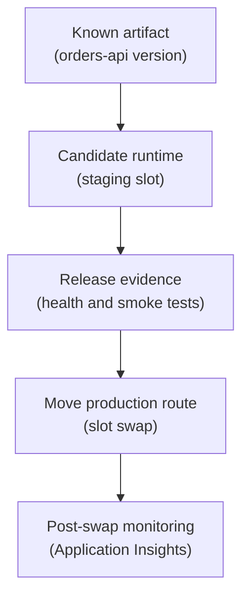

## Table of Contents

1. [Safe Rollouts Need A Place Between Build And Production](#safe-rollouts-need-a-place-between-build-and-production)
2. [If You Know AWS Rollout Tools](#if-you-know-aws-rollout-tools)
3. [App Service Slots Give A Candidate App Its Own Home](#app-service-slots-give-a-candidate-app-its-own-home)
4. [Slot Settings Protect Environment-Specific Values](#slot-settings-protect-environment-specific-values)
5. [Container Apps Revisions Keep Version History Visible](#container-apps-revisions-keep-version-history-visible)
6. [Traffic Splitting Lets You Test With A Smaller Blast Radius](#traffic-splitting-lets-you-test-with-a-smaller-blast-radius)
7. [Labels And Direct Access Help Humans Test A Revision](#labels-and-direct-access-help-humans-test-a-revision)
8. [What Rollback Means In Each Runtime](#what-rollback-means-in-each-runtime)
9. [Failure Modes During Slot And Revision Rollouts](#failure-modes-during-slot-and-revision-rollouts)
10. [A Practical Rollout Plan](#a-practical-rollout-plan)

## Safe Rollouts Need A Place Between Build And Production

The risky moment in a deployment is not only when code
is uploaded. The risky moment is when users start
depending on the new version. Before that happens, you
need a place to ask:

- Does this version start?
- Does it have the right settings?
- Does it pass health checks?
- Does it talk to Azure SQL Database and Blob Storage?
- Can we return traffic to the old version if it fails?

Azure gives two important rollout patterns for the
compute services we have already studied. Azure App
Service uses deployment slots. Azure Container Apps
uses revisions. They are not the same feature, but they
solve a similar release problem: how do we run or keep
a candidate version without treating production traffic
as the first test? This article keeps
`devpolaris-orders-api` as the running example. The
team has a Node.js backend. Sometimes it runs on App
Service. Sometimes it runs as a container in Container
Apps. The release idea is the same, but the Azure
handles are different.

## If You Know AWS Rollout Tools

If you know AWS, think in patterns instead of product
names. An ECS service deployment, Lambda alias, or
Elastic Beanstalk environment swap all tries to answer
the same question:

> Which version receives traffic?

Azure asks the same question through slots and
revisions.

| AWS idea you may know | Azure idea to compare first | Shared question |
|---|---|---|
| Blue-green environment swap | App Service deployment slot swap | Can we validate a candidate before production traffic moves? |
| ECS task definition revision | Container Apps revision | Which container version is active? |
| ECS traffic shifting with a deployment controller | Container Apps traffic splitting | How much traffic should the new version receive? |
| Lambda alias to a version | Container Apps revision label | Can a stable URL point at a chosen version? |

The mapping is only a bridge. The Azure details matter.
Slots have swap behavior and slot-specific settings.
Revisions have revision-scope and application-scope
changes. Traffic splitting works only when the
Container App mode and routing rules support it. The
release judgment is portable. The platform mechanics
are not.

## App Service Slots Give A Candidate App Its Own Home

An App Service deployment slot is a live app
environment attached to an App Service app. It has its
own hostname, and it can run the candidate version
before that candidate becomes production. For example:

```text
production:
  https://orders.devpolaris.example

staging slot:
  https://devpolaris-orders-api-staging.azurewebsites.net
```

The staging slot is useful because it lets the team
deploy and warm up the new version. Warm up means the
app has started, loaded config, initialized
dependencies, and is ready to answer requests. Without
this, the first production users after deployment may
pay the startup cost or hit startup failures. A healthy
slot flow looks like this:



Read the diagram as a safety sequence. The staging slot
gives the candidate a real runtime. The checks prove it
works there. The swap moves production routing after
the candidate has evidence. This does not mean slots
make every release safe automatically. The staging slot
still needs the right settings, access to dependencies,
and a reviewed swap plan. Slots reduce risk, but they
do not remove thinking.

## Slot Settings Protect Environment-Specific Values

Some settings should move with the app version during a
swap. Some settings should stay with the slot. This is
where beginners can get hurt. Imagine the staging slot
has a setting that points to the staging database.
Production has a setting that points to the production
database. If those settings swap accidentally, the
production app may point at staging data or the staging
app may point at production data. That is not a code
bug. It is a release configuration bug. App Service
lets settings be marked as slot-specific. Slot-specific
settings stick to the slot instead of moving during
swap.

For `devpolaris-orders-api`, likely slot-specific
settings include:

| Setting | Why it should stay with the slot |
|---|---|
| `ORDERS_DB_NAME` | Staging and production should not swap databases |
| `ORDERS_STORAGE_ACCOUNT` | Receipt files must not cross environments |
| `APPLICATIONINSIGHTS_CONNECTION_STRING` | Telemetry should report to the right environment |
| Key Vault references | Each environment should use its own vault or secret path |

This is why deployment slots are not only "two copies
of the app." They are two live runtimes with settings
that must be reviewed. Before swap, the team should
ask:

- Which values move with code?
- Which values must stay with production?
- Which values must stay with staging?

The answer should be written down before the first
urgent rollback.

## Container Apps Revisions Keep Version History Visible

Azure Container Apps uses revisions to represent
versions of a container app. A revision is a snapshot
of revision-scoped settings, such as the container
image and some template-related settings. When you
deploy a new image or other revision-scoped change,
Container Apps can create a new revision. That revision
can become active. Older revisions can remain available
depending on revision mode and settings. For
`devpolaris-orders-api`, revisions might look like
this:

```text
revision: devpolaris-orders-api--b71a22c
image: devpolaris.azurecr.io/orders-api:b71a22c
status: active
traffic: 90%

revision: devpolaris-orders-api--4c91b7f
image: devpolaris.azurecr.io/orders-api:4c91b7f
status: active
traffic: 10%
```

This snapshot is useful because it lets the team see
which version exists, whether it is active, and how
traffic is routed. Container Apps has different
revision modes. In single revision mode, the platform
points traffic to the latest ready revision and old
revisions are deprovisioned. In multiple revision mode,
more than one revision can be active and traffic can be
split. Labels can also give direct access to specific
revisions in supported scenarios. The beginner rule is:

- Single mode is simpler.
- Multiple mode gives more rollout control.

More control also means more responsibility. The team
must know which revision receives traffic and when to
deactivate old revisions.

## Traffic Splitting Lets You Test With A Smaller Blast Radius

Traffic splitting means sending a percentage of traffic
to one version and the rest to another. In Container
Apps multiple revision mode, the team can route a small
percentage of requests to a new revision. That lets
real production traffic test the release with a smaller
blast radius. Blast radius means how much of the system
or user base is affected by a problem. For example:

```text
old revision: devpolaris-orders-api--b71a22c
traffic: 95%

new revision: devpolaris-orders-api--4c91b7f
traffic: 5%
```

Traffic splitting is useful when a change may behave differently under
real traffic, but both revisions must be compatible with the database
schema, current config, and message formats. If the new version writes
data in a format the old version cannot read, rolling traffic back may
not fix the problem. A safe traffic split is a compatibility promise as
much as a routing rule.

## Labels And Direct Access Help Humans Test A Revision

Container Apps labels can provide a stable URL for a
specific revision. That can help testers or release
owners inspect a candidate revision directly. The
useful pattern is:

- Give the new revision a label.
- Test it through the label URL.
- Watch logs and Application Insights.
- Move general traffic when ready.

The label does not replace real production monitoring.
It gives humans a cleaner way to target the candidate.
For `devpolaris-orders-api`, a release owner might
test:

```text
candidate label: staging
candidate URL: https://staging.devpolaris-orders-api.example
test: fake checkout with receipt upload
evidence: request succeeded, dependency calls healthy, no new exceptions
```

The exact domain and label setup depends on how the
Container App is configured. The lesson is simpler:
direct candidate access is useful when the team needs
to prove a revision before sending ordinary users
there.

## What Rollback Means In Each Runtime

Rollback means returning traffic to a known working
version or restoring a known working runtime state. In
App Service slot workflows, rollback often means
swapping back. If the candidate slot became production
and fails, the previous production content may be in
the other slot after the swap. The team can swap back
if the configuration and data situation allow it. In
Container Apps, rollback often means routing traffic
back to an older revision. If the older revision is
still active or can be activated, traffic can return to
it. In both cases, rollback depends on compatibility.
If the release only changed code, rollback is usually
simpler. If the release changed database schema,
secrets, identity permissions, or shared data, rollback
needs more thought.

Here is a useful table.

| Runtime | Rollout handle | Common rollback action |
|---|---|---|
| App Service | Deployment slots | Swap back to previous slot state |
| Container Apps single revision mode | Latest ready revision | Redeploy or activate previous strategy depending on revision availability |
| Container Apps multiple revision mode | Active revisions and traffic weights | Route traffic back to previous revision |
| Config-only change | App settings or secrets | Restore previous setting or secret reference |

The table is intentionally plain because the right
rollback action depends on what changed.

> Do not say "roll back" until you can name the target.

## Failure Modes During Slot And Revision Rollouts

Slot and revision failures are easier to debug when the
release owner names the failure shape first.

| Symptom | First check | Why it matters |
|---|---|---|
| Staging slot works, but production fails after swap | Slot-specific settings | The app version may be fine while production settings do not match the candidate's expectations |
| Unexpected configuration moves during swap | Which settings are slot-specific and which swapped | Database names, storage accounts, telemetry connection strings, and Key Vault references can cross environments |
| New Container Apps revision never becomes ready | Startup logs, target port, environment variables, image pull access, startup probe, and readiness probe | The revision cannot receive traffic safely until readiness is clear |
| Traffic splitting sends users to a broken revision | Traffic weights, then new revision failures | Users should return to the known working revision while the candidate is inspected |
| Rollback does not fix the issue | Shared dependency, secret rotation, database change, or application-scope Container Apps change | Not every production problem lives inside the revision or slot |

The release owner should keep this question close:

> What did we actually change, and where did that change take effect?

## A Practical Rollout Plan

A good rollout plan is short. It should explain how
traffic moves and how the team decides. For App
Service:

```text
service: devpolaris-orders-api
runtime: App Service
candidate: staging slot
pre-swap checks:
  GET /health returns 200
  fake checkout writes order and receipt
  Application Insights shows no new dependency failures
swap: staging to production
post-swap watch:
  failed request rate
  p95 checkout duration
  Blob Storage dependency failures
rollback target: swap back to previous production slot state
```

For Container Apps:

```text
service: devpolaris-orders-api
runtime: Container Apps
candidate: revision devpolaris-orders-api--4c91b7f
pre-traffic checks:
  revision running
  readiness healthy
  label test checkout succeeds
traffic:
  10% for 15 minutes
  50% if metrics stay healthy
  100% after release owner approval
rollback target: route 100% to revision devpolaris-orders-api--b71a22c
```

The values are examples, not universal rules. The
structure is the point. A safe rollout plan names the
candidate, the checks, the traffic movement, the
evidence, and the rollback target. That turns Azure
rollout tools into an operating habit instead of a
button someone clicks with crossed fingers. One more
detail is worth writing down: who can pause the
rollout. For a small team, that may be the release
owner. For a larger team, it may be the on-call
engineer plus the service owner. The exact rule is less
important than having one.

When the dashboard turns red, the team should not spend
the first five minutes deciding who is allowed to stop
traffic movement.

---

**References**

- [Set up staging environments in Azure App Service](https://learn.microsoft.com/en-us/azure/app-service/deploy-staging-slots) - Microsoft explains App Service deployment slots, validation, warmup, and slot swaps.
- [Update and deploy changes in Azure Container Apps](https://learn.microsoft.com/en-us/azure/container-apps/revisions) - Microsoft explains Container Apps revisions, revision modes, revision states, labels, and rollback use cases.
- [Traffic splitting in Azure Container Apps](https://learn.microsoft.com/en-us/azure/container-apps/traffic-splitting) - Microsoft explains weighted traffic routing between active Container Apps revisions.
- [Communicate between container apps](https://learn.microsoft.com/en-us/azure/container-apps/connect-apps) - Microsoft explains revision modes, labels, and traffic behavior for Container Apps communication.
- [Configure an App Service app](https://learn.microsoft.com/en-us/azure/app-service/configure-common) - Microsoft explains App Service app settings and runtime configuration behavior.
