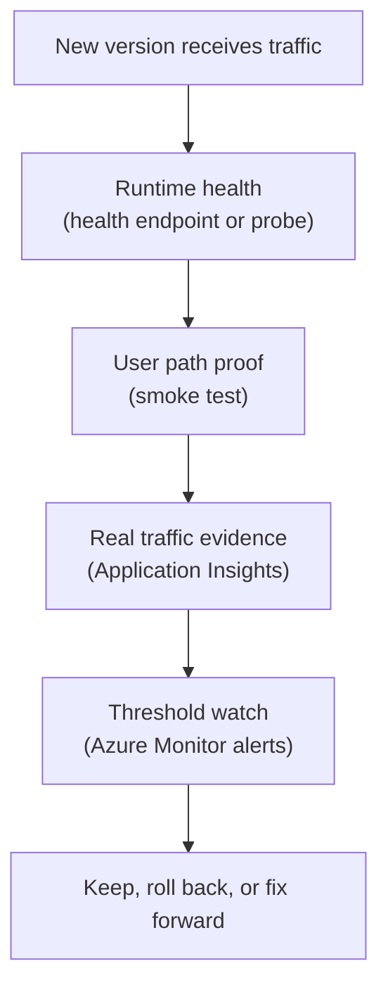

## Table of Contents

1. [The Release Is Not Done When Traffic Moves](#the-release-is-not-done-when-traffic-moves)
2. [If You Know AWS Release Checks](#if-you-know-aws-release-checks)
3. [Verification Has Layers](#verification-has-layers)
4. [Health Checks Prove The App Can Serve](#health-checks-prove-the-app-can-serve)
5. [Smoke Tests Prove The User Path Works](#smoke-tests-prove-the-user-path-works)
6. [Application Insights Shows Real Request Behavior](#application-insights-shows-real-request-behavior)
7. [Azure Monitor Alerts Watch The Release Window](#azure-monitor-alerts-watch-the-release-window)
8. [Rollback Or Fix Forward Is A Judgment Call](#rollback-or-fix-forward-is-a-judgment-call)
9. [Failure Scenarios And Decisions](#failure-scenarios-and-decisions)
10. [A Practical Post-Release Checklist](#a-practical-post-release-checklist)

## The Release Is Not Done When Traffic Moves

Traffic moved to the new version. That is not the end of the release. It is the beginning of the watch window.

A watch window is the period after traffic moves when the team actively looks for evidence that the release is healthy.

This matters because some failures only appear under real traffic. A health endpoint may pass, and a fake checkout may pass. Then real users hit a rare payment provider path, one region has slower storage calls, or the app works for new customers but fails for customers with old data.

Release verification is the practice of checking evidence after deployment. Rollback decision-making is the practice of choosing what to do if the evidence is bad.

For `devpolaris-orders-api`, verification should answer:

- Are checkout requests succeeding?
- Is response time normal?
- Are Azure SQL dependency calls healthy?
- Are receipt uploads to Blob Storage healthy?
- Are new exceptions appearing?
- Are alerts firing?
- Are users affected?

The release owner should not wait for a vague feeling. They should look at known signals.

## If You Know AWS Release Checks

If you have learned AWS deployments, the shape is familiar. You may have watched CloudWatch alarms after an ECS deploy, checked Lambda errors after shifting an alias, or inspected X-Ray traces or load balancer target health.

Azure uses different tools, but the release judgment is the same.

| AWS idea you may know | Azure idea to compare first | Shared question |
|---|---|---|
| CloudWatch alarms | Azure Monitor alerts | Did a release threshold fire? |
| CloudWatch logs | Log Analytics and Application Insights logs | What failed and where? |
| X-Ray trace | Application Insights transaction diagnostics | Which dependency caused the slow or failed request? |
| Load balancer target health | App Service Health check or Container Apps readiness | Is the runtime ready to receive traffic? |
| ECS rollback | Container Apps traffic shift or App Service slot swap back | Can users return to a known good path? |

The useful habit is:

> Verify the release with production-shaped evidence.

Do not rely only on the fact that the deployment command finished. The cloud accepted your change. Users still need the app to work.

## Verification Has Layers

One check is not enough because different checks catch different problems.

Startup checks catch missing config and broken boot. Health checks catch a running process that is not ready. Smoke tests catch the main user path. Application Insights catches request failures, dependency failures, and slow transactions. Azure Monitor alerts catch thresholds that deserve attention. Human review catches context that automation may not know yet.

Here is the layered picture.



This is not meant to be slow ceremony. It is meant to catch failures at the cheapest point.

If the health check fails, do not send more traffic. If the smoke test fails, stop before users discover it. If real telemetry degrades, make a release decision quickly.

## Health Checks Prove The App Can Serve

A health check should answer:

> Can this app instance or revision serve traffic safely?

For App Service, Health check pings a path you choose. For Container Apps, probes can check startup, liveness, and readiness. The exact platform behavior differs, but the meaning should be clear.

For `devpolaris-orders-api`, `GET /health` should not return success just because the HTTP server process exists. Checkout depends on Azure SQL Database and Blob Storage, so the health check should at least prove the app has required config and can reach critical dependencies. If the team keeps the public health check shallow, it should have a separate readiness check that does the deeper work.

A useful health result might be:

```text
GET /health
status: 200

app: ok
config: ok
azure_sql: ok
blob_storage: ok
telemetry: ok
version: 2026.05.03.1842
```

A failing health result should be equally clear:

```text
GET /health
status: 503

app: ok
config: ok
azure_sql: failed
blob_storage: not_checked
version: 2026.05.03.1842
```

Do not overload health with heavy work. It should be safe to call often. But do not make it so shallow that it says healthy while checkout cannot work.

Health is a release gate. Make it meaningful.

## Smoke Tests Prove The User Path Works

A smoke test is a small test that proves the main path is not obviously broken. The name comes from old hardware testing: turn it on and make sure smoke does not come out.

For a backend API, a smoke test should be safe, repeatable, and close to the user path.

For `devpolaris-orders-api`, the smoke test might:

- Create a fake checkout with a test payment token.
- Write an order record to Azure SQL Database.
- Upload a receipt to a test container or marked test path in Blob Storage.
- Return an order ID.
- Emit Application Insights telemetry.

The smoke test should not charge a real card, create confusing real customer data, or depend on a developer's laptop.

A release record might show:

```text
smoke test: checkout-test-2026-05-03-1842
target: staging label for Container Apps revision devpolaris-orders-api--4c91b7f
result: passed
order_id: smoke_ord_2026_05_03_1842
receipt_blob: smoke/2026-05-03/smoke_ord_2026_05_03_1842.pdf
duration_ms: 812
```

That is evidence. If the smoke test fails, the release owner should stop traffic movement and inspect the failure. The smoke test is there to protect users from obvious breakage.

## Application Insights Shows Real Request Behavior

After traffic moves, Application Insights becomes one of the most useful release views. It can show failed requests, slow requests, dependency calls, exceptions, and the database or storage calls inside one checkout request.

For a release window, the team might watch:

| Signal | Why it matters |
|---|---|
| `POST /checkout` failed request rate | Shows user-visible failure |
| p95 checkout duration | Shows slow user experience |
| Azure SQL dependency failures | Shows database access or query problems |
| Blob Storage dependency failures | Shows receipt upload problems |
| New exception types | Shows code paths not caught by tests |

The important word is "new." Every production system has some background noise. A release owner should ask:

> What changed after this version started receiving traffic?

For example:

```text
release watch
version: 2026.05.03.1842
traffic: 10%
window: first 15 minutes

POST /checkout failed rate: 0.4%
p95 checkout duration: 680 ms
new exception types: none
Blob Storage dependency failures: 0
Azure SQL dependency failures: 1 transient timeout
decision: continue watching, do not increase traffic yet
```

That decision is calm. The release is not perfect, but it is not clearly bad. The team keeps watching before increasing traffic.

## Azure Monitor Alerts Watch The Release Window

Alerts are useful during release, but only if they are tuned to real action. During a release, the team should know which alerts matter.

For `devpolaris-orders-api`, release-window alerts might include:

- Checkout failed request rate above a threshold.
- Checkout latency above a threshold.
- Blob Storage dependency failures above a threshold.
- Azure SQL connection failures above a threshold.
- Container revision degraded or not ready.
- Availability test failures.

An alert should have an owner and a first check. It should not only say "bad thing happened."

For example:

```text
alert: checkout-failure-rate-high
condition: POST /checkout failure rate above 5% for 10 minutes
action group: orders-api-oncall
first check: Application Insights failures filtered by version 2026.05.03.1842
release action: hold traffic increase, consider rollback if dependency failures or new exceptions continue
```

This makes the alert useful in a release meeting. It connects the signal to a decision. Without that connection, alerts become noise.

## Rollback Or Fix Forward Is A Judgment Call

When a release fails, teams often ask:

> Should we roll back or fix forward?

Rollback means return users to a known working version or configuration. Fix forward means keep the new release path and apply a correction. Neither is always right.

Rollback is usually better when users are actively hurt, the old version is compatible, and the rollback path is clear. Fix forward may be better when rollback would be dangerous, the fix is tiny and well understood, or the issue is outside the artifact. Stopping the rollout may be the right answer when evidence is unclear and traffic has not fully moved.

For `devpolaris-orders-api`, consider these cases:

| Evidence | Better first decision |
|---|---|
| New revision has startup failures before traffic | Stop rollout, fix candidate |
| 10% traffic has high checkout failures, old revision healthy | Route traffic back to old revision |
| New version works, but Key Vault permission missing | Restore permission or config, then verify |
| Database migration changed data in a way old version cannot read | Stop and plan repair carefully, rollback may not help |
| One non-critical metric is noisy but users are healthy | Hold rollout and investigate before increasing traffic |

The best decision comes from evidence. Do not roll back blindly, and do not fix forward stubbornly.

Ask:

- Are users affected?
- Is the old path known good?
- Did data change?
- Is the fix smaller than the rollback risk?
- How fast can we prove recovery?

## Failure Scenarios And Decisions

These scenarios are not scripts. They are decision practice.

| Scenario | Better first decision | First checks |
|---|---|---|
| The new Container Apps revision fails readiness, and traffic is still on the old revision | Stop rollout and fix the candidate. No user rollback is needed because users never moved | Startup logs, readiness probe, port, missing environment variables, and image command |
| The App Service slot passes health, swaps to production, and checkout failures rise to 20 percent | Swap back if the previous production slot is known good and no incompatible data change happened | Application Insights failures, dependency failures, slot settings, and recent config changes |
| The new revision works for checkout, but receipt upload fails for every user | Route traffic back if receipt upload is critical. If checkout can safely complete and receipts can retry later, hold traffic and fix forward may be possible | Blob Storage dependency failures, managed identity role assignment, storage account name, and Key Vault references |
| The release changed a database migration and old code cannot read the new schema | Do not assume rollback is safe. Stop traffic increase, protect data, and follow the migration recovery plan | Migration record, schema compatibility, data writes since release, and whether old and new code can coexist |
| An alert fires, but the dashboard looks normal | Hold the rollout and inspect the alert signal before changing traffic | Alert scope, metric aggregation, time window, and whether the alert targets the new version or all traffic |

The goal is to make the next action calm and explainable.

## A Practical Post-Release Checklist

A post-release checklist should be short enough to use.

For `devpolaris-orders-api`, use this:

```text
release: 2026.05.03.1842
runtime: Azure Container Apps
candidate: devpolaris-orders-api--4c91b7f
traffic stage: 10%

health:
  revision running
  readiness passed
  GET /health passed

smoke:
  fake checkout passed
  receipt upload passed

Application Insights:
  checkout failure rate normal
  p95 duration normal
  no new exception type
  SQL dependency healthy
  Blob dependency healthy

Azure Monitor:
  no release-blocking alerts
  action group routing confirmed

decision:
  increase to 50% and continue watching

rollback target:
  devpolaris-orders-api--b71a22c
```

For App Service, the same idea works with slot names:

```text
runtime: App Service
candidate: staging slot
production action: swap completed
rollback target: swap back to previous production slot state
```

The checklist is not there to slow the team down. It keeps the release owner from relying on memory while production is changing.

Good release verification makes the decision visible: keep the rollout moving, hold traffic, roll back, or fix forward. That is the whole operating skill.

---

**References**

- [Monitor App Service instances by using Health check](https://learn.microsoft.com/en-us/azure/app-service/monitor-instances-health-check) - Microsoft explains App Service health checks, unhealthy instance routing, and health metrics.
- [Health probes in Azure Container Apps](https://learn.microsoft.com/en-us/azure/container-apps/health-probes) - Microsoft explains startup, liveness, and readiness probes for Container Apps.
- [Investigate failures, performance, and transactions with Application Insights](https://learn.microsoft.com/en-us/azure/azure-monitor/app/transaction-diagnostics) - Microsoft explains Application Insights views for failures, performance, transaction search, and transaction diagnostics.
- [Application Insights availability tests](https://learn.microsoft.com/en-us/azure/azure-monitor/app/availability-standard-tests) - Microsoft explains availability tests and how they monitor endpoint health from outside the app.
- [What are Azure Monitor alerts?](https://learn.microsoft.com/en-us/azure/azure-monitor/alerts/alerts-overview) - Microsoft explains Azure Monitor alert rules, conditions, states, and action groups.
