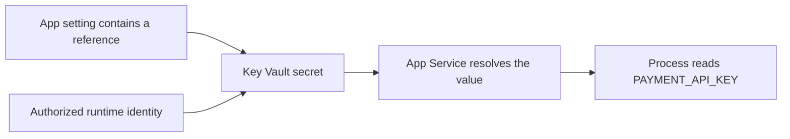
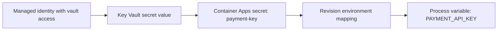
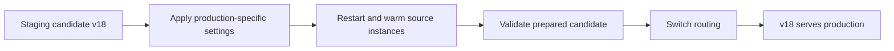

## Table of Contents

1. [What Must a Safe Runtime Change Control?](#what-must-a-safe-runtime-change-control)
2. [How Do App Settings and Connection Values Work?](#how-do-app-settings-and-connection-values-work)
3. [How Do Feature Flags and Key Vault References Reduce Risk?](#how-do-feature-flags-and-key-vault-references-reduce-risk)
4. [How Do Container Apps Secrets Reach the Runtime?](#how-do-container-apps-secrets-reach-the-runtime)
5. [How Do You Roll Back Configuration?](#how-do-you-roll-back-configuration)
6. [What Is a Candidate Version?](#what-is-a-candidate-version)
7. [How Do Slots and Traffic Splitting Support Rollouts?](#how-do-slots-and-traffic-splitting-support-rollouts)
8. [How Do You Roll Back Code?](#how-do-you-roll-back-code)
9. [Check Your Answers](#check-your-answers)

You deploy `checkout-api:v18` and leave the image unchanged for a week. During that week, someone changes the payment endpoint, a secret rotates, and a feature flag enables a new checkout path. The code package is still v18, but customers are no longer using the same running system.

This is why configuration and rollout belong together. Settings decide which dependencies an application uses and which behavior it selects. Rollout controls decide who experiences that behavior while the team checks whether it works. Both can change production without another build, and both need a known way back if the result is wrong.

We will follow the values from their definition into the running process, then use that complete runtime state to answer these questions:

1. **What Must a Safe Runtime Change Control?**
2. **How Do App Settings and Connection Values Work?**
3. **How Do Feature Flags and Key Vault References Reduce Risk?**
4. **How Do Container Apps Secrets Reach the Runtime?**
5. **How Do You Roll Back Configuration?**
6. **What Is a Candidate Version?**
7. **How Do Slots and Traffic Splitting Support Rollouts?**
8. **How Do You Roll Back Code?**

## What Must a Safe Runtime Change Control?
<!-- section-summary: The artifact, settings, secrets, identity, and infrastructure jointly determine runtime behavior, so each must be considered part of a production change. -->

An artifact contains the application you built. A running application also depends on the values and resources supplied around that artifact. `DATABASE_URL`, `PAYMENT_PROVIDER`, `CACHE_ENABLED`, `FEATURE_NEW_CHECKOUT`, and `LOG_LEVEL` can change its destination, decisions, or observable behavior even when the executable stays identical.

The complete runtime therefore combines the artifact, configuration, secrets, identity, and infrastructure. The artifact tells the process what it can do. Configuration selects environment-specific behavior. Secrets and identity enable protected access. Infrastructure provides the execution and connection paths through which the process does its work.

This distinction is practical, not merely terminology. If `checkout-api:v18` points to the wrong database, reproducing the same image does not reproduce a working production system. If it has the right endpoint but the wrong identity, the connection may reach the correct service and still be rejected. A release needs to account for these inputs together.

### Separate application behavior from environment choices

Imagine the connection code contains a production hostname directly:

```python
connect("production-db.database.windows.net")
```

To run it in development, you would change that line:

```python
connect("development-db.database.windows.net")
```

Staging would need another source change:

```python
connect("staging-db.database.windows.net")
```

The problem is not the connection operation. It is that selecting an environment now requires editing the program. A configuration lookup separates the two responsibilities:

```python
connect(environment["DATABASE_HOST"])
```

Here the code describes **how to connect**, while the supplied value identifies **where to connect**. The same behavior can be exercised in several environments without compiling a different application for each one. Configuration selects the runtime destination instead of embedding that destination in the program.

### Build once and change the environment values

Suppose `checkout-api:v18` is the artifact used in development, staging, and production. Its environment can differ in explicit ways:

| Environment | Database host | Payment mode |
| --- | --- | --- |
| Development | `db-dev` | `fake` |
| Staging | `db-stage` | `sandbox` |
| Production | `db-prod` | `live` |

This lets the artifact tested in staging be the artifact released in production. Environment-specific values still need verification, but there is no additional uncertainty from building a different binary for the final environment.

The distinction also gives a clearer failure investigation. If the identical artifact worked with staging values and fails with production values, the differences in configuration, access, and infrastructure become concrete things to inspect. That is much more useful than comparing three separately built packages while also trying to find the setting that changed.

### Configuration changes are releases too

Suppose yesterday's runtime used v18 with `PAYMENT_API=https://payments-v1`. Today the endpoint changes to `https://payments-v2`. No new code was deployed, but requests now go to a different payment API. The operational effect can be as significant as replacing v18 with v19 while keeping the old configuration.

For this reason, identify runtime versions with both an artifact version and a configuration version. The pair `v18 + old configuration` is different from `v18 + new configuration`. Secret rotation, feature state, and access changes can introduce further differences even when those two labels appear unchanged.

A safe rollout controls how these changes reach users. Its **blast radius** is the portion of the system or user population that can be affected by a bad change. The aim is to learn whether the complete candidate works while that exposure is still limited, then increase exposure only when the evidence supports it.

## How Do App Settings and Connection Values Work?
<!-- section-summary: App Service supplies app settings as environment variables, restarts applications when they change, and needs configuration history to make changes reproducible. -->

Azure App Service **app settings** are name-value pairs supplied to application code as environment variables. For Linux applications and custom containers, App Service injects them into the container environment. The application reads ordinary process values; it does not need to know how an operator entered them in Azure.

For example, the application may expect `PAYMENT_API_URL`, `MAX_RETRIES`, and `NEW_CHECKOUT_ENABLED`. Production supplies these values:

```text
PAYMENT_API_URL=https://payments.internal
MAX_RETRIES=5
NEW_CHECKOUT_ENABLED=false
```

Python code can read the payment destination through its normal environment interface:

```python
os.environ["PAYMENT_API_URL"]
```

The name is the contract between the application and its hosting configuration. The value is the environment-specific choice. This is the same separation as the database example, now implemented through App Service's runtime setting mechanism.

### Understand effective values and restarts

An application can package defaults such as:

```json
{
  "LogLevel": "Information",
  "MaxRetries": 3
}
```

Production can then supply `MaxRetries=5`. In supported stacks such as ASP.NET Core, runtime settings can override the packaged application configuration. The effective value is therefore not always the value visible in the checked-in defaults. The relevant configuration-provider behavior must be considered when determining what the process actually uses.

Adding, deleting, or changing an App Service app setting triggers an application restart. The update is not simply a value silently changing inside every existing process. Azure applies the new environment through the application's lifecycle, so startup and readiness matter even for a configuration-only change.

That gives configuration edits two possible effects: they change the selected behavior, and they can restart the process that provides it. A harmless-looking logging or retry update still needs an operating plan if a restart affects service availability or startup dependencies.

### Apply a setting through the intended control surface

In the App Service portal, app settings are under **Settings → Environment variables**. The equivalent Azure CLI operation is `az webapp config appsettings set`. For the checkout application in resource group `shop-prod`, this command keeps the new checkout behavior disabled:

```bash
az webapp config appsettings set \
  --resource-group shop-prod \
  --name checkout-api \
  --settings NEW_CHECKOUT_ENABLED="false"
```

This command is an example of a production mutation, not a read-only inspection. The value changes the named app's configuration, and the app-setting update can restart that application. Its successful completion confirms the configuration operation, while runtime checks must still establish that the process started with the intended behavior.

The portal and CLI are useful control surfaces, but manual edits should not be the only configuration-management system. A definition kept in Git, reviewed, and applied through a pipeline gives the team a reproducible history. It also makes environment differences explicit rather than leaving them scattered across remembered portal actions.

### Record what changed and why

Suppose `MAX_RETRIES` changes from 3 to 100 just before production fails. The incident investigation needs to know who made the change, when it happened, why it was intended, what the old value was, what else changed at the same time, and how to restore those values.

Version control, code review, deployment history, environment separation, automated validation, and rollback procedures support those answers. They are configuration practices for the same reason that they are code practices: an uncontrolled change can alter production behavior.

A record can associate `checkout:v18` with `production-config@commit-72ac` and explicitly list `MAX_RETRIES: 3 → 5` and `FEATURE_X: false → true`. That record identifies a reconstructable runtime state. A note saying only “updated settings” does not tell the next operator what the process received.

Ordinary configuration history should not become a second secret store. Record the identity of a secret or its reference where needed, while keeping confidential values under the access controls intended for secrets. The next section separates those responsibilities.

## How Do Feature Flags and Key Vault References Reduce Risk?
<!-- section-summary: Secret references separate confidential values from app settings, while feature flags separate deploying code from exposing its behavior. -->

Not every configuration value needs the same protection. `MAX_RETRIES=5` is an ordinary operational setting. `DATABASE_PASSWORD=SuperSecretPassword` represents a credential and is sensitive even if it enters the application through the same environment-variable mechanism. Feature switches, endpoint names, and retry counts differ from passwords, API keys, and connection credentials in confidentiality and lifecycle requirements.

Before storing a credential, ask whether the application needs one. Azure Storage access, for example, can use a connection string containing an account name and secret key, or it can use managed identity and Azure authorization. The latter avoids a long-lived credential for the application to keep.

A useful preference order is managed identity or token-based access first, a secret managed in a secret manager when a credential is unavoidable, and a raw secret directly in application configuration only after those better-separated options have been considered. App Service supports secretless connectivity and Key Vault references for these reasons.

### Let a setting point to a secret

If the payment provider requires an API key, putting `PAYMENT_API_KEY=abcdef123456` directly into app settings stores the credential as the setting value. A **Key Vault reference** stores a pointer instead. App Service resolves that pointer using an identity authorized to access the vault.

The application still reads `PAYMENT_API_KEY`. It does not need custom Key Vault retrieval code for this reference pattern. The hosting platform supplies the resolved value through the setting the application already expects.

A reference has this shape:

```text
@Microsoft.KeyVault(SecretUri=https://myvault.vault.azure.net/secrets/payment-key)
```

The same reference is the value assigned to the `PAYMENT_API_KEY` app setting. The URI identifies the vault and secret; the runtime identity supplies the authority to read it. A correct pointer without permission is not sufficient, and a valid identity does not correct a pointer to the wrong secret.



This extra level of reference separates application configuration from secret lifecycle. The app can continue reading the same variable while the credential is managed and rotated in the vault. Source code no longer needs to change just because a password or API key changes.

### Choose pinned or current secret versions deliberately

Suppose `payment-key` has version 1 containing `AAA`, version 2 containing `BBB`, and version 3 containing `CCC`. A reference to `payment-key/version-2` selects `BBB`. An unversioned reference to `payment-key` follows the current secret version.

A pinned version provides more deterministic control: rotation requires an explicit reference change. An unversioned reference reduces configuration work during rotation, but the effective runtime secret can change without another artifact deployment. Neither behavior should be an accidental discovery during an incident.

App Service caches resolved Key Vault references. For an unversioned reference, its periodic refresh can take up to 24 hours. A configuration change and application restart trigger an immediate refetch, and Azure also provides a refresh operation. Credential-rotation planning therefore needs both the vault version and the consuming application's refresh behavior.

A changed secret is another runtime change. The application may still be v18, but its ability to authenticate against a dependency now depends on the newly resolved value. This is why secret references and version expectations belong in the release record, even though the confidential values themselves do not.

### Deploy a feature before enabling it

A **feature flag** controls which behavior the application selects. In this example, v18 contains both checkout paths:

```python
if feature_enabled("NewCheckout"):
    use_new_checkout()
else:
    use_old_checkout()
```

With `NewCheckout=false`, deploying v18 does not expose the new checkout behavior. Later, changing the flag to `true` enables it without a code deployment at that moment. This separates **code deployment** from **feature release**.

The sequence can be: deploy dormant code, verify that the runtime works, and then enable the feature separately. Azure App Configuration provides centralized configuration and feature management, including simple switches, percentage rollout, and audience targeting. A team can therefore test runtime changes separately from the customer-facing behavior change contained inside them.

Targeting need not be one global Boolean for everyone. Employees and beta customers can receive the feature first, followed by 5% of the wider population while everyone else remains on the old path. Conceptually, the decision checks whether the user is internal or falls within the configured rollout group before selecting the new branch.

If checkout failures rise after activation, setting `NewCheckout=false` can restore the old behavior while keeping v18 deployed, provided the old path still exists and works. This is a **feature rollback**, often described as a kill switch. It avoids rebuilding and redeploying the application just to stop using the problematic branch.

### Remove flags after their job is finished

Flags also create complexity. Three independent Boolean flags already permit eight combinations; ten permit 1,024. Flags named FeatureA, FeatureB, FeatureC, and so on can leave an increasing number of possible program states to understand and test.

A temporary rollout flag therefore needs a lifecycle: create it, roll out the behavior, reach 100%, observe the result, remove the old branch, and delete the flag. Leaving old switches and dormant code indefinitely makes later behavior harder to explain. The same control that reduces rollout risk can create long-term maintenance risk if it has no retirement plan.

## How Do Container Apps Secrets Reach the Runtime?
<!-- section-summary: Container Apps revisions define environment-variable consumers, while application-scoped secrets and their refresh behavior determine which values those consumers receive. -->

A container image makes the separation between package and environment especially visible. The image can remain `checkout:v18` while its definition supplies `DATABASE_HOST=db-prod` and a secret reference for `PAYMENT_API_KEY`. The process combines those inputs at runtime rather than storing every environment's values in the image.

In Azure Container Apps, environment variables are part of revision-scoped configuration. Updating them creates a new revision. A revision therefore records more than an image choice: its template includes the environment and secret references used to construct its containers.

### Separate the secret name from the variable name

Define a Container Apps secret named `payment-key`, then expose it to the application as:

```text
PAYMENT_API_KEY=secretref:payment-key
```

`payment-key` is the Container Apps secret name. `PAYMENT_API_KEY` is the name the application reads. The `secretref:` relationship connects them. The container does not need to know how Azure obtained the value behind that secret name.

The secret can itself reference Key Vault, with managed identity providing the access. This produces three separate responsibilities: application code chooses which environment variable to read, Container Apps maps that variable to a secret, and Key Vault manages the actual confidential value. Key Vault-backed references are the recommended production pattern over placing literal secret values directly in the Container App definition.



The direction of value delivery in this diagram is the reverse of the lookup path. The container reads its environment, the environment mapping names a Container Apps secret, and that secret may resolve through a Key Vault reference. Both views describe the same chain of responsibility.

### Updating the secret is not always updating the process

Container Apps secrets are **application-scoped**, not revision-scoped. Editing a secret does not itself create a new revision. Existing revisions also do not automatically consume a changed direct secret value merely because the secret object was edited. Restarting the existing revision or deploying a new revision makes the changed value effective for its consumers.

This differs from editing an environment-variable definition, which changes the revision template. One operation changes a shared secret object; the other creates a new description of the containers to run. They should not be treated as equivalent deployment events.

The distinction is especially important during verification. A successful control-plane update proves that Azure accepted the new secret configuration. It does not, by itself, prove that an already-running process now holds the new value. The release needs the appropriate lifecycle step and evidence from the application that it can use the dependency.

### Key Vault-backed rotation has its own timing

For an unversioned Key Vault URI, Container Apps follows the latest secret version. It checks for a newer version and retrieves it within roughly 30 minutes. Active revisions consuming that secret through environment variables are restarted to pick up the new value.

Compare that with App Service's Key Vault reference behavior: resolved values can remain cached until the periodic refresh, up to roughly 24 hours, with explicit refresh or configuration-triggered restart available. The products share the idea of a secret reference, but not an identical refresh schedule or runtime lifecycle.

| Secret change | Revision or process implication |
| --- | --- |
| App Service app setting changes | The application restarts |
| App Service unversioned Key Vault reference rotates | Periodic refresh can take up to 24 hours; restart/configuration change or refresh can refetch |
| Container Apps environment-variable definition changes | A new revision is created |
| Container Apps direct secret value changes | No revision is created; existing consumers need restart or a new revision |
| Container Apps unversioned Key Vault-backed secret rotates | Retrieval within roughly 30 minutes, with affected active environment-variable consumers restarted |

These timings and lifecycle differences belong in the rotation plan. A new credential must be usable by the dependency and by the processes that consume it. Observing only the vault's latest version does not establish that every runtime has completed the transition.

## How Do You Roll Back Configuration?
<!-- section-summary: Configuration rollback restores an identified previous set of values and then verifies that the hosting platform has applied them to the running application. -->

A code rollback is not always the right response to a broken release. Suppose v18 worked yesterday with `MAX_RETRIES=3`, `PAYMENT_API=/v1`, and `FEATURE_X=false`. Today those values change to 50, `/v2`, and `true`, while the artifact remains v18. Returning to v17 may not fix the settings that caused the failure.

Instead, restore the known-good configuration. Call yesterday's state revision 41 and today's revision 42:

| Setting | Configuration 41 | Configuration 42 |
| --- | --- | --- |
| `MAX_RETRIES` | `3` | `50` |
| `PAYMENT_API` | `/v1` | `/v2` |
| `FEATURE_X` | `false` | `true` |

A rollback from configuration 42 to 41 restores an identified group of values. It does not depend on someone remembering which of several independent portal fields looked different yesterday. The artifact can remain v18 if the evidence indicates that the configuration, rather than the code package, caused the failure.

### Preserve the previous state before changing it

Configuration repositories, infrastructure as code, Azure App Configuration snapshots or versioning strategies, and deployment history all help make old states recoverable. The essential property is that the previous values are known and can be reapplied through the appropriate control surface.

This includes relationships, not just literal values. If a setting points to a secret version or a dependency endpoint, the record needs that target. Restoring a variable name without restoring the intended target is not a complete recovery. The confidential secret value can remain protected while its version or reference is recorded.

A release owner should therefore be able to answer two separate questions: which configuration should be restored, and what must happen for the application to consume it? The first is a history problem. The second is a hosting and lifecycle problem.

### Account for restart and revision behavior

In App Service, restoring app settings restarts the application just as applying the bad setting did. The practical sequence is configuration update, process restart, startup, health validation, and continued traffic. It is not necessarily an instantaneous variable flip with no service impact.

In Container Apps, an environment-variable change belongs to revision-scoped state, while a direct secret update belongs to application-scoped state and may require restarting consumers. A recovery plan that ignores this distinction can leave the control plane showing the desired value while the old process still uses its previous environment.

That is why the end of a rollback is not the successful settings operation. Verify that the correct runtime is using the restored values and that the dependency call or user flow works again. Avoid printing confidential values merely to establish that a reference was restored; the useful evidence is the intended target and successful behavior.

### Choose the smallest recovery that addresses the failure

A feature-only problem may be resolved by disabling the flag. A bad secret rotation may require returning from secret version 7 to version 6 or restoring the prior reference. A wrong dependency endpoint may require configuration 42 to return to 41. None automatically requires a new application binary.

These recovery controls have different boundaries. Disabling a feature selects a code path that already exists. Restoring a secret changes access credentials. Restoring configuration changes the values around the artifact. The correct choice follows the evidence about what changed and what failed.

The same preparation supports rollout: once configuration and its recovery path are explicit, the team can construct a candidate whose complete runtime state is worth testing. A candidate image alone is not enough.

## What Is a Candidate Version?
<!-- section-summary: A candidate is the proposed runtime state, including its artifact, production-compatible settings, secrets, identity, and feature state, prepared for validation before broad exposure. -->

Production currently runs v17, and the team wants to introduce v18. The **candidate** is not just the new image. It combines artifact v18 with production-compatible configuration, correct identity, correct secrets, and the intended feature state. These inputs need to exist together somewhere the team can inspect before ordinary users depend on them.

An App Service staging slot or a Container Apps revision provides that place. The candidate can be deployed, start, and pass direct checks while receiving no production traffic. This separates proving that the runtime can operate from deciding how many users should use it.

### Validate the risks that a build cannot settle

Before exposure, check startup, readiness, Key Vault access, database access, other dependency access, and smoke tests. A smoke test here means a small direct exercise of the important application behavior, not merely confirmation that an Azure resource exists.

These checks address uncertainties such as whether the process will start, whether configuration is valid, whether identity permits the required call, and whether the database accepts requests. They also establish an initial view of latency and application behavior before the wider range of production traffic reaches the candidate.

A candidate that cannot use its dependency should not receive traffic just because the container image is available. Similarly, a healthy process with the wrong feature state is not the candidate the team intended to test. Validation needs to name both the version and the surrounding runtime inputs.

### Readiness is an intermediate proof

The progression is from a process existing, to starting, to being ready, to receiving requests, to behaving correctly for users. Each stage establishes more than the one before it, but none should be mistaken for all later stages.

Container Apps single-revision mode keeps traffic on the existing revision until the new revision is ready. That includes successful provisioning, appropriate replica scale-up, and passing startup and readiness probes. A revision whose containers cannot start should not be treated as ready for production simply because its resource record exists.

Even passing readiness does not prove that customers can complete checkout. A candidate can show normal CPU and memory, healthy readiness, and healthy HTTP 200 availability while successful payments drop by 40%. Infrastructure can be working while the release is harming its intended business operation.

### Observe several layers of health

Platform evidence includes whether containers are running and their CPU and memory behavior. Application evidence includes 5xx rates, latency, and exceptions. Dependency evidence includes database and downstream API failures. Business evidence includes payment success, order completion, and login success.

These layers answer different questions. Normal CPU does not contradict a failed payment call. A successful basic HTTP response does not contradict a broken order flow that the check never exercised. The closer a signal is to the user's intended result, the more directly it describes the outcome the release is supposed to protect.

A useful risk model is the probability that a change is bad multiplied by its impact if it is bad. Before observing production behavior, that probability is uncertain, so start with a small affected population. Healthy evidence can justify increasing exposure; an arbitrary passage through percentages cannot.

For example, 5%, 25%, 50%, and 100% are useful rollout stages only if the team observes latency, errors, dependency behavior, and business results between them and makes a decision. Moving immediately through all four numbers merely reaches full exposure in several commands. The safety comes from the observation and decision between those commands.

## How Do Slots and Traffic Splitting Support Rollouts?
<!-- section-summary: Slots and revisions keep candidate runtimes separate, while swap preparation and traffic weights let teams validate them and increase exposure in stages. -->

An App Service application such as `checkout-app` can have production running v17 and staging running v18. Both slots are live applications with their own hostnames. Staging normally begins with no production traffic, so the team can check startup, authentication, dependencies, `/health`, checkout behavior, and metrics directly.

The key advantage is that preparing the candidate does not require replacing the currently serving application first. Production remains available while the proposed runtime is assembled and tested beside it.

### Decide which settings stay with a slot

Suppose production uses `DATABASE=db-prod` and staging uses `DATABASE=db-stage`. A swap should not accidentally leave production connected to the staging database. App Service supports slot-specific, or **sticky**, app settings and connection strings that remain associated with the slot rather than swapping with the application.

Application code should move with the release. A release-version value may move with it. The production database destination should remain production, and the staging database destination should remain staging. Reviewing these categories is necessary before a swap, because configuration is part of the runtime being moved into service.

A slot swap is more careful than exchanging two names. App Service applies the target slot's slot-specific settings to the source instances, restarts them where necessary, and waits for initialization and warmup. Only after preparation succeeds does it switch routing to the warmed source. If preparation fails, production remains on the existing target.



This procedure tests the candidate closer to its eventual production configuration before changing the public serving path. It reduces the risk of discovering a startup or configuration problem only after replacing the current production content.

### Use preview when validation needs a separate decision

A **swap with preview** separates preparation from cutover. In the first phase, the production-slot configuration is applied to the staging candidate. The team can then validate that prepared state before completing the traffic swap. The multi-phase operation can be started, completed, or cancelled through the portal and Azure CLI.

Preview is useful because success in staging with staging values does not automatically prove success with production values. It provides a point at which the candidate more closely resembles its destination while the team still controls whether the final traffic change happens.

Slots also preserve a direct recovery shape. Before a swap, production holds v17 and staging v18. Afterward, production holds v18 and staging v17. Swapping the same slots back can restore the previous production application, assuming that the surrounding system remains compatible with it.

### Route a small population to another slot

A full swap moves the candidate from no production exposure to the production serving path. App Service can also route a configured percentage of production traffic to another slot: for example, 95% to v17 and 5% to staging v18.

Slot routing assigns clients and uses a routing cookie to keep a routed client pinned for a period. It is not necessarily a new random choice between versions for every request. That behavior matters when interpreting the population exposed during a test.

A staged allocation can move from v17/v18 at 100/0 to 95/5, then 75/25, 50/50, and 0/100. The observations between those steps determine whether the next increase is appropriate. Percentages are an exposure control, not an independent guarantee of safe behavior.

### Use Container Apps revisions as explicit candidates

Container Apps represents deployment versions as revisions, such as `checkout--000017` and `checkout--000018`. In multiple-revision mode, both can remain active, with traffic allocated between them. A release can start at 100/0, move to 95/5, then 50/50, and eventually 0/100 after the required checks.

Revision-scope changes create a new revision. These include container images, container configuration, environment variables in the revision template, and scaling configuration. Changing image v18 to v19 or `LOG_LEVEL` from `Information` to `Debug` therefore identifies a distinct candidate state.

Application-scope changes are different. Secret values, revision mode, ingress configuration, traffic rules, and revision labels can affect the Container App without creating another revision. Before applying an update, establish whether it changes one candidate's template or shared application-level state across revisions.

This distinction affects rollback as well as rollout. Keeping an old revision does not automatically restore an application-wide value changed after that revision was created. The release record needs both the revision identity and any shared state on which it depends.

For a 90/10 allocation, set the revision weights as follows:

```bash
az containerapp ingress traffic set \
  --name checkout \
  --resource-group shop-prod \
  --revision-weight \
    checkout--000017=90 \
    checkout--000018=10
```

The weights must sum to 100%. Here incoming requests are allocated 90% to revision 17 and 10% to revision 18. This is a canary release: the candidate receives limited real traffic while the previous version handles the majority.

Again, the command changes routing; it does not decide whether the candidate is good. Observe the agreed signals before another increase. If readiness fails, do not move traffic. If canary metrics degrade, move candidate exposure back to zero rather than treating progression to 100% as an unavoidable pipeline destination.

## How Do You Roll Back Code?
<!-- section-summary: Return traffic to a preserved, compatible runtime when code is faulty, but use configuration, secret, or feature recovery when those layers caused the failure. -->

If v18 is the faulty application version, returning to v17 can restore service. Depending on the hosting model, that may mean moving traffic from v18 at 100% to 0% and v17 from 0% to 100%, or swapping App Service slots back. The recovery should use the runtime that actually owns the serving path.

Keeping the old state available makes that response faster. If the team deploys v18 and immediately deletes v17, rollback requires finding the previous artifact, redeploying it, supplying its configuration, starting it, warming it, and verifying it. If v17 remains active beside the candidate, routing can return to a runtime that is already present.

Slots, multiple revisions, immutable artifacts, and previous configuration snapshots support that preparation. Their value is not simply that they retain historical names. They retain the ingredients or running state needed for an actual recovery.

### Match recovery to the failed layer

A bad binary, bad setting, bad feature, invalid secret, and bad traffic decision require different responses:

| Failure | Likely immediate response |
| --- | --- |
| New binary crashes | Return traffic to the previous slot or revision |
| Dependency configuration is wrong | Restore the previous configuration |
| Feature logic is broken | Disable the feature flag while the old path remains usable |
| New secret is invalid | Restore the previous secret version or reference |
| Candidate readiness fails | Keep traffic on the existing runtime |
| Canary metrics degrade | Return candidate traffic to 0% |
| Slot swap introduces failure | Swap back, checking configuration compatibility |
| Database migration breaks compatibility | Do not assume application rollback alone can restore service |

For example, configuration 42 can return to 41, `FeatureX=true` can return to `false`, secret version 7 can return to version 6, or v18 exposure can fall from 50% to zero. Automatically redeploying the previous build for all of these cases can miss the thing that actually changed.

### An old executable is not the whole old system

Suppose v18 performs this database change:

```sql
DROP COLUMN legacy_payment_id
```

This is a fragment illustrating the destructive schema operation, not a complete migration statement to execute. If v17 expects `legacy_payment_id`, returning traffic to v17 cannot recreate the missing column. The old executable still exists, but the old system state does not.

Traffic rollback and system rollback are therefore different guarantees. Compatibility needs to cover application code, database schema, message formats, API contracts, configuration, secrets, and feature flags. Backward-compatible schema changes are part of safe application rollout because old and new runtimes may need to work against the same surrounding system.

### Separate runtime rollout from feature rollout

A complete release can begin by building immutable `checkout:v18`, then combining it with production-compatible configuration, Key Vault references, and managed identity in a candidate slot or revision. Validate startup, readiness, vault access, database access, other dependencies, and smoke tests before customer exposure.

Next, allocate 95% to the old version and 5% to the candidate. Observe 5xx rates, latency, dependency failures, and business success. If the health gates pass, progress through 25%, 50%, and 100% candidate exposure with a decision between stages.

The artifact may now handle all traffic while `NewCheckout=false`. Only then start the separate feature rollout: employees first, followed by 5%, 25%, and 100% as the behavior proves safe. The runtime question is whether v18 can operate safely; the feature question is whether the new checkout behavior works for users. Separating them makes it easier to identify which change caused a regression.

Consider the complete state progression from the example:

| State | Runtime and configuration | Feature state | Exposure and next evidence |
| --- | --- | --- | --- |
| A | v17 with `config-82` | Off | v17 handles 100% |
| B | v17 serves; v18 with `config-83` exists as candidate | Off | Candidate at 0%; validate directly |
| C | Both runtimes available | Off | v17 at 95%, v18 at 5%; observe |
| D | v18 with `config-83` | Off | v18 at 100%; observe platform behavior |
| E | Same v18 runtime | Enabled for 5% of users | Observe the new feature separately |
| F | Same v18 runtime | Enabled for everyone | Retain evidence and recovery as needed |

At each transition, ask what changed, what evidence shows it worked, and what immediate rollback is available. Those questions keep the sequence tied to actual decisions instead of treating the table as a fixed timetable.

### Record the effective release state

The release record must be detailed enough to answer what was actually running. This example retains the artifact, configuration, revisions, references, feature state, traffic history, gates, and recovery target together:

```yaml
release: checkout-prod-1842
artifact:
  image: checkout:v18
  digest: sha256:abc123
configuration: config-83
runtime: Azure Container Apps
previousRevision: checkout--017
candidateRevision: checkout--018
keyVault: checkout-prod-kv
secretReferences:
  - payment-key/latest
  - database-password/v42
featureFlags:
  NewCheckout: false
traffic:
  - time: "18:00"
    candidatePercent: 5
  - time: "18:10"
    candidatePercent: 25
  - time: "18:25"
    candidatePercent: 50
  - time: "18:40"
    candidatePercent: 100
healthGates:
  fiveXxRate: "< 1%"
  p95Latency: "< 500ms"
  paymentSuccess: "> 99%"
rollbackTarget:
  revision: checkout--017
  configuration: config-82
```

The abbreviated digest and secret-reference labels illustrate the record; they are not complete production identifiers. In a real record, the artifact identity and selected secret references must resolve to the intended resources. The thresholds express this example's release decision, not universal health settings for every application.

Finally, think of production as a set of related state: artifact, configuration, secrets, identity, feature state, active runtimes, and traffic allocation. Create the proposed next state, verify it, give it limited exposure, collect evidence, and increase exposure only after deciding that it is safe. Preserve the known-good state for as long as rollback remains useful.

The purpose is not to make every change slow. It is to keep changes understandable and recoverable while uncertainty is high. Configuration changes deserve release discipline; secrets deserve their own protection and lifecycle; flags separate code from behavior; and progressive rollout depends on evidence between exposure steps. Design those recovery options before the first traffic move.

### References

- [Configure App Service app settings](https://learn.microsoft.com/en-us/azure/app-service/configure-common)
- [Use Key Vault references in App Service](https://learn.microsoft.com/en-us/azure/app-service/app-service-key-vault-references)
- [Manage Container Apps environment variables](https://learn.microsoft.com/en-us/azure/container-apps/environment-variables)
- [Manage Container Apps secrets](https://learn.microsoft.com/en-us/azure/container-apps/manage-secrets)
- [Azure App Configuration overview](https://learn.microsoft.com/en-us/azure/azure-app-configuration/overview)
- [Manage App Configuration feature flags](https://learn.microsoft.com/en-us/azure/azure-app-configuration/manage-feature-flags)
- [Understand feature management](https://learn.microsoft.com/en-us/azure/azure-app-configuration/concept-feature-management)
- [Set up App Service staging slots](https://learn.microsoft.com/en-us/azure/app-service/deploy-staging-slots)
- [Container Apps revisions](https://learn.microsoft.com/en-us/azure/container-apps/revisions)
- [Container Apps traffic splitting](https://learn.microsoft.com/en-us/azure/container-apps/traffic-splitting)

## Check Your Answers

:::expand[What Must a Safe Runtime Change Control?]{kind="recap"}
The artifact is only one input to the running system. Configuration, secrets, identity, infrastructure, and feature state determine what that code actually does. Reuse the same artifact across environments, identify configuration versions, and treat changes to these runtime inputs as production changes even without another build.
:::

:::expand[How Do App Settings and Connection Values Work?]{kind="recap"}
App Service supplies settings as environment variables and restarts the application when settings are added, removed, or changed. Runtime values can override packaged defaults in supported stacks. Use the portal or CLI through a reviewed, reproducible configuration process, and retain the old values and change history needed for recovery.
:::

:::expand[How Do Feature Flags and Key Vault References Reduce Risk?]{kind="recap"}
Prefer identity-based access when it removes an unnecessary long-lived secret. Otherwise, a Key Vault reference separates the app's setting from the confidential value and its lifecycle. Versioned and unversioned references have different rotation behavior. Feature flags independently control exposure of code already deployed, support targeted rollout and disablement, and need removal after temporary rollout work is complete.
:::

:::expand[How Do Container Apps Secrets Reach the Runtime?]{kind="recap"}
A revision's environment maps a variable to an application-scoped secret, which may reference Key Vault using managed identity. Environment changes create revisions; direct secret edits do not and need the appropriate consumer restart or new revision. Unversioned Key Vault-backed secrets refresh within roughly 30 minutes and restart affected active environment-variable consumers.
:::

:::expand[How Do You Roll Back Configuration?]{kind="recap"}
Restore an identified previous set of settings or references instead of guessing values or automatically changing the artifact. Then account for the hosting lifecycle: App Service restarts on setting changes, while Container Apps distinguishes revision-template changes from shared secret changes. Recovery is complete only after the runtime consumes the restored state and the affected behavior works.
:::

:::expand[What Is a Candidate Version?]{kind="recap"}
The candidate is the artifact together with production-compatible configuration, secrets, identity, and feature state. Validate that complete runtime before broad exposure. Startup and readiness are useful intermediate evidence, but application, dependency, and user outcomes determine whether a release actually works. Observe and decide between each increase in exposure.
:::

:::expand[How Do Slots and Traffic Splitting Support Rollouts?]{kind="recap"}
Slots and revisions keep a candidate available for direct checks while the current version serves users. Slot-specific settings, warmup, and swap preview support preparation before cutover. App Service can route clients to slots, and Container Apps can weight active revisions with a total of 100%. Shared application settings still require separate attention because preserving a revision does not preserve every surrounding value.
:::

:::expand[How Do You Roll Back Code?]{kind="recap"}
Return traffic to a preserved, compatible prior runtime or swap slots back when the application version is faulty. Use configuration, secret, or feature recovery when those layers failed instead. Check database and contract compatibility, separate runtime rollout from feature rollout, and record the effective state and exact recovery target before making users depend on the candidate.
:::
