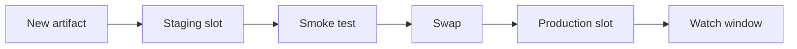
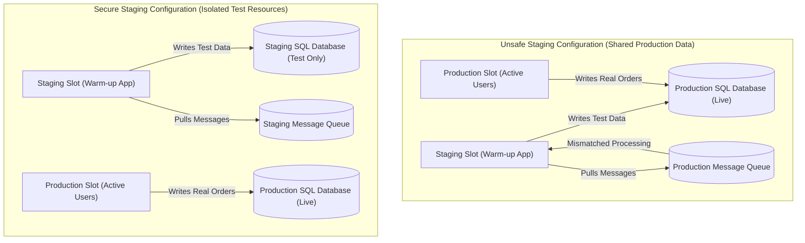
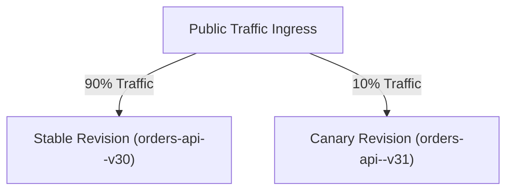
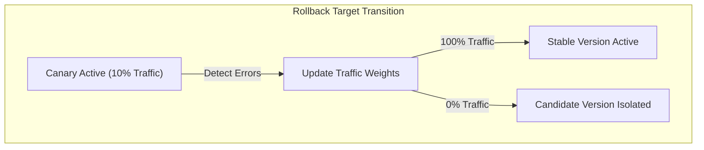

## Table of Contents

1. [The Problem](#the-problem)
2. [Candidate Version](#candidate-version)
3. [App Service Slots](#app-service-slots)
4. [Slot Settings](#slot-settings)
5. [Container Apps Revisions](#container-apps-revisions)
6. [Traffic Splitting and Canary Routing](#traffic-splitting-and-canary-routing)
7. [App Service Slot Traffic Routing CLI Commands](#app-service-slot-traffic-routing-cli-commands)
8. [Container Apps Canary Routing Bicep](#container-apps-canary-routing-bicep)
9. [Direct Testing and Health Paths](#direct-testing-and-health-paths)
10. [Rollback Mechanics](#rollback-mechanics)
11. [Putting It All Together](#putting-it-all-together)
12. [What's Next](#whats-next)

## The Problem

A safe rollout is a traffic-control pattern that verifies a candidate version before every user depends on it.

Deploying a new software version directly to all production users creates a high risk of operational failure.
If the first real test of a candidate version occurs when it receives the entire production load, any unhandled error can immediately disrupt the service.
A configuration typo, database schema mismatch, or slow process startup can affect all customers simultaneously.

To mitigate this risk, the release process must run the candidate version in an isolated environment that mimics production before routing user traffic.
This practice limits the blast radius of a failure.
Azure provides two primary mechanisms for controlled traffic routing: App Service deployment slots and Container Apps revisions.
Using these mechanisms, engineering teams can deploy, test, and gradually expose a new version to traffic under production conditions.

## Candidate Version

A candidate version is the exact package, image, or revision intended for production but still isolated from normal user traffic.
Although the version has passed development and integration testing, it still requires validation in the target environment.

A structured candidate release record defines the starting environment properties:

```plain
image: acrdevpolaris.azurecr.io/orders-api@sha256:7a4198c62c95
change: new receipt upload path
candidate revision: orders-api--v31
initial traffic: 0 percent
rollback target: orders-api--v30
```

The candidate version remains isolated from production traffic until the team verifies that the application starts successfully, resolves its identity roles, and communicates with dependent databases.
The candidate can be tested in place using direct URL routing or private network pings.

## App Service Slots

An App Service deployment slot is a parallel Web App instance used to run and warm a candidate version before swapping traffic.
It runs on the same App Service Plan as the production instance.
Each slot is assigned its own fully qualified domain name, its own application settings, and its own managed identity.
Common slot configurations include a production slot and a staging slot.

Example: `orders-api-staging.azurewebsites.net` can run image digest `sha256:7a4198...` at 0 percent public traffic while `orders-api.azurewebsites.net` continues serving the stable production version.

Deployment slots isolate the candidate version physically and logically:
- The candidate is deployed to the staging slot without affecting the active production slot.
- The staging slot runs on the same virtual machine instances as production, ensuring identical hardware profiles.
- System resources like CPU and memory are shared, which requires monitoring staging load to avoid performance impact on production.



When the candidate in the staging slot is verified, the platform executes a swap operation.
The swap reconfigures the underlying network routing to redirect production traffic to the new version.
Because the previous version remains running in the staging slot after the swap, rolling back requires executing a second swap operation to return traffic to the original version.

:::expand[Pitfall: Staging Slots Connected to Production Data]{kind="pitfall"}
A catastrophic staging slot misconfiguration occurs when the staging slot is connected directly to active production data stores and queues.
During a slot swap, Azure warm-up routines boot the candidate application inside the staging slot first to ensure it is responsive.
If your deployment scripts or engineers then execute automated database schema migrations, test transactions, or data cleanups against the staging endpoint to "verify" the build, these operations will run directly against your active production SQL database or Cosmos DB container.

The blast radius of this data pollution is severe:
1. **Production Data Corruption**: Running test checkouts, deleting sample accounts, or truncating tables during staging verification directly alters live customer records.
2. **Queue Interception**: If the staging slot boots up and listens to a shared production Service Bus queue or Event Hub stream, it will begin pulling and processing real production messages, preventing the active production slot from handling them and leading to lost orders or orphan customer workflows.

This identical data hazard exists in AWS blue-green deployments.
When swapping ECS target groups or Route 53 DNS weights, if your green environment's task definitions are not isolated to staging database connection strings, your pre-swap warm-up tests will write to the active Amazon RDS database or pull messages from the live production Amazon SQS queue.

The diagram below compares a polluted shared-data configuration with an isolated, secure staging configuration:



Do not let a staging slot perform writes, destructive tests, or queue processing against production dependencies.
Prefer slot-sticky environment settings that point staging to staging databases, storage accounts, and queues.
If a final validation must touch a production dependency, make it read-only or use controlled test data with an explicit rollback and cleanup plan.
:::

## Slot Settings

Slot settings ensure that environment-specific configuration values remain anchored to their physical slots during a swap.
If a setting is not marked as slot-specific, its value will migrate with the application version, which can cause production to connect to staging resources.

Managing configuration values during a swap requires setting slot stickiness:

| Setting Name | Slot Sticky State | Release Rationale |
| --- | --- | --- |
| `CONTAINER_IMAGE_TAG` | Not Sticky | The new application container image tag must migrate to the production slot. |
| `ORDERS_DB_SERVER` | Sticky | The production slot must remain connected to the production database server. |
| `RECEIPTS_STORAGE` | Sticky | The production slot must write receipts only to the production storage account. |
| `LOGGING_LEVEL` | Not Sticky | Allows version-specific debugging settings to migrate with the deployment candidate. |

Marking a setting as sticky ensures that network boundaries and resource connections remain secure during the swap operation.

## Container Apps Revisions

A Container Apps revision is an immutable version record for one container image, resource allocation, and environment setting set.
Azure Container Apps manages deployment versions using immutable revisions.
Every change to a revision-scope property automatically spawns a new revision.

Example: `orders-api--v31` can run alongside `orders-api--v30`, receive 5 percent of traffic, and then be deactivated quickly if telemetry shows failures.

Managing revisions provides operational benefits:
- Revisions are immutable, which guarantees that once a revision is compiled and tested, its internal state cannot change.
- Multiple revisions can run concurrently, allowing traffic to split between different versions.
- Older revisions can be preserved in a stopped or active state to serve as immediate rollback targets.

When deploying a container update, the new revision starts with zero percent traffic.
The team can query the revision status, perform network checks against its unique endpoint, and verify its logs before allocating production traffic.

## Traffic Splitting and Canary Routing

Traffic splitting is the release control that distributes incoming user requests across more than one active version.
In a canary rollout, a small percentage of production traffic is routed to the candidate revision while the majority of traffic remains on the stable version.

Example: route 95 percent of requests to `orders-api--v30` and 5 percent to `orders-api--v31` for 30 minutes, then increase the candidate only if errors and latency stay within the release threshold.

This gradual transition reduces the impact of unforeseen failures:
- **0 percent traffic**: The candidate runs in production but receives no public requests. The team runs smoke tests directly.
- **10 percent traffic**: A fraction of production users interact with the new version. The team monitors error rates and latency.
- **50 percent traffic**: The candidate handles a significant load. The team audits database performance under stress.
- **100 percent traffic**: The rollout completes. The previous version is set to zero percent traffic but kept active for rollback.



Using traffic splits, the release process is no longer an all-or-nothing event.
If the canary revision throws exceptions, the traffic router can redirect requests immediately back to the stable revision, protecting the user experience.

## App Service Slot Traffic Routing CLI Commands

App Service traffic routing is the platform feature that sends a configured percentage of production requests to a deployment slot.
This enables canary testing directly within the App Service routing layer.

The Azure CLI commands below configure, query, and clear traffic routing distribution rules:

```bash
az webapp traffic-routing set \
  --name app-devpolaris-orders-prod \
  --resource-group rg-devpolaris-prod \
  --distribution staging=10

az webapp traffic-routing show \
  --name app-devpolaris-orders-prod \
  --resource-group rg-devpolaris-prod

az webapp traffic-routing clear \
  --name app-devpolaris-orders-prod \
  --resource-group rg-devpolaris-prod
```

Executing these commands updates the platform's Application Request Routing layer, routing ten percent of requests to the staging slot instance without performing a full slot swap.

## Container Apps Canary Routing Bicep

Container Apps ingress traffic configuration is the gateway rule set that assigns request percentages to active revisions.
Azure Container Apps supports declarative traffic routing inside its ingress configuration.
This allows you to define canary weights directly in your infrastructure templates.

The Bicep template snippet below configures a Container App with ingress traffic split between two active revisions:

```bicep
resource containerApp 'Microsoft.App/containerApps@2023-05-01' = {
  name: 'ca-devpolaris-orders-prod'
  location: location
  properties: {
    configuration: {
      ingress: {
        external: true
        targetPort: 3000
        traffic: [
          {
            revisionName: 'ca-devpolaris-orders-prod--v30'
            weight: 90
          }
          {
            revisionName: 'ca-devpolaris-orders-prod--v31'
            weight: 10
            label: 'canary'
          }
        ]
      }
    }
    template: {
      containers: [
        {
          name: 'orders-api'
          image: 'acrdevpolaris.azurecr.io/orders-api@sha256:7a4198c62c95'
        }
      ]
    }
  }
}
```

This configuration ensures that the ingress controller splits the HTTP stream mathematically at the gateway, sending ninety percent of requests to the stable revision and ten percent to the canary revision.

## Direct Testing and Health Paths

Direct testing is the pre-traffic verification path for a candidate version using slot URLs, revision labels, or private health endpoints.
Before routing production traffic to a candidate version, the deployment pipeline must verify the application's runtime health.
App Service slots can be queried using their distinct URLs.
Container Apps revisions can be assigned labels that expose dedicated testing paths.

Example: call `/readyz` on the staging slot and require it to prove database connectivity, Key Vault access, and Application Insights telemetry before any production traffic shifts.

A thorough post-deployment verification plan checks the following endpoints:

| Test Type | Verification Endpoint | Technical Validation |
| --- | --- | --- |
| Liveness Probe | `/healthz` | Confirms the application process is running and the web server is responsive. |
| Readiness Probe | `/readyz` | Confirms the application can open sockets to the database and retrieve secrets. |
| Smoke Path | `/api/orders/test-checkout` | Executes a complete checkout transaction using test accounts and mock gateways. |
| Telemetry Verification | `/api/diagnostics/ping` | Verifies that Application Insights is successfully collecting and routing traces. |

If the readiness probe returns an error, the deployment pipeline halts the rollout, keeping traffic routed entirely to the stable version.

## Rollback Mechanics

A rollback is the process of restoring the application environment to its previous stable state after a failure is detected in the new release.
The speed and method of rollback depend on the hosting platform's architecture.

The table below contrasts rollback mechanics across Azure compute platforms:

| Compute Service | Rollback Action | Operational Impact |
| --- | --- | --- |
| App Service Slots | Execute a slot swap to return staging to production. | Swaps virtual machine routing; triggers warm-up on the previous version. |
| Container Apps | Adjust traffic weight parameters to route 100 percent to the old revision. | Instantaneous network routing update; requires no container cold starts. |
| CLI Traffic Routing | Run the traffic-routing clear command. | Removes routing distribution rules instantly; routes all traffic to production. |



To ensure a safe rollback, the previous stable version must be preserved.
Do not delete the old Container Apps revision or overwrite the staging slot until the candidate has cleared its production watch window.

## Putting It All Together

Implementing safe rollouts on Azure requires moving from all-or-nothing deployments to progressive traffic routing.
- The candidate version must run in isolation before receiving public production requests.
- App Service slots provide logical separation and staging instances, sharing virtual machine resources.
- Slot settings must be declared as sticky to prevent configuration mixing during swaps.
- Container Apps revisions allow multiple version snapshots to run concurrently.
- Traffic splitting limits the blast radius of failures by exposing the candidate to a fraction of users.
- Azure CLI commands allow dynamic traffic routing in App Service slots.
- Bicep declarations manage canary traffic weights inside Container Apps ingress layers.
- Direct testing validates liveness, readiness, and telemetry paths before traffic moves.
- Rollback mechanics must be designed to restore traffic to preserved stable versions instantly.

By managing the rollout pathway, engineering teams can verify application updates under production conditions without compromising service reliability.

## What's Next

The next article covers verification and rollback.
After routing traffic, the team must monitor telemetry, manage alerts, and use structured data checks to decide whether to complete the release or trigger a rollback.

---

**References**

- [Set up staging environments in Azure App Service](https://learn.microsoft.com/en-us/azure/app-service/deploy-staging-slots) - Guide to configuring deployment slots and managing swaps.
- [Revisions in Azure Container Apps](https://learn.microsoft.com/en-us/azure/container-apps/revisions) - Explanation of how revisions are created, managed, and targeted.
- [Application lifecycle management in Azure Container Apps](https://learn.microsoft.com/en-us/azure/container-apps/application-lifecycle-management) - Overview of revision lifecycles, updates, and rollbacks.
- [Traffic splitting in Azure Container Apps](https://learn.microsoft.com/en-us/azure/container-apps/traffic-splitting) - Documentation on declaring traffic weights across active revisions.
