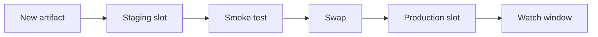

## Table of Contents

1. [The Problem](#the-problem)
2. [Candidate Version](#candidate-version)
3. [App Service Slots](#app-service-slots)
4. [Slot Settings](#slot-settings)
5. [Container Apps Revisions](#container-apps-revisions)
6. [Traffic Splitting](#traffic-splitting)
7. [Direct Testing](#direct-testing)
8. [Rollback Shape](#rollback-shape)
9. [Putting It All Together](#putting-it-all-together)
10. [What's Next](#whats-next)

## The Problem

The previous article described a release as more than a deploy. Now the team wants a safer rollout for `devpolaris-orders-api`.

The risky question is simple: where can the new version run before every production user depends on it?

If the first real test is "send all production traffic to the new version," the blast radius is large. A missing app setting, broken dependency call, slow startup, or bad checkout path can affect everyone at once. Azure gives different rollout handles depending on runtime. App Service uses deployment slots. Container Apps uses revisions. They are different features that answer the same release question: how do we run, test, and route a candidate version deliberately?

## Candidate Version

A candidate version is the version that may become production. It has passed earlier checks and still needs runtime evidence before trust.

For the orders API, the candidate might be:

```text
image: acrdevpolaris.azurecr.io/orders-api@sha256:...
change: new receipt upload path
expected runtime: Container Apps
candidate revision: orders-api--v31
initial traffic: 0 percent
rollback target: orders-api--v30
```

The important word is candidate. The team should be able to test it without pretending the release is done. A candidate needs the right artifact, configuration, secret access, health path, and dependency reachability before it receives broad traffic.

The Azure tool changes by runtime:

| Runtime | Candidate surface | Traffic movement |
| --- | --- | --- |
| App Service | Deployment slot | Swap slots or route traffic by slot behavior. |
| Container Apps | Revision | Assign traffic percentages to revisions. |

Those surfaces are release tools, not decorations. They give the team a controlled place between "built" and "fully serving production."

## App Service Slots

An App Service deployment slot is a live app with its own hostname. It belongs to the same App Service app, but it can run a different version. Common slot names are `staging`, `blue`, or `green`.

The beginner mental model is a theater stage. Production is the stage users see. A staging slot is a second stage where the same app can warm up, receive settings, and answer tests. A swap changes which slot is serving production traffic.



Slots help because they separate deployment from production exposure. The team can deploy the candidate to `staging`, test the direct slot URL, verify settings and health, then swap. If the swapped version is bad and the previous slot remains available, the rollback path is often another swap.

Slots are not free of risk. A staging slot is still an app. It can call real databases if configured that way. It can use different settings from production. It can accidentally send emails, process jobs, or write to shared storage if the team does not design its behavior. Test the slot as a candidate production path, not as a harmless copy.

## Slot Settings

Slot settings are the part of App Service slots that prevents a very common mistake. Some settings should move with the app version during a swap. Other settings should stay attached to the slot.

For example, the staging slot might use a staging-only flag or direct test endpoint. Production might use a production storage account. During a swap, you do not want every environment-specific value to travel accidentally with the code.

| Setting | Move with code? | Why |
| --- | --- | --- |
| `APP_VERSION` | Usually yes | The candidate version should become production. |
| `RECEIPTS_STORAGE_ACCOUNT` | Usually no | Production should keep production storage unless intentionally changed. |
| Key Vault reference for production secret | Usually no | Secret boundary should remain environment-specific. |
| Feature flag for candidate testing | Depends | The release record should say whether it is part of the change. |

The gotcha is that a slot swap can be technically successful while configuration behavior surprises the team. Before swapping, know which settings are sticky to the slot and which settings travel with the candidate.

## Container Apps Revisions

Azure Container Apps uses revisions to represent versions of an app. A revision is created when revision-scope properties change, such as the container image or certain runtime template settings. Revisions let Container Apps keep more than one version around, depending on revision mode and app configuration.

For a beginner, read a revision as a named version of the running container app. It includes the image and revision-scope runtime shape that Azure uses for that version.

For the orders API:

```text
current revision: orders-api--v30
candidate revision: orders-api--v31
candidate image: acrdevpolaris.azurecr.io/orders-api@sha256:...
initial traffic: 0 percent
```

This helps the team separate deploy from exposure. A new revision can exist before it receives all production traffic. The team can inspect revision status, test it, assign a small traffic percentage, then increase or remove traffic based on evidence.

The gotcha is configuration scope. Some Container Apps changes create a new revision. Other app-level changes apply to the app without creating a new revision. That distinction affects rollback. Rolling traffic back to an older revision may not undo every app-level configuration change.

## Traffic Splitting

Traffic splitting sends percentages of traffic to different versions. In Container Apps, a team can split ingress traffic between revisions. That makes canary-style rollouts possible: 0 percent, then 10 percent, then 50 percent, then 100 percent if evidence is healthy.

Traffic splitting reduces blast radius compared with moving everything at once, while ten percent of traffic can still include important customers. A bug may only appear for a specific account, region, feature flag, or data shape.

| Traffic state | What the team learns |
| --- | --- |
| 0 percent | Candidate can be deployed and inspected without normal user traffic. |
| Small percent | Candidate handles real traffic with limited exposure. |
| 50 percent | Candidate is under meaningful load while old version still serves. |
| 100 percent | Candidate is production path; old version may remain rollback target. |

The release record should capture the traffic state. "Deployed v31" is weaker than "v31 receives 10 percent traffic; v30 remains rollback target."

## Direct Testing

Direct testing means reaching the candidate without moving broad traffic. App Service slots have their own hostnames. Container Apps can support revision labels and direct access patterns depending on configuration. The exact feature details vary, but the operating idea is stable: test the candidate path before users rely on it.

Direct tests should check more than "does the page load?" For the orders API, useful smoke tests include:

| Test | What it proves |
| --- | --- |
| Health endpoint | The app starts and can answer a known route. |
| Checkout smoke path | The main business path can complete with test data. |
| Dependency call | SQL, storage, and payment dependencies are reachable. |
| Telemetry check | Logs, traces, and metrics appear for the candidate. |

Direct tests can still miss real production conditions. They are a gate, not a guarantee. They give the team enough confidence to move limited traffic and watch real evidence.

## Rollback Shape

Rollback shape depends on the rollout tool.

For App Service slots, rollback often means swapping back to the previous slot or restoring a previous package and settings. For Container Apps, rollback often means shifting traffic back to the previous revision. Those are different operations with different edges.

| Runtime | Common rollback shape | Watch for |
| --- | --- | --- |
| App Service slots | Swap back to previous slot | Slot settings, warmed state, shared dependencies. |
| Container Apps revisions | Route traffic back to old revision | App-level settings that revision rollback does not undo. |
| Config change | Restore previous setting or secret reference | Runtime restart, identity, and cache behavior. |

The safest rollback is planned before the release. During an incident, the team should not have to discover which old version still exists, whether it can receive traffic, or which setting changed with the release.

## Putting It All Together

Return to the new checkout version.

- The candidate version needed a place to run before full production traffic.
- App Service slots gave the team a live candidate app and a swap path.
- Slot settings decided which values stayed attached to staging or production.
- Container Apps revisions gave the team named versions and traffic percentages.
- Traffic splitting reduced blast radius but still needed real evidence.
- Direct testing proved the candidate path before broad traffic.
- Rollback shape depended on whether the runtime used slots, revisions, or configuration changes.

Safe rollout tools do not remove release risk. They make the risk visible and controllable.

## What's Next

The next article focuses on configuration and secrets. A rollout can be careful and still fail if the candidate receives the wrong setting, references the wrong secret, or uses an identity that cannot read Key Vault.

---

**References**

- [Set up staging environments in Azure App Service](https://learn.microsoft.com/en-us/azure/app-service/deploy-staging-slots)
- [Revisions in Azure Container Apps](https://learn.microsoft.com/en-us/azure/container-apps/revisions)
- [Application lifecycle management in Azure Container Apps](https://learn.microsoft.com/en-us/azure/container-apps/application-lifecycle-management)
- [Traffic splitting in Azure Container Apps](https://learn.microsoft.com/en-us/azure/container-apps/traffic-splitting)
