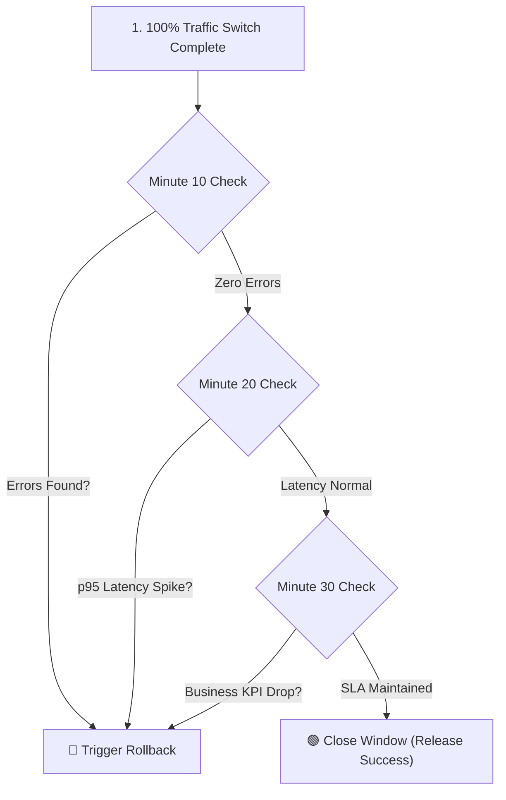
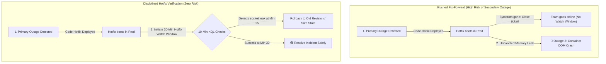

## Table of Contents

1. [The Problem](#the-problem)
2. [Watch Window](#watch-window)
3. [Health Checks](#health-checks)
4. [Smoke Tests](#smoke-tests)
5. [Real Traffic](#real-traffic)
6. [Alerts](#alerts)
7. [Rollback](#rollback)
8. [Fix Forward](#fix-forward)
9. [Release Record](#release-record)
10. [Putting It All Together](#putting-it-all-together)

## The Problem

The new checkout version is running. Configuration looks right. Traffic moved from the old path to the candidate path.

The release is still not done.

Some failures only appear after real traffic arrives. A health endpoint can pass while checkout fails for returning customers. A smoke test can pass while Blob Storage uploads fail under real volume. A small traffic split can look safe for ten minutes, then fail when a scheduled worker starts. A rollback can restore user traffic but leave a bad setting behind.

Verification is the habit of checking evidence after release. Rollback decision-making is the habit of deciding what to do when that evidence is bad.

## Watch Window

A watch window is the period after traffic moves when the team actively checks whether the release is healthy. It is not passive hope. It is a named slice of time with signals, owners, and decision points.


*A release needs a watch window long enough for real signals to appear before the team calls it healthy.*

For `devpolaris-orders-api`, a watch window might be:

```text
Duration: 30 minutes after traffic reaches 100 percent
Owner: platform-api on-call
Primary path: POST /checkout
Signals: failure rate, p95 duration, dependency failures, exceptions, alerts
Rollback target: previous slot or revision
Decision time: every 10 minutes until window closes
```

The length depends on the system. A low-traffic admin app may need a longer observation period. A high-traffic checkout API may produce enough evidence quickly. The watch window should match how fast bad evidence becomes visible.

:::expand[Pattern: Structured Watch Window Decision Loop]{kind="pattern"}
A high-signal watch window is not just a passive waiting period; it is a structured, time-boxed execution sequence. Rather than letting engineers loosely stare at a dashboard for 30 minutes, deploy a **Structured Watch Window Decision Loop** that partitions the observation window into three distinct 10-minute audit checkpoints, each cabled to explicit exit criteria and KQL validations.

The operational checkpoint sequence is highly structured:

1.  **Minute 10 (Syntax & Socket Check)**: Verify that the newly swapped compute or active Container Apps revision is successfully starting, acquiring Entra tokens, and opening database connections. Run a quick query to count initial error rates:
    ```text
    AppRequests
    | where TimeGenerated > ago(10m)
    | summarize Success = countif(Success == true), Fail = countif(Success == false) by Name
    ```
2.  **Minute 20 (Latency & Dependency Check)**: Analyze p95 response latencies and downstream PaaS dependencies. Check the Application Map inside Application Insights to verify that database query times or storage write latencies have not degraded compared to the 24-hour baseline.
3.  **Minute 30 (Socio-Technical Business Check)**: Verify business-level indicators (such as checkout transaction success rates) against standard baseline trends. If all three checkpoints pass without throwing alerts or sustained HTTP 5xx errors, the watch window closes, and the release is marked fully complete.

This structured verification sequence is identical to AWS operations. When deploying ECS services or Lambda functions, teams use a watch window to run a sequence of CloudWatch Log Insights queries, checking p90 ALB latency, SQS message age, and KMS decrypt exceptions before closing the deployment window and tearing down old environments.

The top-down diagram below maps this structured verification sequence:



**Rule of thumb:** Never close a watch window early because "things look fine." Define the observation length per service, risk, and traffic pattern, then use pre-planned checkpoints so deployment decisions are guided by structured data instead of optimism.
:::

## Health Checks

A health check is a known endpoint or probe that asks whether the app can serve. App Service has a health check feature that can ping a path in the app and use the result to judge instance health. Other runtimes have their own health or readiness patterns.

Health checks are useful because they are simple and continuous. They can catch apps that fail to start, cannot answer a route, or become unhealthy on a node.

They are also easy to overtrust. A health endpoint can say "OK" while checkout is broken if the endpoint only checks that the process is alive. A better health check proves the app can perform the minimum safe work for its role without causing side effects.

| Health path | What it proves | What it misses |
| --- | --- | --- |
| `/healthz` returns 200 | Process and route are alive. | Business dependencies may still fail. |
| `/readyz` checks SQL connection | App can reach SQL. | Blob Storage, payments, and user data edge cases. |
| Full checkout smoke test | Main flow works with test data. | Rare accounts, load, and long-running jobs. |

Health checks are a gate. They are not the whole release decision.

## Smoke Tests

A smoke test is a small, deliberate check of the user path after deployment. It should be safe to run, easy to understand, and tied to the service promise.

For the orders API, a smoke test might create a test cart, call checkout with a test payment mode, write a test order record, and upload a test receipt to a non-customer location. The exact test depends on the app, but the shape is stable: prove the path users care about.

Good smoke tests have three properties:

| Property | Why it matters |
| --- | --- |
| Safe data | The test does not create real customer harm. |
| Dependency coverage | The test touches the dependencies most likely to break the release. |
| Clear result | A responder can tell success from failure quickly. |

Do not make every smoke test a full end-to-end saga. A slow, flaky, destructive smoke test will be skipped. A good smoke test is small enough to run every release and meaningful enough to catch the common broken paths.

## Real Traffic

Real traffic is the evidence that no pre-release test can fully replace. Real users bring real data shapes, concurrency, geographic paths, authentication state, browser behavior, and dependency timing.

After traffic moves, the team should watch signals from the observability module:

| Signal | Release question |
| --- | --- |
| Request count | Did traffic reach the expected version? |
| Failure rate | Are users failing more often than baseline? |
| p95 or p99 duration | Did the release make users slower? |
| Dependency failures | Which downstream call is failing? |
| Exceptions | What code-level errors appeared? |
| Logs and traces | Which operation, identity, or resource explains the failure? |

Baseline matters. A checkout failure rate of 2 percent might be normal for one system and alarming for another. A release decision should compare against the service's usual behavior, not a universal number from a slide.

## Alerts

Alerts help the team notice when a signal crosses a condition. During a release, alerts should support the watch window, not replace it.

A useful release alert is tied to user impact and action:

```text
Alert: checkout-failure-rate-high
Condition: failed POST /checkout requests above baseline for 10 minutes
Action: notify orders-api on-call
First check: Application Insights failures, dependency failures, release record
```

The alert is not the decision. It is a prompt to inspect evidence. Some alerts fire during expected traffic movement. Some are real regressions. The release owner needs enough context to classify the alert.

If an alert fires every release and nobody acts on it, the alert is teaching the team to ignore it. Fix the signal, threshold, routing, or runbook.

## Rollback

Rollback returns users to a known working path. In this module, rollback may mean swapping App Service slots, routing Container Apps traffic back to an older revision, restoring configuration, or disabling a feature flag.


*Rollback is usually fastest when the previous version is safe, while fix-forward fits cases where reverting is riskier.*

Rollback is usually the right move when the new release causes clear user harm and the team has a known working target. But rollback can be risky too. It may not reverse database schema changes, external side effects, cache state, or app-level configuration that changed outside the revision.

Use a decision table, not vibes:

| Evidence | Likely decision |
| --- | --- |
| Failure rate rising, old version healthy, rollback target known | Roll back quickly. |
| Small bug, no user impact, fix ready and low risk | Fix forward may be better. |
| Data migration already changed irreversible state | Rollback needs data-specific plan. |
| Config-only mistake with known previous value | Restore config and verify. |
| Alert fired but real traffic is healthy | Investigate alert noise before changing users. |

The fastest path is not always safest. The safest path is the one with evidence, a known target, and a way to prove recovery.

## Fix Forward

Fix forward means keeping the release path and applying a small corrective change. It is not an excuse to improvise in production. It is a judgment that the safest recovery is a narrow new fix rather than returning to the old state.

Fix forward can be reasonable when:

| Situation | Why fix forward may fit |
| --- | --- |
| The issue is small and clearly understood | A narrow patch is less disruptive than rollback. |
| Rollback would break newer data or schema state | Returning code alone would create more risk. |
| The old version has the same or worse bug | Rollback does not restore a better path. |
| The fix is already tested and low blast radius | Recovery can be verified quickly. |

Fix forward needs the same discipline as rollback: owner, change, evidence, and recovery path. A rushed fix-forward without a watch window is just another risky release.

:::expand[Pitfall: Fix Forward Without a Watch Window]{kind="pitfall"}
A dangerous operational trap during active production incidents is "fixing forward" without enforcing a subsequent, disciplined watch window. Under the high stress of an outage, engineers often isolate a bug, write a quick hotfix code patch, bypass staging validation, push it straight to production, and immediately close the incident ticket because the primary symptom disappears.

By skipping the 30-minute watch window for the hotfix, the team is completely blind to cascading secondary failures. For example, your hotfix might resolve an SQL database lock, but the rushed code changes might introduce a memory leak or an unhandled socket exception. Because the team assumed the emergency was over and went offline, the secondary leak goes unnoticed until the containers crash 15 minutes later, triggering a second, more severe outage.

This exact failure pattern occurs in AWS environments. A team might push a quick inline hotfix to an ECS task or Lambda function to resolve an RDS deadlock, but skip the standard CloudWatch Alarm verification lookback periods. As a result, they miss a secondary SQS queue backup caused by unhandled thread timeouts in the new code, leading to cascading downstream failures.

The top-down diagram below compares a rushed, unverified fix-forward with a disciplined hotfix verification loop:



**Rule of thumb:** Every hotfix is a release. Never close an incident ticket immediately after applying a corrective fix. Enforce the exact same 30-minute watch window and KQL check loops for your fix-forward deployments as you do for standard features, ensuring that the cure does not introduce a secondary disease.
:::

## Release Record

A release record is the small written memory of the release. It does not need to be a novel. It needs enough detail for a teammate to understand what changed, what evidence was checked, and what to do next.

A useful release record for the orders API might include:

```text
Service: devpolaris-orders-api
Artifact: acrdevpolaris.azurecr.io/orders-api@sha256:...
Runtime: Container App ca-devpolaris-orders-prod
Candidate: revision orders-api--v31
Previous: revision orders-api--v30
Config changes: CHECKOUT_PAYMENTS_ENABLED=true
Traffic: v31 from 10 percent to 100 percent
Watch window: 30 minutes
Signals: checkout failure rate, p95 duration, dependency failures
Decision: keep release after baseline holds
Rollback target: route 100 percent to orders-api--v30 and restore feature flag if needed
```

The release record prevents the worst incident sentence: "I think we changed something around there." It turns release memory into evidence.

## Putting It All Together

Return to the production checkout release.

- The watch window made the period after traffic movement explicit.
- Health checks proved the app could answer a known path, but not every user path.
- Smoke tests proved the main workflow with safe test data.
- Real traffic showed whether actual users were healthy.
- Alerts helped surface important changes, but the team still interpreted the evidence.
- Rollback returned users to a known working path when harm was clear.
- Fix forward stayed available when a narrow correction was safer.
- The release record preserved artifact, runtime, configuration, traffic, signals, and rollback target.

This closes the deployment and runtime operations module. A safe Azure release is not one command. It is a controlled movement of version, configuration, traffic, and evidence, with a recovery path already named.


*Use this as the rollback decision loop: watch a release with real evidence, choose rollback or fix-forward based on customer impact and confidence, and record the decision while the context is fresh.*


---

**References**

- [Set up staging environments in Azure App Service](https://learn.microsoft.com/en-us/azure/app-service/deploy-staging-slots)
- [Health check in Azure App Service](https://learn.microsoft.com/en-us/azure/app-service/monitor-instances-health-check)
- [Traffic splitting in Azure Container Apps](https://learn.microsoft.com/en-us/azure/container-apps/traffic-splitting)
- [Azure Monitor alerts overview](https://learn.microsoft.com/en-us/azure/azure-monitor/alerts/alerts-overview)
- [Application Insights overview](https://learn.microsoft.com/en-us/azure/azure-monitor/app/app-insights-overview)
