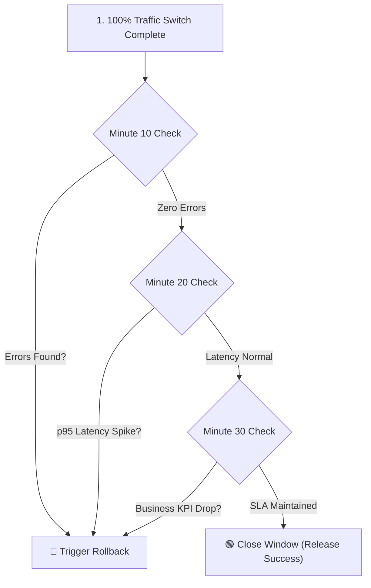
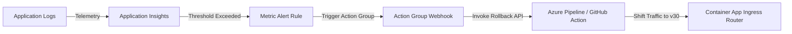

## Table of Contents

1. [The Problem](#the-problem)
2. [Watch Window](#watch-window)
3. [Health Checks and Probes](#health-checks-and-probes)
4. [Smoke Tests](#smoke-tests)
5. [Real Traffic Telemetry](#real-traffic-telemetry)
6. [Metric Alerts and Automated Rollbacks](#metric-alerts-and-automated-rollbacks)
7. [Application Insights Alerts Bicep](#application-insights-alerts-bicep)
8. [Rollback Decision Framework](#rollback-decision-framework)
9. [Fix Forward Boundaries](#fix-forward-boundaries)
10. [Release Records](#release-records)
11. [Putting It All Together](#putting-it-all-together)
12. [What's Next](#whats-next)

## The Problem

Verification and rollback are the post-traffic-shift controls that decide whether a release stays live, rolls back, or receives a targeted fix.

A release process is not complete when traffic has successfully shifted to the candidate version.
Although the configuration settings appear correct and initial smoke tests pass, runtime errors can still appear under real production conditions.
Some software bugs become visible only when exposed to concurrent user traffic, complex data shapes, or downstream network delays.

A database deadlock may occur only when multiple users checkout simultaneously.
A storage upload timeout may become apparent only when file volumes increase.
An identity permission failure may remain hidden until a specific runtime worker executes a scheduled task.
To address these risks, the release lifecycle must include a structured verification phase and a clear rollback decision path based on real telemetry evidence.

## Watch Window

A watch window is a time-boxed telemetry review period immediately after a traffic shift.
During this window, the engineering team closely monitors system signals to verify that the deployment candidate is healthy and stable.
A watch window must have a defined duration, specific owners, and explicit exit criteria.

For a production release of the orders API, the watch window properties are defined in the release catalog:

```plain
Duration: 30 minutes after traffic reaches 100 percent
Owner: platform-api on-call engineer
Primary paths audited: POST /checkout, GET /orders
Key signals: failed requests count, p95 latency, dependency failure rate
Rollback target: stable revision (orders-api--v30)
```

The duration of the watch window depends on the application's transaction volume.
A high-volume API can generate sufficient error and performance metrics within a short lookback window.
A low-volume background worker requires a longer watch window to ensure that delayed or asynchronous workflows complete successfully.

:::expand[Pattern: Structured Watch Window Decision Loop]{kind="pattern"}
A high-signal watch window is not just a passive waiting period; it is a structured, time-boxed execution sequence.
Rather than letting engineers loosely stare at a dashboard for 30 minutes, deploy a **Structured Watch Window Decision Loop** that partitions the observation window into three distinct 10-minute audit checkpoints, each tied to explicit exit criteria and KQL validations.

The operational checkpoint sequence is highly structured:

1. **Minute 10 (Syntax & Socket Check)**: Verify that the newly swapped compute or active Container Apps revision is successfully starting, acquiring Entra tokens, and opening database connections. Run a quick query to count initial error rates:
   ```plain
   AppRequests
   | where TimeGenerated > ago(10m)
   | summarize Success = countif(Success == true), Fail = countif(Success == false) by Name
   ```
2. **Minute 20 (Latency & Dependency Check)**: Analyze p95 response latencies and downstream PaaS dependencies. Check the Application Map inside Application Insights to verify that database query times or storage write latencies have not degraded compared to the 24-hour baseline.
3. **Minute 30 (Socio-Technical Business Check)**: Verify business-level indicators (such as checkout transaction success rates) against standard baseline trends. If all three checkpoints pass without throwing alerts or sustained HTTP 5xx errors, the watch window closes, and the release is marked fully complete.

This structured verification sequence is identical to AWS operations.
When deploying ECS services or Lambda functions, teams use a watch window to run a sequence of CloudWatch Log Insights queries, checking p90 ALB latency, SQS message age, and KMS decrypt exceptions before closing the deployment window and tearing down old environments.

The diagram below maps this structured verification sequence:



Never close a watch window early because "things look fine."
Define the observation length per service, risk, and traffic pattern, then use pre-planned checkpoints so deployment decisions are guided by structured data instead of optimism.
:::

## Health Checks and Probes

A health check is an automated query the hosting platform uses to decide whether an instance should receive traffic.
Azure App Service and Container Apps use active probes to monitor whether an application instance is capable of receiving traffic.

Example: `/healthz` can prove the process is alive, while `/readyz` can prove the app can open a database socket and read the required Key Vault reference.

Probes are categorized by their operational purpose:
- **Liveness Probe**: Monitors whether the container process is active. If the liveness probe fails, the platform kills the container and initiates a cold restart.
- **Readiness Probe**: Monitors whether the container is ready to accept requests. If the readiness probe fails, the platform removes the container from the load balancer routing pool.
- **Startup Probe**: Monitors whether slow-booting applications have completed initialization. This probe suspends liveness and readiness audits until the container is ready.

Probes must query endpoints that prove application health without generating performance overhead.
A readiness probe should check database socket reachability and secret resolution state.
However, it must not execute heavy SQL writes or complex algorithms that degrade performance under high-frequency polling.

## Smoke Tests

A smoke test is a controlled production-path transaction that proves the release can complete its most important workflow.
It validates that configuration paths, database schemas, and external integrations operate together correctly.

An effective smoke test requires three primary characteristics:
1. **Data Isolation**: The test uses dedicated test credentials and mock identifiers to prevent data pollution in production reports.
2. **Key Boundary Coverage**: The test exercises the pathways most likely to fail, such as token generation, write operations, and storage uploads.
3. **Deterministic Output**: The test results in a clear pass or fail status that can be audited automatically by the pipeline.

For the orders API, a smoke test creates a test cart, applies a mock payment, writes a trial order, and uploads a sample receipt.
If any step returns an error, the deployment pipeline blocks the release, preserving the stable version.

## Real Traffic Telemetry

Real traffic telemetry is the evidence emitted by actual users and production dependencies after the candidate receives traffic.
Once public traffic is routed to the candidate version, the team must analyze observability metrics.

Key telemetry signals retrieved from Application Insights and Log Analytics include:

| Telemetry Signal | Metric Definition | Analysis Focus |
| --- | --- | --- |
| HTTP 5xx Count | Number of server-side error responses | Absolute count spikes indicate code-level exceptions. |
| p95 Latency | Time within which 95 percent of requests complete | Spikes indicate database index issues or thread lockups. |
| Dependency Failures | Failed SQL, storage, or external API calls | Highlights permission issues or network routing errors. |
| Exception Tracking | Unhandled application runtime errors | Identifies code bugs that bypassed local integration tests. |

Comparing telemetry against a historical baseline is critical.
An application that normally operates with a one percent error rate during peak hours should not trigger a rollback unless the error rate rises significantly above that threshold.

## Metric Alerts and Automated Rollbacks

Metric alerts are scheduled telemetry evaluators that compare a signal against a threshold and route the result to an action group.
They automatically notify engineering teams when telemetry signals exceed defined thresholds.

Example: an alert can watch `Failed requests > 20` for the candidate revision during a 10-minute window, then call a rollback webhook if the threshold is breached.

In advanced pipelines, these alerts are wired directly to deployment webhooks to trigger automated rollbacks.

Azure Monitor allows you to configure metric alerts that target request failures, database latency, and CPU saturation.
These alerts are linked to Action Groups.
The Action Groups can invoke Azure Pipelines or GitHub Actions webhooks to automatically shift traffic back to the stable revision when an alert fires.



Automating this sequence minimizes service interruption.
If the candidate version encounters severe latency spikes, the platform detects the issue, triggers the alert, and executes the rollback before public users experience sustained downtime.

## Application Insights Alerts Bicep

This Bicep declaration models the rollback alert path as infrastructure: telemetry source, action group receiver, and threshold rule.
The Bicep template below provisions an Application Insights component, an Action Group with a webhook receiver, and a metric alert rule targeting failed requests.
This template configures the infrastructure needed to automate release rollbacks:

```bicep
param appInsightsName string = 'appi-devpolaris-prod'
param actionGroupName string = 'ag-devpolaris-rollback'
param location string = resourceGroup().location

resource appInsights 'Microsoft.Insights/components@2020-02-02' = {
  name: appInsightsName
  location: location
  kind: 'web'
  properties: {
    Application_Type: 'web'
    WorkspaceResourceId: '/subscriptions/${subscription().subscriptionId}/resourceGroups/${resourceGroup().name}/providers/Microsoft.OperationalInsights/workspaces/log-devpolaris-prod'
  }
}

resource actionGroup 'Microsoft.Insights/actionGroups@2023-01-01' = {
  name: actionGroupName
  location: 'global'
  properties: {
    groupShortName: 'RollbackAG'
    enabled: true
    webhookReceivers: [
      {
        name: 'trigger-pipeline'
        serviceUri: 'https://dev.azure.com/devpolaris/_apis/public/pipelines/12/runs?api-version=7.0-preview.1'
        useCommonAlertSchema: true
      }
    ]
  }
}

resource alertRule 'Microsoft.Insights/metricAlerts@2018-03-01' = {
  name: 'alert-devpolaris-high-failures'
  location: 'global'
  properties: {
    severity: 1
    enabled: true
    scopes: [
      appInsights.id
    ]
    evaluationFrequency: 'PT1M'
    windowSize: 'PT5M'
    criteria: {
      'odata.type': 'Microsoft.Azure.Monitor.SingleResourceMultipleMetricCriteria'
      allOf: [
        {
          name: 'failed-requests-count'
          metricName: 'requests/failed'
          operator: 'GreaterThan'
          threshold: 10
          timeAggregation: 'Count'
          criterionType: 'StaticThresholdCriterion'
        }
      ]
    }
    actions: [
      {
        actionGroupId: actionGroup.id
      }
    ]
  }
}
```

This configuration establishes a closed monitoring loop.
If the application generates more than ten failed requests within a five-minute evaluation window, the alert calls the webhook to trigger a rollback.

## Rollback Decision Framework

A rollback decision framework is the predefined rule set for choosing rollback, fix-forward, or targeted repair.
A rollback decision must be guided by structured data rather than emotional reaction.
A team should define a clear framework that balances user impact, recovery time, and data risks.

The table below provides a decision matrix to guide rollback actions:

| Incident Signal | Data and Code Risk Assessment | Target Operational Action |
| --- | --- | --- |
| Sustained HTTP 5xx errors; high user impact | The candidate is broken; database schemas have not changed. | Roll back immediately. Revert traffic to the old revision. |
| Minor UI bug; zero transaction impact | The bug is isolated; code patch is low risk and fast. | Fix forward. Deploy a hotfix through the standard pipeline. |
| Database schema migrated; code rollback breaks schema | Rolling back code creates database mismatch and data loss. | Perform data-specific rollback or execute emergency schema patch. |
| Key Vault reference failed | Platform-level authentication block or network firewall issue. | Correct the permission scope or VNet route; restart the app. |

Before executing a rollback, verify that the previous stable version remains available.
Overwriting the staging slot or deleting the previous revision eliminates the immediate rollback path, forcing the team to compile and redeploy a previous build.

## Fix Forward Boundaries

Fixing forward is the recovery choice where the team deploys a corrective patch instead of returning traffic to the previous version.
This approach is suitable when the bug is small, easily resolved, and has low user impact.

Example: a typo in a non-critical CSS class can be fixed forward, while a release that corrupts order writes should usually roll back or trigger a data-specific repair plan first.

However, emergency hotfixes carry significant operational risk:
- Rushed code changes often bypass standard integration and quality testing.
- Pushing a hotfix directly to production can introduce secondary, unforeseen failures.
- The stress of resolving an outage can lead to configuration typos or credential leaks.

:::expand[Pitfall: Fix Forward Without a Watch Window]{kind="pitfall"}
A dangerous operational trap during active production incidents is "fixing forward" without enforcing a subsequent, disciplined watch window.
Under the high stress of an outage, engineers often isolate a bug, write a quick hotfix code patch, bypass staging validation, push it straight to production, and immediately close the incident ticket because the primary symptom disappears.

By skipping the 30-minute watch window for the hotfix, the team lacks visibility into cascading secondary failures.
For example, your hotfix might resolve an SQL database lock, but the rushed code changes might introduce a memory leak or an unhandled socket exception.
Because the team assumed the emergency was over and went offline, the secondary leak goes unnoticed until the containers crash 15 minutes later, triggering a second, more severe outage.

This exact failure pattern occurs in AWS environments.
A team might push a quick inline hotfix to an ECS task or Lambda function to resolve an RDS deadlock, but skip the standard CloudWatch Alarm verification lookback periods.
As a result, they miss a secondary SQS queue backup caused by unhandled thread timeouts in the new code, leading to cascading downstream failures.

The diagram below compares a rushed, unverified fix-forward with a disciplined hotfix verification loop:


Every hotfix is a release.
Never close an incident ticket immediately after applying a corrective fix.
Enforce the exact same 30-minute watch window and KQL check loops for your fix-forward deployments as you do for standard features, ensuring that the corrective patch does not introduce a secondary failure.
:::

## Release Records

A release record is the audit log for the artifact, configuration, telemetry evidence, and rollback target used in one release. It is the written history of a deployment.

Example: the record for `orders-api--v31` should include the image digest, slot or revision name, changed settings, smoke test output, watch window queries, and rollback target `orders-api--v30`.

It captures the metadata, changes, and verification evidence needed to audit environment changes.

A standard release record includes:
- The compiled container image SHA256 digest or code package version.
- The exact configuration parameters and secret references modified.
- Telemetry logs proving that readiness probes and smoke tests passed.
- The watch window observations, KQL query outputs, and alert histories.
- The rollback plan details, including target revision names and verified restore commands.

Keeping detailed release records ensures that if an issue is discovered hours or days after deployment, the team can quickly audit what was changed, who authorized the release, and how the environment was configured.

## Putting It All Together

A safe, production-grade release is not finished when the code is deployed.
- The watch window provides a dedicated observation period, audited through structured KQL queries.
- Health checks and readiness probes continuously monitor application and dependency reachability.
- Smoke tests validate core pathways with isolated, non-destructive data.
- Telemetry analysis compares performance metrics against historical baselines.
- Metric alert rules in Azure Monitor detect request failures and invoke Action Groups.
- Action Group webhooks trigger automated rollback pipelines, reducing recovery times.
- Bicep templates declare the alert rules, action groups, and pipeline connections as code.
- Rollback frameworks balance user impact and database schema risks.
- Fix-forward actions require the same watch window discipline as standard feature deployments.
- Release records capture the history, telemetry, and changes to ensure environment auditability.

By establishing a thorough post-deployment verification loop, engineering teams protect the production environment and ensure that system changes are validated through hard telemetry data.

## What's Next

This article completes the deployment and runtime operations module.
The next module covers observability, detailing how to query logs using Kusto Query Language (KQL), construct robust monitoring dashboards, and trace requests across microservice boundaries.

---

**References**

- [Set up staging environments in Azure App Service](https://learn.microsoft.com/en-us/azure/app-service/deploy-staging-slots) - Guide to configuring deployment slots and managing swaps.
- [Health check in Azure App Service](https://learn.microsoft.com/en-us/azure/app-service/monitor-instances-health-check) - Documentation on setting up automated instance health checking.
- [Traffic splitting in Azure Container Apps](https://learn.microsoft.com/en-us/azure/container-apps/traffic-splitting) - Explanation of revision traffic weights and routing rules.
- [Azure Monitor alerts overview](https://learn.microsoft.com/en-us/azure/azure-monitor/alerts/alerts-overview) - Guide to creating and managing telemetry-based alerts.
- [Application Insights overview](https://learn.microsoft.com/en-us/azure/azure-monitor/app/app-insights-overview) - Documentation on tracking requests, dependencies, and exceptions.
