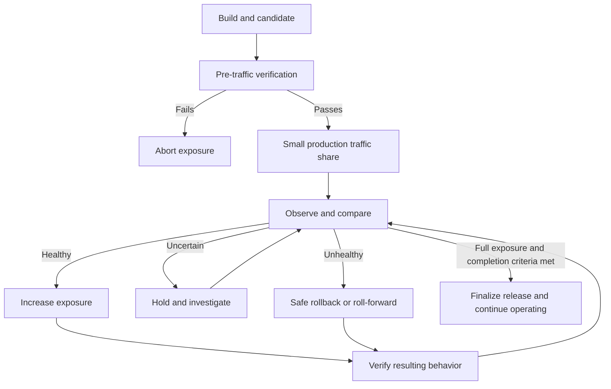

## Table of Contents

1. [When Does a Release End?](#when-does-a-release-end)
2. [How Does a Watch Window Verify the New Version?](#how-does-a-watch-window-verify-the-new-version)
3. [What Layers of Evidence Should You Check?](#what-layers-of-evidence-should-you-check)
4. [How Do Health Checks and Smoke Tests Differ?](#how-do-health-checks-and-smoke-tests-differ)
5. [What Does Real Traffic Telemetry Reveal?](#what-does-real-traffic-telemetry-reveal)
6. [When Should You Roll Back?](#when-should-you-roll-back)
7. [How Do Azure Services Perform Rollback and Runtime Recovery?](#how-do-azure-services-perform-rollback-and-runtime-recovery)
8. [What Should the Final Release Record Prove?](#what-should-the-final-release-record-prove)
9. [Check Your Answers](#check-your-answers)
10. [References](#references)

Azure reports that checkout v18 deployed successfully. The container exists, the image downloaded, and the process started. Customers nevertheless keep seeing failed payments. Both observations can be true: the deployment system put the new version on the runtime, but that does not establish that customers can buy anything.

The release needs another kind of evidence. After a small amount of traffic reaches v18, compare its behavior with the working v17, check the customer operation, and decide whether to increase exposure, wait, or reverse the change. Whatever action follows needs another check of the resulting service.

These questions follow that process through release verification and the continuing work of running production:

1. **When Does a Release End?**
2. **How Does a Watch Window Verify the New Version?**
3. **What Layers of Evidence Should You Check?**
4. **How Do Health Checks and Smoke Tests Differ?**
5. **What Does Real Traffic Telemetry Reveal?**
6. **When Should You Roll Back?**
7. **How Do Azure Services Perform Rollback and Runtime Recovery?**
8. **What Should the Final Release Record Prove?**

## When Does a Release End?
<!-- section-summary: Deployment completion proves a change was performed; a release needs evidence that the resulting service works under production conditions and remains stable. -->

A deployment system has a bounded responsibility. It can report that a container was created, an image was downloaded, and an application process started. Those results matter, but the system may never have attempted the customer transaction whose behavior the release changes.

There is a progression of increasingly useful evidence. Deployment success establishes that the change was performed. A running process establishes that code started. Readiness establishes that the runtime considers itself able to receive work. A responding endpoint, functioning dependencies, successful application behavior, successful customers, and healthy business outcomes each establish something further.

The progression explains why a green pipeline and failed payments do not contradict one another. The pipeline's success concerns its assigned operation. The release decision concerns the behavior of the system that operation produced.

The operating loop is therefore **change, expose, observe, compare with expectations, decide, and verify again**. Keeping a change and reversing it both lead back to verification. Production continues running after either decision, so neither branch removes the need to observe the result.

### Traffic introduces evidence that staging cannot supply

Initially, v17 may receive 100% of requests while v18 receives none. Moving to 95% on v17 and 5% on v18 exposes the candidate to real production work.

Before that move, the team may know that v18 starts, passes synthetic tests, and reaches its dependencies. It has less evidence about thousands of actual users, production load, obscure customer cases, normal latency, dependency pressure, or the effect on persistent business state.

A **candidate** is the new runtime being evaluated. The **control** is the established version used for comparison. Sending a limited share of production work to the candidate is a **canary rollout**. It lets the team learn about a change before every user depends on it.

At 1% exposure, the candidate receives some useful evidence while relatively few users face its possible failures. At 100%, evidence arrives much faster, but the potential impact covers the whole traffic population. This extent of possible harm is the release's **blast radius**.

Increasing traffic therefore increases both information and risk. A safe progression seeks enough evidence to justify each increase rather than expanding the affected population faster than confidence grows.

### Completion needs an explicit condition

Reaching 100% traffic does not have to mean the release is finished. A useful completion definition requires the candidate to receive all intended traffic, the post-release watch to finish, technical and business measurements to remain healthy, and no release-related alerts to remain active.

The rollback path must also be recorded and the release record finalized. These conditions keep responsibility clear during the period when the whole production population has only recently moved to the new version.

Some evidence arrives quickly, such as crashes or request failures. Other evidence needs more time, including conversion changes or delayed jobs. The next section explains how a watch window gives those signals an opportunity to appear.

## How Does a Watch Window Verify the New Version?
<!-- section-summary: A watch window gathers time, traffic, cohort, and baseline evidence sufficient for the next exposure decision rather than treating elapsed time alone as proof. -->

A **watch window** is a deliberate observation period after a change. It is an operating practice, not an Azure resource. The team watches the candidate, the old runtime, dependencies, and users before deciding whether to continue.

The purpose is to collect enough relevant evidence. Simply waiting for a timer to expire cannot establish that the important customer paths were exercised or that slower failures had time to develop.

### Require the conditions that reveal the risk

Suppose 10% of traffic moves at 12:00. At 12:00:05, no errors have appeared, but only 12 requests may have run. At 12:03, 8,000 requests with a normal error rate provide stronger evidence.

Even that larger sample may miss a bug affecting only payment provider ProviderB if that provider is mainly used during evening traffic. A high request count does not guarantee coverage of the affected user group.

Time also exposes problems that a short test cannot reveal. A memory leak could produce this pattern:

| Time | Memory use |
| --- | ---: |
| 12:00 | 30% |
| 12:15 | 35% |
| 12:30 | 46% |
| 13:00 | 79% |

A 30-second check would see only the beginning. The problem needs sustained operation before its trajectory is apparent.

These examples identify different requirements for a useful observation period: enough requests, sufficient elapsed time, relevant user cohorts, background-job execution, and dependency interactions. A **cohort** here is a subset of users or requests sharing a relevant characteristic, such as a payment provider or region.

There is consequently no universal window length. Five minutes may produce substantial evidence for a busy API and almost none for a payroll service whose important job runs once per hour. A batch processor may need to complete an entire production batch before its behavior can be judged.

For checkout, an example criterion could require at least 100,000 requests, five or more minutes of observation, and meaningful traffic from every major region. That explains more than an instruction to wait exactly ten minutes: it identifies both elapsed time and the work that must occur.

### Combine time with explicit gates

A **rollout gate** is a condition that must be satisfied before the next exposure step. It can combine several independent requirements.

For example, a gate might require all of the following:

- At least ten minutes of observation.
- At least 50,000 requests.
- An HTTP 5xx rate below 1%.
- P95 latency below 500 ms.
- Checkout success above 99%.
- No Sev0 or Sev1 alert during the relevant period.

These values are an illustrative policy, not Azure defaults. Their useful feature is the combination: waiting long enough does not excuse too little traffic, and enough traffic does not excuse failed customer transactions.

HTTP **5xx** responses indicate server-side failure responses. **P95** is a latency percentile: approximately 95% of measured durations fall at or below it. Severity labels identify the urgency defined by the team's incident policy. The gate needs those terms to have a shared operational meaning before the release begins.

Defining criteria beforehand also reduces improvisation. If an engineer reports 600 ms latency during a release, the team should not have to invent its tolerance on the spot. One possible policy defines success below 400 ms, a hold between 400 and 500 ms, and rollback above 500 ms for five minutes.

That policy answers what to do with an observed range while still allowing the team to investigate why it changed.

### Compare against a meaningful baseline

An observed P95 of 420 ms cannot be judged in isolation. If v17 normally takes 180 ms, it suggests a regression. If the established behavior is 500 ms, it suggests an improvement.

A **baseline** is the expected behavior used for comparison. It can come from the previous version, historical observations, a service-level objective, a known safe threshold, a control population, or a capacity model.

A **service-level objective**, or SLO, states a target for the service outcome the team intends to provide. A release gate can use such a target, but it can also look for smaller changes that would be concerning even before the wider service objective is violated.

A split rollout provides a particularly useful control. With v17 at 90% and v18 at 10%, both operate during roughly the same production conditions:

| Measurement | v17 | v18 |
| --- | ---: | ---: |
| HTTP 5xx | 0.3% | 2.8% |
| P95 latency | 240 ms | 610 ms |
| Checkout success | 99.7% | 96.4% |

The differences are more informative than asking only whether v18 stays below a one-second latency ceiling. The established runtime shows what the service can still achieve in the same period.

The comparison should support a decision, not an assumption of perfect experimental equivalence. The earlier cohort example still matters: examine the work each version actually received. Traffic volume, time, and relevant coverage make the control comparison more useful.

### Keep release gates distinct from ordinary alerts

An operational alert asks whether production has crossed a boundary requiring action. Release verification asks whether there is enough evidence to intentionally expose more users to this particular change.

Normal alerting might permit P95 below one second, while a release gate disallows a candidate regression greater than 10% relative to control. Those rules serve different purposes and can coexist.

The team can therefore combine automated boundaries with judgment for ambiguous cases. A possible stop policy triggers if 5xx exceeds 2% for five minutes, P95 exceeds 800 ms, checkout success falls below 98.5%, or a Sev1 alert fires.

This reduces dependence on someone staring at CPU, error, latency, queue, and payment graphs for two hours. Humans still interpret uncertain evidence, but the important boundaries have an explicit, repeatable definition.

The next question is what those measurements actually prove. Verification uses several layers because a passing result at one layer leaves other questions unanswered.

## What Layers of Evidence Should You Check?
<!-- section-summary: Verification moves from Azure control-plane state through runtime, dependencies, functionality, production behavior, business results, and sustained stability. -->

A useful verification ladder contains seven layers: control-plane execution, process and runtime state, dependency behavior, functional behavior, real production telemetry, business results, and sustained stability.

Each layer asks a different question. Lower layers are often straightforward to automate. Higher layers provide stronger evidence that the release serves its intended purpose.

| Layer | Question to establish |
| --- | --- |
| Control plane | Did Azure perform the requested change? |
| Runtime | Did the process start and complete initialization? |
| Dependencies | Can the application use the services it needs? |
| Functionality | Can important basic operations succeed? |
| Production telemetry | How does the candidate behave under actual traffic? |
| Business outcome | Can users complete the work that matters? |
| Sustained stability | Does acceptable behavior persist long enough to justify confidence? |

This is also a useful evidence pyramid. Runtime health supports dependency and functional checks, which support production and business verification. The upper layers do not make the lower ones irrelevant; they answer questions the lower checks were never designed to answer.

### Confirm the requested Azure change

The **control plane** is the management side of Azure: the operations that create or configure resources and change their routing. Examples of control-plane evidence include a completed deployment, created revision, completed slot swap, updated traffic weights, or accepted configuration.

Check this layer first. If the platform change failed, diagnosing the checkout algorithm is premature. The intended candidate or traffic arrangement may not exist.

Once the requested change is present, continue checking. An accepted traffic configuration describes the platform's state, not the success of a transaction sent through that configuration.

### Confirm the running process

Runtime checks establish whether the process started, its container is running, connections can be accepted, and initialization completed. A process can exist while it is still loading the state needed to serve requests.

Azure Container Apps uses startup and readiness probes in determining whether a new revision is ready. In single-revision mode, the existing revision retains traffic until the replacement is ready. If the update fails to reach readiness, traffic stays on the old revision.

That protection contains some deployment failures before cutover. It does not establish that a ready application's business logic is correct. Health checks need to be interpreted according to the questions they ask.

### Test the dependencies the candidate actually needs

A running service can rely on Azure SQL, Cosmos DB, Service Bus, Redis, Key Vault, payment APIs, identity providers, and other microservices. Its own process health does not prove it can use each required dependency.

Verify the connection and access chain: can the dependency name resolve through DNS, can a TLS connection be established, can authentication succeed, and does the managed identity have the necessary permission?

Then verify the useful operation. Can the database execute the required queries? Can messages be consumed from the queue? Can Key Vault secrets resolve? Merely identifying a destination is weaker evidence than completing the operation needed from it.

**Authentication** establishes the caller's identity; authorization determines what that caller may do. A managed identity can identify the application while still lacking permission for a database, queue, or secret. That distinction explains why access failures can appear after the process has started normally.

To the customer, several of these failures look identical: checkout fails. The layered investigation distinguishes an absent runtime, failed name resolution, failed secure connection, denied access, and an application error without assuming that every failure has the same cause.

With those foundations checked, the next layer asks whether the application can perform a useful operation from beginning to end.

## How Do Health Checks and Smoke Tests Differ?
<!-- section-summary: Liveness and readiness guide runtime actions, smoke tests exercise useful behavior, and external synthetic tests add evidence from outside the application. -->

A **health check** provides a narrow report about runtime availability. A **smoke test** exercises a small amount of useful functionality. The distinction matters because an application can answer a health endpoint while failing its actual customer operation.

For example, `GET /health` may return `200 OK` while `POST /checkout` fails because a payment credential is incorrect. The first response demonstrates basic availability of that endpoint. It does not exercise the payment path.

### Separate liveness from readiness

A **liveness** probe asks whether the process should continue running. A failed liveness decision can lead to a restart. A **readiness** probe asks whether the process should receive traffic; an unready process should be kept out of the traffic path.

A process can be alive but unready while initializing caches. That state does not necessarily call for repeatedly restarting it. It may simply need to finish preparing before users reach it.

A process can also be alive and ready while its checkout algorithm contains a business bug. The runtime's health report and the correctness of the transaction are separate claims.

Startup checks address the period in which the new runtime is preparing. Together with readiness, they help the platform avoid routing to a candidate that cannot yet accept work. They remain one layer of release evidence rather than the whole release gate.

These meanings should guide interpretation of failures. If v18 fails its startup probe, do not move production traffic to it. Investigate the image, missing environment variables, an invalid secret, a startup exception, or an identity failure. Finding the problem before customers are exposed is successful containment.

### Exercise a short functional path

A smoke test checks whether the most important basic behavior works. A small set for the checkout application could verify:

| Request | Expected result |
| --- | --- |
| `GET /health` | HTTP 200 |
| `GET /products` | A valid product response |
| `POST /cart` | Cart operation succeeds |
| `POST /checkout` | A test transaction succeeds |

The name comes from the hardware-testing idea of turning a device on and stopping if it produces smoke. In software, the objective is similarly limited: identify an obviously unusable deployment before progressing further.

Smoke tests are deliberately not exhaustive. Their strength is that they exercise useful work rather than only process existence. Their limitation is that a few known inputs cannot cover every production payload, customer, and timing interaction.

If the health check passes but a test checkout fails, do not increase exposure. The failed check shows that the release safety mechanism found a problem while the impact could still be contained.

### Add an external view with synthetic checks

**Synthetic verification** uses deliberate requests generated by a test rather than by a real customer. Application Insights availability tests can periodically call an HTTP or HTTPS endpoint and measure response success and duration.

The test agent acts from outside the application. This can reveal a service whose process is running but whose public endpoint is unavailable. Internal application telemetry alone may not show the experience of a client unable to reach that endpoint.

External checks and application-emitted measurements consequently complement each other. One observes whether a request reaches a usable public service; the other can explain the work performed inside the application.

Passing these tests justifies moving to the next evidence layer. Real traffic brings browsers, payloads, geography, authentication, concurrency, dependencies, and edge cases that controlled tests cannot fully reproduce.

## What Does Real Traffic Telemetry Reveal?
<!-- section-summary: Production verification compares candidate and control across request behavior, dependency pressure, customer outcomes, and both fast and delayed signals. -->

**Telemetry** is evidence emitted while the system runs. For a release, it allows the team to compare the candidate's actual behavior with its expectations and with the established runtime.

Useful production measurements include request rate, 5xx and 4xx rates, P50/P95/P99 latency, dependency failures, exception rate, CPU, memory, connection-pool saturation, queue depth, and restarts. They describe different parts of the running service, so one healthy measurement should not stand in for the rest.

A **connection pool** supplies a limited set of reusable connections. Saturation means the available capacity is occupied or close to its limit. A queue's depth measures waiting work. Those state measurements help identify pressure that may grow before customers see a large error rate.

Evaluate the candidate both absolutely and relative to the control. A global average can blend healthy v17 requests with unhealthy v18 requests, while a version-aware comparison reveals whether the change has introduced a different outcome.

### Include slower requests

An average duration of 180 ms can coexist with a P99 of 14 seconds. Most requests may be quick while a small group of customers waits a very long time.

P50 describes the middle of the measured distribution; P95 examines a slower tail, and P99 examines a more extreme tail. The percentile that matters depends on the application's service objective and the experience it promises.

The earlier baseline comparison applies here too. A percentile that meets a generous global threshold can still have regressed sharply compared with the control. The release decision should recognize both user tolerance and change-related degradation.

### Measure successful work, not just HTTP outcomes

Normal HTTP 200 rates, latency, and CPU can coexist with a 35% fall in completed orders. An endpoint might return HTTP 200 with this body:

```json
{
  "success": false,
  "reason": "payment declined"
}
```

The transport-level result and the business result describe different outcomes. A dashboard counting only HTTP failures may miss the application reporting an unsuccessful purchase inside a technically successful response.

Important domain measurements can include successful checkout, successful login, completed orders, processed messages, searches returning results, uploaded documents, and executed trades. Select the ones corresponding to the service's intended work.

This distinction also explains why a release can fail despite healthy readiness, CPU, memory, and 5xx rates. If checkout success drops by 20%, the business function has degraded even though the technical checks remain green.

### Connect measurements to response

The production observability path joins application and runtime metrics, logs, traces, and availability evidence with Azure Monitor and Application Insights. Dashboards or Workbooks help inspect the evidence, alert rules evaluate conditions, and action groups deliver notifications or invoke automation.

An **action group** supplies response destinations. Azure Monitor supports email, SMS, push, and voice notifications, as well as webhooks, Azure Functions, and Logic Apps. The on-call responder and a runbook then connect the alert to a runtime action.

A **runbook** records the procedure for investigating and responding to a known kind of condition. The full path matters: a detected condition needs a recipient, a decision, an action, and a way to check the result.

Normal production alerts should continue working during a release. Checkout failures, excessive latency, database saturation, and growing backlogs remain relevant regardless of whether a deployment is in progress.

Azure Monitor alert context can include the affected resource, severity, condition, and metric details, with a common alert schema for integrations. A release can require that no new Sev0 or Sev1 alerts appear while also applying its own stricter candidate-comparison rules.

### Watch quick signals and delayed outcomes

Crashes, 5xx rates, latency, CPU, and dependency failures often react quickly. They are leading operational signals useful for detecting immediate danger.

Conversion rate, completed orders, customer-support volume, revenue, and retention may take longer to reveal a change. These lagging business signals can still be important after a short canary gate has passed.

A release strategy therefore needs both an early decision window and continued post-release observation. It should identify what can show unsafe behavior quickly and which slower results still need attention afterward.

The collected evidence now supports a choice: continue, hold, or recover. A good decision process includes uncertainty explicitly rather than interpreting every incomplete observation as success.

## When Should You Roll Back?
<!-- section-summary: Rollback restores a known-good production state to reduce harm, but the changed layer, shared dependencies, and data compatibility determine whether reversal is safe. -->

After a watch window, healthy evidence can justify increasing exposure. Unhealthy evidence can justify reducing it. Uncertain evidence can justify holding the current traffic level while the team investigates.

A **hold** preserves control while acknowledging that the evidence is not yet decisive. It is a useful state in its own right, not merely a delayed failure or a reluctant success.

### Choose the response from the observed difference

Several release scenarios show why a binary pass/fail decision is too narrow:

| Situation | Evidence | Suitable first response |
| --- | --- | --- |
| Candidate does not start | v18 startup probe fails | Keep production traffic away and investigate startup inputs |
| Functional check fails | Health returns 200 but test checkout fails | Do not increase exposure |
| A 5% canary degrades sharply | v17 5xx is 0.2%; v18 is 8.4% | Return v18 to 0% and v17 to 100%, when safe |
| Latency changes modestly | v17 P95 is 300 ms; v18 is 340 ms; errors and business success are unchanged | Hold at 10% and gather more evidence |
| Business work fails | Technical measurements remain healthy but checkout success falls 20% | Treat the release as unsuccessful |
| Both versions deteriorate | Error rates rise on v17 and v18 | Investigate shared dependencies or state as well as the release |

In the sharply degraded canary, another 30 minutes of customer harm may add little useful certainty. The known-good runtime provides a way to reduce impact while diagnosis continues.

When both versions worsen, possible explanations include a database outage, payment-provider outage, networking issue, Azure regional problem, traffic surge, or shared configuration change. Reverting only v18 may not address any of those causes.

The comparison does not prove a root cause by itself. Candidate-only harm makes the candidate suspicious; shared harm makes a common dependency or state change suspicious. Use the difference to choose the next investigation and the safest response.

### Restore the layer that changed

**Rollback** means restoring a known-good production state quickly enough to reduce user harm. That state includes the artifact, configuration, secrets, identity, database state, feature state, traffic allocation, and infrastructure.

This is broader than undoing a Git change or redeploying the previous ZIP. The executable can be correct while its configuration makes the service unusable.

If `NEW_CHECKOUT=true` enables the failing path, changing it to `NEW_CHECKOUT=false` may be the fastest mitigation. If `DATABASE_URL` is wrong, restore the correct configuration. If the binary has a regression, returning to the previous binary or runtime may be appropriate.

Common reversal shapes include:

| Changed layer | Example reversal |
| --- | --- |
| Traffic | v17/v18 changes from 20%/80% to 100%/0% |
| Application | v18 returns to v17 |
| Configuration | config43 returns to config42 |
| Feature state | `NewCheckout=true` returns to `NewCheckout=false` |
| Secret | Credential v8 returns to credential v7 |
| Infrastructure | A gateway, network, or scaling configuration returns to its known-good values |

These examples describe different recovery actions. Diagnosis identifies which layer changed; compatibility determines whether reversing it will restore usable behavior.

### Reduce harm before completing every investigation

An incident creates two goals: restore service and understand the complete failure. The second should not unnecessarily delay the first.

If v17 is healthy, v18 is unhealthy, and traffic can safely return to v17, the team can remove v18's production traffic without first explaining every internal defect. The old runtime already exists, so the response can change routing while preserving the candidate for isolated investigation.

The qualifier *safely* matters. A previous executable is only useful if it can still operate against the current dependencies and state.

### Check whether the old runtime remains compatible

Suppose v18 introduced a migration containing this destructive statement:

```sql
DROP COLUMN old_payment_reference;
```

This is an illustrative failure example, not a migration to execute. The previous application still expects to run:

```sql
SELECT old_payment_reference
FROM Orders;
```

Routing traffic back to v17 now fails because the column it needs no longer exists. Retaining the old executable did not retain the old system state.

Compatibility must therefore be considered across database schemas, message contracts, API contracts, cache formats, persistent state, secrets, and configuration. A traffic reversal cannot automatically undo changes shared by both runtimes.

If a database migration is irreversible and the application defect is small, a **roll-forward** to v18.1 may be safer than returning to v17. Roll-forward supplies a corrective version rather than reversing to the previous one.

The governing question is which path restores safe operation fastest under the actual conditions. Rollback should be prepared, but it should not be applied blindly when the old runtime can no longer work.

## How Do Azure Services Perform Rollback and Runtime Recovery?
<!-- section-summary: Slots and revisions preserve rollback options, while runtime actions require verification of traffic, dependencies, backlogs, alerts, and customer recovery. -->

Azure's runtime mechanisms can make a known-good version available before an incident occurs. Their value is the prepared recovery path, not simply the convenience of a command.

### Swap App Service slots back

An App Service deployment slot holds a separate deployment associated with the application. Before a release, production can contain v17 and staging v18. After a swap, production contains v18 and staging retains v17.

If v18 behaves badly, swapping the same slots again restores the previously running version: production returns to v17 while staging contains v18. The important property is that v17 already exists; responders do not have to reconstruct it during the incident.

Microsoft recommends slots for production deployment because they support validation and smoke testing before the swap and fast swap-back recovery afterward.

**Swap with preview** introduces an additional verification step. The source slot can receive the target slot's relevant configuration and warm up before the final routing change. The team validates that state, then completes or cancels the swap.

The sequence moves some checks before exposure: apply the relevant production runtime context, warm the candidate, verify it, and only then complete the traffic change. If verification fails, cancel rather than deliberately exposing users to the known problem.

### Move Container Apps traffic to the retained revision

In Container Apps multiple-revision mode, both `checkout--017` and `checkout--018` can remain active. If 017 has 20% of traffic and 018 has 80%, a rollback can assign 100% to 017 and 0% to 018.

A **revision** is the retained application version and runtime configuration represented by that deployment. Keeping the established revision available means rollback can be a routing decision rather than a rebuild.

This conceptual command expresses that traffic change:

```bash
az containerapp ingress traffic set \
  --name checkout \
  --resource-group shop-prod \
  --revision-weight \
  checkout--017=100 \
  checkout--018=0
```

This command changes traffic for the named application; use it only against the intended release and verified revision names. The configured percentages across the application URL must total 100%.

The expected result is that new traffic uses the known-good revision. A successful command establishes only that the requested configuration was accepted. The service checks below establish whether the recovery actually worked.

Container Apps defaults to **single-revision mode**. In that mode, the existing revision continues receiving traffic until the new revision provisions successfully, scales appropriately, and passes startup and readiness probes.

If the new revision never reaches readiness, the old version retains traffic. This platform protection addresses a failure before cutover. It does not replace application-level verification of a technically ready candidate that behaves incorrectly for customers.

### Treat ongoing operations as changes with consequences

After a release decision, production continues changing. Traffic varies, dependencies fail, credentials rotate, instances scale, certificates expire, queues accumulate, memory leaks grow, and users encounter new edge cases.

**Runtime operations** are the continuing work of observing that system, comparing it with expected behavior, responding when needed, and verifying the response. The question shifts from whether this release worked to whether the service continues to work.

Remediation can create new problems. Scaling from five application instances to 20 may increase available application capacity. It may also create four times as many database connections and overwhelm the downstream database.

The action must be evaluated across the system it affects. A larger instance count is not useful evidence of recovery if the shared dependency becomes less able to serve the workload.

Consider a queue containing 80,000 messages. Increasing workers from ten to 30 should lead to several checks: are all 30 actually running, is processing throughput increasing, is queue depth falling, is database load safe, did failure rate increase, and has latency recovered?

The outcome of the scale operation concerns processed work and dependency health. Azure accepting the new replica count only begins that verification.

### Verify recovery after rollback

After setting v18 to 0% and v17 to 100%, confirm that traffic really reaches v17, its replicas are healthy, error rate and latency recover, checkout succeeds again, queues drain, and alerts move toward resolution.

Rollback has its own watch window because it is another production change. One recovery timeline could look like this:

| Time | Evidence |
| --- | --- |
| 14:13 | Rollback completes |
| 14:14 | New requests are healthy |
| 14:17 | 5xx rate recovers |
| 14:20 | The queue starts draining |
| 14:32 | Latency returns to baseline |
| 14:40 | Business success recovers |

The sequence shows why the command timestamp and the recovery timestamp can differ. Users may still experience delayed work while the state created by the bad release is being cleared.

Suppose the release left 50,000 failed jobs. New jobs may work after rollback while the backlog still contains those 50,000 items. Recovery can require draining queues, retrying failed messages, repairing data, clearing bad cache entries, reprocessing transactions, or scaling workers.

Removing the cause and restoring the service's accumulated state are separate tasks. Observe backlog and business-state measures alongside new-request error rates.

An alert resolving is useful but limited evidence. A stateful Azure Monitor alert can move from fired to resolved when its monitored condition recovers. If it watches 5xx above 5%, a fall to 1% may resolve it while checkout success remains only 80%.

The resolution establishes recovery for that condition. It does not establish that the whole customer operation meets its requirement.

### Put verification into the runbook

A weak queue runbook ends with “scale workers to 20.” A stronger procedure includes the conditions for that action and the checks afterward:

1. Confirm that the queue is growing.
2. Check the downstream database's health.
3. Scale workers from ten to 20.
4. Confirm that all 20 workers reach readiness.
5. Verify that processing rate increases.
6. Verify that queue depth starts falling.
7. Check that dependency latency remains acceptable.
8. Escalate if the backlog has not fallen within the expected period.

This is safer automation because it contains feedback. It can reveal that the action was ineffective or that it moved pressure to another component.

The recurring operational sequence is observe, decide, act, verify, and observe again. Recording that sequence makes the eventual release outcome explainable rather than merely remembered.

## What Should the Final Release Record Prove?
<!-- section-summary: A release record preserves the change, exposure, criteria, observations, decisions, recovery evidence, and completion state so the outcome can be explained afterward. -->

A release record should identify the artifact, revision, configuration, and traffic arrangement, then add verification evidence, decisions, rollback actions when applicable, and the final outcome.

The record explains why the team considered a progression safe or why it reversed course. “Pipeline green” cannot answer either question on its own.

### Record a successful progression

Consider release `checkout-prod-2026-08-23.18`, using artifact `checkout:v18` with digest identifier `sha256:abc123`. This shortened identifier illustrates the record format; a real artifact reference must identify the actual deployed artifact.

The previous runtime is `checkout--017`, and the candidate is `checkout--018`. Initial exposure is 5%, with observation starting at 18:05. The record states criteria of 5xx below 1%, P95 below 500 ms, and checkout success above 99%.

| Decision point | Observed evidence | Recorded decision |
| --- | --- | --- |
| Initial 5% watch | 5xx 0.31%; P95 286 ms; checkout success 99.71% | Advance to 25% |
| Second watch, 18:15–18:30 | 5xx 0.29%; P95 294 ms; checkout success 99.68% | Advance to 100% |
| Post-release observation | A further 30-minute watch completes successfully | Mark successful; retain rollback target `checkout--017` |

The traffic and timing tell a reader which exposure produced each observation. The criteria explain why those observations supported the decision.

The record should retain configuration context alongside the artifact. The rollback discussion established that production state extends beyond code, so a version name alone cannot explain every change the team made or might need to reverse.

### Record an unsuccessful release just as carefully

A failed release can provide equally useful evidence. Suppose `checkout--018` receives 10% of traffic and reports 7.2% 5xx while the control remains at 0.3%.

The decision is rollback: revision 17 receives 100%, and revision 18 receives 0%. Post-action verification then records 5xx returning to 0.4%, P95 returning to 250 ms, and checkout success returning to 99.6%.

The outcome is “Rolled back,” associated with incident `INC-2841`. The record contains both the reason for reversal and evidence that the reversal improved service.

That distinction matters in a review. Knowing that a rollback command ran does not show whether it reduced harm. The observed recovery values complete the decision history.

### Follow a complete rollout that fails at higher exposure

Now combine the mechanisms in one final checkout v18 example. Revision 17 initially handles 100% of traffic, and revision 18 handles none. The team has already checked startup, readiness, Key Vault access, database access, and a smoke checkout.

The first step moves to 95% on revision 17 and 5% on revision 18. During the watch, the candidate processes 25,000 requests:

| Measurement | Revision 17 | Revision 18 |
| --- | ---: | ---: |
| HTTP 5xx | 0.31% | 0.29% |
| P95 latency | 280 ms | 291 ms |
| Checkout success | 99.71% | 99.68% |

These observations are healthy for this example's decision. They are a separate example from the earlier illustrative 50,000-request gate; that stricter gate would still require its stated sample before proceeding.

The team then moves to 75% on revision 17 and 25% on revision 18, watches again, and finds acceptable behavior. The next step divides traffic equally.

At 50% exposure, the evidence changes:

| Measurement | Revision 17 | Revision 18 |
| --- | ---: | ---: |
| Dependency timeouts | 0.2% | 6.8% |
| Checkout success | 99.6% | 91.1% |

The old runtime remains healthy in the same production period while the candidate deteriorates. The team rolls back to 100% on revision 17 and 0% on revision 18.

Another watch checks that 5xx and latency return toward baseline, checkout success recovers, and the queue backlog drains. Once that evidence supports recovery, the service is considered restored. Revision 18 can remain isolated for diagnosis.

The release record states “Rolled back during 50% canary.” It does not erase the earlier healthy steps or imply that passing a small exposure guaranteed behavior at a larger one.

### Connect release states to the operating loop

The full release starts with a build and candidate, then pre-traffic testing. Failed pre-traffic checks abort exposure. Passing checks permit a small traffic share and a watch window.

Healthy observations can justify more traffic, uncertain observations lead to a hold, and unhealthy observations lead to an appropriate recovery decision. Each change returns to verification before another decision.


```mermaid
flowchart TD
    build["Build and candidate"] --> test["Pre-traffic verification"]
    test -->|Fails| abort["Abort exposure"]
    test -->|Passes| small["Small production traffic share"]
    small --> watch["Observe and compare"]
    watch -->|Healthy| advance["Increase exposure"]
    watch -->|Uncertain| hold["Hold and investigate"]
    watch -->|Unhealthy| recover["Safe rollback or roll-forward"]
    advance --> verify["Verify resulting behavior"]
    hold --> watch
    recover --> verify
    verify --> watch
    watch -->|Full exposure and completion criteria met| complete["Finalize release and continue operating"]
    class build,test,abort,small,watch,advance,hold,recover,verify,complete neutral
```

At full intended exposure, the post-release watch and explicit completion criteria still apply. After completion, ordinary operations continue the same basic discipline: observe, diagnose when necessary, act, verify, and observe again.

Five questions keep that discipline practical. What changed—artifact, configuration, feature, secret, infrastructure, or traffic? What should healthy behavior look like? What do checks, telemetry, real users, and business outcomes show? Should the team continue, hold, reverse, roll forward, or mitigate? Did that action work?

> A completed command proves that an action ran. Verify the resulting service behavior before calling the action successful.

The same rule applies to deployments, traffic changes, scaling, configuration restoration, and slot swaps. Release engineering and runtime operations both depend on comparing the actual outcome with the intended one and correcting the difference.

## Check Your Answers

:::expand[When Does a Release End?]{kind="recap"}
Deployment success establishes that a change occurred. Completion also needs the intended exposure, a finished post-release watch, healthy technical and business outcomes, resolved release-related conditions, a recorded rollback path, and a finalized release record.
:::

:::expand[How Does a Watch Window Verify the New Version?]{kind="recap"}
It gathers enough time, traffic, cohort, and dependency evidence for a decision. Compare with a baseline or control, define gates before release, and hold when the observations do not yet justify increasing exposure.
:::

:::expand[What Layers of Evidence Should You Check?]{kind="recap"}
Check Azure's change, the running process, dependencies, useful functionality, real traffic, business outcomes, and sustained stability. Each answers a stronger question than deployment completion alone.
:::

:::expand[How Do Health Checks and Smoke Tests Differ?]{kind="recap"}
Liveness concerns whether a process should keep running; readiness concerns whether it should receive traffic. Smoke tests exercise basic useful behavior, while external availability tests check the endpoint from a client-like perspective.
:::

:::expand[What Does Real Traffic Telemetry Reveal?]{kind="recap"}
It exposes actual load, customer cases, dependency pressure, and both technical and business outcomes. Compare candidate and control, inspect latency tails, and keep watching slower business signals after the short release gate.
:::

:::expand[When Should You Roll Back?]{kind="recap"}
Choose the fastest safe path to reduce harm. Reverse the changed layer when appropriate, hold on uncertainty, and investigate shared failures. Old code may be incompatible with changed state, making roll-forward safer.
:::

:::expand[How Do Azure Services Perform Rollback and Runtime Recovery?]{kind="recap"}
App Service slots and Container Apps revisions retain versions that can receive traffic again. Verify the result after reversal or scaling: traffic, readiness, errors, latency, dependencies, backlogs, business success, and alert conditions all matter.
:::

:::expand[What Should the Final Release Record Prove?]{kind="recap"}
It should connect artifact and runtime state with traffic steps, criteria, observations, decisions, recovery checks, and final outcome. A successful or rolled-back release needs an evidence-based explanation, not only a pipeline result.
:::

## References

- [Container Apps revisions and readiness](https://learn.microsoft.com/en-us/azure/container-apps/revisions)
- [Application Insights availability tests](https://learn.microsoft.com/en-us/azure/azure-monitor/app/availability)
- [Azure Monitor action groups](https://learn.microsoft.com/en-us/azure/azure-monitor/alerts/action-groups)
- [Azure Monitor common alert schema](https://learn.microsoft.com/en-us/azure/azure-monitor/alerts/alerts-common-schema)
- [App Service deployment best practices](https://learn.microsoft.com/en-us/azure/app-service/deploy-best-practices)
- [App Service staging slots and swap preview](https://learn.microsoft.com/en-us/azure/app-service/deploy-staging-slots)
- [Container Apps traffic splitting](https://learn.microsoft.com/en-us/azure/container-apps/traffic-splitting)
