## Table of Contents

1. [What This Article Covers](#what-this-article-covers)
2. [What Is a Release](#what-is-a-release)
3. [Artifact](#artifact)
4. [The Industry Tools Around An Azure Release](#the-industry-tools-around-an-azure-release)
5. [Runtime](#runtime)
6. [How To Inspect Runtime State](#how-to-inspect-runtime-state)
7. [Infrastructure and Pipeline](#infrastructure-and-pipeline)
8. [Configuration and Identity](#configuration-and-identity)
9. [Traffic and Health](#traffic-and-health)
10. [Rollback](#rollback)
11. [How Rollback Happens In Azure](#how-rollback-happens-in-azure)
12. [Release Record](#release-record)
13. [Putting It All Together](#putting-it-all-together)
14. [What's Next](#whats-next)

## What This Article Covers
<!-- section-summary: A release has several connected pieces, and the first useful step is naming those pieces before choosing Azure tools. -->

In this module, we are going to treat an Azure release as the full production story around a change. That story includes the build output, the Azure runtime that runs it, the settings it reads, the identity it uses, the users who receive traffic, the health signals the team watches, and the path back to a stable version when the change hurts users.

We will use one service all the way through the module: `devpolaris-orders-api`. It handles checkout for a training platform. A customer buys a course, the API writes an order row to Azure SQL, uploads a receipt to Azure Storage, and emits telemetry to Application Insights. The team wants to ship a new receipt retry feature because receipt uploads sometimes fail when the storage account has a short network hiccup.

This article names the release pieces in a practical order. First, we define **release** in plain language. Then we walk through **artifact**, **runtime**, **infrastructure and pipeline**, **configuration and identity**, **traffic and health**, **rollback**, and **release record**. The next two articles will zoom into the parts that usually cause the most production pain: runtime settings, safe rollout controls, verification, rollback, and day-two operations.

## What Is a Release
<!-- section-summary: A release is the controlled exposure of a specific production change to real users. -->

A **release** is the controlled exposure of a specific change to real users. In Azure, the change can be application code, a container image, a ZIP package, an app setting, a Key Vault reference, a managed identity permission, a routing rule, a scale rule, a database migration, or several of those at the same time.

A **deployment** places a candidate into an environment. A **release** controls how that candidate reaches production users and how the team proves the candidate behaves well. That distinction matters because Azure can accept a deployment while the release still needs more judgment. A Container Apps revision can exist with zero traffic. An App Service staging slot can run a new build while production keeps serving the old slot. An app setting can point the correct code at the wrong database.

For `devpolaris-orders-api`, the team builds version `v31` from commit `7f31c9a` and pushes a container image into Azure Container Registry. The pipeline deploys that image to Azure Container Apps and Azure creates a new revision named `orders-api--v31`. The deployment part says the candidate reached the runtime. The release part asks a wider set of questions: which revision gets traffic, which settings does it read, can its managed identity reach Azure SQL and Storage, which health signals define success, and which older revision can receive traffic again if checkout starts failing. Here is the shape of that release conversation, with each piece leading to the next piece the team must verify:

```mermaid
graph LR
    Build[Build output]:::build --> Runtime[Azure runtime]:::runtime
    Runtime --> Config[Settings and identity]:::config
    Config --> Traffic[Traffic exposure]:::traffic
    Traffic --> Health[Health evidence]:::health
    Health --> Decision[Continue or recover]:::decision

    classDef build fill:#1f2937,stroke:#38bdf8,stroke-width:2px,color:#fff
    classDef runtime fill:#2c1d3e,stroke:#c446ff,stroke-width:2px,color:#fff
    classDef config fill:#3c341f,stroke:#f39c12,stroke-width:2px,color:#fff
    classDef traffic fill:#16362f,stroke:#2dd4bf,stroke-width:2px,color:#fff
    classDef health fill:#1e3a5f,stroke:#60a5fa,stroke-width:2px,color:#fff
    classDef decision fill:#3b1d2a,stroke:#fb7185,stroke-width:2px,color:#fff
```



This is why release work needs vocabulary. If the team only says "the deploy is done," nobody knows whether that means a package uploaded, a revision started, a slot warmed up, traffic moved, alerts stayed quiet, or rollback remained available. Clear names keep everyone pointed at the same production state. The first named piece is the one most teams already track: the artifact.

## Artifact
<!-- section-summary: The artifact is the exact build output that the team intends to run in Azure. -->

An **artifact** is the versioned output of a build. For an Azure App Service app, the artifact might be a ZIP package, a container image, or files produced by a framework build. For Azure Container Apps, it is usually a container image in a registry. For infrastructure, it might be a Bicep file, an ARM template, a Terraform plan, or the exact parameter file used for a production environment.

The artifact answers a simple production question: which version are we talking about? A tag like `latest` gives weak evidence because people can move tags. A commit SHA, package version, release number, image digest, or signed build record gives stronger evidence because it points to a specific build output. During an incident, that specificity saves time because the team can connect a log line, a pipeline run, and a rollback target with less guessing.

For `devpolaris-orders-api`, the artifact record can look like this. The exact values are fictional, but the shape is the kind of evidence a real release owner wants at hand:

```yaml
service: devpolaris-orders-api
change: receipt upload retry for checkout
source_commit: 7f31c9a
image: acrdevpolaris.azurecr.io/orders-api@sha256:8a7b2f42c49d
pipeline_run: github-actions-9831
build_time_utc: "2026-06-12T09:40:00Z"
```

That record avoids secret values, but it gives the team enough detail to identify the candidate. If checkout failures rise during the watch window, the team can ask whether the failures started after `v31` traffic moved. If the pipeline built `v32` later, the team can still name the exact digest that production received.

Artifacts also include infrastructure changes. A release might update an App Service plan SKU, a Container Apps scale rule, an Azure SQL firewall rule, or a Key Vault access policy. In that case, the artifact record should include the infrastructure commit and the deployment output because the production change lives outside the application binary. Many painful releases happen because the code change looks small while the infrastructure change changes runtime behavior.

An artifact matters, and runtime context completes the story. The same image can run in staging and production with different app settings, identities, network paths, and traffic weights. After the team names the build output, the next question is where Azure runs it.

## The Industry Tools Around An Azure Release
<!-- section-summary: Real Azure releases usually include CI/CD, infrastructure as code, identity federation, feature flags, telemetry standards, and incident workflow around the Azure services. -->

Azure is the runtime platform in this module, but a production release is usually wider than Azure. A real team often builds the artifact in **GitHub Actions** or **Azure DevOps**, deploys infrastructure through **Terraform** or **Bicep**, authenticates the pipeline through **OIDC** instead of stored cloud passwords, reads rollout flags from a feature flag system, emits telemetry through **OpenTelemetry**, and sends alerts into an on-call workflow.

For AWS readers, the surrounding toolchain has familiar shapes. Azure Container Registry plays the image-registry role that ECR often plays, Azure DevOps or GitHub Actions can sit where CodePipeline and CodeBuild often sit, and Bicep sits in the same infrastructure-as-code conversation as CloudFormation or CDK.

Let us connect that to the orders API. Azure Container Apps runs the container. Azure SQL stores orders. Azure Storage stores receipts. That is the Azure side. The release still depends on several industry-standard pieces around it: the GitHub Actions workflow builds and pushes the image, Terraform owns the Container Apps environment and role assignments, Azure Container Registry stores the image digest, OpenTelemetry instrumentation adds trace and revision fields, and the incident tool notifies the platform API on-call if checkout failures cross the rollback rule.

Here is what a real release packet might include:

```yaml
release_packet:
  ci_cd:
    system: GitHub Actions
    auth_to_azure: OIDC federated identity
    pipeline_run: github-actions-9831
  infrastructure:
    tool: Terraform
    plan_file: tfplan-orders-api-v31
    changed_resources:
      - azurerm_container_app.ca_orders_api
      - azurerm_role_assignment.orders_storage_blob
  artifact:
    registry: Azure Container Registry
    image_digest: sha256:8a7b2f42c49d
    sbom: orders-api-v31.spdx.json
  runtime_controls:
    platform: Azure Container Apps
    traffic_method: revision weights
    flag_system: Azure App Configuration or OpenFeature-compatible provider
  observability:
    standard: OpenTelemetry
    backend: Application Insights
    required_dimensions:
      - service.name
      - deployment.environment
      - revision
```

This is closer to how production feels. Azure gives the runtime controls, but the release owner still needs the pipeline run, Terraform plan, image digest, flag state, trace dimensions, and on-call decision rule. If one of those pieces is missing, the Azure portal may look healthy while the team still lacks the evidence needed to release safely.

The monitoring and audit pieces have AWS parallels too. Application Insights and Azure Monitor support the release health view that AWS teams often build with CloudWatch and X-Ray, while Azure Activity log records cloud control-plane changes in the space AWS teams usually associate with CloudTrail.

This also explains why the rest of the article keeps asking for records instead of only commands. The release record is the place where Azure state and industry-standard delivery evidence meet.

## Runtime
<!-- section-summary: The runtime is the Azure hosting surface where the artifact runs and receives traffic. -->

A **runtime** is the Azure hosting surface that executes the artifact. App Service runs web apps and APIs inside an App Service plan. Container Apps runs containerized applications with revisions, ingress, secrets, and scale rules. Azure Functions runs event-driven code. AKS runs Kubernetes workloads. Virtual machines run the operating system and process stack that the team manages.

In release work, "it runs in Azure" gives the team very little. A useful runtime statement names the service, region, environment, slot or revision, and traffic state. For example, `orders-api--v31` running in Container Apps in `prod-uksouth` with 10 percent external ingress traffic tells the team where to inspect logs, which revision to compare, and which rollback target exists.

Different Azure runtimes expose releases in different shapes. **App Service deployment slots** are live apps with their own host names. Azure can swap app content and configuration elements between a staging slot and the production slot, and the source slot can warm up before traffic moves. **Container Apps revisions** are snapshots of revision-scoped settings such as container image and scale rules. In single revision mode, Container Apps keeps traffic on the old active revision until the new revision is ready. In multiple revision mode, the team can keep several revisions active and split traffic by weight.

Here is a runtime record for the orders API after the candidate is deployed but before full exposure. It names the stable revision, the candidate revision, and the current traffic split in one place:

```yaml
runtime:
  platform: Azure Container Apps
  container_app: ca-orders-api-prod
  environment: cae-commerce-prod-uksouth
  current_stable_revision: orders-api--v30
  candidate_revision: orders-api--v31
  ingress: external
  traffic:
    orders-api--v30: 90
    orders-api--v31: 10
```

This record gives the team a real place to look. If someone opens Application Insights and sees failures from `orders-api--v31`, the traffic split explains why only some users feel the problem. If the candidate revision shows zero requests, the traffic rules or ingress settings become the first place to inspect. If the old revision is still active, rollback can mean moving traffic rather than rebuilding.

The runtime also decides which Azure features are available during release. App Service gives slots, warm-up, sticky settings, health check, log stream, and easy restarts. Container Apps gives revisions, labels, traffic weights, KEDA-based scale rules, replicas, and revision activation. AKS gives deployments, replicas, probes, services, ingress, and controller-driven rollout behavior. A good release record names the runtime because the recovery path depends on it. Once the runtime starts the candidate, the pipeline and infrastructure explain how that runtime was changed.

## How To Inspect Runtime State
<!-- section-summary: Runtime state is practical when the release owner can query the current revision, slot, traffic, and settings before touching production. -->

The practical first move in a release is usually inspection. The release owner wants to answer three questions before changing anything: which version is running, where is traffic going, and which settings will the running app read. The exact commands depend on the runtime, so let us keep the orders API in Container Apps first.

For Container Apps, the release owner can list revisions, show the current traffic split, and inspect the app template. These read-only checks give the team the current state before the release owner changes anything.

```bash
az containerapp revision list \
  --name ca-orders-api-prod \
  --resource-group rg-devpolaris-prod \
  --query "[].{name:name,active:active,trafficWeight:trafficWeight,createdTime:createdTime}" \
  --output table

az containerapp ingress traffic show \
  --name ca-orders-api-prod \
  --resource-group rg-devpolaris-prod \
  --output table

az containerapp show \
  --name ca-orders-api-prod \
  --resource-group rg-devpolaris-prod \
  --query "{image:properties.template.containers[0].image,env:properties.template.containers[0].env}" \
  --output yaml
```

Those commands turn "I think v31 is live" into something the team can see. If the traffic command says `orders-api--v31=10` and `orders-api--v30=90`, the watch window should compare those two revisions. If the app template shows `CHECKOUT_RECEIPT_RETRY_ENABLED=true`, the release owner knows the candidate is using the new branch. If the template shows a different image digest than the release record, the team should pause and resolve that mismatch before traffic moves.

For App Service, the same inspection idea uses slots and app settings. The release owner checks which slots exist, reads the staging and production app settings, and verifies the staging host before swapping.

```bash
az webapp deployment slot list \
  --name app-orders-api-prod \
  --resource-group rg-devpolaris-prod \
  --query "[].{name:name,state:state,defaultHostName:defaultHostName}" \
  --output table

az webapp config appsettings list \
  --name app-orders-api-prod \
  --resource-group rg-devpolaris-prod \
  --slot staging \
  --output table
```

This is the "how" behind the runtime part of a release. The team needs a repeatable habit more than a memorized list of Azure properties: inspect current state, compare it with the release record, then change traffic or settings only after the facts match.

## Infrastructure and Pipeline
<!-- section-summary: Infrastructure and pipeline changes decide how the candidate reaches Azure and whether the environment around it changed too. -->

**Infrastructure** is the Azure resource shape around the application. It includes the App Service plan, Container Apps environment, Azure SQL server, storage account, Key Vault, managed identity, diagnostic settings, network integration, private endpoints, DNS records, and role assignments. **Pipeline** means the automated workflow that builds, tests, deploys, and records the change.

Beginners often separate app releases and infrastructure releases in their head, but production combines them. The orders API can ship a small retry feature while the same pull request changes a Container Apps scale rule from 3 replicas to 1 replica, adds a new Key Vault reference, or changes the Azure SQL connection path. The code change may look safe, while the surrounding Azure resource change creates the outage.

A practical release review names both application and infrastructure changes. The pipeline should show the build, tests, image push, deployment target, and any infrastructure step that ran. If the team uses Bicep, Terraform, or another infrastructure-as-code tool, the release record should include the plan or deployment summary. If GitHub Actions deploys to Azure, many teams use OIDC federation so the workflow receives short-lived Azure access instead of a long-lived client secret stored in the repository. If the team changes settings directly in the portal during an emergency, the record should still capture who changed what and why.

Here is a small combined release summary. Notice that it records the application build and the surrounding Azure changes together:

```yaml
pipeline:
  run: github-actions-9831
  source_commit: 7f31c9a
  tests:
    unit: passed
    api_contract: passed
    smoke_checkout_staging: passed
  deploy_steps:
    - push image digest to Azure Container Registry
    - update Container Apps template with image digest
    - set revision suffix v31
    - keep traffic at 0 percent until verification starts
infrastructure_changes:
  - no Azure SQL schema change
  - no Key Vault permission change
  - Container Apps min replicas unchanged
```

Notice the last three lines. They are boring in the best possible way. They tell the on-call engineer that the release left database schema, secret access, and scale capacity unchanged, so checkout failures probably come from the candidate code or runtime settings. When a release includes those changes, the team should name them just as clearly. The infrastructure and pipeline put a candidate into Azure, and the candidate still needs the right values and permissions when it starts.

## Configuration and Identity
<!-- section-summary: Configuration and identity decide which dependencies the running artifact can use. -->

**Runtime configuration** is the environment-specific set of values the app reads while it runs. It includes app settings, environment variables, connection names, feature flags, service endpoints, Key Vault references, and sometimes scale or platform settings. The same artifact can behave very differently when those values change.

For the orders API, the image might contain the retry code, but the runtime settings decide whether the retry path turns on and which storage account receives receipts. A production setting like `RECEIPTS_STORAGE_ACCOUNT=stdevpolarisprodreceipts` sends receipts to the production account. A staging value in that setting can make the release look healthy while receipts land in the wrong place. That kind of failure can pass a simple process health check because the container starts and returns HTTP 200.

**Identity** is the Azure principal the runtime uses when it calls other services. In Azure, a managed identity lets a runtime such as App Service, Functions, Container Apps, or a VM authenticate to Microsoft Entra ID while the app avoids stored passwords. The identity still needs Azure RBAC roles or Key Vault permissions for the target service. The identity proves who the app is; the role assignment decides what that app can do.

Here is a configuration and identity review for the candidate. The record names targets and permissions while keeping sensitive values out of the release notes:

```yaml
configuration:
  CHECKOUT_RECEIPT_RETRY_ENABLED:
    old: "false"
    new: "true"
    risk: enables new retry branch on checkout receipt upload
  RECEIPTS_STORAGE_ACCOUNT:
    old_target: stdevpolarisprodreceipts
    new_target: stdevpolarisprodreceipts
  APPLICATIONINSIGHTS_CONNECTION_STRING:
    target: appi-devpolaris-prod
identity:
  runtime_identity: mi-orders-api-prod
  required_access:
    - Storage Blob Data Contributor on stdevpolarisprodreceipts
    - Key Vault Secrets User on kv-devpolaris-prod
```

This review separates secret values from release evidence. The team should record the target and permission shape, while the secret value stays inside Key Vault or Azure configuration. If the app needs a secret, the release review should confirm the Key Vault reference resolves and the managed identity can read it. If the app needs direct Azure RBAC access to storage, the release review should confirm the role assignment exists at the narrowest practical scope.

Configuration and identity connect the candidate to dependencies. Once those look right, the release question moves to user exposure, because the team still has to decide who reaches the candidate and which signals define health.

## Traffic and Health
<!-- section-summary: Traffic controls who reaches the candidate, and health evidence shows whether that exposure is safe. -->

**Traffic control** decides which users reach the candidate. In App Service, traffic can move through a slot swap or through routing percentages for slots. In Container Apps, traffic can split across active revisions by percentage when multiple revision mode is enabled. In AKS, traffic movement usually comes from Kubernetes rolling updates, service selectors, ingress rules, or a progressive delivery tool.

The useful beginner idea is simple: traffic exposure can be smaller than deployment. The orders API can deploy revision `v31`, test it directly, send 10 percent of users to it, watch production signals, and then increase exposure. This gives the team a chance to catch a bad release before every checkout request hits it.

**Health evidence** is the set of signals the team uses to decide whether the candidate behaves well. A health check endpoint proves the process can answer a basic request. A smoke test proves a known user path works. Application Insights requests, dependencies, exceptions, and traces show what happens during real production traffic. Azure Monitor alerts can notify the team when metrics or log queries cross a threshold.

Here is a traffic and health plan. It uses a small first exposure step and ties promotion to signals that match the checkout change:

```yaml
traffic_plan:
  start:
    orders-api--v30: 90
    orders-api--v31: 10
  promote_if:
    - checkout failed request rate stays near baseline for 20 minutes
    - p95 checkout duration stays under 650 ms
    - Azure SQL dependency failures stay near baseline
    - receipt upload failures stay near baseline
  next_step:
    orders-api--v30: 50
    orders-api--v31: 50
```

Those signals match the change. The new feature touches receipt upload, so receipt upload failures deserve a named signal. The checkout API writes Azure SQL rows, so SQL dependency failures matter too. A generic CPU chart has value, while checkout and receipt signals tell the team whether customers received receipts after buying a course.

Health checks need care because they influence platform behavior. App Service Health check pings a configured path on each instance and expects a healthy HTTP status. Container Apps supports startup, liveness, and readiness probes. A good `/healthz` endpoint confirms the app is warmed up and can reach critical dependencies that matter for serving traffic. A weak endpoint that only returns "ok" from memory can hide a database or storage outage during the release.

Once traffic and health evidence exist, the team needs a prepared recovery path. That recovery path should have a name before the first user reaches the candidate.

## Rollback
<!-- section-summary: Rollback moves production back to a previously stable runtime state when the release harms users. -->

**Rollback** means returning production to a previously stable state. The exact shape depends on the runtime and the change. In App Service, rollback often means swapping the previous production slot back into production. In Container Apps, it can mean assigning 100 percent traffic back to the previous active revision. For configuration mistakes, it can mean restoring the previous app setting, Key Vault reference, feature flag, or traffic rule.

Rollback works best when the release record names the rollback target before traffic moves. For the orders API, the target might be revision `orders-api--v30` with the previous runtime settings. If `v31` causes checkout failures at 10 percent traffic, the team can move all traffic back to `v30` and preserve `v31` for investigation. That is a much calmer recovery than rebuilding under pressure.

Rollback has limits, so the team should name them early. If the release includes a database migration that changes data in a way the old code fails to read, moving traffic back to the old code may create a second failure. If the release sends receipts to a new storage layout, rollback may also need a data repair plan. If the release changes a Key Vault secret version, rollback may need the previous secret version or a known-good reference.

A rollback plan can stay short and useful. The goal is to give the on-call engineer a first move rather than a full incident report before the incident exists:

```yaml
rollback_plan:
  trigger:
    - checkout failed request rate above 2 percent for 5 minutes
    - receipt upload failures above baseline for 5 minutes
  primary_action:
    - set orders-api--v30 traffic to 100 percent
    - set orders-api--v31 traffic to 0 percent
  config_action_if_needed:
    - restore CHECKOUT_RECEIPT_RETRY_ENABLED to "false"
  owner: platform-api-oncall
  expected_user_effect: new checkout requests return to stable revision
```

This plan gives the on-call engineer a first move. It also avoids pretending that rollback means the incident is fully solved. After rollback, the team still needs to inspect failed orders, missing receipts, duplicated retry attempts, alert noise, and any customer-facing impact. Rollback protects users first; cleanup and root cause work follow after production is stable.

The rollback plan connects recovery to user protection. The release record connects every part of the release so the team can understand the production state during rollout and later review.

## How Rollback Happens In Azure
<!-- section-summary: Azure rollback usually means moving traffic, swapping a slot back, or restoring a setting, and each action has a concrete command. -->

Rollback is clearer when the release record names the runtime. For Container Apps, the rollback is usually a traffic command. In our orders API release, the candidate is `orders-api--v31` and the stable revision is `orders-api--v30`. If the watch window crosses the rollback rule, the release owner sends all traffic back to `v30`.

```bash
az containerapp ingress traffic set \
  --name ca-orders-api-prod \
  --resource-group rg-devpolaris-prod \
  --revision-weight orders-api--v30=100 orders-api--v31=0

az containerapp ingress traffic show \
  --name ca-orders-api-prod \
  --resource-group rg-devpolaris-prod \
  --output table
```

The first command changes the traffic weights. The second command checks that the platform accepted the change. The team should then watch Application Insights for new checkout requests and confirm that they now carry the stable revision value. The candidate revision can stay active with zero traffic, which helps engineers inspect logs after user impact stops.

For App Service, the rollback after a slot swap is usually another swap. If staging was swapped into production and production starts failing, the previous production content now sits in the other slot. The rollback action swaps it back.

```bash
az webapp deployment slot swap \
  --name app-orders-api-prod \
  --resource-group rg-devpolaris-prod \
  --slot staging \
  --target-slot production
```

Slot rollback still needs a settings check. Sticky settings stay with a slot by design, so the release owner should check the settings that can hurt users, such as database targets, Key Vault references, and feature flags. If the failure came from a setting, traffic movement alone may leave the bad value in place.

```bash
az webapp config appsettings set \
  --name app-orders-api-prod \
  --resource-group rg-devpolaris-prod \
  --settings CHECKOUT_RECEIPT_RETRY_ENABLED=false
```

This is the core practical pattern. First, move traffic or swap slots so new users return to the stable path. Second, restore the config value if config caused the problem. Third, verify the platform state and the user-path telemetry. The final article will go deeper on that last verification step.

## Release Record
<!-- section-summary: A release record keeps the production change understandable during rollout, incident response, and future review. -->

A **release record** is the written snapshot of what changed, where it runs, how traffic moves, what the team watches, and how recovery works. It can live in a deployment system, a pull request, a change ticket, a runbook, or a simple markdown note. The format matters less than the habit of recording the production facts.

For a small team, a release record may feel like ceremony. It pays for itself during the first bad rollout. When checkout errors rise, people ask the same questions at once: which version is live, how much traffic did it get, what setting changed, who owns the watch window, where are the logs, what is the rollback command, and whether the old version still works. A record answers those questions and saves everyone from digging through portal screens under pressure.

Here is a compact release record for the orders API. It focuses on the facts the release owner needs during the first exposure step:

```yaml
release: orders-api-2026-06-12-v31
service: devpolaris-orders-api
change: receipt upload retry for checkout
artifact:
  image: acrdevpolaris.azurecr.io/orders-api@sha256:8a7b2f42c49d
  commit: 7f31c9a
runtime:
  platform: Azure Container Apps
  app: ca-orders-api-prod
  candidate_revision: orders-api--v31
  stable_revision: orders-api--v30
configuration:
  CHECKOUT_RECEIPT_RETRY_ENABLED: "true"
  RECEIPTS_STORAGE_ACCOUNT: stdevpolarisprodreceipts
identity:
  managed_identity: mi-orders-api-prod
  checked_access:
    - storage receipts container
    - Key Vault production secrets
traffic:
  first_step: 10 percent to orders-api--v31
health:
  watch_window: 20 minutes
  signals:
    - failed checkout requests
    - p95 checkout duration
    - Azure SQL dependency failures
    - receipt upload failures
rollback:
  target: orders-api--v30
  action: move 100 percent traffic back to stable revision
```

The record stays readable because it skips Azure properties outside this release decision. It focuses on release-critical facts. If the service runs on App Service instead, the runtime section would name the app, plan, production slot, staging slot, swap target, sticky settings, and previous slot state. If the service runs on AKS, the runtime section would name the namespace, deployment, image digest, replicas, ingress, and rollback revision.

Release records also help future reviews. A month later, the team can compare successful and failed releases. Maybe every incident involved a missing secret access check. Maybe rollback worked for Container Apps but stayed vague for App Service. Those patterns turn into better templates, better automation, and fewer surprises.

Now we can connect the pieces in one production story. The same orders API scenario shows why each release field exists.

## Putting It All Together
<!-- section-summary: A complete release connects the candidate artifact, Azure runtime, settings, identity, traffic, health, and rollback target. -->

The orders API release starts with a candidate artifact. The team builds image digest `sha256:8a7b2f42c49d` from commit `7f31c9a`, pushes it to Azure Container Registry, and records the pipeline run. That gives everyone a stable name for the build under discussion.

The pipeline deploys the candidate to Azure Container Apps as revision `orders-api--v31`. The old revision `orders-api--v30` stays active. The runtime record says `v31` exists, has passed startup and readiness checks, and starts with zero traffic until the team finishes direct validation. This separates "Azure created the revision" from "users are reaching the revision."

The team reviews configuration and identity before exposure. The retry feature flag turns on for the candidate. The storage account target stays production. The managed identity still has the storage and Key Vault access the app needs. This check matters because a good artifact can fail immediately when it reads the wrong setting or loses permission to a dependency.

Traffic moves in a small step. The team sends 10 percent of external ingress traffic to `v31` and keeps 90 percent on `v30`. During the watch window, the team watches checkout failures, p95 duration, Azure SQL dependency failures, receipt upload failures, exceptions, and alerts. The signals match the release risk instead of only checking whether the process is alive.

The rollback target stays ready. If the candidate hurts checkout, the team moves 100 percent traffic back to `v30` and restores the retry flag if needed. After users are stable, the team investigates the candidate revision, failed requests, receipt writes, and any cleanup work. The release has a recovery story before the incident starts.

That is the core idea of this module. A release in Azure is a connected production change. The artifact, runtime, settings, identity, traffic, health, rollback path, and deployment command all matter because users experience the combination.

## What's Next
<!-- section-summary: The next article focuses on runtime configuration, secret access, slots, revisions, and safe traffic movement. -->

Now that we have the release pieces named, the next article goes deeper into the parts that change the running behavior of an app: runtime configuration, secrets, Key Vault references, managed identity, App Service slots, Container Apps revisions, traffic splitting, and config rollback.

We will keep using `devpolaris-orders-api`, but the next step gets more concrete. We will look at how a single setting can change production behavior, why secret access belongs in release review, and how Azure rollout controls let a team expose a candidate gradually instead of sending every user to it at once.

---

**References**

- [Set up staging environments in Azure App Service](https://learn.microsoft.com/en-us/azure/app-service/deploy-staging-slots) - Documents deployment slots, slot host names, swap behavior, warm-up, slot-specific settings, and swap rollback.
- [Configure an App Service app](https://learn.microsoft.com/en-us/azure/app-service/configure-common) - Explains app settings as runtime environment variables and notes that app setting changes restart the app.
- [Update and deploy changes in Azure Container Apps](https://learn.microsoft.com/en-us/azure/container-apps/revisions) - Describes revisions, revision modes, traffic control, labels, revision-scope changes, application-scope changes, readiness checks, and reverting to previous revisions.
- [Traffic splitting in Azure Container Apps](https://learn.microsoft.com/en-us/azure/container-apps/traffic-splitting) - Documents weighted traffic splitting across active revisions.
- [az containerapp ingress traffic](https://learn.microsoft.com/en-us/cli/azure/containerapp/ingress/traffic) - Documents Azure CLI commands for showing and setting Container Apps traffic weights.
- [az containerapp revision](https://learn.microsoft.com/en-us/cli/azure/containerapp/revision) - Documents Azure CLI commands for listing, activating, deactivating, and restarting Container Apps revisions.
- [az webapp deployment slot](https://learn.microsoft.com/en-us/cli/azure/webapp/deployment/slot) - Documents Azure CLI commands for listing, creating, and swapping App Service deployment slots.
- [az webapp config appsettings](https://learn.microsoft.com/en-us/cli/azure/webapp/config/appsettings) - Documents Azure CLI commands for listing and setting App Service app settings.
- [Monitor App Service instances using Health check](https://learn.microsoft.com/en-us/azure/app-service/monitor-instances-health-check) - Explains Health check paths, status code expectations, and unhealthy instance behavior.
- [Health probes in Azure Container Apps](https://learn.microsoft.com/en-us/azure/container-apps/health-probes) - Defines startup, liveness, and readiness probes for Container Apps.
- [Application Insights telemetry data model](https://learn.microsoft.com/en-us/azure/azure-monitor/app/data-model-complete) - Documents requests, dependencies, traces, exceptions, availability telemetry, and operation correlation.
- [Overview of Azure Monitor alerts](https://learn.microsoft.com/en-us/azure/azure-monitor/alerts/alerts-overview) - Explains metric alerts, log search alerts, and alert rule behavior.
- [Configure OpenID Connect in Azure for GitHub Actions](https://docs.github.com/actions/deployment/security-hardening-your-deployments/configuring-openid-connect-in-azure) - Explains GitHub Actions OIDC federation for Azure deployments without long-lived Azure secrets.
- [AzureRM provider documentation](https://registry.terraform.io/providers/hashicorp/azurerm/latest/docs) - Documents the Terraform provider used to manage Azure resources through Azure Resource Manager APIs.
- [OpenTelemetry documentation](https://opentelemetry.io/docs/) - Describes the vendor-neutral telemetry framework used for traces, metrics, and logs across backends.
