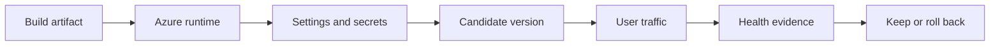
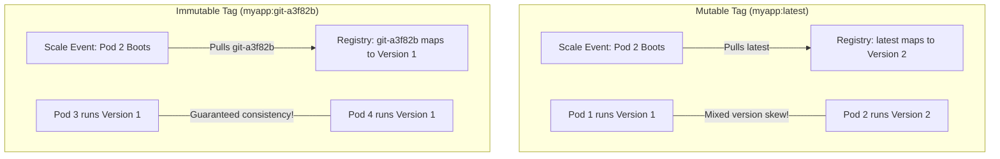
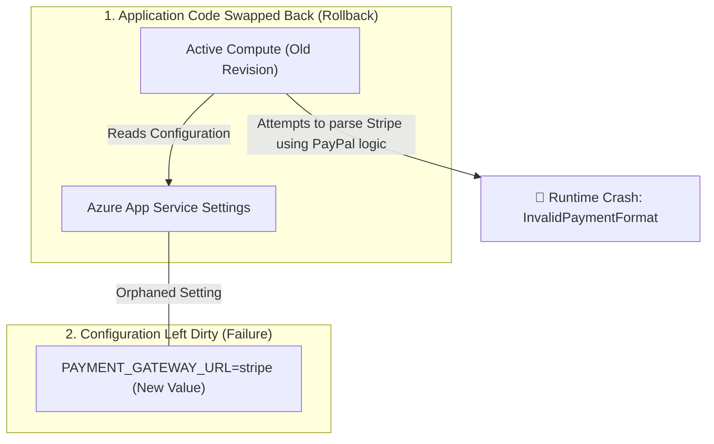

## Table of Contents

1. [The Problem](#the-problem)
2. [What Is a Release](#what-is-a-release)
3. [Artifact](#artifact)
4. [Runtime](#runtime)
5. [Configuration](#configuration)
6. [Traffic](#traffic)
7. [Health](#health)
8. [Rollback](#rollback)
9. [Putting It All Together](#putting-it-all-together)
10. [What's Next](#whats-next)

## The Problem

The build passed. The container image exists. The pull request is merged. The pipeline says the deployment succeeded.

Then production checkout fails.

- The image is correct, but the production runtime is missing `RECEIPTS_STORAGE_ACCOUNT`.
- The app starts, but the health endpoint fails after it tries to connect to Azure SQL.
- The candidate version works in a staging slot, but production traffic still reaches the old slot.
- The new Container Apps revision receives 10 percent of traffic, fails real checkout requests, and nobody knows which older revision is the rollback target.

This module is about the operating work around an Azure release. A deployment moves code into a place where it can run. A release is larger. It moves a known artifact, runtime settings, secret access, traffic, monitoring attention, and rollback responsibility. In Azure, that usually means naming the App Service slot, Container Apps revision, Function App package, VM image, or AKS deployment that changed, then naming the configuration, identity, traffic, health, and rollback target attached to that change.

The beginner habit is simple: before users depend on a change, know what version is running, what values it receives, how traffic reaches it, how health will be judged, and how users return to a known working path if the release is bad.

## What Is a Release

A release is the controlled movement of a change into a live system. The change may be application code, a container image, an App Service package, an environment variable, a Key Vault reference, a scaling setting, or a traffic split. The user does not care which file changed. The user cares whether checkout still works.


*A release is the moment artifact, runtime, config, traffic, and health checks line up around the same version.*

That is why "deployment succeeded" gives incomplete evidence. A deployment can succeed while the release fails. Azure accepted the package or image. The app may even be running. But the runtime can still be wrong for production: wrong secret reference, wrong identity, wrong database, wrong traffic target, wrong health path, or no rollback plan.

Think of a release as six connected promises:

| Promise | Question it answers |
| --- | --- |
| Artifact | Which exact version are we trying to run? |
| Runtime | Where is that version running? |
| Configuration | What values and secret access does it receive? |
| Traffic | Which users can reach it now? |
| Evidence | What proves the release is healthy or unsafe? |
| Rollback | Which known working path can users return to? |

Those promises are separate on purpose. If checkout breaks after a release, you need to know whether the code changed, the runtime changed, the config changed, or only the traffic path changed.



The release is the whole path, not one box in the path.

## Artifact

The artifact is the thing you built and intend to run. For App Service, it might be a deployed package or container image. For Azure Container Apps, it is usually a container image reference. For a beginner team, the exact artifact should be visible in the release record.

This matters because names can lie. A tag like `latest` or `prod` may point to different images at different times. A release record that says "deployed latest" is weaker than one that records a digest, build number, commit SHA, or immutable version.

For `devpolaris-orders-api`, useful artifact evidence might be:

```text
service: devpolaris-orders-api
version: checkout-2026-05-16.4
commit: 91df3a8
image: acrdevpolaris.azurecr.io/orders-api@sha256:...
release owner: platform-api
```

This does not make the release safe by itself. It makes the version knowable. When you later compare the old and new behavior, you are not guessing which code ran.

:::expand[Design: Why Mutable Tags Exist Despite Their Risks]{kind="design"}
In modern container operations, referencing mutable image tags like `:latest` or `:prod` in production is widely considered an anti-pattern. Yet, container registries and orchestration engines continue to support mutable tags as standard features. Differentiating the design pressure that created mutable tags from the operational safety that demands immutable digests reveals a fundamental tradeoff between developer convenience and runtime predictability.

Mutable tags exist to simplify early-stage development loops. By utilizing a stable, reusable tag like `:latest`, developers can push updated container images to the registry without needing to modify, compile, and re-commit Bicep templates or Kubernetes manifests on every single change. The runtime hosting environment simply queries the registry and pulls whichever bytes are currently mapped to that tag, making continuous integration fast and lightweight.

However, this simplicity introduces severe scale-out risks in production. A container registry is a mutable directory: anyone with write access can overwrite the `:latest` tag at any moment. If an Azure Container App or AKS cluster scales out to handle a traffic surge after the tag is overwritten but before a formal release, the newly provisioned replicas will pull the new image, while existing replicas continue to run the old image. This results in mixed-version replicas serving production traffic concurrently.

This risk is identical on AWS. In Amazon ECS or EKS, referencing mutable tags in your task definitions will lead to replica skew during auto-scaling sweeps on Fargate or EC2. The correct design pattern in both clouds is to restrict mutable tags strictly to local development, while utilizing immutable, Git-SHA-based tags or explicit SHA-256 image digests for all production releases.

The top-down diagram below compares mutable convenience with immutable safety:



**Rule of thumb:** Treat mutable tags like local scratch space. For all production environments, enforce a strict deployment pipeline policy that tags images with unique git commit SHAs and references the immutable digest, guaranteeing that all running replicas remain perfectly synchronized.
:::

## Runtime

The runtime is where the artifact actually runs. In this roadmap, the main Azure runtime examples are App Service, Container Apps, Functions, virtual machines, and AKS. This module focuses on App Service and Container Apps because they have common safe-rollout handles: deployment slots and revisions.

Runtime matters because the same artifact can behave differently in different places. A staging slot can have different settings from production. A Container Apps revision can receive no traffic, 10 percent traffic, or all traffic. A health check can be configured for one runtime but absent in another.

The runtime question asks what production is actually running:

| Runtime evidence | Why it matters |
| --- | --- |
| Resource name and resource group | Identifies the exact Azure resource being changed. |
| Slot or revision | Identifies which candidate is running. |
| Region | Explains latency, dependency, and rollout boundary. |
| Identity | Determines what secrets and Azure resources the app can access. |
| Scale and health settings | Determines whether the runtime can serve and stay in rotation. |

If the release record cannot name the runtime target, the team cannot safely compare staging, production, old revision, and new revision behavior.

## Configuration

Configuration is the set of values the runtime gives the app when it starts or handles work. Database server names, storage account names, feature flags, telemetry connection strings, queue names, and external API endpoints are configuration. Secrets are sensitive configuration values or references to them.

Configuration can break a good artifact. This is one of the most common release surprises. The code passed tests. The image starts. The app fails only in production because the production value is different.

For the orders API, configuration might include:

```text
ORDERS_DB_SERVER=sql-devpolaris-prod.database.windows.net
ORDERS_DB_NAME=orders
RECEIPTS_STORAGE_ACCOUNT=stordersprod
APPINSIGHTS_CONNECTION_STRING=@Microsoft.KeyVault(...)
CHECKOUT_PAYMENTS_ENABLED=true
```

The release question is not "does the setting exist somewhere?" It is "does the candidate version receive the values it needs, and can its identity read the secrets it references?"

That identity boundary matters. A Key Vault reference in an App Service setting depends on the app's managed identity having permission to read the secret. A Container Apps secret can exist while the app points at the wrong secret name or revision. Configuration and identity are part of release safety.

## Traffic

Traffic movement is the moment users start depending on the candidate version. That is the risky boundary.

Before traffic moves, a candidate can look healthy under direct tests. After traffic moves, real users bring real data, real concurrency, real dependency timing, and real edge cases. Safe rollout features exist because production traffic should not be the first meaningful test.

Two Azure examples matter in this module:

| Runtime | Rollout handle | Beginner meaning |
| --- | --- | --- |
| App Service | Deployment slot | A separate live app environment that can be tested and swapped with production. |
| Container Apps | Revision | A versioned snapshot of revision-scope settings that can receive a traffic percentage. |

Traffic should move deliberately. If the team sends 10 percent of traffic to a new revision, the release record should say that. If the team swaps a staging slot into production, the release record should say which slot, which settings are sticky, and how to reverse the path.

## Health

Health is evidence, not hope. A release is not healthy because the deploy command finished. It is healthy when the app can serve the user path it promises.

Health has layers:

| Health layer | What it proves | What it does not prove |
| --- | --- | --- |
| Process starts | The runtime can start the app. | Checkout works. |
| Health endpoint | The app can answer a known path. | Every dependency and user path works. |
| Smoke test | A chosen workflow works after release. | Rare user paths are safe. |
| Real traffic metrics | Users are succeeding at normal rates. | Root cause is known. |
| Logs and traces | Specific failures can be explained. | The whole service is healthy. |

The previous observability module taught logs, metrics, traces, and alerts. A release uses those signals during a watch window: the period after traffic moves when the team actively checks whether the release is safe to keep.

## Rollback

Rollback means returning users to a known working path. That path might be the previous App Service slot, the older Container Apps revision, a previous app setting value, a disabled feature flag, or an older package.


*Rollback decisions are safer when they are driven by health evidence instead of guesswork.*

Rollback works when the team knows what to return to and what else changed. A release that changes both code and configuration may need both restored. A release that changed a database schema may not be safely reversible without a data plan. A release that changed a Key Vault secret reference may require identity and secret checks.

A useful rollback note is concrete:

```text
Rollback target:
  App Service: swap production back to slot `blue`
  Container Apps: route 100 percent traffic to revision `orders-api--v27`
  Config: restore RECEIPTS_STORAGE_ACCOUNT=stordersprod
  Evidence: checkout success rate normal for 15 minutes
```

Sometimes fixing forward is faster and safer than rolling back. The decision should be based on evidence and a known recovery path, not panic.

:::expand[Pitfall: Rollback Without Configuration Cleanup]{kind="pitfall"}
A dangerous release mistake is executing a "code-only" rollback while leaving new or modified configuration settings active in production. Imagine a release that deploys a new container image along with a modified environment variable `PAYMENT_GATEWAY_URL=https://api.stripe.com` to replace a legacy PayPal endpoint. The release fails smoke tests, and the team quickly rolls back by routing 100% of traffic back to the previous Container Apps revision or App Service slot. However, because environment settings are often shared at the application resource scope, the old code remains cabled to the new Stripe URL—which it has no logic to handle—causing immediate system crashes.

A complete rollback must treat code, configuration, and secrets as a unified transaction. If you swap slots or revisions back to an older version, you must audit whether your environment variables, Key Vault secret references, database schemas, and feature flags must also be restored to their previous states. Leaving "dirty" or orphaned configurations active in production after a code rollback leads to subtle runtime bugs that are highly difficult to diagnose because the codebase itself appears to be in a known working historical snapshot.

This identical mismatch occurs on AWS. If you update an AWS Secrets Manager credential or an AWS Systems Manager (SSM) Parameter Store value during a release, and subsequently roll back your ECS Task Definition or Lambda function to a previous version, the older code will ingest the new secret structure. If the older code cannot parse the new format, the system will experience runtime exceptions.

The top-down diagram below illustrates how an incomplete configuration rollback creates mismatched state:



**Rule of thumb:** Never treat a rollback as a simple code-only swap. Document your rollback sequences as unified transactions, and verify that environment variables, Key Vault references, and feature flags are reverted alongside your application code.
:::

## Putting It All Together

Return to the checkout release.

- The passing build was only artifact evidence.
- The runtime had to prove which slot or revision was actually running.
- Configuration had to prove the candidate received the right settings and secret access.
- Traffic had to move deliberately, not accidentally.
- Health had to be judged from endpoints, smoke tests, metrics, logs, and traces.
- Rollback had to name a known working path before the release became stressful.

The release is the operating event around the deploy. When you can name each part, Azure rollout tools stop feeling like product trivia and start feeling like control points.

## What's Next

The next article focuses on those control points. It explains how App Service deployment slots and Container Apps revisions help a team test a candidate version, move traffic, and recover from a bad rollout.


*Use this as the release contract: a production change is the artifact plus its configuration, traffic exposure, health evidence, and rollback path, not just a build number.*


---

**References**

- [Set up staging environments in Azure App Service](https://learn.microsoft.com/en-us/azure/app-service/deploy-staging-slots)
- [Application lifecycle management in Azure Container Apps](https://learn.microsoft.com/en-us/azure/container-apps/application-lifecycle-management)
- [Revisions in Azure Container Apps](https://learn.microsoft.com/en-us/azure/container-apps/revisions)
- [Configure an App Service app](https://learn.microsoft.com/en-us/azure/app-service/configure-common)
- [Azure Monitor alerts overview](https://learn.microsoft.com/en-us/azure/azure-monitor/alerts/alerts-overview)
