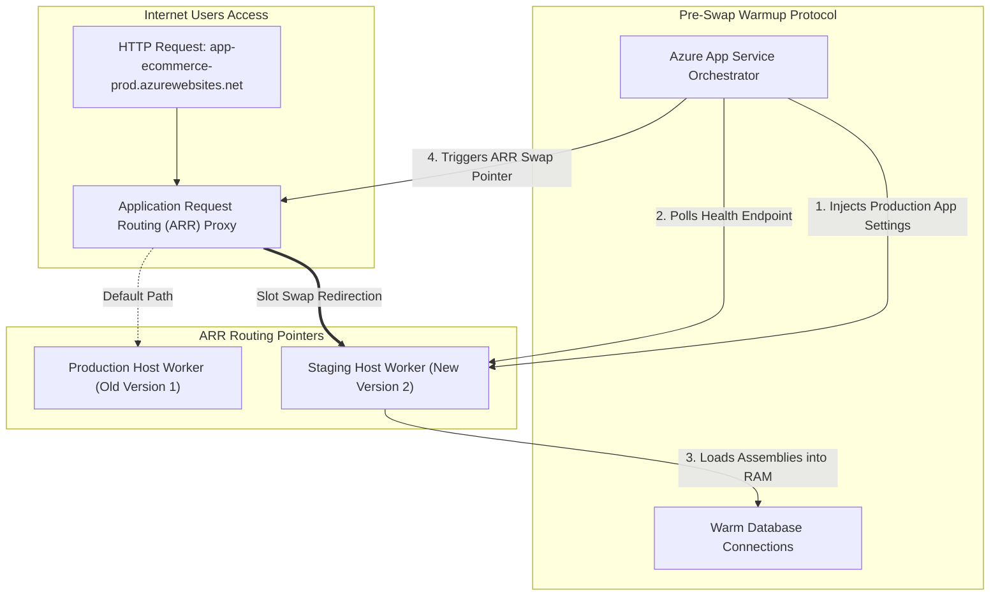

## Table of Contents

1. [The Problem: The Deployment vs. Release Dissonance](#the-problem-the-deployment-vs-release-dissonance)
2. [What Is a Release](#what-is-a-release)
3. [Declarative Slot Bicep and Routing CLI Previews](#declarative-slot-bicep-and-routing-cli-previews)
4. [Automated Release Pipeline and Rollback Orchestration](#automated-release-pipeline-and-rollback-orchestration)
5. [Under the Hood: ARR Routing Redirections and Cold-Start Warmups](#under-the-hood-arr-routing-redirections-and-cold-start-warmups)
6. [The Artifact: Digest Accountability vs. Mutable Tag Hazards](#the-artifact-digest-accountability-vs-mutable-tag-hazards)
7. [Configuration and Identity: Environment Leakages](#configuration-and-identity-environment-leakages)
8. [Traffic and Health Gates](#traffic-and-health-gates)
9. [Rollback Transactions](#rollback-transactions)
10. [Putting It All Together](#putting-it-all-together)
11. [What's Next](#whats-next)

## The Problem: The Deployment vs. Release Dissonance

A deployment moves an artifact into a runtime; a release moves a verified runtime into the path of users. That distinction is the anchor for this whole module.

The continuous integration pipeline reports complete success.
The application container image builds successfully, passing all local unit tests and lint checks.
The pull request is merged, and the deployment pipeline registers a successful push to the target cloud hosting environment.
Yet, the moment real customer traffic hits the production checkout endpoint, the portal crashes.

Upon closer inspection, the operations team discovers that while the compiled code artifact is perfectly correct, the production runtime environment lacks the critical `RECEIPTS_STORAGE_ACCOUNT` environment variable.
Alternatively, the application starts successfully, but the health check endpoint fails after it tries to establish a connection to the backend database.
In other scenarios, the candidate version works flawlessly in a staging slot, but production traffic continues to route to the old slot due to a misconfigured traffic split.
In serverless environments, the new revision receives a small percentage of traffic, returns database connection timeout errors, and the operations team cannot identify which older revision is the safe rollback target.

These scenarios illustrate the critical difference between a deployment and a release.
A deployment is the technical process of moving compiled bytes, packages, or container images into a cloud runtime hosting environment where they can physically execute.
A release is a much larger business event.
It is the controlled movement of that running code into the path of live customer traffic, backed by correct configuration values, managed identity access, monitoring watch windows, and verified rollback targets.
If your engineering team treats deployments and releases as the same action, you are exposed to silent production downtime.

## What Is a Release

A release is the controlled exposure of a specific artifact, configuration set, and runtime target to users.
It behaves like an operational transaction: code, settings, traffic, evidence, and rollback state must move together.
The change may be application code, a container image, an App Service package, an environment variable, a Key Vault reference, a scaling setting, or a traffic split.
The user does not care which configuration file changed.
The user cares exclusively whether the checkout workflow still functions correctly.


*A release is a runtime contract: artifact, configuration, traffic, health evidence, and rollback all need to agree.*


A successful cloud release requires aligning six distinct architectural promises.
If an outage occurs, these separate promises allow you to quickly identify whether the code changed, the runtime environment changed, the configuration changed, or only the traffic path changed:

| Promise Name | Question It Answers | System Impact |
| --- | --- | --- |
| Artifact | Which exact version are we trying to run? | Governs compiled code safety and container security. |
| Runtime | Where is that version executing? | Determines physical host regions, compute limits, and boundaries. |
| Configuration | What values and secret access does it receive? | Governs environment variables, database strings, and Entra permissions. |
| Traffic | Which users can reach the new version now? | Determines traffic weight, slot allocation, and path routing. |
| Evidence | What proves the release is healthy or unsafe? | Governs health endpoints, telemetry traces, and latency metrics. |
| Rollback | Which known working path can users return to? | Determines the rapid recovery path to restore service. |

## Declarative Slot Bicep and Routing CLI Previews

A deployment slot is a separate Web App runtime target that shares the same App Service app boundary while holding its own hostname, settings, and warmed process.
To establish a resilient release boundary inside Azure, we deploy an App Service App with a dedicated staging slot.
The Bicep configuration below declares a web application and a staging slot.
It configures `slotSetting` to ensure that connection strings remain sticky to their specific slot environment during deployment swaps, preventing staging code from talking to production databases.

```bicep
resource webApp 'Microsoft.Web/sites@2022-09-01' = {
  name: 'app-ecommerce-prod'
  location: resourceGroup().location
  kind: 'app'
  properties: {
    serverFarmId: '/subscriptions/.../serverfarms/asp-ecommerce'
  }
}

resource webAppConfig 'Microsoft.Web/sites/config@2022-09-01' = {
  parent: webApp
  name: 'web'
  properties: {
    appSettings: [
      {
        name: 'DB_CONNECTION'
        value: 'Server=tcp:sql-prod.database.windows.net...'
      }
    ]
  }
}

resource stagingSlot 'Microsoft.Web/sites/slots@2022-09-01' = {
  parent: webApp
  name: 'staging'
  location: resourceGroup().location
  properties: {
    serverFarmId: '/subscriptions/.../serverfarms/asp-ecommerce'
  }
}

resource stagingConfig 'Microsoft.Web/sites/slots/config@2022-09-01' = {
  parent: stagingSlot
  name: 'web'
  properties: {
    appSettings: [
      {
        name: 'DB_CONNECTION'
        value: 'Server=tcp:sql-staging.database.windows.net...'
      }
    ]
  }
}

resource stickySettings 'Microsoft.Web/sites/config@2022-09-01' = {
  parent: webApp
  name: 'slotConfigNames'
  properties: {
    appSettingNames: [
      'DB_CONNECTION'
    ]
  }
}
```

Once the code is deployed and verified in the staging slot, the release pipeline triggers a slot swap.
The Azure CLI commands below check slot health, perform the swap, and verify production.

```plain
az webapp deployment slot list \
  --resource-group rg-ecommerce-prod \
  --name app-ecommerce-prod \
  --query "[].{Name:name, Status:status}" \
  --output table

az webapp deployment slot swap \
  --resource-group rg-ecommerce-prod \
  --name app-ecommerce-prod \
  --slot staging \
  --target-slot production
```

## Automated Release Pipeline and Rollback Orchestration

An automated release pipeline is the executable checklist that promotes, checks, shifts traffic, watches telemetry, and rolls back when conditions fail. To manage the execution of our release contract at scale, we translate our steps into an automated pipeline.
The GitHub Actions workflow configuration below demonstrates a declarative deployment to the staging slot, an integration sanity check, a slot swap execution, a five-minute health monitoring watch window, and an automatic rollback triggered by active Azure Monitor alerts.

```yaml
name: Production Release Pipeline

on:
  push:
    branches: [ main ]

jobs:
  release:
    runs-on: ubuntu-latest
    steps:
    - name: Checkout Source Code
      uses: actions/checkout@v3

    - name: Azure CLI Login
      uses: azure/login@v1
      with:
        creds: ${{ secrets.AZURE_CREDENTIALS }}

    - name: Deploy Code to Staging Slot
      uses: azure/webapps-deploy@v2
      with:
        app-name: app-ecommerce-prod
        slot-name: staging
        package: ./build-artifacts.zip

    - name: Run Integration Warmup Checks
      run: |
        curl --fail --silent --retry 3 \
          https://app-ecommerce-prod-staging.azurewebsites.net/health

    - name: Swap Staging Slot to Production
      run: |
        az webapp deployment slot swap \
          --resource-group rg-ecommerce-prod \
          --name app-ecommerce-prod \
          --slot staging \
          --target-slot production

    - name: Active Telemetry Watch Window
      run: |
        echo "Starting 5-minute production monitoring watch window..."
        sleep 300
        ALERT_STATUS=$(az monitor app-insights alert show-status \
          --resource-group rg-ecommerce-prod \
          --app app-ecommerce-prod \
          --query "status")
        if [ "$ALERT_STATUS" == "Fired" ]; then
          echo "🔴 ALERT FIRED: Triggering automated rollback!"
          exit 1
        fi

    - name: Handle Automated Rollback Swap
      if: failure()
      run: |
        echo "Reverting App Service ARR routing pointers back to staging..."
        az webapp deployment slot swap \
          --resource-group rg-ecommerce-prod \
          --name app-ecommerce-prod \
          --slot staging \
          --target-slot production
```

## Under the Hood: ARR Routing Redirections and Cold-Start Warmups

A slot swap functions as a routing-pointer update between already-running slot targets, not as a file copy between machines.
Understanding how Azure App Service executes a zero-downtime slot swap requires looking beneath the high-level CLI commands at Layer 7 proxy mechanics and IIS host virtualization.
App Service runs behind a centralized frontend proxy network hosting Application Request Routing (ARR) instances.
ARR acts as a high-performance Layer 7 load balancer and reverse proxy that intercepts all incoming HTTP requests targeting your application's domain.

When you trigger a slot swap, the Azure Web App orchestrator does not copy physical code files, assembly binaries, or container layers between the staging and production virtual hosts.
Instead, the orchestrator executes a virtual pointer swap within the ARR routing tables.
ARR updates its hostname destination mappings.
Requests targeting `app-ecommerce-prod.azurewebsites.net` are redirected to the worker instances hosting the staging codebase, while requests for the staging URL are redirected to the old production instances.
Because this routing change occurs at the proxy configuration layer, the network connection cut-over takes less than a second and does not drop active TCP packets.



To prevent users from experiencing high response latencies or timeout errors during this cut-over, the App Service orchestrator enforces a strict cold-start warm-up protocol before altering the ARR routing tables.
First, the orchestrator injects production app settings and connection strings into the staging worker environment.
The staging application process is automatically restarted to ingest these environment variables.

Next, the orchestrator monitors local warm-up requests.
It sends HTTP requests to the local staging endpoints (following the rules declared in your web application's `<applicationInitialization>` configurations).
This forces the staging guest operating system kernel to JIT-compile compiled C# assemblies, initialize Node.js module maps, load large static libraries into physical RAM, and establish connection pools with database clusters.
Only after these warm-up probes return successful HTTP 200 responses does the orchestrator signal to the ARR proxy network to swap the routing pointers, guaranteeing that the first customer request hits a pre-warmed host.

## The Artifact: Digest Accountability vs. Mutable Tag Hazards

A release artifact is the immutable package or image digest the platform should run everywhere for that version.
The foundation of every secure release is the compiled artifact.
In containerized cloud architectures, the most common deployment mistake is referencing mutable container tags like `:latest` or `:prod` in your release configurations.
Because a container registry is a mutable directory, anyone with write permissions can overwrite the `:latest` tag at any time.

This introduces severe replica skew risks during scaling events.
If your Azure Container App environment or AKS cluster scales out to handle a traffic surge after the `:latest` tag is overwritten but before a formal release is coordinated, newly booted replicas will pull the new image bytes.
Meanwhile, existing replicas continue to run the old image.
This results in mixed-version replicas serving production traffic concurrently.

To guarantee release predictability, all production pipelines must reference immutable image digests.
Every container image has a unique SHA-256 digest (e.g., `orders-api@sha256:...`) which is cryptographically generated from the image's layers.
By declaring the explicit digest in your Bicep templates, you ensure that every scaled instance is physically identical, making your releases perfectly predictable.

## Configuration and Identity: Environment Leakages

Configuration and identity are the runtime inputs that tell the same artifact which databases, vaults, feature flags, and permissions belong to its environment.
Configuration variables and access secrets govern how your code behaves within a chosen environment scope.
A common release failure mode is environment leakage, where a candidate codebase running in a staging environment connects to production databases or caches due to shared configuration files.


*The same artifact can behave differently when runtime configuration, traffic, identity, or health gates differ.*


To prevent this, Azure App Service utilizes slot-level sticky settings.
By marking an environment setting or connection string as a slot setting, you instruct the ARM configuration layer to pin that value to its physical slot.
During a slot swap, while the code and routing pointers are swapped, the sticky settings remain unchanged, ensuring that the staging host continues to talk to the staging database while the newly promoted production host inherits the production database connection.

Furthermore, configuration safety depends on identity integration.
Rather than embedding raw database passwords or Key Vault secrets directly in your configuration files, your release pipeline must associate the runtime compute with a managed identity.
The compute identity must be granted explicit RBAC scopes on Key Vault, allowing the application to resolve secret references dynamically at runtime without storing passwords on disk.

## Traffic and Health Gates

Traffic and health gates are the routing weights and telemetry checks that decide how much production traffic a candidate can receive.
Managing traffic allocation is the core mechanism for reducing the blast radius of a new release.
Traditional release methods cut over 100% of traffic instantly, exposing all active users to potential bugs.
Modern Azure rollouts utilize dynamic traffic gates.

Azure Container Apps support versioned revisions, allowing you to split incoming HTTP requests by percentage.
You can route 90% of traffic to the stable, historical revision and 10% to the new candidate revision.
This canary testing exposes the new code to real-world concurrency, dependency timing, and edge cases under a controlled scope.

During this traffic watch window, you must monitor health evidence rather than hoping for success.
This watch window utilizes Azure Monitor to actively track server error rates, database deadlock traces, and 95th-percentile response latencies.
Only when these telemetry metrics remain clean and stable for a designated period (such as fifteen minutes) should your pipeline promote the new version to 100% traffic.

## Rollback Transactions

A rollback transaction is the coordinated reversal of traffic, code, configuration, and secret references to a known working baseline.
A rollback is the emergency procedure of returning your active users to a known, working historical state.
A common mistake during an incident is executing a code-only rollback while leaving new configuration settings active in production.
If the older codebase lacks the logic to parse the new configuration schema, the system will crash.

A complete rollback must treat code, configuration, and secret references as a single, unified transaction.
If you swap slots or revisions back to a previous state, you must verify that all environment variables, Key Vault references, and database schemas are reverted alongside the compiled binaries.
Documenting and dry-running these rollback sequences beforehand ensures that your team can restore system availability without panic or guesswork.

## Putting It All Together

A successful release requires coordinating multiple control points to transition code safely into production.

* **Release Contract**: Define a release as the alignment of artifact, runtime, configuration, traffic, health, and rollback controls, rather than a simple CI/CD build.
* **Cold-Start Warmups**: Leverage App Service slot warmups and Application Request Routing (ARR) redirections to execute zero-downtime VIP swaps.
* **Immutable Digests**: Enforce a strict policy that references SHA-256 digests in production, eliminating the auto-scaling replica skew risks of mutable tags.
* **Sticky Configurations**: Apply slot-level sticky settings to prevent environment leakage, ensuring that staging and production boundaries remain separate during swaps.
* **Canary Splits**: Utilize Container App revision splits to expose new candidates to a small percentage of real-world traffic before full promotion.
* **Unified Rollbacks**: Treat rollbacks as complete transactions that revert code, configurations, and secrets together to a known working state.

## What's Next

Now that we have established the operational mental model of a release contract, we will explore the configuration controls.
In the next chapter, we will explore Configuration and Secrets.
We will examine how Azure App Configuration and Key Vault work under the hood to manage dynamic environment variables, rotate secret vaults, and enforce security policies.


*Use this as the release safety loop: watch the new runtime, compare health, and choose continue or rollback before damage spreads.*

---

**References**

* [Set up staging environments in Azure App Service](https://learn.microsoft.com/en-us/azure/app-service/deploy-staging-slots) - Official staging slots overview.
* [Application lifecycle management in Azure Container Apps](https://learn.microsoft.com/en-us/azure/container-apps/application-lifecycle-management) - Guide to revision boundaries.
* [Revisions in Azure Container Apps](https://learn.microsoft.com/en-us/azure/container-apps/revisions) - Technical details on canary traffic splits.
* [Configure an App Service app](https://learn.microsoft.com/en-us/azure/app-service/configure-common) - Guide to slot sticky settings and configurations.
* [Azure Monitor alerts overview](https://learn.microsoft.com/en-us/azure/azure-monitor/alerts/alerts-overview) - Reference for release watch window metrics.
