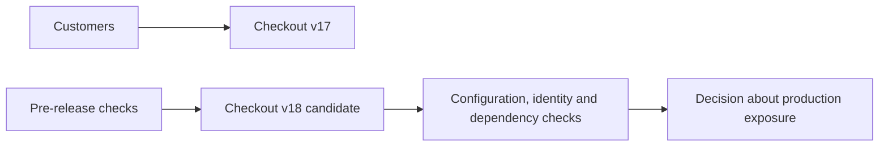
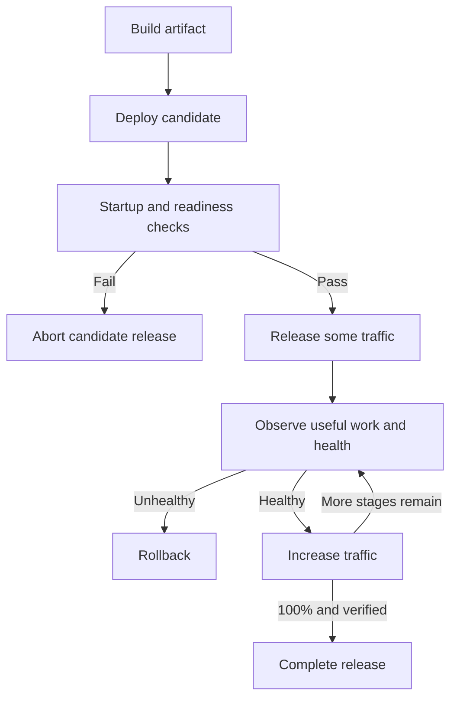

## Table of Contents

1. [What Changes Between a Local Deploy and an Azure Release?](#what-changes-between-a-local-deploy-and-an-azure-release)
2. [What Is the Release Artifact?](#what-is-the-release-artifact)
3. [Where Does the Artifact Run?](#where-does-the-artifact-run)
4. [Which Settings and Identity Does the Runtime Need?](#which-settings-and-identity-does-the-runtime-need)
5. [How Do Traffic and Health Evidence Prove the Release Works?](#how-do-traffic-and-health-evidence-prove-the-release-works)
6. [How Does Rollback Fit the Release?](#how-does-rollback-fit-the-release)
7. [What Should a Release Record Contain?](#what-should-a-release-record-contain)
8. [Check Your Answers](#check-your-answers)

Checkout version 17 is serving customers, and version 18 has finished building. Before customers use it, you need to know where it will run, which settings and permissions it needs, whether it can complete a checkout, and how to return to version 17 if something goes wrong.

These decisions are easy to miss when “deploy” and “release” are used as interchangeable words. A deployment changes the software running in a target environment. A release changes the software or behavior that users actually rely on. A new version can be running in staging while every customer continues using the old version.

Following the new version from its build to customer traffic makes the distinction practical. It also explains why an Azure release involves more than a successful upload:

1. **What Changes Between a Local Deploy and an Azure Release?**
2. **What Is the Release Artifact?**
3. **Where Does the Artifact Run?**
4. **Which Settings and Identity Does the Runtime Need?**
5. **How Do Traffic and Health Evidence Prove the Release Works?**
6. **How Does Rollback Fit the Release?**
7. **What Should a Release Record Contain?**

## What Changes Between a Local Deploy and an Azure Release?
<!-- section-summary: Local execution combines many decisions implicitly; a production release makes the artifact, environment, exposure, validation, and recovery decisions explicit. -->

On a laptop, you might start `checkout-api` with:

```bash
dotnet run
```

You then open `http://localhost:5000` and try the application. From the developer's perspective, this feels like one action: running the app. Several things have happened underneath it. Source code has been compiled, a runtime process has started, settings and credentials have been supplied, a network port is available, and you have chosen to send requests to that process.

Because you are both the developer and the only user, these decisions can remain implicit. You know which checkout you launched and can restart it when it fails. Production has existing users who continue relying on the old version while the new version is being prepared. That makes the order and outcome of each decision important.

Suppose checkout v17 is serving customers. Before replacing it with v18, the team needs answers to several concrete questions. Exactly which package is v18? Where will it execute? What configuration and identity will it use? Can it reach the services it depends on? Does it start and perform useful work? When should customer traffic move, and how much traffic should move first? Finally, what evidence will tell the team to continue or recover?

Taken together, these are the release problem. The release includes an artifact, a runtime target, runtime configuration, identity and permissions, a rollout decision, verification, and rollback. Each item answers a different question about the change. Leaving one implicit does not remove the dependency; it only makes it harder to inspect when the new version fails.

### Distinguish the related terms

A **build** transforms source code into a package. That package is an **artifact**. A **deployment** places or runs an artifact in a target environment. A **release** makes the resulting software or functionality available to users under controlled conditions. A **rollout** is the progression of that exposure. In Container Apps, a **revision** identifies an immutable snapshot of revision-scoped application state.

These terms describe related parts of the same work, which explains why people sometimes blur them. Separating them lets you describe a state such as “v18 is deployed to staging but has not been released to customers” without treating it as contradictory.

The broader operational definition of a release is a controlled transition from one known runtime state to another. It identifies the software, the conditions under which that software runs, the users exposed to it, the evidence required to keep it, and the way back if it fails. Version 18 is therefore only one part of the release description.

### Azure DevOps uses one narrower meaning

Azure DevOps Classic release pipelines also have a product-specific object called a **Release**. In that system, a release contains a versioned set of artifacts and a snapshot of the pipeline information needed to execute it, including stages, tasks, policies, and deployment options. A deployment is the execution of a particular stage of that release. The [Classic release pipeline documentation](https://learn.microsoft.com/en-us/azure/devops/pipelines/release/?view=azure-devops) defines those terms in that narrower context.

Modern Azure DevOps YAML pipelines can instead combine build and release activities in a multistage YAML pipeline; they do not necessarily create a separate Classic Release object. The [Azure Pipelines concepts guide](https://learn.microsoft.com/en-us/azure/devops/pipelines/get-started/key-pipelines-concepts?view=azure-devops) describes the pipeline model. When a team says “release,” clarify whether it means that concrete Classic object or the broader change reaching users.

The rest of this article uses the broader production meaning. To make that change reproducible, first identify exactly which software it contains.

## What Is the Release Artifact?
<!-- section-summary: An artifact is the build output; immutable artifact identity connects the tested software to the deployed software without introducing an extra rebuild. -->

Developers edit files such as `Program.cs`, `CheckoutService.cs`, and `PaymentClient.cs`. A build turns those source files into a runnable package. Depending on the application, the result might be `checkout-api-1.8.4.zip`, `checkout-api.jar`, the image `checkout-api:1.8.4`, or an image reference identified by a digest such as `checkout-api@sha256:7ad9...`.

App Service supports deployment of prebuilt formats including ZIP, WAR, JAR, and EAR packages. The [deployment documentation](https://learn.microsoft.com/en-us/azure/app-service/deploy-zip) describes those artifact options. The important property for release reasoning is less the filename extension than the ability to identify a particular build output reliably.

### Identify the software precisely

“Production is running `main`” is incomplete information. A branch changes as commits are added, so the name alone does not identify the software that handled a request yesterday. A stronger record connects a human-readable artifact version with its source commit and content identity:

```text
Artifact: checkout-api:1.8.4
Git commit: 7b81a2f
Image digest: sha256:abc123...
```

A **digest** is a content-derived identifier. It lets the release record distinguish packages even if someone reuses a tag. The abbreviated digests here illustrate the identifying fields rather than provide runnable image references.

For example, yesterday `checkout:latest` could have pointed to `sha256:AAA`, while today the same tag points to `sha256:BBB`. The label did not change, but the content did. A versioned label such as `checkout:1.18.0` is easier to discuss than `latest`, and a reference such as `checkout@sha256:BBB` ties the record to the actual image content.

This property is **immutability**: the artifact identity used for the release should continue to identify the same application bits. It allows the team to compare what was tested with what was deployed instead of inferring sameness from a familiar name.

### Build once and promote the tested package

A useful release sequence is to build an artifact once, test that artifact, and promote it through environments into production. Separate builds for testing, staging, and production add another variable. Even if each build started from the intended source, the team now has more than one package to compare.

Promoting the existing artifact keeps the question direct: is production executing the exact binary or image that passed the earlier checks? It does not imply that every environment must use identical settings. It fixes the application bits while allowing environment-specific configuration to remain separate.

An artifact is also passive. Building `checkout-api:v18` and storing it in a registry does not deploy it and does not release it. At that point, nobody has to be executing the package. Once it runs in staging, it has been deployed there; customers may still be using v17. To understand that intermediate state, we need to identify the runtime target.

## Where Does the Artifact Run?
<!-- section-summary: A runtime target executes the artifact; slots and revisions let the candidate run and be checked while the previous version continues serving customers. -->

A **runtime target** is the environment that executes the artifact. In Azure this might be App Service, Container Apps, AKS, Functions, Virtual Machines, or VM Scale Sets. The artifact describes the software; the target supplies the place where that software starts processes and performs work.

There can also be several distinct targets within one application's hosting arrangement. An App Service application may have production and staging slots. A Container App may have revision 17 and revision 18. These are different service-specific mechanisms, but both allow a new version to exist before it replaces the version used by customers.

### Keep the candidate separate while checking it

Replacing v17's files, restarting the process, and immediately directing all requests to v18 combines deployment, startup, validation, and exposure into one moment. If the new version cannot authenticate or reach its database, customers discover the problem at the same time as the release operator.

Keeping v17 available while starting v18 gives the team a candidate it can examine first. The candidate is the new version being evaluated for production use. Check whether it starts, loads configuration, reaches the database, authenticates successfully, responds to `/health`, and processes a test transaction. These checks establish more than the fact that files arrived at the target.


```mermaid
flowchart LR
    U[Customers] --> O[Checkout v17]
    E[Pre-release checks] --> N[Checkout v18 candidate]
    N --> C[Configuration, identity and dependency checks]
    C --> D[Decision about production exposure]
```

This arrangement gives deployment and traffic movement their own decisions. The new version can fail validation without requiring every customer to experience that failure.

### App Service slots

An App Service nonproduction slot is a live application with its own hostname. A team can deploy v18 to staging, warm it, and test it while the production slot continues running v17. The [slot documentation](https://learn.microsoft.com/en-us/azure/app-service/deploy-staging-slots) describes this staging and swap pattern.

Before the swap, production contains v17 and staging contains v18. After a successful swap, production contains v18 and staging contains the previous v17. App Service warms the source slot during the swap procedure before changing its routing rules to production.

The deployment therefore happened before the cutover. The swap is the point closer to the release decision: it changes which prepared version production users reach. This distinction is useful even when the actual traffic change is a single cutover rather than a long percentage-based rollout.

### Container Apps revisions

A Container Apps revision is an immutable snapshot of the application's revision-scoped state. Revisions such as `checkout--revision17` and `checkout--revision18` let the service distinguish the old and new runtime definitions. In multiple revision mode, both can remain active and receive different percentages of incoming traffic.

The [revision documentation](https://learn.microsoft.com/en-us/azure/container-apps/revisions) explains how these snapshots and revision modes support deployment. The crucial separation is the same as with slots: the existence of a new version does not establish that customers are using it. Revision 18 may be deployed while it receives zero percent of production traffic.

The target alone still does not define the running application completely. Starting the same package with different configuration or permissions can produce different results, so those runtime inputs need to be part of the release as well.

## Which Settings and Identity Does the Runtime Need?
<!-- section-summary: The running application combines artifact, configuration, identity, and permissions; staging success does not prove those production inputs are correct. -->

Checkout v18 may need `DATABASE_HOST`, `SERVICEBUS_NAMESPACE`, `PAYMENT_API_URL`, `FEATURE_X_ENABLED`, and `APPINSIGHTS_CONNECTION_STRING`. These values identify dependencies, enable behavior, or connect telemetry. They are **runtime configuration** because the environment supplies them to the executing application rather than defining the application bits alone.

Compiling every environment's values into a separate artifact would weaken the build-once model. Instead, the same artifact can run with different settings in development, staging, and production. For example:

```yaml
artifact: checkout-api:v18
environments:
  dev:
    DATABASE_HOST: db-dev
  staging:
    DATABASE_HOST: db-staging
  production:
    DATABASE_HOST: db-prod
```

This is a conceptual configuration comparison, not an Azure deployment template. It shows why equal artifacts do not imply identical runtime behavior: each process connects to the environment's selected database. The application being operated is the combination of artifact and settings.

### Identity supplies the application's authority

If checkout needs a secret from Key Vault, embedding a username and password in the package creates an undesirable credential dependency inside the artifact. Azure services can instead use a **managed identity**, an identity through which the running application authenticates to another Azure resource.

Authentication establishes who is making the request. Authorization then determines whether that identity is allowed to perform the requested action. The application therefore needs both the intended identity and the appropriate permissions. Merely attaching an identity does not establish that a database or vault will grant access.

The runtime model now contains four parts: artifact, configuration, identity, and permissions. The package can be correct while the application fails because one of the other parts is wrong. Treating those as release inputs makes the failure understandable without assuming every production incident must come from the new code.

### Why staging can pass while production fails

Suppose v18 is healthy in staging, its settings are correct, and its staging identity has database access. Production can still fail if the production identity lacks that access. The earlier validation proved that the package worked with the staging environment. It did not automatically prove the production environment's authorization.

App Service makes this distinction particularly important because managed identity configuration is slot-specific, and managed identities are not swapped with application content during a slot swap. The [slot behavior documentation](https://learn.microsoft.com/en-us/azure/app-service/deploy-staging-slots) identifies that boundary. A successful staging test must therefore be interpreted alongside the production slot's identity and permissions.

Configuration also participates in recovery. If the old version expects one payment API endpoint and the new version requires another, rolling back only the executable may leave the old version with incompatible settings. We will return to that example after looking at the decision that exposes the configured candidate to users.

## How Do Traffic and Health Evidence Prove the Release Works?
<!-- section-summary: Move traffic only after candidate checks pass, increase exposure while runtime evidence remains healthy, and distinguish traffic rollout from feature activation. -->

Deployment creates or updates a runtime. Traffic movement determines which users depend on it. Keeping those decisions separate allows a sequence of deploy, validate, and then expose. It also allows the team to stop before broad exposure if the candidate is unhealthy.

With v17 and v18 both available, the initial split could be 100% to v17 and 0% to v18. After validation, move to 90% and 10%, observe the result, then 50% and 50%, and finally 0% and 100%. This is a **progressive rollout**: increase the new version's share in stages while checking its behavior.

| New version's state | Example production share | Meaning |
|---|---|---|
| Deployed but unreleased | 0% | The candidate exists without production exposure |
| Partially released | 10% | Some customer requests use the candidate |
| Fully released | 100% | All routed production requests use the new version |

The percentages make the exposure decision visible. At 0%, a broken version mainly affects pre-release checks and engineers. At 1%, approximately that fraction of routed traffic is exposed; at 10% it is a larger canary; at 50% it affects a major share; at 100% all traffic is exposed. Percentages describe the routing plan, while observations show what actually happened to requests during that plan.

### Establish increasingly strong health claims

First ask whether the process started. Then ask whether it can receive requests. Next, check whether it can perform useful work. Finally, observe whether it behaves normally under real traffic. Each question makes a stronger claim than the previous one.

Startup and readiness probes, a health endpoint, HTTP 5xx rate, latency, request volume, CPU and memory, dependency failures, and business success rate can all contribute evidence. A probe is a platform check of the application's state; a business-success measure asks whether the operation users wanted actually completed. Neither should be interpreted as proof of every other property.

For example, Container Apps single-revision mode does not transfer traffic to a newly created revision until it has provisioned, scaled appropriately, and passed the relevant startup and readiness checks. That platform behavior, described in the [revision guidance](https://learn.microsoft.com/en-us/azure/container-apps/revisions), helps prevent premature cutover. The application still needs observation of the useful work it performs after receiving traffic.

The release decision is therefore a feedback loop. Deploy and inspect the candidate. If it is healthy, expose it and observe. Increase exposure while the evidence remains acceptable. If it fails, abort before exposure or use the prepared recovery path after exposure.


```mermaid
flowchart TD
    A[Build artifact] --> B[Deploy candidate]
    B --> C[Startup and readiness checks]
    C -->|Fail| D[Abort candidate release]
    C -->|Pass| E[Release some traffic]
    E --> F[Observe useful work and health]
    F -->|Unhealthy| G[Rollback]
    F -->|Healthy| H[Increase traffic]
    H -->|More stages remain| F
    H -->|100% and verified| I[Complete release]
```

### A successful deployment can accompany a failed release

A pipeline message saying “Deployment succeeded” may establish that files were copied or a container started. If checkout then fails for 40% of users, the release has failed despite that successful deployment step. The strongest check is whether the new version is performing its intended job for users.

That is why traffic exposure, health criteria, and observation belong in the release definition. A pipeline's completion status describes its recorded steps. Runtime evidence establishes whether the changed system is useful under the conditions that matter.

### Feature exposure can be a separate change

Suppose v18 contains the existing checkout flow and a new recommendation engine. The team can deploy v18 to every instance while keeping `RecommendationFeature=false`. Later, changing it to `RecommendationFeature=true` exposes new functionality without deploying another artifact.

A **feature flag** is a configuration control for behavior. In this example it separates the code's presence from the user's experience of that code. The build answers which software exists; deployment answers where it runs; release answers who can experience the change. Traffic routing and feature flags can influence the last answer in different ways.

Once users depend on a change, the team also needs a clear response when the evidence deteriorates. That response must be designed while the previous working state is still known and available.

## How Does Rollback Fit the Release?
<!-- section-summary: Rollback restores a known-good system state, which can require compatible configuration and data as well as returning traffic to the previous application version. -->

Imagine that five minutes after v18 receives all traffic, the error rate rises from 0.4% to 14%. This is the wrong moment to start discovering whether v17 is still available. Before release, identify the previous known-good version, confirm that traffic can return to it, and determine whether its configuration and database expectations will still hold.

**Rollback** means restoring a previously working system state. Keeping the old runtime available can make the immediate action a traffic change: send 100% back to healthy v17 and reduce unhealthy v18 to 0%. This avoids rebuilding and redeploying the previous package during the incident.

App Service supports swapping the same slots again to restore the prior production version after an unsuccessful swap. Container Apps can retain previous revisions and move traffic back to them. Both mechanisms rely on having an appropriate previous runtime available; the service feature does not decide whether that runtime remains compatible with all other changes.

### Database changes can prevent a simple reversal

Suppose v18 changes the database with this statement:

```sql
ALTER TABLE Orders
DROP COLUMN LegacyPaymentId;
```

If v17 still expects `LegacyPaymentId`, returning traffic to v17 does not restore a working system. The application rollback may succeed while database compatibility fails. The schema change affected durable state outside the executable being rolled back.

Database migrations, queues, APIs, feature flags, secrets, schemas, and downstream services can all influence reversibility. A release changes a system whose parts interact. Keeping the previous binary is useful, but it is only sufficient when the surrounding conditions remain compatible with that binary.

One safer migration sequence is to expand the schema first, deploy an application compatible with that expanded state, migrate usage, and contract later. The separation delays destructive changes until old dependencies have been removed. It provides room for old and new versions to coexist while the application transition is being verified.

### Configuration must match the restored version

Consider v17 using `PAYMENT_API=/v1/payments`. Version 18 requires `/v2/payments`, so the release changes that setting. If the executable is rolled back to v17 while the setting remains `/v2/payments`, the former runtime has not actually been restored.

The recovery target includes artifact v17, configuration compatible with v17, the correct identity, and the required infrastructure. That is why the release record needs configuration information rather than just the old image name. A team should be able to explain which changes a traffic reversal undoes and which changes require separate recovery work.

The practical release sequence is therefore deploy, validate, expose, and observe, with a continue-or-rollback decision based on evidence. Rollback is part of that sequence from the start. It is the planned response to an unhealthy state, not an improvised command added after users are already affected.

## What Should a Release Record Contain?
<!-- section-summary: Record the artifact, source, target, configuration, identity, traffic timeline, health criteria, result, and rollback target so operators can reconstruct the production change. -->

After an incident, “we deployed checkout at 14:32” leaves most of the important questions unanswered. A useful release record connects the source and artifact to the runtime target, its configuration and authority, the exposure timeline, the evidence used to proceed, and the recovery target.

This example record makes those relationships concrete:

```yaml
releaseId: checkout-prod-2026-08-23.18
service: checkout-api
artifact: checkout-api:1.18.0
artifactDigest: sha256:7b4c...
sourceCommit: a819c2e
target: Azure Container Apps / checkout-prod
previousRevision: checkout--000017
newRevision: checkout--000018
configurationVersion: prod-config-42
identity: checkout-prod-mi
started: 14:20 UTC
rollout:
  - time: 14:25 UTC
    newVersionTraffic: 5%
  - time: 14:30 UTC
    newVersionTraffic: 25%
  - time: 14:38 UTC
    newVersionTraffic: 50%
  - time: 14:45 UTC
    newVersionTraffic: 100%
healthCriteria:
  http5xxRate: less than 1%
  p95Latency: less than 500 ms
  checkoutSuccess: greater than 99%
result: Succeeded
rollbackTarget: checkout--000017
```

This is a release record, not a deployable Azure resource definition. Its abbreviated digest and identifiers illustrate the data an operator needs to retain. The exact fields connect a human-readable release name to the build, the target's old and new revisions, and the environment under which the new version ran.

The rollout timestamps show when exposure changed. The health criteria make the continuation decision inspectable: HTTP 5xx rate below 1%, p95 latency below 500 ms, and checkout success above 99% were the example's checks. P95 latency is the duration within which 95% of measured requests finish. These values belong to this example record; they are not universal thresholds for every Azure service.

The configuration version and identity explain the environment's contribution. The rollback target identifies the previous runtime to recover. Together, the fields provide an audit trail from source through artifact, runtime, traffic, and observed behavior. “Pipeline succeeded” cannot supply that same information by itself.

### Four questions organize the record

The first question is **what software changed**. Artifact identity and source commit answer it. The second is **where it ran and under what authority**. Target, configuration, identity, and permissions answer that. The third is **who received the change**. Traffic weights, slots, revisions, and feature flags explain exposure. The fourth is **whether to keep it**. Health checks, metrics, logs, service-level objectives, and rollback criteria support that decision.

A service-level objective is a target for the behavior users should receive, such as an agreed success-rate or latency expectation. It helps connect operational evidence to a decision about whether the release should remain in place. Recording the criteria also lets later reviewers understand why the team proceeded rather than infer the decision from an end status.

### Connect the whole path

Local execution can hide the path inside one developer action: source, build, process, and localhost. Production makes the same underlying dependencies explicit. Source passes through a CI build into an immutable artifact and artifact repository. An Azure runtime target executes it with configuration and a managed identity. The candidate is validated, traffic moves, production behavior is observed, and the result is either completion or rollback, captured in the release record.

Azure's slots, revisions, and pipeline features expose decisions that production already requires. Understanding the decisions first prevents the product vocabulary from becoming a substitute for the operating model. A release is complete when the intended users receive a working change under known conditions, with evidence of that result and a recovery plan understood before it is needed.

### References

- [Deploy files to Azure App Service](https://learn.microsoft.com/en-us/azure/app-service/deploy-zip)
- [Set up staging environments in Azure App Service](https://learn.microsoft.com/en-us/azure/app-service/deploy-staging-slots)
- [Update and deploy changes in Azure Container Apps](https://learn.microsoft.com/en-us/azure/container-apps/revisions)
- [Classic release pipelines](https://learn.microsoft.com/en-us/azure/devops/pipelines/release/?view=azure-devops)
- [Key Azure Pipelines concepts](https://learn.microsoft.com/en-us/azure/devops/pipelines/get-started/key-pipelines-concepts?view=azure-devops)

## Check Your Answers

:::expand[What Changes Between a Local Deploy and an Azure Release?]{kind="recap"}
Local execution combines build, process startup, settings, credentials, and the user's request in one familiar action. Production separates those decisions because customers already depend on a working version. The release includes the artifact, runtime environment, exposure, verification, and recovery path.
:::

:::expand[What Is the Release Artifact?]{kind="recap"}
The artifact is the runnable build output. A stable content identity connects the package tested with the package deployed. Build once and promote that artifact; a branch name or mutable tag alone cannot prove which bits production executed.
:::

:::expand[Where Does the Artifact Run?]{kind="recap"}
The runtime target executes the artifact. App Service slots and Container Apps revisions can keep a candidate separate from the current production version, allowing startup and useful-work checks before customers depend on it.
:::

:::expand[Which Settings and Identity Does the Runtime Need?]{kind="recap"}
The running application combines artifact, configuration, identity, and permissions. Equal artifacts can behave differently across environments. A staging test does not prove production authorization, and App Service managed identities remain slot-specific during a swap.
:::

:::expand[How Do Traffic and Health Evidence Prove the Release Works?]{kind="recap"}
Deployment establishes the candidate; traffic movement exposes users to it. Check startup, readiness, useful work, and real-traffic behavior before increasing exposure. Feature flags can release behavior separately from deployment, and a successful deployment step can still lead to a failed release.
:::

:::expand[How Does Rollback Fit the Release?]{kind="recap"}
Prepare recovery before exposure. Returning traffic to a previous runtime can be fast, but it works only if that version still has compatible configuration, permissions, data, and dependencies. A restored binary alone does not reverse a destructive schema change.
:::

:::expand[What Should a Release Record Contain?]{kind="recap"}
Record artifact and source identity, old and new targets, configuration version, runtime identity, exposure timestamps, health criteria, outcome, and rollback target. Those fields explain which software ran, under which conditions, who received it, and why the release continued or was reversed.
:::
