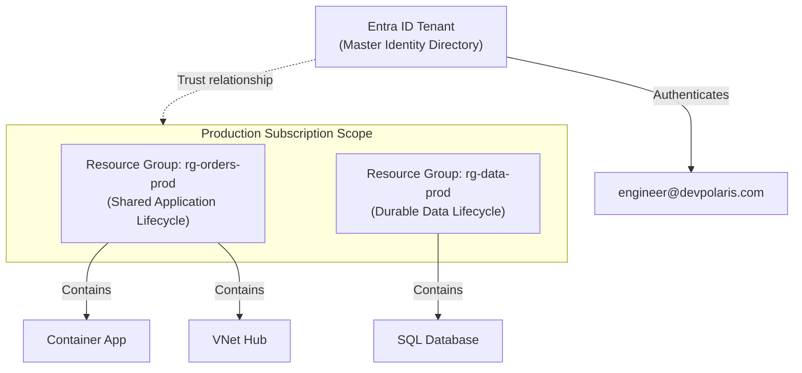
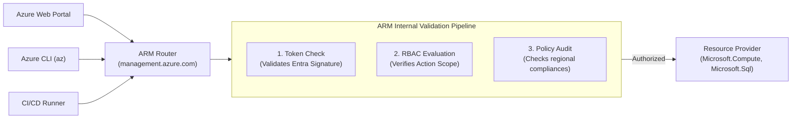

## Table of Contents

1. [The Boundary Sprawl Challenge](#the-boundary-sprawl-challenge)
2. [Centralizing the Identity Registry](#centralizing-the-identity-registry)
3. [Financial and Quota Containers](#financial-and-quota-containers)
4. [Logical Lifecycle Folders](#logical-lifecycle-folders)
5. [The Resource Manager Control Gate](#the-resource-manager-control-gate)
6. [Interactive Command-Line Verification](#interactive-command-line-verification)
7. [Under the Hood: Inside the ARM Request Pipeline](#under-the-hood-inside-the-arm-request-pipeline)
8. [Mapping AWS and Azure Architectures](#mapping-aws-and-azure-architectures)
9. [Putting It All Together](#putting-it-all-together)
10. [What's Next](#whats-next)

## The Boundary Sprawl Challenge

Azure's core operating model is a split between identity records, billing and quota containers, lifecycle groups, and resource APIs. That split is the first anchor to hold onto: Azure does not keep every user, invoice, and server setting inside one account-shaped object.

When you operate applications locally on a workstation, boundary management is straightforward. You run a single development environment on your laptop where your identity is absolute, your database has no external billing quotas, and your services communicate privately without security gateways.

However, once you scale an engineering team to manage multiple environments (such as development, staging, and production) across distributed teams, this flat model creates two severe operational frictions:

* **Identity Fragmentation**: Managing separate credentials, security groups, and logins for each environment leads to access drift, manual password duplication, and complex federated access configurations.
* **Billing and Resource Sprawl**: Resources like database instances, storage assets, and virtual networks are created casually, making it difficult to allocate costs to specific teams or prevent resource depletion.

AWS historically solves this by using accounts as completely independent, self-contained administrative islands. Each account comes with its own built-in, local IAM directory.

While this establishes a hard security wall, it forces you to configure complex cross-account federation networks or duplicate user records as your environment count grows.

```plain
[
  {
    "cloudName": "AzureCloud",
    "id": "88888888-4444-4444-4444-121212121212",
    "isDefault": true,
    "name": "Production-Orders-Subscription",
    "state": "Enabled",
    "tenantId": "11112222-3aaa-4bbb-8888-999999999999",
    "user": {
      "name": "engineer@devpolaris.com",
      "type": "user"
    }
  }
]
```

Azure resolves this boundary sprawl by splitting identity apart from resource billing and quotas. Under this decoupled model, your users exist in a single, central directory database, while workloads are organized into resource scopes, quota pools, and billing containers below that directory.

Understanding how Azure coordinates these decoupled boundaries is the first step to building a predictable and secure cloud architecture.

## Centralizing the Identity Registry

An identity registry is the directory where Azure stores users, groups, applications, and workload identities. Azure uses Microsoft Entra ID as that central registry, separate from the subscriptions where resources run.

Example: `engineer@devpolaris.com` can live once in the Entra tenant and receive different permissions in `sub-orders-prod` and `sub-orders-dev`.

To manage user access cleanly across multiple cloud environments, you must separate *who* a caller is from *where* the application resources live. Azure implements this separation by establishing a central identity registry called a Microsoft Entra ID Tenant.

An Entra ID Tenant is Azure's organization-level identity database. It is a single, isolated instance of the Entra directory service containing all human employee accounts, security groups, app registrations, and non-human workload service accounts.

There are no databases, virtual networks, or virtual machines stored inside this tenant. It is purely a database of identities.

This centralized tenant model provides a robust root of trust for security. When an engineer joins your organization, you create their identity record exactly once inside the Entra ID Tenant.

Because this single tenant mediates authentication across all your cloud workspaces, you can enforce strict, organization-wide multi-factor authentication (MFA) rules and conditional access policies at a single gate.

The engineer logs in using one secure credential, completely bypassing the need to manage duplicate accounts or fragile cross-domain bridges.

However, a centralized directory is only half of the cloud equation. Once the tenant verifies *who* the engineer is, the cloud system requires a separate mechanism to control *how* we pay for the resources they provision and how we enforce hardware limits.

## Financial and Quota Containers

A subscription is Azure's billing, quota, and permission container for resources. It is not an identity directory, and it does not store users by itself.

Example: `sub-commerce-prod` can have its own monthly invoice, regional vCPU quota, and production RBAC assignments, while the same Entra tenant also manages `sub-commerce-dev`.

To manage billing and capacity, Azure maps authenticated identities to separate subscriptions.

A subscription functions as a billing account, quota allocation pool, and administrative boundary for resource providers.

Every subscription trusts exactly one Microsoft Entra ID Tenant to verify caller identities.

However, a single tenant can trust and authenticate callers into many different subscriptions. This many-to-one relationship allows you to partition your business environments dynamically:

* **The Development Subscription**: Tied to a staging billing agreement, configured with strict budget limits, and capped with low resource quotas to prevent accidental cost spikes.
* **The Production Subscription**: Tied to an enterprise production billing account, configured with high capacity quotas, and restricted to high-availability regions.

This partition keeps your environments financially isolated. If a development team launches a heavy testing suite that exhausts the CPU quotas or triggers a budget threshold, the resource limit is enforced strictly within the development subscription.

The production subscription operates in its own isolated quota pool, completely unaffected by development-tier resource depletion.

Once you have allocated subscriptions to isolate billing and quotas, you need a way to organize the actual resources inside those subscriptions. This requires a logical lifecycle container that maps to the lifecycle of your application.

## Logical Lifecycle Folders

A resource group is Azure's flat lifecycle container for resources that should usually be deployed, updated, governed, and inspected together. A subscription can hold thousands of virtual machines, storage tables, and databases, so Azure requires every resource to belong to exactly one resource group.



Unlike filesystem folders on a local workstation, resource groups cannot be nested inside one another. Every resource must belong to exactly one resource group, and a resource group belongs to exactly one subscription.

You must design your resource groups around shared resource lifecycles rather than shared service types:

* **Application Group (`rg-orders-prod`)**: Houses resources that are deployed, updated, and replaced together (such as container runtimes, API configurations, and ingress gateways). When you deploy a new version of the app, this group coordinates the active resources.
* **Data Group (`rg-data-prod`)**: Houses durable, long-lived resources that outlive application code changes (such as SQL databases, persistent file shares, and key vaults). This group is managed with strict delete locks, ensuring that code updates cannot accidentally corrupt the data tier.

Structuring your groups by lifecycle is a powerful operational habit. If you need to teardown a staging stack or remodel a service tier, you can delete the corresponding resource group as a single unit, and the engine automatically purges all child resources in the correct dependency order.

Now that we have established the hierarchical scope path from Entra tenants down to subscriptions, resource groups, and resources, we must examine how Azure manages changes across this path.

## The Resource Manager Control Gate

Azure Resource Manager (ARM) is Azure's central management API for creating, changing, and deleting cloud resources. It exists so every administrative change can pass through the same identity, permission, policy, and provider-routing checks.

Example: when you run `az sql db create`, the request goes to ARM first. ARM checks who you are, whether you can write at that scope, whether policy allows the location and settings, and only then forwards the work to the SQL resource provider.

Whether you click a button in the web portal, run a terminal CLI command, trigger a CI/CD pipeline, or deploy an infrastructure-as-code template, your request is formatted as an HTTP REST call and sent to a single global endpoint at `management.azure.com`.

This centralized control-plane architecture is the reason Azure can apply administrative features universally.

Because every command must pass through ARM, the engine can inspect the caller's token, check their permissions, and enforce compliance rules before any physical datacenter hardware is modified.




*Read ARM as a request pipeline: the caller token, action, target scope, and payload must pass token, RBAC, and policy checks before a provider receives work.*

The control plane is the management path for resource settings. The data plane is the runtime path for application data. This central routing model enforces a strict boundary between them:

* **The Control Plane (Management)**: Managed entirely by ARM. It includes any action that modifies the metadata or configuration of your cloud resources (such as creating a database, changing a firewall rule, or resizing a VM).
* **The Data Plane (Runtime)**: Managed by the service engine itself, bypassing the ARM gate entirely. It includes the actual daily transactional work of your application (such as running a SQL query or downloading a blob file).

Differentiating between these planes is vital for system safety. If you place a management lock on a database, ARM will intercept and block any HTTP `DELETE` calls sent to `management.azure.com`, preventing accidental resource deletion.

However, that control-plane lock does not protect the records inside the database. If a database client connects with SQL credentials and executes a `DROP TABLE` query, the transaction goes directly to the database data plane, bypassing ARM completely.

You must secure both planes independently: using ARM controls for administrative settings, and database-level firewalls and encryption for runtime data.

## Interactive Command-Line Verification

The Azure CLI (`az`) is the local command-line client for querying Azure's identity, subscription, and resource API state. It turns these administrative boundaries into concrete evidence you can inspect from your terminal.

We initialize the connection by executing the login command:

```bash
$ az login
```

This command launches your default system browser, directing you to the central Entra ID authentication page. Once your identity is verified, the browser returns secure session tokens to the terminal, and the CLI prints your active subscription profile:

```json
[
  {
    "cloudName": "AzureCloud",
    "homeTenantId": "11112222-3aaa-4bbb-8888-999999999999",
    "id": "88888888-4444-4444-4444-121212121212",
    "isDefault": true,
    "name": "Production-Orders-Subscription",
    "state": "Enabled",
    "tenantId": "11112222-3aaa-4bbb-8888-999999999999",
    "user": {
      "name": "engineer@devpolaris.com",
      "type": "user"
    }
  }
]
```

Every returned parameter provides precise evidence of the boundaries we have learned:
* `tenantId`: The unique Microsoft Entra directory ID mapping to your organization's identity home.
* `id`: The unique Azure Subscription ID. This is your financial and capacity quota target.
* `isDefault`: Confirms that subsequent terminal commands will deploy resources into this specific subscription container.
* `state`: The active billing status (`Enabled`). If a budget threshold or payment expired, ARM will freeze control-plane modifications for this subscription scope.

To query the flat list of subscriptions associated with your Entra ID login, you run the account query:

```bash
$ az account list --output table
```

This returns the subscription table:

```plain
Name                             CloudName    SubscriptionId                        State    IsDefault
-------------------------------  -----------  ------------------------------------  -------  -----------
Production-Orders-Subscription   AzureCloud   88888888-4444-4444-4444-121212121212  Enabled  True
Staging-Orders-Subscription      AzureCloud   99999999-5555-5555-5555-343434343434  Enabled  False
```

This evidence shows that your single user identity `engineer@devpolaris.com` can transition between separate billing subscriptions without managing multiple passwords.

## Under the Hood: Inside the ARM Request Pipeline

The ARM request pipeline is the sequence of checks Azure runs before it lets a management request change a resource. It exists to make authorization, policy, and provider routing consistent whether the request came from the portal, CLI, SDK, or a deployment pipeline.

Example: a pipeline trying to create `Microsoft.ContainerService/managedClusters/write` in `rg-orders-prod` must carry a valid token, have a role assignment that allows that action at the target scope, and satisfy any Azure Policy rules for that subscription.

Behind the scenes, when you execute a CLI command or deploy a Bicep template, your request enters this structured management pipeline. Understanding how this pipeline processes requests helps you diagnose authorization errors and policy failures.

When your HTTP request hits the global ARM endpoint (`management.azure.com`), the engine executes three sequential validation gates before delegating the physical work:

### 1. Token Validation and JWT Claims Parsing

A JSON Web Token (JWT) is a signed identity document that says who the caller is and which service the token is meant for. ARM validates this token first because permission checks are meaningless until Azure knows which user, app, or workload made the request.

Example: the token for `engineer@devpolaris.com` must name `https://management.azure.com/` as its audience before ARM accepts it for management operations.

ARM validates the Bearer JWT passed in your HTTP request header (`Authorization: Bearer eyJ...`). Under the hood, ARM decodes this base64 token and parses the core cryptographic claims to verify your identity. A typical decoded JWT payload that ARM inspects contains the following claims:

```json
{
  "aud": "https://management.azure.com/",
  "iss": "https://sts.windows.net/11112222-3aaa-4bbb-8888-999999999999/",
  "iat": 1600000000,
  "exp": 1600003600,
  "nbf": 1600000000,
  "oid": "5f1f64a4-0a2c-4f3c-91f4-3b9e68b9f6d1",
  "tid": "11112222-3aaa-4bbb-8888-999999999999",
  "appid": "1d6d5d2d-25d8-4d4a-92a0-d58df00f55e1",
  "scp": "user_impersonation",
  "upn": "engineer@devpolaris.com"
}
```

ARM parses these claims sequentially to establish identity evidence:
*   **`aud` (Audience)**: Must exactly match `https://management.azure.com/`, proving the token was requested specifically for the Azure Resource Manager control plane.
*   **`iss` (Issuer)**: Must match Microsoft's secure token service (STS) and carry your Entra Tenant ID (`tid`), validating that your organization issued the credential.
*   **`exp` (Expiration)**: The Unix epoch timestamp when the token expires. If current server time is past `exp`, ARM rejects the request with a `401 Unauthorized` status.
*   **`oid` (Object ID)**: The immutable, unique identifier representing your service principal or user account in the directory. This is the primary key ARM uses to check your permissions.
*   **`tid` (Tenant ID)**: The directory workspace ID. ARM checks this to make sure your identity belongs to a directory authorized to access the target subscription.

### 2. Role-Based Access Control (RBAC)

Role-Based Access Control (RBAC) is Azure's permission checklist for management actions. It connects an identity, a role, and a scope so ARM can answer one practical question: may this caller perform this operation here?

Example: the same user may be `Reader` at the production subscription but `Contributor` in `rg-orders-dev`, so ARM allows development writes while blocking production writes with `403 Forbidden`.

Once identity is authenticated, ARM parses the target resource scope path (Subscription -> Resource Group -> Resource) and queries the Azure RBAC database. The engine evaluates whether your `oid` (or any security group IDs in the token claims) holds a role assignment (such as `Contributor` or `Reader`) that permits the requested REST operation (e.g. `Microsoft.Compute/virtualMachines/write`). If your identity lacks the correct role assignment at that specific scope, ARM blocks the request with a `403 Forbidden` status.

### 3. Policy Compliance

Azure Policy is the rule system that checks whether a requested resource shape is allowed for the organization. RBAC decides who may try the action, while policy decides whether the requested configuration is acceptable.

Example: a user with `Contributor` access can still be blocked from creating a public storage account if policy requires private endpoints and denies public network access.

ARM evaluates the request payload against compliance rules assigned to the subscription. If your organization has an Azure Policy that forbids provisioning resources outside of northern Europe, and you attempt to deploy a Container App in East Asia, the policy engine intercepts the deployment. It aborts the write operation and returns a `RequestDisallowedByPolicy` error code.

Only when all three validation gates are passed does ARM route the request to the specific Resource Provider (e.g. `Microsoft.Sql` or `Microsoft.ContainerApp`) to execute the physical provisioning in the target regional datacenter.

## Mapping AWS and Azure Architectures

Cloud boundary mapping is the process of matching one provider's account, identity, network, and deployment concepts to another provider's closest equivalents. It exists because teams often move habits from AWS into Azure, but the boundary shapes are not identical.

Example: an AWS account often combines billing and isolation expectations, while Azure splits identity into Entra ID and resource billing into subscriptions.

To coordinate cloud services across platforms, translate the terminology of cloud boundaries:

| AWS Architectural Concept | Core Operational Job | Azure Foundation Equivalent |
| :--- | :--- | :--- |
| **AWS Account** | Isolates billing, access, and quotas. | Entra Tenant (Identity) + Subscription (Billing). |
| **Region / Availability Zone** | Geographic hosting and datacenter isolation. | Azure Region / Azure Availability Zone. |
| **Amazon Resource Name (ARN)** | Globally unique resource identifier string. | Azure Resource ID. |
| **IAM User / IAM Role** | Callers and non-human workload identities. | Entra User / Managed Identity. |
| **IAM Policy / Resource Policy** | Explicit JSON permission blocks. | Role-Based Access Control (RBAC) Role Assignments. |
| **CloudFormation / AWS CLI** | Control plane interfaces to deploy and manage services. | Azure Resource Manager (ARM), Bicep, and Azure CLI. |

By mapping these concepts, you ensure that your cloud engineering habits remain portable and accurate.

## Putting It All Together

Operating an Azure cloud deployment effectively means moving from local laptop assumptions to structured, decoupled organization directories and control planes.

* **Directory Decoupling**: Separate Microsoft Entra ID directory identity (who you are) from Subscription billing and quota containers (where you run).
* **Workload Isolation**: Group resources that share a lifecycle into non-nested Resource Groups to simplify deployments and protect data tiers.
* **Control Gate Interception**: Recognize that all administrative modifications pass through the Azure Resource Manager (ARM) gate, enforcing unified authentication, RBAC, and Policy checks.
* **Security Planes Separation**: Secure administrative actions at the control plane tier while protecting application transactions at the data plane tier.
* **CLI Context Verification**: Query `az login` and `az account list` in your shell to verify active tenant directory IDs, subscription variables, and default deployment contexts.

Structuring your cloud boundaries around this hierarchy prevents resource drift and cost leaks.

## What's Next

Now that we have established the core Azure mental model, directory boundaries, ARM control pipeline, and hierarchy layout, our next step is to examine how this logical tree maps to physical geography.

In the next chapter, we will go deep into **Tenants, Subscriptions, and Regions**. We will explore subscription partitioning strategies, regional datacenter selections, regional pairs, and the physical availability zone architectures that keep workloads resilient against hardware failures.

---

**References**

* [Azure Resource Manager overview](https://learn.microsoft.com/en-us/azure/azure-resource-manager/management/overview) - Official architecture guide covering the ARM control plane, REST endpoints, and deployment lifecycles.
* [Microsoft Entra ID fundamentals](https://learn.microsoft.com/en-us/entra/fundamentals/what-is-entra) - Directory identity, tenant configurations, and organizational boundaries.
* [Azure hierarchy and management scopes](https://learn.microsoft.com/en-us/azure/governance/management-groups/overview) - Guide on organizing tenants, management groups, subscriptions, and resource groups.
* [Authenticate Azure CLI](https://learn.microsoft.com/en-us/cli/azure/authenticate-azure-cli) - Shell sign-in patterns, credential storage, and subscription account context settings.
