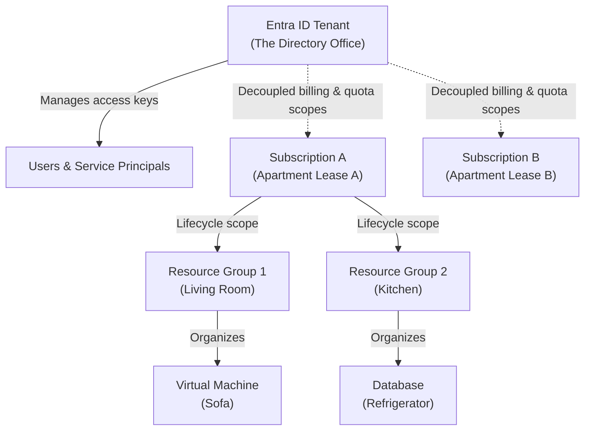
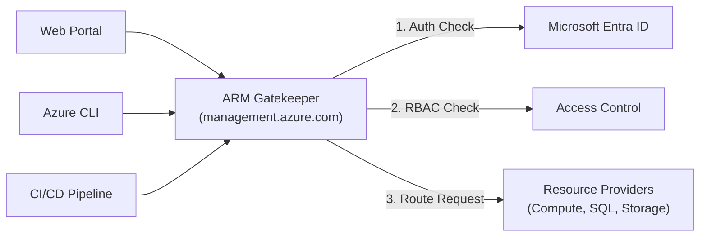

## Table of Contents

1. [Decoupling Identity from Resources](#decoupling-identity-from-resources)
2. [What Carries Over from AWS](#what-carries-over-from-aws)
3. [The Resource Manager Control Gate](#the-resource-manager-control-gate)
4. [Azure Hierarchy: Tenant to Resource](#azure-hierarchy-tenant-to-resource)
5. [The CLI Connection: Interactive Authentication Walkthrough](#the-cli-connection-interactive-authentication-walkthrough)
6. [Under-the-Hood: Inside the ARM Request Pipeline](#under-the-hood-inside-the-arm-request-pipeline)
7. [Mapping the Core Nouns](#mapping-the-core-nouns)
8. [Putting It All Together](#putting-it-all-together)
9. [What's Next](#whats-next)

## Decoupling Identity from Resources

Azure separates your identity from your actual resources. Instead of using one unified account to host both your identity and your physical resources (like you would in the AWS account model), Azure splits them apart. Your users, groups, and permissions live in a central directory, while your actual databases, networks, and virtual machines are organized into separate folders and boxes below that directory.

This split might feel a bit strange at first, especially if you are coming from AWS where accounts are treated as completely independent, self-contained islands. In AWS, if you create an account, you get a built-in IAM directory native only to that account. If you want a second environment, you create a new account, which comes with a completely separate IAM directory, requiring you to configure federated access or duplicate users.

Azure takes a different architectural approach. It decouples the directory boundary (who you are) from the resource and billing boundaries (what you run and who pays for it). Under this model, your company establishes a single, central identity register called a **Microsoft Entra ID Tenant**. This tenant represents your organization. All human user accounts, security groups, app registrations, and non-human service accounts are defined once inside this central tenant.

Separate from this identity tenant are your **Subscriptions**. A subscription is not a directory; it is simply a billing container and a quota pool. Multiple subscriptions can be cabled to the same Entra ID Tenant, trusting that central tenant to verify user credentials and permissions.

You can think of this split like renting apartments in a large complex:



The complex's leasing office is the **Entra ID Tenant**. It is the single office that keeps the master directory of all residents, issues keycards, and verifies security badges. If you want to enter the complex, the leasing office checks your ID.

The actual apartments you rent are the **Subscriptions**. Each apartment has a separate lease agreement and a separate monthly utility bill. You can lease multiple apartments (for example, one for your development team and one for your production services) under the same tenant registration.

Inside each apartment, you have different rooms, which are your **Resource Groups**. You use these rooms to organize your furniture and belongings, which are your actual physical **Resources** (like virtual machines, database servers, and private networks). A resource group is simply a folder that helps you manage the lifecycle of related items—if you decide to move out of the apartment or remodel a room, you can manage all items in that room as a single unit.

This decoupled design is incredibly powerful. It means that when an engineer joins your team, you create their user account exactly once in the central Entra ID Tenant. From that single identity, you can grant them "Reader" access to the production subscription and "Contributor" access to the development subscription. They sign in once, using one set of credentials and one multi-factor authentication prompt, and can easily switch between environments without needing to manage multiple credentials.


*Azure's first mental shift is the split between who signs in and where resources live. One tenant can authenticate the same engineer into many subscription scopes without turning those subscriptions into separate identity directories.*

## What Carries Over from AWS

The good news is that your existing AWS design skills are still highly valuable. The fundamental requirements of a production system do not change just because you switch cloud providers. An API backend still needs virtual CPU cores to run your code, a persistent relational database to store customer records, a secure vault to store secret API keys, and an external workspace to capture logs when something goes wrong.

The physical architecture of the cloud is identical: both AWS and Azure operate massive physical datacenters grouped into geographic regions, connected by high-speed fiber networks, and cooled by massive industrial systems. The difference is simply in the names and how these pieces are organized.

Instead of trying to memorize a flat list of brand names, it is much easier to map these concepts by the operational jobs they perform for your application:

| AWS Architectural Concept | Core Operational Job | Azure Foundation Equivalent |
| :--- | :--- | :--- |
| **AWS Account** | A hard boundary isolating resources, billing, and access. | Entra Tenant (Identity) + Subscription (Costs & Quotas). |
| **Region / Availability Zone** | Geographic hosting areas and physically isolated datacenter facilities. | Azure Region / Azure Availability Zone. |
| **Amazon Resource Name (ARN)** | A globally unique string used to identify a single resource. | Azure Resource ID. |
| **IAM User / IAM Role** | Callers and non-human identities with secure credentials. | Entra User / Managed Identity. |
| **IAM Policy / Resource Policy** | Explicit JSON permissions attached to callers or resources. | Role-Based Access Control (RBAC) Role Assignments. |
| **CloudFormation / AWS CLI** | Control plane interfaces to deploy and manage services. | Azure Resource Manager (ARM), Bicep, and Azure CLI. |

Consider the global resource coordinate challenge. In AWS, every resource is assigned a globally unique Amazon Resource Name (ARN), such as `arn:aws:s3:::my-bucket-name`. In Azure, the equivalent is called a **Resource ID**. While they are styled differently—with Azure using a REST-style directory path—both solve the exact same requirement: they provide an absolute mailing address that locates one specific, absolute instance of a resource, eliminating all search ambiguity across global datacenters.

Similarly, the concept of non-human identity carries over cleanly. In AWS, you use IAM Roles to grant temporary credentials to virtual compute layers. In Azure, you use **Managed Identities**. Both systems exist to solve the exact same security vulnerability: eliminating the need to write hardcoded database passwords, API keys, or access credentials inside your application source code or Docker container images.

## The Resource Manager Control Gate

Every single action you take in Azure goes through a central gatekeeper called the **Azure Resource Manager**, or **ARM** for short. When you click a button in the web portal, run an `az` command in your terminal, trigger a deployment inside a pipeline, or apply a Bicep infrastructure file, your request is sent to a single HTTP REST engine at `management.azure.com`.

You can think of ARM like a central post office. No matter how you choose to address your letter—whether you use a fancy graphical portal, a quick command-line tool, or an automated deploy script—it always lands at the exact same sorting desk.



This central sorting desk design is why Azure can apply the exact same features—like resource locks, metadata tags, and access policies—universally across completely different services. Because every command must pass through ARM's gate, ARM can inspect every request, verify the caller's identity, evaluate security compliance, and log the action before any physical datacenter hardware is touched.

This architecture introduces a vital distinction between what we call the **control plane** and the **data plane**:

*   **The Control Plane (Management)**: This is managed entirely by ARM. It includes any action that modifies the structure or configuration of your cloud infrastructure—like creating a new storage account, modifying a subnet security group, resizing a database instance, or changing a key vault access rule. These actions all write metadata records to the ARM engine.
*   **The Data Plane (Runtime)**: This is handled by the specific service engine itself, bypassing ARM entirely. It includes the actual daily runtime work of your application—like querying rows from a SQL database, writing files to a storage container, or reading a secret API key out of a vault.

Understanding this boundary is crucial for securing a production system. For instance, you can place a management lock on a database to prevent anyone from deleting the database resource through the portal or CLI (control plane). If an engineer or a buggy script attempts to delete the database, ARM will intercept the command at `management.azure.com` and block it instantly.

However, that control-plane lock does not protect the data inside the database (data plane). If a buggy script connects to the database with standard SQL credentials and executes a query that wipes out all tables (e.g., `DROP TABLE Users;`), the request bypasses ARM completely and goes straight to the database engine. The database will gladly execute the command. To protect your system, you must secure both planes independently: using ARM controls for administrative actions, and service-level firewalls, credentials, and encryption for runtime data actions.


*ARM is the administrative checkpoint for Azure changes. Portal clicks, CLI commands, and deployments all pass through the same control gate before a provider is allowed to create, update, or delete a resource.*

:::expand[CanNotDelete Locks Don't Protect Data-Plane Writes]{kind="pitfall"}
Applying a `CanNotDelete` lock to an Azure Resource Group or individual resource is a standard safety measure to prevent accidental deletion via the portal, CLI, or CI/CD pipelines. This control-plane lock, managed by the Azure Resource Manager (ARM) gatekeeper, blocks any HTTP `DELETE` request sent to `management.azure.com`. However, this lock provides zero protection against data-plane operations.

For example, if you place a `CanNotDelete` lock on a resource group containing an Azure SQL Database, an engineer or application with database-level credentials can still connect directly to the database engine and execute a `DROP TABLE` or `DELETE FROM` query. The request goes directly to the database engine's data-plane, bypassing the ARM control gate entirely.

This mirrors the behavior of AWS, where setting termination protection on a CloudFormation stack or RDS database prevents deleting the AWS resource itself, but does nothing to prevent direct database modifications or application-level data deletion.

To understand how locks apply to different actions, consider this comparison:

| Control-Plane Action (ARM REST Call) | Data-Plane Action (Engine Query / API Call) |
| :--- | :--- |
| **Deleting the SQL Server resource**: Blocked by `CanNotDelete` lock | **Dropping a database table via SQL**: Allowed |
| **Deleting the Storage Account**: Blocked by `CanNotDelete` lock | **Deleting a blob file via storage connection string**: Allowed |
| **Deleting a Key Vault**: Blocked by `CanNotDelete` lock | **Deleting a secret value inside the vault**: Allowed |

**Rule of thumb:** Use ARM locks strictly to protect the presence and configuration of your Azure resources. To protect the actual data residing within those resources, you must configure database-level permissions, Entra ID data-plane RBAC (such as Storage Blob Data Owner), and soft delete features.
:::

## Azure Hierarchy: Tenant to Resource

To operate safely, you must follow the strict hierarchical ladder that Azure uses to organize everything from billing down to individual files. This chain determines how costs are tracked, how resource limits are evaluated, and how permissions are inherited down the tree:

1.  **Entra ID Tenant**: The master identity directory representing your entire organization. It contains all human user accounts, security groups, app registrations, and non-human service accounts. This is the absolute root of trust for authentication.
2.  **Management Groups**: High-level folders used to organize and apply compliance policies across multiple subscriptions. If your company has multiple subsidiaries or independent divisions, you can group their subscriptions into management groups. If you apply a security policy here (such as "disallow public storage accounts"), every subscription inside the folder inherits and must follow it.
3.  **Subscriptions**: The primary scope for billing agreements, resource quotas, and access limits. A subscription is connected to an Entra Tenant directory so it knows which users to trust. It acts as the financial container—all physical resources inside a subscription compile their costs onto that subscription's monthly bill.
4.  **Resource Groups**: A mandatory logical folder inside a subscription for the deployable resources your application uses. Most service instances you create, such as web apps, storage accounts, and SQL databases, live inside exactly one resource group. Some Azure objects, such as management groups, subscriptions, policy assignments, role assignments, and other extension or tenant-scope resources, live at higher scopes. Unlike folders on your computer's filesystem, resource groups cannot be nested. These groups are designed to hold resources that share a lifecycle, allowing you to deploy, update, or delete a collection of related services as a single unit.
5.  **Resources**: The physical or logical service instances—such as a container app, a Key Vault, or a SQL database—that perform the actual runtime work and accumulate costs.

## The CLI Connection: Interactive Authentication Walkthrough

To translate this hierarchy into practical command-line experience, you must configure the Azure CLI (`az`) on your terminal. The CLI is your primary operational interface to inspect, query, and verify your Azure boundaries directly from the shell.

Let us execute an interactive terminal session to sign in to Azure, locate our active tenant directory, and list our subscription scopes:

```bash
$ az login
```

This command launches your default system web browser to authenticate your identity. Once completed, the terminal receives the authenticated session tokens and outputs your primary connection profiles:

```json
[
  {
    "cloudName": "AzureCloud",
    "homeTenantId": "11112222-3aaa-4bbb-8888-999999999999",
    "id": "88888888-4444-4444-4444-121212121212",
    "isDefault": true,
    "name": "Production-Orders-Subscription",
    "state": "Enabled",
    "tenantId": "11112222-3aaa-4bbb-8888-999999999999",
    "user": {
      "name": "engineer@devpolaris.com",
      "type": "user"
    }
  }
]
```

Every returned coordinate provides precise operational evidence:

*   `tenantId` & `homeTenantId`: The unique Microsoft Entra directory identifier mapping to your corporate directory. If these IDs do not match your target subscription's directory, you will remain blind to the resources.
*   `id`: The unique Azure Subscription ID. This is the primary billing and quota boundary target.
*   `isDefault`: Indicates whether this subscription is the active context for subsequent command executions.
*   `state`: The billing state (`Enabled`). If this state changes to `Disabled` or `Suspended` due to budget exhaustion or expired credit agreements, ARM will freeze control plane operations.

To inspect the flat subscription tree in tabular format, you run the account query:

```bash
$ az account list --output table
```

This returns a clear list of subscription coordinates:

```text
Name                             CloudName    SubscriptionId                        State    IsDefault
-------------------------------  -----------  ------------------------------------  -------  -----------
Production-Orders-Subscription   AzureCloud   88888888-4444-4444-4444-121212121212  Enabled  True
Staging-Orders-Subscription      AzureCloud   99999999-5555-5555-5555-343434343434  Enabled  False
```

## Under-the-Hood: Inside the ARM Request Pipeline

Behind the scenes, when you run a CLI command or deploy a resource, your request enters a highly structured management pipeline. Understanding this pipeline helps you diagnose permission blocks and deployment errors.

When your request hits the global ARM endpoint (`management.azure.com`), the engine executes three sequential validation gates before touching physical datacenter hardware:

### 1. Token Validation
ARM validates the access token passed in your CLI request header. The token is issued by Microsoft Entra ID for the Azure management endpoint, and ARM verifies that the token is signed correctly, intended for the management API, and still valid. If your session is stale or the token is not valid for ARM, the request is rejected immediately at the front gate with a `401 Unauthorized` status.

### 2. Role-Based Access Control (RBAC)
ARM parses the scope path of your request (Tenant -> Subscription -> Resource Group -> Resource) and checks your user account or service principal role assignments. It evaluates whether your active identity holds a role definition (such as `Reader`, `Contributor`, or `Owner`) that permits the requested REST action (e.g. `Microsoft.Compute/virtualMachines/write`). If your active identity lacks the correct role assignment at that specific scope, ARM rejects the request with a `403 Forbidden` status.

### 3. Policy Evaluation
ARM evaluates the request against active Azure Policy definitions assigned to the subscription. If your company has a compliance rule that forbids provisioning resources outside of northern Europe, and you are trying to deploy a service in East Asia, the policy engine blocks the request instantly. It returns a `RequestDisallowedByPolicy` error code, preventing the creation of non-compliant infrastructure.

Only when all three gates are successfully passed does ARM identify the target Resource Provider (e.g. `Microsoft.ContainerApp` or `Microsoft.Sql`) and forward the command parameters to the regional service controller to execute the physical work.

:::expand[Why ARM Uses a Single Global Endpoint]{kind="design"}
Every administrative write operation in Azure can use `management.azure.com`, a global HTTP endpoint. The primary design pressure driving this architecture is developer and tooling uniformity. By using one management endpoint and one resource ID shape, Microsoft makes every SDK, CLI tool, portal interface, policy rule, lock, tag, and Activity Log entry pass through a consistent management layer.

That global endpoint is not a single datacenter-shaped gatekeeper. Azure Resource Manager is distributed across Azure regions and uses DNS-based traffic distribution and failover. A regional outage can still affect the resource provider or resource location that ultimately receives the request, but the ARM front door itself is designed for resiliency across regions and availability zones.

This contrasts with AWS, which exposes many service APIs through regional endpoints such as `ec2.us-east-1.amazonaws.com`. AWS puts more regional endpoint choice in the client and SDK experience. Azure keeps the management URL uniform, then routes the request to the right provider and regional service behind the management layer.

The design differences are summarized below:

| Control Plane Topology | Architectural Benefits | Operational Tradeoffs |
| :--- | :--- | :--- |
| **Global Management Endpoint (Azure ARM)** | Uniform URL structures, centralized compliance engines, and a consistent activity audit model. | The target resource provider or resource region can still be affected by regional outages after ARM forwards the request. |
| **Regional Service Endpoints (AWS)** | Regional endpoint choice is explicit in many service APIs. | Greater SDK and deployment tool complexity; audit and routing behavior is more service-specific. |

**Rule of thumb:** Keep critical runtime recovery paths decoupled from manual control-plane operations. For instance, design your application to scale out automatically using preconfigured rules, healthy standby capacity, or service-native failover rather than relying on a person to create new resources during an outage.
:::

## Mapping the Core Nouns

To coordinate cloud services across teams, you must move beyond generic titles and align on the exact Azure terminology:

| App Core Need | Generic Architectural Concept | Azure Core Resource Noun |
| :--- | :--- | :--- |
| **Workspace Boundaries** | Workload folders and environments. | Subscription + Resource Group. |
| **Application Runtime** | Managed container engine. | Azure Container App / App Service. |
| **Structured Records** | Relational database engine. | Azure SQL Database. |
| **Object Files** | High-volume persistent storage. | Blob Storage Container. |
| **Secret Management** | Secure API key and cert engine. | Azure Key Vault. |
| **Operational Signals** | Application metrics and logs. | Log Analytics Workspace. |

This terminology ensures that your team communicates in exact management nouns. Instead of discussing a "container on the dev account," you will review "an Azure Container App resource inside `sub-orders-dev` cabled to a Log Analytics target workspace."

## Putting It All Together

Operating a secure, transparent cloud deployment requires moving from workstation assumptions to Azure's directory and scope hierarchy:

*   **Distinguish Directory from Resource**: Separate Microsoft Entra directory identity (who the caller is) from Subscription billing and quota scopes (where the resource lives).
*   **Route through the Control Gate**: Recognize that all administrative changes pass through Azure Resource Manager (ARM), enforcing unified authorization, RBAC, and Policy boundaries.
*   **Audit Control vs. Data**: Deploy management protections like locks at the control plane tier while securing database and key vault actions at the data plane tier.
*   **Master the CLI Scope**: Run `az login` and `az account list` in your shell to verify active tenant IDs, subscription parameters, and default context coordinates.
*   **Track the Hierarchy Chain**: Align all infrastructure configurations with the structured path from Entra tenants down to management groups, subscriptions, resource groups, and resources.

## What's Next

We have established the core Azure mental model, directory boundaries, ARM control pipeline, and hierarchy layout. Now we are ready to make a placement decision. In the next article, we will go deep into placement boundaries. We will explore subscription partition strategies, resource group scopes, regional selection rules, and logical availability zone architectures.


*Use this as the short mental checklist: separate identity from resource scope, route administrative changes through ARM, protect the control and data planes separately, and speak in exact Azure nouns when coordinating across teams.*

---

**References**

* [Azure Resource Manager Overview](https://learn.microsoft.com/en-us/azure/azure-resource-manager/management/overview) - Core architecture of the Azure control plane.
* [Microsoft Entra ID Fundamentals](https://learn.microsoft.com/en-us/entra/fundamentals/what-is-entra) - Directory identity and tenant boundaries.
* [Azure Hierarchy and Management Scopes](https://learn.microsoft.com/en-us/azure/governance/management-groups/overview) - Organization of tenants, subscriptions, and resource groups.
* [Azure CLI Authentication Guide](https://learn.microsoft.com/en-us/cli/azure/authenticate-azure-cli) - Shell sign-in patterns and account context settings.
